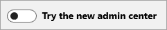

# Informationen zum neuen Microsoft 365 Admin Center

::: moniker range="o365-worldwide"

Das neue Microsoft 365 Admin Center wurde für IT-Teams als vereinfachte Möglichkeit zur Verwaltung Ihrer Microsoft 365-Dienste entwickelt. Das Admin Center bietet eine maßgeschneiderte Erfahrung basierend auf den spezifischen Anforderungen ihrer Rolle oder Organisation, verbessert die Effizienz für alltägliche Aufgaben und bietet umsetzbare Einblicke, mit denen Sie datengesteuerte Entscheidungen treffen können, um Ihren Benutzern eine bessere Benutzerfreundlichkeit zu bieten.

Das Microsoft 365 Admin Center ist der allgemeine Einstiegspunkt für alle Microsoft 365-Administratoren und kann unter [https://admin.microsoft.com](https://go.microsoft.com/fwlink/?linkid=2024339)verwendet werden. Spezielle Arbeitsbereiche wie Sicherheit oder Geräteverwaltung ermöglichen eine präzisere Steuerung. Weitere Informationen zur Zusammenarbeit der Verwaltungszentren finden Sie unter Was ist [mit den spezifischen Typen von IT-Rollen und anderen Arbeitsbereichen wie Sicherheit, Geräteverwaltung oder Exchange?](#what-about-the-specific-types-of-it-roles-and-other-workspaces-like-security-device-management-or-exchange) weiter unten in diesem Artikel.

::: moniker-end

::: moniker range="o365-21vianet"

Das neue Microsoft 365 Admin Center, das sich derzeit in der Vorschau befindet, wird für IT-Teams als vereinfachte Möglichkeit zur Verwaltung Ihrer Microsoft 365-Dienste entwickelt. Das Admin Center bietet eine maßgeschneiderte Erfahrung basierend auf den spezifischen Anforderungen ihrer Rolle oder Organisation, verbessert die Effizienz für alltägliche Aufgaben und bietet umsetzbare Einblicke, mit denen Sie datengesteuerte Entscheidungen treffen können, um Ihren Benutzern eine bessere Benutzerfreundlichkeit zu bieten.

Das Microsoft 365 Admin Center ist der häufigste Einstiegspunkt für alle Microsoft 365-Administratoren und kann durch Anmeldung bei erreicht werden [https://portal.partner.microsoftonline.cn/AdminPortal/Home#/homepage](https://go.microsoft.com/fwlink/p/?linkid=850627). Darüber hinaus ermöglichen spezialisierte Arbeitsbereiche wie Azure Active Directory und Exchange eine präzisere Steuerung. Sie können auf die Spezial Arbeitsbereiche im Navigationsbereich im Microsoft 365 Admin Center zugreifen.

::: moniker-end

::: moniker range="o365-worldwide"

Sobald neue Features im Microsoft 365 Admin Center verfügbar sind, können Sie sich in das neue Admin Center einwählen und Ihr Feedback bei Microsoft freigeben, damit wir die Administrator Erfahrung weiter verbessern können. Wenn Sie sich anmelden, gibt es keine Auswirkungen auf Ihre Benutzer, und Sie können jederzeit wieder zum alten Admin Center wechseln.
[Neuerungen im neuen Microsoft 365 Admin Center](whats-new-in-preview.md).
  
> [!NOTE]
> Gezielte Release-Administratoren haben ersten Zugriff auf neue Features. Neue Features werden dann für alle Administratoren bereit gesetzt. Dies bedeutet, dass das neue Admin Center möglicherweise nicht angezeigt wird, oder es sieht möglicherweise anders aus als in den Hilfeartikeln beschrieben. Um zu den ersten zu gehören, die neue Funktionen sehen, lesen Sie teilnehmen am neuen Admin Center weiter unten. 
    
## Teilnahme am neuen Admin Center
Wir würden uns freuen, wenn Sie am neuen Microsoft 365 Admin Center teilnehmen, damit Sie sich auf Änderungen vorbereiten und uns Feedback geben können.

### Aktivieren der gezielten Veröffentlichung

1. Melden Sie sich bei [Admin.Microsoft.com](https://admin.microsoft.com)an, wechseln Sie zum Navigationsbereich, und wählen Sie **Organisationsprofil**für **Einstellungen** \> aus.

1. Melden Sie sich bei [Portal.Partner.microsoftonline.cn](https://go.microsoft.com/fwlink/p/?linkid=513813)an, wechseln Sie zum Navigationsbereich, und wählen Sie **Organisationsprofil**für **Einstellungen** \> aus.

2. Wechseln Sie zur Karte **Freigabeeinstellungen** , und wählen Sie dann **Bearbeiten**aus. 
    
3. Wählen Sie entweder **Targeted Release for everyone** oder **Targeted Release für ausgewählte Benutzer**aus. Wenn Sie "Targeted Release" für ausgewählte Benutzer auswählen, stellen Sie sicher, dass Sie Ihr Administratorkonto (und alle anderen Administratoren in Ihrer Organisation, die teilnehmen möchten) der Liste der ausgewählten Benutzer hinzufügen.
    
### Wechseln zum neuen Admin Center und wieder zurück

- Wenn Ihnen das neue Microsoft 365 Admin Center zur Verfügung steht, können Sie sich anmelden, indem Sie die Schaltfläche **Neues Admin Center** wechseln oben auf der Startseite auswählen. Wenn Sie sich beim Admin Center abmelden, merken wir Ihre Auswahl und melden sich wieder beim neuen Admin Center an.    
  
- Wechseln Sie zurück zum alten Admin Center von der Startseite, indem Sie die Umschaltfläche auf **aus**umschalten.   

Während Sie sich im neuen Admin Center befinden, können Sie Microsoft Feedback zu ihren Erfahrungen geben, indem Sie **Feedback** direkt neben der Schaltfläche **need help?** unten auf jeder Seite auswählen. Sagen Sie uns, was Ihnen gefällt und was wir besser tun können. Darüber hinaus erhalten Sie möglicherweise von Zeit zu Zeit Popup-Umfragen, in denen Sie sich über Ihre Gesamt Impressionen oder eine bestimmte Erfahrung informieren, die neu veröffentlicht wurde. Sie können auch am Ende dieses Artikels Feedback geben, indem Sie die **Informationen hilfreich** ausgewählt haben?
  
Wenn Sie im neuen Admin Center eine Early adopterin sein möchten, müssen Sie die Option "Targeted Release" aktivieren und dann, wenn das neue Admin Center verfügbar ist, zum Auschecken und Feedback zur Verfügung stellen.
  
> [!NOTE]
> Der Zugriff auf das neue Admin Center wird für alle Microsoft 365-Administratoren ausgeführt. Administratoren, die sich in der Gruppe der gezielten Versionen in Ihrer Organisation befinden, erhalten zuerst das neue Admin Center. Die gezielte Veröffentlichung garantiert nicht, dass Sie die Umschaltfläche sofort sehen, Sie werden Sie jedoch früher als die in der Standard Version erhalten. 
  
::: moniker-end

::: moniker range="o365-21vianet"

### Wechseln zum neuen Admin Center und wieder zurück

Während sich das neue Admin Center in der Vorschau befindet, können Sie zwischen dem neuen Admin Center und dem alten Admin Center wechseln, indem Sie die Umschaltfläche oben auf der Admin Center-Startseite verwenden. Das neue Admin Center ist voll funktionsfähig und verfügt über alle Funktionen des alten admin Centers.

Um das neue Admin Center auszuprobieren, drehen Sie die Umschaltfläche, um <b>die Vorschau zu testen</b>. Die Umschaltfläche wird dann <b>in der Vorschau</b>angezeigt. Wenn Sie sich das nächste Mal beim Admin Center anmelden, merken wir Ihre Auswahl und melden sich beim neuen Admin Center an.

Um zur Verwendung des alten admin Centers zurückzukehren, schalten Sie die Umschaltfläche von der <b>Vorschau auf</b> die Position aus. Wenn Sie sich das nächste Mal beim Admin Center anmelden, melden wir Sie beim alten Admin Center an.

::: moniker-end

::: moniker range="o365-worldwide"

## Häufig gestellte Fragen

Sie können Ihre Fragen hier nicht beantworten? Wechseln Sie zum Abschnitt **Feedback** unten auf dieser Seite, und stellen Sie Ihre Frage. 
  
## Kann ich im neuen Admin Center alles tun, was ich im alten Admin Center tun kann?

Ja. Das neue Admin Center ist voll funktionsfähig und verfügt über alle Funktionen des alten admin Centers.
  
## Welche Microsoft 365-Pläne stehen für Test-oder Kaufversionen zur Verfügung?

Microsoft 365 ist eine vollständige, intelligente Lösung, die Office 365, Windows 10 und Enterprise Mobility + Security umfasst, die es allen ermöglicht, sicher kreativ zu sein und zusammenzuarbeiten. Die folgenden Microsoft 365-Abonnements sind im Admin Center verfügbar, damit Sie jetzt versuchen oder kaufen können:
  
- Microsoft 365 für Unternehmen
- Microsoft 365 Enterprise E3
- Microsoft 365 Enterprise E5
    
Weitere Informationen finden Sie unter [Testen oder kaufen eines Microsoft 365-Abonnements](../commerce/try-or-buy-microsoft-365.md).

## Ich habe einen Fehler gefunden, oder ich möchte eine Funktionserweiterung anfordern. Wie kann ich Microsoft informieren?

Wir freuen uns, von Ihnen zu hören! Das Melden von Fehlern und das Freigeben von Feedback hilft uns, das Microsoft 365 Admin Center zu verbessern. Um Feedback zu geben, wählen Sie die **Feedback** Schaltfläche unten auf der Seite aus, und verwenden Sie das Formular, um uns Ihre Gedanken zu senden. Aktivieren Sie das Kontrollkästchen, und bestätigen Sie Ihre e-Mail-Adresse, wenn Sie möchten, dass eine Person im Microsoft 365 Admin Center-Team Ihre Kommentare weiter verfolgt. Wir können nicht versprechen, jedes Feedback zu verfolgen, aber wir werden es versuchen! 
  
Sie können auch Feedback von außerhalb des Admin Centers in unserem UserVoice-Forum geben. Sie können diese Seite verwenden, um Vorschläge für Features zu machen, auf die von anderen Benutzer Foren abgestimmt werden kann: [UserVoice Forum für das neue Admin Center](https://go.microsoft.com/fwlink/?linkid=2024994).

## Was ist mit den spezifischen Typen von IT-Rollen und anderen Arbeitsbereichen wie Sicherheit, Geräteverwaltung oder Exchange?

Das Microsoft 365 Admin Center ist der allgemeine Einstiegspunkt für alle Teams und Rollen, die Microsoft 365 verwalten. Die Erfahrung, die Informationen und die Steuerelemente sind für jeden Administrator und jede Rolle zugeschnitten und anpassbar. Darüber hinaus ermöglichen spezielle Arbeitsbereiche eine Tiefe, granulare Steuerung. Zu diesen speziellen Arbeitsbereichen gehören SharePoint &amp; , Teams Skype, Exchange, Sicherheit, Compliance, Geräteverwaltung und Azure Active Directory. Die Spezial Arbeitsbereiche finden Sie im Navigationsbereich im Microsoft 365 Admin Center unter [https://admin.microsoft.com](https://go.microsoft.com/fwlink/?linkid=2024339).
  
Das Aktualisieren aller Admin Center auf eine kohärente Umgebung dauert eine Weile, aber Sie können mehr über die Admin Center erfahren, die wir bereits mit der Überarbeitung begonnen haben:
  
- [Erste Schritte mit dem neuen SharePoint Admin Center](https://go.microsoft.com/fwlink/?linkid=2024186)
    
- [Verwalten von Teams während des Übergangs zum neuen Microsoft Teams &amp; Skype for Business Admin Center](https://go.microsoft.com/fwlink/?linkid=2024308)
    
- [Übersicht über die Microsoft 365-Geräteverwaltung](https://go.microsoft.com/fwlink/?linkid=2006262)
    
- [Einführung in das Microsoft 365 Security and Compliance Center](https://go.microsoft.com/fwlink/?linkid=2025413)

::: moniker-end