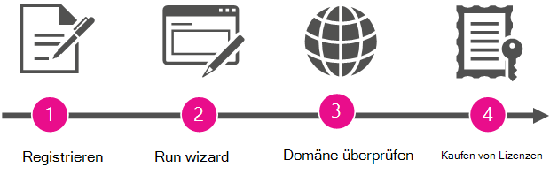

# Administrator werden und Office 365 für Ihre Organisation kaufenBecome the admin and purchase Office 365 for your organization

[] Microsoft gestaltet es für Personen in Ihrer Organisation ganz einfach, sich für Produktivitätstools und Dienste zu registrieren und diese zu verwenden, ohne auf eine formelle Bereitstellung durch Ihre IT-Abteilung warten zu müssen.Microsoft makes it simple for people in your organization to sign up and use productivity tools and services without waiting for formal deployment by your IT department.
  
Ihre Organisation kann es diesen Personen gestatten, diese Dienste "wie besehen" weiterhin zu verwenden. Wenn sich jedoch Personen für Skype-Besprechungen als einen dieser Dienste registriert haben, können Sie einen Administrator zuweisen, um ein Upgrade durchzuführen und eine vollständigere Besprechungslösung mit Skype for Business, Office-Anwendungen, Dateispeicherung und -freigabe usw. zu erhalten.Your organization can let people continue to use these services "as is." But if people signed up for Skype Meetings as one of those services, you can assign an admin to upgrade and get a more complete meeting solution with Skype for Business and Office applications, file storage and sharing, and more.
  
## Warum zum Administrator werden und Office 365 für Ihre Organisation kaufen?Why become the admin and buy Office 365 for your organization?

Wenn sich ein Mitarbeiter mit seinem Firmenkonto für Skype-Besprechungen registriert, kann er den Dienst nicht verwalten. Zudem erhalten sie lediglich die grundlegenden Features: Sie können unbegrenzt viele Besprechungen ansetzen, jedoch nur mit maximal 10 Teilnehmern (nach 60 Tagen beträgt die maximale Teilnehmeranzahl nur noch drei Personen).When an employee signs up for Skype Meetings with their work account, they can't manage the service. And they get only the most basic features: they can have unlimited meetings but only with 10 or fewer participants (after 60 days, the maximum participants is three people). 
  
Wenn Sie einen Administrator für den Dienst einrichten und Office 365 für Ihre Benutzer kaufen, erhalten sie erweiterte Features. Und Sie erhalten die Möglichkeit zur Verwaltung der Dienste, damit Sie Richtlinien erzwingen und neue Benutzer hinzufügen können.When you set up an admin for the service and buy Office 365 for your users, they get more advanced features. And you get the ability to manage the services, so you can enforce policies and add new users.
  
Als Bonus erhalten Sie rund um die Uhr telefonischen Support.As a bonus, you get 24/7 phone support.
  
## So werden Sie AdministratorHow to become the admin

Um Administrator zu werden, müssen Sie zuerst beweisen, dass Sie Besitzer der Domäne sind, auf der sich Benutzer registriert haben (z. B. contoso.com). Dann führen Sie ein Upgrade auf Office 365 für alle Benutzer im Unternehmen aus, die bereits Skype-Besprechungen verwenden. Ein Assistent führt Sie durch die Schritte.To become the admin, you'll first prove that you own the domain that people signed up with (like contoso.com). Then you'll upgrade to Office 365 for everyone in the company who is already using Skype Meetings. A wizard walks you through the steps.
  
> [!NOTE]
> Zum Administrator zu werden und das Upgrade auf Office 365 durchzuführen sind Teil desselben Prozesses. Sie können kein Upgrade durchführen, ohne zuerst Administrator zu werden, und Sie können die Dienste nicht als Administrator verwalten, sofern Sie nicht auch ein Upgrade auf Office 365 durchführen.Becoming the admin and upgrading to Office 365 are part of the same process. You can't upgrade without first becoming the admin, and you can't manage the services as an admin unless you also upgrade to Office 365. 
  
 **Warum bitten wir Sie, nachzuweisen, dass Sie der Besitzer der Domäne sind?****Why do we ask you to prove that you own the domain?** Da alle Personen, die sich mit einer e-Mail-Adresse in derselben Domäne anmelden (beispielsweise Rob@contoso.com und Sara@contoso.com), nach dem Domänennamen gruppiert werden.Because everyone who signs up with an email address on the same domain (say, rob@contoso.com and sara@contoso.com) is grouped together by the domain name. Wir entscheiden, zu welcher Gruppe jede Person gehört, indem der Domänenteil Ihrer e-Mail-Adressen (wie contoso.com), sodass Personen aus der gleichen Organisation zusammenarbeiten können.We decide what group each person belongs to by the domain portion of their email addresses (like contoso.com), so people from the same organization can work together. Da Sie derselben Gruppe angehören, können Sie miteinander zusammenarbeiten.Because they belong to the same group, they can collaborate with each other.
  
Damit Sie Administrator der Gruppe werden, bestätigen Sie, dass Sie Besitzer der Domäne sind, unter der sämtliche Personen in Ihrer Organisation gruppiert werden. Wenn Sie über die Berechtigung zum Nachweisen des Domänenbesitzes verfügen (indem Sie sich dort anmelden, wo die Domäne verwaltet wird), ist es sinnvoll, dass Sie die Office 365-Dienste für Personen verwalten können, die diese Domäne verwenden.To become the admin for the group, you verify that you own the domain that everyone in your organization is grouped under. If you have the authority to prove domain ownership (by signing in where the domain is managed), it makes sense that you can manage Office 365 services for people using that domain.
  
Nachdem Sie Administrator geworden sind, können Sie bei Bedarf auch neue Benutzer hinzufügen oder Richtlinien erzwingen.After you become the admin, you can also add new users or enforce policies, if you like.
  
## SchritteübersichtOverview of the steps

  
Ein Assistent führt Sie schrittweise durch den Vorgang, aber hier folgt eine Zusammenfassung der einzelnen Schritte.A wizard guides you through the process, but here's a summary of each step.
  
|||
|:-----|:-----|
||**Registrierung**: Bevor Sie Administrator werden können, müssen Sie mit Ihrer geschäftlichen E-Mail-Adresse bereits für Skype-Besprechungen registriert sein.**Sign up** Before you can become the admin, you must already be signed up for Skype Meetings with your work email address.    |
||**Assistent ausführen**: Nach der Registrierung führen Sie den Assistenten aus, indem Sie einen der folgenden Schritte ausführen:**Run the wizard** After you've signed up, run the wizard by doing one of the following:     Führen Sie den Assistenten **als Administrator werden** aus, der nach der Auswahl von **Administrator** im App-Startfeld angezeigt wird.Run the **Become the admin** wizard that appears after selecting **Admin** in the app launcher .     ODEROR     Wählen Sie ein **Upgrade auf Office 365** in Skype-Besprechungen aus, und wählen Sie dann das Office 365 Abonnement aus, auf das ein Upgrade ausgeführt werden soll.Choose to **Upgrade to Office 365** in Skype Meetings, and then select the Office 365 subscription you want to upgrade to.    |
||**Domänenbesitz bestätigen**: Als nächstes bestätigen Sie für Office 365, dass Sie den Domänennamen (wie contoso.com) besitzen oder verwalten, der den E-Mail-Adressen Ihrer Organisation zugeordnet ist. Nur der Besitzer des Domänennamens verfügt über die Berechtigung zur Ausführung dieses Vorgangs.  **Verify domain ownership** Next, you'll verify to Office 365 that you own or manage the domain name (like contoso.com) that's associated with your organization's email addresses. Only the owner of the domain name has the authority to do this.    |
||**Lizenzen kaufen**: Im letzten Schritt des Assistenten kaufen Sie Office 365-Lizenzen für jede Person in Ihrer Organisation, die sich mit der E-Mail-Adresse ihres Geschäftskontos bei Skype-Besprechungen registriert hat.**Buy licenses** In the last step in the wizard, you'll buy Office 365 licenses for each person within your organization who's signed up for Skype Meetings with their work email.    Wenn sich beispielsweise zwei Benutzer mit der E-Mail-Adresse ihres Geschäftskontos für Skype-Besprechungen registriert haben, müssen Sie zwei Lizenzen kaufen - eine Lizenz pro Person.For example, if two users have signed up for Skype Meetings with their work email, you'll need to buy two licenses—one for each of them.    > [!NOTE]> Sie können Office 365 nicht verwalten, bis Sie die Lizenzen gekauft haben.> [!NOTE]> You can't manage Office 365 until after you've bought the licenses.           |

## Ihr Office 365-AbonnementYour Office 365 subscription

Nachdem Sie die Domäne bestätigt und Lizenzen erworben haben, wird für Ihre Organisation ein Upgrade auf Office 365 durchgeführt. Dadurch werden auch die persönlichen Einstellungen des Abonnements für Skype-Besprechungen übertragen (zum bezahlten Abonnement), das einzelne Benutzer verwendet haben.After you've verified the domain and bought licenses, your organization is upgraded to Office 365. This also transfers (to the paid subscription) the personal settings from the Skype Meetings subscription that individual users were using.
  
Das Office 365-Abonnement, auf das für Ihre Organisation ein Upgrade ausgeführt wird, hängt vom verwendeten Assistenten ab:The Office 365 subscription that your organization is upgraded to depends on which wizard you used:
  
|||
|:-----|:-----|
|**Wie der Assistent gestartet wurde****How the wizard was launched**   |**Abonnementoptionen****Subscription options**   |
|Mithilfe der Kachel "Administrator" im App-StartfeldBy using the Admin tile in the app launcher    |Office 365 Business EssentialsOffice 365 Business Essentials    |
|Durch Auswahl von **Upgrade auf Office 365** in Skype-BesprechungenBy choosing **Upgrade to Office 365** in Skype Meetings    |Office 365 Business Essentials oder Office 365 Business PremiumOffice 365 Business Essentials or Office 365 Business Premium    |
   
## Nächste SchritteWhat's next?

Nun, da Sie der Administrator sind, können Sie die folgenden Aktionen ausführen:Now that you're the admin, you may want to do the following:
  
|\*\*\*\*Aufgabe\*\*\*\*\*\*\*\*Task\*\*\*\*|\*\*\*\*Details\*\*\*\*\*\*\*\*Details\*\*\*\*|
|:-----|:-----|
|Lizenzen hinzufügen oder entfernenAdd or remove licenses    |Sie können [Weitere Lizenzen für Benutzer hinzufügen](../../commerce/licenses/buy-licenses.md) , die noch nicht Office 365 verwenden, oder [Lizenzen von Benutzern entfernen](../manage/remove-licenses-from-users.md) , die nicht mit dem Office 365 Abonnement Ihrer Organisation verwendet werden sollen.You can [add more licenses](../../commerce/licenses/buy-licenses.md) for users who aren't using Office 365 yet, or [remove licenses from users](../manage/remove-licenses-from-users.md) that you don't want using your organization's Office 365 subscription.    |
|Andere Benutzer kontaktieren, die sich bereits registriert habenContact others who already signed up    |Wenden Sie sich an die anderen Benutzer, und teilen Sie ihnen mit, dass Sie ihr Office 365-Abonnement verwalten. Informieren Sie sie zudem darüber, dass ein Upgrade durchgeführt wurde. [Gehen Sie folgendermaßen vor](../add-users/add-users.md), um eine Liste **aktiver Benutzer** und ihrer E-Mail-Adressen anzuzeigen.  Reach out to the other users and let them know that you're managing their Office 365 subscription and that they've been upgraded. [Follow these steps](../add-users/add-users.md) to see a list of **Active Users** and their email addresses.    |
|Einstieg in die Verwendung von Office 365Start using Office 365    |Besuchen Sie das [Office 365-Schulungscenter](https://support.office.com/learn/office365-for-business), und erfahren Sie, wie Sie sich anmelden, E-Mails überprüfen, Dokumente freigeben und mehr. Sie und Ihre Benutzer können diese Website für die ersten Schritte mit Office 365 nutzen.  Visit the [Office 365 Learning Center](https://support.office.com/learn/office365-for-business) and learn how to sign in, check email, share documents, and more. You and your users can use this site to get started with Office 365.    |
|Verwalten Ihres Office 365-AbonnementsManage your Office 365 subscription    |Besuchen Sie [Office 365 admin-Hilfecenter](../admin-home.md) , und erfahren Sie mehr über häufige administrative Aufgaben wie das Hinzufügen und Entfernen von Benutzern, das Zurücksetzen von Kennwörtern und das Einrichten von mobilen Geräten.Visit [Office 365 Admin help center](../admin-home.md) and learn common administrative tasks like adding and removing users, resetting passwords, and setting up mobile devices.    |

## Benötigen Sie weitere Hilfe?Still need help?

[Anrufen des Microsoft-SupportsCall Microsoft support](../contact-support-for-business-products.md)
