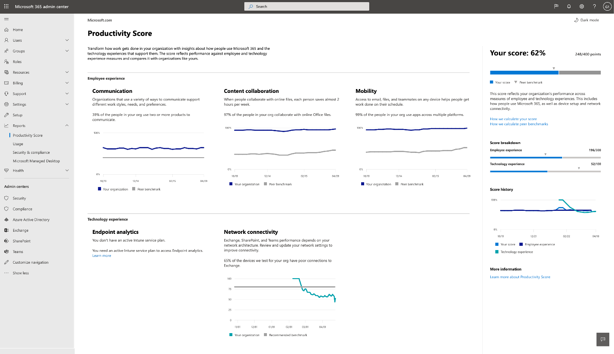

# Microsoft Produktivitätsbewertung (Vorschau)

Die Produktivitäts Bewertung unterstützt Organisationen beim Transformieren der Arbeit mit Einblicken in die Verwendung von Microsoft 365 und den Technologie Erfahrungen, die diese Benutzer unterstützen. Die Bewertung spiegelt die Leistung Ihrer Organisation anhand von Maßnahmen zur Mitarbeiter-und Technologie Erfahrung wider und vergleicht Ihre Bewertung mit Organisationen wie Ihrem.

Die Partitur umfasst Folgendes:

- **Metriken** , mit denen Sie sehen können, wie Benutzer Microsoft 365-Produkte für die Zusammenarbeit, die Kommunikation und die plattformübergreifende Arbeit verwenden.
- **Einblicke** in die Daten, die Sie bei der Ermittlung von Möglichkeiten zur Verbesserung der Produktivität und Zufriedenheit von Mitarbeitern unterstützen.
- **Empfohlene Maßnahmen** , die Sie ergreifen können, um den Personen in Ihrer Organisation zu helfen, Microsoft 365-Produkte effizient zu verwenden, damit jeder seine besten Aufgaben ausführen kann.

Wir stellen Daten, Einblicke und Empfehlungen in zwei Bereichen zur Verfügung: 

- **Mitarbeiter Erfahrung:** Wir messen, wie Personen an Inhalten zusammenarbeiten, wie Microsoft 365-Produkte für die Kommunikation verwendet werden und ob Microsoft 365 plattformübergreifend verwendet wird. 

    Diese Einblicke bieten wir, da Personen, die Online zusammenarbeiten, Zeit sparen. Wenn Sie die Freiheit haben, auf einem Gerät zu arbeiten, sind Sie produktiver und zufriedener. Wenn Sie auf flexible Weise kommunizieren können, sind Sie effizienter, bilden bessere Beziehungen und Ihre Organisation ist einheitlicher. Hinweise finden Sie unter [Forrester Report](https://vc2prod.blob.core.windows.net/vc-resources/TEIStudies/TEI%20of%20Microsoft%20365%20E5%20-%20Oct%202018.pdf).

- **Technologie Erfahrung:** Die Produktivität hängt von der zuverlässigen und leistungsfähigen Technologie sowie der effizienten Nutzung von Microsoft 365 ab. Wir stellen Endpoint Analytics zur Verfügung, die Ihnen Einblicke und Empfehlungen zum Einrichten und starten von Geräten gibt und Microsoft 365-Netzwerkkonnektivitäts-Einblicke für Ihre Organisation bereitstellt.

Weitere Informationen zur Endpunktanalyse finden Sie [unter Übersicht über die Netzwerkkonnektivität](https://docs.microsoft.com/office365/enterprise/office-365-networking-overview).
  

## Berechnung der Bewertung

Ihr Produktivitäts Ergebnis basiert auf den kombinierten Bewertungen ihrer Mitarbeiter-und Technologie Erlebnis Kategorien. Jede Kategorie wird gleich gewichtet, mit einer Gesamtsumme von 100 Punkten pro Kategorie. Die möglichen Punkte für das Produktivitäts Ergebnis sind 500.

### Bewertungskategorien 

- Zusammenarbeit mit Inhalten (100 Punkte)
- Kommunikation (100 Punkte)
- Mobilität (100 Punkte)
- Endpunktanalyse (100 Punkte)
- Netzwerkkonnektivität (100 Punkte)
- **Insgesamt möglich = 500 Punkte**
 
 In jeder Kategorie identifizieren wir Muster für wichtige Aktivitäten, die Indikatoren für die Verwendung von Microsoft 365-Produkten für die Zusammenarbeit, Kommunikation und die plattformübergreifende Arbeit sind. Wir bieten 28-tägige und 180-tägige Ansichten der wichtigsten Aktivitäten. Wir bieten auch unterstützende Metriken, die nicht Teil der Bewertungs Berechnung sind, aber wichtig sind, um Ihnen zu helfen, zugrunde liegende Verhaltensweisen und Einstellungen zu identifizieren, auf die Sie reagieren können, um Änderungen zu steuern.

### In Produktivitäts Bewertung enthaltene Produkte 

Die Produktivitäts Bewertung umfasst Daten aus Exchange, SharePoint, OneDrive, Microsoft Teams, Word, Excel, PowerPoint, OneNote, Outlook, jammern und Skype.

Ihre Punktzahl wird täglich aktualisiert und reflektiert Benutzeraktionen, die in den letzten 28 bis 180 Tagen (einschließlich des aktuellen Tags) abgeschlossen wurden.

## Voraussetzungen 

Sie benötigen ein Microsoft 365 for Business-oder Office 365 for Enterprise-Abonnement, um Mitarbeiter Erfahrungsdaten zu erhalten, und Sie müssen mehr Instanzen basierte Cloud-Dienste verwenden. Um Endpoint Analytics-Daten für Ihren Mandanten zu erhalten, müssen Sie Microsoft InTune zu Ihrem Abonnement hinzufügen. InTune hilft Ihnen, die Daten Ihrer Organisation zu schützen, indem Geräte und apps verwaltet werden.       Sobald Sie InTune haben, können Sie die Endpunktanalyse in der InTune-Umgebung aktivieren. Erfahren Sie mehr über Microsoft InTune. 

Um die Produktivitäts Bewertung für Ihre Organisation anzuzeigen, müssen Sie über eine der folgenden Rollen verfügen: 

- Globaler Administrator 
- Exchange-Administratoren
- SharePoint-Administrator 
- Skype for Business-Administrator 
- Teams Administrator 
- Globaler Leser 
- Berichtleseberechtigter 

Sie können auf die Benutzeroberfläche von Microsoft 365 admin Home unter **Berichte**  >  **Produktivitäts Bewertung**zugreifen.

## Interpretieren der Produktivitätsbewertung 

Auf der Startseite der Produktivitäts Bewertung werden die Gesamtpunktzahl und der Bewertungsverlauf sowie die primäre Einblicke für jede Kategorie angezeigt.

**Ihre Punktzahl** wird als Prozentwert sowie in Punkten angezeigt, sodass Sie Ihre Punkte (Zähler) und maximal mögliche Punkte (Nenner) sehen können.

Anhand von **Peer-Benchmarks** können Sie Ihre Punktzahl mit Organisationen wie Ihrem vergleichen. Für die Kategorien "Employee Experience" wird die Vergleichs Vergleichs Maßnahme als durchschnittliche Anzahl von Measures in einer Gruppe ähnlicher Organisationen berechnet. Das Paket besteht aus Organisationen in Ihrer Region mit einer ähnlichen Anzahl von lizenzierten Benutzern, Lizenztypen, Industrie und Besitz mit Microsoft 365. 

Der Endpunktanalyse-Peer-Benchmark umfasst Ziele für die gerätestart Leistung und die empfohlene Softwarekonfiguration basierend auf aggregierten Median Werten für alle Mandanten.

Für die Netzwerkkonnektivität beträgt die empfohlene Benchmark 80 Punkte.

Der Abschnitt " **Score Breakdown** " bietet einen Überblick über Ihre Produktivitäts Bewertung mit Benchmarks für Mitarbeiter-und Technologie Erfahrungsbereiche.

Der Bewertungsverlauf zeigt, wie sich die Punktzahl in jeder Kategorie in den letzten 6 Monaten geändert hat.

Die Bereiche **Employee Experience** und **Technology Experience** enthalten die primären Einblicke für die Kategorien in diesen Bereichen. Sie können auf jede Kategorie klicken, um tiefere Einblicke zu erhalten.

## Rubriken-Detailseiten

Jede Kategorie-Detailseite enthält die primären Einblicke und unterstützenden Metriken sowie zugehörige Forschung und Aktionen, die Sie zum Steuern der Änderung in Ihrer Organisation durchführen können. Die Forschung unterstützt die Wichtigkeit und die Beweggründe für die primären Einblicke für jede Kategorie. Weitere Informationen finden [Sie im Forrester-Bericht](https://vc2prod.blob.core.windows.net/vc-resources/TEIStudies/TEI%20of%20Microsoft%20365%20E5%20-%20Oct%202018.pdf).

### Details zur Inhalts Zusammenarbeit

Die wichtigste Erkenntnis für die Zusammenarbeit mit Inhalten ist die Anzahl der Personen, die Online erstellen, lesen und zusammenarbeiten (Bearbeiten und freigeben). Diese Maßnahmen sind wichtig, da Untersuchungen zeigen, dass bei der Zusammenarbeit mit Online Dateien jede Person durchschnittlich 100 Minuten oder fast zwei Stunden pro Woche spart.

Wir definieren die Zusammenarbeit von Inhalten als eine Person, die eine Office-Datei erstellt und freigibt, und dann wird Sie von mindestens einer anderen Person bearbeitet. 

Leser: Personen, die in OneDrive oder SharePoint auf Online Dateien zugreifen oder diese herunterladen.

**Ersteller:** Personen, die Online-OneDrive oder SharePoint-Dateien erstellen, ändern, hochladen, synchronisieren, Einchecken, kopieren oder verlagern.

Mitarbeiter: Personen, die mit Online Dateien mit OneDrive oder SharePoint zusammenarbeiten. Zwei Personen sind Mitarbeiter, wenn einer von Ihnen ein Online-Word-, Excel-, PowerPoint-, OneNote-oder PDF-Cloud-Dokument liest oder bearbeitet, nachdem es von der anderen Person innerhalb eines 28-tägigen Fensters erstellt oder geändert wurde.

Die für die Zusammenarbeit in Betracht gezogenen Dateitypen sind Word-, Excel-, PowerPoint-, OneNote-und PDF-Dateien.

Wir bieten Einblicke in die Startzeiten und Einrichten für Geräte in Ihrer Organisation sowie Einblicke in die Netzwerkkonnektivität für die Zusammenarbeit mit Inhalten, da die Zusammenarbeit mit Online-Dateien zuverlässige Geräte erfordert, die schnell starten und über aktuelle Software sowie eine gute Konnektivität mit Microsoft 365 verfügen.

### Kommunikationsdetails

Die wichtigste Erkenntnis für die Kommunikation besteht darin, wie häufig Personen in Ihrer Organisation e-Mails, Chats und Community-Beiträge zur Kommunikation verwenden. Diese Einblicke sind wichtig, da Sie bei Verwendung einer Vielzahl von Echt Zeit Kommunikationstools den Kommunikationsmodus auswählen können, der Sie am effizientesten gestaltet, und über Tools wie Chat und Communities verfügt, die Sie bei der Entwicklung von Beziehungen über Office-Standorte unterstützen.

### Mobilitäts Details

Die primäre Einblicke für Mobilität ist die Anzahl der Personen, die auf Dateien zugreifen und e-Mails und Chats auf mehreren Plattformen verwenden. Die Möglichkeit, von einem beliebigen Standort auf jedem von Ihnen ausgewählten Gerät zu arbeiten, ist für Personen mit Vertriebs Rollen, Führungskräften, Beratern und anderen Benutzern wichtig, die außerhalb des Büros arbeiten müssen, um produktiv zu sein. Verbesserungen für diese Mitarbeiter haben große Auswirkungen. 

Wir messen den Prozentsatz und die absolute Anzahl von Personen, die mindestens eine Microsoft 365-Produktivitäts-App auf zwei oder mehr Plattformen verwendet haben, einschließlich Desktop, Mobiltelefon und Internet. Die Produktivitäts-apps, die wir messen, sind Outlook, Microsoft Teams, Word, Excel, PowerPoint, OneNote, jammern und Skype. Für Personen müssen Microsoft 365-Apps für Enterprise-, Exchange-, Jammer-, Skype-oder Teams-Lizenzen zur Vermessung vorhanden sein. 

## Business Continuity-Spezial Bericht

Der Business Continuity-Bericht ist ein befristeter Arbeitsplatz-Intelligence-Bericht, der allen Microsoft 365-Kunden zur Verfügung steht, um Ihnen zu helfen, ihre Organisationen während dieser schwierigen Zeit zu leiten.  

Dieser Bericht hilft Geschäftsführern, Folgendes zu verstehen: 

- Auswirkungen der Verlagerung auf die Remote Arbeit auf die Zusammenarbeit und Kommunikation 

- Die Auswirkungen auf die Arbeits-und Lebenszeit Balance, während sich die Benutzer an die Arbeit von zu Hause anpassen. 

- Wenn Personen Besprechungen effektiv verwenden und wie Sie 

[Weitere Informationen zum Business Continuity-Bericht](https://aka.ms/bcrps)

[Weitere Informationen zu Microsoft Graph](https://docs.microsoft.com/graph/)

## Wir freuen uns über Ihr Feedback

Bitte teilen Sie Ihre Gedanken zur Produktivitäts Bewertung und ihre Vorstellungen darüber, wie Sie Sie verbessern können. Verwenden Sie die **Feedback** Abschnitte im Produkt und/oder erreichen Sie das Team für die Produktivitäts Bewertung unter ProductivityScorePreview@Service.Microsoft.com.