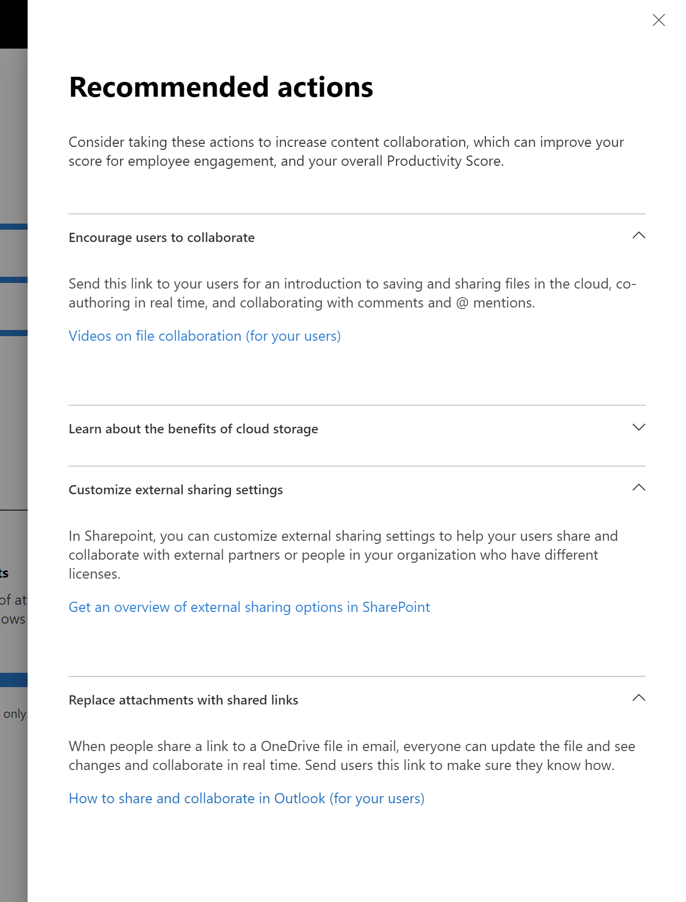

# Microsoft Produktivitätsbewertung (Vorschau)Microsoft Productivity score (Preview)

Microsoft 365 bietet Produktivitätslösungen, die es Ihrer Organisation ermöglichen, Ihre Geschäftsziele zu erreichen.Microsoft 365 offers productivity solutions that enables your organization to meet its business goals. Die Microsoft Produktivitätsbewertung bietet Einblicke, wie Sie mit diesen Lösungen Ihre Arbeit besser erledigen können.Productivity Score provides insights to use these solutions that you can transform to how work gets done.Dazu zählen: It contains: 

- **Transparenz**, indem Ihnen diese Lösungen helfen, zu verstehen, wie Personen hinsichtlich Ihrer aktuellen Bewertung arbeiten. Dabei wird die Bewertung in die Kategorien Mitarbeiter- und Technologieerfahrung aufgegliedert (in Kürze verfügbar).**Visibility** by helping them understand how people work in the form of their current score with breakdown across categories of Employee experience and Technology experience (coming soon). 
- **Einblicke**, die es Ihnen Möglichkeiten eröffnen, diese Erfahrungen zu verbessern.**Insights** to identify opportunities to enable improved experiences. 
- **Aktionen**, um Fähigkeiten und Systeme zu aktualisieren, damit jedes Mitglied Ihrer Organisation seine Arbeit noch besser erledigen kann.**Actions** to update skills and systems so everyone can do their best work. 

Die Bewertung und die Einblicke sind in zwei Kategorien unterteilt:The score and the insights are present across two categories –  

- **Mitarbeitererfahrung:** Diese Kategorie zeigt Ihnen, wie Microsoft 365 beim Aufbau einer produktiven und engagierten Belegschaft hilft. Sie quantifiziert, wie Personen an Inhalten zusammenarbeiten und an welchen Orten sie arbeiten. Außerdem erhalten Sie Informationen über die Art, wie kommuniziert wird (in Kürze verfügbar) und welche Art von Meeting-Kultur sich entwickelt (in Kürze verfügbar).**Employee experience:** shows how Microsoft 365 is helping to create a productive and engaged workforce by quantifying how people collaborate on content, work anywhere, by understanding communication styles (coming soon), and by developing a meeting culture (coming soon) 

- **Technologieerfahrung** (in Kürze verfügbar): Diese Kategorie hilft Ihnen bei der Optimierung Ihrer Geräte, beispielsweise beim präventiven Lösen allgemeiner Helpdesk-Probleme oder bei der Verbesserung der PC-Startzeiten und Ihres Netzwerks. So stellen Sie sicher, dass Ihre Apps gut funktionieren.**Technology experience** (coming soon): Assists you to optimize your device experiences such as proactively fixing common helpdesk issues,  and improving PC startup times and your network to ensure your apps work well.  

## FunktionsweiseHow it works

### BewertungsbereicheAreas of scoring 

Innerhalb der einzelnen Bewertungskategorien bietet die Microsoft Produktivitätsbewertung Einblicke in die Veränderungen ihrer Arbeitsweise in verschiedenen Bereichen.Within each score category, Productivity Score provides insights on your work transformation across areas. Die Bereiche, die in die Mitarbeitererfahrung einbezogen werden, sind:The areas covered within Employee experience are:

- Zusammenarbeit an InhaltenCollaborating on content  
- Mobiles ArbeitenWorking anywhere 
- Verständnis für Kommunikationsformate (in Kürze verfügbar)Understanding communication styles (coming soon) 
- Entwicklung einer Meeting-Kultur (in Kürze verfügbar)Developing a meeting culture (coming soon) 

### Bewertung von BenutzeraktionenScoring user actions 

In jedem Bereich werden die auf wissenschaftlichen Erkenntnissen beruhenden Schlüsselaktionen gemessen. Sie repräsentieren diejenigen Arbeitsweisen, die es Organisationen ermöglichen, besonders produktiv und erfolgreich zu werden.Within each area, we measure the research-based key actions which represent the ways of working that enable organizations to transform into highly productive organization. Für jeden Bereich wird der Prozentwert derjenigen Benutzer berechnet, die diese Aktionen innerhalb der letzten 28 Tage ausgeführt haben.For each area we compute the % of users who perform these actions within the last 28 days. 

Der Wert der Mitarbeitererfahrung wird über alle Bereiche hinweg als Durchschnittswert berechnet.The Employee experience score is curated as an average score across all areas. Bitte beachten Sie, dass wir mit der Zeit die Mitarbeiter- und Technologieerfahrung um weitere Bereiche ergänzen werden.Note that we will keep adding more areas to Employee experience and Technology experience over time. 

### Produkte, die in der Microsoft Produktivitätsbewertung enthalten sindProducts included in the Productivity Score 

Die Microsoft Produktivitätsbewertung erfasst zur Zeit Informationen aus den wichtigsten Microsoft 365-Workloads. Dazu zählen OneDrive, SharePoint, Word, Excel, PowerPoint, OneNote, Outlook, Yammer, Teams und Skype.Productivity Score currently includes signals from the key Microsoft 365 workloads OneDrive, SharePoint, Word, Excel, PowerPoint, OneNote, Outlook, Yammer, Teams, Skype. 

Ihre Bewertung wird täglich aktualisiert und spiegelt Benutzeraktionen wider, die in den letzten 28 Tagen (einschließlich des aktuellen Tags) abgeschlossen wurden.Your score is updated daily and reflects user actions completed in the last 28 days (including the current day).

## Zugriff und erforderliche BerechtigungenAccess and required permissions 

Für die Mitarbeiter Erfahrung benötigen Sie ein Abonnement für einen Microsoft 365 for Business-Plan mit mehreren Benutzern.For the employee experience, you must have a subscription to a Microsoft 365 for business plan with multiple users. 

Um die Berechtigung für den Zugriff auf die Microsoft Produktivitätsbewertung zu erhalten, müssen Sie über die folgenden Rollen verfügen:To have permission to access Microsoft Productivity Score, you must have of the following roles: 

- Globaler AdministratorGlobal admin 
- Exchange-AdministratorenExchange admins 
- SharePoint-AdministratorenSharePoint admins 
- Skype for Business-AdministratorenSkype for Business admins 
- Teams AdministratorTeams admin 
- Globaler LeserGlobal Reader 
- BerichtleseberechtigterReports Reader 

Sie können auf die Produktivitätsbewertung mithilfe der Benutzeroberfläche von Microsoft 365 Administrator Home zugreifen, indem Sie im linken Navigationsbereich **Berichte** > **Produktivitätsbewertung** auswählen.You can access the experience from Microsoft 365 Admin home by choosing **Reports** > **Productivity Score** in the left navigation.

## Interpretieren der ProduktivitätsbewertungInterpreting Productivity Score 

### Erfahren Sie, wie Ihre Organisation arbeitetLearn how your organization works 

Auf der Startseite der Produktivitätsbewertung werden die aktuelle Bewertung und Bewertungshistorie als Prozentwert angezeigt. Die wichtigsten Einblicke in die einzelnen Kategorien werden durch Benchmarks ergänzt.he Productivity Score home page provides the current score and history on a percentage basis, primary insights for areas within each score category supplemented by benchmarks. 

1. Die **Produktivitätsbewertung** wird als Prozentwert sowie im <numerator>/<denominator>-Format angezeigt, sodass Sie sich auch Ihre absoluten Punkte (Zähler) und die höchste erreichbare Punktzahl anzeigen lassen können.1.**Productivity Score** is listed on a percentage basis as well as in the <numerator>/<denominator> format so you can also see your absolute points (numerator) and maximum possible points  
1. Mit dieser Pivotleiste können Sie die Bewertungskategorie auswählen, auf die Sie Ihr Hauptaugenmerk richten möchten.This pivot allows you to select the score category you want to focus on. In der Vorschau können Sie sich nur die **Mitarbeitererfahrung** ansehen, diese Auswahl wird aber in Kürze erweitert und enthält dann auch die **Technologieerfahrung**.In the preview, you can only view **Employee experience**, but the selection will soon expand to include **Technology experience**. 
1. Mit der **Peer-Benchmark** können Sie Ihre aktuelle Bewertung mit der ähnlicher Organisationen vergleichen.**Peer benchmark** allows you to compare your current score with organizations like you. Das Benchmark-Maß ist dabei der Mittelwert einer Gruppe vergleichbarer Organisationen.The benchmark measure is calculated as the average of measures within a set of similar organizations. Die Benchmark-Gruppe besteht aus Organisationen, die eine ähnliche Anzahl an aktivierten Benutzern, Regionen, Lizenzarten und Geschäftsfeldern hat wie Ihre und Microsoft 365 oder Office 365 bereits ähnlich lange einsetzt.The set is composed of organizations who have similar number of enabled users, region, the types of licenses you own, industry, and tenure within Microsoft 365 or Office 365. 
1. Der Abschnitt **Bewertungskategorien** liefert Ihnen eine Aufschlüsselung Ihrer Produktivitätsbewertung mit Benchmarks je Kategorie.The **Score categories** section provides a breakdown of your Productivity Score with benchmarks per category.
1. Die **Bewertungshistorie** zeigt Ihnen, wie sich Ihr Ergebnis in jeder Kategorie innerhalb der letzten 6 Monate verändert hat.**Score history** displays how your score in each category has moved in the past 6 months.
1. Der wichtigste Einblick für den Bereich **Zusammenarbeit an Inhalten** zeigt die relevanten Messergebnisse, die zur Bewertung beitragen, zusammen mit Benchmarks aus diesem Bereich.The primary insight for **Collaborating on content** shows the relevant measures with benchmarks from this area that contribute to the score. Wählen Sie **Details anzeigen** aus, um sich die Seite mit Details für diesen Bereich anzusehen.Select **View Details** to see the area detail page.
1. Der wichtigste Einblick für den Bereich **mobiles Arbeiten** zeigt die relevanten Messergebnisse, die zur Bewertung beitragen, zusammen mit Benchmarks aus diesem Bereich.The primary insight for **Working anywhere** shows the relevant measures with benchmarks from this area that contribute to the score. Wählen Sie **Details anzeigen** aus, um sich die Seite mit Details für diesen Bereich anzusehen.Select **View Details** to see the area detail page.  

### Einblicke in Möglichkeiten erhalten, die Erfahrungen zu verbessern.Insights to identify opportunities to improve experiences 

Wählen Sie für jeden Bereich in den primären Einblicken **Details anzeigen** aus, um sich die Seite mit den Details jedes Bereichs anzeigen zu lassen. Dort finden Sie weitere Erkenntnisse, passende Forschungsergebnisse und Handlungsempfehlungen, mit deren Hilfe Sie Ihre Bewertung verbessern können.For each area, select **View Details** in the primary insight to view the area detail page that displays additional insights, related research and actions to improve your score. ..

Alle Detailseiten für die Bereiche folgen der folgenden Struktur:All area detail pages follow the following structure: 

- Links oben: primäre Einblicke, die von der Startseite übernommen worden sindTop left: Primary insight retained from the home page.
- Links unten: Weiterführende Einblicke mit kontextbezogenen AktionenBottom left: Supporting insights with contextual actions.  
- Rechts: Forschungsergebnisse, zur Beziehung zwischen dem jeweiligen Bereich und den Auswirkungen auf die ProduktivitätRight: Academic research demonstrating the relationship between the area and productivity.

Darüber hinaus enthalten alle Einblicke die folgenden Elemente:Additionally, all insights contain the following elements: 

- Kopfzeile: Schlussfolgerung oder Ergebnis, das für jeden Einblick erfasst wurdeHeader: Key takeaway or outcome tracked for each insight;
- Zusammenfassung: Weitere Erläuterungen dazu, warum die Measures in the Insight für die Produktivität Ihrer Organisation wichtig sind.Summary: Further explanation of why the measures in the insight are important for your organization's productivity. 
- Datenvisualisierung: quantifiziert visuell die Position Ihrer Organisation in Bezug auf die Maßnahmen in der Einsicht mit Benchmarks, wenn zutreffend.Data visualization: Visually quantifies your organization's position with regard to the measures in the insight with benchmarks as applicable.
- Aktionen: kontextbezogene Aktionen, die Ihnen helfen können, das gewünschte Ergebnis je Einblick zu verbessern und so Ihre Bewertung zu steigern.Actions: Contextual action that can help drive more of the desired outcome per the insight and thus improve your score.

### Detailseite für den Bereich „Zusammenarbeit an Inhalten“Area detail page – Collaborating on content 

Die Seite „Zusammenarbeit an Inhalten“ enthält die wichtigsten Einblicke von der Startseite der Produktivitätsbewertung.Collaborating on content page contains the primary insight from the Productivity Score home page. Sie hat die folgenden Komponenten:It has the following components:

1. Kopfzeile: zeigt den prozentualen Anteil der Benutzer, die gemeinsam an Inhalten arbeiten (Hauptergebnis)Header: Quantifies what percentage of users are collaborating on content (key outcome).
1. Body: weitere Details dazu, wie stärkere Zusammenarbeit die Produktivität steigern helfen kannBody: More detail on how increased collaboration leads to higher productivity.
1. Visualisierung: zeigt jedes Element, das zur Bewertung für diesen Bereich beiträgt, zusammen mit Benchmarks:Visualization: This visually quantifies each element that contributes to the score for this area with benchmarks:

    - **Leser**: zeigt die Anzahl der Benutzer, die auf Dateien in der Cloud (OneDrive und SharePoint) innerhalb einer Gruppe von Benutzern mit Zugriff auf OneDrive und SharePoint zugreifen oder diese herunterladen**Readers**: Quantifies users accessing or downloading files on the cloud (OneDrive and SharePoint) within a base of OneDrive and SharePoint enabled users.
    - **Autoren**: zeigt die Anzahl der Benutzer, die innerhalb einer Gruppe von Benutzern mit Zugriff auf OneDrive und SharePoint Dateien in der Cloud ändern, hochladen, synchronisieren, einchecken, kopieren oder verschieben (OneDrive und SharePoint)**Authors**:  Quantifies users modifying, uploading, syncing, checking in, copying or moving files on the cloud (OneDrive and SharePoint) within a base of OneDrive and SharePoint enabled users.
    - **Projektmitarbeiter**: zeigt die Anzahl der Benutzer, die innerhalb einer Gruppe von Benutzern mit Zugriff auf OneDrive und SharePoint gemeinsam an Dateien arbeiten (OneDrive und SharePoint)**Collaborators**: Quantifies users collaborating on files on the cloud (OneDrive and SharePoint) within a base of OneDrive and SharePoint enabled users. Zwei Benutzer sind Projektmitarbeiter, wenn einer beiden ein Word-, Excel-, PowerPoint-, OneNote-oder PDF-Cloud-Dokument gelesen oder bearbeitet hat, das der andere innerhalb von 28 Tagen erstellt oder geändert hat.Two users are Collaborators if one of them read or edited a Word, Excel, PowerPoint, OneNote or PDF cloud document after the other created or modified it within a 28-day window.

1. **Warum dies wichtig ist** bietet eine Zusammenfassung von Forschungsergebnissen zum Zusammenhang zwischen Zusammenarbeit in der Cloud und Produktivität.**Why it matters** provides a summary of research linking collaboration on cloud files with productivity. **Lesen Sie die Forschungsergebnisse von Forrester** führt Sie zu einem Forschungsartikel, in dem Sie weiteres Hintergrundwissen erwerben können, wie Zusammenarbeit zu einer Produktivitätssteigerung führen kann.**Read the research from Forrester** goes to a research article that provides more context on how collaboration is conducive to increased productivity.
1. Tiefergehende Einblicke in die **Zusammenarbeit an mehreren Dateien** quantifiziert, wie Benutzer in Ihrer Organisation an unterschiedliche Dateien zusammenarbeiten.Supporting insight on **Collaborating on multiple files** quantifies how users in your organization are collaborating across different files. 
1. Tiefergehende Einblicke in **das Teilen von Clouddateien** quantifiziert, ob Benutzer Inhalte in der Cloud teilen. Dabei wird zwischen interner und externer Freigabe unterschieden.Supporting insight on **Sharing cloud files** quantifies if users are sharing content on the cloud while drawing distinction between internal and external sharing.
1. Tiefergehende Einblicke in **E-Mail-Clouddateien** quantifiziert, ob Benutzer Dateien per E-Mail freigeben sowie Anlagen und Links zu Dateien in der Cloud verwenden.Supporting insight on **Emailing cloud files** quantifies if users sharing files via email are using attachments versus links to cloud files.

Die für die Zusammenarbeit in Betracht gezogenen Dateitypen sind Word/Excel/PowerPoint/OneNote/PDF.The file types considered for collaboration are Word/Excel/PowerPoint/OneNote/PDF.

### Detailseite für den Bereich „Mobiles Arbeiten“Area detail page – Working anywhere 

Die Seite „mobiles Arbeiten“ quantifiziert die Benutzer (als Prozentsatz und absoluten Wert), die mindestens eine Produktivitäts-App auf mindestens zwei Plattformen (Desktop, Mobil oder Web) verwendet haben.The Working anywhere page quantifies the users (as a percentage and absolute value) who used at least one productivity app across two or more platforms, which are desktop, mobile and web. Benutzer erhalten eine höhere Bewertung, wenn sie mehr Apps und Plattformen nutzen.Users get scored higher for using more apps and platforms. Die dabei in Betracht gezogenen Apps sind: Outlook, Teams, Word, Excel, PowerPoint, OneNote, Yammer und Skype.The apps being considered are Outlook, Teams, Word, Excel, PowerPoint, OneNote, Yammer, Skype. Die Basis der Einblicke sind Benutzer, die für Microsoft 365-Apps für Unternehmen, Exchange, jammern, Skype oder Teams aktiviert sind.The base of the insight are users enabled for Microsoft 365 Apps for enterprise, Exchange, Yammer, Skype or Teams.

1. **Warum dies wichtig ist** bietet eine Zusammenfassung zu Forschungsergebnissen, die sich mit dem Zusammenhang zwischen der Nutzung mehrerer Plattformen und einer höheren Produktivität beschäftigen.**Why it matters** provides a summary from research linking usage of multiple platforms to higher productivity. **Lesen Sie die Forschungsergebnisse von Forrester** führt Sie zu einem Forschungsartikel, in dem Sie weiteres Hintergrundwissen erwerben können, wie das Arbeiten auf mehreren Plattformen zu einer Produktivitätssteigerung führen kann.**Read the research from Forrester** goes to a research article that provides more context on how working across is conducive to increased productivity.
1. Tiefergehende Einblicke zu **E-Mail überall verfügbar** quantifiziert die Anzahl der Benutzer in Ihrer Organisation, die mit Outlook plattformübergreifend innerhalb der Basis von in Outlook aktiven Benutzern arbeiten.Supporting insight on **Email anywhere** quantifies number of users in your organization using Outlook across platforms within base of users active on Outlook.
1. Tiefergehende Einblicke zu **Überall chatten** quantifiziert wie Benutzer in Ihrer Organisation innerhalb der Basis von in Teams aktiven Benutzern mit Teams plattformübergreifend arbeiten.Supporting insight on **Chat anywhere** quantifies how users in your organization are using Teams across platforms within base of users active on Teams.
1. Tiefergehende Einblicke zu **Zugriff auf Office-Dokumente von überall aus** quantifiziert, wie Benutzer in Ihrer Organisation Word, Excel, PowerPoint und OneNote plattformübergreifend innerhalb der Benutzer in Word, Excel, PowerPoint oder OneNote verwenden.Supporting insight on **Accessing Office documents anywhere** quantifies how users in your organization are using Word, Excel, PowerPoint and OneNote across platforms within base of users active on Word, Excel, PowerPoint or OneNote.

### Aktionen für die Verbesserung von Fähigkeiten und SystemenActions for update skills and systems 

Um die Handlungsflexibilität zu fördern, enthält jeder unterstützende Einblick spezielle Aktionen, mit deren Hilfe Sie die Mitarbeitererfahrung verändern können. Dazu zählen Konfigurationsänderungen oder Aufklärungskampagnen.In order to promote actionability, each supporting insight comes with inline actions that can help transform your employee experience some of which can be configuration changes or awareness campaigns. Klicken Sie auf diese Handlungsaufforderungen, öffnen sich im Bereich „Empfohlene Aktionen“ passende Vorschläge.Clicking on these calls-to-action opens in the recommended actions panel options that you might consider. Zur Zeit sind die Aktionen in \*\* Zusammenarbeit an Inhalten\*\* aktiviert.Currently the actions in the **Collaborating on content** are enabled.

1. **Aktionen anzeigen** führt Sie zu einem Bereich, in dem alle Aktionen im Zusammenhang mit der Zusammenarbeit an Inhalten aufgelistet sind.The **View Actions** goes to a pane listing all actions related to Collaborating on content.
1. **Fordern Sie die Benutzer auf, zusammenzuarbeiten** führt zu einer Liste von Lehrvideos zur Zusammenarbeit mit Themen wie der gemeinsamen Erstellung von Dokumenten und @mentions.**Encourage users to collaborate** goes to a list of instructional videos on collaboration with topics such as co-authoring and @mentions. 
1. Die Einstellungen **Anpassen der externen Freigabe** führen Sie zu einer Seite mit einer Übersicht über externe Freigaben, die beschreiben, was geschieht, wenn Benutzer Inhalte teilen, abhängig vom Inhalt und der Person, mit der die Inhalte geteilt werden.**Customize external sharing** settings goes to a page with an overview on external sharing describing what happens when users share, depending on what they're sharing and with whom.  
1. **Anlagen durch freigegebene Links ersetzen** führt Sie zu einer Seite, in der erläutert wird, wie Sie für eine bessere Zusammenarbeit OneDrive-Links anstelle von Anlagen via E-Mail teilen.**Replace attachments with shared links** goes to a page explaining how to share OneDrive links instead of attachments over email for better collaboration.

Wenn Sie eine der interaktiven Schaltflächen auswählen, wird auf der rechten Seite der Bereich **Empfohlene Aktionen** angezeigt. Dort finden Sie eine Zusammenfassung der einzelnen Aktionen sowie einen Link den Dokumentationsseiten.Selecting any of the action buttons opens the **Recommended actions** pane on the right that has a summary of each action and a link to the documentation pages.

## Wir freuen uns über Ihr FeedbackWe want to hear from you 

Wir möchten das private Preview-Programm nutzen, um Feedback zu sammeln und mit den Ergebnissen das Produkt gemeinsam mit Ihnen weiterzuentwickeln.We want to utilize the private preview program to glean feedback and use the learnings to co-create the product with you going forward. Sie können dafür die **Feedback-** Abschnitte innerhalb des Produkts verwenden und/oder das Team für Microsoft Produktivitätsbewertung unter ProductivityScorePreview@Service.Microsoft.com erreichen.You can use the **Feedback** sections within the product and/or reach out to the Productivity Score team at ProductivityScorePreview@service.microsoft.com.

Wenn Sie Zugriff auf die private Vorschau möchten, füllen Sie bitte das Formular unter https://aka.ms/productivityscorepreview aus.To request access to the private preview please fill out the form at https://aka.ms/productivityscorepreview.  
