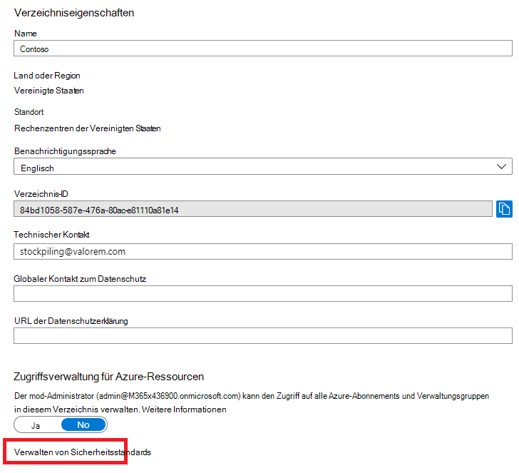
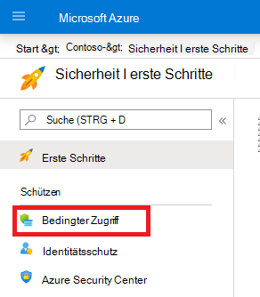
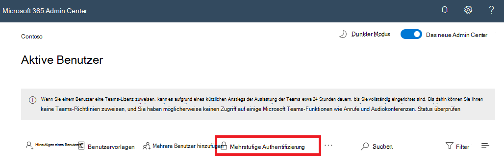

# Mehrstufige Authentifizierung für Microsoft 365

Kennwörter stellen die gängigste Methode zum Authentifizieren einer Anmeldung bei einem Computer oder Onlinedienst dar, sind aber auch am stärksten gefährdet. Benutzer können einfache Kennwörter auswählen und dieselben Kennwörter für mehrere Anmeldungen für verschiedene Computer und Dienste verwenden.

Um eine zusätzliche Sicherheitsstufe für Anmeldungen bereitzustellen, müssen Sie die mehrstufige Authentifizierung (MFA) verwenden, die ein starkes Kennwort verwendet, und eine zusätzliche Überprüfungsmethode basierend auf folgenden Faktoren:

- Etwas, das Sie mit sich haben, das nicht einfach dupliziert werden kann, beispielsweise ein Smartphone.
- Etwas, das Sie eindeutig und biologisch haben, beispielsweise Fingerabdrücke, Gesicht oder andere biometrische Attribute.

Die zusätzliche Überprüfungsmethode wird erst verwendet, nachdem das Kennwort des Benutzers überprüft wurde. Bei MFA, auch wenn ein sicheres Benutzerkennwort kompromittiert wird, verfügt der Angreifer nicht über Ihr Smartphone oder Ihren Fingerabdruck, um die Anmeldung abzuschließen.

## MFA-Unterstützung in Microsoft 365
Standardmäßig unterstützen sowohl Microsoft 365 als auch Office 365 MFA für Benutzerkonten mit folgendem:

- Eine an ein Telefon gesendete Textnachricht, die den Benutzer zum Eingeben eines Überprüfungscodes benötigt.
- Ein Telefonanruf.
- Die Smart Phone-App für Microsoft Authenticator.

In beiden Fällen verwendet die MFA-Anmeldung die Methode "etwas, das Sie mit sich haben, das nicht leicht dupliziert werden kann" für die zusätzliche Überprüfung.
Es gibt mehrere Möglichkeiten, wie Sie MFA für Microsoft 365 und Office 365 aktivieren können:

- Mit Sicherheitsstandards
- Mit bedingten Zugriffsrichtlinien
- Für jedes einzelne Benutzerkonto (nicht empfohlen)

Diese Methoden basieren auf Ihrem Microsoft 365-Plan.
    
|Plan  |Empfehlung  | Typ des Kunden |
|---------|---------|----------|
| Alle Microsoft 365-Pläne | Verwenden Sie Sicherheitsstandards, die MFA für alle Benutzerkonten erfordern.   Sie können auch MFA auf Benutzerkonten Basis benötigen, dies wird jedoch nicht empfohlen. | Kleinunternehmen |
| Microsoft 365 Business Premium    Microsoft 365 E3    Azure Active Directory (Azure AD) Premium P1-Lizenzen | Verwenden Sie Richtlinien für bedingten Zugriff, um MFA für Benutzerkonten zu erfordern, die auf Gruppenmitgliedschaften, Apps oder anderen Kriterien basieren. | Small Business to Enterprise |
| Microsoft 365 E5    Azure AD Premium P2-Lizenzen | Verwenden Sie Azure AD Identitätsschutz, um MFA basierend auf Anmelde Risikokriterien zu erfordern. |  Enterprise |
||||

### Sicherheitsstandards

Die Sicherheitsstandards sind eine neue Funktion für kostenpflichtige Microsoft 365- und Office 365- oder Testabonnements, die nach dem 21. Oktober 2019 erstellt wurden. Bei diesen Abonnements sind Sicherheitsstandards aktiviert, was:

- Erfordert, dass alle Benutzer MFA mit der Microsoft Authenticator-App verwenden.
- Blockiert die Legacy Authentifizierung.

Nutzer haben 14 Tage Zeit, sich mit ihrem Smartphone mit der Microsoft Authenticator-App für MFA zu registrieren. Dies beginnt mit der ersten Anmeldung, nachdem die Sicherheitsstandards aktiviert wurden. Nach Ablauf von 14 Tagen kann sich der Nutzer erst nach Abschluss der MFA-Registrierung anmelden.

Sicherheitsstandards stellen sicher, dass alle Organisationen über eine grundlegende Sicherheitsstufe für die Nutzeranmeldung verfügen, die standardmäßig aktiviert ist. Sie können Sicherheitsstandards zu Gunsten von MFA mit bedingten Zugriffsrichtlinien deaktivieren.

Sie können Sicherheitsstandards im Bereich **Eigenschaften** für Azure AD im Azure-Portal aktivieren oder deaktivieren.

Sie können Sicherheitsstandards mit einem beliebigen Microsoft 365-Plan verwenden.

Weitere Informationen finden Sie in dieser [Übersicht der Sicherheitsstandards](https://docs.microsoft.com/azure/active-directory/fundamentals/concept-fundamentals-security-defaults). 

### Richtlinien für bedingten Zugriff

Richtlinien für den bedingten Zugriff sind eine Reihe von Regeln, die die Bedingungen angeben, unter denen Anmeldungen ausgewertet und zugelassen werden. Sie können beispielsweise eine Richtlinie für den bedingten Zugriff erstellen, in der Folgendes angegeben ist:

- Entspricht die Bezeichnung eines Benutzerkontos dem Namen eines Mitglieds einer Gruppe von Benutzern, denen Exchange, Benutzer, Kennwort sowie Sicherheits-, SharePoint- oder globale Administratorrollen zugewiesen sind, ist eine mehrstufige Authentifizierung (MFA) erforderlich, bevor der Zugriff genehmigt wird.

Diese Richtlinie ermöglicht es Ihnen, MFA basierend auf einer Gruppenmitgliedschaft zu verlangen, anstatt einzelne Benutzerkonten für MFA zu konfigurieren, wenn diesen Administratorrollen zugewiesen oder entzogen wurden.

Sie können auch Richtlinien für bedingten Zugriff für erweiterte Funktionen verwenden, beispielsweise für die Anforderung eines MFA für bestimmte Apps oder für die Ausführung der Anmeldung von einem kompatiblen Gerät aus, beispielsweise auf Ihrem Laptop mit Windows 10.

Sie konfigurieren Richtlinien für bedingten Zugriff aus dem **Sicherheits** Bereich für Azure AD im Azure-Portal.

Sie können Richtlinien für bedingten Zugriff mit folgenden Bedingungen verwenden:

- Microsoft 365 Business Premium
- Microsoft 365 E3 und E5
- Azure AD Premium P1-und Azure AD Premium-P2-Lizenzen 

Für kleine Unternehmen mit Microsoft 365 Business Premium können Sie mit den folgenden Schritten einfache Richtlinien für bedingten Zugriff verwenden:

1. Erstellen Sie eine Gruppe, die die Benutzerkonten enthält, die MFA erfordern.
2. Aktivieren Sie die Richtlinie **"MFA für globale Administratoren erfordern"** .
3. Erstellen Sie eine Gruppenbasierte Richtlinie für den bedingten Zugriff mit den folgenden Einstellungen:
    - Zuordnungen > Benutzer und Gruppen: der Name Ihrer Gruppe aus Schritt 1 oben.
    - Zuordnungen > Cloud-Apps oder-Aktionen: alle Cloud-apps.
    - Zugriffssteuerungen > gewähren > gewähren von Zugriff > erfordern mehrstufige Authentifizierung.
4. Aktivieren Sie die Richtlinie.
5. Fügen Sie der in Schritt 1 oben erstellten Gruppe ein Benutzerkonto hinzu, und testen Sie.
6. Wenn Sie MFA für zusätzliche Benutzerkonten benötigen, fügen Sie diese der in Schritt 1 erstellten Gruppe hinzu.

Mit dieser Richtlinie für bedingten Zugriff können Sie die MFA-Anforderung für Ihre Benutzer in Ihrem eigenen Tempo bereitstellen.

Unternehmen sollten [Allgemeine Richtlinien für den bedingten Zugriff](https://docs.microsoft.com/azure/active-directory/conditional-access/concept-conditional-access-policy-common) verwenden, um die folgenden Richtlinien zu konfigurieren:

- [MFA für Administratoren erforderlich](https://docs.microsoft.com/azure/active-directory/conditional-access/howto-conditional-access-policy-admin-mfa)
- [MFA für alle Nutzer erforderlich](https://docs.microsoft.com/azure/active-directory/conditional-access/howto-conditional-access-policy-all-users-mfa)
- [Legacy Authentifizierung blockieren](https://docs.microsoft.com/azure/active-directory/conditional-access/howto-conditional-access-policy-block-legacy)

Weitere Informationen finden Sie in dieser [Übersicht über den bedingten Zugriff](https://docs.microsoft.com/azure/active-directory/conditional-access/overview).

### Azure AD Identity Protection

Mit Azure AD Identitätsschutz können Sie eine zusätzliche Richtlinie für den bedingten Zugriff erstellen, die [MFA erfordert, wenn das Anmelde Risiko Mittel oder hoch ist](https://docs.microsoft.com/microsoft-365/enterprise/identity-access-policies#require-mfa-based-on-sign-in-risk).

Sie können Azure AD Identitätsschutz und risikobasierte Richtlinien für bedingten Zugriff verwenden:

- Microsoft 365 E5
- Azure AD Premium P2-Lizenzen

Weitere Informationen finden Sie in dieser [Übersicht über den Azure AD-Identity Protection](https://docs.microsoft.com/azure/active-directory/identity-protection/overview-identity-protection).

### Vermächtnis pro Person MFA (nicht empfohlen)

Sie sollten entweder Sicherheitsstandards oder Richtlinien für bedingten Zugriff verwenden, um MFA für Ihre Benutzerkonto-Anmeldungen zu benötigen. Wenn eine dieser Funktionen jedoch nicht verwendet werden kann, empfiehlt Microsoft für alle Größen Abonnements dringend die Verwendung von MFA für Benutzerkonten mit Administratorrollen, vor allem mit der globalen Administratorrolle. 

Sie aktivieren MFA für einzelne Benutzerkonten im Bereich **aktive Benutzer** des Microsoft 365 Admin Center.

Wenn sich der Benutzer das nächste Mal anmeldet, wird er aufgefordert, sich für MFA zu registrieren und die zusätzliche Überprüfungsmethode auszuwählen und zu testen.

### Diese Methoden zusammen verwenden

Diese Tabelle zeigt die Ergebnisse der Aktivierung von MFA mit Sicherheitsstandards, Richtlinien für bedingten Zugriff und Nutzerkonteneinstellungen.

|| Aktiviert | Deaktiviert | Sekundäre Authentifizierungsmethode |
|:-------|:-----|:-------|:-------|
| **Sicherheitsstandards** | Richtlinien für bedingten Zugriff können nicht verwendet werden |   Richtlinien für den bedingten Zugriff können verwendet werden | Microsoft Authenticator-App |
| **Richtlinien für bedingten Zugriff** |Wenn welche aktiviert sind, können Sie die Sicherheitsstandards nicht aktivieren | Wenn alle deaktiviert sind, können Sie die Sicherheitsstandards aktivieren | Nutzerdefiniert bei der MFA-Registrierung |
| **Vermächtnis pro Person MFA (nicht empfohlen)** | Überschreibt Sicherheitsstandards und Richtlinien für bedingten Zugriff, für die die MFA bei jedem anmelden erforderlich ist. | Durch Sicherheitsstandards und Richtlinien für bedingten Zugriff außer Kraft gesetzt | Nutzerdefiniert bei der MFA-Registrierung|
||||

Wenn Sicherheitsstandards aktiviert sind, werden alle neuen Benutzer zur MFA-Registrierung und zur Verwendung der Microsoft Authenticator-App bei der nächsten Anmeldung aufgefordert.

## Möglichkeiten zum Verwalten von MFA-Einstellungen

Es gibt zwei Möglichkeiten zum Verwalten von MFA-Einstellungen.

Im Azure-Portal haben Sie folgende Möglichkeiten:

- Aktivieren und Deaktivieren von Sicherheitsstandards
- Konfigurieren von Richtlinien für bedingten Zugriff

Im Microsoft 365 Admin Center können Sie die MFA-Einstellungen für einzelne Benutzer und Dienste konfigurieren.

## Der nächste Schritt

[Einrichten von MFA für Microsoft 365](set-up-multi-factor-authentication.md)
