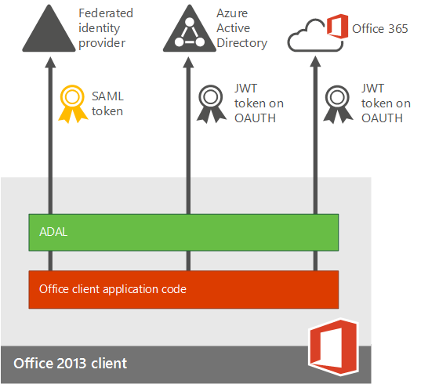
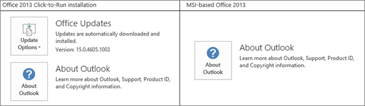

# Planen der mehrstufigen Authentifizierung für Office 365-Bereitstellungen

[] Bei der mehrstufigen Authentifizierung (Multi-Factor Authentication, MFA) handelt es sich um eine Authentifizierungsmethode, bei der mehr als eine Überprüfungsmethode verwendet werden muss und Benutzeranmeldungen und Transaktionen eine zweite Sicherheitsebene hinzugefügt wird. Dabei sind mindestens zwei der folgenden Überprüfungsmethoden erforderlich:
  
- Ein zufällig generierter Passcode
    
- Ein Telefonanruf
    
- Eine Smartcard (virtuell oder physisch) 
    
- Ein biometrisches Gerät 
    
## Mehrstufige Authentifizierung in Office 365

Office 365 verwendet die mehrstufige Authentifizierung zur Bereitstellung der zusätzlichen Sicherheit und wird über das Microsoft 365 Admin Center verwaltet. Office 365 bietet als Teil des Abonnements die folgende Teilmenge der Azure-mehrstufigen Authentifizierungsfunktionen: 
  
- Die Möglichkeit zum Aktivieren und Erzwingen der mehrstufigen Authentifizierung für Endbenutzer
    
- Die Verwendung einer mobilen App - online und mit Einmalkennwort (One-Time Password, OTP) - als zweiten Authentifizierungsfaktor
    
- Die Verwendung eines Telefonanrufs als zweiten Authentifizierungsfaktor
    
- Die Verwendung einer SMS als zweiten Authentifizierungsfaktor
    
- Anwendungskennwörter für Nicht-Browser-Clients (z. B. die Microsoft Lync 2013-Kommunikationssoftware)
    
- Microsoft-Standardbegrüßungen bei Authentifizierungstelefonanrufen
    
Die vollständige Liste der hinzugefügten Features finden Sie unter [Funktionsweise von Azure Multi-Factor Authentication, Funktionsvergleich der Versionen](https://go.microsoft.com/fwlink/?LinkId=506927). Wenn Sie den Azure Multi-Factor Authentication-Dienst erwerben, können Sie den vollen Funktionsumfang nutzen. 
  
Sie erhalten jeweils unterschiedliche Funktionen, abhängig davon, ob Sie über eine Bereitstellung nur für die Cloud für Office 365 oder über eine hybride Einrichtung mit einmaligem Anmelden und Active Directory-Verbunddienste (AD FS) verfügen. 
  
|**Wo verwalten Sie Ihre Office 365-Mandanten?**|**MFA-Optionen für den zweiten Authentifizierungsfaktor**|
|:-----|:-----|
|Nur für die Cloud    |Azure-mehrstufige Authentifizierung (Text oder Telefonanruf)    |
|Hybride Einrichtung, lokal verwaltet    | Wenn Sie Benutzeridentitäten lokal verwalten, sind die folgenden Optionen verfügbar:     Physische oder virtuelle Smartcard (bei Verwendung von AD FS)    [Azure-mehr](https://go.microsoft.com/fwlink/p/?LinkId=526677) stufige Authentifizierung (Modul für AD FS)     Azure Active Directory (Azure AD) mehrstufige Authentifizierung    |
   
  
In der folgenden Abbildung wird veranschaulicht, wie die aktualisierten Office 2013-Geräte-Apps (unter Windows) Benutzern das Anmelden mit der MFA ermöglichen. Die Office 2013 Geräte-apps unterstützen die mehrstufige Authentifizierung durch die Verwendung der [Active Directory-Authentifizierungsbibliothek (Adal)](https://go.microsoft.com/fwlink/p/?LinkId=526684). Azure AD hostet eine Webseite, auf der sich Benutzer anmelden können. Der Identitätsanbieter kann Azure AD oder ein Verbundidentitätsanbieter wie AD FS sein. Bei der Authentifizierung für Verbundbenutzer werden die folgenden Schritte ausgeführt:
  
1. Azure AD leitet den Benutzer zu der Anmeldewebseite weiter, die vom im Eintrag vermerkten Identitätsanbieter für den Office 365-Mandanten gehostet wird. Der Identitätsanbieter wird durch die im Anmeldenamen des Benutzers angegebene Domäne bestimmt.
    
2. Der Benutzer meldet sich über sein Gerät auf der Anmeldeseite an. 
    
3. Wenn der Benutzer erfolgreich angemeldet wurde, gibt der Identitätsanbieter ein Token an Azure AD zurück.
    
4. Azure AD gibt ein JSON-Webtoken (JWT) an die Office-Geräte-App zurück, und die Geräte-App wird mithilfe eines JWT mit Office 365 authentifiziert. 
    
Dies wird in der folgenden Abbildung detailliert veranschaulicht:
  

  
## Softwareanforderungen

Zum Aktivieren der MFA für Office 2013-Client-Apps muss die folgende Software in Abhängigkeit davon installiert sein (die nachstehend aufgeführte oder eine höhere Version), ob Sie über eine [Klick-und-Los-basierte Installationen](#click-to-run-based-installations) oder eine [MSI-basierte Installationen](#msi-based-installations) verfügen.
  
So ermitteln Sie, ob Ihre Office-Installation auf Klick-und-Los oder MSI basiert
  
1. Starten Sie Outlook 2013.
    
2. Wählen Sie im Menü **Datei** die Option **Office-Konto**aus.
    
3. Für Klick-und-Los-Installationen von Outlook 2013 wird der Eintrag **Updateoptionen** angezeigt. Für MSI-basierte Installationen wird der Eintrag **Updateoptionen** nicht angezeigt. 
    
    
  
### Klick-und-Los-basierte Installationen

Für Klick-und-Los-basierte Installationen muss die folgende Software mit der unten aufgeführten oder einer höheren Dateiversion installiert sein. Wenn Ihre Dateiversion nicht der aufgeführten Dateiversion entspricht oder höher ist, aktualisieren Sie Ihre Version mithilfe der folgenden Schritte.
  
|**Dateiname**|**Installationspfad auf Ihrem Computer**|**Dateiversion**|
|:-----|:-----|:-----|
|MSO. DLL    |C:\Programme\Microsoft Office 15\root\vfs\ProgramFilesCommonx86\Microsoft Shared\OFFICE15\MSO.DLL    |15.0.4753.1001    |
|CSI. DLL    |CSI.DLL C:\Programme\Microsoft Office 15\root\office15\csi.dll    |15.0.4753.1000    |
|Groove. exe    |C:\Programme\Microsoft Office 15\root\office15\GROOVE.exe    |15.0.4763.1000    |
|Outlook. exe    |C:\Programme\Microsoft Office 15\root\office15\OUTLOOK.exe    |15.0.4753.1002    |
|Adal. DLL    |C:\Programme\Microsoft Office 15\root\vfs\ProgramFilesCommonx86\Microsoft Shared\OFFICE15\ADAL.DLL    |1.0.2016.624    |
|Iexplore. exe    |C:\Programme\Internet Explorer    |Variierend    |
   
### MSI-basierte Installationen

Für MSI-basierte Installationen muss die folgende Software mit der unten aufgeführten oder einer höheren Dateiversion installiert sein. Wenn Ihre Dateiversion nicht der aufgeführten Dateiversion entspricht oder höher ist, aktualisieren Sie Ihre Version mithilfe des Links in der Spalte "KB-Artikel aktualisieren".
  
|**Dateiname**|**Installationspfad auf Ihrem Computer**|**Wo das Update abgerufen werden kann**|**Version**|
|:-----|:-----|:-----|:-----|
|MSO. DLL    |C:\Programme\Gemeinsame Dateien\Microsoft Shared\OFFICE15\MSO.DLL    |[KB3085480](https://support.microsoft.com/kb/3085480)   |15.0.4753.1001    |
|CSI. DLL    |C:\Programme\Gemeinsame Dateien\Microsoft Shared\OFFICE15\Csi.dll    |[KB3085504](https://support.microsoft.com/kb/3085504)   |15.0.4753.1000    |
|Groove. exe    |C:\Programme\Microsoft Office\Office15\GROOVE.EXE    |[KB3085509](https://support.microsoft.com/kb/3085509)   |15.0.4763.1000    |
|Outlook. exe    |C:\Programme\Microsoft Office\Office15\OUTLOOK.EXE    |[KB3085495](https://support.microsoft.com/kb/3085495)   |15.0.4753.1002    |
|Adal. DLL    |C:\Programme\Gemeinsame Dateien\Microsoft Shared\OFFICE15\ADAL.DLL    |[KB3055000](https://support.microsoft.com/kb/3055000)   |1.0.2016.624    |
|Iexplore. exe    |C:\Programme\Internet Explorer    |[MS14-052](https://support.microsoft.com/kb/2977629)   |Nicht anwendbar    |
   
## Aktivieren von MFA

Zum Aktivieren der MFA müssen Sie die folgenden Schritte ausführen:
  
1. Aktivieren Sie die Clients für die moderne Authentifizierung:
    
  - [Aktivieren der modernen Authentifizierung für Office 2013 auf Windows-Geräten](enable-modern-authentication.md) . 
    
  - Einrichten der Azure-mehrstufigen Authentifizierung mit Verzeichnisdiensten von Drittanbietern.
    
    Informationen zu bestimmten Identitätsanbietern, die für dieses Programm akzeptiert werden, finden Sie unter [Erweiterte Szenarien mit mehrstufiger Azure-Authentifizierung und VPN-Lösungen von Drittanbietern](https://docs.microsoft.com/azure/active-directory/authentication/howto-mfaserver-nps-vpn) . 
    
2. [Einrichten der mehrstufigen Authentifizierung für Office 365](set-up-multi-factor-authentication.md)
    
3. Informieren Sie die einzelnen Benutzer darüber, wie sie sich über MFA anmelden: [Anmelden bei Office 365 mit 2-Schritt-Überprüfung](https://support.office.com/article/2b856342-170a-438e-9a4f-3c092394d3cb.aspx).
    
> [!IMPORTANT]
> Wenn Sie Ihre Benutzer für die Azure-mehrstufige Authentifizierung aktiviert haben und auf Geräten Office 2013, die nicht für die moderne Authentifizierung aktiviert sind, muss Wörtern auf diesen Geräten verwendet werden. Weitere Informationen zu App-Kennwörtern und deren Verwendung finden Sie hier: [App-Kennwörter bei Azure Multi-Factor Authentication](https://go.microsoft.com/fwlink/p/?LinkId=528178). 
  
## Häufig gestellte Fragen

[Häufig gestellte Fragen zur modernen Authentifizierung (Wiki-Artikel)](https://go.microsoft.com/fwlink/p/?LinkId=530064)
  
 **Bekannte Probleme:**
  
[Moderne Authentifizierung in Office 2013 und Office 365 ProPlus: Wichtige Informationen vor dem Onboarding](https://social.technet.microsoft.com/wiki/contents/articles/30214.office-2013-and-office-365-proplus-modern-authentication-things-to-know-before-onboarding.aspx)
  
 **Beheben von Problemen bei der Azure Multi-Factor Authentication:**
  
Weitere Informationen finden Sie unter [Problembehandlung bei Azure Multi-Factor Authentication](https://support.microsoft.com/help/2937344/troubleshooting-azure-multi-factor-authentication-issues).
  
[Behandlung von Anmeldeproblemen bei der modernen Authentifizierung in Office 2013 bei Verwendung von AD FS](https://support.microsoft.com/kb/3052203/)
  
 **Wenn alternative IDs nicht funktionieren:**
  
[Verwenden von PowerShell zum Korrigieren von doppelten Benutzerprinzipalnamen (User Principal Name, UPN)](https://go.microsoft.com/fwlink/p/?LinkId=396730)
  
[Skript zum Beheben von doppelten Benutzerprinzipalnamen (User Principal Name, UPN)](https://go.microsoft.com/fwlink/p/?LinkId=396725)
  
 **Clientzugriffsfilterung:**
  
[Richtlinien für die moderne Authentifizierung und für die Clientzugriffsfilterung in Office 2013 und Office 365 ProPlus: Wichtige Informationen vor dem Onboarding](https://social.technet.microsoft.com/wiki/contents/articles/30214.office-2013-and-office-365-proplus-modern-authentication-things-to-know-before-onboarding.aspx)
  
 **Welche Apps unterstützen MFA?**
  
|**Windows**|**Mac**|**iOS**|**Android-Smartphone**|**Android-Tablet**|
|:-----|:-----|:-----|:-----|:-----|
|Die moderne Authentifizierung für Word 2013, Word 2016, Excel 2013, Excel 2016, PowerPoint 2013, PowerPoint 2016, OneNote 2013, OneNote 2016, Project 2013, Project 2016, Visio 2013, Visio 2016, Lync 2013 und Skype for Business wird in dieser Version unterstützt.    |Die moderne Authentifizierung für Word 2016 für Mac, Excel 2016 für Mac und PowerPoint 2016 für Mac wird in dieser Version unterstützt.    |Die moderne Authentifizierung für Word für iPad, Excel für iPad und PowerPoint für iPad wird in dieser Version unterstützt.    |Die moderne Authentifizierung für Word für Android, Excel für Android und PowerPoint für Android wird in dieser Version unterstützt.    |Die moderne Authentifizierung für Word für Android, Excel für Android und PowerPoint für Android wird in dieser Version unterstützt.    |
|Die moderne Authentifizierung für Outlook 2013 und Outlook 2016 wird in dieser Version unterstützt.    |Die moderne Authentifizierung für Outlook 2016 für Mac wird in dieser Version unterstützt.    |Die moderne Authentifizierung für Outlook für iPad wird in dieser Version unterstützt.    |||
   

