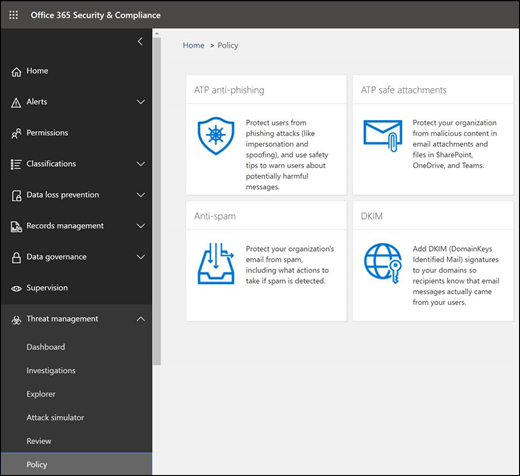

# Die 10 wichtigsten Möglichkeiten zum Sichern von Microsoft 365 für Business-PläneTop 10 ways to secure Microsoft 365 for business plans

Wenn Sie eine kleine oder mittelständische Organisation sind, die einen der Geschäftspläne von Microsoft verwendet und Ihre Art von Organisation von Cyberkriminellen und Hackern ausgerichtet ist, verwenden Sie die Anleitung in diesem Artikel, um die Sicherheit Ihrer Organisation zu erhöhen.If you are a small or medium-size organization using one of Microsoft's business plans and your type of organization is targeted by cyber criminals and hackers, use the guidance in this article to increase the security of your organization. Dieser Leitfaden hilft Ihrer Organisation, die ziele zu erreichen, die im Handbuch zur [Cybersicherheitskampagne](https://go.microsoft.com/fwlink/p/?linkid=2015598)der Schule "Schule" beschrieben sind.This guidance helps your organization achieve the goals described in the Harvard Kennedy School [Cybersecurity Campaign Handbook](https://go.microsoft.com/fwlink/p/?linkid=2015598).

Microsoft empfiehlt, die in der folgenden Tabelle aufgeführten Aufgaben auszuführen, die für Ihren Serviceplan gelten.Microsoft recommends that you complete the tasks listed in the following table that apply to your service plan.

|*Number**Number*|AufgabeTask|Microsoft 365 Business StandardMicrosoft 365 Business Standard|Microsoft 365 Business PremiumMicrosoft 365 Business Premium|
|---|---|---|---|
|11|[Einrichten der mehrstufigen AuthentifizierungSet up multi-factor authentication](secure-your-business-data.md#setup)|||
|22|[Schulen der BenutzerTrain your users](secure-your-business-data.md#train)|||
|33|[Verwenden dedizierter AdministratorkontenUse dedicated admin accounts](secure-your-business-data.md#admin)|||
|4 4|[Erhöhen des Schutzes vor Schadsoftware in E-MailsRaise the level of protection against malware in mail](secure-your-business-data.md#malware)|||
|5 5|[Schutz vor RansomwareProtect against ransomware](secure-your-business-data.md#ransomware)|||
|6 6|[Beenden der automatischen Weiterleitung für E-MailsStop auto-forwarding for email](secure-your-business-data.md#forwarding)|||
|7 7|[Verwenden Office NachrichtenverschlüsselungUse Office Message Encryption](secure-your-business-data.md#encryption)|||
|8 8|[Schützen Ihrer E-Mails vor PhishingangriffenProtect your email from phishing attacks](secure-your-business-data.md#phishing)|||
|9 9|[Schutz vor bösartigen Anlagen und Dateien mit sicheren AnlagenProtect against malicious attachments and files with Safe Attachments](secure-your-business-data.md#atp)|||
|1010|[Schutz vor Phishingangriffen mit sicheren LinksProtect against phishing attacks with Safe Links](secure-your-business-data.md#phishingatp)|||

Wenn Sie über Microsoft Business Premium verfügen, können Sie die Sicherheit am schnellsten einrichten und mit der sicheren Zusammenarbeit beginnen, wenn Sie die Anweisungen in dieser Bibliothek befolgen: [Microsoft 365 für kleinere Unternehmen und Kampagnen](../../campaigns/index.md).If you have Microsoft Business Premium, the quickest way to setup security and begin collaborating safely is to follow the guidance in this library: [Microsoft 365 for smaller businesses and campaigns](../../campaigns/index.md). Diese Anleitung wurde in Zusammenarbeit mit dem Microsoft-Team „Defending Democracy“ entwickelt, um alle kleinen Unternehmenskunden vor Cyberbedrohungen zu schützen, die von raffinierten Hackern gestartet werden.This guidance was developed in partnership with the Microsoft Defending Democracy team to protect all small business customers against cyber threats launched by sophisticated hackers.

Bevor Sie beginnen, überprüfen Sie Ihre [Microsoft 365 Sicherheitsbewertung](../../security/defender/microsoft-secure-score.md) im Microsoft 365 Security Center.Before you begin, check your [Microsoft 365 Secure Score](../../security/defender/microsoft-secure-score.md) in the Microsoft 365 security center. Über ein zentrales Dashboard können Sie die Sicherheit Ihrer Microsoft 365 Identitäten, Daten, Apps, Geräte und Infrastruktur überwachen und verbessern.From a centralized dashboard, you can monitor and improve the security for your Microsoft 365 identities, data, apps, devices, and infrastructure. Sie erhalten Punkte für die Konfiguration empfohlener Sicherheitsfeatures, das Ausführen sicherheitsrelevanter Aufgaben (z. B. das Anzeigen von Berichten) oder das Adressieren von Empfehlungen mit einer Drittanbieteranwendung oder -software.You are given points for configuring recommended security features, performing security-related tasks (such as viewing reports), or addressing recommendations with a third-party application or software. Mit zusätzlichen Einblicken und mehr Einblicken in eine breitere Palette von Microsoft-Produkten und -Diensten können Sie sich sicher über die Sicherheitsintegrität Ihrer Organisation berichten.With additional insights and more visibility into a broader set of Microsoft products and services, you can feel confident reporting about your organization's security health.

## 1: Einrichten der mehrstufigen Authentifizierung1: Set up multi-factor authentication

Die Verwendung der mehrstufigen Authentifizierung ist eine der einfachsten und effektivsten Methoden, um die Sicherheit Ihrer Organisation zu erhöhen.Using multi-factor authentication is one of the easiest and most effective ways to increase the security of your organization. Es ist einfacher, als es klingt – wenn Sie sich anmelden, bedeutet die mehrstufige Authentifizierung, dass Sie einen Code von Ihrem Telefon eingeben, um Zugriff auf Microsoft 365 zu erhalten.It's easier than it sounds - when you log in, multi-factor authentication means you'll type a code from your phone to get access to Microsoft 365. Dies kann verhindern, dass Hacker die Übernahme übernehmen, wenn sie Ihr Kennwort kennen.This can prevent hackers from taking over if they know your password. Die mehrstufige Authentifizierung wird auch als zweistufige Überprüfung bezeichnet.Multi-factor authentication is also called 2-step verification. Einzelpersonen können den meisten Konten problemlos eine zweistufige Überprüfung hinzufügen, z. B. zu ihren Google- oder Microsoft-Konten.Individuals can add 2-step verification to most accounts easily, for example, to their Google or Microsoft accounts. Hier erfahren Sie, wie [Sie Ihrem persönlichen Microsoft-Konto eine zweistufige Überprüfung hinzufügen.](https://go.microsoft.com/fwlink/p/?linkid=2016403)Here's how to [add two-step verification to your personal Microsoft account](https://go.microsoft.com/fwlink/p/?linkid=2016403).

Fügen Sie für Unternehmen, die Microsoft 365 verwenden, eine Einstellung hinzu, die erfordert, dass sich Ihre Benutzer mithilfe der mehrstufigen Authentifizierung anmelden.For businesses using Microsoft 365, add a setting that requires your users to log in using multi-factor authentication. Wenn Sie diese Änderung vornehmen, werden Die Benutzer aufgefordert, ihr Telefon für die zweistufige Authentifizierung einzurichten, wenn sie sich das nächste Mal anmelden.When you make this change, users will be prompted to set up their phone for two-factor authentication next time they log in.
Ein Schulungsvideo zum Einrichten von MFA und zum Abschließen der Einrichtung durch die Benutzer finden Sie unter Einrichten der [MFA](../../business-video/turn-on-mfa.md) und [der Benutzereinrichtung.](../../business-video/set-up-mfa.md)To see a training video for how to set up MFA and how users complete the set up, see [set up MFA](../../business-video/turn-on-mfa.md) and [user set up](../../business-video/set-up-mfa.md).

Um die mehrstufige Authentifizierung einzurichten, aktivieren Sie die Sicherheitsstandards:To set up multi-factor authentication, you turn on Security defaults:

In den meisten Organisationen bieten Sicherheitsstandards ein gutes Maß an zusätzlicher Anmeldesicherheit.For most organizations, Security defaults offer a good level of additional sign-in security. Weitere Informationen hierzu finden Sie unter [Was sind Sicherheitsstandards?](/azure/active-directory/fundamentals/concept-fundamentals-security-defaults)For more information, see [What are security defaults?](/azure/active-directory/fundamentals/concept-fundamentals-security-defaults)

Wenn Ihr Abonnement neu ist, sind die Sicherheitsstandards möglicherweise bereits automatisch für Sie aktiviert.If your subscription is new, Security defaults might already be turned on for you automatically.

Die Standardsicherheitseinstellungen können Sie im Azure-Portal im Bereich **Einstellungen** für Active Directory (Azure AD) aktivieren oder deaktivieren.You enable or disable security defaults from the **Properties** pane for Azure Active Directory (Azure AD) in the Azure portal.

1. Melden Sie sich mit den Anmeldeinformationen des globalen Administrators beim [Microsoft 365 Admin Center](https://admin.microsoft.com) an.Sign in to the [Microsoft 365 admin center](https://admin.microsoft.com) with global admin credentials.
2. Wählen Sie im linken Navigationsbereich **Alle anzeigen** und dann unter **Admin Center** die Option **Azure Active Directory** aus.In the left nav choose **Show All** and under **Admin centers**, choose **Azure Active Directory**.
3. Im **Azure Active Directory Admin Center** wählen Sie dann **Azure Active Directory** > **Eigenschaften** aus.In the **Azure Active Directory admin center** choose **Azure Active Directory** > **Properties**.
4. Wählen Sie unten auf der Seite **Sicherheitsstandards verwalten** aus.At the bottom of the page, choose **Manage Security defaults**.
5. Wählen Sie **Ja** aus, um die zu aktivieren oder **Nein**, um die Sicherheitsstandards zu deaktivieren. Klicken Sie anschließend auf **Speichern**.Choose **Yes** to enable security defaults or **No** to disable security defaults, and then choose **Save**.

Nachdem Sie die mehrstufige Authentifizierung für Ihre Organisation eingerichtet haben, müssen die Benutzer auf ihren Geräten die Prüfung in zwei Schritten einrichten.After you set up multi-factor authentication for your organization, your users will be required to set up two-step verification on their devices. Weitere Informationen finden Sie unter Einrichten der [zweistufigen Überprüfung für Microsoft 365.](https://support.microsoft.com/office/ace1d096-61e5-449b-a875-58eb3d74de14)For more information, see [Set up 2-step verification for Microsoft 365](https://support.microsoft.com/office/ace1d096-61e5-449b-a875-58eb3d74de14).

Ausführliche Informationen und vollständige Empfehlungen finden Sie unter Einrichten der [mehrstufigen Authentifizierung für Benutzer.](set-up-multi-factor-authentication.md)For full details and complete recommendations, see [Set up multi-factor authentication for users](set-up-multi-factor-authentication.md).

## 2: Schulen Ihrer Benutzer2: Train your users

Das [Cybersicherheitskampagnenhandbuch](https://go.microsoft.com/fwlink/p/?linkid=2015598) der Schule Stellt hervorragende Anleitungen zum Aufbau einer starken Kultur des Sicherheitsbewusstseins in Ihrer Organisation bereit, einschließlich der Schulung von Benutzern zur Identifizierung von Phishingangriffen.The Harvard Kennedy School [Cybersecurity Campaign Handbook](https://go.microsoft.com/fwlink/p/?linkid=2015598) provides excellent guidance on establishing a strong culture of security awareness within your organization, including training users to identify phishing attacks.

Zusätzlich zu diesem Leitfaden empfiehlt Microsoft Ihren Benutzern, die in diesem Artikel beschriebenen Maßnahmen zu ergreifen: [Schützen Ihres Kontos und Ihrer Geräte vor Hackern und Schadsoftware.](https://support.microsoft.com/office/066d6216-a56b-4f90-9af3-b3a1e9a327d6)In addition to this guidance, Microsoft recommends that your users take the actions described in this article: [Protect your account and devices from hackers and malware](https://support.microsoft.com/office/066d6216-a56b-4f90-9af3-b3a1e9a327d6). Diese setzen sich wie folgt zusammen:These actions include:

- Verwenden sicherer KennwörterUsing strong passwords

- Schützen von GerätenProtecting devices

- Aktivieren von Sicherheitsfeatures auf Windows 10 und Mac-PCsEnabling security features on Windows 10 and Mac PCs

Microsoft empfiehlt außerdem, dass Benutzer ihre persönlichen E-Mail-Konten schützen, indem sie die in den folgenden Artikeln empfohlenen Maßnahmen ergreifen:Microsoft also recommends that users protect their personal email accounts by taking the actions recommended in the following articles:

- [Schützen Ihres Outlook.com-E-Mail-KontosHelp protect your Outlook.com email account](https://support.microsoft.com/office/a4f20fc5-4307-4ece-8231-6d4d4bd8a9ba)

- [Schützen Ihres Gmail-Kontos mit zweistufiger ÜberprüfungProtect your Gmail account with 2-step verification](https://go.microsoft.com/fwlink/p/?linkid=2015688&)

## 3: Verwenden dedizierter Administratorkonten3: Use dedicated admin accounts

Zu den Verwaltungskonten, die Sie zum Verwalten Ihrer Microsoft 365 Umgebung verwenden, gehören erhöhte Rechte.The administrative accounts you use to administer your Microsoft 365 environment include elevated privileges. Dies sind wertvolle Ziele für Hacker und Cyberkriminelle.These are valuable targets for hackers and cyber criminals. Verwenden Sie Administratorkonten nur für die Verwaltung.Use admin accounts only for administration. Administratoren sollten über ein separates Benutzerkonto für die regelmäßige, nicht administrative Verwendung verfügen und ihr Administratorkonto nur dann verwenden, wenn dies erforderlich ist, um eine Aufgabe auszuführen, die mit ihrer Auftragsfunktion verknüpft ist.Admins should have a separate user account for regular, non-administrative use and only use their administrative account when necessary to complete a task associated with their job function. Zusätzliche Empfehlungen:Additional recommendations:

- Stellen Sie sicher, dass Administratorkonten auch für die mehrstufige Authentifizierung eingerichtet sind.Be sure admin accounts are also set up for multi-factor authentication.

- Schließen Sie vor der Verwendung von Administratorkonten alle Browsersitzungen und Apps, die keine Beziehung haben, einschließlich persönlicher E-Mail-Konten.Before using admin accounts, close out all unrelated browser sessions and apps, including personal email accounts.

- Stellen Sie nach Abschluss der Administratoraufgaben sicher, dass Sie sich bei der Browsersitzung abmelden.After completing admin tasks, be sure to log out of the browser session.

## 4: Erhöhen des Schutzes vor Schadsoftware in E-Mails4: Raise the level of protection against malware in mail

Ihre Microsoft 365-Umgebung umfasst Schutz vor Schadsoftware. Sie können diesen Schutz jedoch erhöhen, indem Sie Anlagen mit Dateitypen blockieren, die häufig für Schadsoftware verwendet werden.Your Microsoft 365 environment includes protection against malware, but you can increase this protection by blocking attachments with file types that are commonly used for malware. Um den Schutz vor Schadsoftware in E-Mails zu verbessern, zeigen Sie ein [kurzes Schulungsvideo](../../business-video/anti-malware.md)an, oder führen Sie die folgenden Schritte aus:To bump up malware protection in email, view a [short training video](../../business-video/anti-malware.md), or complete the following steps:

1. Rufen Sie ihre <https://protection.office.com> Administratorkontoanmeldeinformationen auf, und melden Sie sich an.Go to <https://protection.office.com> and sign in with your admin account credentials.

2. Wählen Sie im Security & Compliance Center im linken Navigationsbereich unter **"Bedrohungsmanagement"** **die Option "Richtlinie** \> **antischadsoftware"** aus.In the Security & Compliance Center, in the left navigation pane, under **Threat management**, choose **Policy** \> **Anti-Malware**.

3. Doppelklicken Sie auf die Standardrichtlinie, um diese unternehmensweite Richtlinie zu bearbeiten.Double-click the default policy to edit this company-wide policy.

4. Wählen Sie **Einstellungen** aus.Select **Settings**.

5. Wählen Sie unter **Filter für allgemeine Anlagentypen** die Option **"Ein"** aus.Under **Common Attachment Types Filter**, select **On**. Die blockierten Dateitypen werden im Fenster direkt unterhalb dieses Steuerelements aufgelistet.The file types that are blocked are listed in the window directly below this control. Sie können Dateitypen später bei Bedarf hinzufügen oder löschen.You can add or delete file types later, if needed.

6. Wählen Sie **"Speichern" aus.**Select **Save.**

Weitere Informationen finden Sie unter [Antischadsoftwareschutz in EOP.](../../security/office-365-security/anti-malware-protection.md)For more information, see [Anti-malware protection in EOP](../../security/office-365-security/anti-malware-protection.md).

## 5: Schutz vor Ransomware5: Protect against ransomware

Ransomware schränkt den Zugriff auf Daten ein, indem Dateien verschlüsselt oder Computerbildschirme gesperrt werden.Ransomware restricts access to data by encrypting files or locking computer screens. Anschließend wird versucht, Geld von Denkzwecken zu erpressen, indem ein "Lösegeld" gefordert wird, in der Regel in Form von Enumerationen wie Demenzen, im Austausch für den Zugriff auf Daten.It then attempts to extort money from victims by asking for "ransom," usually in form of cryptocurrencies like Bitcoin, in exchange for access to data.

Sie können sich vor Ransomware schützen, indem Sie eine oder mehrere Nachrichtenflussregeln erstellen, um Dateierweiterungen zu blockieren, die häufig für Ransomware verwendet werden, oder um Benutzer zu warnen, die diese Anlagen in E-Mails erhalten.You can protect against ransomware by creating one or more mail flow rules to block file extensions that are commonly used for ransomware, or to warn users who receive these attachments in email. Ein guter Ausgangspunkt ist das Erstellen von zwei Regeln:A good starting point is to create two rules:

- Warnen Sie Benutzer vor dem Öffnen Office Dateianlagen, die Makros enthalten.Warn users before opening Office file attachments that include macros. Ransomware kann in Makros verborgen sein, daher warnen wir Benutzer davor, diese Dateien von Personen zu öffnen, die sie nicht kennen.Ransomware can be hidden inside macros, so we'll warn users to not open these files from people they do not know.

- Blockieren Sie Dateitypen, die Ransomware oder anderen schädlichen Code enthalten könnten.Block file types that could contain ransomware or other malicious code. Wir beginnen mit einer allgemeinen Liste ausführbarer Dateien (in der folgenden Tabelle aufgeführt).We'll start with a common list of executables (listed in the table below). Wenn Ihre Organisation einen dieser ausführbaren Typen verwendet und Sie davon ausgehen, dass diese per E-Mail gesendet werden, fügen Sie diese zur vorherigen Regel hinzu (Warnen von Benutzern).If your organization uses any of these executable types and you expect these to be sent in email, add these to the previous rule (warn users).

Um eine E-Mail-Transportregel zu erstellen, zeigen Sie ein [kurzes Schulungsvideo](../../business-video/prevent-ransom-in-email.md)an, oder führen Sie die folgenden Schritte aus:To create a mail transport rule, view a [short training video](../../business-video/prevent-ransom-in-email.md), or complete the following steps:

1. Wechseln Sie zum [Exchange Admin Center](https://go.microsoft.com/fwlink/p/?linkid=2059104).Go to the [Exchange admin center](https://go.microsoft.com/fwlink/p/?linkid=2059104).

2. Wählen Sie in der **Nachrichtenflusskategorie** **Regeln** aus.In the **mail flow** category, select **rules**.

3. Wählen Sie **+** aus, und erstellen Sie dann **eine neue Regel.**Select **+**, and then **Create a new rule**.

4. Wählen Sie am unteren Rand des Dialogfelds die Option aus, um den vollständigen Satz von Optionen anzuzeigen.Select \*\*\*\* at the bottom of the dialog box to see the full set of options.

5. Wenden Sie die Einstellungen in der folgenden Tabelle für jede Regel an.Apply the settings in the following table for each rule. Behalten Sie die restlichen Einstellungen standardmäßig bei, es sei denn, Sie möchten diese ändern.Leave the rest of the settings at the default, unless you want to change these.

6. Wählen Sie **Speichern** aus.Select **Save**.
    
| SettingSetting | Warnen von Benutzern vor dem Öffnen von Anlagen Office DateienWarn users before opening attachments of Office files | Blockieren von Dateitypen, die Ransomware oder anderen schädlichen Code enthalten könntenBlock file types that could contain ransomware or other malicious code |
|:-----|:-----|:-----|
|NameName    |Anti-Ransomware-Regel: Benutzer warnenAnti-ransomware rule: warn users    |Anti-Ransomware-Regel: Blockieren von DateitypenAnti-ransomware rule: block file types    |
|Wenden Sie diese Regel an, wenn .Apply this rule if . .. ..    |Jede Anlage .Any attachment . .. .. Dateierweiterung stimmt überein.file extension matches . .. ..    |Jede Anlage .Any attachment . .. .. Dateierweiterung stimmt überein.file extension matches . .. ..    |
|Angeben von Wörtern oder AusdrückenSpecify words or phrases    |Fügen Sie diese Dateitypen hinzu:Add these file types:    dotm, docm, xlsm, sltm, xla, xlam, xll, pptm, potm, ppam, ppsm, sldmdotm, docm, xlsm, sltm, xla, xlam, xll, pptm, potm, ppam, ppsm, sldm    |Fügen Sie diese Dateitypen hinzu:Add these file types:    ade, adp, ani, bas, bat, chm, cmd, com, cpl, crt, hlp, ht, hta, inf, ins, isp, job, js, jse, lnk, mda, mdb, mde, mdz, msc, msi, msp, mst, pcd, reg, scr, sct, shs, url, vb, vbe, vbs, wsc, wsf, wsh, exe, pifade, adp, ani, bas, bat, chm, cmd, com, cpl, crt, hlp, ht, hta, inf, ins, isp, job, js, jse, lnk, mda, mdb, mde, mdz, msc, msi, msp, mst, pcd, reg, scr, sct, shs, url, vb, vbe, vbs, wsc, wsf, wsh, exe, pif    |
|Führen Sie die folgenden Schritte aus.Do the following . .. ..    |Vorangestellter HaftungsausschlussPrepend a disclaimer    |Die Nachricht blockieren.Block the message . .. .. Ablehnen der Nachricht und Einfügen einer Erklärungreject the message and include an explanation    |
|Bereitstellen von NachrichtentextProvide message text    |Öffnen Sie diese Dateitypen nur, wenn Sie sie erwartet haben, da die Dateien bösartigen Code enthalten können und der Absender nicht sicher ist.Do not open these types of files—unless you were expecting them—because the files may contain malicious code and knowing the sender isn't a guarantee of safety.    ||
   
> [!TIP]
> Sie können auch die Dateien, die Sie blockieren möchten, der Liste der Antischadsoftware in [Schritt 4](#4-raise-the-level-of-protection-against-malware-in-mail)hinzufügen.You can also add the files you want to block to the Anti-malware list in [step 4](#4-raise-the-level-of-protection-against-malware-in-mail).

Weitere Informationen finden Sie unter:For more information, see:

- [Ransomware: So verringern Sie RisikenRansomware: how to reduce risk](https://www.microsoft.com/security/blog/2020/04/28/ransomware-groups-continue-to-target-healthcare-critical-services-heres-how-to-reduce-risk/)

- [Wiederherstellen der OneDriveRestore your OneDrive](https://support.microsoft.com/office/fa231298-759d-41cf-bcd0-25ac53eb8a15)

## 6: Beenden der automatischen Weiterleitung für E-Mails6: Stop auto-forwarding for email

Hacker, die Zugriff auf das Postfach eines Benutzers erhalten, können E-Mails exfiltrieren, indem sie das Postfach so konfigurieren, dass E-Mails automatisch weitergeleitet werden.Hackers who gain access to a user's mailbox can exfiltrate mail by configuring the mailbox to automatically forward email. Dies kann auch ohne das Bewusstsein des Benutzers erfolgen.This can happen even without the user's awareness. Sie können dies verhindern, indem Sie eine Nachrichtenflussregel konfigurieren.You can prevent this from happening by configuring a mail flow rule.

So erstellen Sie eine E-Mail-Transportregel:To create a mail transport rule:

1. Wechseln Sie zum [Exchange Admin Center](https://go.microsoft.com/fwlink/p/?linkid=2059104).Go to the [Exchange admin center](https://go.microsoft.com/fwlink/p/?linkid=2059104).

2. Wählen Sie in der **Nachrichtenflusskategorie** **Regeln** aus.In the **mail flow** category, select **rules**.

3. Wählen Sie **+** aus, und erstellen Sie dann **eine neue Regel.**Select **+**, and then **Create a new rule**.

4. Wählen Sie unten im Dialogfeld **weitere Optionen** aus, um den vollständigen Satz von Optionen anzuzeigen.Select **More options** at the bottom of the dialog box to see the full set of options.

5. Wenden Sie die Einstellungen in der folgenden Tabelle an.Apply the settings in the following table. Behalten Sie die restlichen Einstellungen standardmäßig bei, es sei denn, Sie möchten diese ändern.Leave the rest of the settings at the default, unless you want to change these.

6. Wählen Sie **Speichern** aus.Select **Save**.

|SettingSetting|Ablehnen der automatischen Weiterleitung von E-Mails an externe DomänenReject Auto-Forward emails to external domains|
|---|---|
|NameName|Verhindern der automatischen Weiterleitung von E-Mails an externe DomänenPrevent auto forwarding of email to external domains|
|Wenden Sie diese Regel an, wenn ...Apply this rule if ...|Der Absender .The sender . .. .. ist extern/intern.is external/internal . .. .. Innerhalb der OrganisationInside the organization|
|Bedingung hinzufügenAdd condition|Der Empfänger .The recipient . .. .. ist extern/intern.is external/internal . .. .. Außerhalb der OrganisationOutside the organization|
|Bedingung hinzufügenAdd condition|Die Nachrichteneigenschaften .The message properties . .. .. schließen Sie den Nachrichtentyp ein.include the message type . .. .. Automatische WeiterleitungAuto-forward|
|Führen Sie die folgenden Schritte aus...Do the following ...|Die Nachricht blockieren.Block the message . .. .. die Nachricht ablehnen und eine Erklärung einfügen.reject the message and include an explanation.|
|Bereitstellen von NachrichtentextProvide message text|Die automatische Weiterleitung von E-Mails außerhalb dieser Organisation wird aus Sicherheitsgründen verhindert.Auto-forwarding email outside this organization is prevented for security reasons.|

## 7: Verwenden Office Nachrichtenverschlüsselung7: Use Office Message Encryption

Office Nachrichtenverschlüsselung ist in Microsoft 365 enthalten.Office Message Encryption is included with Microsoft 365. Sie ist bereits eingerichtet.It's already set up. Mit Office Nachrichtenverschlüsselung kann Ihre Organisation verschlüsselte E-Mail-Nachrichten zwischen Personen innerhalb und außerhalb Ihrer Organisation senden und empfangen.With Office Message Encryption, your organization can send and receive encrypted email messages between people inside and outside your organization. Die Office 365-Nachrichtenverschlüsselung funktioniert mit Outlook.com, Yahoo!, Gmail und anderen E-Mail-Diensten.Office 365 Message Encryption works with Outlook.com, Yahoo!, Gmail, and other email services. Die E-Mail-Nachrichtenverschlüsselung sorgt dafür, dass nur vorgesehene Empfänger verschlüsselte Nachrichten ansehen können.Email message encryption helps ensure that only intended recipients can view message content.

Office Die Nachrichtenverschlüsselung bietet zwei Schutzoptionen beim Senden von E-Mails:Office Message Encryption provides two protection options when sending mail:

- Nicht weiterleitenDo not forward

- VerschlüsselnEncrypt

Möglicherweise hat Ihre Organisation zusätzliche Optionen konfiguriert, die eine Bezeichnung auf E-Mails anwenden, z. B. vertraulich.Your organization might have configured additional options that apply a label to email, such as Confidential.

### So senden Sie geschützte E-MailsTo send protected email

**Wählen** Sie in Outlook für PC optionen in der E-Mail aus, und wählen Sie dann **Berechtigungen** aus.In Outlook for PC, select **Options** in the email, and then choose **Permissions**.

Wählen Sie in Outlook.com in der E-Mail die Option **"Schützen"** aus.In Outlook.com, select **Protect** in the email. Der Standardschutz lautet **"Nicht weiterleiten".**The default protection is **Do not forward**. Wenn Sie dies in "Verschlüsseln" ändern möchten, wählen Sie **"Berechtigungen** \> **verschlüsseln"** aus.To change this to encrypt, select **Change Permissions** \> **Encrypt**.

### So empfangen Sie verschlüsselte E-MailsTo receive encrypted email

Wenn der Empfänger über Outlook 2013 oder Outlook 2016 und ein Microsoft-E-Mail-Konto verfügt, wird eine Warnung zu den eingeschränkten Berechtigungen des Elements im Lesebereich angezeigt.If the recipient has Outlook 2013 or Outlook 2016 and a Microsoft email account, they'll see an alert about the item's restricted permissions in the Reading pane. Nach dem Öffnen der Nachricht kann der Empfänger die Nachricht wie jede andere anzeigen.After opening the message, the recipient can view the message just like any other.

Wenn der Empfänger einen anderen E-Mail-Client oder ein anderes E-Mail-Konto verwendet, z. B. Gmail oder Yahoo, wird ein Link angezeigt, über den er sich entweder anmelden kann, um die E-Mail-Nachricht zu lesen oder eine einmalige Kennung anzufordern, um die Nachricht in einem Webbrowser anzuzeigen.If the recipient is using another email client or email account, such as Gmail or Yahoo, they'll see a link that lets them either sign in to read the email message or request a one-time passcode to view the message in a web browser. Wenn Benutzer die E-Mail nicht erhalten, müssen sie ihren Spam- oder Junk-Ordner überprüfen lassen.If users aren't receiving the email, have them check their Spam or Junk folder.

Weitere Informationen finden Sie unter [Senden, Anzeigen und Antworten auf verschlüsselte Nachrichten in Outlook für PCs.](https://support.microsoft.com/office/eaa43495-9bbb-4fca-922a-df90dee51980)For more information, see [Send, view, and reply to encrypted messages in Outlook for PC](https://support.microsoft.com/office/eaa43495-9bbb-4fca-922a-df90dee51980).

## 8. Schützen Ihrer E-Mails vor Phishingangriffen8. Protect your email from phishing attacks

Wenn Sie eine oder mehrere benutzerdefinierte Domänen für Ihre Microsoft 365 Umgebung konfiguriert haben, können Sie den gezielten Antiphishingschutz konfigurieren.If you've configured one or more custom domains for your Microsoft 365 environment, you can configure targeted anti-phishing protection. Der Antiphishingschutz, ein Bestandteil von Microsoft Defender für Office 365, kann Ihre Organisation vor böswilligen Phishingangriffen auf Identitätswechsel und anderen Phishingangriffen schützen.Anti-phishing protection, a part of Microsoft Defender for Office 365, can help protect your organization from malicious impersonation-based phishing attacks and other phishing attacks. Wenn Sie keine benutzerdefinierte Domäne konfiguriert haben, müssen Sie dies nicht tun.If you haven't configured a custom domain, you do not need to do this.

Wir empfehlen Ihnen, mit diesem Schutz zu beginnen, indem Sie eine Richtlinie zum Schutz Ihrer wichtigsten Benutzer und Ihrer benutzerdefinierten Domäne erstellen.We recommend that you get started with this protection by creating a policy to protect your most important users and your custom domain.

Um eine Antiphishingrichtlinie in Defender für Office 365 zu erstellen, zeigen Sie ein [kurzes Schulungsvideo](../../business-video/setup-anti-phishing.md)an, oder führen Sie die folgenden Schritte aus:To create an anti-phishing policy in Defender for Office 365, view a [short training video](../../business-video/setup-anti-phishing.md), or complete the following steps:

1. Wechseln Sie zu <https://protection.office.com>.Go to <https://protection.office.com>.

2. Wählen Sie im Security & Compliance Center im linken Navigationsbereich unter **"Bedrohungsmanagement"** die Option **"Richtlinie"** aus.In the Security & Compliance Center, in the left navigation pane, under **Threat management**, select **Policy**.

3. Wählen Sie auf der Seite "Richtlinie" die Option **"Antiphishing"** aus.On the Policy page, select **Anti-phishing**.

4. Wählen Sie auf der Seite "Antiphishing" die Option **+ Erstellen** aus.On the Anti-phishing page, select **+ Create**. Ein Assistent startet, der Sie durch die Definition Ihrer Antiphishingrichtlinie führt.A wizard launches that steps you through defining your anti-phishing policy.

5. Geben Sie den Namen, die Beschreibung und die Einstellungen für Ihre Richtlinie wie im folgenden Diagramm empfohlen an.Specify the name, description, and settings for your policy as recommended in the chart below. Weitere Informationen zu den Optionen für Office 365 finden Sie unter "Informationen zur [Antiphishingrichtlinie in Microsoft Defender".](../../security/office-365-security/set-up-anti-phishing-policies.md)See [Learn about anti-phishing policy in Microsoft Defender for Office 365 options](../../security/office-365-security/set-up-anti-phishing-policies.md) for more details.

6. Nachdem Sie Ihre Einstellungen überprüft haben, wählen **Sie diese Richtlinie** erstellen oder **speichern** aus.After you have reviewed your settings, select **Create this policy** or **Save**, as appropriate.

|Einstellung oder OptionSetting or option|Empfohlene EinstellungRecommended setting|
|---|---|
|NameName|Domänen- und wertvollste KampagnenmitarbeiterDomain and most valuable campaign staff|
|BeschreibungDescription|Stellen Sie sicher, dass die wichtigsten Mitarbeiter und unsere Domäne nicht imitiert werden.Ensure most important staff and our domain are not being impersonated.|
|Zu schützende Benutzer hinzufügenAdd users to protect|Select **+ Add a condition, The recipient is**.Select **+ Add a condition, The recipient is**. Geben Sie Benutzernamen ein, oder geben Sie die E-Mail-Adresse des Kandidaten, Kampagnenmanagers und anderer wichtiger Mitarbeiter ein.Type user names or enter the email address of the candidate, campaign manager, and other important staff members. Sie können bis zu 20 interne und externe Adressen hinzufügen, die Sie vor Identitätswechsel schützen möchten.You can add up to 20 internal and external addresses that you want to protect from impersonation.|
|Zu schützende Domänen hinzufügenAdd domains to protect|Wählen Sie **+ Bedingung hinzufügen, die Empfängerdomäne lautet**.Select **+ Add a condition, The recipient domain is**. Geben Sie die benutzerdefinierte Domäne ein, die Ihrem Microsoft 365-Abonnement zugeordnet ist, sofern Sie eine definiert haben.Enter the custom domain associated with your Microsoft 365 subscription, if you defined one. Sie können mehrere Domänen eingeben.You can enter more than one domain.|
|Aktionen auswählenChoose actions|Wenn E-Mails von einem imitierten Benutzer gesendet werden: Wählen Sie **"Nachricht an eine andere E-Mail-Adresse umleiten"** aus, und geben Sie dann die E-Mail-Adresse des Sicherheitsadministrators ein. Beispielsweise securityadmin@contoso.com.If email is sent by an impersonated user: select **Redirect message to another email address**, and then type the email address of the security administrator; for example, securityadmin@contoso.com.   Wenn E-Mails von einer imitierten Domäne gesendet werden: Wählen Sie **"Quarantänenachricht"** aus.If email is sent by an impersonated domain: select **Quarantine message**.|
|Mailbox IntelligenceMailbox intelligence|Standardmäßig wird die Mailbox Intelligence ausgewählt, wenn Sie eine neue Anti-Phishing-Richtlinie erstellen.By default, mailbox intelligence is selected when you create a new anti-phishing policy. Lassen Sie diese Einstellung auf **Ein**, um optimale Ergebnisse zu erzielen.Leave this setting **On** for best results.|
|Vertrauenswürdige Absender und Domänen hinzufügenAdd trusted senders and domains|Definieren Sie in diesem Beispiel keine Außerkraftsetzungen.For this example, don't define any overrides.|
|Angewendet aufApplied to|Wählen Sie **Die Domäne des Empfängers ist** aus.Select **The recipient domain is**. Wählen Sie unter **Einer dieser**, **Auswählen** aus.Under **Any of these**, select **Choose**. Wählen Sie **+ Hinzufügen** aus.Select **+ Add**. Aktivieren Sie das Kontrollkästchen neben dem Namen der Domäne, z. B. contoso.com, in der Liste, und wählen Sie dann **Hinzufügen** aus.Select the check box next to the name of the domain, for example, contoso.com, in the list, and then select **Add**. Wählen Sie **Fertig** aus.Select **Done**.|
|

Weitere Informationen finden Sie unter [Einrichten von Antiphishingrichtlinien in Defender für Office 365.](../../security/office-365-security/configure-atp-anti-phishing-policies.md)For more information, see [Set up anti-phishing policies in Defender for Office 365](../../security/office-365-security/configure-atp-anti-phishing-policies.md).

## 9: Schutz vor bösartigen Anlagen und Dateien mit sicheren Anlagen9: Protect against malicious attachments and files with Safe Attachments

Personen senden, empfangen und teilen regelmäßig Anlagen, z. B. Dokumente, Präsentationen, Tabellenkalkulationen und vieles mehr.People regularly send, receive, and share attachments, such as documents, presentations, spreadsheets, and more. Es ist nicht immer einfach, anhand einer E-Mail-Nachricht zu erkennen, ob eine Anlage sicher oder bösartig ist.It's not always easy to tell whether an attachment is safe or malicious just by looking at an email message. Microsoft Defender für Office 365 umfasst den Schutz sicherer Anlagen, dieser Schutz ist jedoch nicht standardmäßig aktiviert.Microsoft Defender for Office 365 includes Safe Attachment protection, but this protection is not turned on by default. Es wird empfohlen, eine neue Regel zu erstellen, um mit der Verwendung dieses Schutzes zu beginnen.We recommend that you create a new rule to begin using this protection. Dieser Schutz gilt für Dateien in SharePoint, OneDrive und Microsoft Teams.This protection extends to files in SharePoint, OneDrive, and Microsoft Teams.

Um eine Richtlinie für sichere Anlagen zu erstellen, zeigen Sie ein [kurzes Schulungsvideo](../../business-video/safe-attachments.md)an, oder führen Sie die folgenden Schritte aus:To create an Safe attachment policy, view a [short training video](../../business-video/safe-attachments.md), or complete the following steps:

1. Wechseln Sie zu <https://protection.office.com> Ihrem Administratorkonto, und melden Sie sich an.Go to <https://protection.office.com> and sign in with your admin account.

2. Wählen Sie im Security & Compliance Center im linken Navigationsbereich unter **"Bedrohungsmanagement"** die Option **"Richtlinie"** aus.In the Security & Compliance Center, in the left navigation pane, under **Threat management**, select **Policy**.

3. Wählen Sie auf der Seite "Richtlinie" die Option **"Sichere Anlagen" aus.**On the Policy page, select **Safe Attachments**.

4. Wenden Sie diesen Schutz auf der Seite "Sichere Anlagen" allgemein an, indem Sie das Kontrollkästchen **ATP für SharePoint, OneDrive und Microsoft Teams** aktivieren.On the Safe attachments page, apply this protection broadly by selecting the **Turn on ATP for SharePoint, OneDrive, and Microsoft Teams** check box.

5. Wählen Sie **+** diese Option aus, um eine neue Richtlinie zu erstellen.Select **+** to create a new policy.

6. Wenden Sie die Einstellungen in der folgenden Tabelle an.Apply the settings in the following table.

7. Nachdem Sie Ihre Einstellungen überprüft haben, wählen **Sie diese Richtlinie** erstellen oder **speichern** aus.After you have reviewed your settings, select **Create this policy** or **Save**, as appropriate.

|Einstellung oder OptionSetting or option|Empfohlene EinstellungRecommended setting|
|---|---|
|NameName|Blockieren Sie aktuelle und zukünftige E-Mails mit erkannter Schadsoftware.Block current and future emails with detected malware.|
|BeschreibungDescription|Blockieren Sie aktuelle und zukünftige E-Mails und Anlagen mit erkannter Schadsoftware.Block current and future emails and attachments with detected malware.|
|Speichern von Anlagen mit unbekannter SchadsoftwareantwortSave attachments unknown malware response|Select **Block - Block the current and future emails and attachments with detected malware**.Select **Block - Block the current and future emails and attachments with detected malware**.|
|Anlage bei Erkennung umleitenRedirect attachment on detection|Umleitung aktivieren (aktivieren Sie dieses Kontrollkästchen)Enable redirection (select this box)   Geben Sie das Administratorkonto oder eine Postfacheinrichtung für die Quarantäne ein.Enter the admin account or a mailbox setup for quarantine.   Wenden Sie die oben genannte Auswahl an, wenn bei der Schadsoftwareüberprüfung nach Anlagen ein Zeitüberschreitung auftritt oder ein Fehler auftritt (aktivieren Sie dieses Kontrollkästchen).Apply the above selection if malware scanning for attachments times out or error occurs (select this box).|
|Angewendet aufApplied to|Die Empfängerdomäne lautet .The recipient domain is . .. .. Wählen Sie Ihre Domäne aus.select your domain.|
|

Weitere Informationen finden Sie unter [Einrichten von Antiphishingrichtlinien in Defender für Office 365.](../../security/office-365-security/configure-atp-anti-phishing-policies.md)For more information, see [Set up anti-phishing policies in Defender for Office 365](../../security/office-365-security/configure-atp-anti-phishing-policies.md).

## 10: Schutz vor Phishingangriffen mit sicheren Links10: Protect against phishing attacks with Safe Links

Hacker blenden manchmal schädliche Websites in Links in E-Mails oder anderen Dateien aus.Hackers sometimes hide malicious websites in links in email or other files. Sichere Links, Teil von Microsoft Defender für Office 365, können Zum Schutz Ihrer Organisation beitragen, indem die Zeit-für-Klick-Überprüfung von Webadressen (URLs) in E-Mail-Nachrichten und Office Dokumenten bereitgestellt wird.Safe Links, part of Microsoft Defender for Office 365, can help protect your organization by providing time-of-click verification of web addresses (URLs) in email messages and Office documents. Der Schutz wird durch Richtlinien für sichere Links definiert.Protection is defined through Safe Links policies.

Es wird empfohlen, Folgendes zu tun:We recommend that you do the following:

- Ändern Sie die Standardrichtlinie, um den Schutz zu erhöhen.Modify the default policy to increase protection.

- Fügen Sie allen Empfängern in Ihrer Domäne eine neue Richtlinie hinzu.Add a new policy targeted to all recipients in your domain.

Um zu sicheren Links zu gelangen, zeigen Sie ein [kurzes Schulungsvideo](../../business-video/safe-links.md)an, oder führen Sie die folgenden Schritte aus:To get to Safe Links, view a [short training video](../../business-video/safe-links.md), or complete the following steps:

1. Wechseln Sie zu <https://protection.office.com> Ihrem Administratorkonto, und melden Sie sich an.Go to <https://protection.office.com> and sign in with your admin account.

2. Wählen Sie im Security & Compliance Center im linken Navigationsbereich unter **"Bedrohungsmanagement"** die Option **"Richtlinie"** aus.In the Security & Compliance Center, in the left navigation pane, under **Threat management**, select **Policy**.

3. Wählen Sie auf der Seite "Richtlinie" die Option **"Sichere Links" aus.**On the Policy page, select **Safe Links**.

So ändern Sie die Standardrichtlinie:To modify the default policy:

1. Doppelklicken Sie auf der Seite "Sichere Links" unter **"Richtlinien", die für die gesamte Organisation gelten,** auf die **Standardrichtlinie.**On the Safe links page, under **Policies that apply to the entire organization**, double-click the **Default** policy.

2. Geben Sie unter **Einstellungen, die für Inhalte über Office 365 hinweg gelten,** eine zu blockierende URL ein, z. _B. example.com,_ und wählen Sie **+** aus.Under **Settings that apply to content across Office 365**, enter a URL to be blocked, such as _example.com_, and select **+**.

3. Wählen Sie **unter Einstellungen, die für Inhalte mit Ausnahme von E-Mails gelten,** **Office 365 Anwendungen** aus, verfolgen **Sie nicht, wenn Benutzer auf sichere Links klicken,** und **lassen Sie Benutzer nicht durch sichere Links zur ursprünglichen URL klicken.**Under **Settings that apply to content except email**, select **Office 365 applications**, **Do not track when users click safe links**, and **Do not let users click through safe links to original URL**.

4. Wählen Sie **Speichern** aus.Select **Save**.

So erstellen Sie eine neue Richtlinie für alle Empfänger in Ihrer Domäne:To create a new policy targeted to all recipients in your domain:

1. Wählen Sie auf der Seite "Sichere Links" unter **"Richtlinien, die für bestimmte Empfänger gelten"** aus, **+** um eine neue Richtlinie zu erstellen.On the Safe links page, under **Policies that apply to specific recipients**, select **+** to create a new policy.

2. Wenden Sie die in der folgenden Tabelle aufgeführten Einstellungen an.Apply the settings listed in the following table.

3. Wählen Sie **Speichern** aus.Select **Save**.

|Einstellung oder OptionSetting or option|Empfohlene EinstellungRecommended setting|
|---|---|
|NameName|Richtlinie für sichere Links für alle Empfänger in der DomäneSafe links policy for all recipients in the domain|
|Wählen Sie die Aktion für unbekannte potenziell schädliche URLs in Nachrichten aus.Select the action for unknown potentially malicious URLs in messages|Select **On - URLs will be rewritten and checked against a list of known malicious links when user clicks on the link**.Select **On - URLs will be rewritten and checked against a list of known malicious links when user clicks on the link**.|
|Anwenden der Echtzeit-URL-Überprüfung auf verdächtige Links und Links, die auf Dateien verweisenApply real-time URL scanning for suspicious links and links that point to files|Aktivieren Sie dieses Kontrollkästchen.Select this box.|
|Angewendet aufApplied to|Die Empfängerdomäne lautet .The recipient domain is . .. .. Wählen Sie Ihre Domäne aus.select your domain.|
|

Weitere Informationen finden Sie unter ["Sichere Links" in Microsoft Defender für Office 365.](../../security/office-365-security/atp-safe-links.md)For more information, see [Safe Links in Microsoft Defender for Office 365](../../security/office-365-security/atp-safe-links.md).

## Verwandte InhalteRelated content

[Mehrstufige Authentifizierung für Microsoft 365](multi-factor-authentication-microsoft-365.md) (Artikel)[Multi-factor authentication for Microsoft 365](multi-factor-authentication-microsoft-365.md) (article)\
Verwalten und Überwachen von [Prioritätskonten](../setup/priority-accounts.md) (Artikel)[Manage and monitor priority accounts](../setup/priority-accounts.md) (article)\
[Microsoft 365 Berichte im Admin Center](../activity-reports/activity-reports.md) (Video)[Microsoft 365 Reports in the admin center](../activity-reports/activity-reports.md) (video)