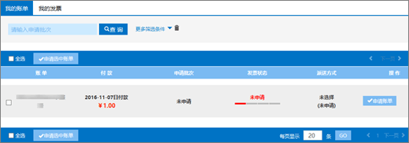
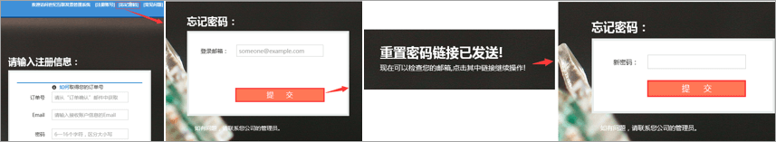

# Beantragen eines Fapiao für Office 365 betrieben von 21Vianet

Sie können Ihre Fapiao-Anforderung etwa drei Tage nach dem bezahlen an das 21Vianet-Fapiao-Verwaltungssystem senden. Nachdem Sie Ihre Fapiao-Anforderung gesendet haben, wird Sie in zwei Tagen verarbeitet.
  

  
## Schritt 1: beantragen einer Fapiao

Es gibt zwei Möglichkeiten, um eine Fapiao zu beantragen:
  
1. Nachdem Sie eine Zahlung im Office 365 von der 21Vianet-Website betrieben haben, erhalten Sie eine Bestätigungs-e-Mail mit Ihrer Bestellnummer und einen Link zum Fapiao-Verwaltungssystem. Sie können den Link in der e-Mail verwenden, um ein Konto im <a href="https://go.microsoft.com/fwlink/p/?linkid=837466" target="_blank">21Vianet Fapiao-informationsverwaltungssystem</a>zu erstellen.
    
    Oder:
    
2. Sie können ein Fapiao über das <a href="https://go.microsoft.com/fwlink/p/?linkid=850627" target="_blank">Admin Center</a>beantragen.
    
    
  
## Schritt 2: registrieren beim 21Vianet-Fapiao-Verwaltungssystem

> [!NOTE]
> Sie können den gleichen e-Mail-Namen und das gleiche Kennwort wie Ihr Office 365 Konto verwenden, oder Sie können etwas anderes verwenden. 
  
1. Wechseln Sie zum <a href="https://go.microsoft.com/fwlink/p/?linkid=837466" target="_blank">informationsverwaltungssystem 21Vianet Fapiao</a>.
    
2. Geben Sie im Registrierungsformular Ihre Bestellnummer, e-Mail-Adresse und Ihr Kennwort ein, und wählen Sie dann **Registrierung**aus.
    
    
  
3. Nachdem Ihre Registrierung abgeschlossen ist, sendet das System eine Aktivierungs-e-Mail an Ihre e-Mail-Adresse. Öffnen Sie die e-Mail-Nachricht, und wählen Sie den Link zum Aktivieren Ihres Kontos aus.
    
## Schritt 3: übermitteln Ihrer Rechnung für ein Fapiao

1. Melden Sie sich beim <a href="https://go.microsoft.com/fwlink/p/?linkid=837465" target="_blank">Fapiao-Verwaltungssystem</a>an.
    
2. Wählen Sie den Abrechnungsdaten Satz aus, und wählen Sie dann **Rechnung anwenden**aus.
    
    > [!NOTE]
    > Das Zahlungssystem befindet sich auf einer Plattform eines Drittanbieters und dauert drei Tage, um den Bestell-und Zahlungsdatensatz zu synchronisieren. 
  
    
  
3. Wählen Sie den Typ Fapiao aus, geben Sie die erforderlichen Informationen ein, und wählen Sie dann **weiter**aus.
    
    
  
    > [!NOTE]
    > - Bei einer normalen MwSt-Fapiao müssen Sie nur den Namen des Käufers eingeben.
    > - Bei Bedarf können Sie ein Fapiao mit einem anderen Titel beantragen. Sie können jedoch nur einen Fapiao-Titel für eine Rechnung im System anwenden. Wenn Sie das Fapiao in unterschiedliche Beträge oder Titel aufteilen möchten, <a href="https://portal.partner.microsoftonline.cn/Support/SupportOverview.aspx" target="_blank">Senden Sie Ihre Anfrage im Admin Center</a>.
    > - Wenn Sie das nächste Mal ein Fapiao-System beantragen, zeigt das System automatisch die vorherigen Fapiao-Informationen an.
    > - Wenn Sie einen Kauf Schein oder eine Rückerstattung benötigen, müssen der Payer-Name und der Fapiao-Titel übereinstimmen.
    
4. Wählen Sie eine Versandmethode aus, und geben Sie die e-Mail-Informationen ein. Sie können Yunda oder SF (Freight Collect) auswählen. Sie können auch zur 21Vianet Shanghai Branch wechseln, um die Fapiao zu erhalten. Wählen Sie **weiter**aus.
    
    
  
    **21Vianet Shanghai Branch Company Address:**

    Shanghai, Pudong New Area Keyuan Road No. 88, Deutsches Zentrum, Gebäude 3, 657

    **Kontaktinformationen:**

    Zhu Qin Qin 021-28986102
   
5. Stellen Sie sicher, dass die Informationen richtig sind, und wählen Sie **bestätigen**aus.
    
    
  
## Schritt 4: Überprüfen des Anwendungsstatus

Ihre Anwendung wird automatisch an das 21Vianet Service Center übermittelt und wird in zwei Werktagen abgeschlossen.
  
Nachdem Sie die Anwendung gesendet haben, können Sie den Status jederzeit überprüfen. Wir aktualisieren den Status Ihrer Anwendung mit Kommentaren wie " **ausgestellt** " oder **"gesendet"**.
  

  
Wenn Fapiao nicht verwendet wird, zeigt das System einen Hinweis an und gibt an, zu welchem Zeitpunkt die Fapiao ausgegeben werden soll.
  

  
## FAQs

### Welche Dienste kann ich über den Online Support erhalten?

Sie können den Fortschritt ihrer Fapiao-Anforderung überprüfen und herausfinden, warum Sie die Fapiao nicht erhalten haben.
  
Wenn Sie den Fapiao-Titel ändern möchten, senden Sie uns das Fapiao, und wir werden das Fapiao erneut herausgeben. Sie können die Anforderung über das <a href="https://portal.partner.microsoftonline.cn/Support/SupportOverview.aspx" target="_blank">Admin Center</a>übermitteln.
  

  
### Wie ändere ich meine Anmelde-e-Mail-Adresse und Ihr Kennwort?

1. Melden Sie sich beim <a href="https://go.microsoft.com/fwlink/p/?linkid=837465" target="_blank">Fapiao-Verwaltungssystem</a>an, und wählen Sie dann **e-Mail-Adresse ändern**aus.
    
    
  
2. Wenn Sie Ihr Anmeldekennwort vergessen haben, können Sie Ihre Anmelde-e-Mail-Adresse verwenden, um das Kennwort zurückzusetzen. Das Fapiao-Verwaltungssystem wird ein neues Kennwort an Ihre e-Mail-Adresse senden. Sie können das neue Kennwort verwenden, um sich anzumelden.
    
    
  
3. Wenn Sie Ihre Anmelde-e-Mail-Adresse vergessen haben, wenden Sie sich an den 21Vianet-Kundendienst unter (86) 400-089-0365.
    
### Wie finde ich meine Bestell-ID?

1. Wechseln Sie im [Admin Center](https://go.microsoft.com/fwlink/p/?linkid=850627)zur Seite **Billing** \> **Bills & Zahlungen** .
    
2. Suchen Sie nach der gewünschten Rechnung, wählen Sie zum Anzeigen aus, oder laden Sie die PDF-Datei herunter.

  
### Was geschieht, wenn ich bei der Registrierung die falsche e-Mail-Adresse eingebe?

Wenn Sie bei der Registrierung die falsche e-Mail-Adresse eingeben, erhalten Sie keine Aktivierungs-e-Mail. Der Registrierungslink in der e-Mail läuft nach 24 Stunden automatisch ab. Sie können zur <a href="https://go.microsoft.com/fwlink/p/?linkid=837466" target="_blank">Registrierungsseite</a> zurückkehren und sich mit der korrekten e-Mail-Adresse erneut registrieren. 
  
### Was geschieht, wenn ich keine Aktivierungs-e-Mail erhalte?

Wenn Sie innerhalb von 24 Stunden nach der Registrierung keine Konto Aktivierungs-e-Mail erhalten, wechseln Sie zum <a href="https://go.microsoft.com/fwlink/p/?linkid=837466" target="_blank">informationsverwaltungssystem 21Vianet Fapiao</a>, geben Sie Ihre e-Mail-Adresse ein, und wählen Sie dann **die Aktivierungs-e-Mail erneut senden**aus. Das System sendet die Konto Aktivierungs-e-Mail erneut an Ihre registrierte e-Mail-Adresse.
  

  
Wenn Sie weiterhin keine Aktivierungs-e-Mail erhalten, wenden Sie sich an den 21Vianet-Kundendienst unter (86) 400-089-0365.