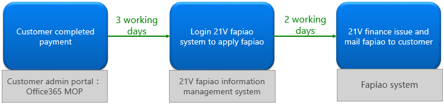
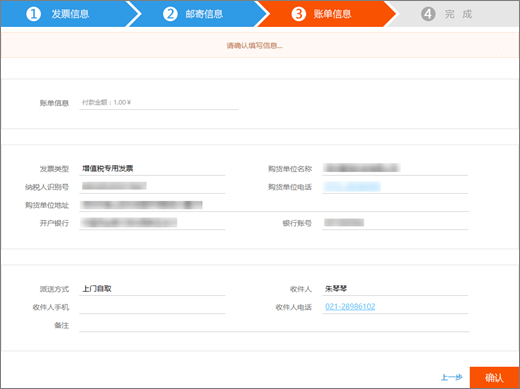

# Apply for a Fapiao for Office 365 operated by 21VianetApply for a Fapiao for Office 365 operated by 21Vianet

> [!NOTE]
> Das Admin Center wird geändert.The admin center is changing. Wenn Ihre Erfahrung nicht den hier aufgeführten Details entspricht, lesen Sie [über das neue Microsoft 365 Admin Center](https://docs.microsoft.com/microsoft-365/admin/microsoft-365-admin-center-preview?view=o365-21vianet&preserve-view=true).If your experience doesn't match the details presented here, see [About the new Microsoft 365 admin center](https://docs.microsoft.com/microsoft-365/admin/microsoft-365-admin-center-preview?view=o365-21vianet&preserve-view=true).

Sie können Ihre Anforderung an das 21Vianet -Fapiao-Verwaltungssystem etwa drei Tage nach dem Bezahlen übermitteln.You can submit your Fapiao request to the 21Vianet Fapiao management system about three days after you have paid. Nachdem Sie Ihre Anforderung an Fapiao übermittelt haben, wird sie in zwei Tagen verarbeitet.After you submit your Fapiao request, it will be processed in two days.
  

  
## Schritt 1: Anwenden auf einen FapiaoStep 1: Apply for a Fapiao

Es gibt zwei Möglichkeiten, sich für einen Fapiao zu bewerben:There are two ways to apply for a Fapiao:
  
1. Nach einer Zahlung auf der Office 365-Website, betrieben von 21Vianet, erhalten Sie eine Auftragsbestätigungs-E-Mail mit Ihrer Bestellnummer und einem Link zum Fapiao-Verwaltungssystem.After making a payment in the Office 365 operated by 21Vianet website, you'll receive an order confirmation email that contains your order number and a link to the Fapiao management system. Sie können den Link in der E-Mail verwenden, um ein Konto im <a href="https://go.microsoft.com/fwlink/p/?linkid=837466" target="_blank">21Vianet Fapiao Information Management System zu erstellen.</a>You can use the link in the email to create an account in the <a href="https://go.microsoft.com/fwlink/p/?linkid=837466" target="_blank">21Vianet Fapiao information management system</a>.

    OderOr

2. Sie können sich über das Admin Center für eine Fapiao <a href="https://go.microsoft.com/fwlink/p/?linkid=850627" target="_blank">bewerben.</a>You can apply for a Fapiao from the <a href="https://go.microsoft.com/fwlink/p/?linkid=850627" target="_blank">admin center</a>.

    
  
## Schritt 2: Registrieren beim 21Vianet Fapiao-VerwaltungssystemStep 2: Register with the 21Vianet Fapiao management system

> [!NOTE]
> Sie können denselben E-Mail-Namen und dasselbe Kennwort wie Ihr Office 365-Konto verwenden, oder Sie können etwas anderes verwenden.You can use the same email name and password as your Office 365 account, or you can use something different.
  
1. Wechseln Sie zum <a href="https://go.microsoft.com/fwlink/p/?linkid=837466" target="_blank">Informationsverwaltungssystem 21Vianet Fapiao.</a>Go to the <a href="https://go.microsoft.com/fwlink/p/?linkid=837466" target="_blank">21Vianet Fapiao information management system</a>.

2. Geben Sie im Registrierungsformular Ihre Bestellnummer, E-Mail-Adresse und ihr Kennwort ein, und wählen Sie dann **"Registrierung" aus.**In the registration form, enter your order number, email address, and password, then select **Registration**.

    
  
3. Nach Abschluss der Registrierung sendet das System eine Aktivierungs-E-Mail-Nachricht an Ihre E-Mail-Adresse.After your registration is complete, the system will send an activation email message to your email address. Öffnen Sie die E-Mail-Nachricht, und wählen Sie den Link zum Aktivieren Ihres Kontos aus.Open the email message and select the link to activate your account.

## Schritt 3: Übermitteln Ihrer Rechnung für einen FapiaoStep 3: Submit your bill for a Fapiao

1. Melden Sie sich beim <a href="https://go.microsoft.com/fwlink/p/?linkid=837465" target="_blank">Verwaltungssystem Fapiao an.</a>Log in to the <a href="https://go.microsoft.com/fwlink/p/?linkid=837465" target="_blank">Fapiao management system</a>.

2. Wählen Sie den Abrechnungsdatensatz und dann **"Rechnung übernehmen" aus.**Select the billing record, then select **Apply bill**.

    > [!NOTE]
    > Das Zahlungssystem befindet sich auf einer Drittanbieterplattform und benötigt drei Tage, um den Bestell- und Zahlungsdatensatz zu synchronisieren.The payment system is on a third-party platform and takes three days to synchronize the order and payment record.
  
    
  
3. Wählen Sie den Typ "Fapiao" aus, geben Sie die erforderlichen Informationen ein, und wählen Sie dann **"Weiter" aus.**Select the Fapiao type, enter the required information, then select **Next**.

    
  
    > [!NOTE]
    > - Bei einem normalen Umsatzsteuer-Fapiao müssen Sie nur den Namen des Käufers eingeben.For a normal VAT Fapiao, you only need to enter the buyer's name.
    > - Falls erforderlich, können Sie eine Fapiao mit einem anderen Titel beantragen.If necessary, you can apply for a Fapiao with different a title. Sie können jedoch nur einen Fapiao-Titel für eine Rechnung im System anwenden.However, you can only apply one Fapiao title for one bill in the system. Wenn Sie den Fapiao in verschiedene Mengen oder Titel aufteilen möchten, übermitteln Sie Ihre Anfrage <a href="https://portal.partner.microsoftonline.cn/Support/SupportOverview.aspx" target="_blank">im Admin Center.</a>If you want to split the Fapiao into different amounts or titles, please <a href="https://portal.partner.microsoftonline.cn/Support/SupportOverview.aspx" target="_blank">submit your request in the admin center</a>.
    > - Wenn Sie sich das nächste Mal für einen Fapiao bewerben, zeigt das System automatisch die vorherigen Informationen zu Fapiao an.The next time you apply for a Fapiao, the system automatically presents the previous Fapiao information.
    > - Wenn Sie ein Kaufzertifikat oder eine Rückerstattung benötigen, müssen der Name des Zahlende und der Titel des Fapiao übereinstimmen.If you need a purchase certificate or a refund, the payer name and the Fapiao title must match.

4. Wählen Sie eine Versandmethode aus, und geben Sie die Postanschrift ein.Select a shipping method and enter the mailing information. Sie können Yunda oder SF (Fracht sammeln) auswählen.You can choose Yunda or SF (freight collect). Sie können auch zur Verzweigung 21Vianet Shanghai wechseln, um die Fapiao zu erhalten.You can also go to the 21Vianet Shanghai branch to get the Fapiao. Wählen Sie **"Weiter"** aus.select **Next**.

    
  
    **21Vianet Shanghai Branch Company address:****21Vianet Shanghai branch company address:**

    Shanghai, Pudong New Area Keyuan Road No.Shanghai, Pudong New Area Keyuan Road No. 88, Deutsches Center, Gebäude 3, 65788, German Center, building 3, 657

    **Kontaktinformationen:****Contact information:**

    Zhu 201-28986102Zhu qin qin 021-28986102

5. Stellen Sie sicher, dass die Informationen korrekt sind, und wählen Sie dann **"Bestätigen" aus.**Verify that the information is correct, then select **Confirm**.

    
  
## Schritt 4: Überprüfen des AnwendungsfortschrittsStep 4: Check application progress

Ihre Anwendung wird automatisch an das 21Vianet Service Center übertragen und in zwei Arbeitstagen abgeschlossen.Your application is automatically transmitted to the 21Vianet Service Center, and will be completed in two working days.
  
Nachdem Sie die Anwendung übermittelt haben, können Sie den Fortschritt jederzeit überprüfen.After you submit the application, you can check the progress at any time. We will update the status of your application with remarks like **Issued** or **Mailed out**.We will update the status of your application with remarks like **Issued** or **Mailed out**.
  

  
Wenn Fapiao nicht mehr verwendet wird, zeigt das System einen Hinweis an und gibt den erwarteten Zeitpunkt für die Ausgabe der Fapiao an.When Fapiao is out of use, the system will display a notice, and will indicate the expected time to issue the Fapiao.
  

  
## Häufig gestellte FragenFAQs

### Welche Dienste kann ich vom Onlinesupport erhalten?What services can I get from online support?

Sie können den Fortschritt Ihrer Anforderung Fapiao überprüfen und herausfinden, warum Sie die Fapiao nicht erhalten haben.You can check the progress of your Fapiao request, and find out why you haven't received the Fapiao.
  
Wenn Sie den Titel "Fapiao" ändern möchten, senden Sie den Fapiao zurück an uns, und wir werden die Fapiao erneut aussenten.If you want to change the Fapiao title, please send the Fapiao back to us and we will reissue the Fapiao. Sie können die Anforderung über das <a href="https://portal.partner.microsoftonline.cn/Support/SupportOverview.aspx" target="_blank">Admin Center übermitteln.</a>You can submit the request through the <a href="https://portal.partner.microsoftonline.cn/Support/SupportOverview.aspx" target="_blank">admin center</a>.
  

  
### Wie kann ich meine Anmelde-E-Mail-Adresse und mein Kennwort ändern?How do I change my login email address and password?

1. Melden Sie sich beim <a href="https://go.microsoft.com/fwlink/p/?linkid=837465" target="_blank">Verwaltungssystem von Fapiao an,</a>und wählen Sie **dann "E-Mail-Adresse ändern" aus.**Log in to the <a href="https://go.microsoft.com/fwlink/p/?linkid=837465" target="_blank">Fapiao management system</a>, then select **Change email address**.

    
  
2. Wenn Sie Ihr Anmeldekennwort vergessen haben, können Sie Ihre Anmelde-E-Mail-Adresse verwenden, um das Kennwort zurückzusetzen.If you forgot your login password, you can use your login email address to reset the password. Das Verwaltungssystem von Fapiao sendet ein neues Kennwort an Ihre E-Mail-Adresse.The Fapiao management system will send a new password to your email address. Sie können das neue Kennwort für die Anmeldung verwenden.You can use the new password to login.

    
  
3. Wenn Sie Ihre Anmelde-E-Mail-Adresse vergessen haben, wenden Sie sich an den 21Vianet-Kundendienst unter (86) 400-089-0365.If you forgot your login email address, please contact 21Vianet customer service at (86) 400-089-0365.

### Wie finde ich meine Auftrags-ID?How do I find my order ID?

1. Wechseln Sie [im Admin Center](https://go.microsoft.com/fwlink/p/?linkid=850627)zur Seite "Abrechnungsabrechnungen &  \> **Zahlungen".**In the [admin center](https://go.microsoft.com/fwlink/p/?linkid=850627), go to the **Billing** \> **Bills & payments** page.

2. Suchen Sie die rechnung, die Sie anzeigen möchten, oder laden Sie die PDF herunter.Find the invoice you want, select to view, or choose to download the PDF.

### Was passiert, wenn ich bei der Registrierung die falsche E-Mail-Adresse einmelde?What if I enter the wrong email address when I register?

Wenn Sie bei der Registrierung die falsche E-Mail-Adresse eingeben, erhalten Sie die Aktivierungs-E-Mail nicht.If you enter the wrong email address when you register, you won't receive the activation email. Der Registrierungslink in der E-Mail läuft automatisch nach 24 Stunden ab.The registration link in the email will automatically expire after 24 hours. Sie können zur <a href="https://go.microsoft.com/fwlink/p/?linkid=837466" target="_blank">Registrierungsseite zurückkehren</a> und sich erneut mit der richtigen E-Mail-Adresse registrieren.You can return to the <a href="https://go.microsoft.com/fwlink/p/?linkid=837466" target="_blank">registration page</a> and register again with the correct email address.
  
### Was passiert, wenn ich keine Aktivierungs-E-Mail erhalte?What if I don't receive an activation email?

Wenn Sie innerhalb von 24 Stunden nach der Registrierung keine E-Mail zur Kontoaktivierung erhalten, wechseln Sie zum <a href="https://go.microsoft.com/fwlink/p/?linkid=837466" target="_blank">21Vianet Fapiao</a>Information Management System, geben Sie Ihre E-Mail-Adresse ein, und wählen Sie dann **die** Aktivierungs-E-Mail erneut senden aus.If you don't receive an account activation email within 24 hours after you register, go to the <a href="https://go.microsoft.com/fwlink/p/?linkid=837466" target="_blank">21Vianet Fapiao information management system</a>, enter your email address, then select **Resend the activation email**. Das System senden die Kontoaktivierungs-E-Mail erneut an Ihre registrierte E-Mail-Adresse.The system will resend the account activation email to your registered email address.
  

  
Wenn Sie weiterhin keine Aktivierungs-E-Mail erhalten, wenden Sie sich an den 21Vianet-Kundendienst unter (86) 400-089-0365.If you still don't receive an activation email, please contact 21Vianet customer service at (86) 400-089-0365.