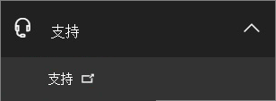

# Beantragen eines Fapiao für Office 365 betrieben von 21Vianet

Sie können Ihre Fapiao-Anforderung an das 21Vianet-Fapiao-Verwaltungssystem etwa drei Tage nach der 21Vianet-Fapiao-Verwaltung übermitteln. Nachdem Sie Ihre Fapiao-Anforderung übermittelt haben, wird sie in zwei Tagen verarbeitet.
  

  
## Schritt 1: Anwenden auf einen Fapiao

Es gibt zwei Möglichkeiten, sich für einen Fapiao zu bewerben:
  
1. Nachdem Sie eine Zahlung auf der Office 365 von der 21Vianet-Website durchgeführt haben, erhalten Sie eine Auftragsbestätigungs-E-Mail mit Ihrer Bestellnummer und einem Link zum Fapiao-Verwaltungssystem. Sie können den Link in der E-Mail verwenden, um ein Konto im <a href="https://go.microsoft.com/fwlink/p/?linkid=837466" target="_blank">21Vianet Fapiao-Informationsverwaltungssystem zu erstellen.</a>

    Oder

2. Sie können einen Fapiao im <a href="https://go.microsoft.com/fwlink/p/?linkid=850627" target="_blank">Admin Center beantragen.</a>

    
  
## Schritt 2: Registrieren beim 21Vianet Fapiao-Verwaltungssystem

> [!NOTE]
> Sie können den gleichen E-Mail-Namen und das gleiche Kennwort wie Ihr Office 365 verwenden, oder Sie können etwas anderes verwenden.
  
1. Wechseln Sie zum <a href="https://go.microsoft.com/fwlink/p/?linkid=837466" target="_blank">21Vianet Fapiao Information Management System</a>.

2. Geben Sie im Registrierungsformular Ihre Bestellnummer, E-Mail-Adresse und Ihr Kennwort ein, und wählen Sie dann **Registrierung aus.**

    
  
3. Nach Abschluss der Registrierung sendet das System eine Aktivierungs-E-Mail-Nachricht an Ihre E-Mail-Adresse. Öffnen Sie die E-Mail-Nachricht, und wählen Sie den Link aus, um Ihr Konto zu aktivieren.

## Schritt 3: Übermitteln Ihrer Rechnung für einen Fapiao

1. Melden Sie sich beim <a href="https://go.microsoft.com/fwlink/p/?linkid=837465" target="_blank">Fapiao-Verwaltungssystem an.</a>

2. Wählen Sie den Abrechnungsdatensatz aus, und wählen Sie **Dann Rechnung übernehmen aus.**

    > [!NOTE]
    > Das Zahlungssystem befindet sich auf einer Drittanbieterplattform und benötigt drei Tage, um den Auftrags- und Zahlungsdatensatz zu synchronisieren.
  
    
  
3. Wählen Sie den Fapiao-Typ aus, geben Sie die erforderlichen Informationen ein, und wählen Sie dann **Weiter aus.**

    
  
    > [!NOTE]
    > - Für eine normale Mehrwertsteuerfapiao müssen Sie nur den Namen des Käufers eingeben.
    > - Bei Bedarf können Sie einen Fapiao mit einem anderen Titel beantragen. Sie können jedoch nur einen Fapiao-Titel für eine Rechnung im System anwenden. Wenn Sie den Fapiao in verschiedene Mengen oder Titel aufteilen möchten, übermitteln Sie Ihre Anforderung bitte <a href="https://portal.partner.microsoftonline.cn/Support/SupportOverview.aspx" target="_blank">im Admin Center</a>.
    > - Wenn Sie sich das nächste Mal für einen Fapiao bewerben, zeigt das System automatisch die vorherigen Fapiao-Informationen an.
    > - Wenn Sie ein Kaufzertifikat oder eine Rückerstattung benötigen, müssen der Name des Zahlers und der Fapiao-Titel übereinstimmen.

4. Wählen Sie eine Versandmethode aus, und geben Sie die Mailinginformationen ein. Sie können Yunda oder SF (Frachtsammeln) auswählen. Sie können auch zur 21Vianet-Filiale in Shanghai wechseln, um den Fapiao zu erhalten. Wählen Sie **Weiter** aus.

    
  
    **21Vianet Shanghai Branch Company Address:**

    Shanghai, Pudong New Area Keyuan Road No. 88, German Center, Gebäude 3, 657

    **Kontaktinformationen:**

    Zhu qin qin 021-28986102

5. Stellen Sie sicher, dass die Informationen richtig sind, und wählen Sie **dann Bestätigen aus.**

    
  
## Schritt 4: Überprüfen des Anwendungsfortschritts

Ihre Anwendung wird automatisch an das 21Vianet Service Center übertragen und in zwei Arbeitstagen abgeschlossen.
  
Nachdem Sie die Anwendung übermittelt haben, können Sie den Fortschritt jederzeit überprüfen. Wir aktualisieren den Status Ihrer Anwendung mit Anmerkungen wie **Ausgestellt** oder **Per E-Mail gesendet.**
  

  
Wenn Fapiao nicht mehr verwendet wird, zeigt das System einen Hinweis an und gibt den erwarteten Zeitpunkt für die Ausgabe des Fapiao an.
  

  
## Häufig gestellte Fragen

### Welche Dienste kann ich vom Onlinesupport erhalten?

Sie können den Fortschritt Ihrer Fapiao-Anforderung überprüfen und herausfinden, warum Sie den Fapiao nicht erhalten haben.
  
Wenn Sie den Fapiao-Titel ändern möchten, senden Sie den Fapiao zurück an uns, und wir stellen den Fapiao neu aus. Sie können die Anforderung über das <a href="https://portal.partner.microsoftonline.cn/Support/SupportOverview.aspx" target="_blank">Admin Center übermitteln.</a>
  

  
### Wie kann ich meine Anmelde-E-Mail-Adresse und mein Kennwort ändern?

1. Melden Sie sich beim <a href="https://go.microsoft.com/fwlink/p/?linkid=837465" target="_blank">Fapiao-Verwaltungssystem an,</a>und wählen Sie **dann E-Mail-Adresse ändern aus.**

    
  
2. Wenn Sie Ihr Anmeldekennwort vergessen haben, können Sie Ihre Anmelde-E-Mail-Adresse verwenden, um das Kennwort zurückzusetzen. Das Fapiao-Verwaltungssystem sendet ein neues Kennwort an Ihre E-Mail-Adresse. Sie können das neue Kennwort verwenden, um sich anzumelden.

    
  
3. Wenn Sie Ihre Anmelde-E-Mail-Adresse vergessen haben, wenden Sie sich bitte an den 21Vianet-Kundendienst unter (86) 400-089-0365.

### Wie finde ich meine Bestell-ID?

1. Wechseln Sie [im Admin Center](https://go.microsoft.com/fwlink/p/?linkid=850627)zur Seite  \> **Abrechnungsrechnungen & Zahlungen.**

2. Suchen Sie die Rechnung, die Sie möchten, wählen Sie zum Anzeigen aus, oder wählen Sie aus, um die PDF herunterzuladen.

### Was passiert, wenn ich bei der Registrierung die falsche E-Mail-Adresse einnann?

Wenn Sie bei der Registrierung die falsche E-Mail-Adresse eingeben, erhalten Sie die Aktivierungs-E-Mail nicht. Der Registrierungslink in der E-Mail läuft automatisch nach 24 Stunden ab. Sie können zur <a href="https://go.microsoft.com/fwlink/p/?linkid=837466" target="_blank">Registrierungsseite zurückkehren</a> und sich erneut mit der richtigen E-Mail-Adresse registrieren.
  
### Was passiert, wenn ich keine Aktivierungs-E-Mail erhalte?

Wenn Sie innerhalb von 24 Stunden nach der Registrierung keine Kontoaktivierungs-E-Mail erhalten, wechseln Sie zum <a href="https://go.microsoft.com/fwlink/p/?linkid=837466" target="_blank">21Vianet</a>Fapiao-Informationsverwaltungssystem, geben Sie Ihre E-Mail-Adresse ein, und wählen Sie dann Aktivierungs-E-Mail erneut senden aus.  Das System senden die Kontoaktivierungs-E-Mail erneut an Ihre registrierte E-Mail-Adresse.
  

  
Wenn Sie weiterhin keine Aktivierungs-E-Mail erhalten, wenden Sie sich bitte an den 21Vianet-Kundendienst unter (86) 400-089-0365.