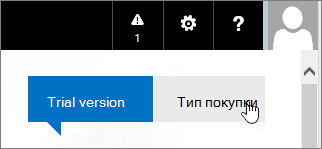

# Kaufen oder Testen von Abonnements für Office 365 betrieben von 21VianetBuy or try subscriptions for Office 365 operated by 21Vianet

> [!NOTE]
>  Dieser Artikel bezieht sich auf Office 365, die von 21Vianet in China betrieben werden.This article applies to Office 365 operated by 21Vianet in China.

## Office 365 kaufen oder ausprobierenBuy or try Office 365

Sie können ein Abonnement sofort erwerben oder Office 365 bis zu 30 Tage lang testen.You can buy a subscription right away, or you can try Office 365 for up to 30 days. Wenn es Ihnen gefällt, können Sie Ihr Testabonnement kaufen und die Domäne, die Daten und die Konfiguration beibehalten, die Sie in Ihrer Testversion eingerichtet haben.If you like it, you can buy your trial subscription and keep the domain, data, and configuration you set up in your trial.

1. Wechseln Sie zu [Office 365 für Unternehmen Pläne vergleichen](https://go.microsoft.com/fwlink/p/?linkid=393691&amp;clcid=0x409) , und wählen Sie den Namen des Plans aus, den Sie kaufen möchten.Go to [Compare Office 365 for business plans](https://go.microsoft.com/fwlink/p/?linkid=393691&amp;clcid=0x409) and select the name of the plan you want to buy. Wählen Sie dann **Jetzt kaufen**aus.Then, select **Buy now**.

2. Erstellen Sie ein Konto, indem Sie die Seite **nur wenige Details** ausfüllen.Create an account by filling out the **Just a few details** page.

3. Befolgen Sie die Anweisungen zum Einrichten Ihrer 30-tägigen Testversion oder zum Abschließen des Kaufs.Follow the instructions to set up your 30-day trial or to complete your purchase.

## Kaufen Sie Ihr TestabonnementBuy your trial subscription

1. [Melden Sie sich bei Office 365](https://go.microsoft.com/fwlink/p/?linkid=513813) mit Ihrem Geschäfts-, Schul- oder Unikonto an.[Sign in to Office 365](https://go.microsoft.com/fwlink/p/?linkid=513813) with your work or school account.

2. Wenn Sie sich noch nicht auf der Startseite befinden, wählen Sie **Office 365** in der oberen linken Ecke aus.If you're not already on the start page, select **Office 365** in the top-left hand corner.

    

3. Wählen Sie oben rechts auf der Seite unter der Navigationsleiste die Option **Erwerben** aus.At the top right-hand corner of the page, under the navigation bar, select **Purchase**.

    

4. Auf der Seite **Abonnements erwerben** sehen Sie die verschiedenen Pläne, die Sie kaufen können. Der von Ihnen verwendete Testplan ist mit dem Banner **Testversion** gekennzeichnet.On the **Purchase subscriptions** page, you'll see the different plans that you can buy. The plan that you've been trying is identified by the **In Trial** banner.

    > [!IMPORTANT]
    > Wenn Sie einen anderen Plan aus dem Testplan erwerben, müssen Sie Ihre Lizenzen aus dem Testplan Ihrem neuen Plan (vor Ablauf der 90-tägigen Kulanzzeit nach Ablauf des Test Plans) zuweisen, um Ihre Daten, Konten und Konfigurationen beizubehalten.If you purchase a different plan from your trial plan, you have to reassign your licenses from your trial plan to your new plan (before your 90-day grace period ends after your trial plan expires) in order to retain your data, accounts, and configuration. Andernfalls gehen Ihre Daten, Konten und Konfigurationen verloren.Otherwise, you will lose your data, accounts, and configuration.

5. Wählen Sie das Abonnement aus, das Sie erwerben möchten, und wählen Sie dann **Jetzt kaufen** aus.Select the subscription that you want to purchase and then select **Buy now**.

6. Führen Sie die Schritte zum Auschecken aus.Follow the steps to check out.

## Hinzufügen von Abonnements oder Add-ons zu einem vorhandenen Office 365-KontoAdd subscriptions or add-ons to an existing Office 365 account

1. Wechseln Sie im [Admin Center](https://go.microsoft.com/fwlink/p/?linkid=850627)zur Seite **Abrechnungs** - \> **Einkaufsdienste** .In the [admin center](https://go.microsoft.com/fwlink/p/?linkid=850627), go to the **Billing** \> **Purchase services** page.

2. Wählen Sie die Dienste aus, die Sie kaufen möchten, wählen Sie **kaufen**aus, und wählen Sie dann **jetzt Auschecken aus**.Select the service(s) that you'd like to purchase, select **Buy**, and then select **Check out now**.

3. Befolgen Sie die Anweisungen, um den Kauf abzuschließen.Follow the instructions to complete your purchase.

## ZahlungsoptionenPayment options

Sie können für Ihr Abonnement bezahlen:You can pay for your subscription by:

- RechnungInvoice

- Online Zahlung mit Alipay oder China UnionpayOnline payment using Alipay or China UnionPay

Der Zahlungsnachweis wird in Form von Fapiaos bereitgestellt.Proof of payment will be provided in the form of Fapiaos. Sie können Ihre Fapiao-Anforderung in unserem [Fapiao-System](https://go.microsoft.com/fwlink/p/?LinkId=395314) über drei (3) Tage nach Ihrer Zahlung übermitteln.You can submit your Fapiao request to our [Fapiao system](https://go.microsoft.com/fwlink/p/?LinkId=395314) about three (3) days after you have paid. Weitere Informationen finden Sie unter [Apply for a Fapiao for Office 365 operated by 21Vianet](apply-for-a-fapiao.md).For more information, see [Apply for a Fapiao for Office 365 operated by 21Vianet](apply-for-a-fapiao.md).

> [!NOTE]
>  Internationale Kreditkarten werden nicht akzeptiert.International credit cards are not accepted.
