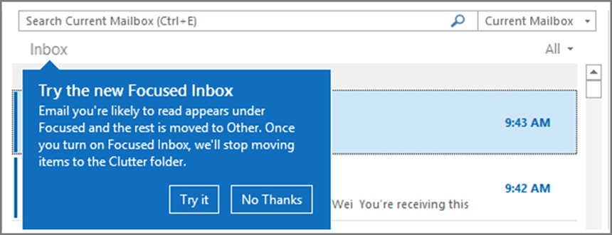

# <a name="configure-focused-inbox-for-everyone-in-your-organization"></a><span data-ttu-id="5bce5-103">Konfigurieren des Posteingangs mit Relevanz für jeden Benutzer in Ihrer Organisation</span><span class="sxs-lookup"><span data-stu-id="5bce5-103">Configure Focused Inbox for everyone in your organization</span></span>

<span data-ttu-id="5bce5-104">Wenn Sie dafür zuständig sind, die Funktion der E-Mail für JEDEN in einem Unternehmen zu konfigurieren, dann ist das genau der Artikel für Sie!</span><span class="sxs-lookup"><span data-stu-id="5bce5-104">If you're responsible for configuring how email works for EVERYONE in a business this article is for you!</span></span> <span data-ttu-id="5bce5-105">Es wird erläutert, wie Sie die E-Mail-Funktion für Ihr Unternehmen anpassen oder deaktivieren und beantwortet [Häufig gestellte Fragen](#faq-for-focused-inbox).</span><span class="sxs-lookup"><span data-stu-id="5bce5-105">It explains how to customize it or turn it off for your business, and answers [frequently asked questions](#faq-for-focused-inbox).</span></span>

<span data-ttu-id="5bce5-106">Wenn Sie den Posteingang mit Relevanz für sich selbst deaktivieren möchten, lesen Sie [Deaktivieren des Posteingangs mit Relevanz](https://support.microsoft.com/office/f714d94d-9e63-4217-9ccb-6cb2986aa1b2).</span><span class="sxs-lookup"><span data-stu-id="5bce5-106">If you would like to turn off Focused Inbox for just yourself, please see [Turn off Focused Inbox](https://support.microsoft.com/office/f714d94d-9e63-4217-9ccb-6cb2986aa1b2).</span></span>  

<span data-ttu-id="5bce5-p102">Wenn Sie sicher sein möchten, dass Ihre Benutzer geschäftsspezifische E-Mail-Nachrichten wie E-Mails von der Personalabteilung oder der Buchhaltung erhalten, können Sie den Posteingang mit Relevanz so konfigurieren, dass diese Nachrichten in der Ansicht "Relevant" angezeigt werden. Sie können außerdem steuern, ob den Benutzern in Ihrer Organisation der Posteingang mit Relevanz angezeigt wird.</span><span class="sxs-lookup"><span data-stu-id="5bce5-p102">If you want to be sure that your users receive business-specific email messages, for example, from HR or payroll, you can configure Focused Inbox so these messages reach the Focused view. You can also control whether users in your organization see the Focused Inbox in their mailbox.</span></span>
  
## <a name="turn-focused-inbox-on-or-off-in-your-organization"></a><span data-ttu-id="5bce5-109">Aktivieren oder Deaktivieren von "Posteingang mit Relevanz" in Ihrer Organisation</span><span class="sxs-lookup"><span data-stu-id="5bce5-109">Turn Focused Inbox On or Off in your organization</span></span>

<span data-ttu-id="5bce5-110">Sie verwenden PowerShell, um den Posteingang mit Relevanz für alle Benutzer in Ihrer Organisation zu aktivieren oder deaktivieren.</span><span class="sxs-lookup"><span data-stu-id="5bce5-110">You use PowerShell to turn Focused Inbox on or off for everyone in your organization.</span></span> <span data-ttu-id="5bce5-111">Möchten Sie diesen Vorgang im Microsoft 365 Admin Center ausführen?</span><span class="sxs-lookup"><span data-stu-id="5bce5-111">Do you want to do this in the Microsoft 365 admin center?</span></span> <span data-ttu-id="5bce5-112">Teilen Sie dies unserem Entwicklungsteam mit.</span><span class="sxs-lookup"><span data-stu-id="5bce5-112">Let our Engineering team know.</span></span> <span data-ttu-id="5bce5-113">**[Stimmen Sie hier ab!](https://go.microsoft.com/fwlink/?linkid=862489)**</span><span class="sxs-lookup"><span data-stu-id="5bce5-113">**[Vote here!](https://go.microsoft.com/fwlink/?linkid=862489)**</span></span>
  
<span data-ttu-id="5bce5-114">**So deaktivieren Sie den Posteingang mit Relevanz:**</span><span class="sxs-lookup"><span data-stu-id="5bce5-114">**To turn off Focused Inbox:**</span></span>
  
<span data-ttu-id="5bce5-p104">In dem folgenden PowerShell-Beispiel wird der Posteingang mit Relevanz in Ihrer Organisation auf **Aus** festgelegt. Dadurch wird die Verfügbarkeit der Funktion für Ihre Benutzer jedoch nicht blockiert. Auf Wunsch können sie den Posteingang mit Relevanz trotzdem wieder auf jedem ihrer Clients aktivieren. </span><span class="sxs-lookup"><span data-stu-id="5bce5-p104">The following PowerShell example turns Focused Inbox **Off** in your organization. However, it doesn't block the availability of the feature for your users. If they want, they can still re-enable Focused Inbox again on each of their clients.</span></span> 
  
1. <span data-ttu-id="5bce5-118">[Stellen Sie eine Verbindung mit Exchange Online mithilfe der Remote-PowerShell her](/powershell/exchange/connect-to-exchange-online-powershell).</span><span class="sxs-lookup"><span data-stu-id="5bce5-118">[Connect to Exchange Online using remote PowerShell](/powershell/exchange/connect-to-exchange-online-powershell).</span></span>

2. <span data-ttu-id="5bce5-p105">Ihnen müssen Berechtigungen zugewiesen werden, bevor Sie diese Verfahren ausführen können. Informationen zu den benötigten Berechtigungen finden Sie unter dem Eintrag "Transportregeln" in [Berechtigungen für Empfängerrichtlinien und Compliance](/exchange/messaging-policy-and-compliance-permissions-exchange-2013-help).</span><span class="sxs-lookup"><span data-stu-id="5bce5-p105">You need to be assigned permissions before you can perform this procedure or procedures. To see what permissions you need, see the "Transport rules" entry in [Messaging policy and compliance permissions](/exchange/messaging-policy-and-compliance-permissions-exchange-2013-help).</span></span>

3. <span data-ttu-id="5bce5-121">Führen Sie das Cmdlet **Get-OrganizationConfig** aus.</span><span class="sxs-lookup"><span data-stu-id="5bce5-121">Run the **Get-OrganizationConfig** cmdlet.</span></span> 

    ```powershell
    Get-OrganizationConfig
    ```

4. <span data-ttu-id="5bce5-122">Suchen Sie nach **FocusedInboxOn**, um die aktuelle Einstellung anzuzeigen:</span><span class="sxs-lookup"><span data-stu-id="5bce5-122">Look for **FocusedInboxOn** to view its current setting:</span></span> 

    
  
5. <span data-ttu-id="5bce5-124">Führen Sie das folgende Cmdlet aus, um "Posteingang mit Relevanz" zu deaktivieren.</span><span class="sxs-lookup"><span data-stu-id="5bce5-124">Run the following cmdlet to turn Focused Inbox off.</span></span>

    ```powershell
    Set-OrganizationConfig -FocusedInboxOn $false
    ```

6. <span data-ttu-id="5bce5-125">Führen Sie das Cmdlet **Get-OrganizationConfig** erneut aus, und Sie sehen, dass "FocusedInboxOn" auf "$false" festgelegt ist, d. h. dass der Posteingang mit Relevanz deaktiviert ist.</span><span class="sxs-lookup"><span data-stu-id="5bce5-125">Run the **Get-OrganizationConfig** cmdlet again and you'll see that FocusedInboxOn is set to $false, which means it's been turned off.</span></span> 

<span data-ttu-id="5bce5-126">**So aktivieren Sie den Posteingang mit Relevanz:**</span><span class="sxs-lookup"><span data-stu-id="5bce5-126">**To turn on Focused Inbox:**</span></span>
  
- <span data-ttu-id="5bce5-127">Führen Sie in Schritt 5 oben das folgende Cmdlet aus, um "Posteingang mit Relevanz" zu aktivieren.</span><span class="sxs-lookup"><span data-stu-id="5bce5-127">In Step 5 above, run the following cmdlet to turn Focused Inbox on.</span></span>

  ```powershell
  Set-OrganizationConfig -FocusedInboxOn $true
  ```
    
## <a name="what-do-users-see-after-i-turn-on-focused-inbox"></a><span data-ttu-id="5bce5-128">Was wird Benutzern angezeigt, nachdem der Posteingang mit Relevanz aktiviert wurde? </span><span class="sxs-lookup"><span data-stu-id="5bce5-128">What do users see after I turn on Focused Inbox?</span></span>

<span data-ttu-id="5bce5-p106">Der Posteingang mit Relevanz wird Benutzern erst nach dem Schließen und erneuten Starten von Outlook angezeigt. Beim Neustart von Outlook wird ein Tipp in der Outlook-Benutzeroberfläche angezeigt, der auf die Möglichkeit verweist, den neuen Posteingang mit Relevanz zu nutzen.</span><span class="sxs-lookup"><span data-stu-id="5bce5-p106">Your users will see the Focused view only after they close and restart Outlook. When they restart Outlook, they'll see a Tip in the Outlook user interface giving them to the option to use the new Focused Inbox.</span></span>
  

  
<span data-ttu-id="5bce5-p107&quot;>Wenn Sie von &quot;Clutter&quot; zum Posteingang mit Relevanz wechseln, können sie entscheiden, ob sie ihn aktivieren (&quot;Testen") oder das Feature schließen möchten. Wenn ein Benutzer über mehrere (unterstützte) Clients verfügt, kann er den Posteingang mit Relevanz für jeden Client einzeln aktivieren bzw. deaktivieren. Der Tipp sieht so aus:</span><span class="sxs-lookup"><span data-stu-id="5bce5-p107">If you're switching from Clutter to Focused Inbox, they can decide to enable it ("Try it") or dismiss the feature. If the user has multiple (supported) clients, they can enable/disable Focused Inbox individually on each one. The tip looks like this:</span></span>
  

  
<span data-ttu-id="5bce5-p108">Wenn sich ein Benutzer zur Nutzung des Posteingangs mit Relevanz entscheidet, wird die Funktion "Clutter" automatisch deaktiviert. Der Ordner "Clutter" wird in einen Standardordner umgewandelt, sodass der Benutzer ihn umbenennen oder löschen kann.</span><span class="sxs-lookup"><span data-stu-id="5bce5-p108">When a user decides to start using Focused Inbox, Clutter gets disabled automatically. The Clutter folder gets converted into a standard folder, that allows the user to rename or delete it.</span></span>
  
## <a name="turn-focused-inbox-on-or-off-for-specific-users"></a><span data-ttu-id="5bce5-138">Aktivieren oder Deaktivieren des Posteingangs mit Relevanz für bestimmte Benutzer</span><span class="sxs-lookup"><span data-stu-id="5bce5-138">Turn Focused Inbox On or Off for specific users</span></span>

<span data-ttu-id="5bce5-139">In diesem Beispiel wird "Posteingang mit Relevanz" für Tim Matthews in der Organisation Contoso auf **Aus** festgelegt.</span><span class="sxs-lookup"><span data-stu-id="5bce5-139">This example turns Focused Inbox **Off** for Tim Matthews in the Contoso organization.</span></span> <span data-ttu-id="5bce5-140">Dadurch wird die Verfügbarkeit der Funktion für ihn jedoch nicht blockiert.</span><span class="sxs-lookup"><span data-stu-id="5bce5-140">However, it doesn't block the availability of the feature to him.</span></span> <span data-ttu-id="5bce5-141">Auf Wunsch kann er den Posteingang mit Relevanz trotzdem wieder auf jedem seiner Clients aktivieren.</span><span class="sxs-lookup"><span data-stu-id="5bce5-141">If he wants, he can still re-enable Focused Inbox again on each of his clients.</span></span> 
  
1. <span data-ttu-id="5bce5-142">[Stellen Sie eine Verbindung mit Exchange Online mithilfe der Remote-PowerShell her](/powershell/exchange/connect-to-exchange-online-powershell).</span><span class="sxs-lookup"><span data-stu-id="5bce5-142">[Connect to Exchange Online using remote PowerShell](/powershell/exchange/connect-to-exchange-online-powershell).</span></span>

2. <span data-ttu-id="5bce5-p110">Ihnen müssen Berechtigungen zugewiesen werden, bevor Sie diese Verfahren ausführen können. Informationen zu den benötigten Berechtigungen finden Sie unter dem Thema "Transportregeln" in "Berechtigungen für Empfängerrichtlinien und Compliance".</span><span class="sxs-lookup"><span data-stu-id="5bce5-p110">You need to be assigned permissions before you can perform this procedure or procedures. To see what permissions you need, see the "Transport rules" entry in the Messaging policy and compliance permissions topic.</span></span>

3. <span data-ttu-id="5bce5-145">Führen Sie das cmdlet **Get-FocusedInbox** aus, z. B.:</span><span class="sxs-lookup"><span data-stu-id="5bce5-145">Run the **Get-FocusedInbox** cmdlet, for example:</span></span> 

    ```powershell
    Get-FocusedInbox -Identity <tim@contoso.com>
    ```

4. <span data-ttu-id="5bce5-146">Suchen Sie nach "FocusedInboxOn", um die aktuelle Einstellung anzuzeigen:</span><span class="sxs-lookup"><span data-stu-id="5bce5-146">Look for FocusedInboxOn to view its current setting:</span></span>

    
  
5. <span data-ttu-id="5bce5-148">Führen Sie das folgende Cmdlet aus, um "Posteingang mit Relevanz" zu deaktivieren:</span><span class="sxs-lookup"><span data-stu-id="5bce5-148">Run the following cmdlet to turn off Focused Inbox:</span></span>

    ```powershell
    Set-FocusedInbox -Identity <tim@contoso.com> -FocusedInboxOn $false
    ```

    <span data-ttu-id="5bce5-149">Oder führen Sie das folgende Cmdlet aus, um "Posteingang mit Relevanz" zu aktivieren:</span><span class="sxs-lookup"><span data-stu-id="5bce5-149">OR, run the following cmdlet to turn it on:</span></span>

    ```powershell
    Set-FocusedInbox -Identity <tim@contoso.com> -FocusedInboxOn $true
    ```

## <a name="use-the-ui-to-create-a-transport-rule-to-direct-email-messages-to-the-focused-view-for-all-your-users"></a><span data-ttu-id="5bce5-150">Verwenden der Benutzeroberfläche, um für alle Benutzer eine Transportregel zum Weiterleiten von E-Mail-Nachrichten an die Ansicht "Relevant" zu erstellen</span><span class="sxs-lookup"><span data-stu-id="5bce5-150">Use the UI to create a transport rule to direct email messages to the Focused view for all your users</span></span>

1. <span data-ttu-id="5bce5-151">Wechseln Sie zum <a href="https://go.microsoft.com/fwlink/p/?linkid=2059104" target="_blank">Exchange Admin Center</a>.</span><span class="sxs-lookup"><span data-stu-id="5bce5-151">Go to the <a href="https://go.microsoft.com/fwlink/p/?linkid=2059104" target="_blank">Exchange admin center</a>.</span></span>

2. <span data-ttu-id="5bce5-152">Navigieren Sie zu **Nachrichtenfluss** \> **Regeln**.</span><span class="sxs-lookup"><span data-stu-id="5bce5-152">Navigate to **mail flow** \> **Rules**.</span></span> <span data-ttu-id="5bce5-153">Wählen Sie  und wählen Sie dann **Neue Regel erstellen...** aus.</span><span class="sxs-lookup"><span data-stu-id="5bce5-153">Select  and then select **Create a new rule...**.</span></span> 

3. <span data-ttu-id="5bce5-154">Nachdem Sie die neue Regel erstellt haben, wählen Sie **Speichern**, um die Regel zu starten.</span><span class="sxs-lookup"><span data-stu-id="5bce5-154">After you're done creating the new rule, select **Save** to start the rule.</span></span>

    <span data-ttu-id="5bce5-155">Die folgende Abbildung zeigt ein Beispiel, bei dem alle Nachrichten vom „Lohnbuchhaltung“ an den Posteingang mit Relevanz zugestellt werden.</span><span class="sxs-lookup"><span data-stu-id="5bce5-155">The following image shows an example where all messages From "Payroll Department" are to be delivered to the Focused Inbox.</span></span>

    

    > [!NOTE]
    > <span data-ttu-id="5bce5-157">Der Textwert der Kopfzeile in diesem Beispiel lautet **X-MS-Exchange-Organization-BypassFocusedInbox**.</span><span class="sxs-lookup"><span data-stu-id="5bce5-157">The message header value text in this example is, **X-MS-Exchange-Organization-BypassFocusedInbox**.</span></span>
  
## <a name="use-powershell-to-create-a-transport-rule-to-direct-email-messages-to-the-focused-view-for-all-your-users"></a><span data-ttu-id="5bce5-158">Verwenden von PowerShell, um für alle Benutzer eine Transportregel zum Weiterleiten von E-Mail-Nachrichten an die Ansicht "Relevant" zu erstellen</span><span class="sxs-lookup"><span data-stu-id="5bce5-158">Use PowerShell to create a transport rule to direct email messages to the Focused view for all your users</span></span>

1. <span data-ttu-id="5bce5-159">[Stellen Sie eine Verbindung mit Exchange Online mithilfe der Remote-PowerShell her](/powershell/exchange/connect-to-exchange-online-powershell).</span><span class="sxs-lookup"><span data-stu-id="5bce5-159">[Connect to Exchange Online using remote PowerShell](/powershell/exchange/connect-to-exchange-online-powershell).</span></span>

2. <span data-ttu-id="5bce5-p112">Ihnen müssen Berechtigungen zugewiesen werden, bevor Sie diese Verfahren ausführen können. Informationen zu den benötigten Berechtigungen finden Sie unter dem Eintrag "Transportregeln" in [Berechtigungen für Empfängerrichtlinien und Compliance](/exchange/messaging-policy-and-compliance-permissions-exchange-2013-help).</span><span class="sxs-lookup"><span data-stu-id="5bce5-p112">You need to be assigned permissions before you can perform this procedure or procedures. To see what permissions you need, see the "Transport rules" entry in [Messaging policy and compliance permissions](/exchange/messaging-policy-and-compliance-permissions-exchange-2013-help).</span></span>

3. <span data-ttu-id="5bce5-162">Führen Sie den folgenden Befehl aus, um zuzulassen, dass alle Nachrichten beispielsweise von der Lohnbuchhaltung an den Posteingang mit Relevanz zugestellt werden.</span><span class="sxs-lookup"><span data-stu-id="5bce5-162">Run the following command to allow all messages from "Payroll Department," for example, to be delivered to the Focused Inbox.</span></span>

    ```powershell
    New-TransportRule -Name <name_of_the_rule> -From "Payroll Department" -SetHeaderName "X-MS-Exchange-Organization-BypassFocusedInbox" -SetHeaderValue "true"
    ```

> [!IMPORTANT]
> <span data-ttu-id="5bce5-163">In diesem Beispiel wird sowohl bei "X-MS-Exchange-Organization-BypassFocusedInbox" als auch bei "true" die Groß- und Kleinschreibung berücksichtigt.</span><span class="sxs-lookup"><span data-stu-id="5bce5-163">In this example, both "X-MS-Exchange-Organization-BypassFocusedInbox" and "true" are case sensitive.</span></span>
> <span data-ttu-id="5bce5-164">Der Posteingang mit Relevanz berücksichtigt den X-Header zur Umgehung von Clutter - wenn Sie diese Einstellung in "Clutter" verwenden, wird sie im Posteingang mit Relevanz verwendet.</span><span class="sxs-lookup"><span data-stu-id="5bce5-164">Also, Focused Inbox will honor the X-header that bypasses Clutter, so if you use this setting in Clutter, it will be used in Focused Inbox.</span></span> <span data-ttu-id="5bce5-165">Detaillierte Informationen zur Syntax und den Parametern finden Sie unter [New-TransportRule](/powershell/module/exchange/new-transportrule).</span><span class="sxs-lookup"><span data-stu-id="5bce5-165">For detailed syntax and parameter information, see [New-TransportRule](/powershell/module/exchange/new-transportrule).</span></span>

### <a name="how-do-you-know-this-worked"></a><span data-ttu-id="5bce5-166">Woher wissen Sie, dass dieses Verfahren erfolgreich war?</span><span class="sxs-lookup"><span data-stu-id="5bce5-166">How do you know this worked?</span></span>

<span data-ttu-id="5bce5-167">Sie können die Kopfzeilen der E-Mail-Nachrichten überprüfen, um zu sehen, ob die E-Mail-Nachrichten basierend auf der Transportregelumleitung für den Posteingang mit Relevanz im Postfach ankommen.</span><span class="sxs-lookup"><span data-stu-id="5bce5-167">You can check email message headers to see if the email messages are landing in the Inbox due to the Focused Inbox transport rule bypass.</span></span> <span data-ttu-id="5bce5-168">Wählen Sie in einem Postfach in Ihrer Organisation eine E-Mail-Nachricht aus, auf die die Transportregel "Posteingang mit Relevanz" angewendet wird.</span><span class="sxs-lookup"><span data-stu-id="5bce5-168">Pick an email message from a mailbox in your organization that has the Focused Inbox transport rule applied.</span></span> <span data-ttu-id="5bce5-169">Schauen Sie sich die Kopfzeilen der Nachricht an. Hier sollte **X-MS-Exchange-Organization-BypassFocusedInbox: true** angezeigt werden.</span><span class="sxs-lookup"><span data-stu-id="5bce5-169">Look at the headers stamped on the message, and you should see the **X-MS-Exchange-Organization-BypassFocusedInbox: true** header.</span></span> <span data-ttu-id="5bce5-170">Dies bedeutet, dass die Umgehung funktioniert.</span><span class="sxs-lookup"><span data-stu-id="5bce5-170">This means the bypass is working.</span></span> <span data-ttu-id="5bce5-171">Informationen zum Anzeigen der Kopfzeileninformationen finden Sie unter [Anzeigen der Internetkopfzeileninformationen einer E-Mail-Nachricht](https://go.microsoft.com/fwlink/p/?LinkId=822530).</span><span class="sxs-lookup"><span data-stu-id="5bce5-171">Check out the [View the Internet header information for an email message](https://go.microsoft.com/fwlink/p/?LinkId=822530) article for info on how to find the header information.</span></span>

### <a name="what-will-the-user-see"></a><span data-ttu-id="5bce5-172">Was wird der Benutzer sehen?</span><span class="sxs-lookup"><span data-stu-id="5bce5-172">What will the user see?</span></span>

<span data-ttu-id="5bce5-173">Wenn eine Transportregel vorhanden ist, wird eine Benachrichtigung für die Überschreibung angezeigt.</span><span class="sxs-lookup"><span data-stu-id="5bce5-173">If a transport rule is in place, a notification will be shown for the override.</span></span> <span data-ttu-id="5bce5-174">Bei Outlook im Web wird die Option "Immer in Sonstige verschieben" deaktiviert und eine QuickInfo angezeigt.</span><span class="sxs-lookup"><span data-stu-id="5bce5-174">Outlook on the web will disable the "Always move to Other" and show a tooltip.</span></span> <span data-ttu-id="5bce5-175">Outlook-Clients auf dem Desktop erlauben die Auswahl von "Immer in Sonstige verschieben" und zeigen einen Dialog an.</span><span class="sxs-lookup"><span data-stu-id="5bce5-175">Outlook clients on desktop will allow selection for "Always move to Other" and will pop up a dialog.</span></span>

## <a name="turn-onoff-clutter"></a><span data-ttu-id="5bce5-176">Aktivieren/Deaktivieren von "Clutter"</span><span class="sxs-lookup"><span data-stu-id="5bce5-176">Turn on/off Clutter</span></span>

<span data-ttu-id="5bce5-p116">Wir haben Berichte erhalten, dass "Clutter" bei einigen Benutzern plötzlich nicht mehr funktionierte. Wenn das geschieht, können Sie "Clutter" für bestimmte Benutzer erneut aktivieren. Weitere Informationen finden Sie unter [Konfigurieren von "Clutter" für Ihre Organisation](../email/configure-clutter.md).</span><span class="sxs-lookup"><span data-stu-id="5bce5-p116">We've received reports that Clutter suddenly stopped working for some users. If this happens, you can enable it again for specific users. See [Configure Clutter for your organization](../email/configure-clutter.md).</span></span>

## <a name="faq-for-focused-inbox"></a><span data-ttu-id="5bce5-180">Häufig gestellte Fragen (FAQ) zum Posteingang mit Relevanz</span><span class="sxs-lookup"><span data-stu-id="5bce5-180">FAQ for Focused Inbox</span></span>

<span data-ttu-id="5bce5-181">Dies sind Antworten auf häufig gestellte Fragen zum Posteingang mit Relevanz.</span><span class="sxs-lookup"><span data-stu-id="5bce5-181">Here are answers to Frequently Asked Questions about Focused Inbox.</span></span>

### <a name="can-i-control-how-i-roll-out-focused-inbox-in-my-organization"></a><span data-ttu-id="5bce5-182">Kann ich steuern, wie "Posteingang mit Relevanz" in meiner Organisation implementiert wird?</span><span class="sxs-lookup"><span data-stu-id="5bce5-182">Can I control how I roll out Focused Inbox in my organization?</span></span>

<span data-ttu-id="5bce5-p117">Ja. Sie können den Posteingang mit Relevanz für die gesamte Organisation aktivieren oder deaktivieren, oder Sie können das Feature für bestimmte Benutzer aktivieren oder deaktivieren. Siehe weiter oben.</span><span class="sxs-lookup"><span data-stu-id="5bce5-p117">Yes. You can turn Focused Inbox on or off for your entire organization, or you can turn it on or off for specified users. See above.</span></span>
  
### <a name="is-the-focused-inbox-feature-only-available-for-office-2016-clients"></a><span data-ttu-id="5bce5-186">Steht die Funktion "Posteingang mit Relevanz" NUR auf Office 2016-Clients zur Verfügung?</span><span class="sxs-lookup"><span data-stu-id="5bce5-186">Is the Focused Inbox feature ONLY available for Office 2016 clients?</span></span>

<span data-ttu-id="5bce5-p118">Ja, sie betrifft nur Benutzer mit Office 2016. Die Funktion wird nicht rückwirkend in Outlook 2013 und früheren Versionen implementiert.</span><span class="sxs-lookup"><span data-stu-id="5bce5-p118">Yes, only users with Office 2016 are affected. The feature is not going to be backported to Outlook 2013 or earlier.</span></span>
  
### <a name="how-long-does-it-take-for-focused-inbox-changes-to-take-place-in-outlook"></a><span data-ttu-id="5bce5-189">Wie lange dauert es, bis Änderungen am Posteingang mit Relevanz in Outlook wirksam werden?</span><span class="sxs-lookup"><span data-stu-id="5bce5-189">How long does it take for Focused Inbox changes to take place in Outlook?</span></span>

<span data-ttu-id="5bce5-190">Nachdem Sie den Posteingang mit Relevanz aktiviert oder deaktiviert haben, werden die Einstellungen wirksam, sobald Ihre Benutzer Outlook schließen und erneut starten.</span><span class="sxs-lookup"><span data-stu-id="5bce5-190">Once you turn on or turn off Focused Inbox, the settings will take effect once your users close and restart Outlook.</span></span>
  
### <a name="what-happens-to-clutter-once-i-turn-on-focused-inbox"></a><span data-ttu-id="5bce5-191">Was geschieht mit "Clutter", nachdem ich den Posteingang mit Relevanz aktiviert habe?</span><span class="sxs-lookup"><span data-stu-id="5bce5-191">What happens to Clutter once I turn on Focused Inbox?</span></span>

<span data-ttu-id="5bce5-p119">Nach dem Wechsel werden keine weniger handlungsrelevante E-Mails mehr im Ordner "Clutter" abgelegt. Stattdessen werden die E-Mails auf die Registerkarten "Relevant" und "Sonstige" im Posteingang aufgeteilt. Der gleiche Algorithmus, mit dem Elemente in den Ordner "Clutter" verschoben wurden, bildet nun die Grundlage für den Posteingang mit Relevanz. Das bedeutet, dass alle E-Mails, für die das Verschieben in "Clutter" festgelegt wurde, jetzt in "Sonstige" verschoben werden. Alle Nachrichten, die sich bereits im Ordner "Clutter" befinden, bleiben dort, bis sie gelöscht oder verschoben werden.</span><span class="sxs-lookup"><span data-stu-id="5bce5-p119">After switching, you'll no longer receive less actionable email in the Clutter folder. Instead, email will be split between the Focused and Other tabs in your inbox. The same algorithm that moved items to the Clutter folder now powers Focused Inbox, meaning that any emails that were set to move to Clutter will now be moved to Other. Any messages already in your Clutter folder will remain there until you decide to delete or move them.</span></span>
  
<span data-ttu-id="5bce5-196">Lesen Sie dazu diesen Beitrag von [Tony Redmond](https://www.petri.com/author/tony-redmond), Microsoft MVP: [How the Focused Inbox Replaces Clutter Inside Office 365](https://www.petri.com/focused-inbox-office-365) (So ersetzt der Posteingang mit Relevanz den Ordner "Clutter" in Office 365).</span><span class="sxs-lookup"><span data-stu-id="5bce5-196">Check out this post by [Tony Redmond](https://www.petri.com/author/tony-redmond), Microsoft MVP: [How the Focused Inbox Replaces Clutter Inside Office 365](https://www.petri.com/focused-inbox-office-365).</span></span>
  
### <a name="can-i-keep-users-on-clutter-what-is-microsofts-recommendation-when-it-comes-to-using-clutter-vs-focused-inbox"></a><span data-ttu-id="5bce5-p120">Kann „Clutter“ für Benutzer aktiviert bleiben? Was empfiehlt Microsoft hinsichtlich der Verwendung von Clutter gegenüber dem Posteingang mit Relevanz?</span><span class="sxs-lookup"><span data-stu-id="5bce5-p120">Can I keep users on Clutter? What is Microsoft's recommendation when it comes to using Clutter vs Focused Inbox?</span></span>

<span data-ttu-id="5bce5-p121">Ja, Sie können "Clutter" für Benutzer aktiviert lassen und den Posteingang mit Relevanz deaktivieren. Allerdings soll "Clutter" im Lauf der Zeit vollständig durch den Posteingang mit Relevanz ersetzt werden. Daher empfiehlt Microsoft, jetzt auf den Posteingang mit Relevanz umzustellen. Weitere Informationen zur Verwendung von "Clutter" mit Exchange Online finden Sie in diesem Blogbeitrag: [Update on Focused Inbox and our plans for Clutter](https://techcommunity.microsoft.com/t5/Outlook-Blog/Update-on-Focused-Inbox-and-our-plans-for-Clutter/ba-p/136448) (Aktualisieren des Posteingangs mit Relevanz und unsere Pläne für "Clutter").</span><span class="sxs-lookup"><span data-stu-id="5bce5-p121">Yes, you can keep users on Clutter and disable Focused Inbox, however, eventually Clutter will be fully replaced with Focused Inbox so Microsoft's recommends moving to Focused Inbox now. To learn more about when you use Clutter with Exchange Online, see this blog post: [Update on Focused Inbox and our plans for Clutter](https://techcommunity.microsoft.com/t5/Outlook-Blog/Update-on-Focused-Inbox-and-our-plans-for-Clutter/ba-p/136448).</span></span>
  
### <a name="should-i-disable-clutter-for-my-end-users-if-we-are-going-to-move-everyone-to-focused-inbox"></a><span data-ttu-id="5bce5-201">Sollte "Clutter" für Endbenutzer deaktiviert werden, wenn wir die Umstellung aller Benutzer auf den Posteingang mit Relevanz planen?</span><span class="sxs-lookup"><span data-stu-id="5bce5-201">Should I disable Clutter for my end users if we are going to move everyone to Focused Inbox?</span></span>

<span data-ttu-id="5bce5-p122">Nein. "Clutter" kann für ein Postfach explizit durch Ausführen des Cmdlets "Set-Clutter" deaktiviert werden. Wenn dies erfolgt, werden dem Postfachbesitzer Nachrichten, die zuvor in den Ordner "Clutter" umgeleitet wurden, wieder im Posteingang angezeigt, sodass er diese Nachrichten verarbeiten muss, bis für seinen Client das Upgrade auf eine Version erfolgt, die den Posteingang mit Relevanz unterstützt. Es empfiehlt sich daher, den Ordner "Clutter" erst zu deaktivieren, wenn Clients mit Upgrade zur Verfügung stehen.</span><span class="sxs-lookup"><span data-stu-id="5bce5-p122">No. It's possible to disable Clutter for a mailbox explicitly by running the Set-Clutter cmdlet. However, if you do this, the mailbox owner will see messages that were previously redirected to the Clutter folder remain in the Inbox and they'll have to process those messages until their client is upgraded to a version that supports the Focused Inbox. It's therefore best not to disable Clutter until the upgraded clients are available.</span></span>
  
### <a name="why-are-there-two-different-cmdlets-for-managing-focused-inbox"></a><span data-ttu-id="5bce5-206">Warum gibt es zwei unterschiedliche Cmdlets für die Verwaltung von "Posteingang mit Relevanz"?</span><span class="sxs-lookup"><span data-stu-id="5bce5-206">Why are there two different cmdlets for managing Focused Inbox?</span></span>

<span data-ttu-id="5bce5-207">In Verbindung mit "Posteingang mit Relevanz" gibt es zwei Zustände.</span><span class="sxs-lookup"><span data-stu-id="5bce5-207">There are two states associated with Focused Inbox.</span></span>
  
- <span data-ttu-id="5bce5-208">**Organisationsebene**: Status "Posteingang mit Relevanz" und einen zugehörigen Zeitstempel mit der letzten Aktualisierung.</span><span class="sxs-lookup"><span data-stu-id="5bce5-208">**Organization Level**: Focused Inbox state, and an associated last update time-stamp.</span></span>

- <span data-ttu-id="5bce5-209">**Postfachebene**: Status "Posteingang mit Relevanz" und einen zugehörigen Zeitstempel mit der letzten Aktualisierung.</span><span class="sxs-lookup"><span data-stu-id="5bce5-209">**Mailbox Level**: Focused Inbox state, and an associated last update time-stamp</span></span> 

### <a name="how-does-outlook-decide-to-show-the-focused-inbox-experience-with-these-two-states"></a><span data-ttu-id="5bce5-210">Wie kann Outlook entscheiden, ob die Benutzeroberfläche "Posteingang mit Relevanz" mit diesen beiden Zuständen angezeigt werden soll?</span><span class="sxs-lookup"><span data-stu-id="5bce5-210">How does Outlook decide to show the Focused Inbox experience with these two states?</span></span>

<span data-ttu-id="5bce5-p123">Outlook entscheidet basierend auf dem Cmdlet mit dem neuesten Zeitstempel, welche Benutzeroberfläche angezeigt wird. Standardmäßig sind beide Zeitstempel "null", und in diesem Fall ist die Funktion aktiviert.</span><span class="sxs-lookup"><span data-stu-id="5bce5-p123">Outlook decides to show the experience by choosing which cmdlet has the latest time stamp. By default, both time stamps are "null" and in this case, the feature is enabled.</span></span>
  
### <a name="why-does-the-get-focusedinbox-cmdlet-return-true-when-ive-turned-focused-inbox-off-in-my-organization"></a><span data-ttu-id="5bce5-213">Warum gibt das Cmdlet Get-FocusedInbox "true" zurück, wenn ich "Posteingang mit Relevanz" in meiner Organisation deaktiviert habe?</span><span class="sxs-lookup"><span data-stu-id="5bce5-213">Why does the Get-FocusedInbox cmdlet return "true", when I've turned Focused Inbox off in my organization?</span></span>

<span data-ttu-id="5bce5-p124">Es gibt zwei Cmdlets für die Steuerung von "Posteingang mit Relevanz". Wenn Sie Get-FocusedInbox für ein Postfach ausführen, wird der Zustand der Funktion auf Postfachebene zurückgegeben. Die Benutzeroberfläche in Outlook wird basierend darauf ausgewählt, welcher Zustand des jeweiligen Cmdlets zuletzt geändert wurde.</span><span class="sxs-lookup"><span data-stu-id="5bce5-p124">There are two cmdlets for controlling Focused Inbox. When you run Get-FocusedInbox for a mailbox, it returns the mailbox level state of the feature. The experience in Outlook is chosen based on which cmdlet state was last modified.</span></span>
  
### <a name="can-i-run-a-script-to-see-who-has-turned-on-focused-inbox"></a><span data-ttu-id="5bce5-217">Kann ich ein Skript ausführen, um zu sehen, wer den Posteingang mit Relevanz aktiviert hat?</span><span class="sxs-lookup"><span data-stu-id="5bce5-217">Can I run a script to see who has turned on Focused Inbox?</span></span>

<span data-ttu-id="5bce5-p125">Nein, und dies ist beabsichtigt. Die Aktivierung des Posteingangs mit Relevanz ist eine clientseitige Einstellung. Deshalb kann Sie das Cmdlet lediglich informieren, wenn das Postfach des Benutzers für die Client-Oberfläche berechtigt ist. Es ist möglich, dass es in einigen Clients gleichzeitig aktiviert und in anderen deaktiviert ist, z. B. in der Outlook-App und Outlook Mobile aktiviert, doch in Outlook im Web deaktiviert.</span><span class="sxs-lookup"><span data-stu-id="5bce5-p125">No, and this is by design. Focused Inbox enablement is a client-side setting, so all the cmdlet can do is tell you if the user's mailbox is eligible for the client experience. It is possible for it to be simultaneously enabled in some clients and disabled in others, for example, enabled in Outlook app and Outlook Mobile but disabled in Outlook on the web.</span></span>

## <a name="related-content"></a><span data-ttu-id="5bce5-221">Verwandte Inhalte</span><span class="sxs-lookup"><span data-stu-id="5bce5-221">Related content</span></span>

<span data-ttu-id="5bce5-222">[Konfigurieren von „Clutter“ für Ihre Organisation](../email/configure-clutter.md) (Artikel)</span><span class="sxs-lookup"><span data-stu-id="5bce5-222">[Configure Clutter for your organization](../email/configure-clutter.md) (article)</span></span>\
<span data-ttu-id="5bce5-223">[Konfigurieren der Einstellungen für das freigegebene Postfach](../email/configure-a-shared-mailbox.md) (Artikel)</span><span class="sxs-lookup"><span data-stu-id="5bce5-223">[Configure shared mailbox settings](../email/configure-a-shared-mailbox.md) (article)</span></span>\
<span data-ttu-id="5bce5-224">[Erstellen von Signaturen und Verzichtserklärungen](create-signatures-and-disclaimers.md) (Video)</span><span class="sxs-lookup"><span data-stu-id="5bce5-224">[Create signatures and disclaimers](create-signatures-and-disclaimers.md) (video)</span></span>
