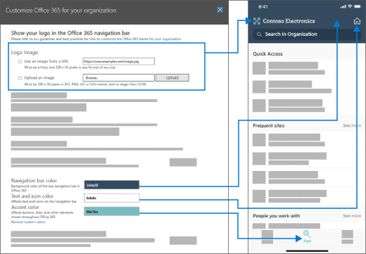

# Anpassen des Office 365-Designs für Ihre Organisation

Erfahren Sie, wie Sie Ihr Design im Microsoft 365 Admin Center anpassen. Als Administrator Ihres Office 365 Business-Abonnements können Sie das Standarddesign, das in der oberen Navigationsleiste angezeigt wird, für alle Mitglieder Ihrer Organisation ändern. Sie können Ihr Firmen Logo hinzufügen und die Farben so ändern, dass Sie mit dem Rest Ihrer Marke übereinstimmen. Sie können sogar einen Ziel Link hinzufügen, zu dem Benutzer navigieren, wenn Sie Ihr Logo auswählen. Sie können hier das Standarddesign und das benutzerdefinierte Design Ergebnis in Office 365 sehen.
  

  
## Anpassen des Designs im Admin Center

1. Wechseln Sie im Admin Center zu den **Einstellungs** \> **Einstellungen**, und wählen Sie dann die Registerkarte **Organisationsprofil** aus.

2. Wählen Sie auf der Registerkarte **Organisationsprofil** **benutzerdefinierte Designs**aus.

3. Ändern Sie im Panel **Zoll Designs** die Designelemente, die Sie für Ihre Organisation verwenden möchten:
    
    - **Verwenden eines benutzerdefinierten Logo Bilds**: Wählen Sie aus, ob ein Bild aus einer URL verwendet oder ein Bild hochgeladen werden soll. Wenn Sie eine URL verwenden, stellen Sie sicher, dass die URL HTTPS verwendet und 200 x 30 Pixel eines beliebigen Formats beliebiger Größe ist. Sie können ein Logo unter 10 KB hochladen, das 200 x 30 Pixel im Format JPG, PNG, GIF oder SVG ist.

      > [!NOTE]
      > Damit das Logo in der SharePoint-Mobile App angezeigt wird, verwenden Sie nur SVG-Bilder. In einem anderen Format hochgeladene Bilder werden in der APP nicht angezeigt. Logos können in der mobilen SharePoint-APP nicht anklickbar sein.

    - **Logo klickbar machen**: Sie können Ihr Logo in der Navigationsleiste als Link zu einer beliebigen Unternehmensressource verwenden. Sie können hier die URL für das Logo eingeben, beginnend mit http://oder https://. Dieser Schritt ist optional.

    - **Hintergrundbild auswählen**: Wählen Sie das Bild aus, und laden Sie Ihre eigene JPG-, PNG-oder GIF-Datei mit einer Auflösung von 1366 x 50 Pixel, die nicht größer als 15 KB ist, hoch. Das Hintergrundbild wird auf jeder Seite in der oberen Navigationsleiste angezeigt.

      > [!NOTE]
      > Bilder, die Text enthalten, werden möglicherweise nicht wie erwartet angezeigt. Integrierte Elemente, die rechts und links von der Navigationsleiste angezeigt werden, können in Diensten variieren, und Ihr Text wird möglicherweise durch diese Elemente  verdeckt. Aufgrund der dynamischen Natur der Navigationsleiste können wir zu diesem Zeitpunkt keine Anleitung für Bildtextabstand bereitstellen, die zu einer konsistenten Erfahrung führen würde. 

    - **Navigationsleisten Farbe**: Wählen Sie eine Farbe aus, die für den Hintergrund der Navigationsleiste verwendet werden soll. Sie wird oben auf jeder Seite angezeigt.

    - **Text und Symbole**: Wählen Sie eine Farbe für den Text und die Symbole auf der oberen Navigationsleiste aus.

    - **Akzentfarbe**: Wählen Sie eine Farbe aus, die für die Navigationsleisten Schaltfläche verwendet werden soll. Hover Farbe und Seiten Akzente wie Schaltflächen und Text in bestimmten Anwendungen.

     - **Verhindern, dass Benutzer Theme außer**Kraft setzen: kippen Sie diese Umschaltfläche, um zu verhindern, dass Benutzer ihr eigenes Design aus unserer Designauswahl auswählen. Dadurch wird verhindert, dass Benutzer kein Design mit hohem Kontrast festlegen können.

    - **Anzeigen des Benutzernamens**: Wählen Sie aus, ob der vollständige Name eines Benutzers an der Einstiegsstelle für den Konto-Manager oben rechts auf der Seite angezeigt werden soll, wenn der Benutzer angemeldet ist. Standardmäßig werden Benutzern Ihr Foto oder Ihre Initialen angezeigt, wenn kein Foto hochgeladen wurde.
    
4. Wählen Sie **Änderungen speichern** aus.
    
Sie sehen Ihr neues Design sofort im Admin Center und nach einer kurzen Verzögerung sehen Sie es in Office 365, einschließlich Seiten in Outlook, SharePoint, [SharePoint Mobile App für IOS](https://support.office.com/en-us/article/SharePoint-mobile-app-for-iOS-339402ce-16bb-4c97-9475-0c5375ccef7a)und [SharePoint Mobile App für Android](https://support.office.com/en-us/article/SharePoint-mobile-app-for-Android-d875654b-fb0a-4dbe-a17a-a676cf936284). In der folgenden Grafik finden Sie ein Beispiel für die Anpassung von Designänderungen im Admin Center.

Sie können das benutzerdefinierte Symbol oder die benutzerdefinierten Farben jederzeit entfernen. Kehren Sie einfach zur Design Seite zurück, und wählen Sie **benutzerdefinierte Designs entfernen**aus.
  
## Bewährte Methoden

Bei der Auswahl eines **Logo Bilds**wird empfohlen, nach Möglichkeit einen SVG-Dateityp zu verwenden, damit Ihr Logo auf allen Bildschirmen und auf allen Zoomebenen mit hoher Auflösung aussieht.

Wenn Sie benutzerdefinierte Farben auswählen, wählen Sie eine **Navigationsleiste Hintergrundfarbe** , die ein hohes Kontrastverhältnis mit dem **Logo Bild** , das Sie ausgewählt hat. Wählen Sie auch eine **Text-und Symbol** Farbe mit einem hohen Kontrastverhältnis zur **Hintergrundfarbe der Navigationsleiste** aus, um sicherzustellen, dass der gesamte Text und die Symbole leicht sichtbar sind.

Wenn Sie benutzerdefinierte Farben auswählen, wählen Sie eine **Akzentfarbe** aus, die auf einem weißen oder hellen Hintergrund gut angezeigt wird. Die **Akzentfarbe** wird verwendet, um einige Links und Schaltflächen zu färben, die auf weißem oder hellem Hintergrund angezeigt werden. Beispielsweise wird die **Akzentfarbe** verwendet, um Elemente im Posteingang eines Benutzers und auf der Office.com-Portalseite zu färben. 
  
Das empfohlene Kontrastverhältnis zwischen Text, Symbol oder Schaltflächenfarbe und Hintergrundfarbe ist 4,5:1.

Hier ist ein einfaches Flussdiagramm, mit dem Sie sich schnell mit einem visuell ansprechenden benutzerdefinierten Office 365 Design für Ihre Organisation einrichten können:
  - Ich möchte eine bunte Version unseres Logos verwenden.
    - Wir empfehlen die folgenden Einstellungen:
      - **Logobild**: das bunte Logo Ihrer Organisation.
      - **Farbe der Navigationsleiste**: eine neutrale Farbe. Wir empfehlen #FAF9F7 für eine helle Farbe und #252423 für eine dunkle Farbe.
      - **Text-und Symbol Farbe**: eine Farbe, die die **Farbe der Navigationsleiste**kontrastiert. Wir empfehlen #FAF9F7 für eine helle Farbe und #252423 für eine dunkle Farbe.
      - **Akzentfarbe**: eine dunkle Markenfarbe. Bei bestimmten Anwendungen muss diese Farbe auf einem hellen Hintergrund angezeigt werden.
  - Ich möchte eine neutrale Version unseres Logos verwenden und die Farbe in der Navigationsleiste darstellen.
    - Wir empfehlen die folgenden Einstellungen:
      - **Logo Bild**: neutrales Logo Ihrer Organisation.
      - **Navigationsleisten Farbe**: eine Markenfarbe, die gegen Ihr Logo steht.
      - **Text-und Symbol Farbe**: Wählen Sie eine Farbe, die gegen die von Ihnen gewählte Markenfarbe für die **Navigationsleisten Farbe**kontrastiert. Für eine helle Farbe wird #252423 für eine dunkle Farbe und #FAF9F7 empfohlen.
      - **Akzentfarbe**: eine dunkle Markenfarbe. Bei bestimmten Anwendungen muss diese Farbe auf einem hellen Hintergrund angezeigt werden.
  
## Verwandte Artikel

[Hinzufügen benutzerdefinierter Kacheln zur Seite "Meine Apps" und zum App-Startprogramm](../manage/customize-the-app-launcher.md)
  
  

