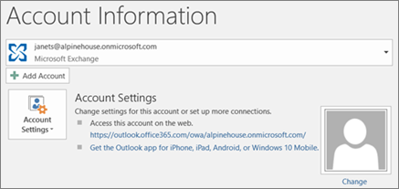

# Migrieren von E-Mail und Kontakten zu Office 365

Importieren oder Migrieren von E-Mails aus Gmail oder einem anderen E-Mail-Anbieter zu Microsoft 365.
  
 **Möchten Sie hilfe bei dieser Hilfe?**  [Wenden Sie sich an Microsoft 365 für den Unternehmenssupport.](../../business-video/get-help-support.md) 
  
Sie müssen eine Outlook-Version verwenden, die für diese Aufgabe auf Ihrem Desktop installiert ist. Outlook ist in den meisten Microsoft 365 [Plänen](https://go.microsoft.com/fwlink/p/?LinkId=723731)enthalten.
  
### Migrieren von Gmail zu Microsoft 365

Führen Sie die folgenden Schritte aus, um E-Mails, Kontakte und Kalender aus Gmail in Outlook mit Microsoft 365 zu importieren oder zu migrieren:
  
- [Importieren von Gmail in Outlook](https://support.microsoft.com/office/20fdb8f2-fed8-4b14-baf0-bf04b9c44bf7)
    
- [Importieren von Kontakten in Outlook](https://support.microsoft.com/office/bb796340-b58a-46c1-90c7-b549b8f3c5f8)
    
- [Importieren des Google-Kalenders](https://support.microsoft.com/office/098ed60c-936b-41fb-83d6-7e3786437330)

## Überwachung: Importieren von Kalendern
    
> [!VIDEO https://www.microsoft.com/videoplayer/embed/c1e45708-9a92-475b-910b-f5aa40614d92?autoplay=false]
  
### Importieren Outlook PST-Dateien in Microsoft 365 (Desktop)

Führen Sie die folgenden Schritte aus, um E-Mails, Kontakte und Kalender aus Outlook in eine PST-Datei zu exportieren und diese Datei dann mit Microsoft 365 in Outlook zu importieren:
  
1. [Exportieren von E-Mails, Kontakten und Kalendern](https://support.microsoft.com/office/14252b52-3075-4e9b-be4e-ff9ef1068f91)
    
2. [Importieren von E-Mails, Kontakten und Kalendern](https://support.microsoft.com/office/431a8e9a-f99f-4d5f-ae48-ded54b3440ac)
    
Wenn Sie nur Kontakte exportieren/importieren möchten, führen Sie die folgenden Schritte aus:
  
1. [Exportieren von Kontakten aus Outlook](https://support.microsoft.com/office/10f09abd-643c-4495-bb80-543714eca73f)
    
2. [Importieren von Kontakten in Outlook](https://support.microsoft.com/office/bb796340-b58a-46c1-90c7-b549b8f3c5f8)
    
To start the process, open Outlook and choose **File** \> **Open &amp; Export** \> **Import/Export**.
  

  
## Anzeigen anderer E-Mail-Konten in Outlook

Sie möchten nur Ihre E-Mails aus einem Konto eines anderen Anbieters (wie Gmail, Yahoo oder Live.com) in Outlook anzeigen? Dann müssen Sie keine Daten importieren oder migrieren. Sie können Outlook oder Outlook Web App einrichten, sodass Sie von derselben Stelle wie Ihr Microsoft 365 Postfach auf Ihre anderen Konten zugreifen und an diese Konten gesendete E-Mails senden, empfangen und lesen können.
  
### Outlook (Desktop)

Sie können ein Konto (z. B. Ihr privates Gmail-Konto) zu Outlook hinzufügen.
  
- Öffnen Sie Outlook, und wechseln Sie dann zu **Datei** \> **Konto hinzufügen**.
    
Benötigen Sie detailliertere Schritte? Dann lesen Sie [Hinzufügen eines Kontos](https://support.microsoft.com/office/6e27792a-9267-4aa4-8bb6-c84ef146101b).
  

  
## Mehrere Postfächer: Administratoren können E-Mails, Kontakte und Kalender per Massenimport in Microsoft 365

Je nach Ihrem Quell-E-Mail-System können Sie aus mehreren Methoden für die Massenmigration auswählen. Lesen Sie [Die Möglichkeiten zum Migrieren mehrerer E-Mail-Konten zu Microsoft 365,](/Exchange/mailbox-migration/mailbox-migration) um zu entscheiden, welche Methode für Sie geeignet ist.

## Verwandte Inhalte

[Planen der Einrichtung von Microsoft 365 for Business](plan-your-setup.md) (Artikel)\
[Installieren Office Anwendungen](install-applications.md) (Linkseite)\
[Übersicht über das Microsoft 365 Admin Center](../../business-video/admin-center-overview.md) (Video)