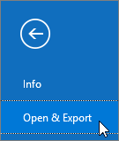

# Migrieren von E-Mail und Kontakten zu Office 365Migrate email and contacts to Microsoft 365

Importieren oder kopieren Sie e-Mails aus Gmail oder einem anderen e-Mail-Anbieter nach Microsoft 365.Import or copy email from Gmail or another email provider to Microsoft 365.
  
 **Wünschen Sie Hilfe?****Want help with this?**  [Wenden Sie sich an Microsoft 365 for Business Support](../contact-support-for-business-products.md) .[Contact Microsoft 365 for business support](../contact-support-for-business-products.md) . 
  
Sie müssen eine Outlook-Version verwenden, die für diese Aufgabe auf Ihrem Desktop installiert ist.You need to use a version of Outlook that is installed on your desktop for this task. Outlook ist in den meisten Microsoft 365- [Plänen](https://go.microsoft.com/fwlink/p/?LinkId=723731)enthalten.Outlook is included in most Microsoft 365 [plans](https://go.microsoft.com/fwlink/p/?LinkId=723731).
  
### Importieren aus GmailImport from Gmail

Führen Sie die folgenden Schritte aus, um e-Mails, Kontakte und Kalender aus gmail in Outlook mit Microsoft 365 zu importieren:Follow these steps to import email, contacts, and calendar from Gmail into Outlook with Microsoft 365:
  
- [Importieren von Gmail in OutlookImport Gmail to Outlook](https://support.microsoft.com/office/20fdb8f2-fed8-4b14-baf0-bf04b9c44bf7)
    
- [Importieren von Kontakten in OutlookImport contacts to Outlook](https://support.microsoft.com/office/bb796340-b58a-46c1-90c7-b549b8f3c5f8)
    
- [Importieren des Google-KalendersImport Google Calendar](https://support.microsoft.com/office/098ed60c-936b-41fb-83d6-7e3786437330)
    
> [!VIDEO https://www.microsoft.com/videoplayer/embed/c1e45708-9a92-475b-910b-f5aa40614d92?autoplay=false]
  
### Importieren aus Outlook (Desktop)Import from Outlook (desktop)

Führen Sie die folgenden Schritte aus, um e-Mails, Kontakte und Kalender aus Outlook in eine PST-Datei zu exportieren und diese Datei dann mit Microsoft 365 in Outlook zu importieren:Follow these steps to export email, contacts and calendars from Outlook to a .pst file, and then import that file to Outlook with Microsoft 365:
  
1. [Exportieren von E-Mails, Kontakten und KalendernExport email, contacts, and calendar](https://support.microsoft.com/office/14252b52-3075-4e9b-be4e-ff9ef1068f91)
    
2. [Importieren von E-Mails, Kontakten und KalendernImport mail, contacts, and calendar](https://support.microsoft.com/office/431a8e9a-f99f-4d5f-ae48-ded54b3440ac)
    
Wenn Sie nur Kontakte exportieren/importieren möchten, führen Sie die folgenden Schritte aus:If you just want contacts, follow these steps:
  
1. [Exportieren von Kontakten aus OutlookExport contacts from Outlook](https://support.microsoft.com/office/10f09abd-643c-4495-bb80-543714eca73f)
    
2. [Importieren von Kontakten in OutlookImport contacts to Outlook](https://support.microsoft.com/office/bb796340-b58a-46c1-90c7-b549b8f3c5f8)
    
To start the process, open Outlook and choose **File** \> **Open &amp; Export** \> **Import/Export**.To start the process, open Outlook and choose **File** \> **Open &amp; Export** \> **Import/Export**.
  

  
## Anzeigen anderer E-Mail-Konten in OutlookSee other email accounts in Outlook

Sie möchten nur Ihre E-Mails aus einem Konto eines anderen Anbieters (wie Gmail, Yahoo oder Live.com) in Outlook anzeigen?Just want to see your email from another provider (like Gmail, Yahoo, or Live.com) in Outlook? Dann müssen Sie keine Daten importieren oder migrieren.No need to import or migrate. Sie können Outlook oder Outlook Web App so einrichten, dass Sie über denselben Ort wie Ihr Microsoft 365-Postfach auf Ihre anderen Konten zugreifen und e-Mails senden, empfangen und lesen können, die an diese Konten gesendet werden.You can set up Outlook or Outlook Web App so you can access your other accounts from the same place as your Microsoft 365 mailbox and send, receive, and read email sent to those accounts.
  
### Outlook (Desktop)Outlook (desktop)

Sie können ein Konto (z. B. Ihr privates Gmail-Konto) zu Outlook hinzufügen.Add an account, such as your private Gmail account, to Outlook.
  
- Öffnen Sie Outlook, und wechseln Sie dann zu **Datei** \> **Konto hinzufügen**.Open Outlook, then go to **File** \> **Add account**.
    
Benötigen Sie detailliertere Schritte? Dann lesen Sie [Hinzufügen eines Kontos](https://support.microsoft.com/office/6e27792a-9267-4aa4-8bb6-c84ef146101b).Need more detailed steps? See [Add an account](https://support.microsoft.com/office/6e27792a-9267-4aa4-8bb6-c84ef146101b).
  

  
## Mehrere Postfächer: Administratoren können Massenimport von e-Mails, Kontakten und Kalendern auf Microsoft 365Multiple mailboxes: Admins can bulk import email, contacts, and calendars to Microsoft 365

Je nach Ihrem Quell-E-Mail-System können Sie aus mehreren Methoden für die Massenmigration auswählen.Depending on your source email system, you can choose from several bulk migration methods. Lesen Sie [Methoden zum Migrieren mehrerer e-Mail-Konten zu Microsoft 365](https://docs.microsoft.com/Exchange/mailbox-migration/mailbox-migration) , um zu entscheiden, welche Methode für Sie geeignet ist.Read [Ways to migrate multiple email accounts to Microsoft 365](https://docs.microsoft.com/Exchange/mailbox-migration/mailbox-migration) to decide which method works for you. 
  

