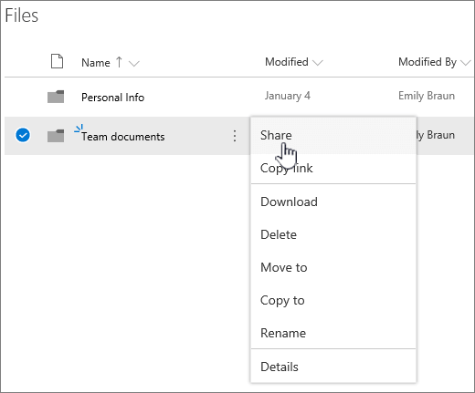
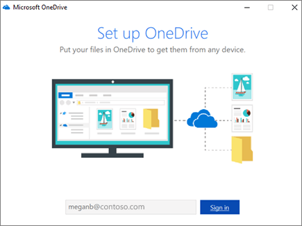

# Einrichten des Dateispeichers und der Freigabe in Microsoft 365

Eine der besten Möglichkeiten zum Einrichten von Dateispeicherung und Freigabe für Ihr Unternehmen ist die gemeinsame Verwendung OneDrive und einer Teamwebsite. Dies ist für ein kleines Unternehmen mit wenigen Mitarbeitern ideal geeignet.

## Watch: Wo dateien in einem Office 365

> [!VIDEO https://www.microsoft.com/videoplayer/embed/RE1FTHX] 

Wenn Sie dieses Video hilfreich fanden, sehen Sie sich bitte die [komplette Schulungsserie für kleine Unternehmen und diejenigen, für die Microsoft 365 neu ist](../../business-video/index.yml) an.

## Microsoft 365 und Verwaltung von Dokumenten

- OneDrive ist für die individuelle Verwendung mit gelegentlicher Freigabe von Dateien konzipiert.

- Eine Teamwebsite ist für die regelmäßige Freigabe und Zusammenarbeit an Dateien konzipiert. Eine Teamwebsite eignet sich ideal zum Speichern von Dateien mit gemeinsamem Besitz, bei denen mehrere Personen besitzer der Dateien sind und möglicherweise daran zusammenarbeiten. Erstellen Sie ein Microsoft Team, um eine Teamwebsite hinzuzufügen. [Weitere Informationen finden Sie unter Erstellen eines Teams in Teams](https://support.microsoft.com/office/174adf5f-846b-4780-b765-de1a0a737e2b).

Sowohl OneDrive als auch Teamwebsites bieten Ihnen und Ihren Mitarbeitern überall Zugriff.
  

  
Im Folgenden finden Sie Empfehlungen zum Speichern an jedem Speicherort, wenn Sie OneDrive und Teamwebsites verwenden:
  
||||
|:-----|:-----|:-----|
|**Speicherort**   |**Zweck**   |**Zu speichernde Elemente**   |
|**OneDrive**   |Das Speichern von Inhalten in OneDrive ist wie das Speichern von Dateien auf Ihrem Computer. Niemand sonst kann leicht darauf zugreifen.    Weitere Informationen finden Sie unter [Was ist OneDrive for Business?](https://support.microsoft.com/office/187f90af-056f-47c0-9656-cc0ddca7fdc2)   |Geschäftsdateien, die andere Teammitglieder für die Zusammenarbeit nicht benötigen oder auf die sie nicht regelmäßig zugreifen müssen.    |
|**SharePoint-Teamwebsites**   |Zusammenarbeit. Wenn Sie eine Microsoft 365-Gruppe erstellen (z. B. im Microsoft 365 Admin Center, in Outlook oder durch Erstellen eines Teams in Microsoft Teams), wird eine SharePoint-Teamwebsite für diese Gruppe erstellt. Wenn Sie eine neue SharePoint-Teamwebsite auf der SharePoint-Homepage oder im neuen SharePoint Admin Center erstellen, wird auch eine Microsoft 365 erstellt. Weitere Informationen finden Sie unter [What is a SharePoint team site?](https://support.microsoft.com/office/75545757-36c3-46a7-beed-0aaa74f0401e) und Create a team site in SharePoint [Online](https://support.microsoft.com/office/ef10c1e7-15f3-42a3-98aa-b5972711777d).    |Dateien mit gemeinsamem Besitz. Wir empfehlen separate Teamwebsites für jede Arbeitseinheit in Ihrer Organisation. Um z. B. Personal- und Finanzdokumente für ein kleines Team privat zu halten, erstellen Sie eine separate Teamwebsite.    |

> [!NOTE]
> SharePoint verfügt auch über andere Arten von Websites, die Sie für Ihr Unternehmen verwenden können. Sie können [Kommunikationswebsites](https://support.microsoft.com/office/7fb44b20-a72f-4d2c-9173-fc8f59ba50eb) in Ihrem Intranet verwenden, um Informationen für eine breite Zielgruppe zu veröffentlichen. Und Sie können [Hubwebsites verwenden,](https://support.microsoft.com/office/fe26ae84-14b7-45b6-a6d1-948b3966427f) um Websites in Ihrem Intranet zu verbinden.
  
## Beginnen Sie mit OneDrive und Ihrer Teamwebsite

### Teammitglieder können ihre eigenen Dateien in OneDrive

Jede Person in Ihrem Unternehmen, der eine lizenzbasierte Microsoft 365 zugewiesen ist (und SharePoint Online ausgewählt ist), erhält OneDrive Cloudspeicher. Sie können hier geschäftsbezogene Dateien für den Zugriff von jedem Gerät speichern, und sie sind nur für diesen Benutzer verfügbar. So könnten sie beispielsweise einen Entwurfsvorschlag, ihre Besprechungsnotizen oder das Skript für eine Demo speichern, die sie bald vorführen werden.
  
Mitarbeiter können auch OneDrive und Ordner freigeben. Wenn ein Mitarbeiter nicht im Unternehmen ist oder das Unternehmen verlässt, können andere auf freigegebene Dateien zugreifen, die in OneDrive (OneDrive Teamordnerfreigabe) gespeichert sind.
  
Hier erfahren Sie, wie jede Person in Ihrem Team dateien OneDrive freigeben kann.

1. Wechseln Sie zum <a href="https://portal.office.com/ " target="_blank">Microsoft 365 Portal,</a>und melden Sie sich mit Ihrem Benutzernamen und Kennwort an.

2. Wählen Sie im Startfeld app die **Option OneDrive**.

3. In OneDrive können Teammitglieder ihre eigenen geschäftsbezogenen Dateien speichern. Sie können entweder einzelne Dateien oder einen ganzen Ordner freigeben. Wählen Sie eine Datei oder einen Ordner aus, klicken Sie mit der rechten Maustaste, und wählen Sie dann **Freigeben aus.**

    
  
4. Lassen Sie **auf der** Seite Link senden die Standardauswahl Jeder mit dem Link anzeigen **und bearbeiten.**

    Geben Sie Namen oder E-Mail-Adressen von Teammitgliedern ein, die Zugriff auf den Ordner haben möchten, und fügen Sie eine optionale Nachricht hinzu.

    Wenn Sie eine eigene Kopie der E-Mail wünschen, die gesendet wird, fügen Sie Ihre E-Mail-Adresse zur Liste hinzu.

    
  
5. Wenn Sie die Eingabe der Personen, für die Sie freigeben möchten, fertig sind, wählen Sie **Senden aus.** Die E-Mail wird sofort an die von Ihnen eingeladenen Personen gesendet.

    
  
6. So sieht die E-Mail aus. 

    
  
### Hochladen von Dateien auf einer Teamwebsite für die Onlinezusammenarbeit

Teamwebsites verfügen über einen Ort zum Speichern von Dateien, der als Dokumentbibliothek bezeichnet wird.  
  
Hier sind die Schritte zum Hinzufügen von Dateien:
  
1. Wählen Sie auf der Startseite Ihrer Teamwebsite **im** linken Navigationsmenü Dokumente aus. Damit gelangen Sie zu Ihrer **Bibliothek "Dokumente"**.
  
2. Öffnen Sie den **Datei-Explorer** Microsoft 365 taskleiste oder an einem anderen Speicherort, Windows sie noch angemeldet sind. Wechseln Sie zu den Dateien, die Sie auf Ihre Teamwebsite hochladen möchten.

3. Wählen Sie die Dateien aus, die Sie auf Ihre Teamwebsite hochladen möchten, und ziehen Sie sie dann in die **Dokumentbibliothek.**
  
4. Wenn Sie damit fertig sind, sind die Dateien sowohl auf Ihrer Teamwebsite als auch auf Ihrem Computer gespeichert.
  
5. Sie können die Dateien von Ihrem Computer löschen. Im nächsten Schritt, Synchronisieren von Onlinedateien mit Ihrem PC oder [Mac,](#sync-online-files-with-your-pc-or-mac)erstellen Sie einen neuen Speicherort für diese Dateien auf Ihrem Computer.

    Wenn Sie zahlreiche Dateien oder große Dateien auf Ihre Teamwebsite hochladen müssen, lesen Sie diese Tipps zum Hochladen großer oder vieler Dateien [in eine Bibliothek.](https://support.microsoft.com/office/da549fb1-1fcb-4167-87d0-4693e93cb7a0#__toc384119242)

    Wenn Sie mehr Speicherplatz benötigen, lesen Sie [Ändern von Speicherplatz für Ihr Abonnement](../../commerce/add-storage-space.md).

### Synchronisieren von Onlinedateien mit Ihrem PC oder Mac

Da Sie jetzt über Dateien auf Ihrer Teamwebsite verfügen, können Sie sie für die Synchronisierung mit Ihrem PC oder Mac einrichten. Auf diese Weise können Sie ihre Dateien von Ihrem PC oder Mac aus bearbeiten, anstatt in Microsoft Edge, Chrome oder einem anderen Browser zu arbeiten. Es empfiehlt sich außerdem, über eine mit Ihrem Computer synchronisierte Version Ihrer Dateien für solche Situationen zu verfügen, in denen Sie auf eine Datei zugreifen müssen und nicht mit dem Internet verbunden sind.
  
Nachdem Sie Dateien für die Synchronisierung mit Ihrem Computer eingerichtet haben, werden sie automatisch synchronisiert, wenn Sie mit dem Internet verbunden sind.
  
Führen Sie zum Synchronisieren von Dateien zwischen Ihrer Teamwebsite und Ihrem Desktop die folgenden Schritte aus:
  
1. Wählen Sie auf der Startseite Ihrer Teamwebsite **im** linken Navigationsmenü Dokumente aus. Dies führt Sie zu Ihrer Dokumentbibliothek.

    > [!TIP]
    > Beim Synchronisieren von Dateien auf Ihrer Teamwebsite synchronisieren Sie jede Dateibibliothek auf der Website, nicht die gesamte Website.
  
2. Wählen **Sie Synchronisieren** aus, um alle Dateien zu synchronisieren. Oder navigieren Sie zu dem bestimmten Ordner, den Sie synchronisieren möchten.

3. Wenn Sie zum Wechseln von Apps aufgefordert werden, wählen Sie **Ja aus.** OneDrive wird die Synchronisierung ausgeführt.
  
4. Wenn Sie dann eine Eingabeaufforderung **einrichten OneDrive,** melden Sie sich mit Ihrem Arbeits- oder Schulkonto an.

    
  
5. Wenn Sie Ihre Datei noch nicht synchronisiert OneDrive, wird möglicherweise der Bildschirm This **is your OneDrive angezeigt.** Überprüfen Sie den Pfad **unter OneDrive Ordner ist hier**. Wählen **Sie Speicherort ändern** aus, wenn Sie einen anderen Pfad verwenden möchten, und wählen Sie dann Weiter **aus.**

    
  
6. Die Dateien in Ihren Teamwebsites werden im linken Bereich des Datei-Explorers unter dem Namen Ihrer Organisation angezeigt. Die Dateien in OneDrive werden unter "OneDrive \<Name of Organization\> -" angezeigt.

    
  
7. Testen Sie die Synchronisierung, indem Sie eine Datei im Teamordner auf Ihrem Computer öffnen. Nehmen Sie eine Änderung vor, und wählen Sie **Speichern** aus.

## Bewährte Methoden für die Dateispeicherung und -freigabe

Im Folgenden finden Sie einige Tipps, wie Sie OneDrive teamwebsite SharePoint können.
  
### Empfehlungen zu Dateispeicherung und Zusammenarbeit für andere Arten von Kleinunternehmen

- **Einzelunternehmen:** Verwenden sie OneDrive, um Ihre eigenen Dateien zu speichern und sie für Kunden von Fall zu Fall zu teilen.

- **Mitbesitzer:** Beide Besitzer verwenden OneDrive und teilen Dateien hin und her.

- **Unternehmen mit externen Clients oder Partnern,** die Zugriff auf Dateien benötigen: Erstellen Sie eine neue Teamwebsite zum Speichern und Freigeben von Dokumenten, die für einen bestimmten Kunden vorgesehen sind. Richten Sie die Website so ein, dass nur dieser Kunde zugriff. Sie müssen sich dann keine Sorgen machen, dass ein Kunde versehentlich Zugriff auf Informationen für einen anderen Kunden erhalten wird.

### Sicherstellen, dass private Dateien privat bleiben

Wenn Sie eine Datei in einem OneDrive ist sie nur für Sie zugänglich, es sei denn, Sie teilen sie für andere Personen. Wenn Sie Dateien freigeben, können Sie einen Link erstellen, der weitergeleitet werden kann, oder nur für bestimmte Personen freigeben. Sie können auch in OneDrive separate Ordner für unterschiedliche Zwecke erstellen, beispielsweise öffentliche und persönliche Ordner oder Ordner für einzelne Projekte. Jeder Ordner kann für eine andere Person oder Gruppe oder aber auch für niemanden freigegeben werden.
  
Weitere Informationen zur Freigabe finden Sie unter [Freigeben von Dateien und](https://support.microsoft.com/office/72f26d6c-bf9e-432c-8b96-e3c2437f5b65)Ordnern mit Microsoft 365 .
  
### Nachverfolgen des noch verfügbaren Speicherplatzes

Informationen dazu, wie viel Speicherplatz Sie in OneDrive haben, finden Sie unter [Manage your OneDrive for Business storage](https://support.microsoft.com/office/31519161-059C-4764-B6F8-F5CD29F7FE68).
  
### Welche Dateien können in einer OneDrive und einer Teamwebsite gespeichert werden?

Während Sie fast alle Dateitypen hochladen können, sind einige Dateinamen und Zeichen in Dateinamen nicht zulässig. Weitere Informationen finden Sie unter [Ungültige Dateizeichen und Dateitypen in OneDrive for Business](https://support.microsoft.com/office/64883A5D-228E-48F5-B3D2-EB39E07630FA).
  
### Aktivieren oder Deaktivieren von Speicherdiensten von Drittanbietern

Sie können den Drittanbieterspeicher für Ihre Benutzer in Microsoft 365 aktivieren, damit sie Dokumente mithilfe von Diensten wie Dropbox zusätzlich zu OneDrive und Teamwebsites speichern und freigeben können. Hiermit ergibt sich eine großartige Möglichkeit, für die Benutzer Dienste bereitzustellen, die sie bereits nutzen oder für Geschäftsprojekte nutzen möchten. Wenn Sie nicht möchten, dass Personen in Ihrer Organisation, die Office Dateien in einem Drittanbieterdienst öffnen, führen Sie die folgenden Schritte aus, um sie zu deaktivieren.
  
> [!IMPORTANT]
> Der Drittanbieterspeicher ist standardmäßig aktiviert, sodass Sie diese Schritte sofort ausführen müssen, wenn Sie nicht möchten, dass dieser für Ihre Benutzer verfügbar ist.
  
1. Melden Sie sich beim <a href="https://go.microsoft.com/fwlink/p/?linkid=2024339" target="_blank">Admin Center an.</a>

2. Wechseln Sie zur **Seite Einstellungen** \> <a href="https://go.microsoft.com/fwlink/p/?linkid=2053743" target="_blank">**Organisationseinstellungen.**</a>

3. Wählen Sie **auf der** Registerkarte Dienste die **Option Office im Web**.

4. Aktivieren oder deaktivieren Sie das Kontrollkästchen, um den Speicher eines Drittanbieters ein- oder auszuschalten, und wählen Sie **dann Änderungen speichern aus.**

## Nächste Schritte

- [Passen Sie Ihre Teamwebsite für dateispeicherung und -freigabe an.](customize-team-site.md) Dieses schrittweise Lernprogramm zeigt Ihnen, wie Sie weitere Features für Speicherung und Zusammenarbeit nutzen können.

- **Einrichten von Office-Apps auf Tablets und Smartphones**. Sie müssen dies tun, damit Sie Dateien bearbeiten können, die in OneDrive und auf Teamwebsites auf Ihrem Tablet oder Smartphone gespeichert sind.  Wenn Sie die Office für Ihr Tablet oder Smartphone nicht installieren, können Sie die Dateien anzeigen, aber nicht bearbeiten.

  - [Installieren und Einrichten von Office auf einem Android mit Microsoft 365](https://support.microsoft.com/office/cafe9d6f-8b0c-4b03-b20a-12438a82a22d)

  - [Installieren und Einrichten von Office auf einem iPhone oder iPad mit Microsoft 365](https://support.microsoft.com/office/9df6d10c-7281-4671-8666-6ca8e339b628)

  - [Einrichten von Office auf Windows Phone mit Microsoft 365](https://support.microsoft.com/office/2b7c1b51-a717-45d6-90c9-ee1c1c5ee0b7)

## Verwandte Inhalte

[Hinzufügen von Speicherplatz für Ihr Abonnement](../../commerce/add-storage-space.md) (Artikel)\
[Freigeben von Dateien und Ordnern für Microsoft 365 Business](https://support.microsoft.com/office/share-files-and-folders-with-microsoft-365-business-72f26d6c-bf9e-432c-8b96-e3c2437f5b65) (Video)\
[Anpassen der Teamwebsite für dateispeicherung und -freigabe](customize-team-site.md) (Artikel)