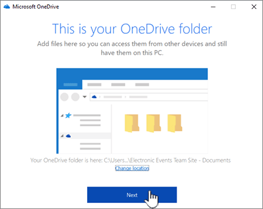

# Einrichten der Speicherung und Freigabe von Dateien

Eine der besten Möglichkeiten zum Einrichten der Dateispeicherung und-Freigabe für Ihr Unternehmen ist die gemeinsame Verwendung von OneDrive und einer Teamwebsite. Dies ist für ein kleines Unternehmen mit wenigen Mitarbeitern ideal geeignet.

Sehen Sie sich ein kurzes Video darüber an, wo Dateien in Microsoft 365 gespeichert werden sollen.  

> [!VIDEO https://www.microsoft.com/videoplayer/embed/RE1FTHX] 

Wenn Sie dieses Video hilfreich fanden, sehen Sie sich bitte die [komplette Schulungsserie für kleine Unternehmen und jene, die neu bei Microsoft 365 sind](https://support.office.com/article/6ab4bbcd-79cf-4000-a0bd-d42ce4d12816), an.

## Wo Sie Dokumente in Microsoft 365 speichern können

- OneDrive ist für die individuelle Verwendung mit der gelegentlichen Freigabe von Dateien konzipiert. 

- Eine Teamwebsite ist für die regelmäßige Freigabe und Zusammenarbeit an Dateien konzipiert. Eine Teamwebsite ist ideal zum Speichern von Dateien mit freigegebenem Besitz, bei denen mehrere Personen die Dateien besitzen und möglicherweise an Ihnen zusammenarbeiten. Erstellen Sie ein Microsoft-Team, um eine Teamwebsite hinzuzufügen. [Weitere Informationen finden Sie unter Create a Team in Teams](https://support.office.com/article/174adf5f-846b-4780-b765-de1a0a737e2b).

Sowohl OneDrive-als auch Teamwebsites bieten beliebigen Zugriff für Sie und Ihre Mitarbeiter.
  

  
Hier sind Empfehlungen dafür, was an jedem Standort gespeichert werden soll, wenn Sie OneDrive und Teamwebsites zusammen verwenden:
  
||||
|:-----|:-----|:-----|
|**Speicherort**   |**Zweck**   |**Zu speichernde Elemente**   |
|**OneDrive**   |Das Speichern von Inhalten in OneDrive ist wie das Speichern von Dateien auf Ihrem Computer. kein anderer kann problemlos darauf zugreifen.    Weitere Informationen finden Sie unter [Was ist OneDrive für Unternehmen?](https://support.office.com/article/187f90af-056f-47c0-9656-cc0ddca7fdc2.aspx)   |Geschäftsdateien, die andere Teammitglieder für die Zusammenarbeit nicht benötigen oder auf die sie nicht regelmäßig zugreifen müssen.    |
|**SharePoint-Teamwebsites**   |Zusammenarbeit. Wenn Sie eine Microsoft 365-Gruppe erstellen (beispielsweise im Microsoft 365 Admin Center, in Outlook oder beim Erstellen eines Teams in Microsoft Teams), wird eine SharePoint-Teamwebsite für diese Gruppe erstellt. Ebenso wird beim Erstellen einer neuen SharePoint-Teamwebsite von der SharePoint-Startseite oder aus dem neuen SharePoint Admin Center auch eine Microsoft 365-Gruppe erstellt. Weitere Informationen finden Sie unter [Was ist eine SharePoint-Teamwebsite?](https://support.office.com/article/75545757-36c3-46a7-beed-0aaa74f0401e.aspx) und [Erstellen einer Teamwebsite in SharePoint Online](https://support.office.com/article/ef10c1e7-15f3-42a3-98aa-b5972711777d.aspx).    |Dateien mit freigegebenem Besitz. Es wird empfohlen, separate Teamwebsites für jede Arbeitseinheit in Ihrer Organisation zu verwenden. Um beispielsweise Personal-und Finanzdokumente in einem kleinen Team privat zu halten, erstellen Sie eine separate Teamwebsite.    |

> [!NOTE]
> SharePoint hat auch andere Arten von Websites, die Sie für Ihr Unternehmen verwenden können. Sie können [Kommunikationswebsites](https://support.microsoft.com/en-us/office/create-a-communication-site-in-sharepoint-online-7fb44b20-a72f-4d2c-9173-fc8f59ba50eb) in Ihrem Intranet verwenden, um Informationen für eine breite Benutzergruppe zu veröffentlichen. Sie können auch [Hub-Standorte](https://support.office.com/article/fe26ae84-14b7-45b6-a6d1-948b3966427f.aspx) verwenden, um Websites in Ihrem Intranet zu verbinden.
  
## Starten der Verwendung von OneDrive und ihrer Teamwebsite

### Team Mitglieder können Ihre eigenen Dateien in OneDrive speichern.

Jede Person in Ihrem Unternehmen, der eine Microsoft 365-Lizenz zugewiesen ist (und SharePoint Online ausgewählt), ruft OneDrive Cloud Storage ab. Sie können hier geschäftsbezogene Dateien für den Zugriff von jedem Gerät aus speichern, und diese sind nur für diesen Benutzer verfügbar. So könnten sie beispielsweise einen Entwurfsvorschlag, ihre Besprechungsnotizen oder das Skript für eine Demo speichern, die sie bald vorführen werden.
  
Mitarbeiter können auch OneDrive-Dateien und-Ordner freigeben. Wenn ein Mitarbeiter abwesend ist oder das Unternehmen verlässt, können andere auf freigegebene Dateien zugreifen, die in OneDrive gespeichert sind.
  
Hier erfahren Sie, wie jede Person in Ihrem Team OneDrive einrichten und Dateien freigeben kann.

1. Wechseln Sie zum <a href="https://portal.office.com/ " target="_blank">Microsoft 365-Portal</a>, und melden Sie sich mit Ihrem Benutzernamen und Ihrem Kennwort an.

2. Wählen Sie im App-Startfeld **OneDrive**aus.

3. In OneDrive können Teammitglieder ihre eigenen geschäftsbezogenen Dateien speichern. Sie können entweder einzelne Dateien oder einen ganzen Ordner freigeben. Wählen Sie eine Datei oder einen Ordner aus, klicken Sie mit der rechten Maustaste, und wählen Sie dann **Freigeben**aus.

    
  
4. Lassen Sie auf der Seite " **Link senden** " die Standardauswahl für **alle Personen, die über den Link angezeigt und bearbeitet werden können**.

    Geben Sie Namen oder e-Mail-Adressen von Teammitgliedern ein, die Zugriff auf den Ordner haben sollen, und fügen Sie eine optionale Nachricht hinzu.

    Wenn Sie eine eigene Kopie der e-Mail erhalten möchten, die gesendet wird, fügen Sie Ihre e-Mail-Adresse zur Liste hinzu.

    
  
5. Wenn Sie die Eingabe der Personen abgeschlossen haben, für die Sie freigeben möchten, wählen Sie **senden**aus. Die e-Mail wird sofort an die von Ihnen eingeladenen Personen gesendet.

    
  
6. Hier sehen Sie, wie die e-Mail aussieht. 

    
  
### Hochladen von Dateien auf eine Teamwebsite für die Online Zusammenarbeit

Team Websites verfügen über einen Speicherort zum Speichern von Dateien, die als Dokumentbibliothek bezeichnet werden.  
  
Hier sind die Schritte zum Hinzufügen von Dateien:
  
1. Wählen Sie auf der Startseite Ihrer Teamwebsite im linken Navigationsmenü die Option **Dokumente** aus. Damit gelangen Sie zu Ihrer **Bibliothek "Dokumente"**.
  
2. Wenn Sie noch bei Microsoft 365 angemeldet sind, öffnen Sie den Windows- **Datei-Explorer** über die Taskleiste oder einen anderen Speicherort. Wechseln Sie zu den Dateien, die Sie auf Ihre Teamwebsite hochladen möchten.

3. Wählen Sie die Dateien aus, die Sie auf Ihre Teamwebsite hochladen möchten, und ziehen Sie Sie dann in die **Dokumentbibliothek**.
  
4. Wenn Sie damit fertig sind, sind die Dateien sowohl auf Ihrer Teamwebsite als auch auf Ihrem Computer gespeichert.
  
5. Sie können die Dateien von Ihrem Computer löschen. Im nächsten Schritt können Sie [Online Dateien mit Ihrem PC oder Mac synchronisieren](#sync-online-files-with-your-pc-or-mac), indem Sie einen neuen Speicherort für diese Dateien auf Ihrem Computer erstellen.

    Wenn Sie viele Dateien oder große Dateien auf Ihre Teamwebsite hochladen müssen, lesen Sie die Tipps unter [Hochladen großer oder vieler Dateien in eine Bibliothek](https://support.office.com/article/da549fb1-1fcb-4167-87d0-4693e93cb7a0.aspx#__toc384119242).

    Wenn Sie mehr Speicherplatz benötigen, lesen Sie [Ändern von Speicherplatz für Ihr Abonnement](../../commerce/add-storage-space.md).

### Synchronisieren von Online Dateien mit Ihrem PC oder Mac

Da Sie jetzt über Dateien auf Ihrer Teamwebsite verfügen, können Sie sie für die Synchronisierung mit Ihrem PC oder Mac einrichten. Auf diese Weise können Sie Ihre Dateien von Ihrem PC oder Mac aus bearbeiten, anstatt in Microsoft Edge, Chrome oder einem anderen Browser zu arbeiten. Es empfiehlt sich außerdem, über eine mit Ihrem Computer synchronisierte Version Ihrer Dateien für solche Situationen zu verfügen, in denen Sie auf eine Datei zugreifen müssen und nicht mit dem Internet verbunden sind.
  
Nachdem Sie Dateien für die Synchronisierung mit Ihrem Computer eingerichtet haben, werden diese automatisch synchronisiert, wenn Sie mit dem Internet verbunden sind.
  
Führen Sie zum Synchronisieren von Dateien zwischen Ihrer Teamwebsite und Ihrem Desktop die folgenden Schritte aus:
  
1. Wählen Sie auf der Startseite Ihrer Teamwebsite im linken Navigationsmenü die Option **Dokumente** aus. Dadurch gelangen Sie zu Ihrer Dokumentbibliothek.

    > [!TIP]
    > Beim Synchronisieren von Dateien auf Ihrer Teamwebsite synchronisieren Sie jede Datei Bibliothek auf der Website, nicht die gesamte Website.
  
2. Wählen Sie **Synchronisieren** aus, um alle Dateien zu synchronisieren. Oder navigieren Sie zu dem bestimmten Ordner, den Sie synchronisieren möchten.

3. Wenn Sie aufgefordert werden, apps zu wechseln, wählen Sie **Ja**aus. OneDrive ist der Vorgang, bei dem die Synchronisierung ausgeführt wird.
  
4. Wenn Sie dann eine **Setup-OneDrive** -Eingabeaufforderung erhalten, melden Sie sich mit ihrem geschäftlichen oder Schulkonto an.

    
  
5. Wenn Sie Ihre OneDrive noch nicht synchronisiert haben, sehen Sie möglicherweise den Bildschirm **Dies ist Ihr OneDrive-Ordner** . Überprüfen Sie den Pfad unter **Ihrem OneDrive-Ordner ist hier**. Wählen Sie **Speicherort ändern** aus, wenn Sie einen anderen Pfad verwenden möchten, und wählen Sie dann **weiter**aus.

    
  
6. Die Dateien auf Ihren Teamwebsites werden im linken Bereich des Datei-Explorers unter dem Namen Ihrer Organisation angezeigt. Die Dateien in OneDrive werden unter "OneDrive- \< Name der Organisation \> " angezeigt.

    
  
7. Testen Sie die Synchronisierung, indem Sie eine Datei im Teamordner auf Ihrem Computer öffnen. Nehmen Sie eine Änderung vor, und wählen Sie **Speichern** aus.

## Bewährte Methoden für die Dateispeicherung und -freigabe

Hier finden Sie einige Tipps, wie Sie OneDrive oder Ihre SharePoint-Teamwebsite optimal nutzen können.
  
### Empfehlungen zu Dateispeicherung und Zusammenarbeit für andere Arten von Kleinunternehmen

- **Sole Eigentum**: Verwenden Sie OneDrive, um Ihre eigenen Dateien zu speichern und für Kunden von Fall zu Fall freizugeben.

- **Miteigentum**: Beide Besitzer verwenden OneDrive und teilen Dateien hin und her.

- **Unternehmen mit externen Clients oder Partnern, die Zugriff auf Dateien benötigen**: Erstellen einer neuen Teamwebsite zum Speichern und Freigeben von Dokumenten, die für einen bestimmten Kunden bestimmt sind. Einrichten der Website, um nur den Zugriff auf diesen Kunden zuzulassen Sie müssen sich dann nicht sorgen, dass ein Kunde versehentlich Zugriff auf Informationen erhält, die für einen anderen Kunden bestimmt sind.

### Sicherstellen, dass private Dateien privat bleiben

Wenn Sie eine Datei in OneDrive speichern, kann Sie nur von Ihnen zugegriffen werden, es sei denn, Sie können Sie für andere freigeben. Wenn Sie Dateien freigeben, können Sie auswählen, ob Sie einen Link erstellen möchten, der weitergeleitet werden kann, oder nur für bestimmte Personen freigeben. Sie können auch in OneDrive separate Ordner für unterschiedliche Zwecke erstellen, beispielsweise öffentliche und persönliche Ordner oder Ordner für einzelne Projekte. Jeder Ordner kann für eine andere Person oder Gruppe oder aber auch für niemanden freigegeben werden.
  
Weitere Informationen zur Freigabe finden Sie auch unter [Freigeben von Dateien und Ordnern mit Microsoft 365](https://support.office.com/article/72f26d6c-bf9e-432c-8b96-e3c2437f5b65.aspx).
  
### Nachverfolgen des noch verfügbaren Speicherplatzes

Um zu sehen, wie viel Speicherplatz Sie in OneDrive noch haben, lesen Sie [Verwalten des OneDrive für Unternehmen Speichers](https://support.office.com/article/31519161-059C-4764-B6F8-F5CD29F7FE68.aspx).
  
### Welche Dateien können in OneDrive und einer Teamwebsite gespeichert werden?

Während Sie fast alle Arten von Dateien hochladen können, sind einige Dateinamen und Zeichen in Dateinamen nicht zulässig. Weitere Informationen finden Sie unter [ungültige Datei Zeichen und Dateitypen in OneDrive für Unternehmen](https://support.office.com/article/64883A5D-228E-48F5-B3D2-EB39E07630FA.aspx).
  
### Aktivieren oder Deaktivieren von Speicherdiensten von Drittanbietern

Sie können Speicher von Drittanbietern für Ihre Benutzer in Microsoft 365 aktivieren, damit diese Dokumente zusätzlich zu OneDrive und Teamwebsites mit Diensten wie Dropbox speichern und freigeben können. Hiermit ergibt sich eine großartige Möglichkeit, für die Benutzer Dienste bereitzustellen, die sie bereits nutzen oder für Geschäftsprojekte nutzen möchten. Wenn Sie nicht möchten, dass Personen in Ihrer Organisation Office zum Öffnen von Dateien in einem Drittanbieterdienst verwenden, führen Sie die folgenden Schritte aus, um Sie zu deaktivieren.
  
> [!IMPORTANT]
> Speicher von Drittanbietern ist standardmäßig aktiviert, sodass Sie diese Schritte sofort ausführen müssen, wenn Sie nicht für Ihre Benutzer verfügbar sein sollen.
  
1. Melden Sie sich beim <a href="https://go.microsoft.com/fwlink/p/?linkid=2024339" target="_blank">Admin Center</a>an.

2. Wechseln Sie zur Seite **Einstellungen** für \> <a href="https://go.microsoft.com/fwlink/p/?linkid=2118715" target="_blank">**Organisations**</a> Einstellungen.

3. Wählen Sie auf der Registerkarte **Dienste** die Option **Office im Internet**aus.

4. Aktivieren oder deaktivieren Sie das Kontrollkästchen, um den Speicher eines Drittanbieters ein-oder auszuschalten, und wählen Sie dann **Änderungen speichern**aus.

## Nächste Schritte

- [Passen Sie Ihre Teamwebsite für die Speicherung und Freigabe von Dateien an](customize-team-site.md). Dieses schrittweise Lernprogramm zeigt Ihnen, wie Sie weitere Features für Speicherung und Zusammenarbeit nutzen können. 

- **Einrichten von Office-Apps auf Tablets und Smartphones**. Sie müssen dies tun, damit Sie Dateien **Bearbeiten** können, die in OneDrive und auf Teamwebsites von Ihrem Tablet oder Telefon gespeichert sind. Wenn Sie die Office-Apps für Ihr Tablet oder Telefon nicht installieren, können Sie die Dateien anzeigen, aber nicht bearbeiten.

  - [Installieren und Einrichten von Office auf einem Android-Gerät mit Microsoft 365](https://support.office.com/article/cafe9d6f-8b0c-4b03-b20a-12438a82a22d.aspx)

  - [Installieren und Einrichten von Office auf einem iPhone oder iPad mit Microsoft 365](https://support.office.com/article/9df6d10c-7281-4671-8666-6ca8e339b628.aspx)

  - [Einrichten von Office auf Windows Phone mit Microsoft 365](https://support.microsoft.com/en-us/office/set-up-office-mobile-apps-on-a-windows-mobile-device-2b7c1b51-a717-45d6-90c9-ee1c1c5ee0b7)
