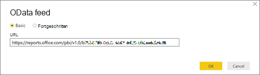

# Individuelles Anpassen der Berichte in Microsoft 365-NutzungsanalysenCustomize the reports in Microsoft 365 usage analytics

::: moniker range="o365-21vianet"

> [!NOTE]
> Das Admin Center wird geändert.The admin center is changing. Wenn Ihre Erfahrung nicht den hier aufgeführten Details entspricht, lesen Sie [über das neue Microsoft 365 Admin Center](https://docs.microsoft.com/microsoft-365/admin/microsoft-365-admin-center-preview?view=o365-21vianet).If your experience doesn't match the details presented here, see [About the new Microsoft 365 admin center](https://docs.microsoft.com/microsoft-365/admin/microsoft-365-admin-center-preview?view=o365-21vianet).

::: moniker-end

Microsoft 365 Usage Analytics bietet ein Dashboard in Power BI, das Einblicke in die Einführung und Verwendung von Microsoft 365 durch Benutzer bietet.Microsoft 365 usage analytics provides a dashboard in Power BI that offers insights into how users adopt and use Microsoft 365. Das Dashboard bildet lediglich einen Ausgangspunkt für die Interaktion mit den Nutzungsdaten.The dashboard is just a starting point to interact with the usage data. Die Berichte lassen sich zur Gewinnung stärker personalisierter Einblicke anpassen.The reports can be customized for more personalized insights.
  
Ferner können Sie den Power BI-Desktop verwenden, um Ihre Berichte weiter anzupassen, indem Sie sie mit anderen Datenquellen verbinden, um umfassendere Einblicke in Ihr Unternehmen zu erhalten.You can also use the Power BI desktop to further customize your reports by connecting them to other data sources to gain richer insights about your business.
  
## Anpassen von Berichten im BrowserCustomizing reports in the browser

Die beiden folgenden Beispiele zeigen, wie Sie vorhandene visuelle Elemente ändern und neue visuelle Elemente erstellen.The following two examples show how to modify an existing visual and how to create a new visual.
  
### Ändern eines vorhandenen visuellen ElementsModify an existing visual

In diesem Beispiel wird gezeigt, wie Sie die Registerkarte **Aktivierung** innerhalb des Berichts zur **Aktivierung/Lizenzierung** ändern.This example shows how to modify the **Activation** tab within the **Activation/Licensing** report. 
  
1. Klicken Sie im Bericht **Aktivierung/Lizenzierung** auf die Registerkarte **Aktivierung**.Within the **Activation/Licensing** report, click on the **Activation** tab.
    
2. Wechseln Sie in den Bearbeitungsmodus, indem Sie oben auf die Schaltfläche **Bearbeiten** der Schaltfläche  klicken.Enter the edit mode by clicking the **Edit** button on the top through the  button. 
    
    
  
3. Klicken Sie oben rechts auf **Diese Seite duplizieren**.On the top right, click **Duplicate this page**.
    
    
  
4. Klicken Sie unten rechts auf eines der Balkendiagramme, in dem die Anzahl der Benutzer angezeigt wird, die basierend auf Betriebssystemen wie Android, iOS, Mac usw. eine Aktivierung vornehmen.In the bottom right, click on any of the bar charts showing the count of users activating based on the OS such as Android, iOS, Mac, etc.
    
5. Klicken Sie im Bereich **Visualisierungen** auf der rechten Seite, um die **Mac-Anzahl** aus dem visuellen Element zu entfernen, auf das **X** daneben.In the **Visualizations** area to the right, in order to remove **Mac Count** from the visual, click on the **X** next to it.

        
    
### Erstellen eines neuen visuellen ElementsCreate a new visual

Im folgenden Beispiel sehen Sie, wie Sie ein neues visuelles Element zum Nachverfolgen neuer Yammer-Benutzer auf Monatsbasis erstellen.The following example shows how to create a new visual to track new Yammer users on monthly basis.
  
1. Wechseln Sie mit der linken Navigationsleiste zum Bericht **Produktnutzung**, und klicken Sie auf die Registerkarte **Yammer**.Go to the **Product Usage** report using the left nav and click on **Yammer** tab.
    
2. Wechseln Sie in den Bearbeitungsmodus, indem Sie auf ](../../media/d8da3c19-3f2d-4bf6-811e-faa804f74770.png)Die Schaltfläche "Seite hinzufügen" in Power BI and **Edit**. 
    
3. Klicken Sie am unteren Rand der Seite auf At the bottom of the page, click on  um eine neue Seite zu erstellen.to create a new page.
  
4. Klicken Sie im Bereich **Visualisierungen** auf der rechten Seite auf **Gestapeltes Balkendiagramm** (obere Zeile, erstes Element von links).In the **Visualizations** area to the right, click the **Stacked bar chart** (top row, first from left).

    
    
5. Klicken Sie auf die untere rechte Ecke dieser Visualisierung, und ziehen Sie, um sie zu vergrößern.Click the bottom right of that visualization and drag to make it larger.

6. Erweitern Sie im Bereich **Felder** auf der rechten Seite die Tabelle **Kalender**.In the **Fields** area to the right, expand the **Calendar** table.

7. Ziehen Sie **MonthName** (Monatsname) in den Bereich "Felder", direkt unterhalb der Überschrift **Achse** im Bereich **Visualisierungen**.Drag **MonthName** to the fields area, directly below the **Axis** heading in the **Visualizations** area.
 
    
    
8. Erweitern Sie im Bereich **Felder** auf der rechten Seite die Tabelle **TenantProductUsage** (MandantProduktVerwendung).In the **Fields** area to the right, expand the **TenantProductUsage** table.

9. Ziehen Sie **FirstTimeUsers** (ErstmaligeBenutzer) auf den Bereich "Felder", direkt unterhalb der Überschrift **Wert**.Drag **FirstTimeUsers** to the fields area, directly below the **Value** heading.

10. Ziehen Sie **Product** (Produkt) auf den Bereich **Filter**, unmittelbar unter die Überschrift **Filter auf visueller Ebene**.Drag **Product** to the **Filters** area, directly below the **Visual level filters** heading.

11. Aktivieren Sie im Bereich **Filtertyp**, der dann angezeigt wird, das Kontrollkästchen **Yammer**.In the **Filter Type** area that appears, select the **Yammer** check box.

    
  
12. Klicken Sie unmittelbar unterhalb der Liste der Visualisierungen auf das Symbol **Format** .Just below the list of visualizations, click the **Format** icon .

13. Erweitern Sie "Titel", und ändern Sie den Wert **Titeltext** in **Yammer-Erstbenutzer nach Monat**.Expand Title and change the **Title Text** value to **First-Time Yammer Users by Month**.
    
14. Ändern Sie den Wert für **Textgröße** auf **12**.Change the **Text Size** value to **12**.
    
15. Ändern Sie den Titel der neuen Seite, indem Sie den Namen der Seite unten rechts bearbeiten.Change the title of the new page by editing the name of the page on bottom right.

16.  Um den Bericht zu speichern, klicken Sie oben auf **Leseansicht** und dann auf **Speichern**.Save out the report by Clicking on **Reading View** on top and then **Save**.
    
## Anpassen der Berichte in Power BI DesktopCustomizing the reports in Power BI Desktop

Für die meisten Kunden wird das Ändern der Berichte und visuellen Diagrammelemente in Power BI Web ausreichend sein. Für manche kann jedoch Bedarf bestehen, diese Daten mit anderen Datenquellen zusammenzuführen, um tiefer gehende Einblicke im Kontext des eigenen Unternehmens zu erlangen. Zu diesem Zweck können in Power BI Desktop Berichte angepasst und zusätzliche Berichte generiert werden. Sie können [Power BI Desktop](https://go.microsoft.com/fwlink/p/?linkid=849797) kostenlos herunterladen.For most customers modifying the reports and chart visuals in Power BI web will be sufficient. For some however, there may be a need to join this data with other data sources to gain richer insights contextual to their own business, in which case they can customize and build additional reports using Power BI Desktop. You can download [Power BI Desktop](https://go.microsoft.com/fwlink/p/?linkid=849797) for free. 
  
### Verwenden der APIs zur BerichterstellungUse the reporting APIs

Sie können zunächst eine direkte Verbindung mit den ODATA-Berichts-APIs von Microsoft 365 herstellen, mit denen diese Berichte versorgt werden.You can start by connecting directly to the ODATA reporting APIs from Microsoft 365 that power these reports.
  
1. Navigieren Sie zu **Daten abrufen** \> **Sonstige** \> **ODATA-Feed** \> **Verbinden**.Go to **get data** \> **Other** \> **ODATA Feed** \> **Connect**.
    
2. Geben Sie im Fenster URL "https:// <i></i> Reports.Office.com/PBI/v1.0/ \<tenantid\> " ein.In the URL window enter "https://<i></i>reports.office.com/pbi/v1.0/\<tenantid\>"
    
    **HINWEIS:** Die APIs zur Berichterstellung befinden sich in einer Vorschauphase und unterliegen bis zum Beginn der Produktion noch Änderungen.**NOTE:** The reporting APIs are in preview and are subject to change until they go into production. 
  
    
  
3. Geben Sie Ihre Microsoft 365 (Organization oder School) Administratoranmeldeinformationen zur Authentifizierung bei Microsoft 365 ein, wenn Sie dazu aufgefordert werden.Enter your Microsoft 365 (organization or school) admin credentials to authenticate to Microsoft 365 when prompted.
    
    In den [FAQ](usage-analytics.md#faq) finden Sie weitere Informationen darüber, wer auf die Microsoft 365 Adoptions Vorlagen-APP-Berichte zugreifen darf.See the [FAQ](usage-analytics.md#faq) for more information about who is allowed to access the Microsoft 365 Adoption template app reports. 
    
4. Sobald die Verbindung autorisiert ist, wird das Navigationsfenster mit den für Verbindungen verfügbaren Datasets angezeigt.Once the connection is authorized, you will see the Navigator window that shows the datasets available to connect to.
    
    Wählen Sie alle aus, und klicken Sie auf **Laden**.Select all and click on **Load**.
    
    Dadurch werden die Daten in Ihre Power BI Desktop-Instanz heruntergeladen. Speichern Sie diese Datei. Anschließend können Sie mit dem Erstellen der benötigten Berichte beginnen.This will download the data into your Power BI Desktop. Save this file and then you can start creating the reports you need.
    
    
  
### Verwenden der Vorlage für die Microsoft 365-NutzungsanalyseUse the Microsoft 365 usage analytics template

Sie können ferner die Power BI-Vorlagendatei, die den Berichten der Microsoft 365-Nutzungsanalyse entspricht, als Ausgangspunkt für die Datenverbindung verwenden.You can also use the Power BI template file that corresponds to the Microsoft 365 usage analytics reports as a starting point to connect to the data. Der Vorteil bei der Verwendung der PBIT-Datei besteht darin, dass die Verbindungszeichenfolge darin bereits eingerichtet ist.The advantage of using the pbit file is that it has the connection string already established. Ferner können Sie über die vom Basisschema zurückgegebenen Daten hinaus alle erstellten benutzerdefinierten Measures nutzen und weiter auf ihnen aufbauen.You can also take advantage of all the custom measures that are created, on top of the data that the base schema returns and build on it further.
  
Sie können die Power BI-Vorlagendatei im Microsoft [Download Center](https://download.microsoft.com/download/7/8/2/782ba8a7-8d89-4958-a315-dab04c3b620c/Microsoft%20365%20Usage%20Analytics.pbit) herunterladen.You can download the Power BI template file from the Microsoft download center from the [Download center](https://download.microsoft.com/download/7/8/2/782ba8a7-8d89-4958-a315-dab04c3b620c/Microsoft%20365%20Usage%20Analytics.pbit). Führen Sie nach dem Herunterladen der Power BI-Vorlagendatei diese Schritte zum Einstieg aus:After you have downloaded the Power BI template file follow these steps to get started:
  
1. Öffnen Sie die PBIT-Datei.Open the pbit file.
    
2. Geben Sie im Dialogfeld den Wert für Ihre Mandanten-ID ein.Enter your tenant id value in the dialog.
    
    
  
3. Geben Sie Ihre Administratoranmeldeinformationen für die Authentifizierung bei Microsoft 365 ein, wenn Sie dazu aufgefordert werden.Enter your admin credentials to authenticate to Microsoft 365 when prompted.
    
     Weitere Informationen zu den Personen, denen der Zugriff auf die Berichte der Microsoft 365-Nutzungsanalyse gestattet ist.for more information about who is allowed to access the Microsoft 365 usage analytics reports. 
    
    Nach der Autorisierung werden die Daten in der Power BI-Datei aktualisiert.Once authorized, the data will be refreshed in the Power BI file.
    
    Das Laden der Daten kann einige Zeit in Anspruch nehmen. Nach dem Abschluss können Sie die Datei als PBIX-Datei speichern und mit dem Anpassen der Berichte fortfahren oder eine zusätzliche Datenquelle in den Bericht einbringen.Data load may take some time, once complete, you can save the file as a .pbix file and continue to customize the reports or bring an additional data source into this report.
    
4. Informationen zu den Grundlagen der Berichtsgenerierung, zu ihrer Veröffentlichung im Power BI-Dienst und zum Teilen mit Ihrer Organisation finden Sie in der Dokumentation [Erste Schritte mit Power BI](https://go.microsoft.com/fwlink/?linkid=849802). Das Beschreiten dieses Wegs zum Anpassen und Teilen macht möglicherweise zusätzliche Power BI-Lizenzen erforderlich. Details dazu finden Sie im Power BI-[Lizenzierungsleitfaden](https://go.microsoft.com/fwlink/p/?linkid=849803).Follow [Getting started with Power BI](https://go.microsoft.com/fwlink/?linkid=849802) documentation to understand how to build reports, publish them to the Power BI service, and share with your organization. Following this path for customization and sharing may require additional Power BI licenses. See Power BI [licensing guidance](https://go.microsoft.com/fwlink/p/?linkid=849803) for details. 
    

