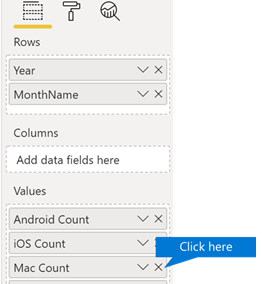

# Individuelles Anpassen der Berichte in Microsoft 365-Nutzungsanalysen

::: moniker range="o365-21vianet"

> [!NOTE]
> Das Admin Center wird geändert. Wenn Ihre Erfahrung nicht mit den hier dargestellten Details übereinstimmt, lesen Sie [Informationen zum neuen Microsoft 365 Admin Center](https://docs.microsoft.com/microsoft-365/admin/microsoft-365-admin-center-preview?view=o365-21vianet).

::: moniker-end

Microsoft 365 Usage Analytics bietet ein Dashboard in Power BI, das Einblicke in die Einführung und Verwendung von Microsoft 365 durch Benutzer bietet. Das Dashboard bildet lediglich einen Ausgangspunkt für die Interaktion mit den Nutzungsdaten. Die Berichte lassen sich zur Gewinnung stärker personalisierter Einblicke anpassen.
  
Ferner können Sie den Power BI-Desktop verwenden, um Ihre Berichte weiter anzupassen, indem Sie sie mit anderen Datenquellen verbinden, um umfassendere Einblicke in Ihr Unternehmen zu erhalten.
  
## Anpassen von Berichten im Browser

Die beiden folgenden Beispiele zeigen, wie Sie vorhandene visuelle Elemente ändern und neue visuelle Elemente erstellen.
  
### Ändern eines vorhandenen visuellen Elements

In diesem Beispiel wird gezeigt, wie Sie die Registerkarte **Aktivierung** innerhalb des Berichts zur **Aktivierung/Lizenzierung** ändern. 
  
1. Klicken Sie im Bericht **Aktivierung/Lizenzierung** auf die Registerkarte **Aktivierung**.
    
2. Wechseln Sie in den Bearbeitungsmodus, indem Sie oben auf die Schaltfläche **Bearbeiten** der Schaltfläche  klicken. 
    
    
  
3. Klicken Sie oben rechts auf **Diese Seite duplizieren**.
    
    
  
4. Klicken Sie unten rechts auf eines der Balkendiagramme, in dem die Anzahl der Benutzer angezeigt wird, die basierend auf Betriebssystemen wie Android, iOS, Mac usw. eine Aktivierung vornehmen.
    
5. Klicken Sie im Bereich **Visualisierungen** auf der rechten Seite, um die **Mac-Anzahl** aus dem visuellen Element zu entfernen, auf das **X** daneben.

        
    
### Erstellen eines neuen visuellen Elements

Im folgenden Beispiel sehen Sie, wie Sie ein neues visuelles Element zum Nachverfolgen neuer Yammer-Benutzer auf Monatsbasis erstellen.
  
1. Wechseln Sie mit der linken Navigationsleiste zum Bericht **Produktnutzung**, und klicken Sie auf die Registerkarte **Yammer**.
    
2. Wechseln Sie in den Bearbeitungsmodus, indem Sie auf ](../../media/d8da3c19-3f2d-4bf6-811e-faa804f74770.png)Die Schaltfläche "Seite hinzufügen" in Power BI um eine neue Seite zu erstellen.
  
4. Klicken Sie im Bereich **Visualisierungen** auf der rechten Seite auf **Gestapeltes Balkendiagramm** (obere Zeile, erstes Element von links).

    
    
5. Klicken Sie auf die untere rechte Ecke dieser Visualisierung, und ziehen Sie, um sie zu vergrößern.

6. Erweitern Sie im Bereich **Felder** auf der rechten Seite die Tabelle **Kalender**.

7. Ziehen Sie **MonthName** (Monatsname) in den Bereich "Felder", direkt unterhalb der Überschrift **Achse** im Bereich **Visualisierungen**.
 
    
    
8. Erweitern Sie im Bereich **Felder** auf der rechten Seite die Tabelle **TenantProductUsage** (MandantProduktVerwendung).

9. Ziehen Sie **FirstTimeUsers** (ErstmaligeBenutzer) auf den Bereich "Felder", direkt unterhalb der Überschrift **Wert**.

10. Ziehen Sie **Product** (Produkt) auf den Bereich **Filter**, unmittelbar unter die Überschrift **Filter auf visueller Ebene**.

11. Aktivieren Sie im Bereich **Filtertyp**, der dann angezeigt wird, das Kontrollkästchen **Yammer**.

    
  
12. Klicken Sie unmittelbar unterhalb der Liste der Visualisierungen auf das Symbol **Format** .

13. Erweitern Sie "Titel", und ändern Sie den Wert **Titeltext** in **Yammer-Erstbenutzer nach Monat**.
    
14. Ändern Sie den Wert für **Textgröße** auf **12**.
    
15. Ändern Sie den Titel der neuen Seite, indem Sie den Namen der Seite unten rechts bearbeiten.

16.  Um den Bericht zu speichern, klicken Sie oben auf **Leseansicht** und dann auf **Speichern**.
    
## Anpassen der Berichte in Power BI Desktop

Für die meisten Kunden wird das Ändern der Berichte und visuellen Diagrammelemente in Power BI Web ausreichend sein. Für manche kann jedoch Bedarf bestehen, diese Daten mit anderen Datenquellen zusammenzuführen, um tiefer gehende Einblicke im Kontext des eigenen Unternehmens zu erlangen. Zu diesem Zweck können in Power BI Desktop Berichte angepasst und zusätzliche Berichte generiert werden. Sie können [Power BI Desktop](https://go.microsoft.com/fwlink/p/?linkid=849797) kostenlos herunterladen. 
  
### Verwenden der APIs zur Berichterstellung

Sie können zunächst eine direkte Verbindung mit den ODATA-Berichts-APIs von Microsoft 365 herstellen, mit denen diese Berichte versorgt werden.
  
1. Navigieren Sie zu **Daten abrufen** \> **Sonstige** \> **ODATA-Feed** \> **Verbinden**.
    
2. Geben Sie im URL-Fenster "https://<i></i>reports.office.com/pbi/v1.0/\<tenantid\>" ein.
    
    **HINWEIS:** Die APIs zur Berichterstellung befinden sich in einer Vorschauphase und unterliegen bis zum Beginn der Produktion noch Änderungen. 
  
    
  
3. Geben Sie Ihre Microsoft 365 (Organization oder School) Administratoranmeldeinformationen zur Authentifizierung bei Microsoft 365 ein, wenn Sie dazu aufgefordert werden.
    
    In den [FAQ](usage-analytics.md#faq) finden Sie weitere Informationen darüber, wer auf die Microsoft 365 Adoptions Vorlagen-APP-Berichte zugreifen darf. 
    
4. Sobald die Verbindung autorisiert ist, wird das Navigationsfenster mit den für Verbindungen verfügbaren Datasets angezeigt.
    
    Wählen Sie alle aus, und klicken Sie auf **Laden**.
    
    Dadurch werden die Daten in Ihre Power BI Desktop-Instanz heruntergeladen. Speichern Sie diese Datei. Anschließend können Sie mit dem Erstellen der benötigten Berichte beginnen.
    
    
  
### Verwenden der Vorlage für die Microsoft 365-Nutzungsanalyse

Sie können ferner die Power BI-Vorlagendatei, die den Berichten der Microsoft 365-Nutzungsanalyse entspricht, als Ausgangspunkt für die Datenverbindung verwenden. Der Vorteil bei der Verwendung der PBIT-Datei besteht darin, dass die Verbindungszeichenfolge darin bereits eingerichtet ist. Ferner können Sie über die vom Basisschema zurückgegebenen Daten hinaus alle erstellten benutzerdefinierten Measures nutzen und weiter auf ihnen aufbauen.
  
Sie können die Power BI-Vorlagendatei im Microsoft [Download Center](https://download.microsoft.com/download/7/8/2/782ba8a7-8d89-4958-a315-dab04c3b620c/Microsoft%20365%20Usage%20Analytics.pbit) herunterladen. Führen Sie nach dem Herunterladen der Power BI-Vorlagendatei diese Schritte zum Einstieg aus:
  
1. Öffnen Sie die PBIT-Datei.
    
2. Geben Sie im Dialogfeld den Wert für Ihre Mandanten-ID ein.
    
    
  
3. Geben Sie Ihre Administratoranmeldeinformationen für die Authentifizierung bei Microsoft 365 ein, wenn Sie dazu aufgefordert werden.
    
     Weitere Informationen zu den Personen, denen der Zugriff auf die Berichte der Microsoft 365-Nutzungsanalyse gestattet ist. 
    
    Nach der Autorisierung werden die Daten in der Power BI-Datei aktualisiert.
    
    Das Laden der Daten kann einige Zeit in Anspruch nehmen. Nach dem Abschluss können Sie die Datei als PBIX-Datei speichern und mit dem Anpassen der Berichte fortfahren oder eine zusätzliche Datenquelle in den Bericht einbringen.
    
4. Informationen zu den Grundlagen der Berichtsgenerierung, zu ihrer Veröffentlichung im Power BI-Dienst und zum Teilen mit Ihrer Organisation finden Sie in der Dokumentation [Erste Schritte mit Power BI](https://go.microsoft.com/fwlink/?linkid=849802). Das Beschreiten dieses Wegs zum Anpassen und Teilen macht möglicherweise zusätzliche Power BI-Lizenzen erforderlich. Details dazu finden Sie im Power BI-[Lizenzierungsleitfaden](https://go.microsoft.com/fwlink/p/?linkid=849803). 
    

