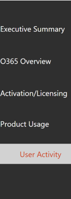
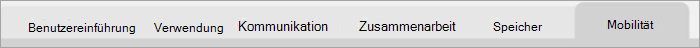
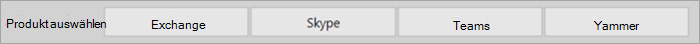
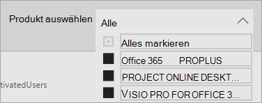
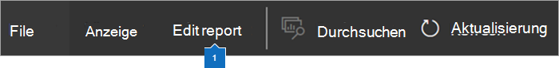

# Navigieren in und Verwenden von Berichten in Microsoft 365-VerwendungsanalyseNavigate and utilize the reports in Microsoft 365 usage analytics

Das Dashboard bietet Ihnen einen schnellen Überblick über die wichtigsten Metriken für die Verwendung und Einführung.The dashboard provides you with a quick overview of the main usage and adoption metrics. Wenn Sie die Metriken auf oberster Ebene auswählen, können Sie auf Berichte zugreifen, die weitere Details und Einblicke bieten.By selecting the top-level metrics, you can access reports that provide more details and insights. Jede Registerkarte Bericht enthält Datenvisualisierungen speziell für einen Aspekt der Verwendung und Einführung für Ihre Organisation.Each report tab contains data visualizations specific to an aspect of usage and adoption for your organization. Die erfassten Daten werden im Titel jedes Berichts erläutert, und es wird eine Kachel mit weiteren Informationen zu den Visualisierungen auf der angezeigten Berichts Registerkarte angezeigt.The data collected is explained in the title of each report and a tile appears that contains further information about the visualizations on the report tab that you are viewing.

Nachfolgend finden Sie einige Tipps zu den ersten Schritten mit Ihren Berichten:To get started with your reports, here are some tips:

- Verwenden Sie die Navigationsregisterkarten auf der linken Seite oder eine zugehörige Metrik auf der Seite " **Executive Summary** ", um zu jedem Bericht auf oberster Ebene zu navigieren.Use the navigation tabs on the left or on a related metric on the **Executive Summary** page to navigate to each top-level report.

    

- Verwenden Sie die Navigationsregisterkarten oben auf jedem Bericht auf oberster Ebene, um zu anderen Berichten innerhalb dieser Ebene zu navigieren.Use the navigation tabs at the top of each top-level report to navigate to different reports within that level.

    

- Viele Berichte enthalten einen datenschnitt, in dem Sie nach dem Produkt, dem AAD-Attribut oder der Aktivität filtern können, die Sie anzeigen möchten.Many reports contain a slicer where you can filter on the product, AAD attribute, or activity that you want to view. Dabei kann es sich um eine Einzelauswahl oder um eine Mehrfachauswahl handeln.These can be either single-select or multi-select.

    

    

- Zeigen Sie auf Datenpunkte, um ein Popup mit Details anzuzeigen.Hover over data points to view a callout that contains details.

    

Der Benutzer, der die Vorlagen-App instanziiert hat, kann den Bericht auf seine Anforderungen anpassen.The user who has instantiated the template app will have the ability to customize the report to their needs. So passen Sie die Vorlagen-APP an:To customize the template app:

- Klicken Sie oben im Bericht auf **Bericht bearbeiten** .Select **Edit report** at the top of the report.

    

- Erstellen Sie mithilfe der zugrunde liegenden [Datasets](usage-analytics-data-model.md) eigene Visualisierungen.Create your own visuals by using the underlying [datasets](usage-analytics-data-model.md).

- Verwenden Sie Power BI Desktop, um eigene Datenquellen einzubeziehen.Use PowerBI Desktop to bring in your own data sources.

Um Ihre Berichte freizugeben, wählen Sie einfach die Schaltfläche Freigeben aus.To share your reports, just select the share button  oben auf der Seite.at the top of the page.

Informationen zum Anpassen der Berichte finden Sie unter [Anpassen der Berichte in Microsoft 365-Verwendungsanalyse](customize-reports.md).To learn how to customize the reports, see [Customizing the reports in Microsoft 365 usage analytics](customize-reports.md).

Viele weitere Informationen finden Sie in der Power BI-Dokumentation:You can find lots of additional information in the Power BI help documentation:

- [Power BI grundlegende KonzeptePower BI basic concepts](https://docs.microsoft.com/power-bi/service-basic-concepts)

    Hier finden Sie Informationen zu Dashboard, Datasets, Berichten und anderen Power BI-Konzepten.Learn about dashboard, datasets, reports, and other Power BI concepts.

- [Erste Schritte mit Power BIGet started with Power BI](https://docs.microsoft.com/power-bi/service-get-started?wt.mc_id=O365_Reports_PBI_contentpack)

    Lernen Sie die grundlegenden Funktionen in Power BI kennen. Hier finden Sie auch Links zur Verwendung von Power BI Desktop.Learn the basic functionality in Power BI. Find links to how to use Power BI Desktop.

- [Freigeben von Dashboards und BerichtenShare dashboards and reports](https://docs.microsoft.com/power-bi/service-share-dashboards)

    Hier erfahren Sie, wie Sie Berichte für Kollegen oder Personen außerhalb Ihrer Organisation freigeben.Learn how to share reports with your colleagues or people outside your organization. Sie können auch den Bericht oder eine gefilterte Version des Berichts freigeben.You can also share the report or a filtered version of the report.
