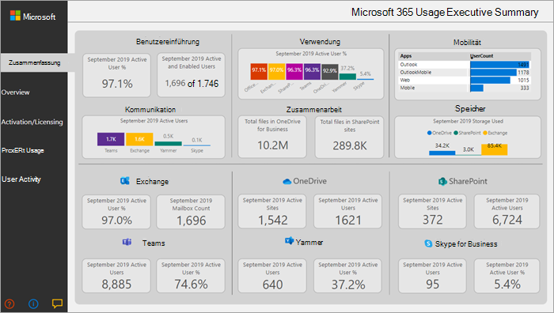

# Analysen zur Nutzung von Microsoft 365Microsoft 365 usage analytics
---
Microsoft 365 Usage Analytics steht auch für Microsoft 365 US Government Community zur Verfügung.Microsoft 365 usage analytics is also available for Microsoft 365 US Government Community.
 
## Übersicht über die Microsoft 365-NutzungsanalyseOverview of Microsoft 365 usage analytics

Verwenden Sie Microsoft 365 Usage Analytics in Power BI, um Einblicke in Ihre Organisation zu gewinnen, die die verschiedenen Dienste innerhalb von Microsoft 365 zur Kommunikation und Zusammenarbeit anwendet. Sie können Microsoft 365-Nutzungsdaten visualisieren und analysieren, benutzerdefinierte Berichte erstellen und die Einblicke in Ihrer Organisation freigeben und Einblicke in die Verwendung von Microsoft 365 durch bestimmte Regionen oder Abteilungen gewinnen.Use Microsoft 365 usage analytics within Power BI to gain insights on how your organization is adopting the various services within Microsoft 365 to communicate and collaborate. You can visualize and analyze Microsoft 365 usage data, create custom reports and share the insights within your organization and gain insights into how specific regions or departments are utilizing Microsoft 365.
  
Microsoft 365 Usage Analytics ist eine Vorlagen-APP, die Ihnen Zugriff auf ein vordefiniertes Dashboard ermöglicht, das eine produktübergreifende Ansicht der letzten 12 Monate bietet und eine Reihe von vordefinierten Berichten enthält. Jeder Bericht bietet Ihnen spezifische Einblicke in die Nutzung. Benutzerspezifische Informationen stehen für den letzten vollständigen Kalendermonat zur Verfügung.Microsoft 365 usage analytics is a template app that gives you access to a pre-built dashboard that provides a cross-product view of the last 12 months and contains a number of pre-built reports. Each report provides you with specific usage insights. User specific information is available for the last full calendar month.
  
Das [Datenmodell](usage-analytics-data-model.md) , das die Vorlagen-App ausmacht, enthält Benutzerattribute aus Active Directory, die die Möglichkeit zum Pivotieren in bestimmten Berichten ermöglichen.The [data model](usage-analytics-data-model.md) that powers the template app includes user attributes from Active Directory, enabling the ability to pivot in certain reports. Die folgenden Active Directory-Attribute sind enthalten: Standort, Abteilung und Unternehmen.The following Active Directory attributes are included: location, department and organization. 
  
Informationen zum Sammeln von Daten finden Sie unter[Microsoft 365-Nutzungsanalysen aktivieren](enable-usage-analytics.md).See [Enable Microsoft 365 usage analytics](enable-usage-analytics.md) to start collecting data. 
  
Microsoft 365-Nutzungsanalysen enthalten eine Reihe von Berichten, die in den folgenden Abschnitten beschrieben werden.Microsoft 365 usage analytics contains a number of reports detailed in the following sections. 

Sie können auf detaillierte Berichte für jeden Bereich zugreifen, indem Sie die Datentabellen auswählen.You can access detailed reports for each area by selecting the data tables. Während Sie die Berichte anzeigen, können Sie über die Registerkarten unten auf der Website alle vordefinierten Berichte anzeigen.You can view all pre-built reports by selecting the tabs at the bottom of the site, once you are viewing the reports. Ausführlichere Informationen finden Sie unter [Lesen und Verwenden der Berichte in Microsoft 365-Nutzungsanalysen](navigate-and-utilize-reports.md) und [Anpassen der Berichte in Microsoft 365-Nutzungsanalysen](customize-reports.md).For more detailed instructions, read [Navigating and utilizing the reports in Microsoft 365 usage analytics](navigate-and-utilize-reports.md) and [Customizing the reports in Microsoft 365 usage analytics](customize-reports.md).

## KurzfassungExecutive summary

Die Kurzfassung bietet auf einen Blick eine übergeordnete Ansicht der Berichte zur Übernahme von Microsoft 365 Business sowie zu Nutzung, Mobilität, Kommunikation, Zusammenarbeit und Speicherung, und ist für Entscheidungsträger in Unternehmen gedacht.The executive summary is a high-level, at-a-glance view of Microsoft 365 for Business adoption, usage, mobility, communication, collaboration, and storage reports, and is meant for business decision makers. Sie bietet einen Einblick in die Nutzung einiger einzelner Dienste, basierend auf allen aktivierten und aktiven Benutzern.It provides a view into how some individual services are being used, based on all the users who have been enabled and those who are active. Alle im Bericht angezeigten Monatswerte beziehen sich auf den letzten vollständigen Monat.All values of the month shown on the report refer to the latest complete month. 

In dieser Kurzfassung können Sie schnell Nutzungsmuster in Office erkennen und verstehen, wie und wo Ihre Mitarbeiter zusammenarbeiten.This summary lets you quickly understand usage patterns in Office and how and where your employees are collaborating.

## ÜbersichtOverview

Der Microsoft 365 Overview-Bericht enthält die folgenden Berichte.The Microsoft 365 overview report contains the following reports. Sie können diese anzeigen, indem Sie die Registerkarte oben auf der Berichtsseite auswählen.You can view them by choosing the tab on top of the report page. Alle im oberen Bereich des Berichts angezeigten Monatswerte beziehen sich auf den letzten vollständigen Monat.All values of the month shown on the top section of the report refer to the latest complete month.

- **Übernahme** &ndash; Bietet eine umfassende Zusammenfassung der Übernahmetrends.**Adoption** &ndash; Offers an all-up summary of adoption trends. Verwenden Sie die Berichte in diesem Abschnitt, um zu erfahren, wie Ihre Benutzer Microsoft 365 angenommen haben, und wie sich die Gesamtauslastung der einzelnen Dienste Monat für Monat geändert hat.Use the reports in this section to learn how your users have adopted Microsoft 365, as well as how overall usage of the individual services has changed month over month. Sie können sehen, wie Benutzer möglicherweise aktiviert werden, wie viele Personen in Ihrer Organisation Microsoft 365 aktiv verwenden, wie viele Benutzer zurückgeben und wie viele das Produkt zum ersten Mal verwenden.You can see how may users are enabled, how many people in your organization are actively using Microsoft 365, how many are returning users, and how many are using the product for the first time.

- **Nutzung** &ndash; Bietet eine Drilldown-Ansicht der Anzahl aktiver Benutzer und der wichtigsten Aktivitäten für jedes Produkt in den letzten 12 Monaten.**Usage** &ndash; Offers a drill-down view into the volume of active users and the key activities for each product for the last 12 months. Verwenden Sie die Berichte in diesem Abschnitt, um zu erfahren, wie Personen in Ihrer Organisation Microsoft 365 verwenden.Use the reports in this section to learn how people in your organization are using Microsoft 365.

- **Kommunikation** &ndash; Sie können auf einen Blick erkennen, ob Personen in Ihrer Organisation lieber per Teams, Yammer, E-Mail oder Skype-Anrufen in Kontakt bleiben.**Communication** &ndash; You can see at a glance whether people in your organization prefer to stay in touch by using Teams, Yammer, email, or Skype calls. Sie können beobachten, ob sich die Nutzungsgewohnheiten Ihrer Mitarbeiter hinsichtlich Kommunikationstools ändern.You can observe if there are shifts in patterns in the use of communication tools among your employees. 

- **Zusammenarbeit** &ndash; Erfahren Sie, wie Mitarbeiter in Ihrer Organisation OneDrive und SharePoint zum Speichern von Dokumenten und zur Zusammenarbeit verwenden und wie sich diese Trends im Lauf der Monate entwickeln.**Collaboration** &ndash; See how people in your organization use OneDrive and SharePoint to store documents and collaborate with each other, and how these trends evolve month over month. Sie können auch sehen, wie viele Dokumente intern oder extern geteilt und wie viele SharePoint-Websites oder OneDrive-Konten aktiv verwendet werden, aufgeschlüsselt nach Besitzern und anderen Mitarbeitern.You can also see how many documents are shared internally or externally and how many SharePoint sites or OneDrive accounts are actively being used, broken out by owners and other collaborators.

- **Speicher** &ndash; Verwenden Sie diesen Bericht, um den genutzten Cloudspeicher für Postfächer, OneDrive und SharePoint-Websites nachzuverfolgen.**Storage** &ndash; Use this report to track cloud storage for mailboxes, OneDrive, and SharePoint sites.

- **Mobilität** &ndash; Verfolgen Sie, welche Clients und Geräte von den Benutzern für die Verbindung zu E-Mail, Teams, Skype oder Yammer verwendet werden.**Mobility** &ndash; Track which clients and devices people use to connect to email, Teams, Skype, or Yammer.

## Aktivierung und LizenzierungActivation and licensing

Auf der Seite "Aktivierung und Lizenzierung" werden Berichte zur Aktivierung von Microsoft 365 angeboten. Das bedeutet, wie viele Benutzer Office-Apps heruntergeladen und aktiviert haben und wie viele Lizenzen von Ihrer Organisation zugewiesen wurden.The activation and license page offers reports on Microsoft 365 activation; that is, how many users have downloaded and activated Office apps and how many licenses have been assigned by your organization. Der Monatswert im oberen Bereich bezieht sich auf den aktuellen Monat, und die Metriken spiegeln die vom Anfang des Monats bis zum aktuellen Datum aggregierten Werte wider.The month value towards the top refers to the current month, and the metrics reflect values aggregated from the beginning of the month to the current date.

- **Aktivierungs** &ndash; Track-Dienstplan (beispielsweise Microsoft 365 ProPlus-, Project-und Visio-Aktivierungen) in Ihrer Organisation.**Activation** &ndash; Track service plan (for example, Microsoft 365 ProPlus, Project, and Visio) activations in your organization. Jede Person mit einer Office-Lizenz kann Produkte auf bis zu fünf Geräten installieren.Each person with an Office license can install products on up to five devices. Mit den Berichten in diesem Abschnitt können Sie auch die Geräte anzeigen, auf denen Personen Office-Apps installiert haben.You can also use reports in this section to see the devices on which people have installed Office apps. Beachten Sie, dass ein Benutzer die App installieren und sich mit seinem-Konto anmelden muss, um einen Plan zu aktivieren.Note that to activate a plan, a user must install the app and sign in with their account.

- **Lizenzierung** &ndash; Dieser Bericht enthält eine Übersicht über die Lizenztypen, die Anzahl der Benutzer, denen die jeweiligen Lizenztypen zugewiesen wurden, und die Verteilung der Lizenzzuweisung für jeden Monat.**Licensing** &ndash; This report contains an overview of license types, the count of users who were assigned each license type, and the license assignment distribution for each month. Der Monatswert im oberen Bereich bezieht sich auf den aktuellen Monat, und die Metriken spiegeln die vom Anfang des Monats bis zum aktuellen Datum aggregierten Werte wider.The month value towards the top refers to the current month, and the metrics reflect values aggregated from the beginning of the month to the current date.

## ProduktnutzungProduct usage

Dieser Bericht enthält einen separaten Bericht für jeden Microsoft 365-Dienst, einschließlich Exchange, Microsoft 365-Gruppen, OneDrive, SharePoint, Skype, Teams und jammern.This report contains a separate report for each Microsoft 365 service, including Exchange, Microsoft 365 groups, OneDrive, SharePoint, Skype, Teams, and Yammer. Jeder Bericht enthält Berichte über die Gesamtzahl der aktivierten im Vergleich zur Gesamtzahl der aktiven Benutzer, die Anzahl der Entitäten wie Postfächer, Websites, Gruppen und Konten sowie ggf. Berichte über den Aktivitätstyp.Each report contains total enabled vs. total active user reports, counts of entities such as mailboxes, sites, groups, and accounts, as well as activity type reports where appropriate. Alle im oberen Bereich des Berichts angezeigten Monatswerte beziehen sich auf den letzten vollständigen Monat.All values of the month shown on the top section of the report refer to the latest complete month.

## BenutzeraktivitätUser activity

Benutzeraktivitätsberichte sind für bestimmte einzelne Dienste verfügbar.User activity reports are available for certain individual services. Diese Berichte liefern Nutzungsdaten auf Benutzerebene, die mit Active Directory-Attributen verknüpft sind.These reports provide user-level detail usage data joined with Active Directory attributes. Darüber hinaus können Sie im Bericht zur Einführung in den einzelnen Abteilungen nach Active Directory-Attributen segmentieren, um die aktiven Benutzer in den einzelnen Diensten anzuzeigen.In addition, the Department Adoption report lets you slice by Active Directory attributes so that you can see active users across all individual services. Alle Metriken werden für den letzten vollständigen Monat aggregiert.All metrics are aggregated for the latest complete month.

## Häufig gestellte FragenFAQ

### Wird diese Vorlagen-App über den Kauf verfügbar sein, oder wird Sie kostenlos sein?Is this template app going to be available through purchase or will it be free?

Es ist nicht kostenlos, Sie benötigen eine Power BI pro-Lizenz.It is not free, you will need a Power BI Pro license. Ausführliche Informationen finden Sie unter [Voraussetzungen](https://docs.microsoft.com/power-bi/service-template-apps-install-distribute#prerequisites) für die Installation, Anpassung und Verteilung einer Vorlagen-app.For details see [prerequisites](https://docs.microsoft.com/power-bi/service-template-apps-install-distribute#prerequisites) for installing, customizing, and distributing a template app.

Weitere Informationen finden Sie unter [Freigeben von Dashboards und Berichten](https://docs.microsoft.com/power-bi/service-how-to-collaborate-distribute-dashboards-reports#share-dashboards-and-reports), um die Dashboards für andere freizugeben.To share the dashboards with others, please see more at [Share dashboards and reports](https://docs.microsoft.com/power-bi/service-how-to-collaborate-distribute-dashboards-reports#share-dashboards-and-reports).

### Wer kann eine Verbindung zu Microsoft 365-Nutzungsanalysen herstellen?Who can connect to Microsoft 365 usage analytics?

Sie müssen entweder ein **globaler Administrator**, Exchange- **Administrator**, **Skype for Business Administrator**, **SharePoint-Administrator**, **globaler Leser** oder **berichtsleser** sein, um die Verbindung mit der Vorlagen-App herzustellen.You have to be either a **Global admin**, **Exchange admin**, **Skype for Business admin**, **SharePoint admin**, **Global reader** or **Report reader** in order to establish the connection to the template app. Weitere Informationen finden Sie unter [Informationen zu Administratorrollen](../add-users/about-admin-roles.md).See [About admin roles](../add-users/about-admin-roles.md) for more information.

### Wer kann die Verwendungsanalyseberichte anpassen?Who can customize the usage analytics reports?

Nur der Benutzer, der die erste Verbindung mit der Vorlagen-App hergestellt hat, kann die Berichte anpassen oder neue Berichte in der Power BI-Weboberfläche erstellen.Only the user who made the initial connection to the template app can customize the reports or create new reports in the Power BI web interface. Weitere Informationen finden Sie unter [Anpassen der Berichte in Microsoft 365-Nutzungsanalysen](customize-reports.md).See [Customizing the reports in Microsoft 365 usage analytics](customize-reports.md) for instructions.

### Kann ich die Berichte nur von der Power BI-Weboberfläche anpassen?Can I only customize the reports from the Power BI web interface?

Zusätzlich zum Anpassen der Berichte von der Power BI-Weboberfläche können Benutzer mit Power BI Desktop auch direkt mit dem Microsoft 365-Berichtsdienst eine Verbindung herstellen, um eigene Berichte zu erstellen.In addition to customizing the reports from the Power BI web interface, users can also use Power BI Desktop to connect directly to the Microsoft 365 reporting service to build their own reports.

### Wie erhalte ich die pbit-Datei, der dieses Dashboard zugeordnet ist?How can I get the pbit file that this dashboard is associated with?

Sie können über das [Microsoft Download Center](https://download.microsoft.com/download/7/8/2/782ba8a7-8d89-4958-a315-dab04c3b620c/Microsoft%20365%20Usage%20Analytics.pbit) auf die pbit-Datei zugreifen.You can access to the pbit file from the [Microsoft Download center](https://download.microsoft.com/download/7/8/2/782ba8a7-8d89-4958-a315-dab04c3b620c/Microsoft%20365%20Usage%20Analytics.pbit).

### Wer kann die Dashboards und Berichte anzeigen?Who can view the dashboards and reports?

Wenn Sie eine Verbindung mit der Vorlagen-App hergestellt haben, können Sie Sie für jeden freigeben, indem Sie die [Freigabefunktion](https://go.microsoft.com/fwlink/p/?linkid=845494)verwenden.If you connected to the template app, you can share it with anybody by using the [sharing functionality](https://go.microsoft.com/fwlink/p/?linkid=845494). Die Power BI-Lizenzierung erfordert, dass sowohl der Benutzer, der das Dashboard teilt, als auch der Benutzer, mit dem ein Dashboard geteilt wird, über Power BI Pro oder Power BI Premium verfügen.Power BI licensing requires that both the user sharing and the user with whom a dashboard is shared have Power BI Pro or Power BI Premium.

### Kann jeder das Dashboard teilen, oder muss es die Person sein, die mit dem Dashboard verbunden ist?Can anyone share the dashboard, or does it have to be the person who connected to the dashboard?

Wenn Sie das Dashboard teilen, können Sie zulassen, dass andere Benutzer das Dashboard ihrerseits weiter teilen.When sharing the dashboard, you can either allow users to re-share the dashboard with others or not. Sie können diese Option zum Zeitpunkt der Freigabe festlegen.You can set this option at the time of sharing.

### Ist es möglich, die gleiche Vorlagen-App mit einer Gruppe von Personen zu bearbeiten und anzupassen?Is it possible to work on and customize the same template app with a group of people?

Ja.Yes. Um eine Gruppe von Administratoren für die Zusammenarbeit in derselben Vorlagen-APP zu aktivieren, können Sie die APP-Arbeitsbereichs Funktionalität von Power BI nutzen, weitere Informationen finden Sie unter [wie sollte ich zusammenarbeiten und Dashboards und Berichte freigeben?](https://go.microsoft.com/fwlink/p/?linkid=851070)To enable a group of admins to work together on the same template app, you can leverage the app workspace functionality of Power BI, for more information, see [How should I collaborate and share dashboards and reports?](https://go.microsoft.com/fwlink/p/?linkid=851070) 

### Für welchen Zeitraum stehen Daten zur Verfügung?For which timeframe is data available?

Die meisten Berichte zeigen Daten für die letzten 12 Monate an.The majority of the reports display data for the previous 12 months. Einige Diagramme zeigen jedoch möglicherweise weniger Historie, da die Datenerfassung für verschiedene Produkte und Berichte zu unterschiedlichen Zeitpunkten gestartet wurde und daher Daten für die gesamten 12 Monate möglicherweise nicht verfügbar sind.However, some of the charts may show less history since the data collection for different products and reports were started at different times and thus data for the full 12 months might not be available. Alle Berichte werden schließlich einen Verlauf von bis zu 12 Monaten anzeigen.All the reports will eventually build up to 12 months of history. Berichte, die Details auf Benutzerebene liefern, zeigen Daten für den vorherigen vollständigen Monat an.Reports that show user level details show data for the previous complete month.

### Welche Daten sind in der Vorlagen-App enthalten?What data is included in the template app?

Die Daten in der Vorlagen-APP umfassen derzeit dieselbe Gruppe von Aktivitäts Metriken, die in den [Aktivitätsberichten](../activity-reports/activity-reports.md)zur Verfügung stehen.The data in the template app currently covers the same set of activity metrics available in the [Activity Reports](../activity-reports/activity-reports.md). Wenn den Aktivitätsberichten Berichte hinzugefügt werden, werden Sie der Vorlagen-app in einer zukünftigen Version hinzugefügt.As reports are added to the activity reports, they will be added to the template app in a future release.

### Inwiefern unterscheiden sich die Daten in der Vorlagen-APP von den Daten in den Nutzungsberichten?How does the data in the template app differ from the data in the usage reports?

Die zugrunde liegenden Daten, die Sie in der Vorlagen-app sehen, stimmen mit den Daten überein, die Sie in den Aktivitätsberichten im Microsoft 365 Admin Center sehen.The underlying data you see in the template app matches the data you see in the activity reports in the Microsoft 365 admin center. Die wichtigsten Unterschiede liegen darin, dass im Admin Center Daten für die letzten 7/30/90/180 Tage verfügbar sind, während die Vorlagen-App monatlich Daten für bis zu 12 Monate darstellt.The key differences are that in the admin center data is available for the last 7/30/90/180 days while the template app presents data on a monthly basis for up to 12 months.

Darüber hinaus sind Benutzerebene Details in der Vorlagen-app nur für den letzten vollständigen Monat für Benutzer verfügbar, denen eine Produktlizenz zugewiesen und eine Aktivität ausgeführt wurde.In addition, user level details in the template app are only available for the last complete month for users who were assigned a product license and performed an activity.

### Wann sollte ich die Vorlagen-App verwenden und wann werden die Nutzungsberichte verwendet?When should I use the template app and when the usage reports?

Die [Aktivitätsberichte](../activity-reports/activity-reports.md) sind ein guter Ausgangspunkt, um die Verwendung und Einführung von Microsoft 365 zu verstehen.The [Activity Reports](../activity-reports/activity-reports.md)  are a good starting point to understand usage and adoption of Microsoft 365. Die Vorlagen-App kombiniert die Microsoft 365-Nutzungsdaten mit den Active Directory Informationen Ihrer Organisation und ermöglicht Administratoren das Analysieren des Datasets mithilfe der Visual Analytics-Funktionen von Power BI.The template app combines the Microsoft 365 usage data and your organization’s Active Directory information and enables admins to analyze the data set using the visual analytics capabilities of Power BI. Auf diese Weise können Administratoren nicht nur Microsoft 365-Nutzungsdaten visualisieren und analysieren, sondern auch durch Active Directory Eigenschaften wie Abteilungen, Standort usw. schneiden. Sie können auch benutzerdefinierte Berichte erstellen und die Einblicke in Ihrer Organisation freigeben.This enables admins to not just visualize and analyze Microsoft 365 usage data, but also slice it by Active Directory properties such as departments, location etc. They can also create custom reports and share the insights within their organization. 

### Wie oft werden die Daten aktualisiert?How often is the data refreshed? 

Wenn Sie zum ersten Mal eine Verbindung mit der Vorlagen-App herstellen, wird Sie automatisch mit Ihren Daten für die letzten 12 Monate aufgefüllt.When you connect to the template app for the first time, it will automatically populate with your data for the previous 12 months. Danach werden die Daten der Vorlagen-App wöchentlich aktualisiert.After that, the template app data will refresh weekly. Kunden können den Aktualisierungszeitplan ändern, wenn ihre Verwendung dieser Daten einen anderen Aktualisierungsrhythmus erfordert.Customers can choose to modify the refresh schedule if their use of this data demands a different update rhythm.

Der Microsoft 365-Back-End-Dienst aktualisiert täglich Daten und stellt Daten bereit, die zwischen 5-8 Tagen vom aktuellen Datum ausgehen.The back-end Microsoft 365 service will refresh data on a daily basis and provides data that is between 5-8 days latent from the current date.

Die Spalte **Inhalts Datum** in jedem DataSet stellt das Aktualitäts Datum der Daten in der Vorlagen-App dar.The **Content date** column in each dataset represents the freshness date of the data in the template app.

### Wie ist ein "aktiver Benutzer" definiert?How is an active user defined?

Die Definition des aktiven Benutzers entspricht der Definition des [aktiven Benutzers](../activity-reports/active-users.md) in den Aktivitätsberichten.The definition of active user is the same as the definition of [active user](../activity-reports/active-users.md) in the activity reports.

### Welche SharePoint-Websitesammlungen sind in den SharePoint-Berichten enthalten?What SharePoint site collections are included in the SharePoint reports?

Die aktuelle Version der Vorlagen-App umfasst Dateiaktivitäten von SharePoint-Teamwebsites und SharePoint-Gruppen Websites.The current version of the template app includes file activity from SharePoint team sites and SharePoint group sites.

### Welche Gruppen sind im Microsoft 365-Gruppen Nutzungsbericht enthalten?Which groups are included in the Microsoft 365 Groups usage report?

Die aktuelle Version der Vorlagen-App umfasst die Verwendung von Outlook-Gruppen, Jammer Gruppen und SharePoint-Gruppen.The current version of the template app includes usage from Outlook groups, Yammer groups, and SharePoint groups. Es sind keine Gruppen im Zusammenhang mit Microsoft Teams oder Planner enthalten.It does not include groups related to Microsoft Teams or Planner.

### Wann wird eine aktualisierte Version der Vorlagen-app verfügbar sein?When will an updated version of the template app become available?

Wichtige Änderungen an der Vorlagen-App werden zweimal im Jahr veröffentlicht, die neue Berichte oder neue Daten enthalten können.Major changes to the template app will be released twice a year which may include new reports or new data. Kleinere Änderungen an den Berichten können häufiger veröffentlicht werden.Minor changes to the reports may be released on a more frequent basis.

### Ist es möglich, die Daten aus der Vorlagen-app in vorhandene Lösungen zu integrieren?Is it possible to integrate the data from the template app into existing solutions? 

Die Daten in der Vorlagen-App können über die Microsoft 365-APIs (in der Vorschau) abgerufen werden.The data in the template app can be retrieved through the Microsoft 365 APIs (in preview). Wenn sie in Produktion gehen, werden sie in den [Microsoft Graph Berichts-APIs](https://go.microsoft.com/fwlink/p/?linkid=848843) zusammengeführt.When they ship to production they will be merged within the [Microsoft Graph reporting APIs](https://go.microsoft.com/fwlink/p/?linkid=848843). 

### Gibt es Pläne zum Erweitern der Vorlagen-APP, um Verwendungsdaten von anderen Microsoft-Produkten anzuzeigen?Are there plans to expand the template app to show usage data from other Microsoft products?

Dies wird für zukünftige Verbesserungen in Betracht gezogen.This is considered for future improvements. Überprüfen Sie die [Microsoft 365-Roadmap](https://www.microsoft.com/microsoft-365/roadmap) auf Updates.Check the [Microsoft 365 Roadmap](https://www.microsoft.com/microsoft-365/roadmap) for updates.

### Wie kann ich nach Unternehmensinformationen in Active Directory suchen?How can I pivot by company information in Active Directory?

Unternehmens-Informationen sind eines der Active Directory Felder in der Vorlagen-App enthalten, und Sie können es als vordefinierten Filter in den Aktivitätsberichten für **Produkt Benutzer** anzeigen.Company information is included one of the Active Directory fields in the template app and you can see it as a pre-built filter in the **Product User activity** reports. Sie sind als Spalte in der Tabelle **UserState** verfügbar.It is available as column in the **UserState** table.

### Können zusätzliche Felder aus Active Directory importiert werden?Is it possible to bring in additional fields from Active Directory?

Zusätzliche individuelle Anpassungen für diese Daten sind möglich, indem Sie eine Verbindung zu den [Microsoft Graph-Berichts-APIs](https://go.microsoft.com/fwlink/p/?linkid=848843) herstellen, um zusätzliche Felder aus Azure Active Directory abzurufen und dem Dataset hinzuzufügen.Additional customization on this data is possible by connecting to the [Microsoft Graph reporting APIs](https://go.microsoft.com/fwlink/p/?linkid=848843) to pull additional fields from Azure Active Directory and join to the dataset. 

### Ist es möglich, die Informationen in der Vorlagen-app in mehreren Abonnements zusammenzufassen?Is it possible to aggregate the information in the template app across multiple subscriptions?

Zu diesem Zeitpunkt ist die Vorlagen-App für ein einzelnes Abonnement, da Sie den Anmeldeinformationen zugeordnet ist, mit denen anfänglich eine Verbindung hergestellt wurde.At this time, the template app is for a single subscription, as it is associated with the credentials that was used to initially connect to it.

### Ist es möglich, die Nutzung nach Plan anzuzeigen (d. h. E1, E3)?Is it possible to see usage by plan (i.e. E1, E3)?

In der Vorlagen-APP wird die Verwendung auf pro Produktebene dargestellt.In the template app, usage is represented at the per product level. Daten zu den verschiedenen Abonnements, die Benutzern zugewiesen sind, werden bereitgestellt, es ist jedoch nicht möglich, Benutzeraktivitäten mit dem Abonnement zu verbinden, das dem Benutzer zugewiesen ist.Data about the various subscriptions that are assigned to users are provided, however it is not possible to correlate user activity to the subscription assigned to user.

### Ist es möglich, andere Datasets in die Vorlagen-APP zu integrieren?Is it possible to integrate other data sets into the template app?

Sie können Power BI Desktop verwenden, um eine Verbindung mit den Microsoft 365-APIs (in der Vorschau) herzustellen, um zusätzliche Datenquellen für die Kombination mit den Vorlagen-App-Daten zu integrieren.You can use Power BI Desktop to connect to the Microsoft 365 APIs (in preview) to bring additional data sources to combine with the template app data.

Weitere Informationen finden Sie unter [Anpassen des Dokuments](customize-reports.md).For more information see the [Customize document](customize-reports.md).

### Ist es möglich, die Berichte der "Top-Benutzer" für einen bestimmten Zeitraum zu betrachten?Is it possible to see the "Top Users" reports for a specific timeframe?

Alle Berichte auf Benutzerebene enthalten zusammengefasste Daten des vorherigen Monats.All user level reports present aggregated data for the previous month.

### Wird die Vorlagen-App lokalisiert?Will the template app be localized? 

Dies ist derzeit nicht Teil der Roadmap.This is currently not on the roadmap.

### Ich habe eine bestimmte Frage zu den Daten, die ich für meine Organisation sehe.I have a specific question about the data I'm seeing for my organization. An wen kann ich mich mit Fragen wenden?Who can I reach out to?

Sie können die Schaltfläche Feedback auf der Seite Admin Center-Aktivitätsübersicht verwenden, oder Sie können einen [Supportfall](../contact-support-for-business-products.md) öffnen, um Hilfe bei der Vorlagen-APP zu erhalten.You can use the feedback button in the admin center activity overview page, or you can open a [support case](../contact-support-for-business-products.md) to get help with the template app. 

### Wie können Partner auf die Daten zugreifen?How can partners access the data?

Wenn ein Partneradministrator Rechte delegiert hat, kann er im Namen seines Kunden eine Verbindung mit der Vorlagen-App herstellen.If a partner has delegated admin rights, he or she can connect to the template app on behalf of their customer.

### Kann ich identifizierbare Informationen wie Benutzer-, Gruppen- und Websitenamen in Berichten verbergen?Can I hide identifiable information such as user, group, and site names in reports?

Ja. Informationen dazu finden Sie unter [Anonymisieren der gesammelten Daten](enable-usage-analytics.md#make-the-collected-data-anonymous).Yes, see [Make the collected data anonymous](enable-usage-analytics.md#make-the-collected-data-anonymous).
