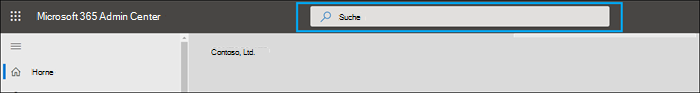
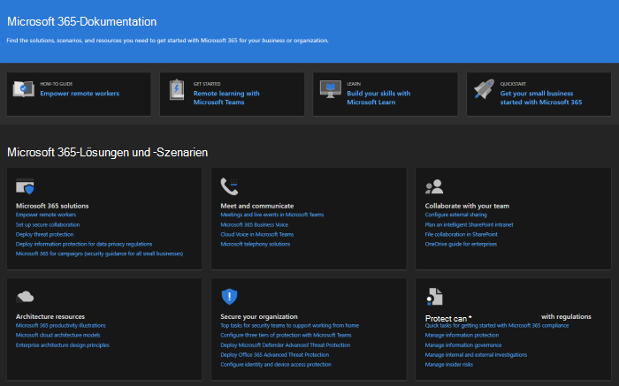

# Neues im Microsoft 365 Admin Center

::: moniker range="o365-21vianet"

> [!NOTE]
> Einige Informationen in diesem Artikel gelten möglicherweise nicht für Office 365, betrieben von 21Vianet.

::: moniker-end

Wir fügen kontinuierlich neue Features zum [Microsoft 365 Admin Center](microsoft-365-admin-center-preview.md)hinzu, beheben Probleme, über die wir erfahren, und führen basierend auf Ihrem Feedback Änderungen durch. Unten können Sie sehen, was heute schon für Sie verfügbar ist. Einige Funktionen werden für unsere Kunden mit unterschiedlicher Geschwindigkeit bereitgestellt. Wenn sie noch kein Feature sehen, versuchen Sie, [sich selbst zur zielorientierten Version hinzufügen.](manage/release-options-in-office-365.md)

Und wenn Sie wissen möchten, was mit anderen Microsoft Cloud Services neu ist:

- [Neues in Azure Active Directory](https://docs.microsoft.com/azure/active-directory/fundamentals/whats-new)
- [Neues im Exchange Admin Center](https://docs.microsoft.com/Exchange/whats-new)
- [Neuerungen in Microsoft Intune](https://docs.microsoft.com/mem/intune/fundamentals/whats-new)
- [Neuerungen im Microsoft 365 Compliance Center](https://docs.microsoft.com/Office365/SecurityCompliance/whats-new)
- [Neuerungen in Microsoft 365 Defender](https://docs.microsoft.com/microsoft-365/security/mtp/whats-new)
- [Aktive Websites im SharePoint Online Admin Center](https://docs.microsoft.com/sharepoint/what-s-new-in-admin-center)
- [Office-Updates](https://docs.microsoft.com/OfficeUpdates/)

## Ignite 2020 (August & September)

Willkommen bei Microsoft Ignite – unserer ersten Nur-Online-Ignite. Wir hoffen, Sie in einer unserer Sitzungen zu sehen: [Microsoft Ignite 2020-Sitzungskatalog](https://myignite.microsoft.com/sessions). Hier sind nur einige der Dinge, über die wir bei Ignite sprechen werden. 
> [!NOTE]
> Nicht alle Features werden sofort für alle verfügbar sein. Wenn die neuen Features nicht zu sehen sind, treten [Sie der targeted Release bei.](manage/release-options-in-office-365.md)

### Verwaltung mit mehreren Mandanten

Wir haben eine Reihe von Features für Mehr-Mandanten-Administratoren wie Sie entwickelt, um Ihre Arbeit schneller und effizienter erledigen zu können. Weitere Informationen finden Sie unter [Verwalten mehrerer Mandanten.](multi-tenant/manage.md)

- **Ihre Mandanten:** Wechseln Sie schnell zwischen den mandanten, die Sie verwalten.
- **Alle** Mandanten: Eine neue Seite, auf der Sie schnell die Integrität aller Dienste Ihrer Mandanten, alle offenen Serviceanfragen, Ihre Produkte und Abrechnungen, empfohlene Einrichtungsaufgaben und die Anzahl der Benutzer in diesem Mandanten anzeigen können.
- **Setup:** Auf der Seite "Setup mit mehreren Mandanten" erhalten Sie eine Listenansicht der Setupseite, die jedoch für viele Mandanten organisiert ist. Sie können sehen, welche Features nicht aktiviert sind, welche Aufgaben für alle Mandanten abgeschlossen sind und welche Aufgaben mandanten noch ausgeführt werden müssen. Diese Ansicht hilft Ihnen, die Einführung von Features nachverfolgt und sicherzustellen, dass die empfohlenen Sicherheitseinrichtungsaufgaben immer ausgeführt werden.
- **Dienstinteg:** In der Ansicht "Dienstintezustand" wird angezeigt, ob sich Vorfälle oder Ratgeber auf die Mandanten ausdingen. Sie erfahren sogar, wie viele Ihrer verwalteten Mandanten betroffen sind. Wählen Sie einfach einen Vorfall aus, um weitere Informationen auf der Registerkarte "Übersicht" zu erhalten, und wechseln Sie dann zur Registerkarte "Betroffene Mandanten", um einen Drilldown zu machen und diesen Mandanten zu unterstützen.
- **Mandantenübergreifende Postfachmigrationen** sind ein neuer Dienst, der jetzt in der öffentlichen Vorschau verfügbar ist und mit dem Sie Postfächer zwischen Mandanten verschieben können, ohne dass Sie postfächer aus dem Offboard verschieben und dann onboarden müssen. 
- **Mandantenübergreifende Domänenfreigabe:** In Kürze können Sie einer privaten Vorschau für Funktionen beitreten, mit denen Sie eine Domäne für mehrere Mandanten freigeben können. Wenn Contoso beispielsweise Wingtip Toys erwirbt, kann Contoso die Domäne mit Wingtip Toys teilen, sodass Personen in beiden Mandanten "contoso.com" als E-Mail-Adressen verwenden können.

### Überwachen Ihrer wichtigsten Konten

Sie können fehlgeschlagene oder verzögerte E-Mail-Nachrichten überwachen und nachverfolgen, die an Ihre Benutzer mit großen geschäftlichen Auswirkungen gesendet werden, z. B. Ihren CEO. Sie verfolgen Prioritätskonten, indem Sie Benutzer zu Ihrer Prioritätskontenliste im Microsoft 365 Admin Center hinzufügen. Hinzufügen von Führungskräften, Führungskräften, Managern oder anderen Benutzern, die Zugriff auf vertrauliche Informationen oder Informationen mit hoher Priorität haben.

Prioritätskonten sind nur für Organisationen verfügbar, die beide der folgenden Anforderungen erfüllen:

- Office 365 E3 oder Microsoft 365 E3 oder Office 365 E5 oder Microsoft 365 E5.
- Mindestens 10.000 Lizenzen und mindestens 50 monatlich aktive Exchange Online-Benutzer.

Es gibt zwei Möglichkeiten, um zu beginnen:

- Go to **Users**, and then in the "more actions" menu select **Manage priority accounts** to add users to the list.
- Wechseln Sie **zu Setup,** suchen Sie nach der Setupaufgabe "Überwachen Ihrer **wichtigsten Konten",** und wählen Sie dann **"Erste Schritte" aus.**

Weitere Informationen zu Prioritätskonten finden Sie unter ["Überwachungsprioritätskonten".](https://docs.microsoft.com/microsoft-365/admin/setup/priority-accounts)

### Schneller suchen und bessere Ergebnisse von jeder Seite erhalten

Wir haben damit begonnen, eine neue Sucherfahrung für das Admin Center zu starten, und wir können nicht warten, bis Sie es ausprobieren. 

- The Search box moved to the header area where it says "Microsoft 365 admin center" so you now search from any page, not just the Home page. Wir haben sogar eine Verknüpfung: **ALT+S**.
- Die Suche ist intelligenter und erzielt noch schneller bessere Ergebnisse. Geben Sie "2fa" ein, um zu beginnen.
- Suchergebnisse sind nach dem Typ des Elements oder der Aktion organisiert, die Sie ergreifen können.
  - **Benutzer:** Wählen Sie den Namen des Benutzers aus, und Sie können diesen Benutzer direkt dort bearbeiten. Wenn Sie neben ihrem Namen das Menü "Weitere Aktionen" auswählen, können Sie das Kennwort zurücksetzen. Sie können nach Anzeigename, Nachname, Vorname, Benutzername oder primärer E-Mail-Adresse und E-Mail-Aliasen suchen. Um jedoch eine genaue Übereinstimmung zu erhalten, suchen Sie nach der primären E-Mail-Adresse oder dem Benutzernamen.
  - **Gruppen:** Bearbeiten Sie die Gruppe auf einer beliebigen Seite, fügen Sie Mitglieder hinzu, weisen Sie Besitzer zu.
  - **Aktionen:** Ähnlich wie Sie nach einem Benutzer suchen und dann sein Kennwort zurücksetzen können, können Sie auch auf einer beliebigen Seite nach "Kennwort zurücksetzen" suchen und dann ein oder mehrere Kennwörter für Benutzer zurücksetzen.
  - **Navigation:** Ergebnisse unter Navigation können Ihnen schnell helfen, schnell zu einer Seite im Admin Center zu gelangen. Wenn Sie beispielsweise nach "Rollen" suchen, gelangen Sie zur Seite "Rollen" für Azure AD-Rollen.
  - **Einstellungen:** Suchen Sie nach allen Einstellungen im Zusammenhang mit Ihrer Organisation, den von Ihnen abonnierten Diensten sowie Sicherheits- und Datenschutzeinstellungen. 
  - **Domänen:** Sie finden schnell Links zu Ihren Domänen, und dann gelangen Sie über den Link zur Übersichts- und Integritätsseite dieser Domäne.
  - **Dokumentation:** Wenn wir kein Ergebnis für Sie finden, versuchen wir, eine Dokumentation zu finden, die Ihnen hilft. Es dauert etwas länger, bis die behandelte Liste der Artikel eine Übereinstimmung findet. Warten Sie also eine Sekunde, bis die Suche die Ergebnisse finden kann. 
  - **Feedback:** Sie haben das Gesuchte nicht finden können? Senden Sie uns Feedback von der Suche. Wir fügen Suchfunktionen für weitere Seiten und weitere Features im Admin Center hinzu.

### Mobile Microsoft 365-Administrator-App

Mit der mobilen [Microsoft 365-Administrator-App,](https://www.microsoft.com/microsoft-365/business/manage-office-365-admin-app)die in Ihrem Abonnement enthalten ist, können Sie Microsoft 365 von Ihrem mobilen Gerät aus verwalten, damit Sie sich von Ihrem Schreibtisch weg um die täglichen Aufgaben erledigen können. Tatsächlich gibt es mehr als 90 Features in der App– und wir haben gerade ein paar weitere hinzugefügt:

- Unterstützung für die Richtlinien für die mobile Anwendungsverwaltung und den bedingten Zugriff von **Microsoft Intune:** Sie können jetzt Ihr persönliches Gerät zum Verwalten von Microsoft 365 verwenden, auch wenn Ihre Organisation die Mobile Anwendungsverwaltung und Richtlinien für bedingten Zugriff in Intune aktiviert hat.
- **Nachrichtencenterbenachrichtigungen:** Aktivieren Sie Benachrichtigungen im Nachrichtencenter unter "Einstellungsbenachrichtigungen", wenn Sie über neue  >   Nachrichtencenterbeiträge benachrichtigt werden möchten. Durch Benachrichtigungen möchten wir sicherstellen, dass Sie über wichtige Informationen und Ereignisse in Ihrem Mandanten auf dem Laufenden bleiben.
- **Abrechnungswarnungen:** Sie können Abrechnungsbenachrichtigungen auch unter "Einstellungsbenachrichtigungen" aktivieren, wenn Sie Abrechnungsbenachrichtigungen auf Ihrem Gerät erhalten möchten, wenn ein Abonnement   >   bald abläuft.
- **Dunkler Modus:** Willkommen bei der dunklen Seite der mobilen App. Dies war eines unserer am häufigsten angeforderten Features. Wechseln Sie zu  >  **"Einstellungen",** um es zu aktivieren.
- **Melden sie ein Problem:** Sie können jetzt ein Problem in der App melden oder Probleme anzeigen, die von anderen Administratoren gemeldet wurden. Besuchen **Sie den Dienstzustand,** um ihn zu überprüfen.

### Nutzungsempfehlungen für kleine und mittelständische Unternehmen

Kleine und mittelständische Unternehmen erhalten möglicherweise eine Empfehlung auf der **Startseite,** wenn einige Personen in der Organisation nicht aktiv Teams-, OneDrive- oder #A0 verwenden. Wenn Sie die Empfehlung anzeigen, können Sie schnell eine E-Mail an inaktive Benutzer senden, um ihnen den Einstieg in die App zu ermöglichen und sicherzustellen, dass Sie den vollen Nutzen aus Ihren Abonnements erhalten.

### Remotearbeitssammlung

Im Oktober fügen wir eine Remotearbeitssammlung hinzu, damit Besitzer von Kleinunternehmen und deren Mitarbeiter remote online und arbeiten können.  **Das Setup für** die Remotearbeit ist eine behandelte Liste aller Features, die Microsoft empfiehlt, um Remotearbeit sicher zu ermöglichen und effektiv zusammenzuarbeiten. In ein paar Wochen können Sie es in **Setup**  >  **Remote Work Essentials ausprobieren.**

Weitere Informationen zum sicheren Zulassen von Remotearbeit und einer praktischen Webadresse, die leicht zu merken und zu teilen ist, finden Sie unter [aka.ms/remote-business](https://aka.ms/remote-business).

### Benötigen Sie Hilfe? Umstellen auf weitere Admin Center

Wir arbeiten kontinuierlich an und aktualisieren die Inhalte und Tools, um mit Änderungen am Produkt auf dem Neuesten zu bleiben. Wir verfügen nun über viele weitere selbstvermittelte Diagnosetools, mit deren Hilfe Sie Probleme schnell und effizient beheben können. Hier sind einige, die kürzlich hinzugefügt wurden:

- Ändern der Einschränkungsrichtlinie für den Exchange-Webdienst
- Überprüfen des Status der Bereitstellung und Überprüfung von Teams für bestimmte Benutzer
- Beheben von Problemen beim Setup von DKIM
- Diagnostizieren von Fehlern bei der Benutzerregistrierung in Intune

Und wir bieten die neue und verbesserte Supporterfahrung, die Sie bereits im Microsoft 365 Admin Center sehen, für einige der anderen Admin Center an. Teams Admin Center und Security and Compliance Admin Center verfügen bereits über diese neue Erfahrung. In Kürze werden **das Exchange Admin Center,** **das SharePoint Admin Center** und Office.com zusammen **mit** dieser neuen Hilfe für Administratoren aktualisiert.

### Verwalten von Änderungen mit Microsoft Planner

Im Mai haben wir angekündigt, dass Sie in Kürze Nachrichtencenterbeiträge mit Microsoft Planner synchronisieren können und jetzt für alle Benutzer verfügbar sind.  Sie können jetzt Aufgaben aus Nachrichten erstellen, zuweisen und bis zum Abschluss nachverfolgen. Bei der ersten Auswahl der **Planner-Synchronisierung** müssen Sie eine Verbindung mit dem entsprechenden Plan herstellen.

Weitere Informationen dazu finden Sie in diesem Artikel und Video, um zu sehen, wie es [funktioniert:](https://docs.microsoft.com/Office365/Planner/track-message-center-tasks-planner) Nachverfolgen Ihrer Nachrichtencenterbeiträge in Planner

### Dokumentation, Schulungen und Videos

- Ganz neu und just in time for Microsoft Ignite –[Der virtuelle Hub.](https://adoption.microsoft.com/virtual-hub/) Tiefes Eintauchen in technische Schulungen für IT-Profis und Entwickler. Finden Sie schnell ca. 20 neue Videos als Teil #SIDETRACKED, den Namen des Ignite-Admin-Titels in diesem Jahr.
- Neues bei [Microsoft 365-Videoserien:](https://www.youtube.com/watch?v=OVjb2lGJ4GU&t=2s) In diesem Monat werden neue Features, die in Whiteboard für Teams und im Web verfügbar sind, die Automatisierung der Benutzerbereitstellung in Azure AD, neue Power Automate-Trigger und -Aktionen in Teams und vieles mehr. Und bleiben Sie auf dem Nächsten Monat, in dem wir ein Recap of all the great things happening at Ignite haben!
- Wir haben die [Microsoft 365-Dokumentationsseite](https://docs.microsoft.com/microsoft-365) neu gestaltet, die sich zuerst auf Lösungen konzentriert. We'll highlight new solutions as they become available on this page, so keep a eye out.

## Juli 2020

### Bereiten Sie sich auf Ignite 2020 vor

Da wir in die Ignite-Staffel bei Microsoft umstiegen, veröffentlichen wir nicht so viele Features, sodass wir während unserer Sitzungen viel zu tun haben.

Das nächste Update zu diesem Artikel ist am Anfangstag unserer ersten Nur-Online-Ignite. Und in diesem Jahr können Sie kostenlos teilnehmen! Check it out, get signed up: [Microsoft Ignite 2020](https://www.microsoft.com/ignite).

### Ihre Produkte

Die Abonnementverwaltung hat viele Arbeit geleistet, um das Laden der Seite zu beschleunigen, das Gesuchte schneller zu finden und die Webbarrierefreiheitsstandards[(WCAG 2.1-Richtlinien)](http://www.w3.org/TR/WCAG21/)zu erfüllen.

- **Neugestalten** der Tabelle: Die Tabelle wurde neu gestaltet, sodass Sie ähnliche Abonnements gruppieren können. Wechseln Sie zu  >  **"Abrechnung Ihrer Produkte".**
- **Produktdetails:** Erhalten Sie mehr Details zu Ihren Abonnements als je zuvor, indem Sie das Produkt in der Liste auswählen.
- **Führen Sie alles von hier aus:** Und Sie müssen nicht mehrere Seiten umblättern, um ein Produkt zu verwalten. Wenn Sie beispielsweise ein Abonnement kündigen müssen, wird das Panel geöffnet, um die Aktion direkt dort zu tun.

### Domänen

Die Domänenverwaltung kann kompliziert sein, und wir haben ein neues Feature veröffentlicht, um dies zu vereinfachen. Wechseln Sie zu > Domänen, und wählen Sie dann eine Domäne aus, um weitere Informationen zu Ihrer Domäne und zur Integrität der Domäne zu erhalten.

:::image type="content" source="../media/MAC-WN-DomainDNS.PNG" alt-text="Seite &quot;Domänendetails&quot; für contoso.com":::

### Dokumente, Schulungen und Videos (Juli 2020)

Neues bei [Microsoft 365-Videoserien:](https://youtu.be/m1Nu8WJgCDY) In diesem Monat werden die neue Yammer-Erfahrung für Web und Mobile, die Integration der Yammer Communities-App für Microsoft Teams, neue Richtlinienpakete zur Unterstützung von Mitarbeitern und Managern in Der ersten Reihe und vieles mehr themat.

## Juni 2020

### Mit der Office What's New-Verwaltung auf dem Neu zu halten

Vor ein paar Monaten haben wir eine Einstellung hinzugefügt, mit der Sie die Nachrichten "Neues" verwalten können, die in den Office-Apps eines [Benutzers angezeigt werden.](#office-whats-new-management) In diesem Monat haben wir eine neue Homepagekarte veröffentlicht, mit  der Sie schnell handeln und die Nachrichten der neuen Nachrichten nachverfolgen können, die Den Benutzern in Ihrer Organisation angezeigt werden sollen.

### Dokumente, Schulungen und Videos (Juni)

- [Erste Schritte mit Teams](https://support.microsoft.com/office/184f1aba-2f91-43f0-86e1-9fae607e24f6)

## Mai 2020

### Neuer Updatekanal für Office

Am 12. Mai haben wir die Verfügbarkeit eines neuen Updatekanals für Office angekündigt: monatlicher Enterprise-Kanal. Dieser Updatekanal stellt Ihren Benutzern einmal im Monat, am zweiten Dienstag des Monats, neue Funktionen zur Verfügung.

Wenn Sie Ihren Benutzern erlauben, Office über das Portal selbst zu installieren, können Sie monatlicher Unternehmenskanal für sie auswählen. Melden Sie sich dazu beim Microsoft 365 Admin Center an, und wechseln Sie zu **"Anzeigen** aller Einstellungen organisationseinstellungen  >   >    >  **Dienste**  >  **Office-Softwaredownloadeinstellungen".** Wenn Sie einmal im Monat **(monatlicher Enterprise-Kanal)** auswählen, werden alle neuen Selbstinstallationen von Office für die Verwendung des monatlichen Unternehmenskanals konfiguriert.

In Verbindung mit der Veröffentlichung des monatlichen Unternehmenskanals werden auch die Namen der vorhandenen Updatekanäle überarbeitet. Beispielsweise wird monatlicher Kanal in "Aktueller Kanal" umbenannt. Die neuen Namen werden am 9. Juni 2020 wirksam.

Weitere Informationen finden Sie unter ["Änderungen am Aktualisieren von Kanälen für Microsoft 365-Apps".](https://docs.microsoft.com/DeployOffice/update-channels-changes)

### Neue Administratorrollen

Wir haben einige neue Azure Active Directory-Administratorrollen zum Microsoft 365 Admin Center hinzugefügt.

- Die Rolle des Hybrididentitätsadministrators erteilt Benutzern die Berechtigung zum Verwalten von Cloudbereitstellungs- und Authentifizierungsdiensten.
- Mit der Rolle "Netzwerkadministrator" können Benutzer Netzwerkstandorte verwalten und Netzwerkeinblicke für Microsoft 365 Software as a Service-Apps überprüfen.
- Die Druckeradministratorrolle gewährt die Berechtigung zum Verwalten aller Aspekte von Druckern und Druckerverbindungen.
- Druckertechniker ist eine Teilmenge der Administratorrolle "Drucker", in der diese Benutzer Drucker registrieren und ihre Registrierung aufheben und den Druckerstatus aktualisieren können.
Weitere Informationen zu diesen Rollen finden Sie unter ["Informationen zu Administratorrollen".](https://docs.microsoft.com/microsoft-365/admin/add-users/about-admin-roles)

### Gruppenliste exportieren

Wir haben von vielen Administratoren gehört, dass sie Informationen zu Gruppen und deren Nutzung für Personen freigeben müssen, die keinen Zugriff auf die Admin Center haben. Sie können jetzt die Gruppenliste zu Überwachungszwecken in eine CSV-Datei exportieren, was bedeutet, dass Sie dieses alte PowerShell-Skript aus dem Weg werfen können. To try it out, go to **Groups**  >  **Groups**, and then select **Export groups** from the command bar.

### Microsoft 365-Center – Lösungen und Architekturen

Just in diesem Monat haben wir eine neue Website namens Microsoft 365 Solution and Architecture Center veröffentlicht, die die technischen Anleitungen zusammen bringt, die Sie benötigen, um integrierte [https://docs.microsoft.com](https://docs.microsoft.com) Microsoft 365-Lösungen für sichere und kompatible Zusammenarbeit zu verstehen, zu planen und zu implementieren.  In diesem Center finden Sie:

- Leitfaden für eine foundationale Lösung
- Anleitungen zu Arbeitsauslastungslösungen und Szenarios
- Lösungs- und Architekturabbildungen (Poster!!!)
- Branchenspezifische Anleitungen
- Entwurfsprinzipale der Unternehmensarchitektur

### Dokumente, Schulungen und Videos (Mai)

- Neues in **der Microsoft 365-Videoreihe:** In diesem Monat werden die neue Supporterfahrung im Teams Admin and Security and Compliance Center, die Integration von Planner in das Nachrichtencenter und das neue 3x3-Videolayout in Microsoft Teams. 
- Die [Hilfe-Hub-Seite des Microsoft 365 Admin Centers](https://docs.microsoft.com/microsoft-365/admin/) wurde aktualisiert, damit Sie schneller finden können, was Sie benötigen. Und wenn Sie diese Seite jetzt betrachten, haben wir eine Karte hinzugefügt, die Sie über wichtige Updates und Änderungen informiert.

## April 2020

### Verwaltung von Intune-Rollen

[April 2020](#april-2020)

Nun, wir haben es gemacht! Wir haben den zweiten Schritt in Richtung einer einheitlichen Rollenerfahrung gemacht, und Sie können jetzt die Rollen von Intune im Microsoft 365 Admin Center verwalten. Sie können auch Features nutzen, z. B. die Möglichkeit, nach Rollen zu suchen und Rollenberechtigungen anzeigen. Dies bedeutet, dass Sie keine zwei separaten Tools zum Verwalten von Rollen für Microsoft 365 und Intune benötigen. Wenn Sie sich beim Microsoft 365 Admin Center anmelden, werden Sie sehen, dass es zwei Pivots auf der Seite "Rollen" gibt: eines für Azure AD und eines für Intune.

### Synchronisieren von Nachrichtencenterbeiträgen mit Planner

Ab Mai sehen Administratoren, die sich in der zielorientierten Version befinden, die Schaltfläche "Planner-Synchronisierung" im Nachrichtencenter. Sie können nun Nachrichten nachverfolgen, die Eine Aktion erfordern, den Nachrichtentyp auswählen, den Sie nachverfolgen möchten, Nachrichten zuweisen, die als Aufgaben nachverfolgt werden sollen, und Nachrichten zur späteren Aufmerksamkeit markieren.

[Treten Sie der targeted Release bei,](manage/release-options-in-office-365.md) um zu beginnen!

### "Benötigen Sie Hilfe?" gestartet im Teams Admin Center & Security and Compliance Center

Das Teams Admin Center, Security Center und Compliance Center verwenden jetzt die gleichen "Benötigen Sie Hilfe?" funktion that the Microsoft 365 admin center uses for finding help and contacting support. Wir haben sehr viel Feedback von Administratoren erhalten, dass Sie dasselbe Maß an Hilfe und Support haben möchten, und wir freuen uns, ihnen dieses Feedback zu bieten. Probieren Sie es aus, und geben Sie uns Ihr Feedback!

#### Benötigen Sie Chat?

Unsere Supportmitarbeiter arbeiten bereits von zu Hause aus, während sie kundenspezifische Fälle und Einschränkungen der Internetbandbreite weiterhin verwenden, während die Arbeit von zu Hause aus die Qualität von Kundenanrufen verbessern kann. Um Sie weiterhin zu unterstützen, haben wir die Live-Chat-Supportoption für kommerzielle Kunden im Microsoft 365 Admin Center gestartet.

Beim Erstellen einer Serviceanfrage wird neben Telefon und E-Mail nun auch chatten als Option angezeigt. Wählen Sie Chat als bevorzugten Kommunikationskanal aus, und erstellen Sie die Anforderung. Nachdem Sie die Anforderung erstellt haben, können Sie den Chat starten, wenn Sie bereit sind, mit Microsoft Agents zu chatten.

### Updates für Teams

Mit der erhöhten Nutzung von Teams haben wir einige Features hinzugefügt, die Ihnen bei derEn Verwaltung helfen.

- Eine neue Empfehlungskarte auf der Admin Center-Startseite zeigt, welche Benutzer Teams seit 30 Tagen nicht aktiv verwendet haben. Sie können diesen Benutzern eine Schulungs-E-Mail senden, um ihnen die ersten Schritte mit Teams zu ermöglichen.
- **Bringen Sie Personen** mit Teams zusammen: Wechseln Sie zum **Setup,** um eine neue Seite zu sehen, auf der Sie Teams für lizenzierte Benutzer aktivieren und Gastzugriff zulassen können, damit Sie mit externen Kunden in Teams zusammenarbeiten können.
- Eine Microsoft Teams-Karte ist jetzt standardmäßig an Ihre Startseite angeheftet. Es zeigt an, ob Teams aktiviert ist und ob Gastzugriff zulässig ist. Außerdem können Sie den Setupstatus für neu lizenzierte Benutzer von Teams überprüfen und überprüfen, ob Netzwerkprobleme sich auf die Benutzer von Teams auswirken können.
- Schließlich ist Teams jetzt ein Schritt im ersten Einrichtungsfluss, wenn Sie eine Lizenz erworben haben, die Teams enthält.

### Produktivitätsergebnis

Die Produktivitätswertung gibt Einblicke in die Nutzung von Microsoft Cloud Services und die technologiebasierten Erfahrungen, die sie unterstützen. Die Bewertung spiegelt die Leistung Ihrer Organisation im Vergleich zu Denkdaten der Mitarbeiter- und Technologieerfahrung wider und vergleicht Ihre Bewertung mit Organisationen wie Ihrer. In diesem Monat werden die folgenden neuen Konzepte in die Vorschau eingeführt:

- Trendansicht der primären Einblicke auf Homepage- und Kategoriedetailseiten – Endpoint Analytics- und Netzwerkkonnektivitätskategorien, die der Technologieerfahrung hinzugefügt wurden
- Relevanter Einblick in die Technologieerfahrung in den Kategorien "Mitarbeitererfahrung"
- Neue Kommunikationskategorie im Rahmen der Mitarbeitererfahrung
- Benutzerdetails mit Organisationsmetadaten in den Kategorien "Mitarbeitererfahrung"

Weitere Informationen finden Sie im Blog: Messen und Verbessern der [Microsoft 365-Erfahrung](https://techcommunity.microsoft.com/t5/microsoft-365-blog/measure-and-improve-the-microsoft-365-experience-with-microsoft/ba-p/1348618)mit microsoft Productivity Score. Die Produktivitätsergebnis befindet sich derzeit in der privaten Vorschau. [Nehmen Sie an der privaten Vorschau der Produktivitätsergebnis teil,](https://aka.ms/productivityscorepreview) um zu beginnen.

### Gruppenaktualisierungen

Wir haben in diesem Monat zwei Updates für Gruppen:

- Sie können jetzt E-Mail-Adressen für Office 365-Gruppen bearbeiten (auch als Gruppen in Outlook und bald als Microsoft 365-Gruppen bekannt).
- We've heard your feedback and we've added clearer error messaging for why you can't convert a group to a Microsoft Team.

### Dokumente, Videos und Schulungen (April)

Neues in der **Microsoft 365-Videoreihe:** In diesem Monat werden Tipps und Ressourcen zur Unterstützung kleiner Unternehmen beim Übergang zur Remotearbeit, einschließlich der Einführung von Microsoft Teams, Von-Remote-Arbeitsschulungsressourcen, um mit Kunden und Partnern in Verbindung zu bleiben, und dem neuen Microsoft 365 Business -Voice-Plan. [Neues in Microsoft 365](https://go.microsoft.com/fwlink/p/?linkid=2118096)

#### Für Ihre Benutzer

- [Planen einer Besprechung](https://support.microsoft.com/office/c61b4f61-ee62-4a06-8bf7-0a1cd302700a)
- [Teilnehmen an einer Teams-Besprechung](https://support.microsoft.com/office/078e9868-f1aa-4414-8bb9-ee88e9236ee4)
- [Erstellen eines organisationsweiten Teams](https://support.microsoft.com/office/037bb27a-bcc9-48fe-8d72-44d9482420a3)
- [Erstellen eines Teams mit Gästen](https://support.microsoft.com/office/11fbb083-52ee-434d-8c6e-63711fdafac7)
- [Treten Sie einem Team als Gast bei](https://support.microsoft.com/office/928d1eef-61e2-49ec-b754-c2fe86b34824)
- [Erstellen einer Gruppen-E-Mail-Adresse](https://support.microsoft.com/office/ded875f9-a9de-437f-b559-2ae4f235bb2b)

#### Für Administratoren und Geschäftsbesitzer

- [Remotearbeit kann auch Ihrem Kleinunternehmen weiterhelfen](https://support.microsoft.com/office/9b91a85a-39b4-40a6-a590-0f9bea0ba8e6)
- [Ausführen eines kleinen Remoteunternehmens](https://support.microsoft.com/office/9ac1a0f1-789b-4143-b954-5821d5d89298)
- [Registrieren für Microsoft Business Basic](https://support.microsoft.com/office/9ac1a0f1-789b-4143-b954-5821d5d89298)
- [Einrichten der zwei-Faktor-Anmeldung](https://support.microsoft.com/office/9ac1a0f1-789b-4143-b954-5821d5d89298)

## März 2020

### Empfohlenes Feedback-Fix: Verbessern der Zuverlässigkeit "Benutzer hinzufügen" für die Lizenzierung

Wir haben viele Feedback von Administratoren dazu erhalten, wie schwierig es ist, Lizenzen beim Hinzufügen von Benutzern zuzuordnen. We've made the first update to this fix and we've migrated to a more reliable behind-the-scenes service to process those requests. Wenn ein Fehler auftritt, erhalten Sie nun eine Fehlermeldung, mit der Sie es erneut versuchen können.

### Microsoft Teams-Homepagekarte

Mit dem Uptick in der Nutzung von Teams erhalten einige Organisationen eine angeheftet Dashboardkarte, die das Aktivieren von Teams auf eine besser auffingbare macht. Die Karte enthält außerdem Links zu Schulungen und Dokumenten, um Ihrer Organisation den Übergang zur Remotearbeit zu erleichtern. Wechseln Sie einfach zur **Startseite,** um die neue Karte zu sehen.

### Anpassen des Mobilen SharePoint-App-Designs Ihrer Organisation

Mit dem Microsoft 365 Admin Center können Sie nun das Design Ihrer Organisation in der mobilen SharePoint-App für iOS und der mobilen SharePoint-App für Android anpassen. Dieses Feature bietet bequem eine mobile Intranet-App-Erfahrung, die Mit Ihrem SharePoint Online für Mitarbeiter unterwegs übereinstimmen kann. Die Designanpassung umfasst Ihr Logobild, die Farbe der Navigationsleiste, Text- und Symbolfarben sowie Akzentfarben, um die Erkennung zu erleichtern.

### Verbesserungen am Assistenten "Gruppe hinzufügen"

Wenn Administratoren eine neue Gruppe erstellt und gleichzeitig zu einem Team gemacht haben, können sie Besitzer zuweisen, die nicht über eine Lizenz verfügen, die Teams umfasst. Und das hat einige Probleme verursacht. Wir haben den Assistentenablauf aktualisiert, um sicherzustellen, dass Besitzer über eine Lizenz für Teams verfügen und wenn sie nicht die Option zum Deaktivieren der Gruppe in ein Team haben.

### Microsoft 365-Angebote für kleine und mittelständische Unternehmen

We know that this is an announcement for next month, but we want to make sure you're prepared.

Ab dem 21. April werden Änderungen im Zusammenhang mit unseren Office 365-Abonnements für kleine und mittelständische Unternehmen und office 365 ProPlus vorgenommen. Diese Produkte verwenden jetzt die Marke Microsoft 365.

Die neuen Produktnamen werden am 21. April 2020 wirksam. Dies ist nur eine Änderung des Produktnamens, und derzeit gibt es keine Preis- oder Featureänderungen.

|Aktueller Name |Neuer Name  |
|---------|---------|
|Office 365 Business Essentials     |   Microsoft 365 Business Basic      |
|Office 365 Business Premium     |    Microsoft 365 Business Standard     |
|Microsoft 365 Business     |    Microsoft 365 Business Premium     |
|Office 365 Business     |    Microsoft 365 Apps for Business       |
|Office 365 ProPlus    |   Microsoft 365 Apps for Enterprise      |

### Videos, Schulungen und Dokumente

Neues in [Microsoft 365-Webserien:](https://go.microsoft.com/fwlink/p/?linkid=2118096)In diesem Monat wird das 3-jahres- Jahrestag von Microsoft Teams hervorgehoben, und es werden neue Features wie verbesserte Audioqualität in Onlinebesprechungen, gezielte Kommunikation für Manager in Service und Video mit der Shifts-App, Interoperabilität von Teams und Skype-Consumern und vieles mehr hervorgehoben.

## Februar 2020

### Empfohlenes Feedback-Fix: Switcher für mehrere Organisationen

Wir haben viel Feedback von Partnern und Administratoren zu den Herausforderungen bei der Verwaltung mehrerer Microsoft -Cloud-Organisationen erhalten. Eines unserer ersten Verwaltungsfeatures für mehrere Organisationen ist die **Organisationsumschaltfunktion,** mit der Sie mit nur 2 Klicks zwischen den von Ihnen verwalteten Organisationen wechseln können.
> [!TIP]
> Sie müssen nichts tun, damit die Organisation wechseln kann, solange Sie der Datensatzpartner für mindestens eine Organisation sind.

1. Wählen Sie im Microsoft 365 Admin Center den Namen der Organisation aus.

2. Wählen Sie im Organisationswechsel die Organisation aus, die Sie verwalten möchten.

Das ist das wortwörtlich!!!

### Gruppen

Einige Änderungen im Bereich "Gruppen" in diesem Monat:

- **Sortieren nach Gruppenname:** Sie können die Gruppenliste alphabetisch sortieren, indem Sie die Spalte **"Gruppenname"** auswählen.
- **Wiederherstellen gelöschter Microsoft 365-Gruppen:** Sie müssen nicht mehr zum Exchange Admin Center wechseln, um gelöschte Microsoft 365-Gruppen wiederherzustellen. Wechseln Sie zu **Microsoft 365 Admin Center** \> **Gruppen** \> **Gelöschte Gruppen** (wählen Sie eine Gruppe aus der Liste \> aus) \> **Wiederherstellungsgruppe .** Die Gruppe wird wieder in  der Gruppenliste gespeichert, und die E-Mails, Unterhaltungen, Notizbücher, Dateien und Kalender der Gruppe werden wiederhergestellt.

### Videos, Schulungen und Dokumente (Februar)

- Neuigkeiten in **der Microsoft 365-Videoreihe:** In diesem Monat konzentrieren wir uns auf benutzerdefinierte Suchfunktionen für SharePoint Online, das Office-Verwaltungsfeature "Neuigkeiten", mit dem Sie bestimmte Features über den In-App-Hilfebereich, die neuesten Sicherheits- und Complianceupdates in Yammer und vieles mehr für Endbenutzer ein- oder ausblenden können. Hier ist die neueste Folge: [Neuigkeiten in Microsoft 365](https://go.microsoft.com/fwlink/p/?linkid=2118096)

- **Docs move**: We combined the Office 365 admin web articles with the Microsoft 365 content and you might've noticed the new URL. Dieser Artikel wurde beispielsweise unter: docs.microsoft.com/Office365/Admin/whats-new-in-preview **gehostet,** aber die URL ist **jetzt: docs.microsoft.com/microsoft-365/admin/whats-new-in-preview**. Wenn Sie Seiten mit Lesezeichen versehen haben, sollten Sie Ihre Links aktualisieren. Inhaltslinks werden jedoch an das neue Inhalts-Repository umgeleitet.

## Januar 2020 – Zufriedenes neues Jahr

> [!NOTE]
> Haben Sie gewusst, dass es eine Videoreihe ["Neues" in Microsoft 365](https://go.microsoft.com/fwlink/p/?linkid=2118096) auf YouTube gibt? Es werden die neuesten Features hervorgehoben, die wir den Benutzern zur Verfügung stellen. Jeden Monat beginnen wir mit der Verknüpfung mit der neuesten Folge im Abschnitt ["Videos, Schulungen](#videos-training-and-docs) und Dokumente".     Hier ist die neueste Folge: [Neuigkeiten in Microsoft 365](https://go.microsoft.com/fwlink/p/?linkid=2118096)

### Dunkler Modus

Beim ersten Roll out des dunklen Modus war er nur auf der Homepage verfügbar. Der dunkle Modus ist jetzt nicht mehr in der Vorschau verfügbar und befindet sich auf den meisten Seiten im Admin Center in der zielorientierten Version.

1. Zuerst müssen Sie "Targeted Release" aktivieren: Wechseln **Sie** zu "Einstellungen \> **Einstellungen** \> **Organisationsprofil** \> **- Freigabeeinstellungen".**
1. Um dann den dunklen Modus zu  aktivieren, wechseln Sie zur Startseite, und wählen Sie dann die Schaltfläche **"Dunkler Modus"** aus. (Es ist neben dem **Suchfeld** und dem Link "Was ist **neu"** in diesem Artikel.)
1. Für jede Seite, für die der dunkle Modus verfügbar ist, befindet sich die Schaltfläche oben auf der Seite neben dem Umschalter des neuen **Admin Centers.**

### Office What's New Management

Administratoren möchten steuern, wie Microsoft den Benutzern in den Office-Apps "What's New" vermittelt – und Sie haben nun diese Kontrolle. Wechseln Sie zu **Einstellungen** \> **Office What's New management Preview**. Wählen Sie ein Feature aus, um dessen  Details anzuzeigen. Sie können dann die Schaltfläche "Für Benutzer ausblenden" auswählen, wenn Ihren Benutzern keine bestimmte Meldung "Neues" angezeigt werden soll. Beispielsweise wartet Ihre Organisation möglicherweise darauf, Die Benutzer über ein Feature zu veri-sen, bis alle Benutzer in Ihrer Organisation darauf geschult sind.

Dieses Feature wurde erstmals im November als Vorschau veröffentlicht, aber es gibt ein paar Featureupdates, die Sie kennen sollten: [Office What's New management preview updates now available](https://techcommunity.microsoft.com/t5/microsoft-365-blog/office-what-s-new-management-preview/ba-p/1020438)

### Partner

Howdy, Partner! (Ich konnte mir nicht helfen.) Wir haben in diesem Monat auch ein Update für Sie. Es gibt ein neues Feature, mit dem Partner #A0 die Möglichkeit geben können, ihren #A1 (MCA) im Abschnitt "Abrechnungskonten" im Admin Center zu akzeptieren.  In dieser neuen Erfahrung:

1. Der Kunde erhält eine Einladungs-E-Mail mit einem Link, um die Partnerbeziehung und die MCA zu akzeptieren.
2. Nachdem sich der Kunde meldet, kann er die MCA- und Partnerberechtigungen anzeigen und akzeptieren – direkt über das Admin Center.

### Ressourcenpostfächer

Die Liste der Ressourcenpostfächer wurde auf die neue Formatvorlage aktualisiert. Wechseln Sie im Microsoft 365 Admin Center zu **"Resources** \> **Rooms" & Geräte.**

### Videos, Schulungen und Dokumente (Januar)

Sehen Sie sich die Administratorschulungen für kleine Unternehmen an, die wir im Januar veröffentlicht haben:

- [Erstellen Ihrer Unternehmenswebsite](https://support.microsoft.com/office/3325d50e-d131-403c-a278-7f3296fe33a9)
- [Nach Antworten und Hilfe suchen](https://support.microsoft.com/office/7f681212-c649-4a3e-a43b-32b1d1e58988)
- [Anfordern von Hilfe oder Support](https://support.microsoft.com/office/18948a4c-3eb1-4b30-b1bc-a4cc29eb7655)
- [Benutzer löschen](https://support.microsoft.com/office/6bcdad7b-732a-4260-997a-8c176bc3d9d6)
- [Auswählen eines Microsoft-Abonnements](https://support.microsoft.com/office/b9f7c78e-430f-4117-89ec-2eeb1dced2ca)
- [Übersicht über Die Sicherheit von Microsoft 365 Business](https://support.microsoft.com/office/3274b159-a825-46d7-9421-7d6e209389d1)

## November und Dezember 2019

Wir kombinieren die Neuigkeiten von November und Dezember, da wir nach Ignite nur sehr wenige Ankündigungen zu machen hatten. Sehen Sie sich im neuen Jahr an!

### Wechseln von Kreditkarte zu Rechnungszahlung

Wir beginnen mit dem Rollout der Möglichkeit, Ihre Zahlungsmethode von Kreditkarte in Rechnung zu ändern. Go to **Billing** \> **Your products,** select a subscription, and then select the **Edit** link next to the credit card payment.

Möchten Sie mehr darüber erfahren? [Ändern der Zahlungsmethode von per Kreditkarte zu per Bankkonto oder auf Rechnung](../commerce/billing-and-payments/change-payment-method.md)

### Globaler Leser

Wir haben die Rolle des globalen Lesers in der Ignite Edition vom Oktober [2019](#october-2019---ignite-edition)erwähnt, aber da sie nun allgemein verfügbar ist, wollen wir einige Details besprechen:

- Die Rolle "Globaler Leser" ist das schreibgeschützte Gegenstück zur rolle "Globaler Administrator". Der globale Leser kann alles sehen, was der globale Administrator tun darf.
- Mit wenigen Ausnahmen, z. B. einigen Compliance- und Sicherheitsfeatures, haben globale Leser Zugriff auf alle Microsoft Cloud Admin Center, für die Ihre Organisation lizenziert ist.
- Weisen Sie die Rolle des globalen Lesers Benutzern zu, die sie für Planung, Überwachung und Untersuchungen benötigen.
- Sie können die rolle "Globaler Leser" auch mit einer anderen Rolle mit weniger Berechtigungen kombinieren. Beispielsweise kann einem Besitzer eines kleinen Unternehmens die Rollen "Globaler Leser des  +   Abrechnungsadministrators" zugewiesen werden, damit er die Rechnungen bezahlen und über Änderungen an seiner Cloudorganisation auf dem Neuen bleiben kann.
- Globale Leser können zu jeder beliebigen Seite im Microsoft 365 Admin Center wechseln. Wenn sie eine bearbeitbare Seite öffnen, wird oben eine Warnung angezeigt, die ihnen mitteilt, dass sie nicht über die Berechtigung zum Speichern von Änderungen verfügen, und die Schaltfläche zum Speichern wird deaktiviert.

Wir freuen uns über Ihr Feedback zur rolle des globalen Lesers und zu allen rollenbasierten Berechtigungen, die Sie in Zukunft sehen möchten. [Feedback zu rollenbasierten Berechtigungen geben](https://office365.uservoice.com/forums/273493-office-365-admin/suggestions/10115430-have-a-consistent-experience-when-assigning-admin)

### Seite "Neue Einstellungen"

Die **Seiten "Organisationsprofil",** **"Sicherheit & Datenschutz"** und "Dienste **&-Add-Ins"** wurden zu einer Seite mit drei vertikalen Registerkarten kombiniert. Und das Beste: Von einem einzigen Speicherort aus können Sie jetzt nach allen Einstellungen suchen.

### Schulungs- & Dokumentationen

Dieser Abschnitt ist ein neues Feature dieses Artikels, in dem wir mit der Verknüpfung zu neuen Schulungen und Dokumentationen beginnen, die wir für interessant halten.

Im November haben wir einige Lernpfade für die [Microsoft](https://docs.microsoft.com/learn/) Learn-Website veröffentlicht, um IT-Profis zu helfen, mehr über Microsoft 365 zu erfahren und diese zu trainieren. Checken Sie sie aus:

- [Grundlagen zu Microsoft 365](https://docs.microsoft.com/learn/paths/m365-fundamentals/)
- [Erweitern der Grundlagen von Office](https://docs.microsoft.com/learn/paths/extend-office-fundamentals/)
- [Microsoft 365 – Modernisieren Ihrer Unternehmensbereitstellung mit Windows 10 und Microsoft 365 Apps for Enterprise](https://docs.microsoft.com/learn/paths/m365-getmodern/)
- [Verwalten Sie Ihre Unternehmensbereitstellung mit Microsoft 365](https://docs.microsoft.com/learn/paths/manage-enterprise-deployment-m365/)
- [Maßgeschneidertes Upgrade von Microsoft Office für IT](https://docs.microsoft.com/learn/paths/m365-office-for-it/)
- [Bereitstellen von Remotedesktops und Apps aus Azure mit Windows Virtual Desktop ](https://docs.microsoft.com/learn/paths/m365-wvd/)
- [Modernisieren Ihres Arbeitsplatzes mit Microsoft 365 und Surface for Business](https://docs.microsoft.com/learn/paths/modernize-workplace-with-m365-and-surface/)
- [Schutz von Identität und Zugriff mit Microsoft 365](https://docs.microsoft.com/learn/paths/m365-identity/)
- [Schützen von Unternehmensinformationen mit Microsoft 365](https://docs.microsoft.com/learn/paths/m365-information-protection/)
- [Verwalten der Sicherheit mit Microsoft 365](https://docs.microsoft.com/learn/paths/m365-security-management/)
- [Schutz vor Bedrohungen mit Microsoft 365 Defender](https://docs.microsoft.com/learn/paths/m365-security-threat-protection/)
- [Verwalten der Zusammenarbeit im Team mit Microsoft Teams](https://docs.microsoft.com/learn/paths/m365-manage-team-collaboration/)
- [Zusammenarbeit mithilfe von SharePoint in Microsoft 365](https://docs.microsoft.com/learn/paths/m365-teams-sharepoint/)

## Oktober 2019 – Ignite Edition

Willkommen bei der Ignite Edition von What's new im Microsoft 365 Admin Center! Dies ist natürlich keine vollständige Liste der Ankündigungen, aber hier sind einige Highlights. Lesen Sie auch die Ignite-Blogs, um weitere großartige Informationen zu Veröffentlichungen zu erhalten:

- [ADMIN – Sicherheits-, Produktivitäts- und Netzwerkverbesserungen für Microsoft 365](https://techcommunity.microsoft.com/t5/Microsoft-365-Blog/ADMIN-Security-Productivity-and-Network-Enhancements-for/ba-p/964019).
- [Neues in Microsoft Teams – Ignite 2020](https://techcommunity.microsoft.com/t5/Microsoft-Teams-Blog/What-s-New-in-Microsoft-Teams-Ignite-2019/ba-p/937025).

### Rollenbasierte Zugriffssteuerung

Seit der Erstroll out im Juni wurden viele Änderungen für Rollen im Admin Center vorgenommen:

- **Rollen vergleichen** – Wählen Sie bis zu 3 Rollen aus, um die Berechtigungen für jede zu vergleichen. Dadurch können Sie die Rolle mit den geringsten Berechtigungen finden, die Benutzern zugewiesen werden soll. Go to **Roles,** use the multi-select checkbox in the first column to choose up to 3 roles, and then select **Compare roles**.

    

- **Favoriten –** Sie können Ihren bevorzugten oder am häufigsten verwendeten Rollen einen Stern hinzufügen, damit Sie sie ganz einfach finden können, indem Sie die Spalte sortieren oder einen Filter erstellen.
- **Aktive Benutzer**  >  **Verwalten von** Rollen – Dies wurde aktualisiert, um an den Änderungen in Rollen auszurichten. Wie bei der Rollenliste haben wir die Standardliste der Rollen auf den nützlichsten Bereich festgelegt. Sie können jedoch alle Rollen anzeigen, indem Sie "Alle anzeigen" nach **Kategorie erweitern.**
- **Rolle "Globaler Leser"** – Sie haben sie gefragt! Du hast es! Die [Rolle des globalen](add-users/about-admin-roles.md) Lesers!

### Melden eines Problems

Der Dienstzustand wurde auf die neue Formatvorlage aktualisiert, und wenn Sie von einem Problem  betroffen sind, das nicht im Dashboard für den Dienstintegashboard angezeigt wird, können Sie ein Problem melden, um Microsoft zu melden. Wechseln Sie zu **Health**  >  **Service Health**.

### Abonnements vom "1. Jahr"

Wie Sie wissen, können Benutzer kostenlose Abonnements für eine Vielzahl von Produkten wie Power BI und App Connect aktivieren. Sie können jetzt die "abonnements" sehen, die Ihre Benutzer versucht haben. Wechseln Sie zu  >  **"Abrechnung Ihrer Produkte".** Wählen Sie **auf der Registerkarte "Abonnements"** den Kontotypfilter aus, um die vom Benutzer erworbenen Abonnements zu sehen. Bei Bedarf haben Sie jetzt die Möglichkeit, diese Abonnements von Ihrem Konto zu entfernen.

### Benutzervorlagen

Mit Vorlagen können Sie einfach viele Benutzer hinzufügen, indem Sie die freigegebenen Einstellungen für diese Benutzer speichern und erneut verwenden. Sie können Werte für Rollen, zugewiesene Lizenzen, Kontaktinformationen, Standort und vieles mehr speichern. Wenn Sie die Vorlage zum Erstellen eines neuen Benutzers verwenden, wird automatisch der gespeicherte Wert für diese Einstellungen angezeigt. Wechseln Sie **zu "Aktive** Benutzer", und wählen Sie dann  >   **Benutzervorlagen aus,** um es auszuprobieren.

### Office"What's New"-Verwaltung (Vorschau)

Wenn ein wichtiges Office-Feature für eine Office-App veröffentlicht wird, erhalten Benutzer eine Karte "Was ist neu", um mehr über das neue Feature zu erfahren. Wenn Sie nicht möchten, dass Benutzer die Karte sehen, können Sie sie ausblenden. Sie können auch auswählen, wann Benutzer die Karte anzeigen möchten, indem Sie sie anzeigen. Wechseln Sie **zu Einstellungen**  >  **office What's New management,** um es auschecken.

### SharePoint-URL-Änderung

Technisch ist dies nicht die Neuigkeiten des Microsoft 365 Admin Centers, aber wir freuen uns sehr, dass wir sicherstellen möchten, dass Sie diese Neuigkeiten sehen:
> [!IMPORTANT]
> Sie können jetzt ihr SharePoint Admin Center mit einer regulären URL erhalten: [https://admin.microsoft.com/SharePoint](https://admin.microsoft.com/SharePoint)

Weitere Informationen finden Sie unter ["Neues" im SharePoint Admin Center.](https://docs.microsoft.com/sharepoint/what-s-new-in-admin-center)

## September 2019

We are ramping up for some exciting feature releases at Ignite 2019, so we're only announcing a few new features that were released in September. Aber bleiben Sie auf den Artikel im nächsten Monat eingestellt, er wird am ersten Tag von Ignite veröffentlicht!

### Empfohlenes Feedback fix – Die Option zum Konvertieren des Postfachs des gelöschten Benutzers in ein freigegebenes Postfach ist wieder verfügbar.

Wir haben Ihr Feedback laut und klar gehört, und wir haben wieder die Möglichkeit erhalten, einer anderen Person Zugriff auf das Postfach eines gelöschten Benutzers zu geben, indem wir es in ein freigegebenes **Postfach konvertieren.** Wenn Sie dies wieder dem Assistenten zum Löschen von Benutzern hinzufügen, können Sie entscheiden, was mit den Daten passiert:

- E-Mail: Geben Sie einer anderen Person Zugriff auf das Postfach des gelöschten Benutzers, indem Sie es in ein freigegebenes Postfach konvertieren.
- Dateien: Speichern Sie ihre OneDrive-Dateien, und geben Sie einer anderen Person Zugriff.
- Berechtigungen: Entfernen Sie Berechtigungen, wenn andere Benutzer Zugriff auf dieses Postfach hatten.
- Aliase: Entfernen Sie E-Mail-Aliase, damit sie sofort für einen anderen Benutzer verwendet werden können.

### Ersteinrichtung

Es wurde ein Update für einen anderen unserer anfänglichen Setup-Assistenten ausgeführt: Microsoft 365 Business. Die Schritte wurden optimiert, und wir haben zwei der eingerichteten Aufgaben auf die Setupseite verschoben:

- **Sichern von Windows 10-Computern:** Richten Sie Richtlinien ein, um Ihre Windows 10-Geräte besser vor Viren, Schadsoftware und Angriffen durch Hacker zu schützen.
- **Automatische Installation** von Office – Wenn Sie dies aktivieren und Benutzer ihre PCs mit Microsoft 365 Business verbunden haben, werden ihre Computer automatisch auf die neuesten Office-Apps aktualisiert und bleiben auf dem neuesten Stand.

## August 2019

### Abrechnung

Wir haben in diesem Monat einige Updates für Abrechnung und Abonnements:

- Gerätebasierte Abonnements: Sie können Microsoft **365 Apps for Education (Gerätelizenzen)** Geräten im Microsoft 365 Admin Center zuweisen oder deren Zuweisung aufkündigen. **Microsoft 365 Apps for Education (Gerät)** ist eine Add-On-Lizenz, mit der Sie einem Gerät eine Lizenz zuweisen können. Wechseln Sie **zu "Abrechnung**  >  **Ihrer Produkte",** um die Lizenz zu finden und zu erwerben.
- Benutzerbasierte Lizenzverwaltung: Wir haben aktualisiert, wie Sie Lizenzen **in**"Aktive Benutzer"  >  **dem** neuen Stil zuweisen. Weitere Informationen finden Sie unter:
  - [Zuweisen von Lizenzen für Benutzer](manage/assign-licenses-to-users.md)
  - [Entfernen der Zuweisung von Benutzerlizenzen](manage/remove-licenses-from-users.md)

### Aktualisierungen der Setupseite

Setup enthält jetzt Kategorien und  Abschnitte, einschließlich eines Abschnitts "Empfohlen für Sie", in dem wir Intelligent Ihren nächsten Schritt beim Aktivieren von Features und Einrichten Ihrer Organisation vorschlagen. Außerdem haben wir ein neues Feature zum Einrichten hinzugefügt:

- **Microsoft Defender für Office 365** – Wenn Ihre Organisation für die Verwendung von Microsoft Defender für Office 365 lizenziert ist und Sie es noch nicht konfiguriert oder aktiviert haben, wird diese Seite angezeigt. Wechseln Sie **zum Setup,** um es auszuprobieren.

### Melden eines Problems (August)

Wenn Sie von einem Problem betroffen sind, das nicht im  Dashboard für den Dienstintegashboard angezeigt wird, erhalten Sie mit dem Feature "Melden eines Problems" eine schnelle und einfache Möglichkeit, uns dies zu melden. Wechseln Sie zu **Health**  >  **Service Health**.

## Juli 2019

### Nachrichtencenter

Das Nachrichtencenter wurde auf das neue Design aktualisiert und sieht großartig aus!

- Sie können Nachrichten jetzt **nach Status anzeigen.** Wählen Sie einfach eine der Registerkarten aus: **Alle aktiven** **Nachrichten,** hohe Wichtigkeit, **ungelesene** Nachrichten und **verworfene Nachrichten.**
- Sie können auch nach Kategorie "Datenschutz", **"Plan for change",** **"Prevent or fix issues"** und **"Stay informed message** categories" filtern.
- Wählen Sie eine Nachricht aus der Liste aus, und die Befehlsleiste enthält einige Optionen: **Schließen,** **Als** gelesen markieren oder als **ungelesen** markieren oder **freigeben**.
- Und wenn Sie eine Nachricht öffnen, haben Sie noch mehr Optionen:
  - Kopieren Sie einen Link der Nachricht in die Zwischenablage, um sie später zu speichern oder für Kollegen zu teilen.
  - Nachrichten als gelesen **oder** **ungelesen markieren.**
  - Geben Sie Feedback zu  einer Nachricht, indem Sie "Gefällt mir" oder "Gefällt mir" **auswählen,** wird ein Feedbackbereich geöffnet, in dem Sie aufgefordert werden, spezifisches Feedback zu dem zu geben, was Ihnen gefallen hat oder was Nicht gefällt.

### Navigationsbereichintelligenz

 Der Navigationsbereich erinnert sich jetzt an Ihre letzten Aktionen und zeigt den Bereich im letzten Zustand an, in dem Sie ihn verlassen haben. Außerdem werden häufig verwendete Elemente standardmäßig angezeigt.

### Ersteinrichtung & Der Seite "Setup"

Wir haben einige interessante Änderungen, die Ihnen bei der Einrichtung Ihrer Organisation helfen. Als Erstes wollen wir den Unterschied **zwischen** setup und der **Setupseite besprechen.** **Setup** bezieht sich auf den anfänglichen Setup-Assistenten, den Sie zum Onboarding in die Onlinedienste von Microsoft verwendet haben. Dies umfasst in der Regel drei bestimmte Schritte: **Verbinden einer Domäne,** Hinzufügen von **Benutzern** und Herunterladen **der Office-Apps.** Die **Seite "Setup"** ist die Seite im Admin Center, auf der Die Einrichtung von Aufgaben empfohlen wurde, um sicherzustellen, dass Sie Ihre Abonnements am besten nutzen – z. B. aktivieren Sie Features, für die Sie Lizenzen erworben haben.

- **Setup** – Der erste Setup-Assistent wurde für **Microsoft 365 Business-Abonnements** aktualisiert. Dieses neue Design hilft neuen Organisationen, den Assistenten schneller und mit größerem Erfolg zu durchsingen.
- **Seite "Setup"** – Auf der **Seite "Setup"** können Sie die Einrichtung und Sicherung der dienste beenden, die in Ihren Abonnements enthalten sind. Auf der Seite "Setup" werden auch alle **verworfenen Empfehlungen** angezeigt. To see if it's available for your subscriptions yet, go to the **Microsoft 365 admin center**  >  **Setup**.

### Abrechnungsabonnements &

- **Softwareprodukttyp** : Sie können jetzt Softwareprodukte anzeigen, die über einen Clouddienstanbieter (Cloud Service Provider, CSP) erworben wurden. To see your downloads and keys, go to **Billing**  >  **Your products**  >  **Software** tab.
- Sie können moderne Produkte und Dienste von Azure im Microsoft 365 Admin Center anzeigen, unabhängig davon, ob Sie sie von Microsoft oder einem Drittanbieter erworben haben. Beispiele für moderne Azure-Produkte:
  - Azure Reserved Virtual Instances
  - Azure SupportPläne
  - Vorteile der Hybridnutzung in Azure (AHUB)
  - Verwalten von Anwendungen
  - Gerätedienste
  - Azure Subscriptions

### Vereinfachen der mehrstufigen Authentifizierung

Administratoren haben Zugriff auf vertrauliche Informationen in Ihrer Organisation. Fordern Sie alle Administratoren auf, bei der Anmeldung die mehrstufige Authentifizierung zu verwenden. Der neue Assistent hilft Ihnen dabei, dies mit nur einem Schritt zu erledigen. To try it out, go to **Setup**  >  **Strengthen sign-in security**.

### Benutzer

Die **Seiten "Gelöschte** **Benutzer" und "Gastbenutzer"** wurden auf die neue Formatvorlage aktualisiert.

- **Gastbenutzer:** Sie fügen Gastbenutzer hinzu, indem Sie sie zum Anzeigen oder Freigeben von Dateien aus SharePoint oder OneDrive einladen. Sie können Gastbenutzer von **Gastbenutzern**  >  **anzeigen.**
- **Gelöschte** Benutzer:  Auf der aktualisierten Seite "Gelöschte Benutzer" können Sie alle Aktionen ausführen, die Sie im älteren Admin Center ausführen konnten, aber jetzt fügen Sie Spalten hinzu und entfernen sie. Und wir haben viele Spaltenoptionen zur Auswahl. Tatsächlich sind es dieselben Spalten, die Sie auf der Seite **"Aktive Benutzer" auswählen** können.

## Juni 2019

### Empfohlene Feedbackanforderung – Dunkler Modus

Das Anzeigen des Admin Centers im dunklen Modus befindet sich in der Vorschau! Sie können dies erst jetzt auf **der Startseite** testen. Auf der **Startseite befindet** sich die Schaltfläche **"Dunkler** Modus" in der Befehlsleiste neben dem Link "Was **ist neu".**

### Rollenverwaltung

Ende Juni haben wir damit begonnen, eine neue Möglichkeit zum Verwalten von Administratorrollen zu bieten. Wenn es für Sie verfügbar ist, wechseln Sie zu **"Rollenrollen".**  >   Bis dahin werfen Sie einen Blick – es ist großartig!
    

Diese neue Erfahrung erleichtert ihnen das Erkennen von Administratorberechtigungen und das Zuweisen von Rollen, die Ihren Administratoren die richtige Zugriffsebene gewähren. Außerdem haben wir weitere Rollen aus Azure AD hinzugefügt, damit Sie keine Zeit verschwenden, zu mehreren Admin Centern zu gehen.
Was können Sie hier sonst noch tun?

- Exportieren Sie eine Liste aller Administratoren in Ihrer Organisation, denen Azure Active Directory-Rollen in Microsoft 365 zugewiesen sind.  
- Anzeigen aller Administratoren, die einer bestimmten Rolle zugewiesen sind, Hinzufügen oder Entfernen von Administratoren aus einer bestimmten Rolle, Suchen nach Rollen nach Name und Schlüsselwort und Weitere Informationen dazu, was jeder Benutzer mit jeder Rolle tun kann.
- Suchen Sie schnell nach einer bestimmten Rolle, und erstellen Sie Filter.

### Zahlungsmethode

Wir haben aktualisiert, wie Sie für Ihre Abonnements bezahlen. Wechseln Sie **zu**  >  **Abrechnungsrechnungen &**  >  **Zahlungsmethoden**. Sie können Ihre Zahlungsmethoden in einer Listenansicht anzeigen. Wählen Sie ein beliebiges Element in der Liste aus, um es zu entfernen, bearbeiten Sie es, und sehen Sie ganz einfach, welchem Abonnement diese Zahlungsmethode zugeordnet ist.

## Mai 2019

### Empfohlener Fix für Mai – Empfindlichkeit bei Der Fall

Wenn Sie nun nach freigegebenen Postfächern, Kontakten, Ressourcen und Postfachberechtigungen suchen, muss bei Ihren Suchbegriffen nicht zwischen Klein- und Kleinschreibung beachtet werden.

**Benutzer- und Gruppenverwaltung** In diesem Monat haben wir die  Seiten **"Benutzer blockieren",**  "Kennwort zurücksetzen", "Kontaktlistenansicht", "Gruppenlistenansicht" und "Gruppendetails" auf die neue Admin Center-Formatvorlage aktualisiert. 

- Mit der  neuen Listenansicht "Gruppen" erhalten Sie reichhaltigere Daten zu Ihren Gruppen, und Sie können die Art und Weise anpassen, wie Ihre Daten angezeigt werden– und die Gruppenliste weiß, wie Sie Ihre Daten anzeigen möchten. Beispielsweise können Sie jetzt nach Gruppen mit **Teams** filtern, um zu sehen, ob Ihre Gruppen Teil eines Teams sind, und Sie können die Statusspalte **"Teams"** hinzufügen.
- Die Gruppenliste enthält außerdem alle Verbesserungen, die wir an der Listenerfahrung in der Benutzerverwaltung vorgenommen haben, einschließlich schneller Aktionen und der kontextbezogenen Befehlsleiste.

**Empfehlungen** 
Möglicherweise wird ein neues Empfehlungspop-up in Ihrem Admin Center zu sehen sein – wir haben gerade 4 neue hinzugefügt. Natürlich sehen Sie nur Empfehlungen, wenn wir glauben, dass dies für Ihre Organisation von Vorteil ist. Warten Sie jedoch nicht, bis die Empfehlung angezeigt wird. Sie können sie aus der Kartenbibliothek hinzufügen.

- **Kennwortablauf –** Es wird empfohlen, kennwörter auf **"Nie ablaufen" zu setzen.** Und wenn Ihre Organisation eine andere Einstellung hat, sehen Sie möglicherweise nur diese Empfehlung.
- **Zu viele globale** Administratoren – Da zu viele globale Administratoren eine Sicherheitsbedrohung darstellen, wird diese Empfehlung bei mehr als vier globalen Administratoren empfohlen. Wir empfehlen, Benutzern nur den Zugriff zu ermöglichen, den sie benötigen, um ihre Arbeit erledigen zu können.
-  Intune-Geräteschutz: Wenn Ihre Lizenzen Intune enthalten und wir feststellen, dass Sie intune entweder nicht eingerichtet oder Ihre Geräte registriert haben, wird empfohlen, eine Intune-Richtlinie zu erstellen, um die Dateien Ihrer Organisation zu schützen, wenn Benutzer von ihren mobilen Geräten darauf zugreifen.
- **Erhalten Sie monatliche** Office-Featureupdates: Wir haben Feedback von unseren sehr kleinen Kunden erhalten, dass ihre Benutzer zufriedener sind, wenn sie monatliche Updates für Office-Features erhalten. Wenn Sie also ein sehr kleines Unternehmen sind und derzeit alle sechs Monate Ihre Office-Featureupdates erhalten, wird diese Empfehlung empfohlen.

**Einstellungen**  
Bei den Einstellungen wurden einige Änderungen vorgenommen. Aktualisieren Sie vor allem nur die vorhandenen Einstellungen auf die neue Admin Center-Formatvorlage. Da wir in Zukunft neue Einstellungen hinzufügen, die Sie noch nie gesehen haben, werden wir sie hier erwähnen. Und wir müssen eine ganze Einstellung ankündigen: **moderne Authentifizierung.** Ja, es gibt eine neue Einstellung zum Aktivieren der modernen **Authentifizierung!** To check it out, go to **Settings**  >  **Services & add-ins**  >  **Modern authentication**.

## April 2019

Für das Admin Center sieht es gut aus. Wir haben Ihr Feedback und Ihre Vorschläge gelesen, die meisten davon beantwortet und ihnen wirklich alles gegeben, was Sie zu sagen haben. Natürlich sind wir noch dabei, sicherzustellen, dass alles mit dem alten Admin Center gleich ist. Und bitte denken Sie daran: Während der Einführung neuer Features erhalten Sie es möglicherweise nicht sofort.

### Feature "Empfohlen" – Benutzer hinzufügen

Für April wird der Assistent zum Hinzufügen von **Benutzern** angezeigt, der Sie durch die ... warten Sie darauf... Hinzufügen von Benutzern. Es ist eine Schritt-für-Schritt-Anleitung, die grundlegenden Informationen des Benutzers wie E-Mail und Anzeigename hinzuzufügen, eine Lizenz und eine Rolle zuzuordnen, seine Kontaktinformationen hinzuzufügen und dann das Konto des Benutzers zu überprüfen, bevor Sie einen Commit erstellen. **Warum haben wir diese Änderung geändert?** Wir haben Ihr Feedback gehört, dass Ihnen der nahezu unendliche Bildlauf zum Hinzufügen von Benutzern in der vorherigen Erfahrung nicht gefällt.
    

Es gibt zwei Möglichkeiten, dies auschecken zu können:  

1. Wählen Sie **auf der Startseite** auf der Benutzerverwaltungskarte "Benutzer **hinzufügen"** aus.  Der Assistent wird direkt dort geöffnet, sodass Sie nicht von einer Arbeit auf der Startseite **navigieren** müssen.
2. Wechseln Sie **zu**  >  **"Aktive Benutzer",** und wählen Sie dann **in der** Befehlsleiste "Benutzer hinzufügen" aus.
  

Wir haben ein paar weitere Änderungen an der Benutzerverwaltung **vorgenommen,** hier ist eine kurze Liste:

- Der **Bereich "Rollen verwalten"** wurde auf die neue Formatvorlage aktualisiert und kann geöffnet werden. Wir haben auch die Bereiche "Benutzer **blockieren"** und **"Benutzer** löschen" auf die neue Formatvorlage aktualisiert.
- **Verwalten der geänderten Position** von Produktlizenzen in der Befehlsleiste.
- Das Ändern des Fotos eines Benutzers ist jetzt einfacher. Wählen **Sie in "Aktiv"** einen Benutzer aus, und ändern Sie dann **das Foto** unter dem Bild.

### Aber warten Sie! Es gibt mehr

- Auf der Startseite wird ein  neues Setupbanner angezeigt, das Sie sehen, wenn Sie die Einrichtungsschritte noch nicht abgeschlossen haben, z. B. hinzufügen einer Domäne, Hinzufügen von Benutzern und Herunterladen der Office-Apps.
- Die **Gruppenliste** und der Detailbereich wurden auf die neue Formatvorlage aktualisiert. Wechseln Sie zu  >  **Gruppengruppen,** um die Änderungen zu sehen.
  - Wenn wir von Gruppen sprechen, haben wir dem Detailbereich "Gruppen" auch eine **Microsoft** Teams-Registerkarte hinzugefügt, auf der Sie jede Microsoft 365-Gruppe in ein Team verwandeln können. Wenn Sie eine Gruppe "vereinheitlichen" möchten, wählen Sie eine beliebige Microsoft 365-Gruppe aus der Liste aus, wählen Sie die **Registerkarte "Microsoft Teams"** und dann **"Team erstellen" aus.** Wenn die Gruppe bereits ein Team ist, erhalten Sie einen Link zum Verwalten über das **Teams Admin Center.**
  - Schließlich können Sie der Gruppenliste den **Status "Teams"** hinzufügen.  Wählen Sie in der Spaltenüberschrift **"Spalten auswählen"**  >  **den Status "Teams**  >  **speichern" aus.**
- **Neue eingeschränkte Administratorrollen–** Wir haben einige neue Administratorrollen veröffentlicht, damit Sie Benutzern nur den Zugriff ermöglichen können, den sie benötigen.
  - **Kaizala-Administrator:** Benutzer in dieser Rolle haben die Berechtigung, alle Verwaltungsaufgaben in Microsoft Kaizala auszuführen, einschließlich des Erstellens und Verwaltens von Benutzern im Kaizala-Verzeichnis, der Verwaltung von Kaizala-Gruppen, der Verwaltung von Aktionskarten und Connectors und der Erstellung von Serviceanfragen.
  - **Suchadministrator:** Benutzer in dieser Rolle haben Vollzugriff auf alle Verwaltungsfunktionen von Microsoft Search im Microsoft 365 Admin Center. Suchadministratoren können die Rollen "Suchadministrator" und "Such-Editor" an Benutzer delegieren und Inhalte wie Lesezeichen, Fragen&A-Elemente und Speicherorte erstellen und verwalten. Darüber hinaus können diese Benutzer das Nachrichtencenter anzeigen, den Dienstzustand überwachen und Dienstanforderungen erstellen.
  - **Search editor:** Users in this role can create, manage, and delete content for Microsoft Search in the Microsoft 365 admin center, including bookmarks, Q&A items, and locations.
- In diesem Monat gibt  es eine Große Anzahl von Abrechnungsänderungen...
  - Sie können jetzt den #A0 für vorhandene Kreditkarten aktualisieren, ohne sie löschen und erneut hinzufügen zu müssen. Sie können den CVV aktualisieren, indem Sie zu **Zahlungsmethoden für**  >  **Rechnungen gehen.**
    - Wir haben es einfacher gemacht, Ihre Rechnungen **zu** finden und alle Abrechnungsprobleme zu verstehen, die möglicherweise in Ihrem Konto auftreten. Jetzt können Sie Ihre Rechnungen im Webbrowser anzeigen, anstatt die PDF herunterladen zu müssen. Wechseln Sie **zu**  >  **Rechnungen**.
    - Auf der **Seite "Ihre Produkte"** aggregieren wir nun Ihre Abonnementinformationen, wenn Sie über mehrere Abonnements desselben Typs verfügen.

## März 2019 – Wir haben das Admin Center offiziell veröffentlicht

Nun, wenn Sie die interessanten Neuigkeiten verpasst haben, haben wir offiziell das neue und verbesserte Microsoft 365 Admin Center veröffentlicht! Hier ist der Blogbeitrag, in dem wir ihn angekündigt haben: Das neue [Microsoft 365 Admin Center ist heute verfügbar.](https://techcommunity.microsoft.com/t5/Microsoft-365-Blog/The-new-Microsoft-365-admin-center-available-today/ba-p/377870) Für März verlassen wir uns auf den Blogbeitrag, in dem Sie die veröffentlichten Features sehen können. Außerdem können Sie den Beitrag für die Features lesen, die in naher Zukunft veröffentlicht werden, was in Kerninhalten nicht zulässig ist.
    
Wir haben eine Änderung am Bereich & **Abrechnungsabonnements,** die wir erwähnen möchten. I mean, y'all didn't think we were done with improving it, did you? Das ist nicht der Grund! In diesem Monat haben wir die Möglichkeit hinzugefügt, Ihre Partnerbeziehungen zu Abrechnungskonten  >  **zu verwalten.** Von hier aus können Sie Ihre Partnerbeziehungen über Advisor-, CSP- und indirekte Vertriebspartner hinweg überprüfen. Sie können auch neue Partnerbeziehungsanforderungen akzeptieren, einschließlich delegierter Administratorberechtigungen.

Wie immer ist Ihr Feedback wichtig für uns, also bleiben Sie dabei! Auf jeder Seite im Admin Center können  Sie Feedback geben, indem Sie unten rechts neben "Benötigen **Sie Hilfe"** Feedback geben?

## Februar 2019 – Billing & Subscriptions Edition

In diesem Monat konzentrieren wir uns auf alle Verbesserungen, die wir an den Bereichen vorgenommen haben, die als "Abrechnung und Abonnements" bezeichnet werden. In der Vergangenheit haben Sie sich wahrscheinlich nicht auf diese Dinge zu sehr bezogen, aber wir glauben, dass Sie das jetzt tun werden...

- **Zahlungsmethoden** – Wir haben Ihr Feedback gehört, dass die Aktualisierung Ihrer Zahlungsmethode schwierig war und wir viele Änderungen daran vorgenommen haben. Wechseln Sie zu  >  **Abrechnungszahlungsmethoden.** Sie können ihre Zahlungsmethoden, z. B. Ihre Visa-Karte, leicht sehen und sehen, mit welchem Abonnement sie verknüpft ist. Wählen Sie in der Liste  der Zahlungsmethoden das Menü "Mehr" (3 kleine Punkte neben dem Ablaufdatum) und dann "Abonnements **anzeigen" aus.** Sie können Ihre Zahlungsmethoden auch im Menü "Mehr" bearbeiten **und** löschen.
- **Abrechnungskonto** – Kunden mit zielorientierter Version wird zuerst die Seite mit dem neuen Abrechnungskonto angezeigt, und dann wird sie weltweit bereitgestellt. Wenn sie für Sie verfügbar ist, wechseln Sie zum  >  **Abrechnungskonto.** Was können Sie auf der Seite für das neue Abrechnungskonto tun? Ich bin zufrieden, dass Sie gefragt haben:
  - Aktualisieren Sie die Adresse und andere Kontaktinformationen in Ihrem Organisationsprofil direkt von dieser Seite aus. Sie müssen nur dann zum Profil **"Organisationseinstellungen"**  >  wechseln, wenn Sie dies möchten.
  - Und wir vereinfachen das Leben für Kunden mit Direkt- oder Volumenlizenzierung. Sie können Kundenverträge von Abrechnungskonten akzeptieren **und überprüfen.** Sie können auch eine Verbindung mit anderen Organisationen herstellen, sodass Sie die Organisationen miteinander verknüpfen können, um Lizenzen und Ressourcen gemeinsam zu nutzen.
- Außerdem haben wir ein paar kleinere Verbesserungen und Fehlerbehebungen vorgenommen:
  - Reaktivieren eines Abonnements mit einer Rechnungszahlung
  - Bearbeiten der Dienstnutzungsadresse für Ihre Abonnements
  - Und auf der Seite "Inventardetails" haben wir einige Benachrichtigungsverbesserungen hinzugefügt, wir verknüpfen Sie mit der tatsächlichen Seite, auf der Sie die Arbeit ausführen können, und es gibt weitere Aktionen auf der Bestandsdetailsekarte. Wechseln Sie zu **"Abrechnungsabrechnungen**  >    >  **anzeigen" auf** einer beliebigen Rechnung.

## Januar 2019 – Happy New Year

- Hinzufügen von **Diensten & -Add-Ins** – Wir haben weitere Der Seite **"Einstellungen >-Dienste&-Add-Ins"** aktualisiert. Testen Sie integrierte Apps oder Berichte, um die neuesten zu erhalten.
- **Suchen Sie nach Verbesserungen?** Suchen Sie nicht weiter als **das** Suchfeld in der Befehlsleiste. Es wurde aktualisiert, damit Sie nach Aufgaben suchen können. Versuchen Sie z. B. "Kennwortzurücksetzung" oder "Benutzer hinzufügen".

### Empfohlenes Feedback fix – Lizenzen und Apps

Wir haben Lizenzen und **Apps** im Detailbereich des Benutzers basierend auf Ihrem Feedback erneut kombiniert. Wir haben die beiden Features zunächst getrennt, um Platz für die Details aller Lizenz und aller App-Möglichkeiten zu bieten. Wir haben von Ihnen gehört, dass die Trennung von Lizenzen und Apps in zwei Bereiche Verwirrung stiftet. Wir haben zugehört und Lizenzen und Apps auf einer Registerkarte wieder zusammengebracht. Jetzt können Sie sicherstellen, dass eine App in allen Lizenzen deaktiviert ist, die einem Benutzer in einem Bereich zugewiesen sind. Keks und Cookies. Lizenzen und Apps. Wir erhalten es jetzt.

Check it out: **Users > Active users > Edit** or Add user > Licenses and **Apps**
