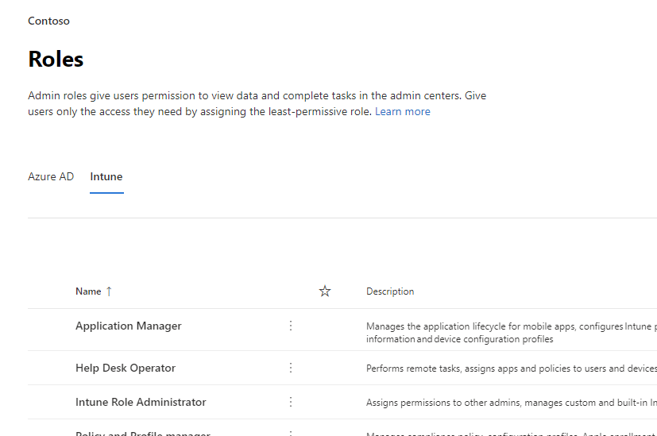
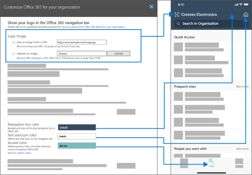

# Neues im Microsoft 365 Admin CenterWhat's new in the Microsoft 365 admin center

::: moniker range="o365-21vianet"

> [!NOTE]
> Einige der Informationen in diesem Artikel gelten möglicherweise nicht für Office 365, betrieben von 21Vianet.Some of the information in this article might not apply to Office 365 operated by 21Vianet.

::: moniker-end

Wir fügen ständig neue Features zum [Microsoft 365 Admin Center](https://docs.microsoft.com/microsoft-365/business-video/admin-center-overview)hinzu, beheben Probleme, die wir erfahren, und führen Änderungen basierend auf Ihrem Feedback durch.We're continuously adding new features to [the Microsoft 365 admin center](https://docs.microsoft.com/microsoft-365/business-video/admin-center-overview), fixing issues we learn about, and making changes based on your feedback. Unten können Sie sehen, was heute schon für Sie verfügbar ist.Take a look below to see what's available for you today. Einige Funktionen werden für unsere Kunden mit unterschiedlicher Geschwindigkeit bereitgestellt.Some features get rolled out at different speeds to our customers. Wenn sie noch kein Feature sehen, versuchen Sie, [sich der gezielten Version zu fügen.](manage/release-options-in-office-365.md)If you aren't seeing a feature yet, [try adding yourself to targeted release](manage/release-options-in-office-365.md).

Und wenn Sie wissen möchten, was mit anderen Microsoft-Clouddiensten neu ist:And if you'd like to know what's new with other Microsoft cloud services:

- [Neues in Azure Active DirectoryWhat's new in Azure Active Directory](/azure/active-directory/fundamentals/whats-new)
- [Neues im Exchange Admin CenterWhat's new in the Exchange admin center](/Exchange/whats-new)
- [Neuerungen in Microsoft IntuneWhat's new in Microsoft Intune](/mem/intune/fundamentals/whats-new)
- [Neuerungen im Microsoft 365 Compliance CenterWhat's new in the Microsoft 365 compliance center](/Office365/SecurityCompliance/whats-new)
- [Neuerungen in Microsoft 365 DefenderWhat's new in Microsoft 365 Defender](../security/mtp/whats-new.md)
- [Aktive Websites im SharePoint Online Admin CenterWhat's new in the SharePoint admin center](/sharepoint/what-s-new-in-admin-center)
- [Office-UpdatesOffice updates](/OfficeUpdates/)
- [Überprüfen der Windows-Release-IntegritätHow to check Windows release health](https://docs.microsoft.com/windows/deployment/update/check-release-health)

## April 2021April 2021

### Mobile Admin-AppAdmin mobile app

### Verwalten von Lizenzen und Rechnungen über die mobile Admin-AppManage licenses and bills from the Admin mobile app

- Sie können jetzt alle verfügbaren und zugewiesenen Lizenzen für Ihre Abonnements anzeigen.You can now view all available and assigned licenses for your subscriptions. Sie können Benutzern auch Lizenzen zuweisen oder nicht zuweisen und Lizenzen hinzufügen oder entfernen.You can also assign or un-assign licenses to users, and add or remove licenses.
- Sie können nun detaillierte Rechnungen in der App anzeigen.You can now view detailed invoices in the app.
- Diese Updates sind sowohl auf [Android-](https://go.microsoft.com/fwlink/p/?linkid=2159786) als auch [auf iOS-Geräten](https://go.microsoft.com/fwlink/p/?linkid=2159787) verfügbar.These updates are available on both [Android](https://go.microsoft.com/fwlink/p/?linkid=2159786) and [iOS](https://go.microsoft.com/fwlink/p/?linkid=2159787) devices.

:::image type="content" source="../media/assign-license-mobile-app2.png" alt-text="Screenshot: Administrator mobile App zuweisen Lizenzseite":::
:::image type="content" source="../media/license-screen-mobile-app2.png" alt-text="Screenshot: Bildschirm mobiler Apps für Administratoren mit Benutzern und deren Lizenzen":::
:::image type="content" source="../media/invoice-summary-mobile-app.png" alt-text="Screenshot: Zusammenfassungsseite der Verwaltungsrechnung für mobile Apps":::

### Aktualisierter Nachrichtencenterfeed in der mobilen Admin-AppUpdated Message center feed in the Admin mobile app

- Sie haben jetzt eine flexiblere Leseerfahrung des Nachrichtencenterfeeds.You now have a more flexible reading experience of the Message center feed. Sie haben jetzt die Möglichkeit, Nachrichten basierend auf Dienst- oder Tags zu filtern und Nachrichten als Favoriten zu markieren.You now have the ability to filter messages based on service or tags and mark messages as favorite. Es wurden auch Massenaktionen zum Markieren von Nachrichten als gelesen, ungelesen oder archiviert hinzugefügt.Bulk actions for marking messages as read, unread or archived has also been added.
- Diese Updates sind sowohl auf [Android-](https://go.microsoft.com/fwlink/p/?linkid=2159786) als auch [auf iOS-Geräten](https://go.microsoft.com/fwlink/p/?linkid=2159787) verfügbar.These updates are available on both [Android](https://go.microsoft.com/fwlink/p/?linkid=2159786) and [iOS](https://go.microsoft.com/fwlink/p/?linkid=2159787) devices.

:::image type="content" source="../media/mc-feed-mobile-app.png" alt-text="Screenshot: Admin mobile app Message center feed page":::

## Ignite 2021 (März)Ignite 2021 (March)

Willkommen bei Microsoft Ignite.Welcome to Microsoft Ignite. Wir hoffen, dass Sie an einigen unserer Sitzungen teilnehmen konnten: [Microsoft Ignite 2021](https://myignite.microsoft.com/sessions).We hope you were able to attend some of one of our sessions: [Microsoft Ignite 2021](https://myignite.microsoft.com/sessions). Hier sind einige der Dinge, über die wir bei Ignite gesprochen haben.Here's a few of the things we talked about at Ignite.
> [!NOTE]
> Nicht alle Features sind sofort für alle verfügbar.Not all features are going to be available to everyone right away. Wenn die neuen Features nicht zu sehen sind, schließen Sie [sich gezielter Version an.](manage/release-options-in-office-365.md)If you aren't seeing the new features, [join Targeted Release](manage/release-options-in-office-365.md).

### NachrichtencenterMessage center

Wir haben das Nachrichtencenter überarbeitet, um Ihnen bei der Entdeckung relevanter Nachrichten zu helfen und eine flexiblere Leseerfahrung hinzugefügt.We’ve revamped the Message center to help you discover relevant messages and added a more flexible reading experience. Wir haben eine neue Spalte **"Dienst"** hinzugefügt, mit der Sie überprüfen können, auf welchen Dienst eine Nachricht angewendet wird, und Nachrichten nach Dienst und anderen Metadaten filtern.We've added a new **Service** column to help you scan which Service a message applies to and filter messages by Service and other metadata. Sie können eine Nachricht als Favoriten markieren, um sie für die Nachsuche zu markieren, auswählen, welche Spalten in der Nachrichtenliste angezeigt werden, und zwischen Nachrichten mit den Schaltflächen "Zurück" und "Next" navigieren.You can favorite a message to mark it for follow up, choose which columns appear in the message list, and navigate between messages with the back and next buttons. Außerdem haben wir den Prozess verbessert, um feedback zu Nachrichtencenterbeiträgen zu vereinfachen.We've also improved the process to make it easier to give feedback on Message center posts.

:::image type="content" source="../media/message-center.png" alt-text="Screenshot: Startseite des Nachrichtencenters mit Posteingang und Nachrichten":::

Weitere Informationen zu den neuen Features finden Sie unter [Message Center](manage/message-center.md).To learn more about the new features, check out [Message center](manage/message-center.md).

### Neue FeaturesWhat's new features

Wir haben Verbesserungen bei der Anzeige der Features "Was ist neu" für Benutzer in den Office-Apps vorgenommen.We've made improvements to how you view the "What's new" features for users in the Office apps. Sie können nun den reichhaltigen Inhalt im neuen Bereich von Whats sehen, den Ihre Benutzer sehen können.You can now see the rich content in the Whats' new pane that your users can see. Sie können auch mehr über das Feature erfahren, bevor Sie ihre Benutzer über das Feature informieren möchten.You can also learn more about the feature before you decide to let your users know about the feature. Weitere Informationen finden Sie unter [Verwalten, welche Office-Features in What's New angezeigt werden.](manage/show-hide-new-features.md)For more info, check out [Manage which Office‎ features appear in What's New](manage/show-hide-new-features.md).

:::image type="content" source="../media/power-bi-whats-new2.png" alt-text="Screenshot: Neue Seite für Office-Apps mit Verbesserungen an Power BI":::

## Ignite 2020 (August & September)Ignite 2020 (August & September)

Willkommen bei Microsoft Ignite – unserem ersten nur online verwendeten Ignite-Produkt.Welcome to Microsoft Ignite - our first online-only Ignite. Wir hoffen, Sie in einer unserer Sitzungen zu sehen: [Microsoft Ignite 2020 Session Catalog](https://myignite.microsoft.com/sessions).We hope to see you in one of our sessions: [Microsoft Ignite 2020 Session Catalog](https://myignite.microsoft.com/sessions). Hier sind nur einige der Dinge, über die wir bei Ignite sprechen werden.Here's just a few of the things we'll be talking about at Ignite.
> [!NOTE]
> Nicht alle Features sind sofort für alle verfügbar.Not all features are going to be available to everyone right away. Wenn die neuen Features nicht zu sehen sind, schließen Sie [sich gezielter Version an.](manage/release-options-in-office-365.md)If you aren't seeing the new features, [join Targeted Release](manage/release-options-in-office-365.md).

### Verwaltung mit mehreren MandantenMulti-tenant management

Wir haben eine Reihe von Features für Mehr-Mandanten-Administratoren wie Sie entwickelt, um Ihre Arbeit schneller und effizienter erledigen zu können.We've developed a set of features for multi-tenant admins like you to get your job done faster and more efficiently. Weitere Informationen finden Sie unter [Manage multiple tenants](multi-tenant/manage.md).For more information, see [Manage multiple tenants](multi-tenant/manage.md).

- **Ihre Mandanten:** Wechseln Sie schnell zwischen den mandanten, die Sie verwalten.**Your tenants**: Quickly switch between the tenants you manage.
- **Alle** Mandanten: Eine neue Seite, auf der Sie schnell den Integritätszustand aller Mandantendienste, alle offenen Dienstanforderungen, Ihre Produkte und Abrechnung, empfohlene Einrichtungsaufgaben und die Anzahl der Benutzer in diesem Mandanten sehen können.**All tenants**: A new page where you can quickly see the health of all your tenants' services, any open service requests, your products and billing, recommended setup tasks, and the number of users in that tenant.
- **Setup**: Auf der Seite Mehr-Mandanten-Setup erhalten Sie eine Listenansicht der Setupseite, die jedoch für viele Mandanten organisiert ist.**Setup**: The multi-tenant Setup page gives you a list view of the Setup page, but organized for many tenants. Sie können sehen, welche Features nicht aktiviert sind, welche Aufgaben für alle Mandanten abgeschlossen sind, aufgaben, die Mandanten noch ausführen müssen.You can see which features aren't turned on, which tasks are complete for all tenants, tasks that tenants still need to complete. Diese Ansicht hilft Ihnen, die Einführung von Features nachverfolgt und sicherzustellen, dass die empfohlenen Sicherheitseinrichtungsaufgaben immer ausgeführt werden.This view will help you keep track of feature adoption and to make sure the recommended security setup tasks are always done.
- **Dienstinterat**: In der Dienstintegzustandsansicht wird angezeigt, ob sich Vorfälle oder Ratgeber auf die Mandanten ausdingen.**Service health**: The service health view shows you if any incidents or advisories are affecting the tenants. Sie erfahren sogar, wie viele Ihrer verwalteten Mandanten betroffen sind.It will even tell you how many of your managed tenants are affected. Wählen Sie einfach einen Vorfall aus, um weitere Informationen auf der Registerkarte Übersicht zu erhalten, und wechseln Sie dann zur Registerkarte Betroffene Mandanten, um einen Drilldown zu erhalten und diesen Mandanten zu unterstützen.Just select an incident to get more information on the overview tab, then switch over to the Tenants affected tab to drill down and support that tenant.
- **Mandantenübergreifende Postfachmigrationen** sind ein neuer Dienst, der jetzt in der öffentlichen Vorschau verfügbar ist, mit dem Sie Postfächer zwischen Mandanten verschieben können, ohne dass Sie Postfächer aus dem Offboard verschieben und dann onboarden müssen.**Cross-tenant mailbox migrations** is a new service, now in public preview, that lets you move mailboxes between tenants without the need to offboard and then onboard mailboxes. 
- **Mandantenübergreifende Domänenfreigabe:** In Kürze können Sie einer privaten Vorschau für Funktionen beitreten, mit denen Sie eine Domäne für mehrere Mandanten freigeben können.**Cross-tenant domain sharing**: Soon, you can join a private preview for capabilities that allow you to share a domain across multiple tenants. Wenn Contoso beispielsweise Wingtip Toys erwirbt, kann Contoso die Domäne mit Wingtip Toys teilen, sodass Personen in beiden Mandanten "contoso.com" als E-Mail-Adressen verwenden können.For example, if Contoso acquires Wingtip Toys, Contoso can share the domain with Wingtip Toys so that people in both tenants can use "contoso.com" as their email addresses.

### Überwachen Ihrer wichtigsten KontenMonitor your most important accounts

Sie können fehlgeschlagene oder verzögerte E-Mail-Nachrichten überwachen und nachverfolgen, die an Ihre Benutzer gesendet werden, die eine hohe geschäftliche Auswirkung haben, z. B. Ihren CEO.You can monitor and track failed or delayed email messages sent to your users who have a high business impact, like your CEO. Sie verfolgen Prioritätskonten, indem Sie Benutzer zu Ihrer Prioritätskontenliste im Microsoft 365 Admin Center hinzufügen.You track priority accounts by adding users to your priority accounts list in the Microsoft 365 admin center. Fügen Sie Führungskräfte, Führungskräfte, Manager oder andere Benutzer hinzu, die Zugriff auf vertrauliche Informationen oder Informationen mit hoher Priorität haben.Add executives, leaders, managers, or other users who have access to sensitive or high priority information.

Prioritätskonten sind nur für Organisationen verfügbar, die beide der folgenden Anforderungen erfüllen:Priority accounts are only available to organizations that meet both of the following requirements:

- Office 365 E3 oder Microsoft 365 E3 oder Office 365 E5 oder Microsoft 365 E5.Office 365 E3 or Microsoft 365 E3, or Office 365 E5 or Microsoft 365 E5.
- Mindestens 10.000 Lizenzen und mindestens 50 aktive Exchange Online-Benutzer monatlich.At least 10,000 licenses and at least 50 monthly active Exchange Online users.

Es gibt zwei Möglichkeiten, um zu beginnen:There are two ways to get started:

- Wechseln Sie **zu Benutzer,** und wählen Sie  dann im Menü "Weitere Aktionen" Die Option Prioritätskonten verwalten aus, um der Liste Benutzer hinzuzufügen.Go to **Users**, and then in the "more actions" menu select **Manage priority accounts** to add users to the list.
- Wechseln Sie **zu Setup,** suchen Sie die Setupaufgabe Überwachen Der wichtigsten **Konten,** und wählen Sie **dann Erste Schritte aus.**Go to **Setup**, find the setup task **Monitor your most important accounts**, and then select **Get started**.

Weitere Informationen zu Prioritätskonten finden Sie unter [Monitoring priority accounts](./setup/priority-accounts.md).For more info on priority accounts, check out [Monitoring priority accounts](./setup/priority-accounts.md).

### Schneller suchen und bessere Ergebnisse von jeder Seite erhaltenSearch faster and get better results from any page

Wir haben damit begonnen, eine neue Sucherfahrung für das Admin Center zu starten, und wir können nicht warten, bis Sie es ausprobieren. Alt+S to search from any page.](../media/MAC-WN-GlobalSearch.png)

- Das Suchfeld wurde in den Kopfzeilenbereich verschoben, in dem "Microsoft 365 Admin Center" steht, sodass Sie nun von einer beliebigen Seite suchen, nicht nur von der Homepage.The Search box moved to the header area where it says "Microsoft 365 admin center" so you now search from any page, not just the Home page. Wir haben sogar eine Verknüpfung: **Alt+S**.We've even got a shortcut: **Alt+S**.
- Die Suche ist intelligenter und führt zu besseren Ergebnissen, noch schneller.Search is smarter and will give you better results, even faster. Geben Sie "2fa" ein, um zu beginnen.Try typing "2fa" to get started.
- Die Suchergebnisse sind nach dem Typ des Elements oder der Aktion organisiert, die Sie ergreifen können.Search results are organized by the type of item or action you can take.
  - **Benutzer**: Wählen Sie den Namen des Benutzers aus, und Sie können diesen Benutzer direkt dort bearbeiten.**Users**: Select the user's name and you can edit that user right there. Wenn Sie das Menü "Weitere Aktionen" neben ihrem Namen auswählen, können Sie ihr Kennwort zurücksetzen.If you select the "more actions" menu next to their name, you can reset their password. Sie können nach Anzeigename, Nachname, Vorname, Benutzername oder primäre E-Mail-Adresse und E-Mail-Aliasen suchen.You can search by display name, last name, first name, username or primary email address, and email aliases. Um jedoch eine genaue Übereinstimmung zu erhalten, suchen Sie nach der primären E-Mail-Adresse oder dem Benutzernamen.But to get an exact match, search by primary email address or username.
  - **Gruppen**: Bearbeiten Sie die Gruppe auf einer beliebigen Seite, fügen Sie Mitglieder hinzu, weisen Sie Besitzer zu.**Groups**: Edit the group from any page, add members, assign owners.
  - **Aktionen**: Ähnlich wie Sie nach einem Benutzer suchen und dann sein Kennwort zurücksetzen können, können Sie auch auf jeder Seite nach "Kennwort zurücksetzen" suchen und dann ein oder mehrere Kennwörter für Benutzer zurücksetzen.**Actions**: Similar to how you can search for a user and then reset their password, you can also search "reset password" from any page and then reset one or more passwords for users.
  - **Navigation:** Ergebnisse unter Navigation können Ihnen schnell helfen, schnell zu einer Seite im Admin Center zu gelangen.**Navigation**: Results under Navigation can quickly help you get to a page in the admin center quickly. Wenn Sie beispielsweise nach "Rollen" suchen, gelangen Sie zur Seite Rollen für Azure AD-Rollen.For example, searching "roles" will take you to the Roles page for Azure AD roles.
  - **Einstellungen**: Suchen Sie nach allen Einstellungen im Zusammenhang mit Ihrer Organisation, den von Ihnen abonnierten Diensten sowie Sicherheits- und Datenschutzeinstellungen.**Settings**: Search for any setting related to your organization, the services you subscribe to, and security and privacy settings. 
  - **Domänen**: Sie finden schnelle Links zu Ihren Domänen, und dann gelangen Sie über den Link zur Seite Übersicht und Integrität dieser Domäne.**Domains**: You can find quick links to your domains, and then the link will take you to that domain's Overview and health page.
  - **Dokumentation**: Wenn wir kein Ergebnis für Sie finden, versuchen wir, eine Dokumentation zu finden, die Ihnen hilft.**Documentation**: If we can't find a result for you, we'll try to find some documentation to help. Es dauert etwas länger, bis die kuratierte Liste der Artikel eine Übereinstimmung findet. Warten Sie also eine Sekunde, bis die Suche die Ergebnisse finden kann.It takes a little longer for the curated list of articles to find a match, so wait a second to let Search find the results. 
  - **Feedback**: Sie haben nicht nach dem gesuchten Gesuchten gesucht?**Feedback**: Didn't find what you were looking for? Senden Sie uns Feedback von der Suche.Send us feedback from Search. Wir fügen Suchfunktionen für weitere Seiten und weitere Features im Admin Center hinzu.We will add searching functionality for more pages and more features across the admin center.

### Mobile Microsoft 365 Admin AppMicrosoft 365 admin mobile app

Mit der [mobilen Microsoft 365 Admin-App,](https://www.microsoft.com/microsoft-365/business/manage-office-365-admin-app)die in Ihrem Abonnement enthalten ist, können Sie Microsoft 365 von Ihrem mobilen Gerät aus verwalten, damit Sie von Ihrem Schreibtisch weg können, um täglich Aufgaben auszuführen.The [Microsoft 365 admin mobile app](https://www.microsoft.com/microsoft-365/business/manage-office-365-admin-app), which is included with your subscription, lets you manage Microsoft 365 from your mobile device so you can get away from your desk to do every day tasks. Tatsächlich gibt es mehr als 90 Features in der App - und wir haben nur ein paar weitere hinzugefügt:In fact, there are over 90 features in the app--and we just added a few more:

- Unterstützung für die Richtlinien für mobile Anwendungsverwaltung und bedingten Zugriff von **Microsoft Intune:** Sie können nun Ihr persönliches Gerät verwenden, um Microsoft 365 zu verwalten, auch wenn Ihre Organisation die Richtlinien für mobile Anwendungsverwaltung und bedingten Zugriff von Intune aktiviert hat.**Support for Microsoft Intune's Mobile Application Management and Conditional Access policies**: You can now use your personal device to manage Microsoft 365 even if your org has turned on Intune's Mobile Application Management and conditional access policies.
- **Nachrichtencenterbenachrichtigungen:** Aktivieren Sie Nachrichtencenterbenachrichtigungen unter Einstellungsbenachrichtigungen, wenn Sie über neue Nachrichtencenterbeiträge   >   benachrichtigt werden möchten.**Message center notifications**: Turn on message center notifications at **Settings** > **Notifications** if you wish to be alerted about new message center posts. Durch Benachrichtigungen möchten wir sicherstellen, dass Sie über wichtige Informationen und Ereignisse in Ihrem Mandanten auf dem Laufenden bleiben.Through notifications, we want to ensure you stay informed about important information and events across your tenant.
- **Abrechnungswarnungen:** Sie können Abrechnungsbenachrichtigungen auch unter Einstellungsbenachrichtigungen aktivieren, wenn Sie Abrechnungsbenachrichtigungen auf Ihrem Gerät erhalten möchten, wenn ein Abonnement   >   bald abläuft.**Billing alerts**: You can also turn on billing notifications at **Settings** > **Notifications** if you want to get billing notifications on your device if a subscription is about to expire.
- **Dunkler Modus:** Willkommen auf der dunklen Seite der mobilen App.**Dark mode**: Welcome to the dark side of the mobile app. Dies war eine der am häufigsten angeforderten Features.This was one of our most requested features. Wechseln Sie zu **Einstellungen**  >  **Designs,** um sie zu aktivieren.Go to **Settings** > **Themes** to turn it on.
- **Problem melden:** Sie können nun ein Problem in der App melden oder probleme anzeigen, die von anderen Administratoren gemeldet wurden.**Report an issue**: You can now report an issue in the app or view issues reported by other admins. Besuchen **Sie den Dienstzustand,** um ihn zu überprüfen.Visit **Service health** to check it out.

### Verwendungsempfehlungen für kleine und mittelständische UnternehmenUsage recommendations for small and medium businesses

Kleine und mittelständische Unternehmen erhalten möglicherweise eine Empfehlung auf der **Startseite,** wenn einige Personen in der Organisation Teams, OneDrive oder #A0 nicht aktiv verwenden.Small and medium businesses might get a recommendation on the **Home** page if some of the people in the org aren't actively using Teams, OneDrive, or Office apps. Wenn Sie die Empfehlung anzeigen, können Sie schnell eine Microsoft-Schulung an inaktive Benutzer senden, um ihnen zu helfen, mit der App zu beginnen und sicherzustellen, dass Sie den vollen Nutzen aus Ihren Abonnements erhalten.When you view the recommendation, you can quickly email Microsoft training to inactive users to help them get started with the app and to make sure you are getting the full value from your subscriptions.

### RemotearbeitssammlungRemote work collection

Im Oktober fügen wir eine Remotearbeitssammlung hinzu, um Kleinunternehmensbesitzern und ihren Mitarbeitern zu helfen, remote online zu arbeiten und zu arbeiten.In October, we'll be adding a remote work collection to help small business owners and their staff get online and working remotely.  **Remote work essentials** setup is a curated list of all features Microsoft recommends to securely enable remote work and to collaborate effectively.**Remote work essentials** setup is a curated list of all features Microsoft recommends to securely enable remote work and to collaborate effectively. In ein paar Wochen können Sie es unter **Setup Remote**  >  **work essentials ausprobieren.**In a couple of weeks, you can try it out in **Setup** > **Remote work essentials**.

Weitere Informationen zum sicheren Zulassen von Remotearbeit und einer praktischen Webadresse, die leicht zu merken und zu teilen ist, finden Sie unter [aka.ms/remote-business](https://aka.ms/remote-business).For more information about how to securely allow remote work and a handy web address that's easy to remember and share, go to [aka.ms/remote-business](https://aka.ms/remote-business).

### Benötigen Sie Hilfe? Wechsel zu weiteren Admin CenternNeed help? moving to more admin centers

Wir sehen uns die Inhalte und Tools kontinuierlich an und aktualisieren sie, um mit den Änderungen am Produkt mithalten zu können.We're continuously looking at and updating the content and tools to keep up with changes in the product. Wir verfügen jetzt über viele weitere self-serve-Diagnosetools, mit deren Hilfe Sie Probleme schnell und effizient beheben können.We now have many more self-serve diagnostic tools to help you resolve issues quickly and efficiently. Hier sind einige, die kürzlich hinzugefügt wurden:Here are a few that were recently added:

- Ändern der Einschränkungsrichtlinie für den Exchange-WebdienstChange your Exchange Web Service throttling policy
- Überprüfen des Status der Bereitstellung und Überprüfung von Teams für bestimmte BenutzerChecking status of Teams provisioning and validation to specific users
- Beheben von DkIM-SetupproblemenFix DKIM setup issues
- Diagnostizieren von Intune-BenutzerregistrierungsfehlernDiagnose Intune user enrollment errors

Und wir bieten die neue und verbesserte Supporterfahrung, die Sie bereits im Microsoft 365 Admin Center sehen, für einige der anderen Admin Center an.And we are rolling out the new and improved support experience you already see in the Microsoft 365 admin center to some of the other admin centers. Teams Admin Center und Security and Compliance Admin Center verfügen bereits über diese neue Erfahrung.Teams Admin Center and Security and Compliance Admin Centers already have this new experience. Und bald werden **Exchange Admin Center,** **SharePoint Admin Center** und **Office.com** zusammen mit dieser neuen Hilfeerfahrung für Administratoren aktualisiert.And soon, **Exchange admin center**, **SharePoint admin center**, and **Office.com** will be updated along with this new help experience for admins.

### Verwalten von Änderungen mit Microsoft PlannerManage changes with Microsoft Planner

Im Mai haben wir angekündigt, dass Sie Nachrichtencenterbeiträge bald mit Microsoft Planner synchronisieren können und jetzt für alle Benutzer verfügbar sind.In May, we announced that you'll soon be able to sync Message center posts to Microsoft Planner and now it's available for everyone to use.  Sie können jetzt Aufgaben aus Nachrichten erstellen, diese zuweisen und bis zum Abschluss nachverfolgen.You can now create tasks from messages, assign them, and track them to completion. Wenn Sie zum ersten Mal **planner syncing** auswählen, müssen Sie eine Verbindung mit dem entsprechenden Plan herstellen.The first time, you select **Planner syncing** you'll need to connect to the appropriate plan.

Weitere Informationen dazu finden Sie in diesem Artikel und Video, um zu sehen, wie es funktioniert: [Nachverfolgen Ihrer Nachrichtencenterbeiträge in Planner](/Office365/Planner/track-message-center-tasks-planner)To learn more about it, check out this article and video to see how it works: [Track your message center posts in Planner](/Office365/Planner/track-message-center-tasks-planner)

### Dokumentation, Schulungen und VideosDocumentation, Training, and Videos

- Brand new and just in time for Microsoft Ignite-[The Virtual Hub](https://adoption.microsoft.com/virtual-hub/).Brand new and just in time for Microsoft Ignite--[The Virtual Hub](https://adoption.microsoft.com/virtual-hub/). Tiefe Eintauchen in technische Schulungen für IT-Profis und Entwickler.Deep dive into technical training for IT pros and developers. Finden Sie schnell ca. 20 neue Videos im Rahmen #SIDETRACKED, dem Namen des Ignite-Admintracks in diesem Jahr.Quickly find around 20 new videos as part of #SIDETRACKED, the name of the Ignite admin track this year.
- Neues bei [Microsoft 365-Videoserien:](https://www.youtube.com/watch?v=OVjb2lGJ4GU&t=2s) In diesem Monat werden neue Features in Whiteboard für Teams und im Web, die Automatisierung der Benutzerbereitstellung in Azure AD, neue Power Automate-Trigger und -Aktionen in Teams und vieles mehr zur Verfügung stehen.[What's new with Microsoft 365](https://www.youtube.com/watch?v=OVjb2lGJ4GU&t=2s) video series: This month, we cover new features available in Whiteboard for Teams and on the web, how to automate user provisioning to Azure AD, new Power Automate triggers and actions in Teams, and more. Bleiben Sie dran für den nächsten Monat, in dem wir eine Zusammenfassung aller großartigen Ereignisse in Ignite erhalten.And stay tuned for next month, where we'll have a recap of all the great things happening at Ignite!
- Wir haben die Microsoft [365-Dokumentationsseite](/microsoft-365) neu gestaltet, die sich zuerst auf Lösungen konzentriert.We did a redesign of the [Microsoft 365 documentation](/microsoft-365) page that focuses on solutions first. Wir werden neue Lösungen hervorheben, sobald sie auf dieser Seite verfügbar sind, um ein Auge zu behalten.We'll highlight new solutions as they become available on this page, so keep an eye out.

## Juli 2020July 2020

### Bereiten Sie sich auf Ignite 2020 vorGetting ready for Ignite 2020

Während wir bei Microsoft in die Ignite-Staffel einstarten, veröffentlichen wir nicht so viele Features, sodass wir während unserer Sitzungen viel zu tun haben.As we're moving into Ignite season at Microsoft, we're not releasing as many features so that we have a lot to talk about during our sessions.

Das nächste Update zu diesem Artikel finden Sie am Tag der Ersten Online-Ignite.The next update to this article will be on opening day of our first online-only Ignite. Und in diesem Jahr ist die Teilnahme kostenlos.And this year, it is free to attend! Check it out, get signed up: [Microsoft Ignite 2020](https://www.microsoft.com/ignite).Check it out, get signed up: [Microsoft Ignite 2020](https://www.microsoft.com/ignite).

### Ihre ProdukteYour products

Es wurde viel Arbeit in der Abonnementsverwaltung ausgeführt, um die Seite schneller zu laden, schneller zu finden, was Sie suchen, und um die Webbarrierefreiheitsstandards zu erfüllen ([WCAG 2.1-Richtlinien](http://www.w3.org/TR/WCAG21/)).There has been a lot of work done in the subscriptions management to make the page faster to load, faster to find what you're looking for, and to meet the web accessibility standards ([WCAG 2.1 guidelines](http://www.w3.org/TR/WCAG21/)).

- **Neugestaltung der** Tabelle: Die Tabelle wurde neu gestaltet, sodass Sie ähnliche Abonnements gruppieren können.**Table redesign**: The table was redesigned so that you can group similar subscriptions. Wechseln Sie zu **Abrechnung**  >  **Ihrer Produkte**.Go to **Billing** > **Your products**.
- **Produktdetails:** Erhalten Sie mehr Details zu Ihren Abonnements als je zuvor, indem Sie das Produkt in der Liste auswählen.**Product details**: Get more details than ever about your subscriptions by selecting the product in the list.
- **Machen Sie alles von hier** aus : Und Sie müssen nicht mehrere Seiten umspringen, um ein Produkt zu verwalten.**Do it all from here**: And you don't have to go to jump around several pages to manage one product. Wenn Sie beispielsweise ein Abonnement kündigen müssen, wird der Bereich geöffnet, um die Aktion direkt dort zu tun.For example, if you need to cancel a subscription, the panel will open to do the action right there.

### DomänenDomains

Die Domänenverwaltung kann kompliziert sein, und wir haben ein neues Feature veröffentlicht, um dies zu vereinfachen.Domain management can be complicated, and we've released a new feature to make that easier. Wechseln Sie zu Einstellungen > Domänen, und wählen Sie dann eine Domäne aus, um weitere Informationen zu Ihrer Domäne und zur Integrität der Domäne zu erhalten.Go to Settings > Domains and then select a domain to get more information about your domain and the domain's health.

:::image type="content" source="../media/MAC-WN-DomainDNS.PNG" alt-text="Seite &quot;Domänendetails&quot; für contoso.com":::

### Dokumente, Schulungen und Videos (Juli 2020)Docs, training, and videos (July 2020)

Neues bei [Microsoft 365-Videoserien:](https://youtu.be/m1Nu8WJgCDY) In diesem Monat wird die neue Yammer-Erfahrung für Web und Mobile, die Integration der Yammer-Community-App für Microsoft Teams, neue Richtlinienpakete zur Unterstützung von Firstline-Mitarbeitern und -Managern und vieles mehr.[What's new with Microsoft 365](https://youtu.be/m1Nu8WJgCDY) video series: This month, we cover the new Yammer experience for web and mobile, how to integrate the Yammer Communities app for Microsoft Teams, new policy packages to support Firstline Workers and managers, and more.

## Juni 2020June 2020

### Mit Office What's New Management im Einklang bleibenKeeping up with Office What's New management

Vor ein paar Monaten haben wir eine Einstellung hinzugefügt, mit der Sie die Neuen Nachrichten verwalten können, die in den Office-Apps eines Benutzers angezeigt werden.A few months ago, we added a setting that lets you manage the What's New messages that show up in a user's Office apps. In diesem Monat haben wir eine neue Homepagekarte veröffentlicht, mit  der Sie schnell handeln und die Neuen Nachrichten nachverfolgen können, die Den Benutzern in Ihrer Organisation angezeigt werden sollen.This month, we released a new Home page card that will help you act quickly and keep track of the **What's New** messages that you want shown to the users in your organization.

### Dokumente, Schulungen und Videos (Juni)Docs, training, and videos (June)

- [Erste Schritte mit TeamsGetting started with Teams](../business-video/get-started-teams-small-business.md)

## Mai 2020May 2020

### Neuer Updatekanal für OfficeNew update channel for Office

Am 12. Mai haben wir die Verfügbarkeit eines neuen Updatekanals für Office: Monthly Enterprise Channel angekündigt.On May 12, we announced the availability of a new update channel for Office:  Monthly Enterprise Channel. Dieser Updatekanal stellt Ihren Benutzern einmal im Monat, am zweiten Dienstag des Monats, neue Office-Features zur Verfügung.This update channel provides your users with new Office features once a month, on the second Tuesday of the month.

Wenn Sie Ihren Benutzern erlauben, Office über das Portal selbst zu installieren, können Sie monatlicher Unternehmenskanal für sie auswählen.If you allow your users to self-install Office from the portal, you can select Monthly Enterprise Channel for them. Melden Sie sich dazu beim Microsoft 365 Admin Center an, und wechseln Sie zu **Anzeigen** aller Einstellungen  >   >  **Organisationseinstellungen**  >  **Dienste**  >  **Office-Software-Downloadeinstellungen**.To do this, sign in to the Microsoft 365 admin center and go to **Show all** >**Settings** > **Org settings** > **Services** > **Office software download settings**. Wenn Sie **Einmal im Monat (Monatlicher Unternehmenskanal)** auswählen, werden alle neuen Selbstinstallationen von Office für die Verwendung des monatlichen Unternehmenskanals konfiguriert.If you select **Once a month (Monthly Enterprise Channel)**, then any new self-installs of Office will be configured to use Monthly Enterprise Channel.

In Verbindung mit der Veröffentlichung von Monthly Enterprise Channel werden auch die Namen der vorhandenen Updatekanäle überarbeitet.In conjunction with the release of Monthly Enterprise Channel, we’re also revising the names of the existing update channels. Beispielsweise wird monatlicher Kanal in Aktueller Kanal umbenannt.For example, Monthly Channel is being renamed to Current Channel. Die neuen Namen werden am 9. Juni 2020 wirksam.The new names take effect on June 9, 2020.

Weitere Informationen finden Sie unter [Änderungen an den Updatekanälen für Microsoft 365 Apps](/DeployOffice/update-channels-changes).For more information, see [Changes to update channels for Microsoft 365 Apps](/DeployOffice/update-channels-changes).

### Neue AdministratorrollenNew admin roles

Wir haben einige neue Azure Active Directory-Administratorrollen zum Microsoft 365 Admin Center hinzugefügt.We've added some new Azure Active Directory admin roles to the Microsoft 365 admin center.

- Die Administratorrolle für Hybrididentität gibt Benutzern die Berechtigung zum Verwalten von Cloudbereitstellungs- und Authentifizierungsdiensten.Hybrid identity admin role gives users permission to manage cloud provisioning and authentication services.
- Mit der Netzwerkadministratorrolle können Benutzer Netzwerkstandorte verwalten und Netzwerkeinblicke für Microsoft 365 Software as a Service-Apps überprüfen.Network admin role lets users manage network locations and review network insights for Microsoft 365 Software as a Service apps.
- Die Rolle des Druckeradministrators erteilt die Berechtigung zum Verwalten aller Aspekte von Druckern und Druckerverbindungen.Printer admin role grants permission to manage all aspects of printers and printer connections.
- Druckertechniker ist eine Teilmenge der Administratorrolle Drucker, in der diese Benutzer Drucker registrieren und aufheben und den Druckerstatus aktualisieren können.Printer technician is a subset of the Printer admin role where those users can register and unregister printers, and update printer status.
Weitere Informationen zu diesen Rollen finden Sie unter [Informationen zu Administratorrollen](./add-users/about-admin-roles.md).To find out more about these roles, see [About admin roles](./add-users/about-admin-roles.md).

### Liste der ExportgruppenExport groups list

Wir haben von vielen Administratoren gehört, dass sie Informationen zu Gruppen und deren Verwendung an Personen freigeben müssen, die keinen Zugriff auf die Admin Center haben.We've heard from a lot of admins that they need to share information about groups and their usage to people who don't have access to the admin centers. Sie können nun die Gruppenliste zu Überwachungszwecken in eine CSV-Datei exportieren, was bedeutet, dass Sie das alte PowerShell-Skript auswerfen können.You can now export the Groups list to a CSV file for auditing purposes, which means you can throw out that old PowerShell script. Um es auszuprobieren, wechseln Sie zu **Gruppen**  >  **Gruppen,** und wählen Sie **dann Gruppen exportieren in** der Befehlsleiste aus.To try it out, go to **Groups** > **Groups**, and then select **Export groups** from the command bar.

### Microsoft 365-Center – Lösungen und ArchitekturenMicrosoft 365 solution and architecture center

Erst in diesem Monat haben wir eine neue Website mit dem Namen [https://docs.microsoft.com]() [Microsoft 365 Solution and Architecture Center](../solutions/index.yml)veröffentlicht, die die technischen Anleitungen zusammen bringt, die Sie benötigen, um integrierte Microsoft 365-Lösungen für eine sichere und konforme Zusammenarbeit zu verstehen, zu planen und zu implementieren.Just this month, we released a new site on [https://docs.microsoft.com]() called the [Microsoft 365 solution and architecture center](../solutions/index.yml), which brings together the technical guidance you need to understand, plan, and implement integrated Microsoft 365 solutions for secure and compliant collaboration. In diesem Center finden Sie:In this center, you'll find:

- Leitfaden für foundationale LösungenFoundational solution guidance
- Arbeitsauslastungslösungen und SzenarioanleitungenWorkload solutions and scenario guidance
- Illustrationen für Lösung und Architektur (Poster!!!)Solution and architecture illustrations (The posters!!!)
- Branchenspezifische AnleitungenIndustry specific guidance
- Entwurfsprinzipale der UnternehmensarchitekturEnterprise architecture design principals

### Dokumente, Schulungen und Videos (Mai)Docs, training, and videos (May)

- Neues in **der Microsoft 365-Videoreihe:** In diesem Monat werden die neue Supporterfahrung in den Teams Admin and Security and Compliance Center, die Planner-Integration in das Message Center und das neue 3x3-Videolayout in Microsoft Teams themat.**What's new in Microsoft 365 video series**: This month, we cover the new support experience in the Teams admin and Security and Compliance Centers, Planner integration with the Message Center, and the new 3x3 video layout in Microsoft Teams. 
- Die [Hilfehubseite des Microsoft 365 Admin Center](./index.yml) wurde aktualisiert, um Schneller zu finden, was Sie benötigen.The [Microsoft 365 admin center help](./index.yml) hub page was updated to help you find what you need more quickly. Und wenn Sie diese Seite jetzt betrachten, haben wir eine Karte hinzugefügt, um Sie über wichtige Updates und Änderungen zu informieren.And if you go look at that page right now, we've added a card to inform you of important updates and changes.

## April 2020April 2020

### Verwaltung von Intune-RollenIntune roles management

[April 2020April 2020](#april-2020)

Nun, wir haben es getan!Well, we did it! Wir haben den zweiten Schritt zu einer einheitlichen Rollenerfahrung gemacht, und Sie können jetzt Intune-Rollen im Microsoft 365 Admin Center verwalten.We've taken the second step towards a unified roles experience and you can now manage Intune roles in the Microsoft 365 admin center. Sie können auch Features nutzen, z. B. die Möglichkeit, nach Rollen zu suchen und Rollenberechtigungen anzeigen.You can also leverage features such as the ability to search for roles and view role permissions. Dies bedeutet, dass Sie keine zwei separaten Tools zum Verwalten von Rollen für Microsoft 365 und Intune benötigen.This means you don’t need two separate tools to manage roles for Microsoft 365 and Intune. Wenn Sie sich beim Microsoft 365 Admin Center anmelden, werden Sie sehen, dass es zwei Pivots auf der Seite Rollen gibt, eines für Azure AD und eines für Intune.When you sign into the Microsoft 365 admin center, you’ll see that there are two pivots on the Roles page, one for Azure AD and one for Intune.

### Synchronisieren von Nachrichtencenterbeiträgen mit PlannerSync Message Center posts to Planner

Ab Mai sehen Administratoren, die sich in der gezielten Veröffentlichung befinden, die Schaltfläche "Planner syncing" im Nachrichtencenter.Starting in May, admins who are in Targeted release will start seeing the "Planner syncing" button in the message center. Sie können nun Nachrichten nachverfolgen, die Eine Aktion erfordern, den Typ der Nachrichten auswählen, die Sie nachverfolgen möchten, Nachrichten zuweisen, die als Aufgaben nachverfolgt werden sollen, und Nachrichten für eine spätere Aufmerksamkeit markieren.You can now track messages that need action, select the type of messages you'd like to track, assign messages to track as tasks, and tag messages for later attention.

[Nehmen Sie an der gezielten Veröffentlichung](manage/release-options-in-office-365.md) teil, um die ersten Schritte zu starten![Join Targeted Release](manage/release-options-in-office-365.md) to get started!

### "Benötigen Sie Hilfe?""Need help?" gestartet in Teams Admin Center & Security and Compliance Centerlaunched in Teams admin center & Security and Compliance centers

Das Teams Admin Center, das Security Center und das Compliance Center verwenden jetzt dasselbe "Benötigen Sie Hilfe?"The Teams admin center, Security center, and Compliance center are now using the same "Need help?" Funktion, die das Microsoft 365 Admin Center zum Suchen von Hilfe und zum Kontaktieren des Support verwendet.feature that the Microsoft 365 admin center uses for finding help and contacting support. Wir haben viel Feedback von Administratoren erhalten, dass Sie die gleiche Hilfe und Unterstützung haben wollten, und wir freuen uns, Ihnen dies zu bieten.We've received a lot of feedback from admins that you wanted the same level of help and support and we're happy to bring that to you. Probieren Sie es aus, und geben Sie uns Ihr Feedback!Try it out and give us your feedback!

#### Benötigen Sie Chat?Need chat?

Unsere Supportmitarbeiter arbeiten von zu Hause aus, während kundenspezifische Fälle und Einschränkungen der Internetbandbreite während der Arbeit von zu Hause aus weiterhin auf die Qualität von Kundenanrufen einflusst.Our support agents have been working from home while still taking customer cases and limitations on internet bandwidth while working from home can impact customer call quality. Um Sie weiterhin zu unterstützen, haben wir die Supportoption für Livechats für kommerzielle Kunden im Microsoft 365 Admin Center gestartet.In order to continue supporting you, we have launched live chat support option for commercial customers in the Microsoft 365 admin center.

Beim Erstellen einer Dienstanforderung wird neben Telefon und E-Mail nun auch Chat als Option angezeigt.While creating a service request, you'll now see chat as an option, in addition to phone and email. Wählen Sie Chat als bevorzugten Kommunikationskanal aus, und erstellen Sie die Anforderung.Select chat as a preferred channel of communication and create the request. Nachdem Sie die Anforderung erstellt haben, können Sie den Chat starten, wenn Sie bereit sind, mit Microsoft-Agents zu chatten.Once you've created the  request, you can start the chat when you are ready to chat with Microsoft agents.

### Teams-UpdatesTeams updates

Mit der zunehmenden Nutzung von Teams haben wir einige Features hinzugefügt, mit deren Hilfe Sie diese verwalten können.With the increased usage of Teams, we've added a few features to help you manage them.

- Eine neue Empfehlungskarte auf der Admin Center-Homepage zeigt, welche Benutzer Teams seit 30 Tagen nicht aktiv verwendet haben.A new recommendation card on the admin center Home page shows which users have not actively used Teams for 30 days. Sie können diesen Benutzern eine Schulungs-E-Mail senden, um sie mit Teams zu beginnen.You can send those users a training email to get them started using Teams.
- **Personen mit** Teams zusammenbringen: Wechseln Sie zu **Setup,** um eine neue Seite zu sehen, auf der Sie Teams für lizenzierte Benutzer aktivieren und Gastzugriff zulassen können, damit Sie mit externen Kunden in Teams zusammenarbeiten können.**Bring people together with teams**: Go to **Setup** to see a new page to help you turn on Teams for licensed users and allow guest access, so you can work with external customers in Teams.
- Eine Microsoft Teams-Karte wird jetzt standardmäßig an Ihre Homepage angeheftet.A Microsoft Teams card is now pinned by default to your Home page. Es wird gezeigt, ob Teams aktiviert ist und ob Gastzugriff zulässig ist.It shows whether Teams is turned on, and if guest access is allowed. Außerdem können Sie den Setupstatus für neu lizenzierte Teams-Benutzer überprüfen und überprüfen, ob Netzwerkprobleme Auswirkungen auf Teams-Benutzer haben können.It also allows you to check the setup status for newly licensed Teams users, and check if network issues might be impacting Teams users.
- Schließlich ist Teams nun ein Schritt im anfänglichen Einrichtungsfluss, wenn Sie eine Lizenz erworben haben, die Teams enthält.Finally, Teams is now a step in the initial set up flow if you purchased a license that includes Teams.

### ProduktivitätsergebnisProductivity score

Die Produktivitätswertung gibt Einblicke in die Nutzung von Microsoft-Clouddiensten und die Technologieerfahrungen, die sie unterstützen.Productivity Score gives insights about how people use Microsoft cloud services and the technology experiences that support them. Die Bewertung spiegelt die Leistung Ihrer Organisation im Vergleich zu Denk- und Technologieerfahrungsmaßnahmen ihrer Organisation wider und vergleicht Ihre Bewertung mit Organisationen wie Ihrer.The score reflects your organization’s performance against employee and technology experience measures and compares your score with organizations like yours. In diesem Monat stellen wir die folgenden neuen Konzepte für die Vorschau vor:This month, we are introducing the following new concepts to the preview experience:

- Trendansicht der primären Einblicke auf Startseiten- und Kategoriedetailseiten -Kategorien endpoint Analytics und Network Connectivity, die der Technologieerfahrung hinzugefügt wurdenTrend view of primary insights on home page and category detail pages -Endpoint Analytics and Network Connectivity categories added to Technology Experience
- Relevante Einblicke in die Technologieerfahrung, die in den Kategorien "Mitarbeitererfahrung" angezeigt werdenRelevant Technology Experience insight shown in Employee Experience categories
- Neue Kommunikationskategorie als Teil der MitarbeitererfahrungNew Communications category as part of Employee Experience
- Benutzerdetails mit Organisationsmetadaten in Den Kategorien "Mitarbeitererfahrung"User details with organizational metadata in Employee Experience categories

Weitere Informationen finden Sie im Blog: Messen und Verbessern der [Microsoft 365-Erfahrung mit Microsoft Productivity Score](https://techcommunity.microsoft.com/t5/microsoft-365-blog/measure-and-improve-the-microsoft-365-experience-with-microsoft/ba-p/1348618).If you'd like to learn more, check out the blog: [Measure and improve the Microsoft 365 experience with Microsoft Productivity Score](https://techcommunity.microsoft.com/t5/microsoft-365-blog/measure-and-improve-the-microsoft-365-experience-with-microsoft/ba-p/1348618). Die Produktivitätsnote befindet sich derzeit in der privaten Vorschau.Productivity score is currently in private preview. [Schließen Sie sich der privaten Vorschau der Produktivitätswertung an,](https://aka.ms/productivityscorepreview) um die ersten Schritte zu starten.[Join the Productivity score private preview](https://aka.ms/productivityscorepreview) to get started.

### GruppenupdatesGroups updates

Wir haben in diesem Monat zwei Updates für Gruppen:We've got two updates for Groups this month:

- Sie können jetzt E-Mail-Adressen für Office 365-Gruppen bearbeiten (auch als Gruppen in Outlook bekannt und bald als Microsoft 365-Gruppen bekannt).You can now edit email addresses for Office 365 groups (Also known as Groups in Outlook, and soon to be known as Microsoft 365 groups).
- Wir haben Ihr Feedback gehört, und wir haben klarere Fehlermeldungen hinzugefügt, um zu erklären, warum Sie eine Gruppe nicht in ein Microsoft Team konvertieren können.We've heard your feedback and we've added clearer error messaging for why you can't convert a group to a Microsoft Team.

### Dokumente, Videos und Schulungen (April)Docs, videos, and training (April)

Neues in **der Microsoft 365-Videoreihe:** In diesem Monat werden Tipps und Ressourcen für kleine Unternehmen beim Übergang zu Remotearbeit, einschließlich der Einführung von Microsoft Teams, Remotearbeitsschulungsressourcen für die Verbindung mit Kunden und Partnern und dem neuen Microsoft 365 Business Voice-Plan, gecovert.**What's new in Microsoft 365 video series**: This month, we cover tips and resources to help small businesses transition to remote work including how to roll out Microsoft Teams, remote work training resources to stay connected with clients and partners, and the new Microsoft 365 Business Voice plan. [Neues in Microsoft 365What's New in Microsoft 365](https://go.microsoft.com/fwlink/p/?linkid=2118096)

#### Für Ihre BenutzerFor your users

- [Planen einer BesprechungSchedule a meeting](../business-video/schedule-guest-meeting.md)
- [Teilnehmen an einer Teams-BesprechungJoin a Teams meeting](https://support.microsoft.com/office/078e9868-f1aa-4414-8bb9-ee88e9236ee4)
- [Erstellen eines organisationsweiten TeamsCreate an org-wide team](../business-video/org-wide-team.md)
- [Erstellen eines Teams mit GästenCreate a Team with guests](../business-video/team-with-guests.md)
- [Teilnehmen an einem Team als GastJoin a Team as a guest](../business-video/join-team-guest.md)
- [Erstellen einer Gruppen-E-Mail-AdresseCreate a group email address](../business-video/group-email.md)

#### Für Administratoren und GeschäftsbesitzerFor admins and business owners

- [Remotearbeit kann auch Ihrem Kleinunternehmen weiterhelfenEmpower your small business with remote work](https://support.microsoft.com/office/9b91a85a-39b4-40a6-a590-0f9bea0ba8e6)
- [Ausführen eines Remote-KleinunternehmensRunning a remote small business](../business-video/sign-up.md)
- [Registrieren für Microsoft Business BasicSign up for Microsoft Business Basic](../business-video/sign-up.md)
- [Einrichten der zwei-Faktor-AnmeldungSetting up two-factor sign-in](../business-video/sign-up.md)

## März 2020March 2020

### Empfohlenes Feedback fix: Verbessern der Zuverlässigkeit von "Benutzer hinzufügen" für die LizenzierungFeatured Feedback Fix: Improve "add user" reliability for licensing

Wir haben viel Feedback von Administratoren darüber erhalten, wie schwierig es ist, Lizenzen beim Hinzufügen von Benutzern zuzuordnen.We received a lot of feedback from admins about the how hard it is to assign licenses when adding users. Wir haben das erste Update zu diesem Problem vorgenommen, und wir sind zu einem zuverlässigeren Dienst im Hintergrund migriert, um diese Anforderungen zu verarbeiten.We've made the first update to this fix and we've migrated to a more reliable behind-the-scenes service to process those requests. Wenn ein Fehler auftritt, erhalten Sie nun eine Fehlermeldung, mit der Sie es erneut versuchen können.And if something goes wrong, you'll now get an error message that lets you to try again.

### Microsoft Teams-HomepagekarteMicrosoft Teams home page card

Mit dem Uptick in der Verwendung von Teams erhalten einige Organisationen eine angeheftet Dashboardkarte, die das Aktivieren von Teams auf eine besser auffingbare Macht macht.With the uptick in Teams usage, some orgs will get a pinned dashboard card that makes turning Teams on more discoverable. Die Karte enthält außerdem Links zu Schulungen und Dokumenten, um Ihrer Organisation den Übergang zur Remotearbeit zu erleichtern.The card also has links to training and docs to help your org transition to remote work. Wechseln Sie einfach zur **Startseite,** um die neue Karte zu sehen.Just go to the **Home** page to see the new card.

### Anpassen des mobilen SharePoint-App-Designs Ihrer OrganisationCustomize your organization's SharePoint mobile app theme

Mit dem Microsoft 365 Admin Center können Sie nun das Design Ihrer Organisation in der mobilen SharePoint-App für iOS und der mobilen SharePoint-App für Android anpassen.Using the Microsoft 365 admin center, you can now customize your organization's theme in SharePoint mobile app for iOS and SharePoint mobile app for Android. Dieses Feature bietet praktisch eine mobile Intranet-App-Erfahrung, die Ihren SharePoint Online für Mitarbeiter unterwegs entsprechen kann.This feature conveniently provides a mobile intranet app experience that can match your SharePoint Online for employees on the go. Die Designanpassung umfasst Ihr Logobild, Die Farbe der Navigationsleiste, Text- und Symbolfarben sowie Akzentfarben, wodurch die Erkennung einfacher wird.Theme customization includes your logo image, navigation bar color, text and icon colors, and accent colors, making for easy recognition.

### Verbesserungen am Assistenten "Gruppe hinzufügen"Improvements to the "Add a group" wizard

Wenn Administratoren eine neue Gruppe erstellt haben – und sie gleichzeitig zu einem Team gemacht haben – konnten sie Besitzer zuweisen, die nicht über eine Lizenz verfügen, die Teams enthält.When admins created a new group - and made it a Team at they same time, they could assign owners who don't have a license that includes Teams. Und das hat einige Kopfzerbrechen verursacht.And that created some headaches. Wir haben den Assistentenfluss aktualisiert, um sicherzustellen, dass Besitzer über eine Teams-Lizenz verfügen und ob sie nicht die Möglichkeit haben, die Gruppe in ein Team zu verwandeln, ist deaktiviert.We've updated the wizard flow to verify that owners have a Teams license and if they don't the option to turn the group into a Team is disabled.

### Microsoft 365-Angebote für kleine und mittelständische UnternehmenMicrosoft 365 offerings for small and medium businesses

Wir wissen, dass dies eine Ankündigung für den nächsten Monat ist, aber wir möchten sicherstellen, dass Sie vorbereitet sind.We know that this is an announcement for next month, but we want to make sure you're prepared.

Ab dem 21. April werden Änderungen im Zusammenhang mit unseren Office 365-Abonnements für kleine und mittelständische Unternehmen und office 365 ProPlus vorgenommen.Starting on April 21, we're making changes related to our Office 365 subscriptions for small and medium businesses – and to Office 365 ProPlus. Diese Produkte verwenden jetzt die Marke Microsoft 365.These products will now use the Microsoft 365 brand.

Die neuen Produktnamen treten am 21. April 2020 in Kraft.The new product names go into effect on April 21, 2020. Dies ist nur eine Änderung des Produktnamens, und es gibt derzeit keine Preis- oder Featureänderungen.This is a change to the product name only, and there are no pricing or feature changes at this time.

|Aktueller NameCurrent name |Neuer NameNew name  |
|---------|---------|
|Office 365 Business EssentialsOffice 365 Business Essentials     |   Microsoft 365 Business BasicMicrosoft 365 Business Basic      |
|Office 365 Business PremiumOffice 365 Business Premium     |    Microsoft 365 Business StandardMicrosoft 365 Business Standard     |
|Microsoft 365 BusinessMicrosoft 365 Business     |    Microsoft 365 Business PremiumMicrosoft 365 Business Premium     |
|Office 365 BusinessOffice 365 Business     |    Microsoft 365 Apps for BusinessMicrosoft 365 Apps for business       |
|Office 365 ProPlusOffice 365 ProPlus    |   Microsoft 365-Apps für UnternehmenMicrosoft 365 apps for enterprise      |

### Videos, Schulungen und DokumenteVideos, training, and docs

Neues in [microsoft 365-Webserien:](https://go.microsoft.com/fwlink/p/?linkid=2118096)In der Folge dieses Monats wird das 3-jährige Jubiläum von Microsoft Teams hervorgehoben und neue Features wie verbesserte Audioqualität in Onlinebesprechungen, gezielte Kommunikation für Führungskräfte in erster Reihe mit der Shifts-App, Teams und Skype-Interoperabilität für Verbraucher und vieles mehr.[What's New in Microsoft 365 web series](https://go.microsoft.com/fwlink/p/?linkid=2118096): In this month's episode, we highlight the 3-year anniversary of Microsoft Teams and cover new features including improved audio quality in online meetings, Targeted Communications for firstline managers with the Shifts app, Teams and Skype consumer interoperability, and more.

## Februar 2020February 2020

### Empfohlenes Feedback fix: Switcher mit mehreren OrganisationenFeatured Feedback Fix: Multi-organization switcher

Wir haben viel Feedback von Partnern und Administratoren zu den Herausforderungen bei der Verwaltung mehrerer Microsoft-Cloud-Organisationen erhalten.We received a lot of feedback from partners and admins about the challenges of managing multiple Microsoft cloud orgs. Eines unserer ersten Verwaltungsfeatures mit mehreren Organisationen ist der **Switcher Organization,** mit dem Sie mit nur zwei Klicks zwischen den Organisationen wechseln können, die Sie verwalten.One of our first multi-org management features is the **Organization switcher**, which lets you change between the orgs that you manage in just 2 clicks.
> [!TIP]
> Sie müssen nichts tun, damit die Organisationsumschaltung angezeigt wird, solange Sie der Datensatzpartner für mindestens eine Organisation sind.You don't have to do anything to make the organization switcher appear as long as you are the Partner of record for at least one organization.

1. Wählen Sie im Microsoft 365 Admin Center den Organisationsnamen aus.In the Microsoft 365 admin center, select the org name.

2. Wählen Sie im Organisationsschalter die Organisation aus, die Sie verwalten möchten.In the organization switcher, select the org you want to manage.

Das ist im wahrsten Sinne des Wortes!!!That's literally it!!!

### GruppenGroups

Einige Änderungen im Bereich "Gruppen" in diesem Monat:A couple of changes in the groups area this month:

- **Sortieren nach Gruppenname**: Sie können die Gruppenliste alphabetisch sortieren, indem Sie die Spalte **Gruppenname** auswählen.**Sort by group name**: You can sort the groups list alphabetically, by selecting the **Group name** column.
- Wiederherstellen gelöschter **Microsoft 365-Gruppen:** Sie müssen nicht mehr zum Exchange Admin Center wechseln, um gelöschte Microsoft 365-Gruppen wiederherzustellen.**Restore deleted Microsoft 365 groups**: You don't have to go to the Exchange admin center anymore to restore  deleted Microsoft 365 groups. Wechseln Sie **zu Microsoft 365 Admin Center** \> **Groups** \> **Gelöschte Gruppen** (Wählen Sie eine Gruppe aus der Liste \> aus) Gruppe \> **Wiederherstellen**.Go to **Microsoft 365 admin center** \> **Groups** \> **Deleted groups** \> (select a group from the list) \> **Restore group**. Es stellt die Gruppe wieder  in der Liste Gruppen wieder dar und stellt die E-Mails, Unterhaltungen, Notizbücher, Dateien und Kalender der Gruppe wieder dar.It'll restore the group back to the **Groups** list and restore the group's email, conversations, notebook, files, and calendar.

### Videos, Schulungen und Dokumente (Februar)Videos, training, and docs (February)

- Neuigkeiten in **Microsoft 365-Videoserien:** In diesem Monat konzentrieren wir uns auf benutzerdefinierte Suchfunktionen für SharePoint Online, das Office-Verwaltungsfeature "Neuigkeiten", mit dem Sie bestimmte Features über den In-App-Hilfebereich, die neuesten Sicherheits- und Kompatibilitätsupdates in Yammer und vieles mehr vor Endbenutzern ein- oder ausblenden können.**What's new in Microsoft 365 video series**: This month, we're focused on custom search capabilities for SharePoint Online, the Office "What's New" management feature that lets you show or hide specific features from end-users via the in-app help pane, the latest security and compliance updates in Yammer, and more. Hier ist die neueste Folge: [Neuigkeiten in Microsoft 365](https://go.microsoft.com/fwlink/p/?linkid=2118096)Here's the latest episode: [What's New in Microsoft 365](https://go.microsoft.com/fwlink/p/?linkid=2118096)

- **Docs move**: Wir haben die Office 365 Admin Web Articles mit den Microsoft 365-Inhalten kombiniert, und Sie haben die neue URL möglicherweise bemerkt.**Docs move**: We combined the Office 365 admin web articles with the Microsoft 365 content and you might've noticed the new URL. Dieser Artikel wurde beispielsweise unter gehostet: **docs.microsoft.com/Office365/Admin/whats-new-in-preview**, aber die URL ist **jetzt: docs.microsoft.com/microsoft-365/admin/whats-new-in-preview**.For example, this article used to be hosted at: **docs.microsoft.com/Office365/Admin/whats-new-in-preview**, but the URL is now: **docs.microsoft.com/microsoft-365/admin/whats-new-in-preview**. Wenn Sie Seiten mit Lesezeichen versehen haben, sollten Sie Ihre Links aktualisieren. Inhaltslinks werden jedoch an das neue Inhalts-Repository umgeleitet.If you've bookmarked pages, you should update your links; however, content links will be redirected to the new content repo.
