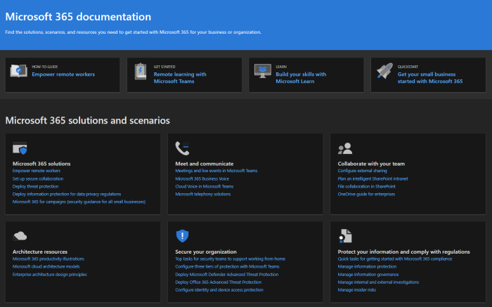

# Neuerungen in der Microsoft 365 Admin Center

::: moniker range="o365-21vianet"

> [!NOTE]
> Einige der Informationen in diesem Artikel gelten möglicherweise nicht für Office 365 betrieben von 21Vianet.

::: moniker-end

Wir fügen [dem Microsoft 365 Admin Center](../business-video/admin-center-overview.md)kontinuierlich neue Features hinzu, beheben Probleme, über die wir erfahren, und nehmen basierend auf Ihrem Feedback Änderungen vor. Unten können Sie sehen, was heute schon für Sie verfügbar ist. Einige Funktionen werden für unsere Kunden mit unterschiedlicher Geschwindigkeit bereitgestellt. Wenn Sie noch kein Feature sehen, [versuchen Sie, sich selbst zur Zielversion hinzuzufügen.](manage/release-options-in-office-365.md)

Und wenn Sie wissen möchten, was mit anderen Microsoft Cloud Services neu ist:

- [Neuerungen in Azure Active Directory](/azure/active-directory/fundamentals/whats-new)
- [Neuerungen im Exchange Admin Center](/Exchange/whats-new)
- [Neuerungen in Microsoft Intune](/mem/intune/fundamentals/whats-new)
- [Neuerungen im Microsoft 365 Compliance Center](/Office365/SecurityCompliance/whats-new)
- [Neuerungen in Microsoft 365 Defender](../security/mtp/whats-new.md)
- [Aktive Websites im SharePoint Online Admin Center](/sharepoint/what-s-new-in-admin-center)
- [Office-Updates](/OfficeUpdates/)
- [Überprüfen Windows Releaseintegrität](/windows/deployment/update/check-release-health)

## Juli 2021

### Microsoft 365 Admin Center Suche

Sie können jetzt im Microsoft 365 Admin Center nach Vorfall-IDs suchen. Sie können sich über soziale Medien, Branchenpublikationen oder andere Administratoren über aktuelle Vorfälle informieren. Sie können jetzt zum Admin Center wechseln, um weitere Details zu dem Vorfall nachzuschlagen und die Auswirkungen auf Ihre Organisation zu verstehen. Suchen Sie einfach im Admin Center nach der Vorfall-ID.

:::image type="content" source="../media/incident-id.png" alt-text="Screenshot: Suchen nach der Vorfall-ID im Admin Center":::

### Einblick in Supporttickets für Premier-Organisationen

Wir haben zwei Diagramme hinzugefügt, die als **Volumetrend** und **Volumentrend nach Produkt** bezeichnet werden, um Ihnen visuelle Einblicke über Ihr Supportvolumen zu geben.

Das Linerdiagramm unter der Registerkarte **"Volumentrend"** hebt den Trend hervor, wenn Supportfälle für Ihre Organisation monatlich zunehmen oder abnehmen. Sie können mit dem Mauszeiger auf das Diagramm zeigen, um die Anzahl der Supportfälle zu überprüfen, die in jedem Monat erstellt wurden.

:::image type="content" source="../media/SuppInsight-voltrnd.PNG" alt-text="Screenshot: Graph, die den Trend hervorhebt, wenn Supportfälle für Ihre Organisation monatlich zunehmen oder abnehmen":::

Der **Volumentrend nach Produktdiagramm** zeigt die top 3 Produkte jedes Monats mit den höchsten Supportfällen an. Wir haben die Filterung in der Tabelle aktiviert, und Sie können jetzt die Ergebnisse nach **Produkt,** **Schweregrad** und **Datum** filtern.

:::image type="content" source="../media/SuppInsight-voltrndproduct.PNG" alt-text="Screenshot: Graph zeigt die top 3 Produkte jedes Monats mit den höchsten Supportfällen":::

Wir haben außerdem zwei neue Felder hinzugefügt: **Schweregrad** und **Geschlossenes Datum** in der Tabelle **"Serviceanfrage anzeigen",** um Ihnen weitere Einblicke zu Ihren Tickets zu geben.

:::image type="content" source="../media/SuppInsight-date-sev.PNG" alt-text="Screenshot: Tabelle, die die Sortierung von Supporttickets nach Schweregrad und Datum zeigt.":::

Wenn Sie diese Updates in Microsoft 365 Admin Center auschecken möchten, wechseln Sie im linken Navigationsbereich zu   >  **Support-Serviceanfragen.**

## Juni 2021

### Microsoft 365 Admin Center Suche

Wir haben der Suchfunktion einige neue Kategorien hinzugefügt.

- Sie können jetzt in der globalen Suche nach Microsoft 365 Administratorrollen suchen und Rollenzuweisungen von jeder Seite aus schnell anzeigen und verwalten. Suchen Sie beispielsweise nach **einem Intune-Administrator.**

- Sie finden jetzt vereinfachte Einrichtungsfunktionen über die globale Suche. Dies kann Ihnen und Ihrem Team helfen, schnell mit der Verwendung neuer Features zu beginnen. For example, search for **set password to never expire**.

Weitere Informationen zur Suche im Admin Center finden Sie unter [Suchen im Microsoft 365 Admin Center.](manage/search-in-the-mac.md)

## Mai 2021

### Mobile Admin-App

### Nachverfolgen von Supportticketupdates mithilfe der mobilen Administrator-App

Für alle in Ihrem Mandanten erstellten Serviceanfragen können Sie nun den Ticketstatus nachverfolgen, Ticketdetails anzeigen und zusätzliche Informationen bereitstellen/anfordern, indem Sie Notizen & Anlagen hinzufügen.

:::image type="content" source="../media/Keep-track-support-ticket-updates2.PNG" alt-text="Screenshot: Nachverfolgen von Supportticketupdates":::

### Bleiben Sie auf dem Laufenden über alle wichtigen Updates für die App und Ihr Microsoft 365-Abonnement

- Bleiben Sie auf dem Laufenden über alle wichtigen Updates für Ihr Microsoft 365-Abonnement über Nachrichtencenter-Pushbenachrichtigungen (jetzt standardmäßig aktiviert).

- Verfolgen Sie mithilfe des **Abschnitts "Neuigkeiten"** die neuesten Features, die in der App verfügbar sind. Wechseln Sie zu **Einstellungen**  >  **Neuigkeiten?**

:::image type="content" source="../media/Stay-on-top-of-updates.PNG" alt-text="Screenshot: Nachverfolgen wichtiger Updates und Features":::

## April 2021

### Mobile Admin-App

### Verwalten von Lizenzen und Rechnungen aus der mobilen Administrator-App

- Sie können jetzt alle verfügbaren und zugewiesenen Lizenzen für Ihre Abonnements anzeigen. Sie können Benutzern auch Lizenzen zuweisen oder deren Zuweisung aufheben sowie Lizenzen hinzufügen oder entfernen.
- Sie können nun detaillierte Rechnungen in der App anzeigen.
- Diese Updates sind auf [Android-](https://go.microsoft.com/fwlink/p/?linkid=2159786) und [iOS-Geräten](https://go.microsoft.com/fwlink/p/?linkid=2159787) verfügbar.

:::image type="content" source="../media/assign-license-mobile-app2.png" alt-text="Screenshot: Seite zum Zuweisen von Lizenzen für mobile Administrator-Apps":::
:::image type="content" source="../media/license-screen-mobile-app2.png" alt-text="Screenshot: Bildschirm &quot;Mobile App verwalten&quot; mit Benutzern und deren Lizenzen":::
:::image type="content" source="../media/invoice-summary-mobile-app.png" alt-text="Screenshot: Zusammenfassungsseite der Mobilen App-Rechnung des Administrators":::

### Aktualisierter Nachrichtencenter-Feed in der mobilen Administrator-App

- Sie haben jetzt eine flexiblere Leseumgebung des Nachrichtencenterfeeds. Sie haben jetzt die Möglichkeit, Nachrichten basierend auf Dienst oder Tags zu filtern und Nachrichten als Favorit zu markieren. Massenaktionen zum Markieren von Nachrichten als gelesen, ungelesen oder archiviert wurden ebenfalls hinzugefügt.
- Diese Updates sind auf [Android-](https://go.microsoft.com/fwlink/p/?linkid=2159786) und [iOS-Geräten](https://go.microsoft.com/fwlink/p/?linkid=2159787) verfügbar.

:::image type="content" source="../media/mc-feed-mobile-app.png" alt-text="Screenshot: Nachrichtencenter-Feedseite für mobile Admin-App":::

## Ignite 2021 (März)

Willkommen bei Microsoft Ignite. Wir hoffen, dass Sie an einer unserer Sitzungen teilnehmen konnten: [Microsoft Ignite 2021](https://myignite.microsoft.com/sessions). Hier sind einige der Dinge, über die wir bei Ignite gesprochen haben.
> [!NOTE]
> Nicht alle Features werden sofort für alle verfügbar sein. Wenn die neuen Features nicht angezeigt werden, [treten Sie der gezielten Version bei.](manage/release-options-in-office-365.md)

### Nachrichtencenter

Wir haben das Nachrichtencenter überarbeitet, um Ihnen zu helfen, relevante Nachrichten zu finden, und eine flexiblere Leseumgebung hinzugefügt. Wir haben eine neue **Dienstspalte** hinzugefügt, die Ihnen hilft, zu überprüfen, für welchen Dienst eine Nachricht gilt, und Nachrichten nach Dienst und anderen Metadaten zu filtern. Sie können eine Nachricht als Favorit markieren, um sie zur Nachverfolgung zu markieren, auswählen, welche Spalten in der Nachrichtenliste angezeigt werden, und zwischen Nachrichten mit den Schaltflächen "Zurück" und "Weiter" navigieren. Außerdem haben wir den Prozess verbessert, um das Feedback zu Nachrichtencenterbeiträgen zu vereinfachen.

:::image type="content" source="../media/message-center.png" alt-text="Screenshot: Homepage des Nachrichtencenters mit Posteingang und Nachrichten":::

Weitere Informationen zu den neuen Features finden Sie im [Nachrichtencenter.](manage/message-center.md)

### Neuerungen

Wir haben Verbesserungen daran vorgenommen, wie Sie die Features "Neuigkeiten" für Benutzer in den Office-Apps anzeigen. Sie können nun den umfangreichen Inhalt im neuen Bereich "Whats" anzeigen, den Ihre Benutzer sehen können. Sie können auch mehr über das Feature erfahren, bevor Sie ihre Benutzer über das Feature informieren möchten. Weitere Informationen finden Sie unter [Verwalten, welche Office Features in "Neuigkeiten" angezeigt werden.](manage/show-hide-new-features.md)

:::image type="content" source="../media/power-bi-whats-new2.png" alt-text="Screenshot: Office Apps die neue Seite mit Verbesserungen an Power BI":::

## Ignite 2020 (August & September)

Willkommen bei Microsoft Ignite – unserem ersten reinen Online-Ignite. Wir hoffen, Sie in einer unserer Sitzungen zu sehen: [Microsoft Ignite 2020 Session Catalog](https://myignite.microsoft.com/sessions). Hier sind nur einige der Dinge, über die wir bei Ignite sprechen werden.
> [!NOTE]
> Nicht alle Features werden sofort für alle verfügbar sein. Wenn die neuen Features nicht angezeigt werden, [treten Sie der gezielten Version bei.](manage/release-options-in-office-365.md)

### Mehrinstanzenfähige Verwaltung

Wir haben eine Reihe von Features für mehrinstanzenfähige Administratoren wie Sie entwickelt, um Ihre Arbeit schneller und effizienter erledigen zu können. Weitere Informationen finden Sie unter [Verwalten mehrerer Mandanten.](multi-tenant/manage.md)

- **Ihre Mandanten:** Wechseln Sie schnell zwischen den Mandanten, die Sie verwalten.
- **Alle Mandanten**: Eine neue Seite, auf der Sie schnell den Status aller Dienste Ihrer Mandanten, alle offenen Serviceanfragen, Ihre Produkte und Abrechnung, empfohlene Einrichtungsaufgaben und die Anzahl der Benutzer in diesem Mandanten sehen können.
- **Setup:** Die Seite "Setup" mit mehreren Mandanten bietet Ihnen eine Listenansicht der Setupseite, die jedoch für viele Mandanten organisiert ist. Sie können sehen, welche Features nicht aktiviert sind, welche Aufgaben für alle Mandanten abgeschlossen sind, aufgaben, die Mandanten noch ausführen müssen. Diese Ansicht hilft Ihnen, die Einführung von Features nachzuverfolgen und sicherzustellen, dass die empfohlenen Sicherheitseinrichtungsaufgaben immer ausgeführt werden.
- **Dienstintegrität:** Die Dienststatusansicht zeigt Ihnen an, ob Vorfälle oder Empfehlungen die Mandanten betreffen. Sie erfahren sogar, wie viele Ihrer verwalteten Mandanten betroffen sind. Wählen Sie einfach einen Vorfall aus, um weitere Informationen auf der Registerkarte "Übersicht" zu erhalten, und wechseln Sie dann zur Registerkarte "Mandanten betroffen", um einen Drilldown zu erstellen und diesen Mandanten zu unterstützen.
- **Mandantenübergreifende Postfachmigrationen** sind ein neuer Dienst, der jetzt in der öffentlichen Vorschau angezeigt wird und mit dem Sie Postfächer zwischen Mandanten verschieben können, ohne dass Postfächer offboardiert und dann integriert werden müssen. 
- **Mandantenübergreifende Domänenfreigabe:** In Kürze können Sie einer privaten Vorschau für Funktionen beitreten, mit denen Sie eine Domäne über mehrere Mandanten hinweg freigeben können. Wenn Contoso beispielsweise Wingtip Toys erwirbt, kann Contoso die Domäne mit Wingtip Toys teilen, sodass Personen in beiden Mandanten "contoso.com" als E-Mail-Adressen verwenden können.

### Überwachen Ihrer wichtigsten Konten

Sie können fehlgeschlagene oder verzögerte E-Mail-Nachrichten überwachen und nachverfolgen, die an Ihre Benutzer gesendet werden, die eine hohe geschäftliche Auswirkung haben, z. B. Ihr CEO. Sie verfolgen Prioritätskonten, indem Sie Ihrer Prioritätskontenliste im Microsoft 365 Admin Center Benutzer hinzufügen. Hinzufügen von Führungskräften, Führungskräften, Vorgesetzten oder anderen Benutzern, die Zugriff auf vertrauliche Informationen oder Informationen mit hoher Priorität haben.

Prioritätskonten sind nur für Organisationen verfügbar, die beide der folgenden Anforderungen erfüllen:

- Office 365 E3 oder Microsoft 365 E3 oder Office 365 E5 oder Microsoft 365 E5.
- Mindestens 10.000 Lizenzen und mindestens 50 monatliche aktive Exchange Online Benutzer.

Es gibt zwei Möglichkeiten für die ersten Schritte:

- Wechseln Sie zu **"Benutzer",** und wählen Sie dann im Menü "Drei Punkte (weitere Aktionen)" die Option **"Prioritätskonten verwalten"** aus, um der Liste Benutzer hinzuzufügen.
- Wechseln Sie zu **"Setup",** suchen Sie die Einrichtungsaufgabe **"Ihre wichtigsten Konten überwachen",** und wählen Sie dann **"Erste Schritte" aus.**

Weitere Informationen zu Prioritätskonten finden Sie unter Überwachen von [Prioritätskonten.](./setup/priority-accounts.md)

### Schneller suchen und von jeder Seite bessere Ergebnisse erzielen

Wir haben mit dem Rollout einer neuen Suchumgebung für das Admin Center begonnen, und wir können nicht warten, bis Sie es ausprobieren. 

- The Search box moved to the header area where it says "Microsoft 365 Admin Center", so you now search from any page, not just the Home page. Wir haben sogar eine Verknüpfung: **ALT+S**.
- Die Suche ist intelligenter und liefert Ihnen bessere Ergebnisse, noch schneller. Versuchen Sie, "2fa" einzugeben, um zu beginnen.
- Suchergebnisse werden nach dem Typ des Elements oder der Aktion organisiert, die Sie ausführen können.
  - **Benutzer:** Wählen Sie den Namen des Benutzers aus, und Sie können diesen Benutzer direkt dort bearbeiten. Wenn Sie das Menü mit drei Punkten (weitere Aktionen) neben ihrem Namen auswählen, können Sie das Kennwort zurücksetzen. Sie können nach Anzeigename, Nachname, Vorname, Benutzername oder primärer E-Mail-Adresse und E-Mail-Aliasen suchen. Um jedoch eine genaue Übereinstimmung zu erhalten, suchen Sie nach der primären E-Mail-Adresse oder dem Benutzernamen.
  - **Gruppen:** Bearbeiten Sie die Gruppe von einer beliebigen Seite aus, fügen Sie Mitglieder hinzu, weisen Sie Besitzer zu.
  - **Aktionen:** Ähnlich wie Sie nach einem Benutzer suchen und dann sein Kennwort zurücksetzen können, können Sie auch auf jeder Seite nach "Kennwort zurücksetzen" suchen und dann ein oder mehrere Kennwörter für Benutzer zurücksetzen.
  - **Navigation:** Ergebnisse unter Navigation können Ihnen schnell helfen, schnell zu einer Seite im Admin Center zu gelangen. Wenn Sie z. B. nach "Rollen" suchen, gelangen Sie zur Seite "Rollen" nach Azure AD-Rollen.
  - **Einstellungen:** Suchen Sie nach allen Einstellungen im Zusammenhang mit Ihrer Organisation, den Diensten, die Sie abonnieren, sowie Sicherheits- und Datenschutzeinstellungen. 
  - **Domänen:** Sie finden Schnelllinks zu Ihren Domänen, und dann gelangen Sie über den Link zur Übersichts- und Integritätsseite dieser Domäne.
  - **Dokumentation:** Wenn wir kein Ergebnis für Sie finden können, versuchen wir, eine Dokumentation zu finden, die Ihnen hilft. Es dauert etwas länger, bis die zusammengestellte Liste von Artikeln eine Übereinstimmung findet. Warten Sie also eine Sekunde, um die Suche nach den Ergebnissen zu lassen. 
  - **Feedback:** Haben Sie nicht gefunden, wonach Sie gesucht haben? Senden Sie uns Feedback von Der Suche. Wir werden suchfunktionen für weitere Seiten und weitere Features im Admin Center hinzufügen.

### mobile Administrator-App Microsoft 365

Mit [der mobilen Administrator-App Microsoft 365,](https://www.microsoft.com/microsoft-365/business/manage-office-365-admin-app)die in Ihrem Abonnement enthalten ist, können Sie Microsoft 365 von Ihrem mobilen Gerät aus verwalten, damit Sie sich von Ihrem Schreibtisch abwenden können, um tägliche Aufgaben auszuführen. Tatsächlich gibt es mehr als 90 Features in der App, und wir haben soeben ein paar weitere hinzugefügt:

- **Unterstützung für die Richtlinien für die mobile Anwendungsverwaltung und den bedingten Zugriff von Microsoft Intune:** Sie können jetzt Ihr persönliches Gerät verwenden, um Microsoft 365 zu verwalten, auch wenn Ihre Organisation die Verwaltung mobiler Anwendungen und bedingte Zugriffsrichtlinien von Intune aktiviert hat.
- **Nachrichtencenterbenachrichtigungen:** Aktivieren Sie Nachrichtencenterbenachrichtigungen unter **Einstellungen**  >  **Benachrichtigungen,** wenn Sie über neue Nachrichtencenterbeiträge benachrichtigt werden möchten. Durch Benachrichtigungen möchten wir sicherstellen, dass Sie über wichtige Informationen und Ereignisse in Ihrem Mandanten auf dem Laufenden bleiben.
- **Abrechnungsbenachrichtigungen:** Sie können Abrechnungsbenachrichtigungen auch unter **Einstellungen**  >  **Benachrichtigungen** aktivieren, wenn Sie Abrechnungsbenachrichtigungen auf Ihrem Gerät erhalten möchten, wenn ein Abonnement bald abläuft.
- **Dunkler Modus:** Willkommen bei der dunklen Seite der mobilen App. Dies war eines unserer am häufigsten angeforderten Features. Wechseln Sie zu **Einstellungen**  >  **Designs,** um es zu aktivieren.
- **Melden eines Problems:** Sie können jetzt ein Problem in der App melden oder Probleme anzeigen, die von anderen Administratoren gemeldet wurden. Besuchen Sie **den Dienststatus,** um ihn auszuchecken.

### Nutzungsempfehlungen für kleine und mittelständische Unternehmen

Kleine und mittelständische Unternehmen erhalten möglicherweise eine Empfehlung auf der **Startseite,** wenn einige der Personen in der Organisation nicht aktiv apps Teams, OneDrive oder Office verwenden. Wenn Sie die Empfehlung anzeigen, können Sie microsoft-Schulungen schnell an inaktive Benutzer senden, um ihnen bei den ersten Schritten mit der App zu helfen und sicherzustellen, dass Sie den vollen Nutzen aus Ihren Abonnements erhalten.

### Remotearbeitssammlung

Im Oktober fügen wir eine Remotearbeitssammlung hinzu, die Kleinunternehmen und ihren Mitarbeitern dabei hilft, online zu sein und remote zu arbeiten.  Die Einrichtung von **Remotearbeits-Grundlagen** ist eine zusammengestellte Liste aller Features, die Microsoft empfiehlt, um Remotearbeit sicher zu ermöglichen und effektiv zusammenzuarbeiten. In ein paar Wochen können Sie es in **setup**  >  **Remote work essentials** ausprobieren.

Weitere Informationen zum sicheren Zulassen von Remotearbeit und einer praktischen Webadresse, die sie leicht merken und freigeben können, finden Sie unter [aka.ms/remote-business](https://aka.ms/remote-business).

### Benötigen Sie Hilfe? Umstieg auf weitere Admin Center

Wir betrachten und aktualisieren die Inhalte und Tools kontinuierlich, um mit Änderungen im Produkt Schritt zu halten. Wir verfügen nun über viele weitere Selbstbedienungsdiagnosetools, die Ihnen helfen, Probleme schnell und effizient zu beheben. Hier sind einige, die kürzlich hinzugefügt wurden:

- Ändern der Einschränkungsrichtlinie für den Exchange Webdienst
- Überprüfen des Status der Teams Bereitstellung und Überprüfung für bestimmte Benutzer
- Beheben von DKIM-Setupproblemen
- Diagnose von Intune-Benutzerregistrierungsfehlern

Außerdem stellen wir die neue und verbesserte Supportumgebung bereit, die Sie bereits im Microsoft 365 Admin Center in einigen der anderen Admin Center sehen. Teams Admin Center und Security and Compliance Admin Center verfügen bereits über diese neue Oberfläche. Und in Kürze werden **Exchange Admin Center,** **SharePoint Admin Center** und **Office.com** zusammen mit dieser neuen Hilfe für Administratoren aktualisiert.

### Verwalten von Änderungen mit Microsoft Planner

Im Mai haben wir angekündigt, dass Sie Nachrichtencenterbeiträge in Kürze mit Microsoft Planner synchronisieren können und jetzt für jeden verfügbar sind.  Sie können nun Aufgaben aus Nachrichten erstellen, zuweisen und bis zum Abschluss nachverfolgen. Beim ersten Auswählen der **Planner-Synchronisierung** müssen Sie eine Verbindung mit dem entsprechenden Plan herstellen.

Weitere Informationen hierzu finden Sie in diesem Artikel und video, um zu sehen, wie es funktioniert: [Nachverfolgen Ihrer Nachrichtencenter-Beiträge in Planner](/Office365/Planner/track-message-center-tasks-planner)

### Dokumentation, Schulungen und Videos

- Brand new and just in time for Microsoft Ignite -[The Virtual Hub](https://adoption.microsoft.com/virtual-hub/). Tiefe Einblicke in die technische Schulung für IT-Spezialisten und Entwickler. Suchen Sie im Rahmen der #SIDETRACKED schnell ca. 20 neue Videos, den Namen des Ignite-Administratortitels in diesem Jahr.
- [Neuigkeiten bei Microsoft 365](https://www.youtube.com/watch?v=OVjb2lGJ4GU&t=2s) Videoreihe: In diesem Monat behandeln wir neue Features, die in Whiteboard für Teams und im Web verfügbar sind, wie sie die Benutzerbereitstellung für Azure AD automatisieren, neue Power Automate Trigger und Aktionen in Teams und vieles mehr. Und bleiben Sie auf dem Laufenden für den nächsten Monat, in dem wir eine Übersicht über alle großartigen Dinge haben, die bei Ignite geschehen!
- Wir haben die [Microsoft 365 Dokumentationsseite](/microsoft-365) neu gestaltet, die sich zuerst auf Lösungen konzentriert. Wir werden neue Lösungen hervorheben, sobald sie auf dieser Seite verfügbar sind, also achten Sie darauf.

## Juli 2020

### Vorbereiten auf Ignite 2020

Da wir in die Ignite-Spielzeit bei Microsoft gehen, veröffentlichen wir nicht so viele Features, sodass wir während unserer Sitzungen viel zu besprechen haben.

Das nächste Update dieses Artikels wird am Ersten Tag unseres ersten nur online verfügbaren Ignite sein. In diesem Jahr ist die Teilnahme kostenlos! Sehen Sie es sich an, registrieren Sie sich: [Microsoft Ignite 2020](https://www.microsoft.com/ignite).

### Ihre Produkte

Es wurde viel Arbeit in der Abonnementverwaltung ausgeführt, um die Seite schneller zu laden, schneller zu finden, wonach Sie suchen, und um die Web-Barrierefreiheitsstandards ([WCAG 2.1-Richtlinien)](http://www.w3.org/TR/WCAG21/)zu erfüllen.

- **Neugestaltung** der Tabelle: Die Tabelle wurde neu gestaltet, sodass Sie ähnliche Abonnements gruppieren können. Wechseln Sie zur **Abrechnung**  >  **Ihrer Produkte.**
- **Produktdetails:** Erhalten Sie mehr Details zu Ihren Abonnements als je zuvor, indem Sie das Produkt in der Liste auswählen.
- **Führen Sie alles von hier aus aus:** Und Sie müssen nicht auf mehreren Seiten herumspringen, um ein Produkt zu verwalten. Wenn Sie beispielsweise ein Abonnement kündigen müssen, wird der Bereich geöffnet, um die Aktion direkt dort auszuführen.

### Domänen

Die Domänenverwaltung kann kompliziert sein, und wir haben ein neues Feature veröffentlicht, um dies zu vereinfachen. Wechseln Sie zu Einstellungen > Domänen, und wählen Sie dann eine Domäne aus, um weitere Informationen zu Ihrer Domäne und der Integrität der Domäne zu erhalten.

:::image type="content" source="../media/MAC-WN-DomainDNS.PNG" alt-text="Seite &quot;Domänendetails&quot; für contoso.com":::

### Dokumente, Schulungen und Videos (Juli 2020)

[Neuigkeiten bei Microsoft 365](https://youtu.be/m1Nu8WJgCDY) Videoreihe: In diesem Monat befassen wir uns mit der neuen Yammer Für Web und Mobil, der Integration der Yammer Community-App für Microsoft Teams, neuen Richtlinienpaketen zur Unterstützung von Mitarbeitern und Vorgesetzten in Service und Produktion und vieles mehr.

## Juni 2020

### Keeping up with Office What's New management

Vor ein paar Monaten haben wir eine Einstellung hinzugefügt, mit der Sie die Nachrichten "Neuigkeiten" verwalten können, die in den Office-Apps eines Benutzers angezeigt werden. In diesem Monat haben wir eine neue Homepagekarte veröffentlicht, die Ihnen hilft, schnell zu handeln und **die** Neuigkeiten nachzuverfolgen, die Den Benutzern in Ihrer Organisation angezeigt werden sollen.

### Dokumente, Schulungen und Videos (Juni)

- [Erste Schritte mit Teams](../business-video/get-started-teams-small-business.md)

## Mai 2020

### Neuer Updatekanal für Office

Am 12. Mai haben wir die Verfügbarkeit eines neuen Updatekanals für Office angekündigt: monatlicher Enterprise Kanal. Dieser Updatekanal bietet Ihren Benutzern einmal im Monat neue Office Funktionen, am zweiten Dienstag des Monats.

Wenn Sie Ihren Benutzern erlauben, Office über das Portal selbst zu installieren, können Sie für sie den monatlichen Enterprise Kanal auswählen. Melden Sie sich dazu beim Microsoft 365 Admin Center an, und wechseln Sie zu **"Alle**  > **Einstellungen**  >  **Organisationseinstellungen**  >  **anzeigen", Office**  >  **Softwaredownloadeinstellungen.** Wenn Sie **"Einmal im Monat" (monatlicher Enterprise Kanal)** auswählen, werden alle neuen Selbstinstallationen von Office für die Verwendung des monatlichen Enterprise Kanals konfiguriert.

In Verbindung mit der Veröffentlichung des monatlichen Enterprise Kanals überprüfen wir auch die Namen der vorhandenen Updatekanäle. Beispielsweise wird der monatliche Kanal in den aktuellen Kanal umbenannt. Die neuen Namen werden am 9. Juni 2020 wirksam.

Weitere Informationen finden Sie unter [Änderungen an den Updatekanälen für Microsoft 365 Apps](/DeployOffice/update-channels-changes).

### Neue Administratorrollen

Wir haben dem Microsoft 365 Admin Center einige neue Azure Active Directory Administratorrollen hinzugefügt.

- Die Rolle des Hybrididentitätsadministrators gewährt Benutzern die Berechtigung zum Verwalten von Cloudbereitstellungs- und Authentifizierungsdiensten.
- Mit der Rolle "Netzwerkadministrator" können Benutzer Netzwerkstandorte verwalten und Netzwerkerkenntnisse für Microsoft 365 Software as a Service-Apps überprüfen.
- Die Druckeradministratorrolle gewährt die Berechtigung zum Verwalten aller Aspekte von Druckern und Druckerverbindungen.
- Der Druckertechniker ist eine Teilmenge der Rolle "Druckeradministrator", in der diese Benutzer Drucker registrieren und die Registrierung aufheben sowie den Druckerstatus aktualisieren können.
Weitere Informationen zu diesen Rollen finden Sie unter ["Informationen zu Administratorrollen".](./add-users/about-admin-roles.md)

### Liste "Gruppen exportieren"

Wir haben von vielen Administratoren gehört, dass sie Informationen über Gruppen und ihre Nutzung für Personen freigeben müssen, die keinen Zugriff auf die Admin Center haben. Sie können jetzt die Gruppenliste zu Überwachungszwecken in eine CSV-Datei exportieren, was bedeutet, dass Sie dieses alte PowerShell-Skript auslösen können. Um es auszuprobieren, wechseln Sie zu  >  **Gruppengruppen,** und wählen Sie dann in der Befehlsleiste **"Gruppen exportieren"** aus.

### Microsoft 365 Lösungs- und Architektur-Center

Just this month, we released a new site on docs.microsoft.com called the [Microsoft 365 solution and architecture center](../solutions/index.yml), which brings together the technical guidance you need to understand, plan, and implement integrated Microsoft 365 solutions for secure and compliant collaboration. In diesem Center finden Sie Folgendes:

- Grundlegende Lösungsleitfaden
- Arbeitsauslastungslösungen und Szenarioleitfaden
- Lösungs- und Architekturillustrationen (Die Poster!!!)
- Branchenspezifischer Leitfaden
- Designprinzipale der Enterprise Architektur

### Dokumente, Schulungen und Videos (Mai)

- **Neuigkeiten in Microsoft 365 Videoreihe:** In diesem Monat behandeln wir die neue Supportumgebung im Teams Admin and Security and Compliance Center, die Planner-Integration in das Nachrichtencenter und das neue 3x3-Videolayout in Microsoft Teams. 
- Die [Microsoft 365 Admin Center Hilfe-Hubseite](./index.yml) wurde aktualisiert, damit Sie schneller finden können, was Sie benötigen. Und wenn Sie sich diese Seite ansehen, haben wir eine Karte hinzugefügt, um Sie über wichtige Updates und Änderungen zu informieren.

## April 2020

### Intune-Rollenverwaltung

[April 2020](#april-2020)

Nun, wir haben es getan! Wir haben den zweiten Schritt auf dem Weg zu einer einheitlichen Rollenerfahrung gemacht, und Sie können nun Intune-Rollen im Microsoft 365 Admin Center verwalten. Sie können auch Features wie die Möglichkeit nutzen, nach Rollen zu suchen und Rollenberechtigungen anzuzeigen. Dies bedeutet, dass Sie keine zwei separaten Tools zum Verwalten von Rollen für Microsoft 365 und Intune benötigen. Wenn Sie sich beim Microsoft 365 Admin Center anmelden, werden Sie feststellen, dass die Seite "Rollen" zwei Pivots enthält, eines für Azure AD und eines für Intune.

### Synchronisieren von Nachrichtencenterbeiträgen mit Planner

Ab Mai sehen Administratoren, die sich in der gezielten Version befinden, die Schaltfläche "Planner-Synchronisierung" im Nachrichtencenter. Sie können nun Nachrichten nachverfolgen, die eine Aktion erfordern, den Nachrichtentyp auswählen, den Sie nachverfolgen möchten, Nachrichten zuweisen, die als Aufgaben nachverfolgt werden sollen, und Nachrichten für spätere Aufmerksamkeit markieren.

[Treten Sie "Targeted Release"](manage/release-options-in-office-365.md) bei, um zu beginnen!

### "Benötigen Sie Hilfe?" gestartet in Teams Admin Center & Security and Compliance Center

Im Teams Admin Center, Security Center und Compliance Center wird jetzt die gleiche "Benötigen Sie Hilfe?" verwendet. feature that the Microsoft 365 Admin Center uses for finding help and contacting support. Wir haben sehr viel Feedback von Administratoren erhalten, dass Sie das gleiche Maß an Hilfe und Support wünschen, und wir freuen uns, Ihnen dies zu bieten. Probieren Sie es aus, und geben Sie uns Ihr Feedback!

#### Benötigen Sie Chat?

Unsere Support-Agents haben von zu Hause aus gearbeitet, während Kundenfälle und Einschränkungen der Internetbandbreite während der Arbeit von zu Hause aus die Anrufqualität des Kunden beeinträchtigen können. Um Sie weiterhin zu unterstützen, haben wir die Live-Chat-Supportoption für kommerzielle Kunden im Microsoft 365 Admin Center gestartet.

Beim Erstellen einer Serviceanfrage wird nun neben Telefon und E-Mail auch der Chat als Option angezeigt. Wählen Sie "Chat" als bevorzugten Kommunikationskanal aus, und erstellen Sie die Anforderung. Nachdem Sie die Anforderung erstellt haben, können Sie den Chat starten, wenn Sie bereit sind, mit Microsoft-Agents zu chatten.

### Teams Updates

Aufgrund der erhöhten Nutzung von Teams haben wir einige Features hinzugefügt, die Ihnen bei der Verwaltung helfen.

- Eine neue Empfehlungskarte auf der Admin Center-Startseite zeigt, welche Benutzer Teams 30 Tage lang nicht aktiv verwendet haben. Sie können diesen Benutzern eine Schulungs-E-Mail senden, um mit Teams zu beginnen.
- **Bringen Sie Personen mit Teams zusammen:** Wechseln Sie zum **Setup,** um eine neue Seite anzuzeigen, um Teams für lizenzierte Benutzer zu aktivieren und den Gastzugriff zuzulassen, damit Sie mit externen Kunden in Teams zusammenarbeiten können.
- Eine Microsoft Teams Karte ist jetzt standardmäßig an Ihre Startseite angeheftet. Es zeigt an, ob Teams aktiviert ist und ob Der Gastzugriff zulässig ist. Außerdem können Sie den Setupstatus für neu lizenzierte Teams Benutzer überprüfen und überprüfen, ob Netzwerkprobleme Teams Benutzer beeinträchtigen können.
- Schließlich ist Teams jetzt ein Schritt im anfänglichen Einrichtungsablauf, wenn Sie eine Lizenz erworben haben, die Teams enthält.

### Produktivitätsbewertung

Die Produktivitätsbewertung gibt Einblicke darüber, wie Benutzer Microsoft-Clouddienste und die Technologieerfahrungen nutzen, die sie unterstützen. Die Bewertung spiegelt die Leistung Ihrer Organisation gegenüber Denk- und Technologieerfahrungsmaßen wider und vergleicht Ihre Bewertung mit Organisationen wie Ihrer. In diesem Monat führen wir die folgenden neuen Konzepte in die Vorschau ein:

- Trendansicht der wichtigsten Erkenntnisse auf Startseiten- und Kategoriedetailseiten – Kategorien "Endpoint Analytics" und "Netzwerkkonnektivität" zur Technologieerfahrung hinzugefügt
- Relevanter Einblick in die Technologieerfahrung in den Kategorien "Mitarbeitererfahrung"
- Neue Kommunikationskategorie als Teil der Mitarbeitererfahrung
- Benutzerdetails mit Organisationsmetadaten in den Kategorien "Mitarbeitererfahrung"

Wenn Sie mehr erfahren möchten, lesen Sie den Blog: [Messen und Verbessern der Microsoft 365 Erfahrung mit der Microsoft-Produktivitätsbewertung.](https://techcommunity.microsoft.com/t5/microsoft-365-blog/measure-and-improve-the-microsoft-365-experience-with-microsoft/ba-p/1348618) Die Produktivitätsbewertung befindet sich derzeit in der privaten Vorschau. [Nehmen Sie an der privaten Vorschau der Produktivitätsbewertung teil,](https://aka.ms/productivityscorepreview) um zu beginnen.

### Gruppenupdates

In diesem Monat gibt es zwei Updates für Gruppen:

- Sie können jetzt E-Mail-Adressen für Office 365 Gruppen bearbeiten (auch als Gruppen in Outlook bezeichnet und bald als Microsoft 365 Gruppen bezeichnet).
- Wir haben Ihr Feedback gehört, und wir haben eine klarere Fehlermeldung hinzugefügt, warum Sie eine Gruppe nicht in ein Microsoft-Team konvertieren können.

### Dokumente, Videos und Schulungen (April)

**Neuigkeiten in Microsoft 365 Videoreihe:** In diesem Monat behandeln wir Tipps und Ressourcen, die kleinen Unternehmen beim Übergang zur Remotearbeit helfen, einschließlich der Einführung von Microsoft Teams, Remotearbeitstrainingsressourcen, um mit Clients und Partnern in Verbindung zu bleiben, und dem neuen Microsoft 365 Business Voice Plan. [Neuigkeiten in Microsoft 365](https://go.microsoft.com/fwlink/p/?linkid=2118096)

#### Für Ihre Benutzer

- [Planen einer Besprechung](../business-video/schedule-guest-meeting.md)
- [Teilnehmen an einer Teams Besprechung](https://support.microsoft.com/office/078e9868-f1aa-4414-8bb9-ee88e9236ee4)
- [Erstellen eines organisationsweiten Teams](../business-video/org-wide-team.md)
- [Erstellen eines Teams mit Gästen](../business-video/team-with-guests.md)
- [Beitreten zu einem Team als Gast](../business-video/join-team-guest.md)
- [Erstellen einer Gruppen-E-Mail-Adresse](../business-video/group-email.md)

#### Für Administratoren und Geschäftsbesitzer

- [Remotearbeit kann auch Ihrem Kleinunternehmen weiterhelfen](https://support.microsoft.com/office/9b91a85a-39b4-40a6-a590-0f9bea0ba8e6)
- [Ausführen eines kleinen Remoteunternehmens](../business-video/sign-up.md)
- [Registrieren für Microsoft Business Basic](../business-video/sign-up.md)
- [Einrichten der zweistufigen Anmeldung](../business-video/sign-up.md)

## März 2020

### Empfohlene Feedbackkorrektur: Verbessern der Zuverlässigkeit von "Benutzer hinzufügen" für die Lizenzierung

Wir haben viel Feedback von Administratoren darüber erhalten, wie schwierig es ist, Lizenzen beim Hinzufügen von Benutzern zuzuweisen. Wir haben das erste Update für diesen Fix vorgenommen und zu einem zuverlässigeren Hintergrunddienst migriert, um diese Anforderungen zu verarbeiten. And if something goes wrong, you'll now get an error message that lets you to try again.

### Microsoft Teams Homepagekarte

Mit der Nutzung von Teams erhalten einige Organisationen eine angeheftete Dashboardkarte, die das Aktivieren Teams leichter erkennbar macht. Die Karte enthält auch Links zu Schulungen und Dokumenten, um Ihrer Organisation den Übergang zur Remotearbeit zu erleichtern. Wechseln Sie einfach zur **Startseite,** um die neue Karte anzuzeigen.

### Anpassen des Designs der SharePoint mobilen App Ihrer Organisation

Mithilfe der Microsoft 365 Admin Center können Sie jetzt das Design Ihrer Organisation in SharePoint mobilen App für iOS und SharePoint mobilen App für Android anpassen. Dieses Feature bietet eine mobile Intranet-App, die ihren SharePoint Online für Mitarbeiter unterwegs entsprechen kann. Die Designanpassung umfasst Ihr Logobild, die Farbe der Navigationsleiste, Text- und Symbolfarben sowie Akzentfarben, um eine einfache Erkennung zu ermöglichen.

### Verbesserungen am Assistenten "Gruppe hinzufügen"

Wenn Administratoren eine neue Gruppe erstellt und gleichzeitig zu einem Team gemacht haben, können sie Besitzer zuweisen, die nicht über eine Lizenz verfügen, die Teams enthält. Und das hat einige Probleme verursacht. Wir haben den Assistentenablauf aktualisiert, um sicherzustellen, dass Besitzer über eine Teams Lizenz verfügen und ob sie nicht die Option haben, die Gruppe in ein Team umzuwandeln, deaktiviert ist.

### Microsoft 365 Angebote für kleine und mittlere Unternehmen

Wir wissen, dass dies eine Ankündigung für den nächsten Monat ist, aber wir möchten sicherstellen, dass Sie vorbereitet sind.

Ab dem 21. April nehmen wir Änderungen im Zusammenhang mit unseren Office 365-Abonnements für kleine und mittlere Unternehmen vor – und mit Office 365 ProPlus. Diese Produkte verwenden jetzt die marke Microsoft 365.

Die neuen Produktnamen treten am 21. April 2020 in Kraft. Dies ist nur eine Änderung des Produktnamens, und es gibt derzeit keine Preis- oder Funktionsänderungen.

|Aktueller Name |Neuer Name  |
|---------|---------|
|Office 365 Business Essentials     |   Microsoft 365 Business Basic      |
|Office 365 Business Premium     |    Microsoft 365 Business Standard     |
|Microsoft 365 Business     |    Microsoft 365 Business Premium     |
|Office 365 Business     |    Microsoft 365 Apps for Business       |
|Office 365 ProPlus    |   Microsoft 365 Apps für Unternehmen      |

### Videos, Schulungen und Dokumente

[Neuigkeiten in Microsoft 365 Webserie:](https://go.microsoft.com/fwlink/p/?linkid=2118096)In der Folge dieses Monats heben wir den 3-Jahres-Jahrestag von Microsoft Teams hervor und behandeln neue Features, einschließlich verbesserter Audioqualität in Onlinebesprechungen, gezielte Kommunikation für Manager in Service und Produktion mit der Shifts-App, Teams und Skype Interoperabilität von Verbrauchern und vieles mehr.

## Februar 2020

### Empfohlene Feedbackkorrektur: Multi-Organization Switcher

Wir haben viel Feedback von Partnern und Administratoren zu den Herausforderungen bei der Verwaltung mehrerer Microsoft Cloud-Organisationen erhalten. Eines unserer ersten Verwaltungsfeatures für mehrere Organisationen ist die **Option "Organisation",** mit der Sie zwischen den Organisationen wechseln können, die Sie mit nur 2 Klicks verwalten.
> [!TIP]
> Sie müssen nichts unternehmen, damit der Organisationswechsel so lange angezeigt wird, wie Sie der Partner der Aufzeichnung für mindestens eine Organisation sind.

1. Wählen Sie im Microsoft 365 Admin Center den Namen der Organisation aus.

2. Wählen Sie in der Organisationswitcher die Organisation aus, die Sie verwalten möchten.

Das ist tatsächlich der Fall!!!

### Gruppen

Einige Änderungen im Gruppenbereich in diesem Monat:

- **Sortieren nach Gruppenname:** Sie können die Gruppenliste alphabetisch sortieren, indem Sie die Spalte **"Gruppenname"** auswählen.
- **Gelöschte Microsoft 365 Gruppen wiederherstellen:** Sie müssen nicht mehr zum Exchange Admin Center wechseln, um gelöschte Microsoft 365 Gruppen wiederherzustellen. Wechseln Sie zu **Microsoft 365 Admin Center** \>  \> **Gruppen gelöschte Gruppen** \> (wählen Sie eine Gruppe aus der Liste aus) \> **Gruppe wiederherstellen.** Sie stellt die Gruppe wieder in die **Gruppenliste** zurück und stellt E-Mails, Unterhaltungen, Notizbücher, Dateien und Kalender der Gruppe wieder her.

### Videos, Schulungen und Dokumente (Februar)

- **Neuigkeiten in Microsoft 365 Videoreihe:** In diesem Monat konzentrieren wir uns auf benutzerdefinierte Suchfunktionen für SharePoint Online, das Office Verwaltungsfeature "What's New", mit dem Sie bestimmte Features für Endbenutzer über den In-App-Hilfebereich, die neuesten Sicherheits- und Complianceupdates in Yammer und vieles mehr anzeigen oder ausblenden können. Hier ist die neueste Folge: [Neuigkeiten in Microsoft 365](https://go.microsoft.com/fwlink/p/?linkid=2118096)

- **Dokumente verschieben:** Wir haben die Office 365 Webartikel des Administrators mit den Microsoft 365 Inhalten kombiniert, und Sie haben die neue URL möglicherweise bemerkt. Beispielsweise wurde dieser Artikel früher gehostet unter: **docs.microsoft.com/Office365/Admin/whats-new-in-preview,** aber die URL lautet jetzt: **docs.microsoft.com/microsoft-365/admin/whats-new-in-preview**. Wenn Sie Seiten mit Lesezeichen erstellt haben, sollten Sie Ihre Links aktualisieren. Inhaltslinks werden jedoch zum neuen Inhaltsre repository umgeleitet.
