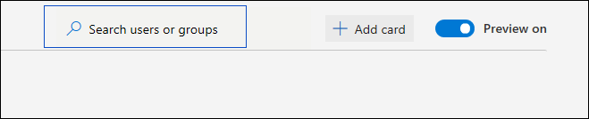
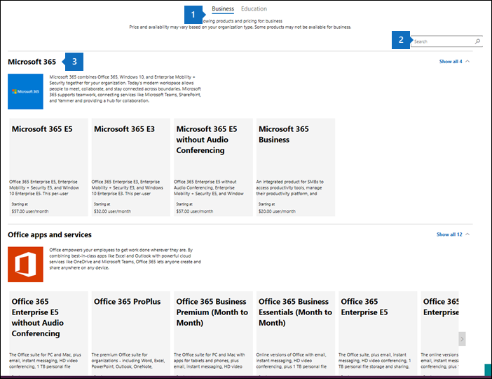
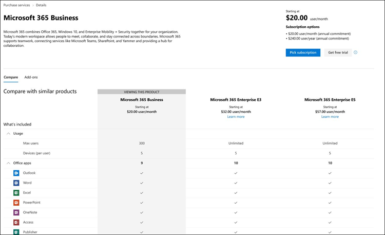
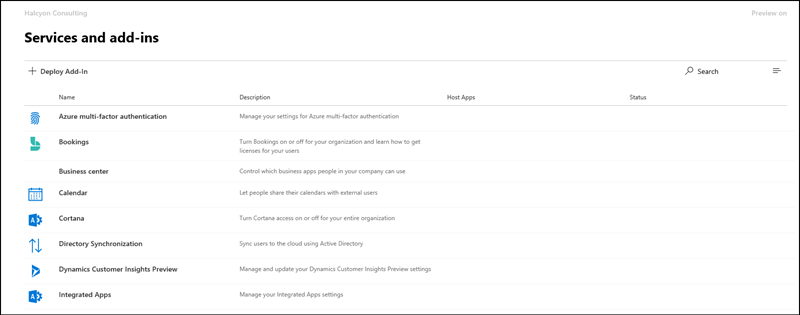
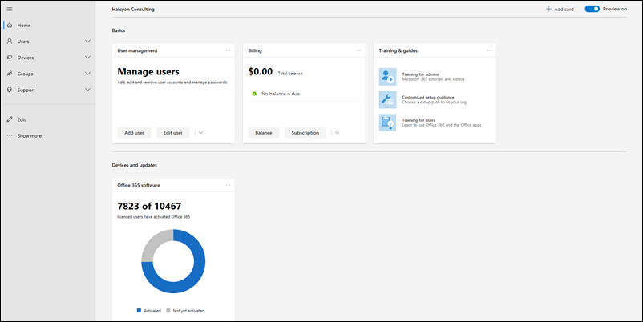
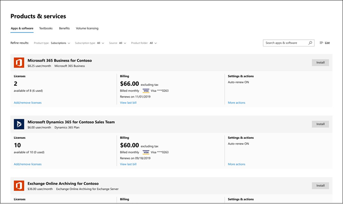
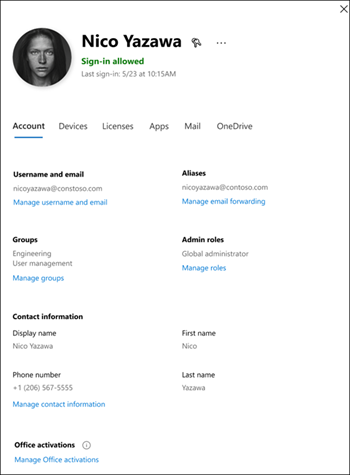

# Neuerungen im Microsoft 365 Admin CenterWhat's new in the Microsoft 365 admin center

Wir fügen [dem Microsoft 365 Admin Center](microsoft-365-admin-center-preview.md)ständig neue Features hinzu, beheben Probleme, die wir kennen, und machen Änderungen basierend auf Ihrem Feedback.We're continuously adding new features to [the Microsoft 365 admin center](microsoft-365-admin-center-preview.md), fixing issues we learn about, and making changes based on your feedback. Sehen Sie sich unten an, was heute für Sie verfügbar ist.Take a look below to see what's available for you today. Einige Funktionen werden für unsere Kunden mit unterschiedlichen Geschwindigkeiten bereit gesetzt.Some features get rolled out at different speeds to our customers. Wenn Sie noch kein Feature sehen, versuchen Sie, [sich der zielgerichteten Version hinzuzufügen](manage/release-options-in-office-365.md).If you aren't seeing a feature yet, [try adding yourself to targeted release](manage/release-options-in-office-365.md).

Wenn Sie an Neuigkeiten in anderen Verwaltungszentren interessiert sind:And if you're interested in what's new in other admin centers:

- [Neuerungen im Microsoft 365 Compliance CenterWhat's new in the Microsoft 365 compliance center](https://docs.microsoft.com/Office365/SecurityCompliance/whats-new)
- [Neuerungen im SharePoint Admin CenterWhat's new in the SharePoint admin center](https://docs.microsoft.com/sharepoint/what-s-new-in-admin-center)

## Januar 2020-Happy New Year!January 2020 - Happy New Year!

> [!NOTE]
> Wussten Sie, dass es ein [Neuerungen in der Microsoft 365](https://go.microsoft.com/fwlink/p/?linkid=2118096) -Videoreihe auf YouTube gibt?Did you know that there's a [What's New in Microsoft 365](https://go.microsoft.com/fwlink/p/?linkid=2118096) video series on YouTube? Es werden die neuesten Features hervorgehoben, die für die Benutzer bereit stehen.It highlights the latest features that we've rolled out to users. Jeden Monat beginnen wir mit der Verknüpfung mit der neuesten Episode im Abschnitt [Videos, Schulungen und Dokumente](#videos-training-and-docs) .Every month, we'll start linking to the latest episode in the [Videos, training, and docs](#videos-training-and-docs) section.     Hier ist January's-Episode: [Januar 2020-Neuerungen in Microsoft 365](https://go.microsoft.com/fwlink/p/?linkid=2118096)Here's January's episode: [January 2020 - What's New in Microsoft 365](https://go.microsoft.com/fwlink/p/?linkid=2118096)

### Dunkler ModusDark mode

Wenn wir den dunklen Modus zum ersten Mal ausgeführt haben, war er nur auf der Startseite verfügbar.When we first rolled out dark mode, it was only available on the Home page. Der dunkle Modus ist jetzt nicht mehr in der Vorschau und wird für die meisten Seiten im Admin Center in einer gezielten Version veröffentlicht.Dark mode is now out of preview and is in Targeted release across most pages in the admin center.

1. Zunächst müssen Sie Targeted Release aktivieren: Wechseln Sie zu **Einstellungen** \> \*\*\*\* \> Einstellungen **Organisationsprofil** \> - **Freigabe**Einstellungen.First, you'll need to turn on Targeted Release: Go to **Settings** \> **Settings** \> **Organization profile** \> **Release preferences**. 
1. Um dann den dunklen Modus zu aktivieren, wechseln Sie zur **Start** Seite, und wählen Sie dann die Schaltfläche **dunkler Modus** aus.And then to turn on dark mode, go to the **Home** page, and then select the **Dark mode** button. (Er befindet sich neben dem **Suchfeld** und diesem Artikel **What es New** Link.)(It's next to the **Search** field and this article's **What's new** link.)
1. Für jede Seite, auf der der dunkle Modus verfügbar ist, befindet sich die Schaltfläche oben auf der Seite neben **dem neuen Admin Center** -Toggle.For any page that has dark mode available, the button is at the top of the page, next to **The new admin center** toggle.

### Office What es New ManagementOffice What's New management

Administratoren möchten steuern, wie Microsoft "What es New" für Ihre Benutzer in den Office-Apps kommuniziert – und Sie verfügen nun über diese Kontrolle.Admins want control over how Microsoft communicates "What's New" to their users in the Office apps - and you now have that control. Wechseln Sie zu **Einstellungen** \> in **Office What es New Management Preview**.Go to **Settings** \> **Office What's New management Preview**. Wählen Sie ein Feature aus, um die Details anzuzeigen, und klicken Sie dann auf die Schaltfläche **von Benutzern ausblenden** , wenn Sie nicht möchten, dass Ihre Benutzer eine bestimmte Nachricht "What es New" anzeigen können.Select a feature to view its details, and then you can select the **Hide from users** button if you don't want your users to see a particular "what's new" message. Beispielsweise kann es sein, dass Ihre Organisation darauf wartet, dass Benutzer über ein Feature informiert werden, bis alle Personen in Ihrer Organisation darauf geschult sind.For example, your organization might be waiting to let users know about a feature until everyone in your org is trained on it.

Dieses Feature wurde erstmals für die Vorschau im November veröffentlicht, aber es wurden einige Feature-Updates vorgestellt, die Sie kennen sollten: [Office What es New Management Preview Updates now available](https://techcommunity.microsoft.com/t5/microsoft-365-blog/office-what-s-new-management-preview/ba-p/1020438)This feature was first released to preview in November, but there have been a few feature updates that you should know about: [Office What's New management preview updates now available](https://techcommunity.microsoft.com/t5/microsoft-365-blog/office-what-s-new-management-preview/ba-p/1020438)

### PartnerPartners
Howdy, Partner!Howdy, Partners! (Konnte mir nicht helfen.) Wir haben auch in diesem Monat ein Update für Sie.(Couldn't help myself.) We've got an update for you this month, as well. Es gibt ein neues Feature, das es Partnern ermöglicht, CSP-Kunden die Möglichkeit zu geben, Ihre Microsoft-Kundenvereinbarung (MCA) im Abschnitt " **Abrechnungskonten** " des Admin Centers anzunehmen.There's a new feature that allows Partners to give CSP customers the option to accept their Microsoft Customer Agreement (MCA) in the **Billing accounts** section of the admin center. In dieser neuen Erfahrung:In this new experience:

1. Der Kunde erhält eine Einladungs-e-Mail mit einem Link, um die Partnerbeziehung und das MCA zu akzeptieren.The customer receives an invitation email with a link to accept the partner relationship and the MCA.
2. Nachdem sich der Kunde angemeldet hat, kann er die MCA-und Partner Berechtigungen-rechts über das Admin Center anzeigen und akzeptieren.After the customer signs in, they can view and accept the MCA and partner permissions - right from the admin center.

### RessourcenpostfächerResource mailboxes

Die Liste mit den Ressourcenpostfächern wurde auf die neue Formatvorlage aktualisiert.The Resource mailboxes list has been updated to the new style. Wechseln Sie im Microsoft 365 Admin Center zu **Ressourcen** \> **Räume & Equipment**.In the Microsoft 365 admin center, go to **Resources** \> **Rooms & equipment**.

### Videos, Schulungen und DokumenteVideos, training, and docs

Schauen Sie sich die Administratoren Schulung für kleine Unternehmen an, die wir im Januar veröffentlicht haben:Check out the small business admin training that we released in January:

- [Erstellen Ihrer Website für UnternehmenCreate your business website](https://support.office.com/article/3325d50e-d131-403c-a278-7f3296fe33a9)
- [Suchen nach Antworten und HilfeFind answers and help](https://support.office.com/article/7f681212-c649-4a3e-a43b-32b1d1e58988)
- [Hilfe oder Support erhaltenGet help or support](https://support.office.com/article/18948a4c-3eb1-4b30-b1bc-a4cc29eb7655)
- [Benutzer löschenDelete a user](https://support.office.com/article/6bcdad7b-732a-4260-997a-8c176bc3d9d6)
- [Auswählen eines Microsoft-AbonnementsChoose a Microsoft subscription](https://support.office.com/article/b9f7c78e-430f-4117-89ec-2eeb1dced2ca)
- [Übersicht über Microsoft 365 Business SecurityOverview of Microsoft 365 Business security](https://support.office.com/article/3274b159-a825-46d7-9421-7d6e209389d1)

## November und Dezember 2019November and December 2019

Wir kombinieren die Neuigkeiten von November und Dezember, da wir nach dem entzünden nur sehr wenige Ankündigungen zu machen hatten.We're combining November's and December's news because after Ignite we had very few announcements to make. Wir sehen uns im neuen Jahr!See you in the new year!

### Wechsel von der Kreditkarte zur RechnungszahlungChange from credit card to invoice payment

Wir beginnen mit dem Rollout der Möglichkeit, Ihre Zahlungsmethode von Kreditkarte zu einer Rechnung zu ändern.We've starting to roll out the ability to change your payment method from credit card to an invoice. Wechseln Sie zu **Abrechnungs** \> **Produkte & Dienste**, wählen Sie ein Abonnement aus, und wählen Sie dann den Link **Bearbeiten** neben der Kreditkartenzahlung aus.Go to **Billing**\> **Products & services**, select a subscription, and then select the **Edit** link next to the credit card payment.

Möchten Sie mehr darüber erfahren?Want to read more about it? [Ändern von Kreditkarten-oder Bankkonten auf RechnungChange from credit card or bank account to invoice](../commerce/billing-and-payments/change-payment-method.md#change-from-credit-card-or-bank-account-to-invoice)

### Globaler LeserGlobal reader

Wir haben die Rolle des globalen Lesers in der [Oktober 2019-Ignite-Edition](#october-2019---ignite-edition)erwähnt, aber da Sie im allgemeinen weiter kommt, lassen Sie uns einige Details besprechen:We mentioned the Global reader role in the [October 2019 - Ignite Edition](#october-2019---ignite-edition), but as it’s rolling out more broadly, let’s discuss some details:

- Die globale Leserrolle ist das schreibgeschützte Pendant zur globalen Administratorrolle.The Global reader role is the read-only counterpart to the Global admin role. Der globale Leser kann alles sehen, wozu der globale Administrator berechtigt ist.The Global reader can see everything that the Global admin has permission to do.
- Mit einigen wenigen Ausnahmen, wie einige Compliance-und Sicherheitsfunktionen, haben globale Leser Zugriff auf alle Microsoft Cloud-Verwaltungszentren, die Ihre Organisation für die Verwendung lizenziert hat.With a few exceptions, like some compliance and security features, Global readers have access to view all of the Microsoft cloud admin centers that your org is licensed to use.
- Zuweisen der globalen Leserrolle zu Benutzern, die Sie für die Planung, Überwachung und Untersuchung benötigen.Assign the Global reader role to users who need it for planning, audits, and investigations.
- Sie können auch die globale Leserrolle mit einer anderen Rolle kombinieren, die über weniger Berechtigungen verfügt.You can also combine the global reader role with another role that has fewer permissions. Beispielsweise kann einem Besitzer eines kleinen Unternehmens die**globalen Leser** Rollen für die **Fakturierungs Verwaltung** + zugewiesen werden, damit er die Rechnungen bezahlen und die Änderungen an der Cloud-Organisation übernehmen kann.For example, a small business owner might be assigned the **Billing admin** + **Global reader** roles so that they can pay the bills and stay on top of changes to their cloud organization.
- Globale Leser können auf eine beliebige Seite im Microsoft 365 Admin Center wechseln.Global readers can go to any page in the Microsoft 365 admin center. Wenn Sie eine bearbeitbare Seite öffnen, wird oben eine Warnung angezeigt, die besagt, dass Sie keine Berechtigung zum Speichern von Änderungen haben, und die Schaltfläche Speichern wird deaktiviert.When they open an editable page,  there will be a warning at the top telling them that they don't have permission to save changes, and the save button will be disabled.

Wir würden uns freuen, Ihr Feedback über die globale Leserrolle und alle rollenbasierten Berechtigungen zu erhalten, die Sie in Zukunft sehen möchten.We’d love to get your feedback about the global reader role and any of the role-based permissions that you’d like to see in the future. [Feedback für rollenbasierte Berechtigungen erteilenGive feedback for role-based permissions](https://office365.uservoice.com/forums/273493-office-365-admin/suggestions/10115430-have-a-consistent-experience-when-assigning-admin)

### Seite "neue Einstellungen"New Settings page

Das **Organisationsprofil**, die **Sicherheit & Datenschutz**und **Dienste & Add-ins-** Seiten wurden alle zu einer Seite mit drei vertikalen Registerkarten kombiniert.The **Organization profile**, **Security & privacy**, and **Services & add-ins** pages have all been combined into one page with 3 vertical tabs. Und der beste Teil – von einem einzigen Standort aus können Sie nun nach allen Einstellungen suchen.And the best part -- from one single location, you can now search for all settings.

### Schulungs &-DokumenteTraining & Docs

Dieser Abschnitt ist ein neues Feature in diesem Artikel, in dem wir mit der Verknüpfung zu neuer Schulung und Dokumentation beginnen, die wir für interessant halten.This section is a new feature of this article, where we'll start linking to new training and documentation that we think you will find interesting.

Im November haben wir einige Lern Pfade zur [Microsoft Learn](https://docs.microsoft.com/learn/) -Website veröffentlicht, damit IT-Experten mehr über Microsoft 365 erfahren und geschult werden können.In November, we released quite a few learning paths to [Microsoft Learn](https://docs.microsoft.com/learn/) website to help IT pros learn about and get trained on Microsoft 365. Check them out:Check them out:

- [Microsoft 365 GrundlagenMicrosoft 365 fundamentals](https://docs.microsoft.com/learn/paths/m365-fundamentals/)
- [Erweitern von Office-GrundlagenExtend Office fundamentals](https://docs.microsoft.com/learn/paths/extend-office-fundamentals/)
- [Microsoft 365 – Modernisieren ihrer Unternehmensbereitstellung mit Windows 10 und Office 365 ProPlusMicrosoft 365 - Modernize your enterprise deployment with Windows 10 and Office 365 ProPlus](https://docs.microsoft.com/learn/paths/m365-getmodern/)
- [Verwalten Sie Ihre Unternehmensbereitstellung mit Microsoft 365Manage your enterprise deployment with Microsoft 365](https://docs.microsoft.com/learn/paths/manage-enterprise-deployment-m365/)
- [Maßgeschneidertes Upgrade von Microsoft Office für ITUpgrade Microsoft Office for IT at scale](https://docs.microsoft.com/learn/paths/m365-office-for-it/)
- [Übertragen von Remotedesktops und Apps aus Azure mit Windows Virtual DesktopDeliver remote desktops and apps from Azure with Windows Virtual Desktop ](https://docs.microsoft.com/learn/paths/m365-wvd/)
- [Modernisieren Ihres Arbeitsplatzes mit Microsoft 365 und Surface for BusinessModernize your workplace with Microsoft 365 and Surface for Business](https://docs.microsoft.com/learn/paths/modernize-workplace-with-m365-and-surface/)
- [Schutz von Identität und Zugriff mit Microsoft 365Protect identity and access with Microsoft 365](https://docs.microsoft.com/learn/paths/m365-identity/)
- [Schützen von Unternehmensinformationen mit Microsoft 365Protect enterprise information with Microsoft 365](https://docs.microsoft.com/learn/paths/m365-information-protection/)
- [Verwalten der Sicherheit mit Microsoft 365Manage security with Microsoft 365](https://docs.microsoft.com/learn/paths/m365-security-management/)
- [Vertrauen Sie auf Microsoft 365 und Microsoft Threat Protection, um Ihre Umgebung zu schützenDefend against threats with Microsoft 365 and Microsoft threat protection](https://docs.microsoft.com/learn/paths/m365-security-threat-protection/)
- [Verwalten der Zusammenarbeit im Team mit Microsoft TeamsManage team collaboration with Microsoft Teams](https://docs.microsoft.com/learn/paths/m365-manage-team-collaboration/)
- [Zusammenarbeit mithilfe von SharePoint in Microsoft 365Collaborate with SharePoint in Microsoft 365](https://docs.microsoft.com/learn/paths/m365-teams-sharepoint/)

## Oktober 2019-Ignite EditionOctober 2019 - Ignite Edition

Willkommen bei der Ignite-Edition von What es New in the Microsoft 365 Admin Center!Welcome to the Ignite Edition of the What's new in the Microsoft 365 admin center! Dies ist natürlich keine vollständige Liste von Ankündigungen, aber hier einige Highlights.Of course, this isn't a complete list of announcements, but here are a few highlights. Lesen Sie auch die Ignite-Blogs, um weitere Informationen zu Releases zu erhalten:Also, check out the Ignite blogs for more great info about releases:

- [Administrator-Sicherheit, Produktivität und Netzwerkverbesserungen für Microsoft 365](https://techcommunity.microsoft.com/t5/Microsoft-365-Blog/ADMIN-Security-Productivity-and-Network-Enhancements-for/ba-p/964019).[ADMIN - Security, Productivity, and Network Enhancements for Microsoft 365](https://techcommunity.microsoft.com/t5/Microsoft-365-Blog/ADMIN-Security-Productivity-and-Network-Enhancements-for/ba-p/964019).
- [Neuerungen in Microsoft Teams-Ignite 2020](https://techcommunity.microsoft.com/t5/Microsoft-Teams-Blog/What-s-New-in-Microsoft-Teams-Ignite-2019/ba-p/937025).[What's New in Microsoft Teams - Ignite 2020](https://techcommunity.microsoft.com/t5/Microsoft-Teams-Blog/What-s-New-in-Microsoft-Teams-Ignite-2019/ba-p/937025).

### Rollenbasierte ZugriffssteuerungRole-based access control 

Es wurden viele Änderungen für Rollen im Admin Center vorgenommen, seit wir im Juni mit dem Rollout begonnen haben:There have been a lot of changes for Roles in the admin center since we started rolling out in June:

- **Rollen vergleichen** – wählen Sie bis zu 3 Rollen aus, um die Berechtigungen für jeden zu vergleichen.**Compare roles** - Select up to 3 roles to compare the permissions for each one. Auf diese Weise können Sie die am wenigsten freizügige Rolle finden, die Sie Benutzern zuweisen können.This will help you find the least permissive role to assign to users. Wechseln Sie zu **Rollen**, verwenden Sie das Kontrollkästchen Mehrfachauswahl in der ersten Spalte, um bis zu drei Rollen auszuwählen, und wählen Sie dann **Rollen vergleichen**aus.Go to **Roles**, use the multi-select checkbox in the first column to choose up to 3 roles, and then select **Compare roles**.

    

- **Favoriten** – Sie können Ihren bevorzugten oder am häufigsten verwendeten Rollen einen Stern hinzufügen, damit Sie diese leicht finden können, indem Sie die Spalte sortieren oder einen Filter erstellen.**Favorites** - You can add a star to your favorite or most-used roles, so that you can easily find them by sorting the column or creating a filter.
- **Aktive Benutzer** > **Rollen verwalten** – diese wurde so aktualisiert, dass Sie mit den Änderungen in den Rollen übereinstimmt.**Active users** > **Manage roles** - This has been updated to align with the changes in Roles. Wie bei der Rollenliste haben wir die Standardliste der Rollen auf den nützlichsten Bereich beschränkt, aber Sie können alle Rollen anzeigen, indem Sie **Alle anzeigen nach Kategorie**erweitern.As with the Roles list, we've scoped the default list of roles to the most useful, but you can see all roles by expanding **Show all by category**.
- **Globale Leserrolle** -Sie haben ihn gefragt.**Global reader role** - You asked for it! Du hast es!You got it! Die [globale Leser](add-users/about-admin-roles.md#roles-available-in-the-microsoft-365-admin-center) Rolle!The [Global reader](add-users/about-admin-roles.md#roles-available-in-the-microsoft-365-admin-center) role!

### Melden eines ProblemsReport an issue

Der Dienststatus wurde auf den neuen Stil aktualisiert, und wenn Sie von einem Problem betroffen sind, das nicht auf Ihrem Service-Integritäts Dashboard angezeigt wird, können Sie **ein Problem melden** , um es Microsoft mitzuteilen.Service health has been updated to the new style and if you are impacted by an issue that is not showing up on your Service health dashboard, you can **Report an issue** to let Microsoft know. Wechseln Sie zu **Integritäts** > **Dienst-Integrität**.Go to **Health** > **Service health**.

### "Virale" Abonnements"Viral" subscriptions

Wie Sie wissen, können Benutzer kostenlose Abonnements für eine Vielzahl von Produkten wie Power BI und App Connect aktivieren.As you know, users can turn on free subscriptions to a myriad of products like Power BI and App Connect. Nun können Sie die "Viral Subscriptions" sehen, die Ihre Benutzer versucht haben.You can now see the "viral subscriptions" that your users have been trying. Wechseln Sie zu **Abrechnungs** > **Produkte & Dienste**.Go to **Billing** > **Products & services**. Wählen Sie auf der Registerkarte Abonnements den **Kontotyp** Filter aus, um die vom Benutzer erworbenen Abonnements anzuzeigen.Select the **Account type** filter on the subscriptions tab to see the user-purchased subscriptions. Bei Bedarf haben Sie nun die Möglichkeit, diese Abonnements aus Ihrem Konto zu entfernen.If needed, you now have the ability to remove these subscriptions from your account.

### BenutzervorlagenUser templates

Mithilfe von Vorlagen können Sie ganz einfach viele Benutzer hinzufügen, indem Sie die freigegebenen Einstellungen für diese Benutzer speichern und wieder verwenden.Templates allow you to easily add many users by saving and reusing the shared settings for these users. Sie können Werte für Rollen, zugewiesene Lizenzen, Kontaktinformationen, Standort und vieles mehr speichern.You can save values for roles, licenses assigned, contact information, location, and more. Wenn Sie die Vorlage verwenden, um einen neuen Benutzer zu erstellen, wird automatisch der gespeicherte Wert für diese Einstellungen abgerufen.When you use the template to create a new user, they will automatically get the saved value for these settings. Wechseln Sie zu **Benutzer** > **aktive Benutzer**, und wählen Sie dann **Benutzervorlagen** aus, um es auszuprobieren.Go to **Users** > **Active users**, and then select **User templates** to try it out.

### Office "What es New"-Verwaltung (Vorschau)Office "What's New" management (Preview)
Wenn ein wichtiges Office-Feature für eine Office-App freigegeben wird, erhalten Benutzer eine "What es New"-Karte, um mehr über das neue Feature zu erfahren.When an important ‎Office‎ feature is released to an Office app, users will get a "What's new" card to learn about the new feature. Wenn Sie nicht möchten, dass Benutzer die Karte sehen, können Sie Sie ausblenden.If you don't want users to see the card, you can hide it. Sie können auch auswählen, wann die Benutzer die Karte anzeigen möchten.You can also choose when you'd like users to see the card by showing it. Wechseln Sie zu **Einstellungen** > **Office What es New Management** , um es zu überprüfen.Go to **Settings** > **Office What's New management** to check it out.

### Änderung der SharePoint-URLSharePoint URL change
Technisch gesehen ist dies nicht die Nachricht von Microsoft 365 Admin Center, aber wir sind so aufgeregt, dass Sie diese Nachricht sehen wollten:Technically, this isn't the Microsoft 365 admin center's news to tell, but we're so excited we wanted to make sure you see this news:
> [!IMPORTANT]
> Sie können nun mit einer regulären URL zum SharePoint Admin Center gelangen:https://admin.microsoft.com/SharePointYou can now get to the SharePoint admin center with a regular URL: https://admin.microsoft.com/SharePoint

Weitere Informationen finden Sie unter [What es New in the SharePoint Admin Center](https://docs.microsoft.com/sharepoint/what-s-new-in-admin-center)For more info, see [What's new in the SharePoint admin center](https://docs.microsoft.com/sharepoint/what-s-new-in-admin-center)

## September 2019September 2019

Wir bieten einige aufregende Feature-Releases bei Ignite 2019 an, daher werden nur einige neue Features angekündigt, die im September veröffentlicht wurden.We are ramping up for some exciting feature releases at Ignite 2019, so we're only announcing a few new features that were released in September. Bleiben Sie aber für den Artikel im nächsten Monat dran, es wird am ersten Tag von Ignite veröffentlicht!But stay tuned for next month's article, it'll be published on the first day of Ignite!

### Featured Feedback Fix – die Option, das Postfach des gelöschten Benutzers in ein freigegebenes Postfach zu konvertieren, ist zurück!Featured Feedback Fix – The option to convert the deleted user’s mailbox to a shared mailbox is back!

Wir haben Ihr Feedback laut und deutlich gelesen, und wir haben die Möglichkeit zurückgegeben, anderen Benutzern Zugriff auf das Postfach eines gelöschten Benutzers zu gewähren, indem Sie es in ein **freigegebenes Postfach**konvertieren.We heard your feedback loud and clear and we brought back the ability to give someone else access to a deleted user’s mailbox by converting it to a **shared mailbox**. Durch das Hinzufügen dieses zurück zum Assistenten zum Löschen von Benutzern können Sie entscheiden, was mit den Daten geschieht:Adding this back to the delete user wizard lets you decide what to do with the data:

- E-Mail: erteilen Sie einem anderen Benutzer Zugriff auf das Postfach des gelöschten Benutzers, indem Sie es in ein freigegebenes Postfach konvertieren.Email: Give someone else access to the deleted user's mailbox by converting it to a shared mailbox.
- Dateien: Speichern Sie Ihre OneDrive-Dateien, und geben Sie jemand anderen Zugriff.Files: Save their OneDrive files and give someone else access.
- Berechtigungen: Entfernen von Berechtigungen, wenn andere Benutzer Zugriff auf dieses Postfach hatten.Permissions: Remove permissions if others had access to this mailbox.
- Aliase: Entfernen Sie e-Mail-Aliase, damit Sie für einen anderen Benutzer sofort verwendet werden können.Aliases: Remove email aliases so they are available to use for another user right away.

### ErsteinrichtungInitial setup

Es wurde ein anderer unserer anfänglichen Setup-Assistenten aktualisiert: Microsoft 365 for Business.There's been an update to another of our initial setup wizards: Microsoft 365 for business. Die Schritte wurden gestrafft, und wir haben zwei der Einrichtungsaufgaben in die Setup Seite verschoben:The steps have been streamlined and we've moved two of the set up tasks into the Setup page:

- **Sichere Windows 10-Computer** – Einrichten von Richtlinien zum besseren Schutz Ihrer Windows 10-Geräte vor Viren, Schadsoftware und Angriffen durch Hacker.**Secure Windows 10 computers** - set up policies to better protect your Windows 10 devices from viruses, malware, and attacks by hackers.
- **Office automatisch installieren** – Wenn Sie dies aktivieren und Benutzer ihre PCs mit Microsoft 365 Business verbunden haben, werden Ihre Computer automatisch auf die neuesten Office-Apps aktualisiert – und bleiben auf dem neuesten Stand.**Automatically install Office** - When you turn this on and users have connected their PCs to Microsoft 365 Business, their computers will automatically update to the latest Office apps - and stay up to date.

## August 2019August 2019

### AbrechnungBilling

Wir haben einige Updates für Abrechnung und Abonnements in diesem Monat:We've got some updates for billing and subscriptions this month:

- Gerätebasierte Abonnements: Sie können **Office 365 ProPlus-Lizenzen (Geräte) für** Geräte im Microsoft 365 Admin Center zuweisen oder aufheben.Device-based subscriptions: You can assign or unassign **Office 365 ProPlus for Education (device)** licenses to devices in the Microsoft 365 admin center. **Office 365 ProPlus für Education (Gerät)** ist eine Add-on-Lizenz, mit der Sie einem Gerät eine Lizenz zuweisen können.**Office 365 ProPlus for Education (device)** is an add-on license that will lets you to assign a license to a device. Wechseln Sie zu **Abrechnungs** > **Produkte & Dienste** , um die Lizenz zu suchen und zu erwerben.Go to **Billing** > **Products & services** to find and purchase the license.
- Benutzerbasierte Lizenzverwaltung: Wir haben die Art und Weise aktualisiert, in der **Benutzer** > **aktive Benutzer** der neuen Formatvorlage Lizenzen zuweisen.User-based license management: We've updated how you assign licenses in **Users** > **Active users** to the new style. Weitere Informationen finden Sie unter:For more information, see:
    - [Zuweisen von Lizenzen für BenutzerAssign licenses to users](manage/assign-licenses-to-users.md)
    - [Entfernen der Zuweisung von BenutzerlizenzenUnassign licenses from users](manage/remove-licenses-from-users.md)

### Setup SeitenaktualisierungenSetup page updates

Das Setup enthält jetzt Kategorien und Abschnitte, einschließlich eines **für Sie empfohlenen** Abschnitts, in dem wir Intelligent einen nächsten Schritt beim Aktivieren von Features und beim Einrichten Ihrer Organisation vorschlagen.Setup now has categories and sections, including a **Recommended for you** section where we intelligently suggest your next step in turning on features and setting up your organization. Außerdem haben wir ein neues Feature hinzugefügt, um Folgendes einzurichten:We've also added a new feature to set up:

- **Office Advanced Threat Protection** – Wenn Ihre Organisation für die Verwendung von Office ATP lizenziert ist und Sie Sie noch nicht konfiguriert oder aktiviert haben, wird diese Seite angezeigt.**Office Advanced Threat Protection** - If your org is licensed to use Office ATP and you haven't configured it or turned it on yet, you'll see this page. Wechseln Sie zu **Setup** , um es zu testen.Go to **Setup** to try it out.

### Melden eines ProblemsReport an issue

Wenn Sie von einem Problem betroffen sind, das nicht auf Ihrem Service-Integritäts Dashboard angezeigt wird, bietet Ihnen das Feature **Bericht ein Problem** eine schnelle und einfache Möglichkeit, uns Bescheid zu geben.If you are impacted by an issue that is not showing up on your Service health dashboard, the **Report an issue** feature will provide you with a quick and easy way to let us know. Wechseln Sie zu **Integritäts** > **Dienst-Integrität**.Go to **Health** > **Service health**.

## Juli 2019July 2019

### NachrichtencenterMessage center

Das Nachrichtencenter wurde auf das neue Design aktualisiert, und es sieht fantastisch aus!The Message center has been updated to the new design and it looks amazing! 

- Sie können jetzt **Nachrichten nach Status**anzeigen.You can now view **Messages by status**. Wählen Sie einfach eine der Registerkarten aus: **alle aktiven Nachrichten**, **hohe Wichtigkeit**, **Ungelesene nach**richten und **abgewiesene Nachrichten**.Just select one of the tabs: **All active messages**, **High importance**, **Unread messages**, and **Dismissed messages**.
- Sie können auch nach Kategoriedaten- **Datenschutz**filtern, **Änderungen planen**, **Probleme verhindern oder beheben**und **informierte** Nachrichtenkategorien bleiben.You can also filter by category **Data privacy**, **Plan for change**, **Prevent or fix issues**, and **Stay informed** message categories.
- Wählen Sie eine Nachricht aus der Liste aus, und Sie haben einige Optionen in der Befehlsleiste: **verwerfen**, **als gelesen markieren** oder **als ungelesen**markieren oder **Freigeben**.Select a message from the list and you have a few options in the command bar: **Dismiss**, **Mark as read** or **Mark as unread**, or **Share**. 
- Wenn Sie eine Nachricht öffnen, haben Sie noch weitere Optionen:And when you open a message, you have even more options:
    - Kopieren Sie einen Link der Nachricht in Ihre Zwischenablage, um ihn später zu speichern oder um ihn für Kollegen freizugeben.Copy a link of the message to your clipboard to save it for later or to share it with colleagues. 
    -  Nachrichten als **gelesen** oder **Ungelesen**markieren.Mark messages as **Read** or **Unread**. 
    -  Geben Sie Feedback zu einer Nachricht durch Auswählen von **like** oder **dislike**wird ein Feedback Bereich geöffnet, in dem Sie aufgefordert werden, ein bestimmtes Feedback zu den Informationen zu erhalten, die Ihnen bei dieser Nachricht gefallen oder nicht gefällt haben.Give feedback about a message by selecting **Like** or **Dislike**, a feedback pane opens asking you to provide specific feedback on what you liked or didn't like about this message.

### Intelligence für den NavigationsbereichNavigation pane intelligence

 Der Navigationsbereich merkt sich nun ihre letzten Aktionen und zeigt den Bereich im letzten Zustand an, in dem Sie ihn hinterlassen haben.The navigation pane now remembers your last actions and shows you the pane in the last state that you left it in. Außerdem werden häufig verwendete Elemente standardmäßig sichtbar gemacht.It will also make frequently used items visible by default.

### Erst Setup & der Seite "Setup"Initial setup & the Setup page
Wir haben einige interessante Änderungen, die Ihnen helfen, Ihre Organisation einzurichten.We've got some exciting changes to help you get your organization set up. Lassen Sie uns zunächst den Unterschied zwischen **Setup** und **Setup Seite**besprechen.First off, let's discuss the difference between **setup** and the **Setup page**. **Setup** bezieht sich auf den anfänglichen Setup-Assistenten, den Sie für die Onlinedienste von Microsoft an Bord verwendet haben.**Setup** refers to the initial setup wizard that you used to onboard to Microsoft's online services. Dies umfasst normalerweise drei spezifische Schritte: **Verbinden einer Domäne**, **Hinzufügen von Benutzern**und **herunterladen der Office-Apps**.That usually includes three specific steps: **Connect a domain**, **Add users**, and **Download the Office apps**. Die Seite **Setup** ist die Seite im Admin Center, die die Einrichtung von Aufgaben empfohlen hat, um sicherzustellen, dass Sie Ihre Abonnements optimal nutzen – wie das Aktivieren von Features, für die Sie Lizenzen erworben haben.The **Setup page** is the page in the admin center that has recommended set up tasks to ensure that you're getting the most out of your subscriptions - like turning on features you've purchased licenses for.

- **Setup** – der anfängliche Setup-Assistent wurde für **Office 365 for Business** -Abonnements aktualisiert.**Setup** - The initial setup wizard has been updated for **Office 365 for Business** subscriptions. Dieses neue Design hilft neuen Organisationen, den Assistenten schneller und mit größerer erfolgreiche durch zugewinnen.This new design will help new organizations get through the wizard faster and with greater success.
- **Seite "Setup** " – die **Setup** Seite unterstützt Sie beim Abschließen der Einrichtung und Sicherung der Dienste, die mit ihren Abonnements geliefert werden.**Setup page** - The **Setup** page helps you finish setting up and securing the services that come with your subscriptions. Auf der Seite **Setup** werden auch alle abgewiesenen Empfehlungen angezeigt.You can also see any dismissed recommendations on the **Setup** page. Um zu sehen, ob Sie noch für Ihre Abonnements verfügbar ist, wechseln Sie zum **Microsoft 365 Admin Center** > -**Setup**.To see if it's available for your subscriptions yet, go to the **Microsoft 365 admin center** > **Setup**.

### Abrechnungs & AbonnementsBilling & subscriptions

- **Software** Produkttyp – Sie können jetzt Softwareprodukte anzeigen, die über einen Anbieter von Cloud-Diensten (Service Provider, CSP) erworben wurden.**Software** product type - You can now view software products purchased through a Cloud Service Provider (CSP). Um Ihre Downloads und Schlüssel anzuzeigen, wechseln Sie zur Registerkarte **Abrechnungs** > **Produkte & Dienste** > -**Software** .To see your downloads and keys, go to **Billing** > **Products & services** > **Software** tab.
- Sie können moderne Azure-Produkte und-Dienste im Microsoft 365 Admin Center anzeigen, unabhängig davon, ob Sie Sie von Microsoft oder einem Drittanbieter erworben haben.You can view Modern Azure products and services from the Microsoft 365 admin center, whether you purchased them from Microsoft or a third-party provider. Beispiele für moderne Azure-Produkte enthalten:Examples of Modern Azure products included:
    - Azure reservierte virtuelle InstanzenAzure Reserved Virtual Instances
    - Azure-Support PläneAzure Support Plans
    - Azure Hybrid use Benefits (AHUB)Azure Hybrid Use Benefits (AHUB)
    - Verwalten von AnwendungenManage Applications
    - Geräte DiensteDevice Services
    - Azure-AbonnementsAzure Subscriptions

### Vereinfachung der mehrstufigen AuthentifizierungSimplify multi-factor authentication

Administratoren haben Zugriff auf vertrauliche Informationen in Ihrer Organisation.Admins have access to sensitive information in your organization. Erfordern, dass alle Administratoren bei der Anmeldung mehrstufige Authentifizierung verwenden.Require all admins to use multi-factor authentication when signing in. Der neue Assistent hilft Ihnen, es mit nur einem Schritt zu erledigen.The new wizard helps you get it done with just one step. Um es auszuprobieren, gehen Sie zu **Setup** > **verstärken der Anmeldungssicherheit**.To try it out, go to **Setup** > **Strengthen sign-in security**.

### BenutzerUsers

Die Seiten " **Gelöschte Benutzer** " und " **Gastbenutzer** " wurden auf die neue Formatvorlage aktualisiert.The **Deleted users** and **Guest users** pages were updated to the new style.

- **Gastbenutzer**: Sie fügen Gastbenutzer hinzu, indem Sie Sie zum Anzeigen oder Freigeben von Dateien aus SharePoint oder OneDrive einladen.**Guest users**: You add guest users by inviting them to view or share files from SharePoint or OneDrive. Sie können Gastbenutzer von**Gast**Benutzern von **Benutzern** > anzeigen.You can view guest users from **Users** > **Guest users**.
- **Gelöschte Benutzer**: auf der Seite aktualisierte **Gelöschte Benutzer** können Sie alle Aktionen ausführen, die Sie im älteren Admin Center durchführen konnten, jetzt jedoch Spalten hinzufügen und entfernen.**Deleted users**: On the updated **Deleted users** page, you can do all the actions that you could in the older admin center, but now you add and remove columns. Und wir haben viele Spaltenoptionen zur Auswahl.And we have a lot of column options to choose from. Tatsächlich sind es die gleichen Spalten, die Sie auf der Seite " **aktive Benutzer** " auswählen können.In fact, it's the same columns that you can choose on the **Active users** page.

## Juni 2019June 2019

### Empfohlene Feedbackanforderung – dunkler ModusFeatured feedback request - Dark mode

Das Anzeigen des Admin Centers im dunklen Modus erfolgt in der Vorschau!Viewing the admin center in dark mode is in preview! Sie können es auf der **Start** Seite erst jetzt testen.You can test it out on the **Home** page only right now. Auf der **Start** Seite befindet sich die Schaltfläche **dunkler Modus** in der Befehlsleiste neben dem Link **Neuerungen** .On the **Home** page, the **Dark mode** button is in the command bar next to the **What's new** link.

### RollenverwaltungRoles management

Ende Juni begannen wir mit der Einführung neuer Methoden zum Verwalten von Administratorrollen.At the end of June we started rolling out new way to manage admin roles. Wenn es für Sie verfügbar ist, wechseln Sie zu **Rollen** > **Rollen**.When it's available for you, go to **Roles** > **Roles**. Bis dahin werfen Sie einen Blick-IT es awesome!Until then, take a look - it's awesome!
    

Dank dieser neuen Benutzeroberfläche können Sie einfacher erkennen, wer Administratorberechtigungen hat, und Rollen zuweisen, die Ihren Administratoren die richtige Zugriffsebene gewähren.This new experience makes it easier to see who has admin permissions and to assign roles that grant the right level of access to your admins. Außerdem wurden von Azure AD weitere Rollen hinzugefügt, sodass Sie keine Zeit verschwenden, an mehreren Verwaltungszentren teilhaben zu müssen.And we also added more roles from Azure AD so that you don't waste time going to multiple admin centers.
Was können Sie sonst noch tun?What else can you do here?
- Exportieren Sie eine Liste aller Administratoren in Ihrer Organisation, denen Azure Active Directory Rollen in Microsoft 365 zugewiesen sind.Export a list of all admins in your org who are assigned Azure Active Directory roles in Microsoft 365.  
- Anzeigen aller Administratoren, die einer bestimmten Rolle zugewiesen sind, hinzufügen oder Entfernen von Administratoren aus einer bestimmten Rolle, suchen nach Rollen nach Name und Stichwort und weitere Informationen dazu, was die einzelnen Rollen Benutzern ermöglichen.View all admins assigned to a specific role, add or remove admins from a specific role, search for roles by name and keyword, and learn more about what each role allows a user to do. 
- Schnelles Suchen nach einer bestimmten Rolle und Erstellen von FilternQuickly search for a specific role and create filters.

### ZahlungsmethodePayment method
Wir haben die Art und Weise aktualisiert, wie Sie Ihre Abonnements bezahlen.We've updated how you pay for your subscriptions. Wechseln Sie zu **Billing** > **Bills &** > Payments**Payment Methods**.Go to **Billing** > **Bills & payments** > **Payment methods**. Sie können Ihre Zahlungsmethoden in einer Listenansicht anzeigen.You can see your payment methods in a list view. Wählen Sie ein beliebiges Element in der Liste aus, um es zu entfernen, zu bearbeiten und einfach zu sehen, welchem Abonnement die Zahlungsmethode zugeordnet ist.Select any item in the list to remove it, edit it, and easily see which subscription that payment method is associated with.

## Mai 2019May 2019

### Mai es Featured Fix-Case-EmpfindlichkeitMay's featured fix - Case sensitivity
Wenn Sie nun nach freigegebenen Postfächern, Kontakten, Ressourcen und Postfachberechtigungen suchen, müssen bei Ihren Suchbegriffen die Groß-/Kleinschreibung nicht beachtet werden.Now when you search for shared mailboxes, contacts, resources, and mailbox permissions, your search terms don't have to be case-sensitive. 

**Benutzer-und Gruppenverwaltung** In diesem Monat haben wir " **Benutzer blockieren**", " **Kennwort zurücksetzen**", " **Kontakt** Listenansicht", " **Gruppen** -Listenansicht" und " **Gruppen** Detailseiten" auf den neuen Admin Center-Stil aktualisiert.**User and group management** This month, we updated **Block user**, **Reset password**, **Contacts** list view, **Groups** list view, and the **Groups** details pages to the new admin center style.
- In der Listenansicht neue **Gruppen** erhalten Sie umfassendere Daten zu ihren Gruppen, und Sie können die Art und Weise, wie Sie Ihre Daten sehen, anpassen, und die Gruppenliste merkt sich, wie die Daten angezeigt werden sollen.With the new **Groups** list view, you get richer data about your groups, and you can customize the way you see your data -- and the groups list remembers how you want to see your data. Beispielsweise können Sie jetzt nach **Gruppen mit Teams** filtern, um festzustellen, ob Ihre Gruppen Teil eines Teams sind, und Sie können die Spalte **Status des Teams** hinzufügen.For example, you can now filter on **Groups with Teams** to see if your groups are part of a Team and you can add the **Teams status** column.
- In der Liste "Gruppen" werden außerdem alle Verbesserungen an der Listen Erfahrung in der Benutzerverwaltung, einschließlich schnell Aktionen und der kontextbezogenen Befehlsleiste, vorgenommen.The groups list also brings with it all the improvements we made to the list experience in user management, including quick actions and the contextual command bar. 

**Empfehlungen****Recommendations** 
Möglicherweise wird in Ihrem Admin Center ein neues Empfehlungs Popup angezeigt – wir haben soeben 4 neue hinzugefügt.You might see a new recommendation pop-up in your admin center - we just added 4 new ones. Selbstverständlich werden nur Empfehlungen angezeigt, wenn wir davon ausgehen, dass Ihre Organisation davon profitiert.Of course, you'll only see recommendations if we think it will benefit your organization. Aber warten Sie nicht, bis wir Ihnen die Empfehlung zeigen-Sie können Sie aus der Kartenbibliothek hinzufügen.But don't wait until we show you the recommendation - you can add it from the card library.
- **Kennwortablauf** – es wird empfohlen, dass Kennwörter auf " **nie ablaufen**" festgelegt werden.**Password expiry** - We recommend that passwords get set to **Never expire**. Wenn Ihre Organisation eine andere Einstellung hat, wird diese Empfehlung möglicherweise nur angezeigt.And if your org has a different setting, you might just see this recommendation. 
- **Zu viele globale Administratoren** – da es sich bei den zu vielen globalen Administratoren um eine Sicherheitsbedrohung handelt, wenn Sie über mehr als 4 globale Administratoren verfügen, wird diese Empfehlung angezeigt.**Too many global admins** - Because having too many global admins is a security threat, if you have more than 4 global admins, you'll see this recommendation. Wir empfehlen Benutzern nur den Zugriff zu gewähren, den Sie benötigen, um Ihre Arbeit zu erledigen.We suggest giving users only the access they need to get their job done.
- **InTune-Geräteschutz** : Wenn Ihre Lizenzen InTune enthalten und wir feststellen, dass Sie die Einrichtung von InTune oder Ihre Geräte nicht abgeschlossen haben, wird empfohlen, dass Sie eine InTune-Richtlinie erstellen, um die Dateien Ihrer Organisation zu schützen, wenn Benutzer von ihren mobilen Geräten aus darauf zugreifen.**Intune device protection** - If your licenses include Intune and we detect that you either haven't finished setting up Intune or enrolled your devices, we'll recommend that you create an Intune policy to protect your organization's files when users access them from their mobile devices.
- **Monatliche Office-Feature-Updates** – wir haben Feedback von unseren sehr kleinen Kunden bekommen, dass Ihre Benutzer, wenn Sie monatliche Office-Feature-Updates erhalten, glücklicher sind.**Get monthly Office feature updates** - We've gotten feedback from our very small customers that when they get monthly Office feature updates, their users are  happier. Wenn Sie also ein sehr kleines Unternehmen sind und Ihre Office-Feature-Updates derzeit alle sechs Monate erhalten, wird diese Empfehlung angezeigt.So, if you're a very small business and you're currently get your Office feature updates every six months, you'll see this recommendation.

**Einstellungen****Settings**  
Was die Einstellungen anbetrifft, gibt es einige Änderungen.As for settings, there have been quite a few changes. Meistens aktualisieren Sie einfach die vorhandenen Einstellungen auf den neuen Admin Center-Stil.Mostly, just updating the existing settings to the new admin center style. Wenn wir fortfahren und neue Einstellungen hinzufügen, die Sie noch nie zuvor gesehen haben, werden wir Sie hier ansprechen.As we're moving forward and add new settings that you've never seen before, we'll start mentioning them here. Und wir haben eine vollständige Einstellung, die Sie ankündigen müssen: **moderne Authentifizierung**.And we've got one-whole setting to announce: **Modern authentication**. Ja, es gibt eine neue Einstellung zum Aktivieren der **modernen Authentifizierung**!Yes, there is a new setting to turn on **Modern authentication**! Zum Auschecken wechseln Sie zu **Einstellungen** > **Dienste & Add-ins** > **moderne Authentifizierung**.To check it out, go to **Settings** > **Services & add-ins** > **Modern authentication**.

## April 2019April 2019

Die Dinge sehen für das Admin Center gut aus.Things are looking great for the admin center. Wir haben Ihr Feedback und ihre Vorschläge gelesen und die meisten davon beantwortet, und Sie sollten wirklich alles Unternehmen, was Sie zu Herzen sagen müssen.We've been reading your feedback and suggestions, answering most of them, and really taking all you have to say to heart. Selbstverständlich arbeiten wir immer noch daran, sicherzustellen, dass alles auf die Parität mit dem alten Admin Center ausgerichtet ist.Of course, we're still doing the work to make sure everything is up to parity with the old admin center. Denken Sie daran, dass Sie bei der Einführung neuer Features möglicherweise nicht sofort darauf gelangen.And please remember - as we roll out new features, you might not get it right away.

### Featured Feature – hinzufügen von BenutzernFeatured feature - Add users

Für April haben wir den Assistenten zum **Hinzufügen von Benutzern** , der Sie durchläuft... warten Sie... Hinzufügen von Benutzern.For April, we're featuring the **Add user** wizard that walks you through...wait for it...adding users. Es ist ein Schritt-für-Schritt, um die grundlegenden Informationen des Benutzers wie e-Mail und Anzeigenamen hinzuzufügen, eine Lizenz und eine Rolle zuzuweisen, Ihre Kontaktinformationen hinzuzufügen und dann das Konto des Benutzers zu überprüfen, bevor Sie einen Commit ausführen.It's a step-by-step to add the user's basic info like email and display name, assigning a license and a role, adding their contact information, and then reviewing the user's account before you commit. **Warum haben wir diese Änderung vorgenommen?****Why did we make this change?** Wir haben Ihr Feedback gehört, dass Sie den fast unendlichen Bildlauf nicht gemocht haben, um Benutzer in der vorherigen Umgebung hinzuzufügen.We heard your feedback that you didn't like the nearly infinite scroll to add users in the previous experience.
    

Es gibt zwei Möglichkeiten, Sie zu überprüfen:There are two ways you can check it out:  

1. Wählen Sie auf der **Start** Seite Benutzer aus der **Benutzer Verwaltungs** Karte **Hinzufügen** aus.From the **Home** page, select **Add user** from the **User management** card. Der Assistent wird direkt dort geöffnet, sodass Sie nicht von jeder Arbeit auf der **Start** Seite aus navigieren müssen.The wizard opens right there, so you don't have to navigate from any work you're doing on the **Home** page.
2. Wechseln Sie zu **Benutzer** > **aktive Benutzer**, und wählen Sie dann in der Befehlsleiste **Benutzer hinzufügen** aus.Go to **Users** > **Active users**, and then select **Add user** from the command bar.
  
Wir haben einige weitere Änderungen an der **Benutzerverwaltung**vorgenommen, hier eine kurze Liste:We've made a few more changes to **user management**, here's a quick list:
- Der Bereich " **Rollen verwalten** " wurde auf die neue Formatvorlage aktualisiert und ist zugänglich.The **Manage roles** pane has been updated to the new style and is accessible. Außerdem haben wir die Bereiche **Block User** und **Delete User** auf die neue Formatvorlage aktualisiert.We've also updated the **Block user** and **Delete user** panes to the new style.
- **Verwalten von Produktlizenzen** geänderte Position in der Befehlsleiste.**Manage product licenses** changed position in the command bar.
- Das Ändern des Fotos eines Benutzers ist jetzt einfacher.Changing a user's photo is now easier. Wählen Sie in **aktive Benutzer** einen Benutzer aus, und ändern Sie dann das **Foto** unter dem Bild.In **Active users** select a user, and then **Change photo** under their picture.

### Aber warten Sie!But wait! Es gibt noch mehr...There's more...
- Es gibt ein neues Setup-Banner auf der **Start** Seite, das Sie sehen, wenn Sie die Schritte zum Einrichten, wie das Hinzufügen einer Domäne, das Hinzufügen von Benutzern und das Herunterladen der Office-Apps noch nicht abgeschlossen haben.There's a new setup banner on the **Home** page that you'll see if you haven't finished the set up steps, like adding a domain, adding users, and downloading the Office apps.
- Der **Gruppen** Listen-und Detailbereich wurde auf die neue Formatvorlage aktualisiert.The **Group** list and details pane have been updated to the new style. Wechseln Sie zu **Gruppen** > **Gruppen** , um die Änderungen anzuzeigen.Go to **Groups** > **Groups** to view the changes. 
    - Apropos Gruppen: Wir haben auch eine **Microsoft Teams** -Registerkarte zum Gruppen Detailbereich hinzugefügt, in dem Sie jede Office 365 Gruppe in ein Team umwandeln können.Speaking of groups, we've also added a **Microsoft Teams** tab to the groups details pane where you can turn any Office 365 group into a Team. Um "teamify" eine Gruppe auszuwählen, wählen Sie in der Liste eine beliebige Office 365 Gruppe aus, wählen Sie die Registerkarte **Microsoft Teams** aus, und erstellen Sie dann **Team**.To "teamify" a group select any Office 365 group from the list, select the **Microsoft Teams** tab, and then **Create Team**. Wenn es sich bei der Gruppe bereits um ein Team handelt, erhalten Sie einen Link, um Sie über das **Teams Admin Center**zu verwalten.If the group is already a Team, you'll get a link to manage it from the **Teams admin center**.
    - Schließlich können Sie den Status " **Teams** " zur Liste " **Gruppen** " hinzufügen.Finally, you can add the **Teams status** to the **groups** list. Wählen Sie in der Spalte Kopfzeile die Option **Spalten** > **Teams-Status** > **Speichern**aus.On the column header, select **Choose columns** > **Teams status** > **Save**.
- **Neue beschränkte Administratorrollen** – wir veröffentlichen einige neue Administratorrollen, sodass Sie Benutzern nur den Zugriff gewähren können, den Sie benötigen.**New limited admin roles** - We've release some new admin roles so that you can give users only the access they need.
    -  **Kaizala-Administrator**: Benutzer in dieser Rolle verfügen über die Berechtigung zum Ausführen aller Verwaltungsaufgaben in Microsoft Kaizala, einschließlich Erstellen und Verwalten von Benutzern im Verzeichnis Kaizala, Verwalten von Kaizala Gruppen, Verwalten von Aktionskarten und Connectors und Erstellen von Dienstanforderungen.**Kaizala admin**: Users in this role have permission to perform all management tasks within Microsoft Kaizala, including create and manage users in Kaizala directory, manage Kaizala groups, manage action cards and connectors, and create service requests.
    - **Search admin**: Benutzer in dieser Rolle haben Vollzugriff auf alle Microsoft Search Management-Funktionen im Microsoft 365 Admin Center.**Search admin**: Users in this role have full access to all Microsoft Search management features in the Microsoft 365 admin center. Suchadministratoren können die Rollen "Such-admin" und "Such-Editor" an Benutzer delegieren und Inhalte wie Lesezeichen, Q&A-Elemente und-Speicherorte erstellen und verwalten.Search admins can delegate the Search admin and Search editor roles to users, and create and manage content, like bookmarks, Q&A items, and locations. Darüber hinaus können diese Benutzer das Nachrichtencenter anzeigen, den Dienststatus überwachen und Dienstanforderungen erstellen.Additionally, these users can view the Message center, monitor service health, and create service requests.
    - **Such-Editor**: Benutzer in dieser Rolle können Inhalte für die Microsoft-Suche im Microsoft 365 Admin Center erstellen, verwalten und löschen, einschließlich Lesezeichen, Q&A-Elementen und-Speicherorte.**Search editor**: Users in this role can create, manage, and delete content for Microsoft Search in the Microsoft 365 admin center, including bookmarks, Q&A items, and locations.
- In diesem Monat gibt es eine Goldgrube an **Abrechnungs** Änderungen...There's a bonanza of **Billing** changes this month...
    - Sie können jetzt die CVV für vorhandene Kreditkarten aktualisieren, ohne Sie löschen und erneut hinzufügen zu müssen.You can now update the CVV for existing credit cards without having to delete it and add it again. Sie können die CVV aktualisieren, indem Sie auf**Zahlungsmethoden**für **Zahlungen wechseln** > .You can update the CVV by going to **Bills** > **Payment methods**.
    - Wir haben es einfacher gemacht, Ihre **Rechnungen** zu finden und alle Abrechnungsprobleme zu verstehen, die Ihr Konto haben kann.We've made it easier to locate your **Invoices** and understand any billing issues your account may be having. Nun können Sie Ihre Rechnungen im Webbrowser anzeigen, anstatt die PDF herunterladen zu müssen.And now you can see your Bills in the web browser instead of having to download the PDF. Wechseln Sie zu **Rechnungen** > **Rechnungen.**Go to **Bills** > **Invoices**.
    - Auf der Seite **Products & Services** aggregieren wir jetzt Ihre Abonnementinformationen, wenn Sie mehrere Abonnements desselben Typs haben.On the **Products & services** page, we now aggregate your subscription information if you've got multiple subscriptions of the same type.

## März 2019-wir haben das Admin Center offiziell veröffentlicht!March 2019 - We've officially released the admin center!

Nun, wenn Sie die aufregenden Neuigkeiten verpasst haben, veröffentlichen wir offiziell das neue und verbesserte Microsoft 365 Admin Center!Well, if you missed the exciting news, we've officially release the new and improved Microsoft 365 admin center! Hier ist der Blogbeitrag, in dem wir es angekündigt haben: [das neue Microsoft 365 Admin Center, das heute verfügbar](https://techcommunity.microsoft.com/t5/Microsoft-365-Blog/The-new-Microsoft-365-admin-center-available-today/ba-p/377870)ist.Here's the blog post where we announced it: [The new Microsoft 365 admin center available today](https://techcommunity.microsoft.com/t5/Microsoft-365-Blog/The-new-Microsoft-365-admin-center-available-today/ba-p/377870). Für März verlassen wir uns auf den Blogbeitrag für Sie, um die Features veröffentlicht-Plus, können Sie auch den Beitrag für die Funktionen, die in naher Zukunft veröffentlicht werden, was wir nicht in Kerninhalten tun dürfen, zu lesen.For March, we'll rely on the blog post for you to check out the features released - plus, you can also read the post for the features that are getting released in the near future, which we're not allowed to do in core content.
    
Wir haben eine Änderung am Bereich **Abrechnungs & Abonnements** , den wir erwähnen möchten.We do have one change to the **Billing & subscriptions** area that we'd like to mention. Ich meine, Ihr habt nicht gedacht, dass wir mit der Verbesserung fertig sind, oder?I mean, y'all didn't think we were done with improving it, did you? Weil wir es nicht sind!Because we're not! In diesem Monat haben wir hinzugefügt, dass Sie Ihre Partnerbeziehungen mit **Abrechnungs** > **Konten**verwalten können.In fact, this month we added added the ability to manage your partner relationships to **Billing** > **Billing accounts**. Von hier aus können Sie Ihre Partnerbeziehungen über Berater, CSP und indirekte Händler hinweg überprüfen.From here you can review your partner relationships across Advisor, CSP, and Indirect resellers. Sie können auch neue Partner Beziehungs Anforderungen akzeptieren, einschließlich Delegierter Administratorberechtigungen.You can also accept new partner relationship requests, including delegated admin permissions.

Ihr Feedback ist wie immer wichtig für uns, also halten Sie es auf dem neuesten Stand.As always, your feedback is important to us, so keep it coming! Auf einer beliebigen Seite im Admin Center können Sie Feedback geben, indem Sie unten rechts **Feedback geben** auswählen, neben **benötigen Sie Hilfe?**On any page in the admin center, you can give feedback by selecting **Give feedback** in the bottom-right, next to **Need help?**

## Februar 2019-Abrechnung & Subscriptions-EditionFebruary 2019 - Billing & Subscriptions Edition

In diesem Monat konzentrieren wir uns auf alle Verbesserungen, die wir an den Bereichen vorgenommen haben, die liebevoll als "Abrechnung und Abonnements" bezeichnet werden.This month, we're going to focus on all the improvements we've made to the areas affectionately referred to as "Billing and subscriptions". In der Vergangenheit haben Sie sich wahrscheinlich nicht auf diese Dinge liebevoll berufen, aber wir denken, dass Sie es jetzt tun werden...In the past, you probably didn't refer to those things affectionately, but we think you will now...

- **Zahlungsmethoden** – wir haben Ihr Feedback gehört, dass die Aktualisierung Ihrer Zahlungsmethode schwierig war, und wir haben viele Änderungen daran vorgenommen.**Payment methods** - We heard your feedback that updating your payment method was difficult and we've made a lot of changes around it. Wechseln Sie zu **Abrechnungs** > **Zahlungsmethoden**.Go to **Billing** > **Payment methods**. Sie können Ihre Zahlungsmethoden wie Ihre Visa-Karte und das Abonnement, mit dem Sie verbunden sind, ganz einfach sehen.You can easily see your payment methods, like your Visa card, and which subscription it is associated with. Wählen Sie in der Liste mit den Zahlungsmethoden das Menü **mehr** (3 kleine Punkte neben dem Ablaufdatum) aus, und wählen Sie dann **Abonnements anzeigen**aus.In your list of payment methods, select the **More** menu (3 little dots next to the expiration date), and then select **View subscriptions**. Sie können Ihre Zahlungsmethoden auch über das Menü **Weitere** bearbeiten und löschen.You can also edit and delete your payment methods using the **More** menu.
- **Abrechnungskonto** – gezielte Release-Kunden sehen zuerst die neue Abrechnungskonto Seite und dann werden wir Sie auf der ganzen Welt Ausrollen.**Billing account** - Targeted release customers will see the new Billing account page first and then we'll roll it out to world-wide. Wenn es für Sie verfügbar ist, wechseln Sie zu **Abrechnungs** > **Konto**.When it's available for you, go to **Billing** > **Billing account**. Was können Sie auf der Seite "neues Abrechnungskonto" tun?What can you do on the new billing account page? Ich bin froh, dass Sie gefragt haben:I'm glad you asked:
  - Aktualisieren Sie die Adresse und andere Kontaktinformationen in Ihrem Organisationsprofil direkt auf dieser Seite.Update the address and other contact information in your organizational profile directly from this page. Sie müssen nicht zum**Organisationsprofil**" **Einstellungen** > " wechseln, es sei denn, Sie möchten.You don't have to go to **Settings** > **Organization profile**, unless you want to.
  - Und wir machen das Leben für Kunden mit direkter oder Volumenlizenzierung einfacher, Sie können Kundenverträge von **Abrechnungskonten**akzeptieren und überprüfen.And we're making life easier for Direct or Volume licensing customers, you can accept and review customer agreements from **Billing accounts**. Sie können auch eine Verbindung mit anderen Organisationen herstellen, sodass Sie die Organisationen miteinander verknüpfen können, um Lizenzen und Ressourcen freizugeben.You can also connect with other orgs allowing you to link the orgs together to share licenses and resources.
- Wir haben auch einige kleinere Verbesserungen und Bugfixes gemacht:We've also done a few smaller enhancements and bug fixes:
  - Reaktivieren eines Abonnements mit einer RechnungszahlungReactivate a subscription with an Invoice payment
  - Bearbeiten der Dienstnutzungsadresse für Ihre AbonnementsEdit the service usage address for your subscriptions
  - Auf der Seite Inventar Details haben wir einige Benachrichtigungs Verbesserungen hinzugefügt, wir verknüpfen Sie mit der tatsächlichen Seite, auf der Sie die Arbeit ausführen können, und es gibt weitere Aktionen auf der Inventory-Detailkarte.And on the Inventory details page, we've added some notification enhancements, we link you to the actual page where you can do the work, and there are more actions on the inventory details card. Wechseln Sie zu **Fakturierungs** > **Rechnungen** > , um Details zu jeder Rechnung**anzuzeigen** .Go to **Billing** > **Bills** > **View details** on any invoice.

## Januar 2019-Happy New Year!January 2019 - Happy New Year!

- Hinzufügen von **Diensten &-Add-ins** – wir haben weitere **Einstellungen > Dienste & Add-ins** -Seiten aktualisiert.Still adding in **Services & add-ins** - We've updated more of the **Settings > Services & add-ins** pages. Testen Sie die integrierten Apps oder Berichte, um die neuesten.Try Integrated Apps or Reports to see the latest.
- **Suchen Sie nach Verbesserungen?****Searching for improvements?** Suchen Sie nicht weiter als das **Suchfeld** in der Befehlsleiste.Look no further than the **Search** box in the command bar. Es wurde aktualisiert, damit Sie nach Aufgaben suchen können.It's been updated to let you search for tasks. Versuchen Sie beispielsweise "Kennwortzurücksetzung" oder "Benutzer hinzufügen".For example, try "password reset" or "add a user".

### Featured Feedback Fix – Lizenzen und AppsFeatured Feedback Fix - Licenses and apps

Wir haben **Lizenzen und apps** im Benutzerdetail Bereich basierend auf Ihrem Feedback erneut kombiniert.We re-combined **Licenses and apps** in the user details pane based on your feedback. Zunächst trennten wir die beiden Features, um Platz für die Details aller Lizenz-und App-Möglichkeiten bereitzustellen.We initially separated the two features to provide space for the details of all license and all app possibilities. Wir haben von Ihnen gehört, dass durch das Trennen von Lizenzen und apps in zwei Bereiche Verwirrung gefügt wurde.We heard from you that separating licenses and apps into two panes added confusion. Wir haben zugehört und Lizenzen und apps in einem Tab wieder zusammengeführt. Jetzt können Sie sicherstellen, dass eine app in allen Lizenzen deaktiviert ist, die einem Benutzer in einem Bereich zugewiesen sind.We listened, and brought licenses and apps back together into one tab. Now you can make sure that an app is turned off in all licenses assigned to a user in one pane. Milch und Cookies.Milk and cookies. Lizenzen und apps.Licenses and apps. Wir erhalten Sie jetzt.We get it now.

Check it out: **Benutzer > aktive Benutzer >** **Benutzer > Lizenzen und apps bearbeiten oder hinzufügen**.Check it out: **Users > Active users > Edit** or **Add user > Licenses and Apps**.

## Dezember 2018December 2018

- **Dienste & Add-ins** -im Oktober haben wir die **Einstellungen** \> für die **Dienste &-Add-ins** mit unserem neuen entwurfsstil aktualisiert, aber alle Einstellungsseiten waren noch im klassischen Format.**Services & add-ins** - In October we updated **Settings** \> **Services & add-ins** with our new design style, but all of the settings pages were still in the classic style. In diesem Monat haben wir begonnen, die tatsächlichen Einstellungen auf das neue Design zu aktualisieren.This month, we've started updating the actual settings to the new design. Schauen Sie sich **Buchungen** an, um das neue Aussehen anzuzeigen.Check out **Bookings** to see the new look.
- **Benutzerverwaltung** -Verwalten von Benutzername, Alias, primäre e-Mail-Adresse.**User management** - Manage username, alias, primary email address.
- Wir haben der Bibliothek zwei Heim Karten hinzugefügt.We've added two Home cards to the library. Sie können die vollständigen Beschreibungen in der Bibliothek lesen.You can read their full descriptions in the library.
  - **InTune-Geräteregistrierung****Intune Device enrollment**
  - **Domänen****Domains**
- **Empfehlungen** – in Ihrem Admin Center wird möglicherweise ein neues Empfehlungs Popup angezeigt.**Recommendations** - You might see a new recommendation pop-up in your admin center. Selbstverständlich werden nur Empfehlungen angezeigt, wenn wir davon ausgehen, dass Ihre Organisation davon profitiert.Of course, you'll only see recommendations if we think it will benefit your organization. Aber warten Sie nicht, bis wir Ihnen die Empfehlung zeigen-Sie können Sie aus der Kartenbibliothek hinzufügen.But don't wait until we show you the recommendation - you can add it from the card library.
  - **Schützen von vertraulichen Informationen** – es wird empfohlen, eine DLP-Richtlinie (Data Loss Prevention) zu erstellen, um zu erkennen, wann Elemente mit vertraulichen Informationen für Personen außerhalb Ihrer Organisation freigegeben werden.**Protect sensitive info** - We recommend creating a data loss prevention (DLP) policy to detect when items containing sensitive info are shared with people outside your organization.

## November 2018November 2018

- Das Suchfeld ist wieder da!The Search box is back! Und wir haben ihn leicht verschoben.And we moved it slightly. Sie befindet sich immer noch oben auf der Startseite, befindet sich aber jetzt auf der rechten Seite neben der Schaltfläche " **Karte hinzufügen** ".It's still at the top of the Home page, but it's now on the right-side of the page near the **Add card** button.   

- Wir haben Karten für das Dashboard hinzugefügt.We've added cards for the dashboard. Wechseln Sie einfach zum Admin Center, und wählen Sie **Karte hinzufügen** aus, um die neuen Karten anzuzeigen:Just go to the admin center and select **Add card** to see the new cards:
  - **Office 365 Active Users Report** – überwachen Sie die Verwendung der Office 365 Dienste, die Sie erworben haben.**Office 365 Active users report** - Monitor the usage of the Office 365 services you've purchased.
  - **Office 365 Software** – installieren oder bereitstellen Office 365 ProPlus-Software und sehen, wie viele lizenzierte Benutzer Sie aktiviert haben.**Office 365 software** - Install or deploy Office 365 ProPlus software and see how many licensed users have activated it.
  - **Azure Active Directory** -ermöglicht den schnellen Zugriff auf häufige Azure AD Aufgaben wie das selbsttätige Zurücksetzen von Kennwörtern, das Anpassen der Anmeldung und das Hinzufügen von apps.**Azure Active Directory** - Gives you quick access to common Azure AD tasks like self-serve password resets, customizing sign-in, and adding apps.
- Die schnell Aufgabe **Benutzer exportieren** wurde der Befehlsleiste auf der Seite aktive Benutzer hinzugefügt.The **Export users** quick task has been added to command bar on the Active users page. 
- Purchase Services bietet zusätzliche Verbesserungen für November.Purchase services has additional enhancements for November. Und Sie sind alle gut!And they are ALL good! Um dorthin zu gelangen, gehen Sie zu Billing > Purchase Services.To get there, go to Billing > Purchase services.  
  > 1.  Oben auf der Seite können Sie zwischen Geschäfts-und Bildungsplänen pivotieren.At the top of the page, you can pivot between Business and Education plans. Das hilft Ihnen bei der Suche nach dem, was Sie suchen.That will help you find what you're looking for.
  > 2.  Wir haben ein Suchfeld hinzugefügt, damit Sie nicht endlos scrollen müssen, um zu finden, wonach Sie suchen.We added a search box so you don't have to scroll endlessly to find what you're looking for.
  > 3.  Schließlich haben wir die Pläne, die Sie in Abschnitte einkaufen können, logisch sortiert, die Sie erweitern und reduzieren können.Finally, we logically sorted the plans you can purchase into sections that you can expand and collapse. Sie müssen keine der **Office-Apps und-Dienste**kaufen?Don't need purchase any of the **Office apps and services**? Reduzieren Sie diesen Abschnitt, und konzentrieren Sie sich auf Microsoft 365-Pläne.Collapse that section and focus on Microsoft 365 plans.

## Oktober 2018October 2018

- Es gibt eine neue Möglichkeit, Abonnements im Microsoft 365 Admin Center zu kaufen.There's a new way to buy subscriptions in the Microsoft 365 admin center. Wechseln Sie zu " **Dienste erwerben** ", um die vollständig neu gestaltete Einkaufserfahrung zu sehen, die das suchen, Vergleichen von Plänen und andere großartige neue Features erleichtert, mit denen das erwerben eines Abonnements erleichtert werden kann.Go to **Purchase services** to see the completely redesigned shopping experience that makes it easy to search, compare plans, and other great new features that helps make purchasing a subscription easier.  

- Die Seite **Dienste und Add-ins** wurde auf das neue Aussehen und Verhalten aktualisiert, aber alles andere funktioniert genau so.The **Services and add-ins** page has been updated to the new look and feel, but everything else works exactly the same. Natürlich sollten Sie die Befehlsleiste Auschecken, um zu sehen, was Sie tun können, wie das Filtern und Ändern der Liste in die Kompaktansicht.Of course, you should check out the command bar to see what new things you can do, like filtering and changing the list to compact view. Wechseln Sie im Navigationsbereich zu **Einstellungen** \> **Dienste &amp; -Add-ins** , um es zu überprüfen.In the navigation pane, go to **Settings** \> **Services &amp; add-ins** to check it out.  

## September 2018September 2018

- **Hauptverbesserungen** Die Homepage wurde vollständig neu ausgeführt und wir können nicht warten, bis Sie Sie ausprobieren und sehen, was Sie denken.**Home improvements** The Home page has been completely re-done and we can't wait for you to try it out and see what you think. Dies ist Ihre persönliche Startseite, und Sie wirken sich nicht auf die Homepages anderer Administratoren in Ihrer Organisation aus.This is your personal Home page and you won't affect the Home pages of other admins in your organization.  

  - Sie können auf der Startseite Karten für Homepages hinzufügen, entfernen und bewegen.You can add, remove, and move home page cards around the Home page. Wählen Sie **+ Add Card** in der oberen rechten Ecke aus, um zu sehen, welche Karten in der Kartenbibliothek verfügbar sind, und ziehen Sie Sie dann an eine beliebige Stelle auf der Startseite.Select **+ Add card** in the top right corner to see which cards are available in the card library, and then drag them anywhere on the Home page. Gefällt es Ihnen nicht, wo es landete?Don't like where it landed? Ziehen Sie es an die gewünschte Position.Drag it to where you want it. Sie müssen nicht einmal mehr sparen.You don't even have to save any more.

  - Stellen Sie die Organisation auf die nächste Ebene, indem Sie Karten in Abschnitte gruppieren.Take organization to the next level by grouping cards into sections. Wir haben zwei Standardabschnitte für Sie erstellt: **Grundlagen** und **Geräte und Updates.**We've created two default sections for you: **Basics** and **Devices and updates.** In Kürze können Sie Abschnitte hinzufügen, entfernen und umbenennen, um eine Startseite zu entwerfen, die für Sie geeignet ist.Very soon, you'll be able to add, remove, and rename sections to design a Home page that works for you.

  - Die meisten der Karten sind informativ und umsetzbare, was bedeutet, dass Sie mit Just-in-Time-Informationen zur Verfügung gestellt werden, damit Sie Ihre täglichen Aufgaben schneller und intelligenter erledigen können.Most of the cards are informative and actionable, which means that you'll be provided with just-in-time information to help you do your daily tasks faster and smarter.

  - Der Navigationsbereich wurde neu organisiert, und Sie können ihn für Ihre schnell ausgeführten Aufgaben anpassen.The navigation pane has been re-organized and you can customize it for your quick tasks. Klicken Sie einfach im unteren Bereich des Navigationsbereichs auf **Bearbeiten** , um das Customizing zu starten.Just select **Edit** from the bottom of the navigation pane to start customizing.  

- **Abrechnung** Im Abschnitt "Abrechnung" werden Sie wahrscheinlich einige der größten Änderungen am Microsoft 365 Admin Center bemerken.**Billing** You'll probably notice some of the biggest changes to the Microsoft 365 admin center in the Billing section. Sie können Abonnements und apps, die Sie von Microsoft oder einem anderen Anbieter erworben haben, verwalten, einschließlich neuer Erfahrungen für die Bestandsverwaltung, Bestellhistorie, Zahlungsmethoden und Fakturierung.You can manage subscriptions and apps you've bought from Microsoft or another vendor, including new experiences for inventory management, order history, payment methods, and invoicing.

  - Die Abonnementverwaltung wurde neu gestaltet, sodass Sie eine neue Erfahrung mit der Bestandsverwaltung für weitere Produkttypen wie apps, Software und Add-Ins erhalten. Es heißt jetzt **Produkte &amp; -Dienste** , um die Unterstützung für neue Produkttypen besser widerzuspiegeln, die hinzugefügt werden.Subscription management has been redesigned to give you a new inventory management experience for more product types including apps, software, and add-ins. It's now called **Products &amp; services** to better reflect the support for new product types being added. Sie können nun eine Karten-oder Tabellenansicht der Produkte und Dienste auswählen, und Sie können suchen und Filtern, um schnell zu finden, wonach Sie suchen.You can now choose to have a card or table view of the products and services, and you can search and filter to quickly find what you're looking for.  

  - Es ist jetzt einfacher als je zuvor, Ihren Benutzern eine Produktlizenz zuzuweisen.It's now easier than ever to assign a product license to your users. Wählen Sie Ihr erworbenes Produkt aus, und dann können Sie das Produkt zuweisen.Select your purchased product and then you can assign the product. Sie können auch sehen, welchen Benutzern bereits ein bestimmtes Produkt zugewiesen wurde.You can also see which users have already been assigned a particular product.  

  - **Switch-Pläne** werden jetzt als \* \* Upgrades \* \* bezeichnet und schließlich werden die Abonnement Upgrades hinter den Kulissen ausgeführt, damit Sie das Upgrade nicht abschließen müssen.**Switch plans** is now called \*\* Upgrades \*\* and finally the subscription upgrades happen behind the scenes so you don't have to watch the upgrade complete. Schließlich gibt es keine Lizenzbeschränkung mehr für Upgrades.Lastly, there is no longer a license limitation on upgrades.

- **Benutzerverwaltung** Wir haben viele Änderungen an der Benutzerverwaltung vorgenommen, damit Sie Ihre Arbeit schneller erledigen können.**User management** We've made a lot of changes to user management to help you get your work done faster. Wir haben die Seite \* \* Active Users \* \* und den Detailbereich des Benutzers aktualisiert.We've updated the \*\* Active users \*\* page and the user's details pane. Hier einige der beeindruckendsten Änderungen:Here's some of the more awesome changes:

  - Die Seite **aktive Benutzer** enthält ein neues Design und ein neues Layout.There's a new design and new layout to the **Active users** page. Gefällt mir nicht, wie die Liste aussieht?Don't like the way the list looks? Wählen Sie **Ansicht ändern** (neben **Filter**) aus, und Sie können die Liste von **normaler Liste** in **kompakte Liste**ändern.Select **Change view** (next to **Filter**) and you can change the list from **Normal list** to **Compact list**. Die kompakte Liste ist besonders hilfreich, wenn Sie viele Benutzer in Ihrer Organisation haben.Compact list is especially helpful if you've got a lot of users in your organization.  

  - Die Befehlsleiste (Where **Search** Lives) ist dynamisch, und die Liste der Aktionen ändert sich in Abhängigkeit von der Anzahl der ausgewählten Benutzer: keine Benutzer, ein Benutzer oder mehrere Benutzer.The command bar (where **Search** lives) is dynamic and the list of actions will change depending on the number of users you've selected: no users, one user, or multiple users. Außerdem sehen Sie, wie viele Benutzer Sie neben **Suchen**ausgewählt haben.You'll also see how many users you have selected next to **Search**.  

  - Sie können schnelle Aufgaben wie das Zurücksetzen von Kennwörtern für einzelne oder mehrere Benutzer direkt in der Listenansicht ausführen.You can perform quick tasks like resetting passwords for single or multiple users directly from the list view.

  - Die Details und Einstellungen des Benutzers werden nun von den folgenden Registerkarten organisiert: **Konto**, **Geräte**, **Lizenzen**, **apps**, **e-Mail**und **OneDrive**.The User's details and settings are now organized by the following tabs: **Account**, **Devices**, **Licenses**, **Apps**, **Mail**, and **OneDrive**. Zuvor befanden sich viele dieser Einstellungen auf mehreren Bildschirmen.Previously, many of these settings were located across multiple screens.   
