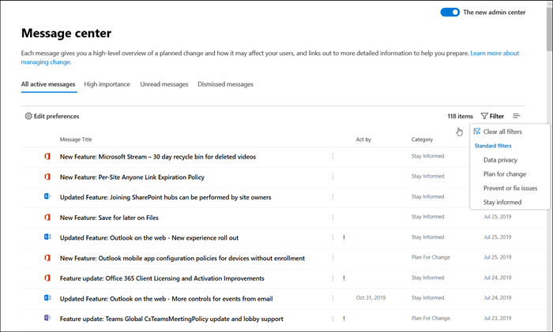

# Neuerungen im Microsoft 365 Admin CenterWhat's new in the Microsoft 365 admin center

::: moniker range="o365-21vianet"

> [!NOTE]
> Einige der Informationen in diesem Artikel gelten möglicherweise nicht für Office 365, die von 21Vianet betrieben werden.Some of the information in this article might not apply to Office 365 operated by 21Vianet.

::: moniker-end

Wir fügen [dem Microsoft 365 Admin Center](microsoft-365-admin-center-preview.md)ständig neue Features hinzu, beheben Probleme, die wir kennen, und machen Änderungen basierend auf Ihrem Feedback.We're continuously adding new features to [the Microsoft 365 admin center](microsoft-365-admin-center-preview.md), fixing issues we learn about, and making changes based on your feedback. Unten können Sie sehen, was heute schon für Sie verfügbar ist.Take a look below to see what's available for you today. Einige Funktionen werden für unsere Kunden mit unterschiedlicher Geschwindigkeit bereitgestellt.Some features get rolled out at different speeds to our customers. Wenn Sie noch kein Feature sehen, versuchen Sie, [sich der zielgerichteten Version hinzuzufügen](manage/release-options-in-office-365.md).If you aren't seeing a feature yet, [try adding yourself to targeted release](manage/release-options-in-office-365.md).

Und wenn Sie wissen möchten, was mit anderen Microsoft-Cloud-Diensten neu ist:And if you'd like to know what's new with other Microsoft cloud services:

- [Neuerungen in Azure Active DirectoryWhat's new in Azure Active Directory](https://docs.microsoft.com/azure/active-directory/fundamentals/whats-new)
- [Neuerungen im Exchange Admin CenterWhat's new in the Exchange admin center](https://docs.microsoft.com/Exchange/whats-new)
- [Neuerungen in Microsoft IntuneWhat's new in Microsoft Intune](https://docs.microsoft.com/mem/intune/fundamentals/whats-new)
- [Neuerungen im Microsoft 365 Compliance CenterWhat's new in the Microsoft 365 compliance center](https://docs.microsoft.com/Office365/SecurityCompliance/whats-new)
- [Neues in Microsoft Threat ProtectionWhat's new in Microsoft Threat Protection](https://docs.microsoft.com/microsoft-365/security/mtp/whats-new)
- [Aktive Websites im SharePoint Online Admin CenterWhat's new in the SharePoint admin center](https://docs.microsoft.com/sharepoint/what-s-new-in-admin-center)
- [Office-UpdatesOffice updates](https://docs.microsoft.com/OfficeUpdates/)

## Ignite 2020 (August & September)Ignite 2020 (August & September)

Willkommen bei Microsoft Ignite – unserem ersten Online-Ignite.Welcome to Microsoft Ignite - our first online-only Ignite. Wir hoffen, Sie in einer unserer Sitzungen zu sehen: [Microsoft Ignite 2020-Sitzungs Katalog](https://myignite.microsoft.com/sessions).We hope to see you in one of our sessions: [Microsoft Ignite 2020 Session Catalog](https://myignite.microsoft.com/sessions). Hier sind nur einige der Dinge, über die wir bei Ignite sprechen werden.Here's just a few of the things we'll be talking about at Ignite. 
> [!NOTE]
> Nicht alle Features werden sofort für alle verfügbar sein.Not all features are going to be available to everyone right away. Wenn Sie die neuen Features nicht sehen, [fügen Sie Targeted Release hinzu](manage/release-options-in-office-365.md).If you aren't seeing the new features, [join Targeted Release](manage/release-options-in-office-365.md).

### Multi-MandantenverwaltungMulti-tenant management

Wir haben eine Reihe von Funktionen für Multi-mandantenadministratoren wie Sie entwickelt, um Ihre Arbeit schneller und effizienter zu machen.We've developed a set of features for multi-tenant admins like you to get your job done faster and more efficiently.

- **Ihre Mandanten**: Wechseln Sie schnell zwischen den Mandanten, die Sie verwalten.**Your tenants**: Quickly switch between the tenants you manage.
- **Alle Mandanten**: eine neue Seite, auf der Sie schnell die Integrität aller Dienste Ihrer Mandanten, offener Dienstanfragen, Produkte und Abrechnung, Empfohlene Einrichtungsaufgaben und die Anzahl der Benutzer in diesem Mandanten anzeigen können.**All tenants**: A new page where you can quickly see the health of all your tenants' services, any open service requests, your products and billing, recommended setup tasks, and the number of users in that tenant.
- **Setup**: die Seite Multi-Mandanten-Setup zeigt eine Listenansicht der Setup Seite an, die jedoch für viele Mandanten organisiert ist.**Setup**: The multi-tenant Setup page gives you a list view of the Setup page, but organized for many tenants. Sie können sehen, welche Funktionen nicht aktiviert sind, welche Aufgaben für alle Mandanten abgeschlossen werden, Vorgänge, die Mandanten noch ausführen müssen.You can see which features aren't turned on, which tasks are complete for all tenants, tasks that tenants still need to complete. Diese Ansicht hilft Ihnen, die Funktions Akzeptanz zu überwachen und sicherzustellen, dass die empfohlenen Sicherheitssetup Aufgaben immer ausgeführt werden.This view will help you keep track of feature adoption and to make sure the recommended security setup tasks are always done.
- **Dienst Integrität**: in der Dienst Integritäts Ansicht wird angezeigt, ob sich Vorfälle oder Warnungen auf die Mandanten auswirken.**Service health**: The service health view shows you if any incidents or advisories are affecting the tenants. Es wird Ihnen sogar mitteilen, wie viele Ihrer verwalteten Mandanten betroffen sind.It will even tell you how many of your managed tenants are affected. Wählen Sie einfach einen Vorfall aus, um weitere Informationen auf der Registerkarte Übersicht zu erhalten, und wechseln Sie dann zur Registerkarte betroffene Mandanten, um einen Drilldown durchführen und diesen Mandanten zu unterstützen.Just select an incident to get more information on the overview tab, then switch over to the Tenants affected tab to drill down and support that tenant.
- Mandanten **übergreifende Postfächer Migrationen** sind jetzt in der öffentlichen Vorschau ein neuer Dienst, mit dem Sie Postfächer zwischen Mandanten verschieben können, ohne dass extern und dann Onboard-Postfächer erforderlich sind.**Cross-tenant mailbox migrations** is a new service, now in public preview, that lets you move mailboxes between tenants without the need to offboard and then onboard mailboxes. 
- **Mandantenübergreifende Domänen Freigabe**: in Kürze können Sie an einer privaten Vorschau für Funktionen teilnehmen, die es Ihnen ermöglichen, eine Domäne in mehreren Mandanten freizugeben.**Cross-tenant domain sharing**: Soon, you can join a private preview for capabilities that allow you to share a domain across multiple tenants. Wenn Contoso beispielsweise "Flügel Spielzeug" erwirbt, kann Contoso die Domäne mit dem Flügelspiel Spielzeug teilen, damit die Benutzer in beiden Mandanten "contoso.com" als e-Mail-Adressen verwenden können.For example, if Contoso acquires Wingtip Toys, Contoso can share the domain with Wingtip Toys so that people in both tenants can use "contoso.com" as their email addresses.

### Überwachen Ihrer wichtigsten KontenMonitor your most important accounts

Sie können fehlerhafte oder verzögerte e-Mail-Nachrichten, die an Ihre Benutzer mit hohem geschäftlichem Einfluss wie Ihr CEO gesendet werden, überwachen und nachverfolgen.You can monitor and track failed or delayed email messages sent to your users who have a high business impact, like your CEO. Sie können Prioritäten Konten nachverfolgen, indem Sie Benutzer zu Ihrer Liste mit Prioritäten Konten im Microsoft 365 Admin Center hinzufügen.You track priority accounts by adding users to your priority accounts list in the Microsoft 365 admin center. Hinzufügen von Führungskräften, Führungskräften, Managern oder anderen Benutzern, die Zugriff auf vertrauliche Informationen oder Informationen mit hoher Priorität habenAdd executives, leaders, managers, or other users who have access to sensitive or high priority information.

Prioritäts Konten stehen nur Organisationen zur Verfügung, die die folgenden Anforderungen erfüllen:Priority accounts are only available to organizations that meet both of the following requirements:

- Office 365 E3 oder Microsoft 365 E3 oder Office 365 E5 oder Microsoft 365 E5.Office 365 E3 or Microsoft 365 E3, or Office 365 E5 or Microsoft 365 E5.
- Mindestens 10.000 Lizenzen und mindestens 50 monatlich aktive Exchange Online Benutzer.At least 10,000 licenses and at least 50 monthly active Exchange Online users.

Es gibt zwei Möglichkeiten, um den Einstieg zu erhalten:There are two ways to get started:

- Wechseln Sie zu **Benutzer**, und wählen Sie dann im Menü weitere Aktionen die Option **Prioritäten Konten verwalten** aus, um Benutzer zur Liste hinzuzufügen.Go to **Users**, and then in the "more actions" menu select **Manage priority accounts** to add users to the list.
- Wechseln Sie zu **Setup**, suchen Sie nach der Setup Aufgabe **Überwachen Ihrer wichtigsten Konten**, und wählen Sie dann **Erste Schritte**aus.Go to **Setup**, find the setup task **Monitor your most important accounts**, and then select **Get started**.

Weitere Informationen zu Prioritäts Konten finden Sie unter über [Wachen von Prioritäts](https://docs.microsoft.com/microsoft-365/admin/setup/priority-accounts) Konten und [e-Mail-Problemen für Prioritäts Konten](https://docs.microsoft.com/Exchange/mail-flow-best-practices/mail-flow-insights/mfi-email-issues-for-priority-accounts).For more info on priority accounts, check out [Monitoring priority accounts](https://docs.microsoft.com/microsoft-365/admin/setup/priority-accounts) and [Email issues for priority accounts](https://docs.microsoft.com/Exchange/mail-flow-best-practices/mail-flow-insights/mfi-email-issues-for-priority-accounts).

### Schneller suchen und auf jeder Seite bessere Ergebnisse erzielenSearch faster and get better results from any page

Wir haben mit dem Rollout einer neuen Suchumgebung für das Admin Center begonnen, und wir können nicht darauf warten, dass Sie es ausprobieren. Alt+S to search from any page.](../media/MAC-WN-GlobalSearch.png)

- Das Suchfeld wurde in den Kopfbereich verschoben, in dem es "Microsoft 365 Admin Center" heißt, sodass Sie nun von einer beliebigen Seite aus suchen und nicht nur auf der Startseite.The Search box moved to the header area where it says "Microsoft 365 admin center" so you now search from any page, not just the Home page. Wir haben sogar eine Verknüpfung: **ALT + S**.We've even got a shortcut: **Alt+S**.
- Die Suche ist intelligenter und bietet Ihnen bessere Ergebnisse, sogar noch schneller.Search is smarter and will give you better results, even faster. Versuchen Sie, "2FA" einzugeben, um loszulegen.Try typing "2fa" to get started.
- Suchergebnisse werden nach dem Typ des Elements oder der Aktion organisiert, die Sie ausführen können.Search results are organized by the type of item or action you can take.
  - **Benutzer**: Wählen Sie den Namen des Benutzers aus, und Sie können diesen Benutzer direkt dort bearbeiten.**Users**: Select the user's name and you can edit that user right there. Wenn Sie das Menü weitere Aktionen neben dem Namen auswählen, können Sie das Kennwort zurücksetzen.If you select the "more actions" menu next to their name, you can reset their password. Sie können nach Anzeigename, Nachname, Vorname, Benutzername oder primäre e-Mail-Adresse und e-Mail-Aliase suchen.You can search by display name, last name, first name, username or primary email address, and email aliases. Aber um eine exakte Übereinstimmung zu erhalten, suchen Sie nach primärer e-Mail-Adresse oder Benutzername.But to get an exact match, search by primary email address or username.
  - **Gruppen**: Bearbeiten Sie die Gruppe von einer beliebigen Seite, fügen Sie Mitglieder hinzu, und weisen Sie Besitzern zu.**Groups**: Edit the group from any page, add members, assign owners.
  - **Actions**: ähnlich wie Sie nach einem Benutzer suchen und dann Ihr Kennwort zurücksetzen können, können Sie auch "Kennwort zurücksetzen" auf jeder Seite durchsuchen und dann ein oder mehrere Kennwörter für Benutzer zurücksetzen.**Actions**: Similar to how you can search for a user and then reset their password, you can also search "reset password" from any page and then reset one or more passwords for users.
  - **Navigation**: mithilfe der Ergebnisse unter Navigation können Sie schnell zu einer Seite im Admin Center gelangen.**Navigation**: Results under Navigation can quickly help you get to a page in the admin center quickly. Wenn Sie beispielsweise "Roles" Durchsuchen, gelangen Sie zur Seite "Rollen" für Azure AD Rollen.For example, searching "roles" will take you to the Roles page for Azure AD roles.
  - **Einstellungen**: Suchen Sie nach beliebigen Einstellungen im Zusammenhang mit Ihrer Organisation, den von Ihnen abonnierten Diensten sowie Sicherheits-und Datenschutzeinstellungen.**Settings**: Search for any setting related to your organization, the services you subscribe to, and security and privacy settings. 
  - **Domänen**: Sie können schnell Links zu Ihren Domänen finden, und dann gelangen Sie über den Link zu der Übersicht und der Integritäts Seite dieser Domäne.**Domains**: You can find quick links to your domains, and then the link will take you to that domain's Overview and health page.
  - **Dokumentation**: Wenn ein Ergebnis für Sie nicht gefunden werden kann, werden wir versuchen, eine Dokumentation zu finden, die Ihnen hilft.**Documentation**: If we can't find a result for you, we'll try to find some documentation to help. Es dauert etwas länger, bis die kuratierte Artikelliste eine Übereinstimmung findet, also warten Sie eine Sekunde, damit die Suche die Ergebnisse findet.It takes a little longer for the curated list of articles to find a match, so wait a second to let Search find the results. 
  - **Feedback**: haben Sie nicht gefunden, wonach Sie gesucht haben?**Feedback**: Didn't find what you were looking for? Senden Sie uns Feedback von der Suche.Send us feedback from Search. Im Admin Center werden Suchfunktionen für weitere Seiten und mehr Features hinzugefügt.We will add searching functionality for more pages and more features across the admin center.

### Microsoft 365 Administrator Mobile AppMicrosoft 365 admin mobile app

Mit dem [Microsoft 365-Administrator Mobile App](https://www.microsoft.com/microsoft-365/business/manage-office-365-admin-app), das in Ihrem Abonnement enthalten ist, können Sie Microsoft 365 von Ihrem mobilen Gerät aus verwalten, damit Sie sich von Ihrem Schreibtisch aus für tägliche Aufgaben verlassen können.The [Microsoft 365 admin mobile app](https://www.microsoft.com/microsoft-365/business/manage-office-365-admin-app), which is included with your subscription, lets you manage Microsoft 365 from your mobile device so you can get away from your desk to do every day tasks. Tatsächlich gibt es über 90 Features in der APP--und wir haben noch ein paar hinzugefügt:In fact, there are over 90 features in the app--and we just added a few more:

- **Unterstützung für die Microsoft InTune-Richtlinien für die Verwaltung mobiler Anwendungen und für den bedingten Zugriff**: Sie können jetzt Ihr persönliches Gerät zum Verwalten von Microsoft 365 verwenden, selbst wenn Ihre Organisation die Mobile Anwendungsverwaltung und die bedingten Zugriffsrichtlinien von InTune aktiviert hat.**Support for Microsoft Intune's Mobile Application Management and Conditional Access policies**: You can now use your personal device to manage Microsoft 365 even if your org has turned on Intune's Mobile Application Management and conditional access policies.
- **Benachrichtigungen im Nachrichtencenter**: Aktivieren Sie Benachrichtigungen für das Nachrichtencenter unter **Einstellungen**  >  **Notifications** , wenn Sie über neue Nachrichtencenter-Beiträge benachrichtigt werden möchten.**Message center notifications**: Turn on message center notifications at **Settings** > **Notifications** if you wish to be alerted about new message center posts. Durch Benachrichtigungen möchten wir sicherstellen, dass Sie über wichtige Informationen und Ereignisse in Ihrem Mandanten informiert bleiben.Through notifications, we want to ensure you stay informed about important information and events across your tenant.
- Benachrichtigungen zur **Abrechnung**: Sie können Benachrichtigungen auch bei **Einstellungs**  >  **Benachrichtigungen** aktivieren, wenn Sie Abrechnungs Benachrichtigungen auf Ihrem Gerät erhalten möchten, wenn ein Abonnement demnächst abläuft.**Billing alerts**: You can also turn on billing notifications at **Settings** > **Notifications** if you want to get billing notifications on your device if a subscription is about to expire.
- **Dunkler Modus**: Willkommen auf der dunklen Seite des Mobile App.**Dark mode**: Welcome to the dark side of the mobile app. Dies war eines der am häufigsten angeforderten Features.This was one of our most requested features. Wechseln Sie zu **Einstellungen**  >  **Designs** , um es zu aktivieren.Go to **Settings** > **Themes** to turn it on.
- **Ein Problem melden**: Sie können jetzt ein Problem in der APP melden oder von anderen Administratoren gemeldete Probleme anzeigen.**Report an issue**: You can now report an issue in the app or view issues reported by other admins. Besuchen Sie den **Dienststatus** , um ihn zu überprüfen.Visit **Service health** to check it out.

### Verwendungsempfehlungen für kleine und mittelständische UnternehmenUsage recommendations for small and medium businesses

Kleine und mittelständische Unternehmen erhalten möglicherweise eine Empfehlung auf der **Start** Seite, wenn einige der Personen in der Organisation keine Teams, OneDrive oder Office-Apps aktiv verwenden.Small and medium businesses might get a recommendation on the **Home** page if some of the people in the org aren't actively using Teams, OneDrive, or Office apps. Wenn Sie die Empfehlung anzeigen, können Sie Microsoft Training schnell an inaktive Benutzer senden, damit Sie mit der APP beginnen und sicherstellen, dass Sie den vollständigen Wert aus ihren Abonnements erhalten.When you view the recommendation, you can quickly email Microsoft training to inactive users to help them get started with the app and to make sure you are getting the full value from your subscriptions.

### Remote-Arbeits SammlungRemote work collection

Im Oktober fügen wir eine Remote-Arbeits Sammlung hinzu, um Besitzern von Kleinunternehmen und deren Mitarbeitern zu helfen, Online zu arbeiten und Remote zu arbeiten.In October, we'll be adding a remote work collection to help small business owners and their staff get online and working remotely.  Das **Remote work Essentials** -Setup ist eine kuratierte Liste aller Features, die Microsoft empfiehlt, Remote-Arbeit sicher zu aktivieren und effektiv zusammenzuarbeiten.**Remote work essentials** setup is a curated list of all features Microsoft recommends to securely enable remote work and to collaborate effectively. In ein paar Wochen können Sie es in **Setup**  >  **Remote work Essentials**ausprobieren.In a couple of weeks, you can try it out in **Setup** > **Remote work essentials**.

Weitere Informationen zum sicheren zulassen von Remote-Arbeit und eine praktische Webadresse, die sich leicht merken und freigeben lässt, finden Sie unter [aka.ms/Remote-Business](https://aka.ms/remote-business).For more information about how to securely allow remote work and a handy web address that's easy to remember and share, go to [aka.ms/remote-business](https://aka.ms/remote-business).

### Benötigen Sie Hilfe? Wechseln zu weiteren VerwaltungszentrenNeed help? moving to more admin centers

Wir untersuchen und aktualisieren die Inhalte und Tools ständig, damit Sie mit den Änderungen im Produkt Schritt halten können.We're continuously looking at and updating the content and tools to keep up with changes in the product. Wir verfügen nun über viele weitere Diagnosetools, die Ihnen helfen, Probleme schnell und effizient zu lösen.We now have many more self-serve diagnostic tools to help you resolve issues quickly and efficiently. Hier sind einige, die vor kurzem hinzugefügt wurden:Here are a few that were recently added:

- Ändern der Einschränkungsrichtlinie für Exchange-WebdiensteChange your Exchange Web Service throttling policy
- Überprüfen des Status der Microsoft Teams-Protestierung und Validierung für bestimmte BenutzerChecking status of Teams provisioning and validation to specific users
- Beheben von Problemen mit DKIM-SetupFix DKIM setup issues
- Diagnostizieren von InTune-Benutzer RegistrierungsfehlernDiagnose Intune user enrollment errors

Und wir stellen die neue und verbesserte Supporterfahrung bereit, die Sie bereits im Microsoft 365 Admin Center für einige der anderen Admin Center sehen.And we are rolling out the new and improved support experience you already see in the Microsoft 365 admin center to some of the other admin centers. Administratoren von Teams und Security and Compliance Admin Center verfügen bereits über diese neue Erfahrung.Teams Admin Center and Security and Compliance Admin Centers already have this new experience. In Kürze werden die **Exchange-Verwaltungskonsole**, das **SharePoint Admin Center**und **Office.com** mit dieser neuen Hilfe Erfahrung für Administratoren aktualisiert.And soon, **Exchange admin center**, **SharePoint admin center**, and **Office.com** will be updated along with this new help experience for admins.

### Verwalten von Änderungen mit Microsoft PlannerManage changes with Microsoft Planner

Im Mai haben wir angekündigt, dass Sie bald Nachrichtencenter-Beiträge an Microsoft Planner synchronisieren können und jetzt für alle Benutzer verfügbar sind.In May, we announced that you'll soon be able to sync Message center posts to Microsoft Planner and now it's available for everyone to use.  Sie können jetzt Aufgaben aus Nachrichten erstellen, Sie zuweisen und nach Abschluss nachverfolgen.You can now create tasks from messages, assign them, and track them to completion. Beim ersten Mal wählen Sie **Planer-Synchronisierung** aus, die Sie zum Herstellen einer Verbindung mit dem entsprechenden Plan benötigen.The first time, you select **Planner syncing** you'll need to connect to the appropriate plan.

Wenn Sie mehr darüber erfahren möchten, lesen Sie diesen Artikel und das Video, um zu sehen, wie es funktioniert: nach [Verfolgen von Nachrichtencenter-Beiträgen im Planer](https://docs.microsoft.com/Office365/Planner/track-message-center-tasks-planner)To learn more about it, check out this article and video to see how it works: [Track your message center posts in Planner](https://docs.microsoft.com/Office365/Planner/track-message-center-tasks-planner)

### Dokumentation, Schulung und VideosDocumentation, Training, and Videos

- Ganz neu und rechtzeitig für Microsoft Ignite –[der virtuelle Hub](https://adoption.microsoft.com/virtual-hub/).Brand new and just in time for Microsoft Ignite--[The Virtual Hub](https://adoption.microsoft.com/virtual-hub/). Tiefer Sprung in das technische Training für IT-Experten und Entwickler.Deep dive into technical training for IT pros and developers. Finden Sie schnell rund 20 neue Videos im Rahmen von #SIDETRACKED, dem Namen der Ignite-Administrator-Spur in diesem Jahr.Quickly find around 20 new videos as part of #SIDETRACKED, the name of the Ignite admin track this year.
- [Neuerungen bei Microsoft 365](https://www.youtube.com/watch?v=OVjb2lGJ4GU&t=2s) -Video Serien: in diesem Monat decken wir neue Features ab, die in Whiteboards für Teams und im Internet verfügbar sind, wie Sie die Benutzer Bereitstellung auf Azure AD automatisieren, neue Power-Trigger und-Aktionen in Microsoft Teams automatisieren und vieles mehr.[What's new with Microsoft 365](https://www.youtube.com/watch?v=OVjb2lGJ4GU&t=2s) video series: This month, we cover new features available in Whiteboard for Teams and on the web, how to automate user provisioning to Azure AD, new Power Automate triggers and actions in Teams, and more. Und bleiben Sie für den nächsten Monat dran, wo wir eine Zusammenfassung aller tollen Dinge bei Ignite haben!And stay tuned for next month, where we'll have a recap of all the great things happening at Ignite!
- Wir haben eine Neugestaltung der [Microsoft 365-Dokumentations](https://docs.microsoft.com/microsoft-365) Seite durch geschafft, die sich zunächst auf Lösungen konzentriert.We did a redesign of the [Microsoft 365 documentation](https://docs.microsoft.com/microsoft-365) page that focuses on solutions first. Wir werden neue Lösungen hervorheben, wenn Sie auf dieser Seite verfügbar werden, also halten Sie Ausschau.We'll highlight new solutions as they become available on this page, so keep an eye out.

## Juli 2020July 2020

### Vorbereitungen für Ignite 2020Getting ready for Ignite 2020

Während wir in die Ignite Season bei Microsoft umziehen, werden wir nicht so viele Features freigeben, dass wir während unserer Sitzungen viel besprechen müssen.As we're moving into Ignite season at Microsoft, we're not releasing as many features so that we have a lot to talk about during our sessions.

Das nächste Update für diesen Artikel wird am Tag des ersten Starts unseres ersten Online-ignites sein.The next update to this article will be on opening day of our first online-only Ignite. In diesem Jahr können Sie kostenlos teilnehmen!And this year, it is free to attend! Check it out, Get signed up: [Microsoft Ignite 2020](https://www.microsoft.com/ignite).Check it out, get signed up: [Microsoft Ignite 2020](https://www.microsoft.com/ignite).

### Ihre ProdukteYour products

In der Abonnementverwaltung wurden viele Aufgaben ausgeführt, um die Seite schneller zu laden, schneller zu finden, was Sie suchen, und um die Standards für die Barrierefreiheit im Internet ([WCAG 2,1 Guidelines](http://www.w3.org/TR/WCAG21/)) zu erfüllen.There has been a lot of work done in the subscriptions management to make the page faster to load, faster to find what you're looking for, and to meet the web accessibility standards ([WCAG 2.1 guidelines](http://www.w3.org/TR/WCAG21/)).

- **Tabellen Umgestaltung**: die Tabelle wurde neu gestaltet, sodass Sie ähnliche Abonnements gruppieren können.**Table redesign**: The table was redesigned so that you can group similar subscriptions. Wechseln Sie zu **Abrechnung**  >  **ihrer Produkte**.Go to **Billing** > **Your products**.
- **Produkt Details**: Weitere Details zu ihren Abonnements erhalten Sie, indem Sie das Produkt in der Liste auswählen.**Product details**: Get more details than ever about your subscriptions by selecting the product in the list.
- **Machen Sie alles von hier aus**: und Sie müssen nicht mehr auf mehrere Seiten wechseln, um ein Produkt zu verwalten.**Do it all from here**: And you don't have to go to jump around several pages to manage one product. Wenn Sie beispielsweise ein Abonnement stornieren müssen, wird der Bereich geöffnet, um die Aktion direkt dort durchführen zu können.For example, if you need to cancel a subscription, the panel will open to do the action right there.

### DomänenDomains

Die Domänenverwaltung kann kompliziert sein, und wir haben ein neues Feature veröffentlicht, um es einfacher zu machen.Domain management can be complicated, and we've released a new feature to make that easier. Wechseln Sie zu Einstellungen > Domänen, und wählen Sie dann eine Domäne aus, um weitere Informationen zu Ihrer Domäne und der Domänenintegrität zu erhalten.Go to Settings > Domains and then select a domain to get more information about your domain and the domain's health.

:::image type="content" source="../media/MAC-WN-DomainDNS.PNG" alt-text="Seite "Domänendetails" für contoso.com":::

### Dokumente, Schulungen und Videos (Juli 2020)Docs, training, and videos (July 2020)

[Was ist neu in Microsoft 365](https://youtu.be/m1Nu8WJgCDY) Video Series: in diesem Monat decken wir die neue Jammer Erfahrung für das Internet und Mobile, die Integration der Jammer Gemeinschaften-App für Microsoft Teams, neue Richtlinien Pakete zur Unterstützung von Mitarbeitern und Führungskräften in erster Linie und vieles mehr.[What's new with Microsoft 365](https://youtu.be/m1Nu8WJgCDY) video series: This month, we cover the new Yammer experience for web and mobile, how to integrate the Yammer Communities app for Microsoft Teams, new policy packages to support Firstline Workers and managers, and more.

## Juni 2020June 2020

### Schritt halten mit Office What es New ManagementKeeping up with Office What's New management

Vor ein paar Monaten haben wir eine Einstellung hinzugefügt, mit der Sie die neuen Nachrichten verwalten können, die [in den Office-Apps eines Benutzers angezeigt](#office-whats-new-management)werden.A few months ago, we added a setting that lets you manage the [What's New messages that show up in a user's Office apps](#office-whats-new-management). In diesem Monat haben wir eine neue Homepage-Karte veröffentlicht, mit der Sie schnell handeln und die **neuen** Nachrichten verfolgen können, die den Benutzern in Ihrer Organisation angezeigt werden sollen.This month, we released a new Home page card that will help you act quickly and keep track of the **What's New** messages that you want shown to the users in your organization.

### Dokumente, Schulungen und Videos (Juni)Docs, training, and videos (June)

- [Erste Schritte mit Microsoft TeamsGetting started with Teams](https://support.microsoft.com/office/184f1aba-2f91-43f0-86e1-9fae607e24f6)

## Mai 2020May 2020

### Neuer Update Kanal für OfficeNew update channel for Office

Am 12. Mai kündigten wir die Verfügbarkeit eines neuen Update Kanals für Office an: Monthly Enterprise Channel.On May 12, we announced the availability of a new update channel for Office:  Monthly Enterprise Channel. Dieser Update Kanal stellt Ihren Benutzern neue Office-Funktionen einmal monatlich am zweiten Dienstag des Monats zur Verfügung.This update channel provides your users with new Office features once a month, on the second Tuesday of the month.

Wenn Sie den Benutzern die Selbstinstallation von Office über das Portal gestatten, können Sie für diese Benutzer den monatlichen Enterprise-Kanal auswählen.If you allow your users to self-install Office from the portal, you can select Monthly Enterprise Channel for them. Um dies zu tun, melden Sie sich beim Microsoft 365 Admin Center an, und wechseln Sie zu **alle Einstellungen anzeigen**  > **Settings**  >  **org Settings**  >  **Services**  >  **Office Software Download Settings**.To do this, sign in to the Microsoft 365 admin center and go to **Show all** >**Settings** > **Org settings** > **Services** > **Office software download settings**. Wenn Sie **einmal monatlich (monatlicher Enterprise-Kanal)** auswählen, werden alle neuen selbst Installationen von Office für die Verwendung des monatlichen Enterprise-Kanals konfiguriert.If you select **Once a month (Monthly Enterprise Channel)**, then any new self-installs of Office will be configured to use Monthly Enterprise Channel.

In Verbindung mit der Veröffentlichung des monatlichen Enterprise-Kanals überarbeiten wir auch die Namen der vorhandenen Update Kanäle.In conjunction with the release of Monthly Enterprise Channel, we’re also revising the names of the existing update channels. Beispielsweise wird der monatliche Kanal in den aktuellen Kanal umbenannt.For example, Monthly Channel is being renamed to Current Channel. Die neuen Namen werden am 2020. Juni wirksam.The new names take effect on June 9, 2020.

Weitere Informationen finden Sie unter [Changes to Update Channels for Microsoft 365 apps](https://docs.microsoft.com/DeployOffice/update-channels-changes).For more information, see [Changes to update channels for Microsoft 365 Apps](https://docs.microsoft.com/DeployOffice/update-channels-changes).

### Neue AdministratorrollenNew admin roles

Wir haben einige neue Azure Active Directory Administratorrollen zum Microsoft 365 Admin Center hinzugefügt.We've added some new Azure Active Directory admin roles to the Microsoft 365 admin center.

- Die Administratorrolle "Hybrid Identity" gibt Benutzern die Berechtigung zum Verwalten von Cloud-Bereitstellungs-und Authentifizierungsdiensten.Hybrid identity admin role gives users permission to manage cloud provisioning and authentication services.
- Die Rolle "Netzwerkadministrator" ermöglicht Benutzern das Verwalten von Netzwerkstandorten und das Überprüfen von Netzwerk Einblicken für Microsoft 365-Software als Dienst apps.Network admin role lets users manage network locations and review network insights for Microsoft 365 Software as a Service apps.
- Die Druckeradministrator Rolle erteilt die Berechtigung zum Verwalten aller Aspekte von Druckern und Druckerverbindungen.Printer admin role grants permission to manage all aspects of printers and printer connections.
- Der Drucker Techniker ist eine Teilmenge der Druckeradministrator Rolle, mit der diese Benutzer Drucker registrieren und aufheben können, und Aktualisieren des Druckerstatus.Printer technician is a subset of the Printer admin role where those users can register and unregister printers, and update printer status.
Weitere Informationen zu diesen Rollen finden Sie unter [Informationen zu Administratorrollen](https://docs.microsoft.com/microsoft-365/admin/add-users/about-admin-roles).To find out more about these roles, see [About admin roles](https://docs.microsoft.com/microsoft-365/admin/add-users/about-admin-roles).

### Liste "Gruppen exportieren"Export groups list

Wir haben viele Administratoren gehört, dass Sie Informationen über Gruppen und deren Nutzung für Personen freigeben müssen, die keinen Zugriff auf die Admin Center haben.We've heard from a lot of admins that they need to share information about groups and their usage to people who don't have access to the admin centers. Sie können die Gruppenliste nun zu Überwachungszwecken in eine CSV-Datei exportieren, was bedeutet, dass Sie das alte PowerShell-Skript auswerfen können.You can now export the Groups list to a CSV file for auditing purposes, which means you can throw out that old PowerShell script. Um es auszuprobieren, wechseln Sie zu **Gruppen**  >  **Gruppen**, und wählen Sie dann in der Befehlsleiste **Gruppen exportieren** aus.To try it out, go to **Groups** > **Groups**, and then select **Export groups** from the command bar.

### Microsoft 365-Center – Lösungen und ArchitekturenMicrosoft 365 solution and architecture center

In diesem Monat haben wir eine neue Website mit dem [https://docs.microsoft.com](https://docs.microsoft.com) Namen " [Microsoft 365 Solution and Architecture Center](https://docs.microsoft.com/microsoft-365/solutions/solution-architecture-center)" veröffentlicht, in der die technischen Anleitungen zum Verständnis, zur Planung und zur Implementierung integrierter Microsoft 365-Lösungen für eine sichere und konforme Zusammenarbeit zusammengefasst werden.Just this month, we released a new site on [https://docs.microsoft.com](https://docs.microsoft.com) called the [Microsoft 365 solution and architecture center](https://docs.microsoft.com/microsoft-365/solutions/solution-architecture-center), which brings together the technical guidance you need to understand, plan, and implement integrated Microsoft 365 solutions for secure and compliant collaboration. In diesem Center finden Sie:In this center, you'll find:

- Grundlegende LösungsanleitungenFoundational solution guidance
- Arbeits Auslastungs Lösungen und Szenario-AnleitungenWorkload solutions and scenario guidance
- Lösungs-und Architektur Illustrationen (Poster!!!)Solution and architecture illustrations (The posters!!!)
- Branchenspezifische AnleitungenIndustry specific guidance
- Entwurfs Prinzipale für die UnternehmensarchitekturEnterprise architecture design principals

### Dokumente, Schulungen und Videos (Mai)Docs, training, and videos (May)

- **Was ist neu in Microsoft 365 Video Series**: diesen Monat decken wir die neue Supporterfahrung in den Teams admin und Security and Compliance Center, Planner Integration in das Nachrichten Center und das neue 3X3-Video Layout in Microsoft Teams ab.**What's new in Microsoft 365 video series**: This month, we cover the new support experience in the Teams admin and Security and Compliance Centers, Planner integration with the Message Center, and the new 3x3 video layout in Microsoft Teams. 
- Die Seite [Microsoft 365 Admin Center Help](https://docs.microsoft.com/microsoft-365/admin/) Hub wurde aktualisiert, um Ihnen zu helfen, schneller zu finden, was Sie benötigen.The [Microsoft 365 admin center help](https://docs.microsoft.com/microsoft-365/admin/) hub page was updated to help you find what you need more quickly. Wenn Sie diese Seite jetzt betrachten, haben wir eine Karte hinzugefügt, um Sie über wichtige Updates und Änderungen zu informieren.And if you go look at that page right now, we've added a card to inform you of important updates and changes.

## April 2020April 2020

### InTune-RollenverwaltungIntune roles management

[April 2020April 2020](#april-2020)

Nun, wir haben es geschafft!Well, we did it! Wir haben den zweiten Schritt hin zu einer einheitlichen Rollen Erfahrung unternommen, und Sie können jetzt InTune-Rollen im Microsoft 365 Admin Center verwalten.We've taken the second step towards a unified roles experience and you can now manage Intune roles in the Microsoft 365 admin center. Sie können auch Features wie die Suche nach Rollen und das Anzeigen von Rollen Berechtigungen nutzen.You can also leverage features such as the ability to search for roles and view role permissions. Dies bedeutet, dass Sie nicht zwei separate Tools zum Verwalten von Rollen für Microsoft 365 und InTune benötigen.This means you don’t need two separate tools to manage roles for Microsoft 365 and Intune. Wenn Sie sich beim Microsoft 365 Admin Center anmelden, sehen Sie, dass auf der Seite "Rollen" zwei Pivots vorhanden sind: eine für Azure AD und eine für InTune.When you sign into the Microsoft 365 admin center, you’ll see that there are two pivots on the Roles page, one for Azure AD and one for Intune.

### Nachrichten Center-Beiträge für Planer synchronisierenSync Message Center posts to Planner

Ab Mai beginnen Administratoren, die sich in der gezielten Version befinden, die Schaltfläche "Planer synchronisieren" im Nachrichtencenter.Starting in May, admins who are in Targeted release will start seeing the "Planner syncing" button in the message center. Sie können jetzt Nachrichten nachverfolgen, die eine Aktion erfordern, den Nachrichtentyp auswählen, den Sie nachverfolgen möchten, Nachrichten nachverfolgen als Aufgaben zuweisen und Nachrichten zur späteren Beachtung markieren.You can now track messages that need action, select the type of messages you'd like to track, assign messages to track as tasks, and tag messages for later attention.

[Join Targeted Release](manage/release-options-in-office-365.md) to Get Started![Join Targeted Release](manage/release-options-in-office-365.md) to get started!

### "Benötigen Sie Hilfe?""Need help?" gestartet in Teams Admin Center & Security and Compliance Centerlaunched in Teams admin center & Security and Compliance centers

Das Teamadministrator Center, das Sicherheitscenter und das Compliance Center verwenden nun dieselbe "Hilfe benötigen?"The Teams admin center, Security center, and Compliance center are now using the same "Need help?" Feature, das im Microsoft 365 Admin Center zum Suchen von Hilfe und zum Kontaktieren des Supports verwendet wird.feature that the Microsoft 365 admin center uses for finding help and contacting support. Wir haben viele Feedbacks von Administratoren erhalten, dass Sie das gleiche Maß an Hilfe und Unterstützung wünschen, und wir freuen uns, Ihnen das zu bringen.We've received a lot of feedback from admins that you wanted the same level of help and support and we're happy to bring that to you. Probieren Sie es aus und geben Sie uns Ihr Feedback!Try it out and give us your feedback!

#### Benötigen Sie einen Chat?Need chat?

Unsere Support-Agents haben von zu Hause aus gearbeitet und trotzdem Kundenanfragen und Einschränkungen bei der Internet Bandbreite bei der Arbeit von zu Hause aus beeinflussen, können die Kundenanruf Qualität beeinträchtigen.Our support agents have been working from home while still taking customer cases and limitations on internet bandwidth while working from home can impact customer call quality. Um Sie weiterhin zu unterstützen, haben wir die Live Chat Unterstützungs Option für kommerzielle Kunden im Microsoft 365 Admin Center gestartet.In order to continue supporting you, we have launched live chat support option for commercial customers in the Microsoft 365 admin center.

Beim Erstellen einer Dienstanforderung wird nun zusätzlich zu Telefon und e-Mail Chat als Option angezeigt.While creating a service request, you'll now see chat as an option, in addition to phone and email. Wählen Sie Chat als bevorzugten Kommunikationskanal aus, und erstellen Sie die Anforderung.Select chat as a preferred channel of communication and create the request. Nachdem Sie die Anforderung erstellt haben, können Sie mit dem Chat beginnen, wenn Sie zum chatten mit Microsoft Agents fähig sind.Once you've created the  request, you can start the chat when you are ready to chat with Microsoft agents.

### Microsoft Teams-UpdatesTeams updates

Durch die verstärkte Nutzung von Teams haben wir einige Features hinzugefügt, die Ihnen bei der Verwaltung helfen.With the increased usage of Teams, we've added a few features to help you manage them.

- Eine neue Empfehlungskarte auf der Admin Center-Startseite zeigt an, welche Benutzer Microsoft Teams nicht 30 Tage lang aktiv verwendet haben.A new recommendation card on the admin center Home page shows which users have not actively used Teams for 30 days. Sie können diesen Benutzern eine Schulungs-e-Mail senden, um die Verwendung von Microsoft Teams zu starten.You can send those users a training email to get them started using Teams.
- **Zusammenführen von Personen mit Microsoft Teams**: Wechseln Sie zu **Setup** , um eine neue Seite zu sehen, die Sie beim Aktivieren von Teams für lizenzierte Benutzer und beim Zulassen von Gastzugriffen unterstützt, damit Sie mit externen Kunden in Teams arbeiten können.**Bring people together with teams**: Go to **Setup** to see a new page to help you turn on Teams for licensed users and allow guest access, so you can work with external customers in Teams.
- Eine Microsoft Teams-Karte ist jetzt standardmäßig auf Ihrer Startseite fixiert.A Microsoft Teams card is now pinned by default to your Home page. Sie zeigt an, ob Microsoft Teams aktiviert ist und ob Gastzugriff zulässig ist.It shows whether Teams is turned on, and if guest access is allowed. Außerdem können Sie den Installationsstatus für neu lizenzierte Microsoft Teams-Benutzer überprüfen und überprüfen, ob sich Netzwerkprobleme auf die Benutzer von Microsoft Teams auswirken können.It also allows you to check the setup status for newly licensed Teams users, and check if network issues might be impacting Teams users.
- Schließlich ist Microsoft Teams nun ein Schritt im ersten Setup-Ablauf, wenn Sie eine Lizenz erworben haben, die Teams enthält.Finally, Teams is now a step in the initial set up flow if you purchased a license that includes Teams.

### Produktivitäts BewertungProductivity score

Die Produktivitäts Bewertung gibt Einblicke in die Verwendung von Microsoft Cloud-Diensten und die Technologie Erfahrungen, die Sie unterstützen.Productivity Score gives insights about how people use Microsoft cloud services and the technology experiences that support them. Die Bewertung spiegelt die Leistung Ihrer Organisation anhand von Maßnahmen zur Mitarbeiter-und Technologie Erfahrung wider und vergleicht Ihre Bewertung mit Organisationen wie Ihrem.The score reflects your organization’s performance against employee and technology experience measures and compares your score with organizations like yours. In diesem Monat führen wir die folgenden neuen Konzepte in die Vorschau ein:This month, we are introducing the following new concepts to the preview experience:

- Trend Ansicht von primären Einblicken auf Homepage und Kategorie-Detailseiten-Endpunktanalyse und Netzwerk Verbindungskategorien wurden der Technologie Oberfläche hinzugefügtTrend view of primary insights on home page and category detail pages -Endpoint Analytics and Network Connectivity categories added to Technology Experience
- Relevante Technologie Erfahrungs Einblicke in den Kategorien "Mitarbeiter Erfahrung"Relevant Technology Experience insight shown in Employee Experience categories
- Neue Kategorie "Kommunikation" im Rahmen der Mitarbeiter ErfahrungNew Communications category as part of Employee Experience
- Benutzer Details mit Organisations Metadaten in den Kategorien "Mitarbeiter Erfahrung"User details with organizational metadata in Employee Experience categories

Wenn Sie mehr erfahren möchten, lesen Sie den Blog: [Messen und verbessern Sie die Microsoft 365-Erfahrung mit Microsoft Productivity Score](https://techcommunity.microsoft.com/t5/microsoft-365-blog/measure-and-improve-the-microsoft-365-experience-with-microsoft/ba-p/1348618).If you'd like to learn more, check out the blog: [Measure and improve the Microsoft 365 experience with Microsoft Productivity Score](https://techcommunity.microsoft.com/t5/microsoft-365-blog/measure-and-improve-the-microsoft-365-experience-with-microsoft/ba-p/1348618). Das Produktivitäts Ergebnis befindet sich derzeit in privater Vorschau.Productivity score is currently in private preview. [Treten Sie der privaten Vorschau für Produktivitäts Bewertungen](https://aka.ms/productivityscorepreview) bei, um loszulegen.[Join the Productivity score private preview](https://aka.ms/productivityscorepreview) to get started.

### Gruppen AktualisierungenGroups updates

Wir haben zwei Updates für Gruppen in diesem Monat:We've got two updates for Groups this month:

- Sie können nun e-Mail-Adressen für Office 365 Gruppen (auch Gruppen in Outlook und bald als Microsoft 365-Gruppen bezeichnet) bearbeiten.You can now edit email addresses for Office 365 groups (Also known as Groups in Outlook, and soon to be known as Microsoft 365 groups).
- Wir haben Ihr Feedback gehört und wir haben klarer Fehlermeldungen hinzugefügt, warum Sie eine Gruppe nicht in ein Microsoft-Team konvertieren können.We've heard your feedback and we've added clearer error messaging for why you can't convert a group to a Microsoft Team.

### Dokumente, Videos und Schulungen (April)Docs, videos, and training (April)

**Was ist neu in Microsoft 365 Video Series**: diesen Monat decken wir Tipps und Ressourcen ab, um kleinen Unternehmen den Übergang zu Remote-Arbeit zu erleichtern, einschließlich der Bereitstellung von Microsoft Teams, Remote-Arbeits Schulungsressourcen, um mit Kunden und Partnern in Verbindung zu bleiben, und dem neuen Business Voice-Plan von Microsoft 365.**What's new in Microsoft 365 video series**: This month, we cover tips and resources to help small businesses transition to remote work including how to roll out Microsoft Teams, remote work training resources to stay connected with clients and partners, and the new Microsoft 365 Business Voice plan. [Neuerungen in Microsoft 365What's New in Microsoft 365](https://go.microsoft.com/fwlink/p/?linkid=2118096)

#### Für Ihre BenutzerFor your users

- [Planen einer BesprechungSchedule a meeting](https://support.microsoft.com/office/c61b4f61-ee62-4a06-8bf7-0a1cd302700a)
- [An einer Microsoft Teams-Besprechung teilnehmenJoin a Teams meeting](https://support.microsoft.com/office/078e9868-f1aa-4414-8bb9-ee88e9236ee4)
- [Erstellen eines organisationsweiten TeamsCreate an org-wide team](https://support.microsoft.com/office/037bb27a-bcc9-48fe-8d72-44d9482420a3)
- [Erstellen Sie ein Team mit GästenCreate a Team with guests](https://support.microsoft.com/office/11fbb083-52ee-434d-8c6e-63711fdafac7)
- [Als Gast an einem Team teilnehmenJoin a Team as a guest](https://support.microsoft.com/office/928d1eef-61e2-49ec-b754-c2fe86b34824)
- [Erstellen einer Gruppen-e-Mail-AdresseCreate a group email address](https://support.microsoft.com/office/ded875f9-a9de-437f-b559-2ae4f235bb2b)

#### Für Administratoren und UnternehmerFor admins and business owners

- [Remotearbeit kann auch Ihrem Kleinunternehmen weiterhelfenEmpower your small business with remote work](https://support.microsoft.com/office/9b91a85a-39b4-40a6-a590-0f9bea0ba8e6)
- [Führen eines Remote-KleinunternehmensRunning a remote small business](https://support.microsoft.com/office/9ac1a0f1-789b-4143-b954-5821d5d89298)
- [Registrieren für Microsoft Business BasicSign up for Microsoft Business Basic](https://support.microsoft.com/office/9ac1a0f1-789b-4143-b954-5821d5d89298)
- [Einrichten der zweistufigen AnmeldungSetting up two-factor sign-in](https://support.microsoft.com/office/9ac1a0f1-789b-4143-b954-5821d5d89298)

## März 2020March 2020

### Featured Feedback Fix: verbessern der Zuverlässigkeit von "Benutzer hinzufügen" für die LizenzierungFeatured Feedback Fix: Improve "add user" reliability for licensing

Wir haben viel Feedback von Administratoren erhalten, wie schwer es ist, beim Hinzufügen von Benutzern Lizenzen zuzuweisen.We received a lot of feedback from admins about the how hard it is to assign licenses when adding users. Wir haben das erste Update für diesen Fix durchgeführt, und wir haben zu einem zuverlässigeren Behind-the-Scenes-Dienst migriert, um diese Anforderungen zu verarbeiten.We've made the first update to this fix and we've migrated to a more reliable behind-the-scenes service to process those requests. Wenn etwas schief geht, erhalten Sie nun eine Fehlermeldung, mit der Sie es erneut versuchen können.And if something goes wrong, you'll now get an error message that lets you to try again.

### Microsoft Teams-Startseite-KarteMicrosoft Teams home page card

Mit dem Uptick in Teams-Nutzung erhalten einige Organisationen eine angeheftete dashboardkarte, die das Umwandeln von Teams auf mehr auffindbar macht.With the uptick in Teams usage, some orgs will get a pinned dashboard card that makes turning Teams on more discoverable. Die Karte enthält auch Links zu Schulungen und Dokumenten, die ihren org-Übergang zu Remote-Arbeit erleichtern.The card also has links to training and docs to help your org transition to remote work. Wechseln Sie einfach zur **Start** Seite, um die neue Karte anzuzeigen.Just go to the **Home** page to see the new card.

### Anpassen des SharePoint Mobile App Designs in Ihrer OrganisationCustomize your organization's SharePoint mobile app theme

Mit dem Microsoft 365 Admin Center können Sie nun das Design Ihrer Organisation in SharePoint Mobile App für IOS und SharePoint Mobile App für Android anpassen.Using the Microsoft 365 admin center, you can now customize your organization's theme in SharePoint mobile app for iOS and SharePoint mobile app for Android. Dieses Feature bietet bequem eine Mobile Intranet-APP, die mit Ihrem SharePoint Online für Mitarbeiter unterwegs übereinstimmen kann.This feature conveniently provides a mobile intranet app experience that can match your SharePoint Online for employees on the go. Die Design Anpassung umfasst das Logobild, die Farbe der Navigationsleiste, Text-und Symbol Farben sowie Akzentfarben, wodurch die Erkennung vereinfacht wird.Theme customization includes your logo image, navigation bar color, text and icon colors, and accent colors, making for easy recognition.

### Verbesserungen am Assistenten zum Hinzufügen einer GruppeImprovements to the "Add a group" wizard

Wenn Administratoren eine neue Gruppe erstellt haben und Sie gleichzeitig zu einem Team gemacht haben, können Sie Besitzern zuweisen, die nicht über eine Lizenz mit Teams verfügen.When admins created a new group - and made it a Team at they same time, they could assign owners who don't have a license that includes Teams. Und das verursachte Kopfzerbrechen.And that created some headaches. Wir haben den Assistenten Ablauf aktualisiert, um sicherzustellen, dass Besitzer eine Microsoft Teams-Lizenz besitzen und wenn Sie nicht die Möglichkeit haben, die Gruppe in ein Team zu verwandeln, ist deaktiviert.We've updated the wizard flow to verify that owners have a Teams license and if they don't the option to turn the group into a Team is disabled.

### Microsoft 365-Angebote für kleine und mittelständische UnternehmenMicrosoft 365 offerings for small and medium businesses

Wir wissen, dass dies eine Ankündigung für den nächsten Monat ist, aber wir möchten sicherstellen, dass Sie bereit sind.We know that this is an announcement for next month, but we want to make sure you're prepared.

Ab dem 21. April nehmen wir Änderungen in Bezug auf unsere Office 365 Abonnements für kleine und mittelständische Unternehmen – und Office 365 ProPlus vor.Starting on April 21, we're making changes related to our Office 365 subscriptions for small and medium businesses – and to Office 365 ProPlus. Für diese Produkte wird nun die Marke Microsoft 365 verwendet.These products will now use the Microsoft 365 brand.

Die neuen Produktnamen treten am 21. April 2020 in Kraft.The new product names go into effect on April 21, 2020. Dies ist nur eine Änderung am Produktnamen, und derzeit gibt es keine Preis-oder Funktionsänderungen.This is a change to the product name only, and there are no pricing or feature changes at this time.

|Aktueller NameCurrent name |Neuer NameNew name  |
|---------|---------|
|Office 365 Business EssentialsOffice 365 Business Essentials     |   Microsoft 365 Business BasicMicrosoft 365 Business Basic      |
|Office 365 Business PremiumOffice 365 Business Premium     |    Microsoft 365 Business StandardMicrosoft 365 Business Standard     |
|Microsoft 365 BusinessMicrosoft 365 Business     |    Microsoft 365 Business PremiumMicrosoft 365 Business Premium     |
|Office 365 BusinessOffice 365 Business     |    Microsoft 365 Apps for BusinessMicrosoft 365 Apps for business       |
|Office 365 ProPlusOffice 365 ProPlus    |   Microsoft 365-Apps für UnternehmenMicrosoft 365 apps for enterprise      |

### Videos, Schulungen und DokumenteVideos, training, and docs

[Neuerungen in Microsoft 365-Webreihen](https://go.microsoft.com/fwlink/p/?linkid=2118096): in der Episode dieses Monats heben wir das dreijährige Jubiläum von Microsoft Teams hervor und decken neue Features ab, darunter eine verbesserte Audioqualität in Onlinebesprechungen, eine gezielte Kommunikation für First Line-Manager mit der "Shifts"-App, Teams und Skype Consumer-Interoperabilität und vieles mehr.[What's New in Microsoft 365 web series](https://go.microsoft.com/fwlink/p/?linkid=2118096): In this month's episode, we highlight the 3-year anniversary of Microsoft Teams and cover new features including improved audio quality in online meetings, Targeted Communications for firstline managers with the Shifts app, Teams and Skype consumer interoperability, and more.

## Februar 2020February 2020

### Featured Feedback Fix: Multi-Organization SwitcherFeatured Feedback Fix: Multi-organization switcher

Wir haben viel Feedback von Partnern und Administratoren über die Herausforderungen bei der Verwaltung mehrerer Microsoft Cloud-Organisationen erhalten.We received a lot of feedback from partners and admins about the challenges of managing multiple Microsoft cloud orgs. Eine unserer ersten Multi-org-Verwaltungsfunktionen ist der **Organisations Umschalter**, mit dem Sie zwischen den Organisationen wechseln können, die Sie in nur 2 Klicks verwalten.One of our first multi-org management features is the **Organization switcher**, which lets you change between the orgs that you manage in just 2 clicks.
> [!TIP]
> Sie müssen nichts tun, damit die Organisations Umschaltung angezeigt wird, solange Sie der Partner von Record für mindestens eine Organisation sind.You don't have to do anything to make the organization switcher appear as long as you are the Partner of record for at least one organization.

1. Wählen Sie im Microsoft 365 Admin Center den Namen der Organisation aus.In the Microsoft 365 admin center, select the org name.

2. Wählen Sie im Organisations Wechsler die org aus, die Sie verwalten möchten.In the organization switcher, select the org you want to manage.

Das ist buchstäblich!!!That's literally it!!!

### GruppenGroups

Ein paar Änderungen im Gruppenbereich in diesem Monat:A couple of changes in the groups area this month:

- **Sortieren nach Gruppenname**: Sie können die Gruppenliste alphabetisch sortieren, indem Sie die Spalte **Gruppenname** auswählen.**Sort by group name**: You can sort the groups list alphabetically, by selecting the **Group name** column.
- **Wiederherstellen gelöschter Microsoft 365-Gruppen**: Sie müssen nicht mehr zum Exchange-Verwaltungskonsole wechseln, um gelöschte Microsoft 365-Gruppen wiederherzustellen.**Restore deleted Microsoft 365 groups**: You don't have to go to the Exchange admin center anymore to restore  deleted Microsoft 365 groups. Wechseln Sie zu **Microsoft 365 Admin Center** \> **Gruppen** \> **Gelöschte Gruppen** \> (Wählen Sie eine Gruppe aus der Liste aus) \> **Restore Group**.Go to **Microsoft 365 admin center** \> **Groups** \> **Deleted groups** \> (select a group from the list) \> **Restore group**. Dadurch wird die Gruppe wieder in der **Gruppen** Liste wiederhergestellt und die e-Mails, Unterhaltungen, das Notizbuch, die Dateien und den Kalender der Gruppe wiederhergestellt.It'll restore the group back to the **Groups** list and restore the group's email, conversations, notebook, files, and calendar.

### Videos, Schulungen und Dokumente (Februar)Videos, training, and docs (February)

- **Neuerungen in der Microsoft 365-Videoreihe**: in diesem Monat konzentrieren wir uns auf benutzerdefinierte Suchfunktionen für SharePoint Online, das Office-Verwaltungsfeature "What es New", mit dem Sie bestimmte Features von Endbenutzern über den in-App-Hilfebereich, die neuesten Sicherheits-und Kompatibilitätsupdates in jammern oder mehr anzeigen oder ausblenden können.**What's new in Microsoft 365 video series**: This month, we're focused on custom search capabilities for SharePoint Online, the Office "What's New" management feature that lets you show or hide specific features from end-users via the in-app help pane, the latest security and compliance updates in Yammer, and more. Hier ist die neueste Episode: [Neuerungen in Microsoft 365](https://go.microsoft.com/fwlink/p/?linkid=2118096)Here's the latest episode: [What's New in Microsoft 365](https://go.microsoft.com/fwlink/p/?linkid=2118096)

- **Docs-Bewegung**: Wir haben die Office 365 admin-Webartikel mit dem Microsoft 365-Inhalt kombiniert, und Sie haben möglicherweise die neue URL bemerkt.**Docs move**: We combined the Office 365 admin web articles with the Microsoft 365 content and you might've noticed the new URL. Dieser Artikel wurde beispielsweise unter: **docs.Microsoft.com/Office365/admin/Whats-New-in-Preview**gehostet, aber die URL lautet jetzt: **docs.Microsoft.com/Microsoft-365/admin/Whats-New-in-Preview**.For example, this article used to be hosted at: **docs.microsoft.com/Office365/Admin/whats-new-in-preview**, but the URL is now: **docs.microsoft.com/microsoft-365/admin/whats-new-in-preview**. Wenn Sie Seiten mit einem Lesezeichen versehen haben, sollten Sie Ihre Links aktualisieren; Inhaltslinks werden jedoch an das neue Content Repo umgeleitet.If you've bookmarked pages, you should update your links; however, content links will be redirected to the new content repo.

## Januar 2020-Happy New YearJanuary 2020 - Happy New Year

> [!NOTE]
> Wussten Sie, dass es ein [Neuerungen in der Microsoft 365](https://go.microsoft.com/fwlink/p/?linkid=2118096) -Videoreihe auf YouTube gibt?Did you know that there's a [What's New in Microsoft 365](https://go.microsoft.com/fwlink/p/?linkid=2118096) video series on YouTube? Es werden die neuesten Features hervorgehoben, die für die Benutzer bereit stehen.It highlights the latest features that we've rolled out to users. Jeden Monat beginnen wir mit der Verknüpfung mit der neuesten Episode im Abschnitt [Videos, Schulungen und Dokumente](#videos-training-and-docs) .Every month, we'll start linking to the latest episode in the [Videos, training, and docs](#videos-training-and-docs) section.     Hier ist die neueste Episode: [Neuerungen in Microsoft 365](https://go.microsoft.com/fwlink/p/?linkid=2118096)Here's the latest episode: [What's New in Microsoft 365](https://go.microsoft.com/fwlink/p/?linkid=2118096)

### Dunkler ModusDark mode

Wenn wir den dunklen Modus zum ersten Mal ausgeführt haben, war er nur auf der Startseite verfügbar.When we first rolled out dark mode, it was only available on the Home page. Der dunkle Modus ist jetzt nicht mehr in der Vorschau und wird für die meisten Seiten im Admin Center in einer gezielten Version veröffentlicht.Dark mode is now out of preview and is in Targeted release across most pages in the admin center.

1. Zunächst müssen Sie Targeted Release aktivieren: Wechseln Sie zu Einstellungen Einstellungen **Settings** \> **Settings** \> **Organisationsprofil** \> - **Freigabe**Einstellungen.First, you'll need to turn on Targeted Release: Go to **Settings** \> **Settings** \> **Organization profile** \> **Release preferences**.
1. Um dann den dunklen Modus zu aktivieren, wechseln Sie zur **Start** Seite, und wählen Sie dann die Schaltfläche **dunkler Modus** aus.And then to turn on dark mode, go to the **Home** page, and then select the **Dark mode** button. (Er befindet sich neben dem **Suchfeld** und diesem Artikel **What es New** Link.)(It's next to the **Search** field and this article's **What's new** link.)
1. Für jede Seite, auf der der dunkle Modus verfügbar ist, befindet sich die Schaltfläche oben auf der Seite neben **dem neuen Admin Center** -Toggle.For any page that has dark mode available, the button is at the top of the page, next to **The new admin center** toggle.

### Office What es New ManagementOffice What's New management

Administratoren möchten steuern, wie Microsoft "What es New" für Ihre Benutzer in den Office-Apps kommuniziert – und Sie verfügen nun über diese Kontrolle.Admins want control over how Microsoft communicates "What's New" to their users in the Office apps - and you now have that control. Wechseln Sie zu **Einstellungen** in \> **Office What es New Management Preview**.Go to **Settings** \> **Office What's New management Preview**. Wählen Sie ein Feature aus, um die Details anzuzeigen, und klicken Sie dann auf die Schaltfläche **von Benutzern ausblenden** , wenn Sie nicht möchten, dass Ihre Benutzer eine bestimmte Nachricht "What es New" anzeigen können.Select a feature to view its details, and then you can select the **Hide from users** button if you don't want your users to see a particular "what's new" message. Beispielsweise kann es sein, dass Ihre Organisation darauf wartet, dass Benutzer über ein Feature informiert werden, bis alle Personen in Ihrer Organisation darauf geschult sind.For example, your organization might be waiting to let users know about a feature until everyone in your org is trained on it.

Dieses Feature wurde erstmals für die Vorschau im November veröffentlicht, aber es wurden einige Feature-Updates vorgestellt, die Sie kennen sollten: [Office What es New Management Preview Updates now available](https://techcommunity.microsoft.com/t5/microsoft-365-blog/office-what-s-new-management-preview/ba-p/1020438)This feature was first released to preview in November, but there have been a few feature updates that you should know about: [Office What's New management preview updates now available](https://techcommunity.microsoft.com/t5/microsoft-365-blog/office-what-s-new-management-preview/ba-p/1020438)

### PartnerPartners

Howdy, Partner!Howdy, Partners! (Konnte mir nicht helfen.) Wir haben auch in diesem Monat ein Update für Sie.(Couldn't help myself.) We've got an update for you this month, as well. Es gibt ein neues Feature, das es Partnern ermöglicht, CSP-Kunden die Möglichkeit zu geben, Ihre Microsoft-Kundenvereinbarung (MCA) im Abschnitt " **Abrechnungskonten** " des Admin Centers anzunehmen.There's a new feature that allows Partners to give CSP customers the option to accept their Microsoft Customer Agreement (MCA) in the **Billing accounts** section of the admin center. In dieser neuen Erfahrung:In this new experience:

1. Der Kunde erhält eine Einladungs-e-Mail mit einem Link, um die Partnerbeziehung und das MCA zu akzeptieren.The customer receives an invitation email with a link to accept the partner relationship and the MCA.
2. Nachdem sich der Kunde angemeldet hat, kann er die MCA-und Partner Berechtigungen-rechts über das Admin Center anzeigen und akzeptieren.After the customer signs in, they can view and accept the MCA and partner permissions - right from the admin center.

### RessourcenpostfächerResource mailboxes

Die Liste mit den Ressourcenpostfächern wurde auf die neue Formatvorlage aktualisiert.The Resource mailboxes list has been updated to the new style. Wechseln Sie im Microsoft 365 Admin Center zu **Ressourcen** \> **Räume & Equipment**.In the Microsoft 365 admin center, go to **Resources** \> **Rooms & equipment**.

### Videos, Schulungen und Dokumente (Januar)Videos, training, and docs (January)

Schauen Sie sich die Administratoren Schulung für kleine Unternehmen an, die wir im Januar veröffentlicht haben:Check out the small business admin training that we released in January:

- [Erstellen Ihrer Website für UnternehmenCreate your business website](https://support.microsoft.com/office/3325d50e-d131-403c-a278-7f3296fe33a9)
- [Suchen nach Antworten und HilfeFind answers and help](https://support.microsoft.com/office/7f681212-c649-4a3e-a43b-32b1d1e58988)
- [Hilfe oder Support erhaltenGet help or support](https://support.microsoft.com/office/18948a4c-3eb1-4b30-b1bc-a4cc29eb7655)
- [Benutzer löschenDelete a user](https://support.microsoft.com/office/6bcdad7b-732a-4260-997a-8c176bc3d9d6)
- [Auswählen eines Microsoft-AbonnementsChoose a Microsoft subscription](https://support.microsoft.com/office/b9f7c78e-430f-4117-89ec-2eeb1dced2ca)
- [Übersicht über Microsoft 365 for Business-SicherheitOverview of Microsoft 365 for business security](https://support.microsoft.com/office/3274b159-a825-46d7-9421-7d6e209389d1)

## November und Dezember 2019November and December 2019

Wir kombinieren die Neuigkeiten von November und Dezember, da wir nach dem entzünden nur sehr wenige Ankündigungen zu machen hatten.We're combining November's and December's news because after Ignite we had very few announcements to make. Wir sehen uns im neuen Jahr!See you in the new year!

### Wechsel von der Kreditkarte zur RechnungszahlungChange from credit card to invoice payment

Wir beginnen mit dem Rollout der Möglichkeit, Ihre Zahlungsmethode von Kreditkarte zu einer Rechnung zu ändern.We've starting to roll out the ability to change your payment method from credit card to an invoice. Wechseln Sie zu **Fakturierung** \> **ihrer Produkte**, wählen Sie ein Abonnement aus, und wählen Sie dann den Link **Bearbeiten** neben der Kreditkartenzahlung aus.Go to **Billing**\> **Your products**, select a subscription, and then select the **Edit** link next to the credit card payment.

Möchten Sie mehr darüber erfahren?Want to read more about it? [Ändern der Zahlungsmethode von per Kreditkarte zu per Bankkonto oder auf RechnungChange from credit card or bank account to invoice](../commerce/billing-and-payments/change-payment-method.md)

### Globaler LeserGlobal reader

Wir haben die Rolle des globalen Lesers in der [Oktober 2019-Ignite-Edition](#october-2019---ignite-edition)erwähnt, aber da Sie im allgemeinen weiter kommt, lassen Sie uns einige Details besprechen:We mentioned the Global reader role in the [October 2019 - Ignite Edition](#october-2019---ignite-edition), but as it's rolling out more broadly, let's discuss some details:

- Die globale Leserrolle ist das schreibgeschützte Pendant zur globalen Administratorrolle.The Global reader role is the read-only counterpart to the Global admin role. Der globale Leser kann alles sehen, wozu der globale Administrator berechtigt ist.The Global reader can see everything that the Global admin has permission to do.
- Mit einigen wenigen Ausnahmen, wie einige Compliance-und Sicherheitsfunktionen, haben globale Leser Zugriff auf alle Microsoft Cloud-Verwaltungszentren, die Ihre Organisation für die Verwendung lizenziert hat.With a few exceptions, like some compliance and security features, Global readers have access to view all of the Microsoft cloud admin centers that your org is licensed to use.
- Zuweisen der globalen Leserrolle zu Benutzern, die Sie für die Planung, Überwachung und Untersuchung benötigen.Assign the Global reader role to users who need it for planning, audits, and investigations.
- Sie können auch die globale Leserrolle mit einer anderen Rolle kombinieren, die über weniger Berechtigungen verfügt.You can also combine the global reader role with another role that has fewer permissions. Beispielsweise kann einem Besitzer eines kleinen Unternehmens die globalen Leser Rollen für die **Fakturierungs Verwaltung**zugewiesen werden,  +  **Global reader** damit er die Rechnungen bezahlen und die Änderungen an der Cloud-Organisation übernehmen kann.For example, a small business owner might be assigned the **Billing admin** + **Global reader** roles so that they can pay the bills and stay on top of changes to their cloud organization.
- Globale Leser können auf eine beliebige Seite im Microsoft 365 Admin Center wechseln.Global readers can go to any page in the Microsoft 365 admin center. Wenn Sie eine bearbeitbare Seite öffnen, wird oben eine Warnung angezeigt, die besagt, dass Sie keine Berechtigung zum Speichern von Änderungen haben, und die Schaltfläche Speichern wird deaktiviert.When they open an editable page,  there will be a warning at the top telling them that they don't have permission to save changes, and the save button will be disabled.

Wir würden uns freuen, Ihr Feedback über die globale Leserrolle und alle rollenbasierten Berechtigungen zu erhalten, die Sie in Zukunft sehen möchten.We'd love to get your feedback about the global reader role and any of the role-based permissions that you'd like to see in the future. [Feedback für rollenbasierte Berechtigungen erteilenGive feedback for role-based permissions](https://office365.uservoice.com/forums/273493-office-365-admin/suggestions/10115430-have-a-consistent-experience-when-assigning-admin)

### Seite "neue Einstellungen"New Settings page

Das **Organisationsprofil**, die **Sicherheit & Datenschutz**und **Dienste & Add-ins-** Seiten wurden alle zu einer Seite mit drei vertikalen Registerkarten kombiniert.The **Organization profile**, **Security & privacy**, and **Services & add-ins** pages have all been combined into one page with 3 vertical tabs. Und der beste Teil – von einem einzigen Standort aus können Sie nun nach allen Einstellungen suchen.And the best part -- from one single location, you can now search for all settings.

### Schulungs &-DokumenteTraining & Docs

Dieser Abschnitt ist ein neues Feature in diesem Artikel, in dem wir mit der Verknüpfung zu neuer Schulung und Dokumentation beginnen, die wir für interessant halten.This section is a new feature of this article, where we'll start linking to new training and documentation that we think you will find interesting.

Im November haben wir einige Lern Pfade zur [Microsoft Learn](https://docs.microsoft.com/learn/) -Website veröffentlicht, damit IT-Experten mehr über Microsoft 365 erfahren und geschult werden können.In November, we released quite a few learning paths to [Microsoft Learn](https://docs.microsoft.com/learn/) website to help IT pros learn about and get trained on Microsoft 365. Check them out:Check them out:

- [Microsoft 365 GrundlagenMicrosoft 365 fundamentals](https://docs.microsoft.com/learn/paths/m365-fundamentals/)
- [Erweitern von Office-GrundlagenExtend Office fundamentals](https://docs.microsoft.com/learn/paths/extend-office-fundamentals/)
- [Microsoft 365 – Modernisierung ihrer Unternehmensbereitstellung mit Windows 10-und Microsoft 365-Apps für UnternehmenMicrosoft 365 - Modernize your enterprise deployment with Windows 10 and Microsoft 365 Apps for enterprise](https://docs.microsoft.com/learn/paths/m365-getmodern/)
- [Verwalten Sie Ihre Unternehmensbereitstellung mit Microsoft 365Manage your enterprise deployment with Microsoft 365](https://docs.microsoft.com/learn/paths/manage-enterprise-deployment-m365/)
- [Maßgeschneidertes Upgrade von Microsoft Office für ITUpgrade Microsoft Office for IT at scale](https://docs.microsoft.com/learn/paths/m365-office-for-it/)
- [Übertragen von Remotedesktops und Apps aus Azure mit Windows Virtual Desktop Deliver remote desktops and apps from Azure with Windows Virtual Desktop ](https://docs.microsoft.com/learn/paths/m365-wvd/)
- [Modernisieren Ihres Arbeitsplatzes mit Microsoft 365 und Surface for BusinessModernize your workplace with Microsoft 365 and Surface for Business](https://docs.microsoft.com/learn/paths/modernize-workplace-with-m365-and-surface/)
- [Schutz von Identität und Zugriff mit Microsoft 365Protect identity and access with Microsoft 365](https://docs.microsoft.com/learn/paths/m365-identity/)
- [Schützen von Unternehmensinformationen mit Microsoft 365Protect enterprise information with Microsoft 365](https://docs.microsoft.com/learn/paths/m365-information-protection/)
- [Verwalten der Sicherheit mit Microsoft 365Manage security with Microsoft 365](https://docs.microsoft.com/learn/paths/m365-security-management/)
- [Vertrauen Sie auf Microsoft 365 und Microsoft Threat Protection, um Ihre Umgebung zu schützenDefend against threats with Microsoft 365 and Microsoft threat protection](https://docs.microsoft.com/learn/paths/m365-security-threat-protection/)
- [Verwalten der Zusammenarbeit im Team mit Microsoft TeamsManage team collaboration with Microsoft Teams](https://docs.microsoft.com/learn/paths/m365-manage-team-collaboration/)
- [Zusammenarbeit mithilfe von SharePoint in Microsoft 365Collaborate with SharePoint in Microsoft 365](https://docs.microsoft.com/learn/paths/m365-teams-sharepoint/)

## Oktober 2019-Ignite EditionOctober 2019 - Ignite Edition

Willkommen bei der Ignite-Edition von What es New in the Microsoft 365 Admin Center!Welcome to the Ignite Edition of the What's new in the Microsoft 365 admin center! Dies ist natürlich keine vollständige Liste von Ankündigungen, aber hier einige Highlights.Of course, this isn't a complete list of announcements, but here are a few highlights. Lesen Sie auch die Ignite-Blogs, um weitere Informationen zu Releases zu erhalten:Also, check out the Ignite blogs for more great info about releases:

- [Administrator-Sicherheit, Produktivität und Netzwerkverbesserungen für Microsoft 365](https://techcommunity.microsoft.com/t5/Microsoft-365-Blog/ADMIN-Security-Productivity-and-Network-Enhancements-for/ba-p/964019).[ADMIN - Security, Productivity, and Network Enhancements for Microsoft 365](https://techcommunity.microsoft.com/t5/Microsoft-365-Blog/ADMIN-Security-Productivity-and-Network-Enhancements-for/ba-p/964019).
- [Neuerungen in Microsoft Teams-Ignite 2020](https://techcommunity.microsoft.com/t5/Microsoft-Teams-Blog/What-s-New-in-Microsoft-Teams-Ignite-2019/ba-p/937025).[What's New in Microsoft Teams - Ignite 2020](https://techcommunity.microsoft.com/t5/Microsoft-Teams-Blog/What-s-New-in-Microsoft-Teams-Ignite-2019/ba-p/937025).

### Rollenbasierte ZugriffssteuerungRole-based access control

Es wurden viele Änderungen für Rollen im Admin Center vorgenommen, seit wir im Juni mit dem Rollout begonnen haben:There have been a lot of changes for Roles in the admin center since we started rolling out in June:

- **Rollen vergleichen** – wählen Sie bis zu 3 Rollen aus, um die Berechtigungen für jeden zu vergleichen.**Compare roles** - Select up to 3 roles to compare the permissions for each one. Auf diese Weise können Sie die am wenigsten freizügige Rolle finden, die Sie Benutzern zuweisen können.This will help you find the least permissive role to assign to users. Wechseln Sie zu **Rollen**, verwenden Sie das Kontrollkästchen Mehrfachauswahl in der ersten Spalte, um bis zu drei Rollen auszuwählen, und wählen Sie dann **Rollen vergleichen**aus.Go to **Roles**, use the multi-select checkbox in the first column to choose up to 3 roles, and then select **Compare roles**.

    

- **Favoriten** – Sie können Ihren bevorzugten oder am häufigsten verwendeten Rollen einen Stern hinzufügen, damit Sie diese leicht finden können, indem Sie die Spalte sortieren oder einen Filter erstellen.**Favorites** - You can add a star to your favorite or most-used roles, so that you can easily find them by sorting the column or creating a filter.
- **Aktive Benutzer**  >  **Rollen verwalten** – diese wurde so aktualisiert, dass Sie mit den Änderungen in den Rollen übereinstimmt.**Active users** > **Manage roles** - This has been updated to align with the changes in Roles. Wie bei der Rollenliste haben wir die Standardliste der Rollen auf den nützlichsten Bereich beschränkt, aber Sie können alle Rollen anzeigen, indem Sie **Alle anzeigen nach Kategorie**erweitern.As with the Roles list, we've scoped the default list of roles to the most useful, but you can see all roles by expanding **Show all by category**.
- **Globale Leserrolle** -Sie haben ihn gefragt.**Global reader role** - You asked for it! Du hast es!You got it! Die [globale Leser](add-users/about-admin-roles.md) Rolle!The [Global reader](add-users/about-admin-roles.md) role!

### Melden eines ProblemsReport an issue

Der Dienststatus wurde auf den neuen Stil aktualisiert, und wenn Sie von einem Problem betroffen sind, das nicht auf Ihrem Service-Integritäts Dashboard angezeigt wird, können Sie **ein Problem melden** , um es Microsoft mitzuteilen.Service health has been updated to the new style and if you are impacted by an issue that is not showing up on your Service health dashboard, you can **Report an issue** to let Microsoft know. Wechseln Sie zu **Integritäts**  >  **Dienst-Integrität**.Go to **Health** > **Service health**.

### "Virale" Abonnements"Viral" subscriptions

Wie Sie wissen, können Benutzer kostenlose Abonnements für eine Vielzahl von Produkten wie Power BI und App Connect aktivieren.As you know, users can turn on free subscriptions to a myriad of products like Power BI and App Connect. Nun können Sie die "Viral Subscriptions" sehen, die Ihre Benutzer versucht haben.You can now see the "viral subscriptions" that your users have been trying. Wechseln Sie zu **Abrechnung**  >  **ihrer Produkte**.Go to **Billing** > **Your products**. Wählen Sie auf der Registerkarte Abonnements den **Kontotyp** Filter aus, um die vom Benutzer erworbenen Abonnements anzuzeigen.Select the **Account type** filter on the subscriptions tab to see the user-purchased subscriptions. Bei Bedarf haben Sie nun die Möglichkeit, diese Abonnements aus Ihrem Konto zu entfernen.If needed, you now have the ability to remove these subscriptions from your account.

### BenutzervorlagenUser templates

Mithilfe von Vorlagen können Sie ganz einfach viele Benutzer hinzufügen, indem Sie die freigegebenen Einstellungen für diese Benutzer speichern und wieder verwenden.Templates allow you to easily add many users by saving and reusing the shared settings for these users. Sie können Werte für Rollen, zugewiesene Lizenzen, Kontaktinformationen, Standort und vieles mehr speichern.You can save values for roles, licenses assigned, contact information, location, and more. Wenn Sie die Vorlage verwenden, um einen neuen Benutzer zu erstellen, wird automatisch der gespeicherte Wert für diese Einstellungen abgerufen.When you use the template to create a new user, they will automatically get the saved value for these settings. Wechseln Sie zu **Benutzer**  >  **aktive Benutzer**, und wählen Sie dann **Benutzervorlagen** aus, um es auszuprobieren.Go to **Users** > **Active users**, and then select **User templates** to try it out.

### Office "What es New"-Verwaltung (Vorschau)Office "What's New" management (Preview)

Wenn ein wichtiges Office-Feature für eine Office-App freigegeben wird, erhalten Benutzer eine "What es New"-Karte, um mehr über das neue Feature zu erfahren.When an important ‎Office‎ feature is released to an Office app, users will get a "What's new" card to learn about the new feature. Wenn Sie nicht möchten, dass Benutzer die Karte sehen, können Sie Sie ausblenden.If you don't want users to see the card, you can hide it. Sie können auch auswählen, wann die Benutzer die Karte anzeigen möchten.You can also choose when you'd like users to see the card by showing it. Wechseln Sie zu **Einstellungen**  >  **Office What es New Management** , um es zu überprüfen.Go to **Settings** > **Office What's New management** to check it out.

### Änderung der SharePoint-URLSharePoint URL change

Technisch gesehen ist dies nicht die Nachricht von Microsoft 365 Admin Center, aber wir sind so aufgeregt, dass Sie diese Nachricht sehen wollten:Technically, this isn't the Microsoft 365 admin center's news to tell, but we're so excited we wanted to make sure you see this news:
> [!IMPORTANT]
> Sie können nun mit einer regulären URL zu Ihrem SharePoint Admin Center gelangen: [https://admin.microsoft.com/SharePoint](https://admin.microsoft.com/SharePoint)You can now get to YOUR SharePoint admin center with a regular URL: [https://admin.microsoft.com/SharePoint](https://admin.microsoft.com/SharePoint)

Weitere Informationen finden Sie unter [What es New in the SharePoint Admin Center](https://docs.microsoft.com/sharepoint/what-s-new-in-admin-center).For more info, see [What's new in the SharePoint admin center](https://docs.microsoft.com/sharepoint/what-s-new-in-admin-center).

## September 2019September 2019

Wir bieten einige aufregende Feature-Releases bei Ignite 2019 an, daher werden nur einige neue Features angekündigt, die im September veröffentlicht wurden.We are ramping up for some exciting feature releases at Ignite 2019, so we're only announcing a few new features that were released in September. Bleiben Sie aber für den Artikel im nächsten Monat dran, es wird am ersten Tag von Ignite veröffentlicht!But stay tuned for next month's article, it'll be published on the first day of Ignite!

### Featured Feedback Fix – die Option, das Postfach des gelöschten Benutzers in ein freigegebenes Postfach zu konvertieren, ist zurückFeatured Feedback Fix – The option to convert the deleted user's mailbox to a shared mailbox is back

Wir haben Ihr Feedback laut und deutlich gelesen, und wir haben die Möglichkeit zurückgegeben, anderen Benutzern Zugriff auf das Postfach eines gelöschten Benutzers zu gewähren, indem Sie es in ein **freigegebenes Postfach**konvertieren.We heard your feedback loud and clear and we brought back the ability to give someone else access to a deleted user's mailbox by converting it to a **shared mailbox**. Durch das Hinzufügen dieses zurück zum Assistenten zum Löschen von Benutzern können Sie entscheiden, was mit den Daten geschieht:Adding this back to the delete user wizard lets you decide what to do with the data:

- E-Mail: erteilen Sie einem anderen Benutzer Zugriff auf das Postfach des gelöschten Benutzers, indem Sie es in ein freigegebenes Postfach konvertieren.Email: Give someone else access to the deleted user's mailbox by converting it to a shared mailbox.
- Dateien: Speichern Sie Ihre OneDrive-Dateien, und geben Sie jemand anderen Zugriff.Files: Save their OneDrive files and give someone else access.
- Berechtigungen: Entfernen von Berechtigungen, wenn andere Benutzer Zugriff auf dieses Postfach hatten.Permissions: Remove permissions if others had access to this mailbox.
- Aliase: Entfernen Sie e-Mail-Aliase, damit Sie für einen anderen Benutzer sofort verwendet werden können.Aliases: Remove email aliases so they are available to use for another user right away.

### ErsteinrichtungInitial setup

Es wurde ein anderer unserer anfänglichen Setup-Assistenten aktualisiert: Microsoft 365 for Business.There's been an update to another of our initial setup wizards: Microsoft 365 for business. Die Schritte wurden gestrafft, und wir haben zwei der Einrichtungsaufgaben in die Setup Seite verschoben:The steps have been streamlined and we've moved two of the set up tasks into the Setup page:

- **Sichere Windows 10-Computer** – Einrichten von Richtlinien zum besseren Schutz Ihrer Windows 10-Geräte vor Viren, Schadsoftware und Angriffen durch Hacker.**Secure Windows 10 computers** - set up policies to better protect your Windows 10 devices from viruses, malware, and attacks by hackers.
- **Office automatisch installieren** – Wenn Sie dies aktivieren und Benutzer ihre PCs mit Microsoft 365 Business verbunden haben, werden Ihre Computer automatisch auf die neuesten Office-Apps aktualisiert – und bleiben auf dem neuesten Stand.**Automatically install Office** - When you turn this on and users have connected their PCs to Microsoft 365 Business, their computers will automatically update to the latest Office apps - and stay up to date.

## August 2019August 2019

### AbrechnungBilling

Wir haben einige Updates für Abrechnung und Abonnements in diesem Monat:We've got some updates for billing and subscriptions this month:

- Gerätebasierte Abonnements: Sie können **Microsoft 365 apps for Education (Geräte)** Lizenzen den Geräten im Microsoft 365 Admin Center zuweisen oder aufheben.Device-based subscriptions: You can assign or unassign **Microsoft 365 Apps for Education (device)** licenses to devices in the Microsoft 365 admin center. **Microsoft 365 apps for Education (Gerät)** ist eine Add-on-Lizenz, mit der Sie einem Gerät eine Lizenz zuweisen können.**Microsoft 365 Apps for Education (device)** is an add-on license that will lets you to assign a license to a device. Wechseln Sie zu **Abrechnung**  >  **ihrer Produkte** , um die Lizenz zu finden und zu kaufen.Go to **Billing** > **Your products** to find and purchase the license.
- Benutzerbasierte Lizenzverwaltung: Wir haben die Art und Weise aktualisiert, in der **Benutzer**  >  **aktive Benutzer** der neuen Formatvorlage Lizenzen zuweisen.User-based license management: We've updated how you assign licenses in **Users** > **Active users** to the new style. Weitere Informationen finden Sie unter:For more information, see:
  - [Zuweisen von Lizenzen für BenutzerAssign licenses to users](manage/assign-licenses-to-users.md)
  - [Entfernen der Zuweisung von BenutzerlizenzenUnassign licenses from users](manage/remove-licenses-from-users.md)

### Setup SeitenaktualisierungenSetup page updates

Das Setup enthält jetzt Kategorien und Abschnitte, einschließlich eines **für Sie empfohlenen** Abschnitts, in dem wir Intelligent einen nächsten Schritt beim Aktivieren von Features und beim Einrichten Ihrer Organisation vorschlagen.Setup now has categories and sections, including a **Recommended for you** section where we intelligently suggest your next step in turning on features and setting up your organization. Außerdem haben wir ein neues Feature hinzugefügt, um Folgendes einzurichten:We've also added a new feature to set up:

- **Office Advanced Threat Protection** – Wenn Ihre Organisation für die Verwendung von Office ATP lizenziert ist und Sie Sie noch nicht konfiguriert oder aktiviert haben, wird diese Seite angezeigt.**Office Advanced Threat Protection** - If your org is licensed to use Office ATP and you haven't configured it or turned it on yet, you'll see this page. Wechseln Sie zu **Setup** , um es zu testen.Go to **Setup** to try it out.

### Melden eines Problems (August)Report an issue (August)

Wenn Sie von einem Problem betroffen sind, das nicht auf Ihrem Service-Integritäts Dashboard angezeigt wird, bietet Ihnen das Feature **Bericht ein Problem** eine schnelle und einfache Möglichkeit, uns Bescheid zu geben.If you are impacted by an issue that is not showing up on your Service health dashboard, the **Report an issue** feature will provide you with a quick and easy way to let us know. Wechseln Sie zu **Integritäts**  >  **Dienst-Integrität**.Go to **Health** > **Service health**.

## Juli 2019July 2019

### NachrichtencenterMessage center

Das Nachrichtencenter wurde auf das neue Design aktualisiert, und es sieht fantastisch aus!The Message center has been updated to the new design and it looks amazing!

- Sie können jetzt **Nachrichten nach Status**anzeigen.You can now view **Messages by status**. Wählen Sie einfach eine der Registerkarten aus: **alle aktiven Nachrichten**, **hohe Wichtigkeit**, **Ungelesene nach**richten und **abgewiesene Nachrichten**.Just select one of the tabs: **All active messages**, **High importance**, **Unread messages**, and **Dismissed messages**.
- Sie können auch nach Kategoriedaten- **Datenschutz**filtern, **Änderungen planen**, **Probleme verhindern oder beheben**und **informierte** Nachrichtenkategorien bleiben.You can also filter by category **Data privacy**, **Plan for change**, **Prevent or fix issues**, and **Stay informed** message categories.
- Wählen Sie eine Nachricht aus der Liste aus, und Sie haben einige Optionen in der Befehlsleiste: **verwerfen**, **als gelesen markieren** oder **als ungelesen**markieren oder **Freigeben**.Select a message from the list and you have a few options in the command bar: **Dismiss**, **Mark as read** or **Mark as unread**, or **Share**.
- Wenn Sie eine Nachricht öffnen, haben Sie noch weitere Optionen:And when you open a message, you have even more options:
  - Kopieren Sie einen Link der Nachricht in Ihre Zwischenablage, um ihn später zu speichern oder um ihn für Kollegen freizugeben.Copy a link of the message to your clipboard to save it for later or to share it with colleagues.
  - Nachrichten als **gelesen** oder **Ungelesen**markieren.Mark messages as **Read** or **Unread**.
  - Geben Sie Feedback zu einer Nachricht durch Auswählen von **like** oder **dislike**wird ein Feedback Bereich geöffnet, in dem Sie aufgefordert werden, ein bestimmtes Feedback zu den Informationen zu erhalten, die Ihnen bei dieser Nachricht gefallen oder nicht gefällt haben.Give feedback about a message by selecting **Like** or **Dislike**, a feedback pane opens asking you to provide specific feedback on what you liked or didn't like about this message.

### Intelligence für den NavigationsbereichNavigation pane intelligence

 Der Navigationsbereich merkt sich nun ihre letzten Aktionen und zeigt den Bereich im letzten Zustand an, in dem Sie ihn hinterlassen haben.The navigation pane now remembers your last actions and shows you the pane in the last state that you left it in. Außerdem werden häufig verwendete Elemente standardmäßig sichtbar gemacht.It will also make frequently used items visible by default.

### Erst Setup & der Seite "Setup"Initial setup & the Setup page

Wir haben einige interessante Änderungen, die Ihnen helfen, Ihre Organisation einzurichten.We've got some exciting changes to help you get your organization set up. Lassen Sie uns zunächst den Unterschied zwischen **Setup** und **Setup Seite**besprechen.First off, let's discuss the difference between **setup** and the **Setup page**. **Setup** bezieht sich auf den anfänglichen Setup-Assistenten, den Sie für die Onlinedienste von Microsoft an Bord verwendet haben.**Setup** refers to the initial setup wizard that you used to onboard to Microsoft's online services. Dies umfasst normalerweise drei spezifische Schritte: **Verbinden einer Domäne**, **Hinzufügen von Benutzern**und **herunterladen der Office-Apps**.That usually includes three specific steps: **Connect a domain**, **Add users**, and **Download the Office apps**. Die Seite **Setup** ist die Seite im Admin Center, die die Einrichtung von Aufgaben empfohlen hat, um sicherzustellen, dass Sie Ihre Abonnements optimal nutzen – wie das Aktivieren von Features, für die Sie Lizenzen erworben haben.The **Setup page** is the page in the admin center that has recommended set up tasks to ensure that you're getting the most out of your subscriptions - like turning on features you've purchased licenses for.

- **Setup** – der anfängliche Setup-Assistent wurde für **Microsoft 365 for Business** -Abonnements aktualisiert.**Setup** - The initial setup wizard has been updated for **Microsoft 365 for business** subscriptions. Dieses neue Design hilft neuen Organisationen, den Assistenten schneller und mit größerer erfolgreiche durch zugewinnen.This new design will help new organizations get through the wizard faster and with greater success.
- **Seite "Setup** " – die **Setup** Seite unterstützt Sie beim Abschließen der Einrichtung und Sicherung der Dienste, die mit ihren Abonnements geliefert werden.**Setup page** - The **Setup** page helps you finish setting up and securing the services that come with your subscriptions. Auf der Seite **Setup** werden auch alle abgewiesenen Empfehlungen angezeigt.You can also see any dismissed recommendations on the **Setup** page. Um zu sehen, ob Sie noch für Ihre Abonnements verfügbar ist, wechseln Sie zum **Microsoft 365 Admin Center**-  >  **Setup**.To see if it's available for your subscriptions yet, go to the **Microsoft 365 admin center** > **Setup**.

### Abrechnungs & AbonnementsBilling & subscriptions

- **Software** Produkttyp – Sie können jetzt Softwareprodukte anzeigen, die über einen Anbieter von Cloud-Diensten (Service Provider, CSP) erworben wurden.**Software** product type - You can now view software products purchased through a Cloud Service Provider (CSP). Um Ihre Downloads und Schlüssel anzuzeigen, wechseln Sie **Billing**zur  >  **Your products**  >  Registerkarte Abrechnungs**Software** für Produkte.To see your downloads and keys, go to **Billing** > **Your products** > **Software** tab.
- Sie können moderne Azure-Produkte und-Dienste im Microsoft 365 Admin Center anzeigen, unabhängig davon, ob Sie Sie von Microsoft oder einem Drittanbieter erworben haben.You can view Modern Azure products and services from the Microsoft 365 admin center, whether you purchased them from Microsoft or a third-party provider. Beispiele für moderne Azure-Produkte enthalten:Examples of Modern Azure products included:
  - Azure reservierte virtuelle InstanzenAzure Reserved Virtual Instances
  - Azure-Support PläneAzure Support Plans
  - Azure Hybrid use Benefits (AHUB)Azure Hybrid Use Benefits (AHUB)
  - Verwalten von AnwendungenManage Applications
  - Geräte DiensteDevice Services
  - Azure-AbonnementsAzure Subscriptions

### Vereinfachung der mehrstufigen AuthentifizierungSimplify multi-factor authentication

Administratoren haben Zugriff auf vertrauliche Informationen in Ihrer Organisation.Admins have access to sensitive information in your organization. Erfordern, dass alle Administratoren bei der Anmeldung mehrstufige Authentifizierung verwenden.Require all admins to use multi-factor authentication when signing in. Der neue Assistent hilft Ihnen, es mit nur einem Schritt zu erledigen.The new wizard helps you get it done with just one step. Um es auszuprobieren, gehen Sie zu **Setup**  >  **verstärken der Anmeldungssicherheit**.To try it out, go to **Setup** > **Strengthen sign-in security**.

### BenutzerUsers

Die Seiten " **Gelöschte Benutzer** " und " **Gastbenutzer** " wurden auf die neue Formatvorlage aktualisiert.The **Deleted users** and **Guest users** pages were updated to the new style.

- **Gastbenutzer**: Sie fügen Gastbenutzer hinzu, indem Sie Sie zum Anzeigen oder Freigeben von Dateien aus SharePoint oder OneDrive einladen.**Guest users**: You add guest users by inviting them to view or share files from SharePoint or OneDrive. Sie können Gastbenutzer von Gastbenutzern von **Benutzern**anzeigen  >  **Guest users**.You can view guest users from **Users** > **Guest users**.
- **Gelöschte Benutzer**: auf der Seite aktualisierte **Gelöschte Benutzer** können Sie alle Aktionen ausführen, die Sie im älteren Admin Center durchführen konnten, jetzt jedoch Spalten hinzufügen und entfernen.**Deleted users**: On the updated **Deleted users** page, you can do all the actions that you could in the older admin center, but now you add and remove columns. Und wir haben viele Spaltenoptionen zur Auswahl.And we have a lot of column options to choose from. Tatsächlich sind es die gleichen Spalten, die Sie auf der Seite " **aktive Benutzer** " auswählen können.In fact, it's the same columns that you can choose on the **Active users** page.

## Juni 2019June 2019

### Empfohlene Feedbackanforderung – dunkler ModusFeatured feedback request - Dark mode

Das Anzeigen des Admin Centers im dunklen Modus erfolgt in der Vorschau!Viewing the admin center in dark mode is in preview! Sie können es auf der **Start** Seite erst jetzt testen.You can test it out on the **Home** page only right now. Auf der **Start** Seite befindet sich die Schaltfläche **dunkler Modus** in der Befehlsleiste neben dem Link **Neuerungen** .On the **Home** page, the **Dark mode** button is in the command bar next to the **What's new** link.

### RollenverwaltungRoles management

Ende Juni begannen wir mit der Einführung neuer Methoden zum Verwalten von Administratorrollen.At the end of June we started rolling out new way to manage admin roles. Wenn es für Sie verfügbar ist, wechseln Sie zu **Rollen**  >  **Rollen**.When it's available for you, go to **Roles** > **Roles**. Bis dahin werfen Sie einen Blick-IT es awesome!Until then, take a look - it's awesome!
    

Dank dieser neuen Benutzeroberfläche können Sie einfacher erkennen, wer Administratorberechtigungen hat, und Rollen zuweisen, die Ihren Administratoren die richtige Zugriffsebene gewähren.This new experience makes it easier to see who has admin permissions and to assign roles that grant the right level of access to your admins. Außerdem wurden von Azure AD weitere Rollen hinzugefügt, sodass Sie keine Zeit verschwenden, an mehreren Verwaltungszentren teilhaben zu müssen.And we also added more roles from Azure AD so that you don't waste time going to multiple admin centers.
Was können Sie sonst noch tun?What else can you do here?

- Exportieren Sie eine Liste aller Administratoren in Ihrer Organisation, denen Azure Active Directory Rollen in Microsoft 365 zugewiesen sind.Export a list of all admins in your org who are assigned Azure Active Directory roles in Microsoft 365.  
- Anzeigen aller Administratoren, die einer bestimmten Rolle zugewiesen sind, hinzufügen oder Entfernen von Administratoren aus einer bestimmten Rolle, suchen nach Rollen nach Name und Stichwort und weitere Informationen dazu, was die einzelnen Rollen Benutzern ermöglichen.View all admins assigned to a specific role, add or remove admins from a specific role, search for roles by name and keyword, and learn more about what each role allows a user to do.
- Schnelles Suchen nach einer bestimmten Rolle und Erstellen von FilternQuickly search for a specific role and create filters.

### ZahlungsmethodePayment method

Wir haben die Art und Weise aktualisiert, wie Sie Ihre Abonnements bezahlen.We've updated how you pay for your subscriptions. Wechseln Sie zu **Billing**  >  **Bills &** Payments  >  **Payment Methods**.Go to **Billing** > **Bills & payments** > **Payment methods**. Sie können Ihre Zahlungsmethoden in einer Listenansicht anzeigen.You can see your payment methods in a list view. Wählen Sie ein beliebiges Element in der Liste aus, um es zu entfernen, zu bearbeiten und einfach zu sehen, welchem Abonnement die Zahlungsmethode zugeordnet ist.Select any item in the list to remove it, edit it, and easily see which subscription that payment method is associated with.

## Mai 2019May 2019

### Mai es Featured Fix-Case-EmpfindlichkeitMay's featured fix - Case sensitivity

Wenn Sie nun nach freigegebenen Postfächern, Kontakten, Ressourcen und Postfachberechtigungen suchen, müssen bei Ihren Suchbegriffen die Groß-/Kleinschreibung nicht beachtet werden.Now when you search for shared mailboxes, contacts, resources, and mailbox permissions, your search terms don't have to be case-sensitive.

**Benutzer-und Gruppenverwaltung** In diesem Monat haben wir " **Benutzer blockieren**", " **Kennwort zurücksetzen**", " **Kontakt** Listenansicht", " **Gruppen** -Listenansicht" und " **Gruppen** Detailseiten" auf den neuen Admin Center-Stil aktualisiert.**User and group management** This month, we updated **Block user**, **Reset password**, **Contacts** list view, **Groups** list view, and the **Groups** details pages to the new admin center style.

- In der Listenansicht neue **Gruppen** erhalten Sie umfassendere Daten zu ihren Gruppen, und Sie können die Art und Weise, wie Sie Ihre Daten sehen, anpassen, und die Gruppenliste merkt sich, wie die Daten angezeigt werden sollen.With the new **Groups** list view, you get richer data about your groups, and you can customize the way you see your data -- and the groups list remembers how you want to see your data. Beispielsweise können Sie jetzt nach **Gruppen mit Teams** filtern, um festzustellen, ob Ihre Gruppen Teil eines Teams sind, und Sie können die Spalte **Status des Teams** hinzufügen.For example, you can now filter on **Groups with Teams** to see if your groups are part of a Team and you can add the **Teams status** column.
- In der Liste "Gruppen" werden außerdem alle Verbesserungen an der Listen Erfahrung in der Benutzerverwaltung, einschließlich schnell Aktionen und der kontextbezogenen Befehlsleiste, vorgenommen.The groups list also brings with it all the improvements we made to the list experience in user management, including quick actions and the contextual command bar.

**Empfehlungen****Recommendations** 
Möglicherweise wird in Ihrem Admin Center ein neues Empfehlungs Popup angezeigt – wir haben soeben 4 neue hinzugefügt.You might see a new recommendation pop-up in your admin center - we just added 4 new ones. Selbstverständlich werden nur Empfehlungen angezeigt, wenn wir davon ausgehen, dass Ihre Organisation davon profitiert.Of course, you'll only see recommendations if we think it will benefit your organization. Aber warten Sie nicht, bis wir Ihnen die Empfehlung zeigen-Sie können Sie aus der Kartenbibliothek hinzufügen.But don't wait until we show you the recommendation - you can add it from the card library.

- **Kennwortablauf** – es wird empfohlen, dass Kennwörter auf " **nie ablaufen**" festgelegt werden.**Password expiry** - We recommend that passwords get set to **Never expire**. Wenn Ihre Organisation eine andere Einstellung hat, wird diese Empfehlung möglicherweise nur angezeigt.And if your org has a different setting, you might just see this recommendation.
- **Zu viele globale Administratoren** – da es sich bei den zu vielen globalen Administratoren um eine Sicherheitsbedrohung handelt, wenn Sie über mehr als 4 globale Administratoren verfügen, wird diese Empfehlung angezeigt.**Too many global admins** - Because having too many global admins is a security threat, if you have more than 4 global admins, you'll see this recommendation. Wir empfehlen Benutzern nur den Zugriff zu gewähren, den Sie benötigen, um Ihre Arbeit zu erledigen.We suggest giving users only the access they need to get their job done.
- **InTune-Geräteschutz** : Wenn Ihre Lizenzen InTune enthalten und wir feststellen, dass Sie die Einrichtung von InTune oder Ihre Geräte nicht abgeschlossen haben, wird empfohlen, dass Sie eine InTune-Richtlinie erstellen, um die Dateien Ihrer Organisation zu schützen, wenn Benutzer von ihren mobilen Geräten aus darauf zugreifen.**Intune device protection** - If your licenses include Intune and we detect that you either haven't finished setting up Intune or enrolled your devices, we'll recommend that you create an Intune policy to protect your organization's files when users access them from their mobile devices.
- **Monatliche Office-Feature-Updates** – wir haben Feedback von unseren sehr kleinen Kunden bekommen, dass Ihre Benutzer, wenn Sie monatliche Office-Feature-Updates erhalten, glücklicher sind.**Get monthly Office feature updates** - We've gotten feedback from our very small customers that when they get monthly Office feature updates, their users are  happier. Wenn Sie also ein sehr kleines Unternehmen sind und Ihre Office-Feature-Updates derzeit alle sechs Monate erhalten, wird diese Empfehlung angezeigt.So, if you're a very small business and you're currently get your Office feature updates every six months, you'll see this recommendation.

**Settings****Settings**  
Was die Einstellungen anbetrifft, gibt es einige Änderungen.As for settings, there have been quite a few changes. Meistens aktualisieren Sie einfach die vorhandenen Einstellungen auf den neuen Admin Center-Stil.Mostly, just updating the existing settings to the new admin center style. Wenn wir fortfahren und neue Einstellungen hinzufügen, die Sie noch nie zuvor gesehen haben, werden wir Sie hier ansprechen.As we're moving forward and add new settings that you've never seen before, we'll start mentioning them here. Und wir haben eine vollständige Einstellung, die Sie ankündigen müssen: **moderne Authentifizierung**.And we've got one-whole setting to announce: **Modern authentication**. Ja, es gibt eine neue Einstellung zum Aktivieren der **modernen Authentifizierung**!Yes, there is a new setting to turn on **Modern authentication**! Zum Auschecken wechseln Sie zu **Einstellungen**  >  **Dienste & Add-ins**  >  **moderne Authentifizierung**.To check it out, go to **Settings** > **Services & add-ins** > **Modern authentication**.

## April 2019April 2019

Die Dinge sehen für das Admin Center gut aus.Things are looking great for the admin center. Wir haben Ihr Feedback und ihre Vorschläge gelesen und die meisten davon beantwortet, und Sie sollten wirklich alles Unternehmen, was Sie zu Herzen sagen müssen.We've been reading your feedback and suggestions, answering most of them, and really taking all you have to say to heart. Selbstverständlich arbeiten wir immer noch daran, sicherzustellen, dass alles auf die Parität mit dem alten Admin Center ausgerichtet ist.Of course, we're still doing the work to make sure everything is up to parity with the old admin center. Denken Sie daran, dass Sie bei der Einführung neuer Features möglicherweise nicht sofort darauf gelangen.And please remember - as we roll out new features, you might not get it right away.

### Featured Feature – hinzufügen von BenutzernFeatured feature - Add users

Für April haben wir den Assistenten zum **Hinzufügen von Benutzern** , der Sie durchläuft... warten Sie... Hinzufügen von Benutzern.For April, we're featuring the **Add user** wizard that walks you through...wait for it...adding users. Es ist ein Schritt-für-Schritt, um die grundlegenden Informationen des Benutzers wie e-Mail und Anzeigenamen hinzuzufügen, eine Lizenz und eine Rolle zuzuweisen, Ihre Kontaktinformationen hinzuzufügen und dann das Konto des Benutzers zu überprüfen, bevor Sie einen Commit ausführen.It's a step-by-step to add the user's basic info like email and display name, assigning a license and a role, adding their contact information, and then reviewing the user's account before you commit. **Warum haben wir diese Änderung vorgenommen?****Why did we make this change?** Wir haben Ihr Feedback gehört, dass Sie den fast unendlichen Bildlauf nicht gemocht haben, um Benutzer in der vorherigen Umgebung hinzuzufügen.We heard your feedback that you didn't like the nearly infinite scroll to add users in the previous experience.
    

Es gibt zwei Möglichkeiten, Sie zu überprüfen:There are two ways you can check it out:  

1. Wählen Sie auf der **Start** Seite Benutzer aus der **Benutzer Verwaltungs** Karte **Hinzufügen** aus.From the **Home** page, select **Add user** from the **User management** card. Der Assistent wird direkt dort geöffnet, sodass Sie nicht von jeder Arbeit auf der **Start** Seite aus navigieren müssen.The wizard opens right there, so you don't have to navigate from any work you're doing on the **Home** page.
2. Wechseln Sie zu **Benutzer**  >  **aktive Benutzer**, und wählen Sie dann in der Befehlsleiste **Benutzer hinzufügen** aus.Go to **Users** > **Active users**, and then select **Add user** from the command bar.
  

Wir haben einige weitere Änderungen an der **Benutzerverwaltung**vorgenommen, hier eine kurze Liste:We've made a few more changes to **user management**, here's a quick list:

- Der Bereich " **Rollen verwalten** " wurde auf die neue Formatvorlage aktualisiert und ist zugänglich.The **Manage roles** pane has been updated to the new style and is accessible. Außerdem haben wir die Bereiche **Block User** und **Delete User** auf die neue Formatvorlage aktualisiert.We've also updated the **Block user** and **Delete user** panes to the new style.
- **Verwalten von Produktlizenzen** geänderte Position in der Befehlsleiste.**Manage product licenses** changed position in the command bar.
- Das Ändern des Fotos eines Benutzers ist jetzt einfacher.Changing a user's photo is now easier. Wählen Sie in **aktive Benutzer** einen Benutzer aus, und ändern Sie dann das **Foto** unter dem Bild.In **Active users** select a user, and then **Change photo** under their picture.

### Aber warten Sie!But wait! Es gibt noch mehrThere's more

- Es gibt ein neues Setup-Banner auf der **Start** Seite, das Sie sehen, wenn Sie die Schritte zum Einrichten, wie das Hinzufügen einer Domäne, das Hinzufügen von Benutzern und das Herunterladen der Office-Apps noch nicht abgeschlossen haben.There's a new setup banner on the **Home** page that you'll see if you haven't finished the set up steps, like adding a domain, adding users, and downloading the Office apps.
- Der **Gruppen** Listen-und Detailbereich wurde auf die neue Formatvorlage aktualisiert.The **Group** list and details pane have been updated to the new style. Wechseln Sie zu **Gruppen**  >  **Gruppen** , um die Änderungen anzuzeigen.Go to **Groups** > **Groups** to view the changes.
  - Apropos Gruppen: Wir haben auch eine **Microsoft Teams** -Registerkarte zum Gruppen Detailbereich hinzugefügt, in dem Sie jede Microsoft 365-Gruppe in ein Team umwandeln können.Speaking of groups, we've also added a **Microsoft Teams** tab to the groups details pane where you can turn any Microsoft 365 group into a Team. Um "teamify" eine Gruppe auszuwählen, wählen Sie in der Liste eine beliebige Microsoft 365-Gruppe aus, wählen Sie die Registerkarte **Microsoft Teams** aus, und erstellen Sie dann **Team**.To "teamify" a group select any Microsoft 365 group from the list, select the **Microsoft Teams** tab, and then **Create Team**. Wenn es sich bei der Gruppe bereits um ein Team handelt, erhalten Sie einen Link, um Sie über das **Teams Admin Center**zu verwalten.If the group is already a Team, you'll get a link to manage it from the **Teams admin center**.
  - Schließlich können Sie den Status " **Teams** " zur Liste " **Gruppen** " hinzufügen.Finally, you can add the **Teams status** to the **groups** list. Wählen Sie in der Spalte Kopfzeile die Option **Spalten**  >  **Teams-Status**  >  **Speichern**aus.On the column header, select **Choose columns** > **Teams status** > **Save**.
- **Neue beschränkte Administratorrollen** – wir veröffentlichen einige neue Administratorrollen, sodass Sie Benutzern nur den Zugriff gewähren können, den Sie benötigen.**New limited admin roles** - We've release some new admin roles so that you can give users only the access they need.
  - **Kaizala-Administrator**: Benutzer in dieser Rolle verfügen über die Berechtigung zum Ausführen aller Verwaltungsaufgaben in Microsoft Kaizala, einschließlich Erstellen und Verwalten von Benutzern im Verzeichnis Kaizala, Verwalten von Kaizala Gruppen, Verwalten von Aktionskarten und Connectors und Erstellen von Dienstanforderungen.**Kaizala admin**: Users in this role have permission to perform all management tasks within Microsoft Kaizala, including create and manage users in Kaizala directory, manage Kaizala groups, manage action cards and connectors, and create service requests.
  - **Search admin**: Benutzer in dieser Rolle haben Vollzugriff auf alle Microsoft Search Management-Funktionen im Microsoft 365 Admin Center.**Search admin**: Users in this role have full access to all Microsoft Search management features in the Microsoft 365 admin center. Suchadministratoren können die Rollen "Such-admin" und "Such-Editor" an Benutzer delegieren und Inhalte wie Lesezeichen, Q&A-Elemente und-Speicherorte erstellen und verwalten.Search admins can delegate the Search admin and Search editor roles to users, and create and manage content, like bookmarks, Q&A items, and locations. Darüber hinaus können diese Benutzer das Nachrichtencenter anzeigen, den Dienststatus überwachen und Dienstanforderungen erstellen.Additionally, these users can view the Message center, monitor service health, and create service requests.
  - **Such-Editor**: Benutzer in dieser Rolle können Inhalte für die Microsoft-Suche im Microsoft 365 Admin Center erstellen, verwalten und löschen, einschließlich Lesezeichen, Q&A-Elementen und-Speicherorte.**Search editor**: Users in this role can create, manage, and delete content for Microsoft Search in the Microsoft 365 admin center, including bookmarks, Q&A items, and locations.
- In diesem Monat gibt es eine Goldgrube an **Abrechnungs** Änderungen...There's a bonanza of **Billing** changes this month...
  - Sie können jetzt die CVV für vorhandene Kreditkarten aktualisieren, ohne Sie löschen und erneut hinzufügen zu müssen.You can now update the CVV for existing credit cards without having to delete it and add it again. Sie können die CVV aktualisieren, indem Sie **Bills**auf  >  **Zahlungsmethoden**für Zahlungen wechseln.You can update the CVV by going to **Bills** > **Payment methods**.
    - Wir haben es einfacher gemacht, Ihre **Rechnungen** zu finden und alle Abrechnungsprobleme zu verstehen, die Ihr Konto haben kann.We've made it easier to locate your **Invoices** and understand any billing issues your account may be having. Nun können Sie Ihre Rechnungen im Webbrowser anzeigen, anstatt die PDF herunterladen zu müssen.And now you can see your Bills in the web browser instead of having to download the PDF. Wechseln Sie zu **Rechnungen**  >  **Rechnungen**.Go to **Bills** > **Invoices**.
    - Auf der Seite **Ihre Produkte** werden jetzt die Abonnementinformationen aggregiert, wenn Sie mehrere Abonnements desselben Typs haben.On the **Your products** page, we now aggregate your subscription information if you've got multiple subscriptions of the same type.

## März 2019 – wir haben das Admin Center offiziell veröffentlicht.March 2019 - We've officially released the admin center

Nun, wenn Sie die aufregenden Neuigkeiten verpasst haben, veröffentlichen wir offiziell das neue und verbesserte Microsoft 365 Admin Center!Well, if you missed the exciting news, we've officially release the new and improved Microsoft 365 admin center! Hier ist der Blogbeitrag, in dem wir es angekündigt haben: [das neue Microsoft 365 Admin Center, das heute verfügbar](https://techcommunity.microsoft.com/t5/Microsoft-365-Blog/The-new-Microsoft-365-admin-center-available-today/ba-p/377870)ist.Here's the blog post where we announced it: [The new Microsoft 365 admin center available today](https://techcommunity.microsoft.com/t5/Microsoft-365-Blog/The-new-Microsoft-365-admin-center-available-today/ba-p/377870). Für März verlassen wir uns auf den Blogbeitrag für Sie, um die Features veröffentlicht-Plus, können Sie auch den Beitrag für die Funktionen, die in naher Zukunft veröffentlicht werden, was wir nicht in Kerninhalten tun dürfen, zu lesen.For March, we'll rely on the blog post for you to check out the features released - plus, you can also read the post for the features that are getting released in the near future, which we're not allowed to do in core content.
    
Wir haben eine Änderung am Bereich **Abrechnungs & Abonnements** , den wir erwähnen möchten.We do have one change to the **Billing & subscriptions** area that we'd like to mention. Ich meine, Ihr habt nicht gedacht, dass wir mit der Verbesserung fertig sind, oder?I mean, y'all didn't think we were done with improving it, did you? Weil wir es nicht sind!Because we're not! In diesem Monat haben wir hinzugefügt, dass Sie Ihre Partnerbeziehungen mit **Abrechnungs**  >  **Konten**verwalten können.In fact, this month we added added the ability to manage your partner relationships to **Billing** > **Billing accounts**. Von hier aus können Sie Ihre Partnerbeziehungen über Berater, CSP und indirekte Händler hinweg überprüfen.From here you can review your partner relationships across Advisor, CSP, and Indirect resellers. Sie können auch neue Partner Beziehungs Anforderungen akzeptieren, einschließlich Delegierter Administratorberechtigungen.You can also accept new partner relationship requests, including delegated admin permissions.

Ihr Feedback ist wie immer wichtig für uns, also halten Sie es auf dem neuesten Stand.As always, your feedback is important to us, so keep it coming! Auf einer beliebigen Seite im Admin Center können Sie Feedback geben, indem Sie unten rechts **Feedback geben** auswählen, neben **benötigen Sie Hilfe?**On any page in the admin center, you can give feedback by selecting **Give feedback** in the bottom-right, next to **Need help?**

## Februar 2019-Abrechnung & Subscriptions-EditionFebruary 2019 - Billing & Subscriptions Edition

In diesem Monat konzentrieren wir uns auf alle Verbesserungen, die wir an den Bereichen vorgenommen haben, die liebevoll als "Abrechnung und Abonnements" bezeichnet werden.This month, we're going to focus on all the improvements we've made to the areas affectionately referred to as "Billing and subscriptions". In der Vergangenheit haben Sie sich wahrscheinlich nicht auf diese Dinge liebevoll berufen, aber wir denken, dass Sie es jetzt tun werden...In the past, you probably didn't refer to those things affectionately, but we think you will now...

- **Zahlungsmethoden** – wir haben Ihr Feedback gehört, dass die Aktualisierung Ihrer Zahlungsmethode schwierig war, und wir haben viele Änderungen daran vorgenommen.**Payment methods** - We heard your feedback that updating your payment method was difficult and we've made a lot of changes around it. Wechseln Sie zu **Abrechnungs**  >  **Zahlungsmethoden**.Go to **Billing** > **Payment methods**. Sie können Ihre Zahlungsmethoden wie Ihre Visa-Karte und das Abonnement, mit dem Sie verbunden sind, ganz einfach sehen.You can easily see your payment methods, like your Visa card, and which subscription it is associated with. Wählen Sie in der Liste mit den Zahlungsmethoden das Menü **mehr** (3 kleine Punkte neben dem Ablaufdatum) aus, und wählen Sie dann **Abonnements anzeigen**aus.In your list of payment methods, select the **More** menu (3 little dots next to the expiration date), and then select **View subscriptions**. Sie können Ihre Zahlungsmethoden auch über das Menü **Weitere** bearbeiten und löschen.You can also edit and delete your payment methods using the **More** menu.
- **Abrechnungskonto** – gezielte Release-Kunden sehen zuerst die neue Abrechnungskonto Seite und dann werden wir Sie auf der ganzen Welt Ausrollen.**Billing account** - Targeted release customers will see the new Billing account page first and then we'll roll it out to world-wide. Wenn es für Sie verfügbar ist, wechseln Sie zu **Abrechnungs**  >  **Konto**.When it's available for you, go to **Billing** > **Billing account**. Was können Sie auf der Seite "neues Abrechnungskonto" tun?What can you do on the new billing account page? Ich bin froh, dass Sie gefragt haben:I'm glad you asked:
  - Aktualisieren Sie die Adresse und andere Kontaktinformationen in Ihrem Organisationsprofil direkt auf dieser Seite.Update the address and other contact information in your organizational profile directly from this page. Sie müssen nicht zum Organisationsprofil " **Einstellungen**" wechseln  >  **Organization profile**, es sei denn, Sie möchten.You don't have to go to **Settings** > **Organization profile**, unless you want to.
  - Und wir machen das Leben für Kunden mit direkter oder Volumenlizenzierung einfacher, Sie können Kundenverträge von **Abrechnungskonten**akzeptieren und überprüfen.And we're making life easier for Direct or Volume licensing customers, you can accept and review customer agreements from **Billing accounts**. Sie können auch eine Verbindung mit anderen Organisationen herstellen, sodass Sie die Organisationen miteinander verknüpfen können, um Lizenzen und Ressourcen freizugeben.You can also connect with other orgs allowing you to link the orgs together to share licenses and resources.
- Wir haben auch einige kleinere Verbesserungen und Bugfixes gemacht:We've also done a few smaller enhancements and bug fixes:
  - Reaktivieren eines Abonnements mit einer RechnungszahlungReactivate a subscription with an Invoice payment
  - Bearbeiten der Dienstnutzungsadresse für Ihre AbonnementsEdit the service usage address for your subscriptions
  - Auf der Seite Inventar Details haben wir einige Benachrichtigungs Verbesserungen hinzugefügt, wir verknüpfen Sie mit der tatsächlichen Seite, auf der Sie die Arbeit ausführen können, und es gibt weitere Aktionen auf der Inventory-Detailkarte.And on the Inventory details page, we've added some notification enhancements, we link you to the actual page where you can do the work, and there are more actions on the inventory details card. Wechseln Sie zu **Fakturierungs**  >  **Rechnungen**, um  >  **Details** zu jeder Rechnung anzuzeigen.Go to **Billing** > **Bills** > **View details** on any invoice.

## Januar 2019-Happy New YearJanuary 2019 - Happy New Year

- Hinzufügen von **Diensten &-Add-ins** – wir haben weitere **Einstellungen > Dienste & Add-ins** -Seiten aktualisiert.Still adding in **Services & add-ins** - We've updated more of the **Settings > Services & add-ins** pages. Testen Sie die integrierten Apps oder Berichte, um die neuesten.Try Integrated Apps or Reports to see the latest.
- **Suchen Sie nach Verbesserungen?****Searching for improvements?** Suchen Sie nicht weiter als das **Suchfeld** in der Befehlsleiste.Look no further than the **Search** box in the command bar. Es wurde aktualisiert, damit Sie nach Aufgaben suchen können.It's been updated to let you search for tasks. Versuchen Sie beispielsweise "Kennwortzurücksetzung" oder "Benutzer hinzufügen".For example, try "password reset" or "add a user".

### Featured Feedback Fix – Lizenzen und AppsFeatured Feedback Fix - Licenses and apps

Wir haben **Lizenzen und apps** im Benutzerdetail Bereich basierend auf Ihrem Feedback erneut kombiniert.We re-combined **Licenses and apps** in the user details pane based on your feedback. Zunächst trennten wir die beiden Features, um Platz für die Details aller Lizenz-und App-Möglichkeiten bereitzustellen.We initially separated the two features to provide space for the details of all license and all app possibilities. Wir haben von Ihnen gehört, dass durch das Trennen von Lizenzen und apps in zwei Bereiche Verwirrung gefügt wurde.We heard from you that separating licenses and apps into two panes added confusion. Wir haben zugehört und Lizenzen und apps in einem Tab wieder zusammengeführt. Jetzt können Sie sicherstellen, dass eine app in allen Lizenzen deaktiviert ist, die einem Benutzer in einem Bereich zugewiesen sind.We listened, and brought licenses and apps back together into one tab. Now you can make sure that an app is turned off in all licenses assigned to a user in one pane. Milch und Cookies.Milk and cookies. Lizenzen und apps.Licenses and apps. Wir erhalten Sie jetzt.We get it now.

Check it out: **Benutzer > aktive Benutzer >** **Benutzer > Lizenzen und apps bearbeiten oder hinzufügen**Check it out: **Users > Active users > Edit** or **Add user > Licenses and Apps**
