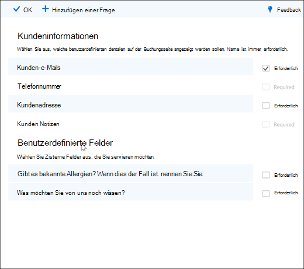
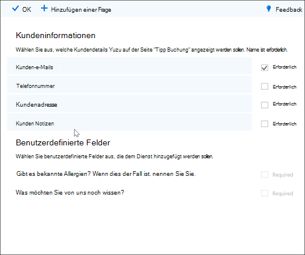
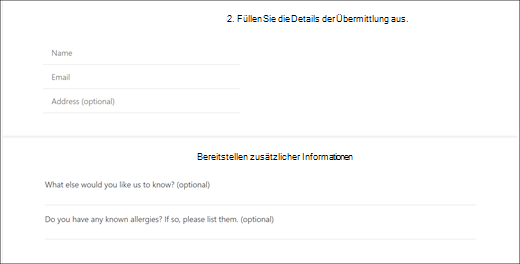

# Hinzufügen von benutzerdefinierten und erforderlichen Fragen zur BuchungsseiteAdd custom and required questions to the booking page

Mit Buchungen können Sie Fragen erstellen, um Ihre Kunden bei der Buchung von Terminen zu Fragen.Bookings lets you create questions to ask your customers when they are booking appointments. Außerdem können Sie auswählen, welche Fragen erforderlich sind.It also lets you choose which questions are required.

Sie ordnen die Fragen einem Dienst zu, sodass jeder Dienst eine andere Gruppe von Fragen haben kann.You associate the questions with a service, so each service can have a different set of questions. Ein Friseur kann beispielsweise Kunden bitten, die einen haarfärbungs Termin buchen, wenn es sich um bekannte Allergien für Bleiche oder Farbtöne handelt.For example, a hair stylist may ask customers who are booking a hair coloring appointment if they have any known allergies to bleaches or tints. Auf diese Weise können Sie und ihre Kunden Zeit sparen, wenn Sie Ihren Termin erreichen.This allows you and your customers to save time when they arrive for their appointment.

Den Kunden werden die benutzerdefinierten Fragen angezeigt, wenn Sie Ihren Termin auf der Buchungsseite erstellen.The customers will see the custom questions when they are creating their appointment on the booking page. Die Mitarbeiter sehen die benutzerdefinierten Fragen beim Erstellen einer neuen Buchung aus dem Buchungskalender oder beim Anzeigen eines vorhandenen Termins.Staff will see the custom questions when they create a new booking from the Bookings calendar or when viewing an existing appointment. Bei Buchungen werden alle Ihre Fragen in einer Masterliste gespeichert, sodass Sie nicht für jeden Dienst dieselben Fragen erneut erstellen müssen.Bookings saves all of your questions to a master list so that you don't have to re-create the same questions for every service. Sie können auch auswählen, ob Fragen erforderlich oder optional sind.You can also choose whether questions are required or optional.

> [!NOTE]
> Die Antworten des Kunden auf die Fragen können Sie sehen, wenn Sie sich Ihren Termin im Buchungskalender ansehen.The customer's answers to the questions can be seen when you look at their appointment in the booking calendar.

Weitere Informationen zum personalisieren und Anpassen Ihrer Buchungsseite finden Sie unter [Anpassen Ihrer Buchungsseite](customize-booking-page.md).For more information about how to personalize and customize your booking page, see [Customize your booking page](customize-booking-page.md).

## Hinzufügen von benutzerdefinierten Fragen zu Ihren DienstenAdd custom questions to your services

1. Melden Sie sich bei Microsoft 365 an, und wechseln Sie zu **Buchungen**.Sign in to Microsoft 365 and go to **Bookings**.

1. Wechseln Sie zu **Dienste** , und bearbeiten Sie entweder einen vorhandenen Dienst, oder **fügen Sie einen Dienst hinzu**.Go to **Services** and either edit an existing service or **Add a service**.

1. Scrollen Sie nach unten zum Abschnitt **benutzerdefinierte Felder** , und wählen Sie dann **ändern**aus.Scroll down to the **Custom fields** section, and then select **Modify**.

   Wir haben bereits einige grundlegende Fragen zur Kundeninformation hinzugefügt: Kunden-e-Mail, Telefonnummer, Kundenadresse und Kunden Notizen.We already added some basic customer information questions: Customer email, phone number, customer address, and customer notes. Wenn Sie dies zum ersten Mal durchführen, werden die Fragen zur Kundeninformation in grau markiert.The first time you do this, the customer information questions are highlighted in gray. Das bedeutet, dass dem Benutzer diese Frage angezeigt wird.That means that the user will see this question. Wenn Sie die Frage auswählen, wird das Hervorhebungsfeld um Sie herum ausgeblendet, und Ihr Kunde wird diese Frage nicht gestellt.If you select the question, the highlight box around it will disappear and your customer won't be asked that question.

   In diesem Beispiel wurden die Telefonnummer und Kunden Notizen deaktiviert, und wir haben zwei neue benutzerdefinierte Fragen erstellt, die Sie stellen sollten.In this example, phone number and customer notes have been turned off and we created two new custom questions to ask.

   

1. Um die Frage erforderlich zu machen, aktivieren Sie das Kontrollkästchen **erforderlich** .To make the question required, select the **Required** checkbox. Ihr Kunde kann die Buchung erst abschließen, nachdem er die erforderlichen Fragen beantwortet hat.Your customer won't be able to complete the booking until they've answered the required questions.

1. Um eine benutzerdefinierte Frage zu erstellen, wählen Sie am oberen Rand des Bereichs **eine Frage hinzufügen** aus.To create a custom question, select **Add a question** from the top of the panel. Schreiben Sie Ihre Frage, und wählen Sie dann **Speichern**aus.Write your question, and then select **Save**.

1. Klicken Sie auf die Frage, um Sie zu aktivieren.Click on the question to enable it. Um ihn herum wird ein hervorgehobenes Feld angezeigt, und die Frage ist aktiviert.A highlighted box appears around it and the question is enabled.

1. Klicken Sie oben auf der Seite auf **OK** , und speichern Sie dann **den Dienst**.Click **Ok** at the top of the page, and then **Save the service**.

Durch Buchungen werden alle Ihre benutzerdefinierten Fragen in einer Masterliste gespeichert, sodass Sie jedem Dienst problemlos Fragen hinzufügen können, ohne dieselben Fragen wiederholt eingeben zu müssen.Bookings will save all of your custom questions in a master list so that you can easily add questions to each service without needing to repeatedly type the same questions. Wenn Sie beispielsweise einen anderen Dienst öffnen, wird die Frage, die Sie für den ersten Dienst erstellt haben, im Abschnitt benutzerdefinierte Felder angezeigt, aber er wird deaktiviert.For example, if you open a different service, the question you created for the first service will show in the Custom fields section, but it wil be disabled. Klicken Sie auf die Frage, sodass ein hervorgehobenes Rechteck angezeigt wird und die Frage aktiviert ist.Click the question so that a highlighted rectangle displays and the question is enabled.

In diesem Beispiel können Sie sehen, dass die Fragen, die für den ersten Dienst hinzugefügt wurden, für diesen Dienst zur Verfügung stehen.In this example, you can see that the questions that were added for the first service are available for this service. Alle Fragen, die Sie für diesen Dienst erstellen, stehen für alle Dienste zur Verfügung.Any questions you create for this service will be available for all services.

   

Wenn Ihre Buchungsseite bereits veröffentlicht ist, müssen Sie nichts anderes tun.If your booking page is already published, you don't need to do anything else. Kunden sehen die Fragen, wenn Sie das nächste Mal mit Ihnen buchen.Customers will see the questions the next time they book with you. Wenn Ihre Buchungsseite noch nicht veröffentlicht wurde, navigieren Sie in Outlook im Internet zur **Buchungsseite** , und wählen Sie dann **Speichern und veröffentlichen**aus.If your booking page isn't published yet, go to the **booking page** from Outlook on the web, and then select **Save and publish**.

> [!WARNING]
> Sie können auch Fragen aus der Masterliste löschen.You can also delete questions from the master list. Wenn Sie jedoch eine Frage löschen, wird Sie aus jedem Dienst gelöscht.However, if you delete a question it will be deleted from every service. Es wird empfohlen, dass Sie die Frage deaktivieren, indem Sie Sie auswählen, um sicherzustellen, dass Sie keine Auswirkungen auf andere Dienste haben.We recommend that you disable the question by selecting it to ensure you do not impact any other services. Sie können sehen, dass eine Frage deaktiviert ist, wenn Sie nicht von einem markierten Rechteck umgeben ist.You can see that a question is disabled if it is not surrounded by a highlighted rectangle.

## KundenerfahrungCustomer experience

Wenn Ihre Kunden einen Termin mit Ihnen buchen, werden die grundlegenden Fragen zur Kundeninformation im Abschnitt **Ihre Details hinzufügen** angezeigt.When your customers book an appointment with you, the basic customer information questions will show in the **Add your details** section. Alle benutzerdefinierten Fragen, die Sie hinzufügen, finden Sie im Abschnitt **zusätzliche Informationen bereitstellen** .Any customized questions you add will be in the **Provide additional information** section.

## Mitarbeiter ErfahrungStaff experience

Wenn Ihre Kunden einen Termin bei Ihnen buchen, werden Ihre Mitarbeiter die Fragen und Antworten des Kunden auf dem Buchungskalender angezeigt.When your customers book an appointment with you, your staff will see the questions and the customer's answers on the booking calendar. Um es anzuzeigen, gehen Sie zu **Buchungen** \> **Kalender** und öffnen Sie einen Termin.To see it, go to **Bookings** \> **Calendar** and then open an appointment.

