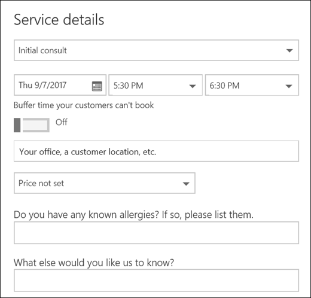

# Benutzerdefinierte und erforderliche Fragen zur Buchungsseite hinzufügen

Mit Bookings können Sie Fragen erstellen, die Ihre Kunden beim Buchen von Terminen stellen. Außerdem können Sie auswählen, welche Fragen erforderlich sind.

Sie ordnen die Fragen einem Dienst zu, sodass jeder Dienst verschiedene Fragen haben kann. Beispielsweise kann ein Haarstyrist Kunden, die einen Termin für die Haarfarbe buchen, fragen, ob sie über bekannte Allergiker zu Bleichmitteln oder Farbtonungen verfügen. Auf diese Weise können Sie und Ihre Kunden Zeit sparen, wenn sie zu ihrem Termin kommen.

Den Kunden werden die benutzerdefinierten Fragen angezeigt, wenn sie ihren Termin auf der Buchungsseite erstellen. Die Benutzerdefinierten Fragen werden den Mitarbeitern beim Erstellen einer neuen Buchung aus dem Bookings-Kalender oder beim Anzeigen eines vorhandenen Termins angezeigt. Bookings speichert alle Ihre Fragen in einer Masterliste, sodass Sie nicht die gleichen Fragen für jeden Dienst neu erstellen müssen. Sie können auch auswählen, ob Fragen erforderlich oder optional sind.

> [!NOTE]
> Die Antworten des Kunden auf die Fragen werden angezeigt, wenn Sie sich den Termin im Buchungskalender anschauen.

Weitere Informationen zum Personalisieren und Anpassen Ihrer Buchungsseite finden Sie unter [Customize your booking page](customize-booking-page.md).

## Hinzufügen benutzerdefinierter Fragen zu Ihren Diensten

1. Melden Sie sich bei Microsoft 365 an, und wechseln Sie zu **Bookings**.

1. Wechseln Sie zu **Dienste,** und bearbeiten Sie entweder einen vorhandenen Dienst, oder **fügen Sie einen Dienst hinzu.**

1. Scrollen Sie nach unten zum Abschnitt **Benutzerdefinierte** Felder, und wählen Sie dann **Ändern aus.**

   Wir haben bereits einige grundlegende Fragen zu Kundeninformationen hinzugefügt: Kunden-E-Mail, Telefonnummer, Kundenadresse und Kundennotizen. Wenn Sie dies zum ersten Mal tun, werden die Fragen zu Kundeninformationen in Grau hervorgehoben. Das bedeutet, dass dem Benutzer diese Frage angezeigt wird. Wenn Sie die Frage auswählen, wird das Hervorhebungsfeld um sie herum ausgeblendet, und Ihr Kunde wird diese Frage nicht gestellt.

   In diesem Beispiel wurden Telefonnummern und Kundennotizen deaktiviert, und wir haben zwei neue benutzerdefinierte Fragen erstellt.

   

1. Aktivieren Sie das Kontrollkästchen Erforderlich, um die erforderliche **Frage** zu stellen. Ihr Kunde kann die Buchung erst abschließen, wenn er die erforderlichen Fragen beantwortet hat.

1. Wählen Sie zum Erstellen  einer benutzerdefinierten Frage oben im Bereich Die Option Frage hinzufügen aus. Schreiben Sie Ihre Frage, und wählen Sie dann **Speichern aus.**

1. Klicken Sie auf die Frage, um sie zu aktivieren. Es wird ein hervorgehobenes Feld angezeigt, und die Frage ist aktiviert.

1. Klicken **Sie oben** auf der Seite auf Ok, und speichern Sie dann den **Dienst**.

Bei Bookings werden alle benutzerdefinierten Fragen in einer Masterliste gespeichert, sodass Sie jedem Dienst problemlos Fragen hinzufügen können, ohne die gleichen Fragen wiederholt eingeben zu müssen. Wenn Sie beispielsweise einen anderen Dienst öffnen, wird die Frage, die Sie für den ersten Dienst erstellt haben, im Abschnitt Benutzerdefinierte Felder angezeigt, aber deaktiviert. Klicken Sie auf die Frage, damit ein hervorgehobenes Rechteck angezeigt wird und die Frage aktiviert ist.

In diesem Beispiel sehen Sie, dass die Fragen, die für den ersten Dienst hinzugefügt wurden, für diesen Dienst verfügbar sind. Alle Fragen, die Sie für diesen Dienst erstellen, sind für alle Dienste verfügbar.

   

Wenn Ihre Buchungsseite bereits veröffentlicht wurde, müssen Sie nichts anderes tun. Kunden werden die Fragen beim nächsten Buchen bei Ihnen sehen. Wenn Ihre Buchungsseite noch nicht veröffentlicht wurde, wechseln Sie von Outlook im Web zur Buchungsseite, und wählen Sie **dann Speichern und Veröffentlichen aus.** 

> [!WARNING]
> Sie können auch Fragen aus der Masterliste löschen. Wenn Sie jedoch eine Frage löschen, wird sie aus jedem Dienst gelöscht. Es wird empfohlen, die Frage zu deaktivieren, indem Sie sie auswählen, um sicherzustellen, dass Sie keine Auswirkungen auf andere Dienste haben. Sie können sehen, dass eine Frage deaktiviert ist, wenn sie nicht von einem hervorgehobenen Rechteck umgeben ist.

## Kundenerfahrung

Wenn Ihre Kunden einen Termin bei Ihnen buchen, werden die grundlegenden Fragen zu Kundeninformationen im Abschnitt **Details hinzufügen** angezeigt. Alle von Ihnen hinzugefügten benutzerdefinierten Fragen finden Sie im Abschnitt **Zusätzliche Informationen** bereitstellen.

## Mitarbeitererfahrung

Wenn Ihre Kunden einen Termin bei Ihnen buchen, sehen Ihre Mitarbeiter die Fragen und Antworten des Kunden im Buchungskalender. Um dies anzuzeigen, wechseln Sie zu **Bookings** \> **Calendar,** und öffnen Sie dann einen Termin.

