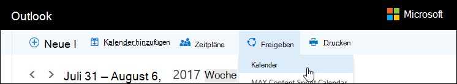
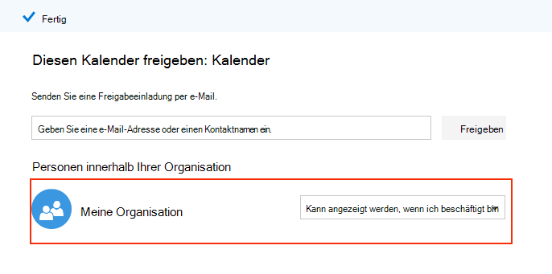
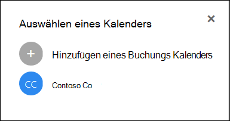

# Häufig gestellte Fragen zu Microsoft-BuchungenMicrosoft Bookings Frequently Asked Questions

## AllgemeinGeneral

### Was ist Microsoft-Buchungen?What is Microsoft Bookings?

Microsoft Booking ist eine Microsoft 365-APP, die das Planen und Verwalten von Terminen vereinfacht.Microsoft Bookings is a Microsoft 365 app that makes scheduling and managing appointments easy. Buchungen Incudes einen webbasierten Buchungskalender und integriert sich in Outlook, um den Kalender Ihres Mitarbeiters zu optimieren, sodass Ihre Kunden flexibel sein können, um eine Zeit zu buchen, die für Sie am besten geeignet ist.Bookings incudes a Web-based booking calendar and integrates with Outlook to optimize your staff’s calendar, giving your customers flexibility to book a time that works best for them. Durch automatische Benachrichtigungs-e-Mails werden keine Shows reduziert, und Organisationen sparen Zeit mit einer Reduzierung der wiederkehrenden Planungsaufgaben.Automated notification emails reduce no-shows, and organizations save time with a reduction in repetitive scheduling tasks. Buchungen helfen Ihnen bei der einfachen Durchführung virtueller Termine über Skype oder Microsoft Teams und unterstützen Sie bei der täglichen Planung über die app "Buchungen" in Microsoft Teams.Bookings helps you easily conduct virtual appointments via Skype or Microsoft Teams, and helps you manage day-to-day scheduling via the Bookings app in Teams. Durch die integrierte Anpassung können Buchungen so konzipiert werden, dass Sie den Anforderungen mehrerer Teile einer Organisation entsprechen.With built-in ability to customize, Bookings is designed to meet the needs of multiple parts of any organization.

### Wie verwende ich Microsoft-Buchungen?How do I use Microsoft Bookings?

Reservierungen sind ein Onlinedienst, sodass Sie nichts herunterladen müssen.Bookings is an online service, so you don't need to download anything. Wechseln Sie im Microsoft 365-Weberlebnis einfach zur APP-Auswahl.Just go to the app chooser within the Microsoft 365 Web experience. Administratoren können auch die Begleit-app "Buchungen" verwenden, um aktuelle Informationen über Kunden und deren Termine auf dem neuesten Stand zu halten.Administrators can also use the Bookings companion app to stay current with the latest information about customers and their appointments.

### Wer hat Zugriff auf Microsoft-Buchungen?Who has access to Microsoft Bookings?

Reservierungen sind standardmäßig für Microsoft 365 Business Premium-, a3-, A5-, E3-und E5-Kunden weltweit verfügbar und aktiv.Bookings is available and active by default for Microsoft 365 Business Premium, A3, A5, E3, and E5 customers worldwide. Reservierungen sind auch in Office 365 betrieben von 21Vianet verfügbar.Bookings is also available in Office 365 operated by 21Vianet.

### Werden meine Kunden meinen persönlichen oder geschäftlichen Kalender sehen?Will my customers see my personal or business calendar?

Ihren Kunden wird nur der Buchungskalender angezeigt, den Sie online für die Dienste, Zeiten und Mitarbeiter veröffentlichen, die Sie registrieren möchten.Your customers will only see the Bookings calendar that you publish online for the services, times, and staff that you choose to register.

### Wie greifen Endbenutzer auf die app "Buchungen" zu?How do end users access the Bookings app?

Jeder, der für Microsoft 365 Business Premium, a3, A5, E3, E5 oder als Mitarbeiter in der Administrator-oder Viewer-Rolle lizenziert ist, kann in der APP-Auswahl im Microsoft 365-Weberlebnis auf Buchungen zugreifen.Anyone who is licensed for Microsoft 365 Business Premium, A3, A5, E3, E5, or is added as a staff member in either the Administrator or Viewer roles can access Bookings in the app chooser within the Microsoft 365 Web experience. Es gibt auch eine Begleit-APP, die für IOS und Android verfügbar ist.There is also a companion app available for iOS and Android.

### Kann ich Buchungen in meiner eigenen Website verwenden?Can I use Bookings in my own Web site?

Ja.Yes. Wir bieten Ihnen die Möglichkeit, ihren Buchungskalender in Ihrer Website über einen iframe einzubetten.We provide a way for you to embed your Bookings calendar in your site via an iFrame. Link Einbettungscode befindet sich auf der Registerkarte **Buchungen** in der APP Buchungen.Link embedding code is located in the **Bookings page** tab within the Bookings app.

### Kann ich Buchungen auch dann verwenden, wenn ich nicht über eine Webseite für mein Unternehmen verfüge?Can I use Bookings even if I don’t have a Web page for my business?

Ja.Yes. Wir bieten einen Link zu ihrer Buchungsseite auf der Registerkarte **Buchungsseite** in der Webanwendung.We provide a link to your booking page within the **Booking page** tab in the Web app. Sie müssen lediglich diesen Link ihren Kunden oder Kunden bereitstellen, und die neuesten Verfügbarkeitsinformationen für Ihr Unternehmen werden angezeigt.You just need to provide that link to your customers or clients, and they will see the latest availability information for your business. Alternativ können Sie die Buchungsseite in sozialen Medien freigeben oder sogar die embed-Funktion verwenden, um Sie in einem IFRAME-Element zu hosten.Alternatively, you can share the booking page in social media or even use the embed feature to host it in an iFrame. Sie haben auch die Möglichkeit, zu steuern, wer auf die Seite zugreifen kann, indem Sie die Indizierung des direkten Suchmoduls deaktivieren und den Zugriff auf die in Ihrer Organisation beschränken.You also have the ability to control who can access the page by disabling direct search engine indexing and restricting access to only those within your organization.

### Kann unsere IT-Abteilung steuern, ob Endbenutzer auf Buchungen zugreifen können?Can our IT department control whether end users can access Bookings?

Reservierungen sind standardmäßig in Business Premium, M365 a3/a5 und E3/E5-Mandanten verfügbar, Administratoren können diese Option jedoch im Microsoft 365 Admin Center deaktivieren.Bookings is available in Business Premium, M365 A3/A5 and E3/E5 tenants by default, but administrators can turn it off in the Microsoft 365 admin center if they choose. Befolgen Sie dazu [die folgenden Anweisungen](turn-bookings-on-or-off.md).To do so, [follow these instructions](turn-bookings-on-or-off.md).

Wenn ein Kunde den Zugriff auf Buchungen für bestimmte berechtigte Lizenzen in seinem Mandanten deaktivieren möchte, kann er entweder eine Gruppenrichtlinie zum Einschränken von Lizenzen oder eine OWA-Postfachrichtlinie implementieren, mit der verhindert wird, wer neue Buchungskalender erstellen kann.If a customer wants to disable access to Bookings for certain eligible licenses in their tenant, they can either user a group policy to restrict licenses or implement an OWA Mailbox policy that will restrict who is able to create new Bookings calendars.

Wenn Sie eine OWA-Postfachrichtlinie zum Deaktivieren des Zugriffs auf Buchungen verwenden, verfügen alle Benutzer über eine Buchungs Lizenz, doch wenn Sie versuchen, auf die APP zuzugreifen, sind Sie nur dann erfolgreich, wenn Sie Teil der Richtlinie sind oder wenn Sie einem vorhandenen Buchungskalender als Mitarbeiter hinzugefügt wurden.If you use an OWA Mailbox policy to disable access to Bookings, all users will have a Bookings license, however when they attempt to access the app, they will only be successful if they are part of the policy or if they have been added to an existing Bookings calendar as staff. Details [hierzu finden](turn-bookings-on-or-off.md) Sie im Abschnitt "nur ausgewählte Benutzer dürfen Buchungskalender erstellen".Details [here](turn-bookings-on-or-off.md) in the “Allow only selected users to create Bookings calendars” section.

### Sind Buchungen anpassbar?Is Bookings customizable?

Ja, Buchungen sind anpassbar und können für eine Vielzahl unterschiedlicher Szenarien verwendet werden.Yes, Bookings is customizable and can be used for a variety of different scenarios. Beim Einrichten eines Buchungs Kalenders können viele Aspekte der webbasierten Planungsseite, Ihre Geschäftsinformationen, Mitarbeiterdetails, Diensttypen und Planungsrichtlinien angepasst werden.When setting up a Bookings calendar, many aspects of the Web-based scheduling page, your business information, staff details, service types, and scheduling policies can be customized.

### Sind alle Funktionen der ursprünglichen Buchungen-Webanwendung in Microsoft Teams verfügbar?Is all the functionality of the original Bookings Web app available in Microsoft Teams?

Eine einfache Version von Buchungen steht jetzt als app in Microsoft Teams zur Verfügung.A lightweight version of Bookings is now available as an app in Teams. Die erste Ankündigung finden Sie [hier](https://www.microsoft.com/microsoft-365/blog/2020/03/06/empowering-care-teams-with-new-tools-in-microsoft-365/).Please find the initial announcement [here](https://www.microsoft.com/microsoft-365/blog/2020/03/06/empowering-care-teams-with-new-tools-in-microsoft-365/). Es gibt Deep Link-Funktionen, die in der Webanwendung eingeblendet werden, und nach dem Setup kann die tägliche Verwendung von Buchungen ohne vorheriges verlassen von Teams erfolgen.There is deep link functionality to pop out in the Web app, and after setup, day-to-day use of Bookings can be done without ever leaving Teams. Informationsfluss über Plattformen hinweg.Information flows across platforms.

### Handelt es sich um Buchungen, die ein kleines Unternehmen oder ein Unternehmensangebot oder beides bieten?Is Bookings a small business offering or an Enterprise offering or both?

Buchungen sind eine ideale Lösung für Kunden in Unternehmen und Kleinunternehmen in verschiedenen Branchen.Bookings is an ideal solution for both Enterprise and small business customers, across a variety of industries. Zu den Anwendungsfällen zählen folgende:Use cases include:

- FinanzdienstleistungenFinancial services
    - Konsultationenconsultations
    - Bank-und Versicherungsdienstebanking and insurance services
    - steueranmeldungentax filings

- Personalwesen (HR)Human resources (HR)
    - Kandidaten Interviewscandidate interviews
    - Onboardingonboarding
    - Unterstützungsleistungenbenefits assistance
    - Schulungen und Seminaretraining and seminars

- GesundheitswesenHealthcare
    - Patientenbesuchepatient visits
    - Zusammenarbeit zwischen Anbietern und Anbieternprovider-to-provider collaboration
    - Versicherungs Beratungeninsurance consults

- Öffentliche Verwaltung & öffentlichen SektorsGovernment & Public Sector
    - gerichtliche Anhörungen und Versuchecourt hearings and trials
    - öffentliche Dienstepublic services
    - Abteilungs Terminedepartment appointments

- Bildung--K-12Education -- K-12
    - übergeordnete Lehrerkonferenzenparent-teacher conferences
    - School Town Hallschool town hall
    - Besuche von Schülern und Ratgebernstudent-counselor visits

- Bildung – höhere edEducation -- Higher Ed
    - Geschäftszeitenoffice hours
    - Nachhilfetutoring
    - Studentische Dienstestudent services
    - Anmeldung bei der Prüfungexam sign-up

- EinzelhandelRetail
    - Unterstützte Shopsassisted shopping
    - Planen von Auftragnehmerncontractor scheduling
    - Entwurfs Dienstedesign services

- Allgemeine Anforderungen für Unternehmen und kleine UnternehmenGeneral Enterprise and small business needs
    - Kunden-und Kundenbesprechungencustomer and client meetings
    - Technischer Supporttech support
    - rechtliche Bewertungenlegal reviews
    - Einrichtungenfacilities

## Preise und LizenzierungPricing and licensing

### Wie erhalte ich Microsoft-Buchungen?How do I get Microsoft Bookings?

Reservierungen sind in Microsoft 365 für Kunden mit Business Premium-, a3-, A5-, E3-und E5-Lizenzen sowie einer IOS-und Android-Begleit-app verfügbar.Bookings is available in Microsoft 365 for customers with Business Premium, A3, A5, E3, and E5 licenses, along with an iOS and Android companion app. Reservierungen stehen nicht als eigenständige App zur Verfügung.Bookings is not available as a standalone app. Outlook Web App oder Outlook im Internet muss für die Verwendung von Buchungen aktiviert sein, da Daten in Outlook gespeichert werden.Outlook Web App or Outlook on the web must be enabled to use Bookings, as it stores data within Outlook.

Eine Buchungs Lizenz bietet vollständige Funktionen für das Produkt, einschließlich der Erstellung und Verwaltung von Kalendern.A Bookings license provides full functionality to the product, including creating and managing calendars. Außerdem können Benutzer vorhandene Kalender anzeigen und bearbeiten, wenn diese Benutzer als Mitarbeiter einer Administrator-oder Viewer-Rolle hinzugefügt werden.It also enables the ability for users to view and edit existing calendars, when those users are added as staff in an Administrator or Viewer role.

### Muss ich mein e-Mail-Konto von meinem aktuellen Anbieter zu Microsoft 365 migrieren?Do I need to migrate my email account from my current provider to Microsoft 365?

Sie können Ihren aktuellen Anbieter behalten, aber Reservierungen senden alle Benachrichtigungen an die e-Mail, die in Ihrem Microsoft 365-Konto verwendet wird.You can keep your current provider, but Bookings will send all notifications to the email used in your Microsoft 365 account.

### Können meine Mitarbeiter Buchungen ohne ein Microsoft 365-Konto verwenden?Can my employees use Bookings without a Microsoft 365 account?

Ja.Yes. Sie können Ihre Mitarbeiter mit jeder e-Mail hinzufügen, und Sie erhalten weiterhin die e-Mail-Bestätigung und den Kalender einladen, wenn jemand einen Termin mit Ihnen Bucht.You can add your staff with any email, and they will still get the email confirmation and the calendar invite when someone books an appointment with them.

### Kann ich mehr als einen Buchungskalender unter dem gleichen Microsoft 365-Konto erstellen und zwischen diesen wechseln?Can I create more than one Bookings calendar under the same Microsoft 365 account and switch between them?

Ja.Yes. Sie können mehr als einen Buchungskalender mit einem Konto erstellen und verwalten.You can create and manage more than one Bookings calendar with one account. Sie können zwischen diesen mithilfe der Einfügemarke neben dem Namen des Unternehmens in der Webanwendung Buchungen wechseln.You can switch between them using the caret next to the business name in the Bookings Web app.

### Was geschieht, wenn meine Organisation über gemischte Lizenzen mit F1/F3, E1 und E3/E5 verfügt?What if my organization has mixed licenses with F1/F3, E1, and E3/E5?

Wir erkennen, dass viele Organisationen eine Mischung aus Microsoft 365-Lizenzierung haben.We recognize that many organizations have a mixture of Microsoft 365 licensing. Beispielsweise kann ein Kunde M365 E3-Lizenzen für Mitarbeiter in seinem Hauptsitz, aber M365 E1 (oder F1 oder F3) Lizenzen für Ihre Store-Mitarbeiter haben.For example, a customer may have M365 E3 licenses for employees in their headquarters, but M365 E1 (or F1 or F3) licenses for their store employees.

In diesem Beispiel haben die Mitarbeiter der Hauptniederlassung mit einer M365 E3-Lizenz Vollzugriff auf Buchungen, was bedeutet, dass Sie neue Kalender erstellen, Einstellungen bearbeiten, Mitarbeiter hinzufügen, eine Buchungsseite veröffentlichen, Termine im Kalender erstellen und verwalten und Berichte abrufen können.In this example, the headquarters employees with an M365 E3 license have full access to Bookings, which means they can create new calendars, edit settings, add staff, publish a booking page, create and manage appointments within the calendar, and pull reports.

Diese Speicher Mitarbeiter mit E1/F1/F3-Lizenzen oder ohne Lizenzen können weiterhin Kalendern in einer Gastrolle als Mitarbeiter hinzugefügt und dann für Termine gebucht werden, und Sie erhalten Bestätigungs-e-Mails, wenn Sie gebucht werden.Those store employees with E1/F1/F3 licenses, or with no licenses, can still be added as staff to calendars in a Guest role and then booked for appointments, and they will receive confirmation emails when they are booked. Sie können weiterhin während der verfügbaren/geplanten Stunden gebucht werden, wie auf der Registerkarte Mitarbeiter aufgeführt. Die Verfügbarkeit von Buchungen Kalender beschränkt buchmäßige Zeiten nach festgelegten Stunden und Service Stunden.They can still be booked during their available/scheduled hours as listed in the staff tab. The Bookings calendar availability constrains bookable times by their set hours and service hours.

Die Store-Mitarbeiter werden auch in Buchungen als nicht verfügbar angezeigt, wenn ein Termin bereits zu diesem Zeitpunkt über die Buchungen-Webanwendung geplant wurde.The store employees will also display as unavailable in Bookings if an appointment has already been scheduled at that time through the Bookings Web app. Überbuchungen gebuchte Termine reflektieren den Kalender eines Mitarbeiters im Rahmen von Buchungen als belegt.Appointments booked via Bookings will reflect as busy on a staff member's calendar within Bookings. Mitarbeiter mit einer Lizenz für nicht-Buchungen können Ihren persönlichen Kalender immer noch auf ihre Verfügbarkeit bei Buchungen auswirken, vorausgesetzt, Sie befinden sich innerhalb desselben Mandanten.Staff with a non-Bookings enabled license can still have their personal calendar impact their availability in Bookings, provided they are within the same tenant.

Personen in der Rolle "Gäste" können alle Informationen anzeigen, die der Kunde innerhalb der anfänglichen Terminerstellung bereitgestellt hat.People in the Guests role can view any of the information the customer has provided within the initial appointment creation. Wenn beispielsweise der für den Termin gebuchte Filial Vertreter den Kunden vor dem Termin anrufen muss, hat er Zugriff auf die Informationen, die der Kunde während des Planungsprozesses zur Verfügung stellt.For example, if the store representative who is booked for the appointment is required to call the customer prior to the appointment, they will have access to the information the customer provides during the scheduling process. Der gebuchte Mitarbeiter hat Zugriff auf alle Informationen, die in der Bestätigungs-e-Mail angezeigt werden, sowie auf das Kalenderereignis. ICS (beispielsweise die Kundentelefonnummer, wenn es eingegeben wurde).The staff member who is booked will have access to all information that appears in the confirmation email, as well as the .ics calendar event (such as the customer phone number if it was entered).

Personen in der Gastrolle können nicht auf die Buchungen-Webanwendung zugreifen, um Einstellungen zu ändern oder Termine anzuzeigen und zu verwalten (hinzufügen, Abbrechen und neu planen).People in the Guest role will not have the ability to access the Bookings Web app to change settings or to view and manage appointments (add, cancel, and reschedule). Sie können jedoch im Namen von Kunden mit der Self-Service-Seite Termine vereinbaren, genauso wie ein Kunde einen Termin vereinbaren würde.However, they can make appointments on behalf of customers using the Self-service page, in the same way that a customer would make an appointment.

Wir empfehlen die Lizenzierung eines Business Managers oder Administrators jedes Shops mit einer berechtigten Lizenz zum Einrichten und Verwalten von Seiten und Terminen.We recommend licensing a business manager or administrator of each store with a Bookings-eligible license to set up and manage pages and appointments. Der Rest des Personals würde dann mit dem mit Buchungen lizenzierten Mitarbeiter zusammenarbeiten, um eine Buchung neu zu planen oder zu stornieren.The rest of the staff would then work with the employee licensed with Bookings in order to reschedule or cancel a booking.

## ProduktfeaturesProduct features

### Wo werden Buchungen von Kalendern in meinem Microsoft 365-Mandanten angezeigt? \* \*Where do Bookings calendars show up in my Microsoft 365 tenant?\*\*

Jeder neue Buchungskalender erstellt ein entsprechendes Postfach in Exchange sowie einen zugehörigen Eintrag in Azure Active Directory (AAD), in dem der Eintrag als nicht lizenzierter Benutzer aufgeführt wird.Each new Bookings calendar creates a corresponding mailbox in Exchange, as well as a related entry in Azure Active Directory (AAD), where the entry is listed as an unlicensed user.

### Kann ich einen zuvor erstellten Buchungskalender löschen?Can I delete a previously created Bookings calendar?

Um einen Buchungskalender zu löschen, müssen Sie das zugehörige Postfach in Exchange löschen.In order to delete a Bookings calendar you must delete the associated mailbox in Exchange.

### Wenn ich einen Kalender erstelle und ein anderer Benutzer Zugriff auf Buchungen hat, würde er dann meinen Kalender sehen können?If I create a calendar and someone else has access to Bookings, would they be able to see my calendar?

Die einzigen Personen, die Zugriff auf Buchungskalender haben, die Sie (über die Webanwendung) erstellen, sind Personen, die als Mitarbeiter in einer Administrator-oder Viewer-Rolle hinzugefügt wurden.The only people who have access to Bookings calendars that you create (through the Web app) is anyone who has been added as staff, in either an Administrator or Viewer role. Mandantenadministratoren können eine Liste aller Buchungen von Postfächern in Exchange und Aad anzeigen.Tenant admins will be able to see a list of all Bookings mailboxes in Exchange and AAD.

### Sind Videokonferenz Besprechungen in die app "Buchungen" integriert?Are video conferencing meetings integrated into the Bookings app?

Online Besprechungen sind innerhalb von Buchungen verfügbar, wenn Sie die Skype-oder Microsoft Teams-Clients verwenden.Online meetings are available within Bookings when using the Skype or Microsoft Teams clients. Online Besprechungen können auf Dienstebene aktiviert werden, und der ausgewählte Besprechungsclient (Skype oder Teams) ist für einen gebuchten Mitarbeiter standardmäßig festgelegt.Online meetings can be enabled at the service-level, and the meeting client you choose (Skype or Teams) will be the one set by default for a booked staff member. Um an den Onlinebesprechungen teilzunehmen, erhält jeder neue Termin einen eindeutigen Besprechungslink, der dem Termin zugeordnet ist, außerdem werden einfache Join-Optionen im Ereignis und in Bestätigungs-e-Mails berücksichtigt.To join the online meetings, each new appointment will have a unique meeting link attached to the appointment, and in addition, easy join options are included in the event and in confirmation emails.

### Wie funktioniert die Planungsrichtlinie?How does scheduling policy work?

Eine Einstellung mit dem Namen " **Maximale Vorlaufzeit** " bestimmt am weitesten vorn (gemessen in Tagen), dass eine Buchung vorgenommen werden kann.A setting called **Maximum lead time** determines the farthest in advance (measured in days) that a booking can be made. Es muss mindestens 24 Stunden zwischen **minimaler Vorlaufzeit** (Mindestdurchlaufzeit, in Stunden, für Buchungen und Stornierungen) und maximaler Vorlaufzeit liegen.There must be at least 24 hours between **Minimum lead time** (the minimum lead time, in hours, for bookings and cancellations) and Maximum lead time. Die maximale Vorlaufzeit kann auf einen Tag festgelegt werden, wenn minimale Vorlaufzeit auf 0 Stunden festgelegt ist, was in diesem Fall bedeutet, dass ein Kunde eine Buchung bis zu dem Zeitpunkt, zu dem er beginnt, stornieren kann, und Kunden nur Buchungen planen können, wenn der Termin innerhalb des nächsten Tages liegt.Maximum lead time can be set to one day if Minimum lead time is set to 0 hours, which in this case means a customer can cancel a booking up until the time that it starts, and customers can only schedule bookings if the appointment is within the next day.

:::image type="content" source="media/bookings-faq-scheduling.png" alt-text="Planen in Buchungen":::

### Wie funktioniert die Buchung über Zeitzonen hinweg?How does Bookings work across time zones?

Alle Zeiten befinden sich standardmäßig in der Geschäftszeit Zone (Ihre lokale Zeitzone).All times are in the business time zone (your local time zone) by default. Dies bedeutet, dass alle Einstellungen, die Sie für einen Buchungskalender konfigurieren, wie etwa Arbeitsstunden, in dieser Zeitzone angezeigt werden.This means any setting you configure for a Bookings calendar, such as working hours, will appear in this time zone. Die Self-Service-Seite hat die Möglichkeit, alle Termin Zeiten in der Zeitzone des Endbenutzers anzuzeigen, die bei Bedarf deaktiviert werden kann.The Self-service page has the ability to display all the appointment times in the end-user's time zone, which can be turned off if desired.Wenn **Zeitschlitze in der Geschäfts Zeitzone immer angezeigt** werden, bleibt die Kontrollkästchen auf der Seite "Buchungen" deaktiviert, und die Benutzer der Seite sehen Zeitschlitze in ihren eigenen lokalen Zeitzonen. If **Always show time slots in business time zone** remains unchecked on the Bookings page tab, then people visiting the page will see time slots in their own local time zones.

:::image type="content" source="media/bookings-faq-region.png" alt-text="Reservierungen für Regions-und Zeitzoneneinstellungen":::

Es gibt keine Provision zum Festlegen der Zeitzone für Mitarbeiter in Buchungen.There is no provision to set time zone for staff in Bookings. Die Zeitzone des Personals und damit die Geschäftszeiten befinden sich in der Geschäftszeit Zone.Staff time zone, and thus business hours, will be in the business time zone.

### Können e-Mail-Benachrichtigungen als Mandanten Domänenname gesendet werden?Can email notifications be sent as the tenant domain name?

Die e-Mail-Adressen werden auf der Microsoft 365-Einstellungsebene gesteuert und verwaltet und hängen von den dort verwendeten Domänen Konfigurationseinstellungen ab.The email addresses are controlled and managed at the Microsoft 365 settings level and depend on the domain configuration settings there. Weitere Informationen finden Sie [hier](https://docs.microsoft.com/powershell/module/exchange/get-accepteddomain).More information can be found [here](https://docs.microsoft.com/powershell/module/exchange/get-accepteddomain).

### Können SMS-Nachrichten von einem anderen Dienst oder einer bestimmten Konfiguration gesendet werden?Is the ability to send SMS messages dependent on a different service or specific configuration?

SMS-Nachrichten sind derzeit in Nordamerika verfügbar, und ein Skype-oder Twilio-Konto wird für die SMS-Zustellung verwendet.SMS messages are currently available in North America, and a Skype or Twilio account will be used for SMS delivery.

### Wie können Buchungen von Terminen im Kalender einer Person angezeigt werden?How can Bookings appointments show up on a person’s calendar?

Die Bestätigung der Buchung wird an die Posteingänge des Dienstanbieters und des Kunden gesendet.The confirmation of the booking is sent to both the service provider’s and customer’s inboxes. Die Bestätigungs-e-Mail enthält eine Dateianlage \*. ICS, die dann dem Kalender des Benutzers mit allen relevanten Termindetails hinzugefügt werden kann.The confirmation email contains an \*.ics file attachment, which can then be added to the user’s calendar with all relevant appointment details.

### Was löst Dienstanbieter-oder Mitarbeiter-und Kunden-e-Mails aus?What triggers service provider or staff and customer emails?

E-Mail-Nachrichten werden basierend auf den Einstellungen auf der Registerkarte Dienste in der Webanwendung Buchungen ausgelöst.Emails are triggered based on settings in the Services tab in the Bookings Web app. Eine vom Kunden auf der Self-Service-Seite oder auf der Registerkarte Kalender in der Buchungs-Webanwendung vorgenommene Buchung löst eine Bestätigung und/oder eine Erinnerungs-e-Mail aus.A booking made by the customer on the Self-service page, or on the Calendar tab in the Bookings Web app, will trigger a confirmation and/or a reminder email. Dasselbe geschieht, wenn jemand eine Änderung an der Buchung über die Schaltfläche " **Buchung verwalten** " in der Bestätigungs-e-Mail oder innerhalb der Webanwendung vornimmt.The same thing will happen when someone makes a change to the booking via the **Manage booking** button in the confirmation email or within the Web app. Erinnerungs-e-Mails werden zu einem bestimmten Zeitraum vor einem Termin gesendet, wie auf der Registerkarte Dienste in der Webanwendung Buchungen beschrieben.Reminder emails are sent at a specified time period prior to an appointment, as detailed in the Services tab in the Bookings Web app.

### Kann ich Termine im Klassenzimmer-Stil buchen, die 1: many statt 1:1 sind?Can I book classroom-style appointments that are 1:many instead of 1:1?

Ja, wir verfügen über eine Gruppen Buchungsfunktion, mit der mehrere Personen denselben Termin gleichzeitig buchen können (beispielsweise für eine Fitness Klasse).Yes, we have a group bookings functionality that allows multiple people to book the same appointment at the same time (such as for a fitness class). Diese Funktionalität wird [hier](https://techcommunity.microsoft.com/t5/microsoft-bookings-blog/microsoft-bookings-now-supports-online-meetings-and-group/ba-p/1214120)ausführlich beschrieben.This functionality is described in detail [here](https://techcommunity.microsoft.com/t5/microsoft-bookings-blog/microsoft-bookings-now-supports-online-meetings-and-group/ba-p/1214120).

### Können Kalender unveröffentlicht bleiben (nicht öffentlich), aber weiterhin für bestimmte Benutzer zugänglich sein?Can calendars remain unpublished (not public-facing) but still accessible to designated users?

Ja.Yes. Auf der Registerkarte "Buchungsseite" in der Webanwendung befindet sich ein Kontrollkästchen: **erfordern Sie ein Microsoft 365-oder Office 365-Konto aus meiner Organisation, um es zu buchen**.There is a check box on the Booking page tab in the Web app: **Require a Microsoft 365 or Office 365 account from my organization to book**. Wenn Sie dieses Kontrollkästchen aktivieren, wird der Zugriff auf Self-Service-Seiten auf diejenigen beschränkt, die sich in Ihrem Mandanten befinden.Selecting this check box restricts Self-service page access to only those that are within your tenant. Auf den Buchungskalender, der in der Webanwendung für die Erstellung und Verwaltung liegt, kann nur von Personen zugegriffen werden, die der Seite mit Administrator-oder Viewer-Rollen als Mitarbeiter hinzugefügt wurden.The Bookings calendar that sits within the Web app for creation and management can only be accessed by those individuals added as staff to the page with Administrator or Viewer roles.

:::image type="content" source="media/bookings-faq-access-ctrl.png" alt-text="Buchungsseite-Zugriffssteuerung bei Buchungen":::

### Wie häufig wird die Startseite aktualisiert?How frequently does the Home page update?

Die neuesten Daten, die mit Ihrer Startseite verknüpft sind, werden immer dann abgerufen, wenn die Webanwendung geladen wird.The latest data linked to your Home page is retrieved  whenever the Web app is loaded. Weitere Informationen zur Art der durch Buchungen verfolgten Informationen finden Sie in diesem [Support Artikel](metrics-and-activity-tracking.md).For further details on the type of information tracked by Bookings, see this [support article](metrics-and-activity-tracking.md).

### Kann ich die e-Mail-Benachrichtigungen für einen Timeout deaktivieren?Can I turn off the email notifications for Time Off?

Bei der Aufzeichnungsdauer innerhalb der Buchungen-Webanwendung wird immer eine Benachrichtigungs-e-Mail an die Mitarbeiter ausgelöst.Recording Time Off within the Bookings Web app will always trigger a notification email to staff members. Wenn Mitarbeiter über die Benachrichtigung verwechselt werden, empfehlen wir Ihnen, weitere Details in die Notizen oder den Titel der Abwesenheitsbenachrichtigung einzufügen, um die Mitarbeiter besser darüber zu informieren, was auf der Administratorseite geschieht.If any staff members are confused about the notification, we recommend you add more detail in the notes or title of the Time Off notification, to better inform staff about what is occurring on the admin side.

### Können Buchungen von Kalendern geklont oder dupliziert werden, und können Sie für einfache Skalierung Vorlagen?Can Bookings calendars be cloned or duplicated, and can they be templatized for easy scaling?

Die Möglichkeit, Seiten zu duplizieren, ist derzeit über PowerShell verfügbar.The ability to duplicate pages is currently available via PowerShell. Der Vorgang besteht darin, die Graph-API zum Abrufen von Postfachdetails zu verwenden und diese Details dann zum Erstellen eines neuen Postfachs zu verwenden.The process would be to use the Graph API to get mailbox details, and then use those details to create a new mailbox. API-Dokumentation finden Sie [hier](https://docs.microsoft.com/graph/api/resources/booking-api-overview?view=graph-rest-beta).API documentation is [here](https://docs.microsoft.com/graph/api/resources/booking-api-overview?view=graph-rest-beta).

### Welche Berichte sind bei Buchungen verfügbar?What reporting is available in Bookings?

Alle Buchungen, die der Administrator Rolle zugewiesen sind, können eine durch Tabstopps getrennte Werte herunterladen (. TSV-Datei mit allen Buchungen, die in den letzten 120 Tagen getätigt wurden.All Bookings staff assigned to the Administrator role can download a tab-separated values (.TSV) file with all bookings made in the past 120 days. Buchungen von Berichten können unter heruntergeladen werden. TSV-Formular auf der Registerkarte Start der Seite Buchungen.Bookings reports can be downloaded in .TSV form from the Home tab of the Bookings page. Die Buchungs-API kann auch verwendet werden, um diese Daten für spezifischere und speziellere Zwecke zu sammeln.The Bookings API can also be used to collect this data for more customized and specific purposes.

### Ist es möglich, gleichzeitig nur einen Dienst auf der Self-Service-Seite freizugeben?Is it possible to share only one service on the Self-service page at a time?

Ja, Sie können entweder separate Buchungskalender für jeden Dienst erstellen, oder Sie können zur Registerkarte "Dienste" wechseln, einen Dienst bearbeiten und oben auf der Seite eine Option zum Freigeben einer URL nur für diesen bestimmten Dienst erhalten.Yes, you can either create separate Bookings calendars for each service, or you can go to the Services tab, edit a service, and at the top of the page you will see an option to share a URL only for that specific service.

### Welche Optionen stehen für das Einbetten eines Zustimmungs Formulars oder einer Offenlegung für Personen zur Verfügung, die einen Termin buchen?What options are available for embedding a consent form or disclosure for those booking an appointment?

Es wird empfohlen, das Kontrollkästchen **Kundendaten Nutzungs Zustimmung** auf der Buchungsseite zu aktivieren und den Wortlaut so anzupassen, dass die Offenlegungs-oder Zustimmungs Anforderungen Ihrer Organisation ordnungsgemäß vermittelt werden.We recommend enabling the **Customer data usage consent** check box in the Booking page and customizing the wording to properly convey your organization's disclosure or consent requirements. Eine weitere Option besteht darin, dem Dienst ein benutzerdefiniertes Feld hinzuzufügen, das einen Link zum Zustimmungsformular enthält, und Kunden müssen bestätigen, dass Sie das Formular abgeschlossen haben, bevor Sie mit der Terminerstellung fortfahren können.Another option is to add a custom field to the service that includes a link to the consent form, and require customers to confirm that they have completed the form before they can proceed with making an appointment. Sie können die Zustimmungsformular-URL auch als zusätzliche Notizen in Bestätigungs-und Erinnerungs-e-Mails hinzufügen, dies verhindert jedoch nicht, dass Benutzer einen Termin buchen.You can also add the consent form URL as additional notes in confirmation and reminder emails, but this will not prevent users from booking an appointment.

### Welche Änderungen können auf der Self-Service-Buchungsseite an der Auswahlfunktion für Mitarbeiter vorgenommen werden?What changes can be made to the staff selection capability on the Self-service booking page?

Die Möglichkeit, dass Kunden bestimmte Mitarbeiter bei der Buchung auswählen können, kann vollständig entfernt werden, indem Sie auf der Seite Buchung oder im Abschnitt Dienste die Option **Kunden können eine bestimmte Person für die Buchung auswählen** deaktivieren.The ability for customers to select specific staff members when booking can be removed completely by de-selecting the **Allow customers to choose a specific person for the booking** option from the Booking page or the Services section. Bei der Buchung wird basierend auf der Verfügbarkeit des Personals automatisch ein verfügbares Mitarbeiter-Mitglied nach dem Zufallsprinzip zur Buchung zugewiesen.Bookings will automatically assign an available staff member at random to the booking, based on staff availability.

### Können Buchungen viele gleichzeitige Buchungsanfragen und Self-Service-Seitenbesuche unterstützen?Can Bookings support many concurrent booking requests and Self-service page visits?

Bei einer Buchung kann eine große Anzahl von Besuchern und Buchungen gleichzeitig unterstützt werden.Booking can support a large quantity of visitors and bookings at one time. Wenn auf der Seite ein sehr großer Datenverkehr auftritt, erhalten Benutzer den Fehler "Server beschäftigt".If the page experiences a very large volume of traffic, users will receive a “server busy” error. Die Termin Verfügbarkeit wird aktualisiert, wenn die Seite geladen wird, sowie bei einer Buchung.Appointment availability is updated when the page is loaded, as well as when a booking is made. Wenn mehrere Personen versuchen, denselben Termin gleichzeitig zu buchen, können Reservierungen nur eine Person buchen und eine Benachrichtigung an die anderen potenziellen Kunden senden und Sie auffordern, eine andere Zeit zu finden.If multiple people are trying to book the same appointment at one time, Bookings will only let one person book that time and give a notification message to the other potential customers, and prompt them to find a different time.

## DatenschutzPrivacy

### Wo werden Buchungsdaten gespeichert?Where is Bookings data stored?

Bei Reservierungen handelt es sich um eine Microsoft 365-APP, die bedeutet, dass alle Daten in der Microsoft 365-Plattform und in Exchange gespeichert werden.Bookings is a Microsoft 365 app, meaning all data is stored within the Microsoft 365 platform and in Exchange. Bei Buchungen werden alle von Microsoft festgelegten Datenspeicher Richtlinien befolgt, bei denen es sich um dieselben Richtlinien handelt, die von allen Office-Apps befolgt werdenBookings follows all data storage policies set by Microsoft, which are the same policies followed by all Office apps. Bei Buchungen werden freigegebene Postfächer in Exchange zum Speichern von Kunden-, Mitarbeiter-, Dienst-und Termindetails verwendet.Bookings uses shared mailboxes in Exchange to store customer, staff, service, and appointment details. Compliance-Richtlinien für freigegebene Postfächer in Exchange gelten auch für Buchungen von Postfächern.Compliance policies for shared mailboxes in Exchange also apply for Bookings mailboxes. Alle Kundendaten (einschließlich der Informationen, die von Kunden bei der Buchung zur Verfügung gestellt werden) werden in Buchungen erfasst und in der APP gespeichert und somit in Exchange gespeichert.All customer data (including information provided by customers when booking) is captured in Bookings and is stored within the app, thus it is stored within Exchange. Microsoft-Buchungen verwendet die gleichen Richtlinien, die von Microsoft 365 verwendet werden, die Sie hier finden können [.](https://www.microsoft.com/online/legal/v2/?docid=22&langid=en-us)Microsoft Bookings uses the same policies used by Microsoft 365, which you can find [here.](https://www.microsoft.com/online/legal/v2/?docid=22&langid=en-us)

### Gibt es eine Möglichkeit, Buchungskalender für alle Benutzer zentral zu verwalten?Is there a way to centrally manage Bookings calendars for all users?

Jeder Buchungskalender wird unabhängig verwaltet.Each Bookings calendar is maintained independently. Es gibt keine konsolidierte Ansicht, außer der Suchdropdownliste, nachdem Sie auf der Startseite auf die Einfügemarke geklickt haben.There is no consolidated view, other than the search drop-down after clicking the caret on the home page.

### Wie werden Benutzer authentifiziert?How are users authenticated?

Der Zugriff auf die Webanwendung Buchungen umfasst die Authentifizierung über die reguläre Azure Active Directory (AAD)-Authentifizierung.Access to the Bookings Web app involves authentication through the regular Azure Active Directory (AAD) authentication. Die Self-Service-Buchungsseite kann jeder Person mit dem Link zur Webseite zur Verfügung gestellt werden.The Self-service booking page can be made available to everyone with the Web page link. Wenn jedoch die Einstellung **ein Microsoft 365-oder Office 365-Konto von meiner Organisation** zum Buchen erfordert ausgewählt ist, wird die Seite für die Verwendung nur innerhalb des Microsoft 365-Mandanten eingeschränkt (mithilfe der Aad-Authentifizierung).However, when the **Require a Microsoft 365 or Office 365 account from my organization** to book setting is selected, the page is restricted for use only within the Microsoft 365 tenant (using AAD authentication).

:::image type="content" source="media/bookings-faq-access-ctrl.png" alt-text="Buchungsseite-Zugriffssteuerung bei Buchungen":::

### Verlassen Kundendaten das Produktionssystem aus irgendeinem Grund?Does customer data leave the production system for any reason?

Ja, da Buchungen ein Teil von Exchange sind, erlauben wir Graph-APIs und Exchange-Webdienste-APIs für die Kunden, ihre eigenen Daten herunterzuladen, auf die Sie Zugriff haben.Yes, since Bookings is a part of Exchange, we allow Graph APIs and Exchange Web Services (EWS) APIs for the customers to download their own data to which they have access.

### Gibt es die Möglichkeit, e-Mail-Adressen für Kunden Antworten anzupassen?Is there the ability to customize email addresses for customer replies?

Es besteht die Möglichkeit zu definieren, an welche e-Mail-Adresse Kunden ihre Antworten senden.There is the ability to define which email address customer send their replies to. Diese Einstellung befindet sich auf der Registerkarte **Unternehmensinformationen** . Der Name des Reservierungs Postfachs selbst kann auch in Exchange durch übliche Umbenennungs Prozesse für Exchange-Postfächer geändert werden.This setting is on the **Business information** tab. The Bookings mailbox name itself can also be changed within Exchange, through usual Exchange mailbox renaming processes.

### Wir möchten, dass der Kunde unsere Geschäftsbedingungen während des Buchungsprozesses akzeptiert.We would like for the customer to accept our terms and conditions during the booking process. Ist das möglich?Is that possible?

Dieses Feature ist bereits für die dsgvo-Kompatibilität vorhanden.This feature already exists for GDPR compliance. Die Buchungsseite enthält ein Feld für die benutzerdefinierte Zustimmung, direkt unter dem Abschnitt Veröffentlichungsdetails.The Booking page has a field for custom consent, right under the publishing details section. Überprüfen Sie einfach das Feld, und schreiben Sie Ihre eigene benutzerdefinierte Zustimmungs Meldung, und es wird als erforderliches Feld auf der Self-Service-Seite angezeigt.Just check that box and write your own custom consent message and it will show up as a required field on the Self-service page. Das Datum und die Uhrzeit, zu denen die Zustimmung des Kunden erteilt wird, werden aufgezeichnet.The date and time that the customer grants consent will be recorded.

In diesem Abschnitt werden Rich-Text nicht unterstützt, aber Think Links können unter dem Abschnitt Unternehmensinformationen hinzugefügt werden und würden direkt unterhalb des Kontrollkästchens Zustimmung angezeigt.This section does not support rich text, but think links can be added under the business information section and would show up just below the consent check box.

### Wie können Buchungen-zugeordnete Postfächer in Exchange identifiziert werden?How can Bookings-associated mailboxes in Exchange be identified?

Der folgende Befehl kann verwendet werden, um Informationen zu allen Buchungen von Postfächern und Benutzern abzurufen, die Zugriff auf diese haben.The following command can be used to retrieve information of all Bookings mailboxes and users who have access to them.

`Get-Mailbox -RecipientTypeDetails SchedulingMailbox -ResultSize:Unlimited | Get-MailboxPermission |Select-Object Identity,User,AccessRights | Where-Object {($\_.user -like '\*@\*')}`

## Technische FragenTechnical Questions

### Wenn ein Benutzer einen Termin für einen Dienst mit einer Onlinebesprechung plant, wie erhält er den Microsoft Teams-Link zur Besprechung, wenn er das optionale e-Mail-Adressfeld leer lässt?If a user schedules an appointment for a service consisting of an online meeting, how do they receive the Microsoft Teams link to the meeting if they leave the optional email address field empty?

Wenn das System nicht über die e-Mail-Informationen des Kunden verfügt, ist es nicht möglich, dass die Bestätigungs-e-Mail an den Kunden zugestellt wird und somit kein Teams-Link empfangen wird.If the system does not have the customer's email information, there is no way for the confirmation mail to be delivered to the customer, and thus they will not receive a Teams link. Die Lösung besteht darin, die e-Mail-Adresse als erforderliches Feld festzulegen, das Sie auf der Registerkarte Dienste von Buchungen ausführen können.The solution is to set the email address as a required field, which you can do on the Services tab of Bookings. Beachten Sie, dass jedes Mal, wenn Sie einen neuen Dienst in Buchungen erstellen, das Feld Kunden-e-Mail standardmäßig als erforderlich festgelegt ist.Note that whenever you create a new service in Bookings, the customer email field is set as a required field by default.

### Wie werden Mitarbeiter Terminen zugewiesen, wenn "jeder" ausgewählt ist oder wenn Kunden keinen Mitarbeiter für den Termin auswählen können?How are staff assigned to appointments when “Anyone” is selected, or when customers do not have the ability to choose a staff member for the appointment?

Mitarbeiter werden in diesen Szenarien nach dem Zufallsprinzip zugewiesen, und zwar von allen Mitarbeitern, die zum Zeitpunkt der Buchung des Termins verfügbar sind.Staff are assigned randomly in these scenarios, out of all staff members available at the time of the appointment being booked. Derzeit gibt es keine Möglichkeit, eine gleichmäßige Verteilung zufällig zugewiesener Termine in allen Mitgliedern des Personals sicherzustellen oder die Anzahl der zugewiesenen Termine für jeden Mitarbeiter zu begrenzen.Currently there is no way to ensure equal distribution of randomly assigned appointments across all members of the staff, or to cap the number of assigned appointments to each staff member. Wenn es einen Lastenausgleich gibt, der nach einer Reihe von zufälligen Zuweisungen über Ihre Mitarbeiter erfolgen muss, kann dies manuell auf der Registerkarte Kalender auf der Seite Buchungen erfolgen.If there is load-balancing that needs to be done across your staff after a number of random assignments, it can be done manually in the Calendar tab within the Bookings page.

### Wie können Benutzer den Empfang von SMS-Nachrichten deaktivieren, wenn Sie sich bereits zuvor angemeldet haben?How can users opt out of receiving SMS messages if they have already opted in previously?

Wenn Sie einen Termin mit aktivierter SMS-Textnachrichten buchen, werden die Kunden aufgefordert, das Opt-in-Feld bei jedem buchen zu überprüfen.When booking an appointment with SMS text messages enabled, customers will be prompted to check the opt in box each time they book. Kunden können auch direkt auf die SMS-Nachricht (den SMS-Anbieter) Antworten, um anzugeben, dass die Nachrichten eingestellt werden sollen, und dann werden keine weiteren Texte an diese Telefonnummer gesendet.Customers can also reply directly to the SMS message (the SMS provider) indicating that they would like the messages to cease, and then no further texts will be sent to that phone number. Wenn der Kunde aus dem empfangen von Textnachrichten vom Anbieter nicht aus Buchungen selbst auswählt, wird er in Zukunft keine SMS mehr erhalten, auch wenn er sich auf der Seite "Buchungen" einwählt.If the customer opts out of receiving text messages from the provider, not from Bookings itself, they will no longer receive SMS messages in the future, even when opting in from the Bookings page.

## ProblembehandlungTroubleshooting

### Der Kalender dieses Mitarbeiters kann nicht synchronisiert werdenThis staff member's calendar can't be synced

Wenn die Fehlermeldung "der Kalender dieses Mitarbeiters kann nicht synchronisiert werden" angezeigt wird, enthält dieser Abschnitt verschiedene Verfahren zur Problembehandlung, mit denen Sie den Fehler beheben können.If you receive the error, "This staff member's calendar can't be synced", this section contains several troubleshooting procedures to help you resolve the error.

> [!NOTE]
> Reservierungen sind standardmäßig für Kunden mit den Abonnements Microsoft 365 Business Standard, Microsoft 365 a3 oder Microsoft 365 a5 aktiviert.Bookings is turned on by default for customers who have the Microsoft 365 Business Standard, Microsoft 365 A3, or Microsoft 365 A5 subscriptions. Reservierungen stehen auch Kunden mit Office 365 Enterprise E3 und Office 365 Enterprise E5 zur Verfügung, Sie sind jedoch standardmäßig deaktiviert.Bookings is also available to customers who have Office 365 Enterprise E3 and Office 365 Enterprise E5, but it is turned off by default. Die ersten Schritte finden Sie unter [Get Access to Microsoft Booking](get-access.md).To get started, see [Get access to Microsoft Bookings](get-access.md). Informationen zum Aktivieren oder Deaktivieren von Buchungen finden Sie unter [Aktivieren oder Deaktivieren von Buchungen für Ihre Organisation](turn-bookings-on-or-off.md).To turn Bookings on or off, see [Turn Bookings on or off for your organization](turn-bookings-on-or-off.md).

Wenn Sie Informationen zum Synchronisieren des Kalenders Ihres Mitarbeiters benötigen, lesen Sie [Hinzufügen von Mitarbeitern zu Buchungen](add-staff.md).If you are looking for information on syncing your staff's calendar, see [Add staff to Bookings](add-staff.md). Stellen Sie sicher, dass auf der Seite " **Mitarbeiterdetails** " **Ereignisse im Kalender die Verfügbarkeit beeinflussen** aktiviert ist.Make sure on the **Staff details** page, **Events on calendar affect availability** is checked.

### Der Mitarbeiter muss seine Kalenderberechtigungen ändern.The staff member needs to change their calendar permissions

Damit Buchungen ordnungsgemäß mit den Kalendern ihrer Mitarbeiter synchronisiert werden, muss jeder Mitarbeiter seinen Kalender freigeben.In order for Bookings to properly sync with your staff members' calendars, each staff member must share their calendar. Jeder Mitarbeiter muss diese Anweisungen befolgen, um seinen eigenen Kalender freizugeben.Each staff member must follow these instructions to share their own calendar.

1. Melden Sie sich bei Microsoft 365 an, und wählen Sie dann **Outlook** aus dem App-Startfeld aus.Sign in to Microsoft 365, and then select **Outlook** from the app launcher.

   

1. Wählen Sie oben auf der Seite **Share** \> **Kalender**freigeben aus.At the top of the page, select **Share** \> **Calendar**.

   

1. Wählen Sie im Abschnitt **Personen in Ihrer Organisation** das Dropdownfeld neben **Meine Organisation**aus, und wählen Sie dann **kann anzeigen aus, wenn ich beschäftigt bin**.In the **People inside your organization** section, select the drop-down box next to **My Organization**, and then select **Can view when I'm busy**.

> [!NOTE]
> Mit dieser Einstellung werden Ihre Frei/Gebucht-Informationen mit Buchungen und mit anderen Benutzern in Ihrer Organisation geteilt.This setting shares your free/busy information with Bookings and with other users in your organization. Sie enthält keine weiteren Informationen, beispielsweise welche Art von Terminen Sie geplant haben, mit wem Sie den Termin geplant haben, oder den Ort.It does not include any other information, such as what type of appointment you have scheduled, who you have scheduled the appointment with, or the location.

   

1. Wählen Sie **Fertig** aus.Select **Done**.

### Wir können keinen Mitarbeiter in unserer Organisation finden.We can't find a staff member in our organization

Wenn ein Mitarbeiter Ihr Unternehmen verlassen hat und Sie ihn aus Ihrer Microsoft 365-oder Office 365-Organisation entfernt haben, müssen Sie diesen Benutzer dennoch aus den Buchungen entfernen, damit er nicht im Kalender angezeigt wird und Kunden daran gehindert werden, Termine mit diesen zu buchen.If an employee has left your company and you removed them from your Microsoft 365 or Office 365 organization, you still need to remove that user from Bookings so they won't show up in the calendar and to prevent customers from booking appointments with them.

1. Melden Sie sich bei Microsoft 365 an, und wechseln Sie dann zu **Buchungen** für \> **Mitarbeiter**.Sign in to Microsoft 365, and then go to **Bookings** \> **Staff**.

1. Zeigen Sie mit dem Mauszeiger auf den Namen des Mitarbeiters.Hover your mouse cursor over the staff member's name. Rechts neben der **Telefon** Spalte werden die Symbole **Bearbeiten** und **Löschen** angezeigt.**Edit** and **delete** icons appear to the right of the **Phone** column.

1. Wählen Sie das Symbol **Löschen** aus.Select the **Delete** icon.

1. Klicken Sie im Bestätigungsfeld auf **OK**.In the confirmation box, select **OK**.

> [!NOTE]
> Wenn Sie mehr als einen Buchungskalender haben, müssen Sie den Benutzer von allen Benutzern entfernen.If you have more than one booking calendar, you must remove the user from all of them.

Um zu überprüfen, ob Sie mehr als einen Kalender haben, wählen Sie im linken Menü den Dropdownpfeil neben dem Namen Ihres Unternehmens aus, und wählen Sie dann **Öffnen**aus.To check if you have more than one calendar, in the left menu, select the drop-down arrow next to your company name, and then select **Open**. Wenn Sie nur einen Kalender haben, wird nur die Option zum Hinzufügen eines Buchungs Kalenders angezeigt.If you only have one calendar, then you will see only the option to add a booking calendar. Dieses Beispiel zeigt, dass es einen zweiten Kalender mit dem Namen "Contoso Co" gibt.This example shows that there is a second calendar named "Contoso CO".

   

### Es gibt einen Synchronisierungsfehler, den wir nicht identifizieren können.There's a syncing error we can't identify

Dies ist ein vorübergehender Fehler, der in der Regel aufgrund einer instabilen Internetverbindung auftritt.This is a transient error and typically occurs because of an unstable internet connection. Diese Probleme lösen sich in der Regel nach ein paar Minuten auf.These problems usually resolve themselves after a few minutes.

Wenn dieser Fehler nach einem längeren Zeitraum angezeigt wird oder Sie ihn häufig sehen, wenden Sie sich an den Support.If you still see this error after an extended period of time or you are seeing it often, please contact support.

## Weitere RessourcenAdditional resources

  - [Microsoft-Buchungen erweitern die Verfügbarkeit im Blog für UnternehmenMicrosoft Bookings expands availability in the enterprises blog](https://techcommunity.microsoft.com/t5/microsoft-bookings-blog/microsoft-bookings-expands-availability-in-enterprises/ba-p/1214065)

  - [Funktionsweise von Microsoft-Buchungen VideoHow Microsoft Bookings Works video](https://support.office.com/article/microsoft-bookings-69c45b78-6de4-4f28-9449-cdcc18b7ae45)

  - [Starten der Verwendung von Microsoft-BuchungenStart using Microsoft Bookings](get-access.md)

  - [Aktivieren oder Deaktivieren von Microsoft-BuchungenTurn Microsoft Bookings on or off](turn-bookings-on-or-off.md)

  - [Benutzer einzeln oder in Massen hinzufügenAdd users individually or in bulk](https://docs.microsoft.com/microsoft-365/admin/add-users/add-users?view=o365-worldwide.)

  - [Hinzufügen von Mitarbeitern zu BuchungenAdd staff to Bookings](add-staff.md)

  - [Zu automatisierende API-Komponenten nach der Definition der VorlageAPI components to automate after template has been defined](https://docs.microsoft.com/graph/api/bookingbusiness-post-bookingbusinesses)

  - [URL zum Buchungskalender für die AnzeigeURL to Bookings Calendar for Display](https://outlook.office.com/bookings/calendar)

  - [Compliance-Richtlinien für ReservierungenBookings compliance policies](https://docs.microsoft.com/microsoft-365/compliance/gdpr-dsr-office365?view=o365-worldwide#bookings)

  - [Anpassen und Veröffentlichen Ihrer BuchungsseiteCustomize and publish your booking page](customize-booking-page.md)

  - [Konfiguration des Mandanten PostfachsTenant Mailbox configuration](https://docs.microsoft.com/powershell/module/exchange/get-accepteddomain)

  - [GruppenbuchungenGroup Bookings](https://techcommunity.microsoft.com/t5/microsoft-bookings-blog/microsoft-bookings-now-supports-online-meetings-and-group/ba-p/1214120)

  - [Buchungen von Metriken und AktivitätsverfolgungBookings metrics and activity tracking](metrics-and-activity-tracking.md)

  - [M365 Public RoadmapM365 Public Roadmap](https://www.microsoft.com/microsoft-365/roadmap?filters=&searchterms=bookings)

  - Übermitteln von Feedback über [UserVoice](https://outlook.uservoice.com/forums/314907-microsoft-bookings/suggestions/39505261-365-admins-should-have-full-access-to-all-bookings)Submit feedback via [UserVoice](https://outlook.uservoice.com/forums/314907-microsoft-bookings/suggestions/39505261-365-admins-should-have-full-access-to-all-bookings)
