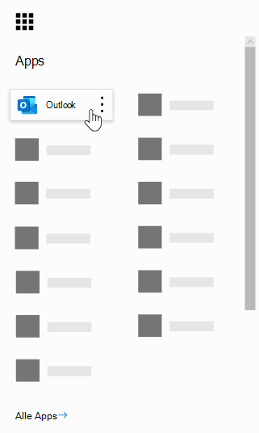

# Häufig gestellte Fragen zu Microsoft-Buchungen

## Allgemein

### Was ist Microsoft-Buchungen?

Microsoft Booking ist eine Microsoft 365-APP, die das Planen und Verwalten von Terminen vereinfacht. Buchungen Incudes einen webbasierten Buchungskalender und integriert sich in Outlook, um den Kalender Ihres Mitarbeiters zu optimieren, sodass Ihre Kunden flexibel sein können, um eine Zeit zu buchen, die für Sie am besten geeignet ist. Durch automatische Benachrichtigungs-e-Mails werden keine Shows reduziert, und Organisationen sparen Zeit mit einer Reduzierung der wiederkehrenden Planungsaufgaben. Buchungen helfen Ihnen bei der einfachen Durchführung virtueller Termine über Skype oder Microsoft Teams und unterstützen Sie bei der täglichen Planung über die app "Buchungen" in Microsoft Teams. Durch die integrierte Anpassung können Buchungen so konzipiert werden, dass Sie den Anforderungen mehrerer Teile einer Organisation entsprechen.

### Wie verwende ich Microsoft-Buchungen?

Reservierungen sind ein Onlinedienst, sodass Sie nichts herunterladen müssen. Wechseln Sie im Microsoft 365-Weberlebnis einfach zur APP-Auswahl. Administratoren können auch die Begleit-app "Buchungen" verwenden, um aktuelle Informationen über Kunden und deren Termine auf dem neuesten Stand zu halten.

### Wer hat Zugriff auf Microsoft-Buchungen?

Reservierungen sind standardmäßig für Microsoft 365 Business Premium-, a3-, A5-, E3-und E5-Kunden weltweit verfügbar und aktiv. Reservierungen sind auch in Office 365 betrieben von 21Vianet verfügbar.

### Werden meine Kunden meinen persönlichen oder geschäftlichen Kalender sehen?

Ihren Kunden wird nur der Buchungskalender angezeigt, den Sie online für die Dienste, Zeiten und Mitarbeiter veröffentlichen, die Sie registrieren möchten.

### Wie greifen Endbenutzer auf die app "Buchungen" zu?

Jeder, der für Microsoft 365 Business Premium, a3, A5, E3, E5 oder als Mitarbeiter in der Administrator-oder Viewer-Rolle lizenziert ist, kann in der APP-Auswahl im Microsoft 365-Weberlebnis auf Buchungen zugreifen. Es gibt auch eine Begleit-APP, die für IOS und Android verfügbar ist.

### Kann ich Buchungen in meiner eigenen Website verwenden?

Ja. Wir bieten Ihnen die Möglichkeit, ihren Buchungskalender in Ihrer Website über einen iframe einzubetten. Link Einbettungscode befindet sich auf der Registerkarte **Buchungen** in der APP Buchungen.

### Kann ich Buchungen auch dann verwenden, wenn ich nicht über eine Webseite für mein Unternehmen verfüge?

Ja. Wir bieten einen Link zu ihrer Buchungsseite auf der Registerkarte **Buchungsseite** in der Webanwendung. Sie müssen lediglich diesen Link ihren Kunden oder Kunden bereitstellen, und die neuesten Verfügbarkeitsinformationen für Ihr Unternehmen werden angezeigt. Alternativ können Sie die Buchungsseite in sozialen Medien freigeben oder sogar die embed-Funktion verwenden, um Sie in einem IFRAME-Element zu hosten. Sie haben auch die Möglichkeit, zu steuern, wer auf die Seite zugreifen kann, indem Sie die Indizierung des direkten Suchmoduls deaktivieren und den Zugriff auf die in Ihrer Organisation beschränken.

### Kann unsere IT-Abteilung steuern, ob Endbenutzer auf Buchungen zugreifen können?

Reservierungen sind standardmäßig in Business Premium, M365 a3/a5 und E3/E5-Mandanten verfügbar, Administratoren können diese Option jedoch im Microsoft 365 Admin Center deaktivieren. Befolgen Sie dazu [die folgenden Anweisungen](turn-bookings-on-or-off.md).

Wenn ein Kunde den Zugriff auf Buchungen für bestimmte berechtigte Lizenzen in seinem Mandanten deaktivieren möchte, kann er entweder eine Gruppenrichtlinie zum Einschränken von Lizenzen oder eine OWA-Postfachrichtlinie implementieren, mit der verhindert wird, wer neue Buchungskalender erstellen kann.

Wenn Sie eine OWA-Postfachrichtlinie zum Deaktivieren des Zugriffs auf Buchungen verwenden, verfügen alle Benutzer über eine Buchungs Lizenz, doch wenn Sie versuchen, auf die APP zuzugreifen, sind Sie nur dann erfolgreich, wenn Sie Teil der Richtlinie sind oder wenn Sie einem vorhandenen Buchungskalender als Mitarbeiter hinzugefügt wurden. Details [hierzu finden](turn-bookings-on-or-off.md) Sie im Abschnitt "nur ausgewählte Benutzer dürfen Buchungskalender erstellen".

### Sind Buchungen anpassbar?

Ja, Buchungen sind anpassbar und können für eine Vielzahl unterschiedlicher Szenarien verwendet werden. Beim Einrichten eines Buchungs Kalenders können viele Aspekte der webbasierten Planungsseite, Ihre Geschäftsinformationen, Mitarbeiterdetails, Diensttypen und Planungsrichtlinien angepasst werden.

### Sind alle Funktionen der ursprünglichen Buchungen-Webanwendung in Microsoft Teams verfügbar?

Eine einfache Version von Buchungen steht jetzt als app in Microsoft Teams zur Verfügung. Die erste Ankündigung finden Sie [hier](https://www.microsoft.com/microsoft-365/blog/2020/03/06/empowering-care-teams-with-new-tools-in-microsoft-365/). Es gibt Deep Link-Funktionen, die in der Webanwendung eingeblendet werden, und nach dem Setup kann die tägliche Verwendung von Buchungen ohne vorheriges verlassen von Teams erfolgen. Informationsfluss über Plattformen hinweg.

### Handelt es sich um Buchungen, die ein kleines Unternehmen oder ein Unternehmensangebot oder beides bieten?

Buchungen sind eine ideale Lösung für Kunden in Unternehmen und Kleinunternehmen in verschiedenen Branchen. Zu den Anwendungsfällen zählen folgende:

- Finanzdienstleistungen
    - Konsultationen
    - Bank-und Versicherungsdienste
    - steueranmeldungen

- Personalwesen (HR)
    - Kandidaten Interviews
    - Onboarding
    - Unterstützungsleistungen
    - Schulungen und Seminare

- Gesundheitswesen
    - Patientenbesuche
    - Zusammenarbeit zwischen Anbietern und Anbietern
    - Versicherungs Beratungen

- Öffentliche Verwaltung & öffentlichen Sektors
    - gerichtliche Anhörungen und Versuche
    - öffentliche Dienste
    - Abteilungs Termine

- Bildung--K-12
    - übergeordnete Lehrerkonferenzen
    - School Town Hall
    - Besuche von Schülern und Ratgebern

- Bildung – höhere ed
    - Geschäftszeiten
    - Nachhilfe
    - Studentische Dienste
    - Anmeldung bei der Prüfung

- Einzelhandel
    - Unterstützte Shops
    - Planen von Auftragnehmern
    - Entwurfs Dienste

- Allgemeine Anforderungen für Unternehmen und kleine Unternehmen
    - Kunden-und Kundenbesprechungen
    - Technischer Support
    - rechtliche Bewertungen
    - Einrichtungen

## Preise und Lizenzierung

### Wie erhalte ich Microsoft-Buchungen?

Reservierungen sind in Microsoft 365 für Kunden mit Business Premium-, a3-, A5-, E3-und E5-Lizenzen sowie einer IOS-und Android-Begleit-app verfügbar. Reservierungen stehen nicht als eigenständige App zur Verfügung. Outlook Web App oder Outlook im Internet muss für die Verwendung von Buchungen aktiviert sein, da Daten in Outlook gespeichert werden.

Eine Buchungs Lizenz bietet vollständige Funktionen für das Produkt, einschließlich der Erstellung und Verwaltung von Kalendern. Außerdem können Benutzer vorhandene Kalender anzeigen und bearbeiten, wenn diese Benutzer als Mitarbeiter einer Administrator-oder Viewer-Rolle hinzugefügt werden.

### Muss ich mein e-Mail-Konto von meinem aktuellen Anbieter zu Microsoft 365 migrieren?

Sie können Ihren aktuellen Anbieter behalten, aber Reservierungen senden alle Benachrichtigungen an die e-Mail, die in Ihrem Microsoft 365-Konto verwendet wird.

### Können meine Mitarbeiter Buchungen ohne ein Microsoft 365-Konto verwenden?

Ja. Sie können Ihre Mitarbeiter mit jeder e-Mail hinzufügen, und Sie erhalten weiterhin die e-Mail-Bestätigung und den Kalender einladen, wenn jemand einen Termin mit Ihnen Bucht.

### Kann ich mehr als einen Buchungskalender unter dem gleichen Microsoft 365-Konto erstellen und zwischen diesen wechseln?

Ja. Sie können mehr als einen Buchungskalender mit einem Konto erstellen und verwalten. Sie können zwischen diesen mithilfe der Einfügemarke neben dem Namen des Unternehmens in der Webanwendung Buchungen wechseln.

### Was geschieht, wenn meine Organisation über gemischte Lizenzen mit F1/F3, E1 und E3/E5 verfügt?

Wir erkennen, dass viele Organisationen eine Mischung aus Microsoft 365-Lizenzierung haben. Beispielsweise kann ein Kunde M365 E3-Lizenzen für Mitarbeiter in seinem Hauptsitz, aber M365 E1 (oder F1 oder F3) Lizenzen für Ihre Store-Mitarbeiter haben.

In diesem Beispiel haben die Mitarbeiter der Hauptniederlassung mit einer M365 E3-Lizenz Vollzugriff auf Buchungen, was bedeutet, dass Sie neue Kalender erstellen, Einstellungen bearbeiten, Mitarbeiter hinzufügen, eine Buchungsseite veröffentlichen, Termine im Kalender erstellen und verwalten und Berichte abrufen können.

Diese Speicher Mitarbeiter mit E1/F1/F3-Lizenzen oder ohne Lizenzen können weiterhin Kalendern in einer Gastrolle als Mitarbeiter hinzugefügt und dann für Termine gebucht werden, und Sie erhalten Bestätigungs-e-Mails, wenn Sie gebucht werden. Sie können weiterhin während der verfügbaren/geplanten Stunden gebucht werden, wie auf der Registerkarte Mitarbeiter aufgeführt. Die Verfügbarkeit von Buchungen Kalender beschränkt buchmäßige Zeiten nach festgelegten Stunden und Service Stunden.

Die Store-Mitarbeiter werden auch in Buchungen als nicht verfügbar angezeigt, wenn ein Termin bereits zu diesem Zeitpunkt über die Buchungen-Webanwendung geplant wurde. Überbuchungen gebuchte Termine reflektieren den Kalender eines Mitarbeiters im Rahmen von Buchungen als belegt. Mitarbeiter mit einer Lizenz für nicht-Buchungen können Ihren persönlichen Kalender immer noch auf ihre Verfügbarkeit bei Buchungen auswirken, vorausgesetzt, Sie befinden sich innerhalb desselben Mandanten.

Personen in der Rolle "Gäste" können alle Informationen anzeigen, die der Kunde innerhalb der anfänglichen Terminerstellung bereitgestellt hat. Wenn beispielsweise der für den Termin gebuchte Filial Vertreter den Kunden vor dem Termin anrufen muss, hat er Zugriff auf die Informationen, die der Kunde während des Planungsprozesses zur Verfügung stellt. Der gebuchte Mitarbeiter hat Zugriff auf alle Informationen, die in der Bestätigungs-e-Mail angezeigt werden, sowie auf das Kalenderereignis. ICS (beispielsweise die Kundentelefonnummer, wenn es eingegeben wurde).

Personen in der Gastrolle können nicht auf die Buchungen-Webanwendung zugreifen, um Einstellungen zu ändern oder Termine anzuzeigen und zu verwalten (hinzufügen, Abbrechen und neu planen). Sie können jedoch im Namen von Kunden mit der Self-Service-Seite Termine vereinbaren, genauso wie ein Kunde einen Termin vereinbaren würde.

Wir empfehlen die Lizenzierung eines Business Managers oder Administrators jedes Shops mit einer berechtigten Lizenz zum Einrichten und Verwalten von Seiten und Terminen. Der Rest des Personals würde dann mit dem mit Buchungen lizenzierten Mitarbeiter zusammenarbeiten, um eine Buchung neu zu planen oder zu stornieren.

## Produktfeatures

### Wo werden Buchungen von Kalendern in meinem Microsoft 365-Mandanten angezeigt? * *

Jeder neue Buchungskalender erstellt ein entsprechendes Postfach in Exchange sowie einen zugehörigen Eintrag in Azure Active Directory (AAD), in dem der Eintrag als nicht lizenzierter Benutzer aufgeführt wird.

### Kann ich einen zuvor erstellten Buchungskalender löschen?

Um einen Buchungskalender zu löschen, müssen Sie das zugehörige Postfach in Exchange löschen.

### Wenn ich einen Kalender erstelle und ein anderer Benutzer Zugriff auf Buchungen hat, würde er dann meinen Kalender sehen können?

Die einzigen Personen, die Zugriff auf Buchungskalender haben, die Sie (über die Webanwendung) erstellen, sind Personen, die als Mitarbeiter in einer Administrator-oder Viewer-Rolle hinzugefügt wurden. Mandantenadministratoren können eine Liste aller Buchungen von Postfächern in Exchange und Aad anzeigen.

### Sind Videokonferenz Besprechungen in die app "Buchungen" integriert?

Online Besprechungen sind innerhalb von Buchungen verfügbar, wenn Sie die Skype-oder Microsoft Teams-Clients verwenden. Online Besprechungen können auf Dienstebene aktiviert werden, und der ausgewählte Besprechungsclient (Skype oder Teams) ist für einen gebuchten Mitarbeiter standardmäßig festgelegt. Um an den Onlinebesprechungen teilzunehmen, erhält jeder neue Termin einen eindeutigen Besprechungslink, der dem Termin zugeordnet ist, außerdem werden einfache Join-Optionen im Ereignis und in Bestätigungs-e-Mails berücksichtigt.

### Wie funktioniert die Planungsrichtlinie?

Eine Einstellung mit dem Namen " **Maximale Vorlaufzeit** " bestimmt am weitesten vorn (gemessen in Tagen), dass eine Buchung vorgenommen werden kann. Es muss mindestens 24 Stunden zwischen **minimaler Vorlaufzeit** (Mindestdurchlaufzeit, in Stunden, für Buchungen und Stornierungen) und maximaler Vorlaufzeit liegen. Die maximale Vorlaufzeit kann auf einen Tag festgelegt werden, wenn minimale Vorlaufzeit auf 0 Stunden festgelegt ist, was in diesem Fall bedeutet, dass ein Kunde eine Buchung bis zu dem Zeitpunkt, zu dem er beginnt, stornieren kann, und Kunden nur Buchungen planen können, wenn der Termin innerhalb des nächsten Tages liegt.

:::image type="content" source="media/bookings-faq-scheduling.png" alt-text="Planen in Buchungen":::

### Wie funktioniert die Buchung über Zeitzonen hinweg?

Alle Zeiten befinden sich standardmäßig in der Geschäftszeit Zone (Ihre lokale Zeitzone). Dies bedeutet, dass alle Einstellungen, die Sie für einen Buchungskalender konfigurieren, wie etwa Arbeitsstunden, in dieser Zeitzone angezeigt werden. Die Self-Service-Seite hat die Möglichkeit, alle Termin Zeiten in der Zeitzone des Endbenutzers anzuzeigen, die bei Bedarf deaktiviert werden kann.Wenn **Zeitschlitze in der Geschäfts Zeitzone immer angezeigt** werden, bleibt die Kontrollkästchen auf der Seite "Buchungen" deaktiviert, und die Benutzer der Seite sehen Zeitschlitze in ihren eigenen lokalen Zeitzonen.

:::image type="content" source="media/bookings-faq-region.png" alt-text="Reservierungen für Regions-und Zeitzoneneinstellungen":::

Es gibt keine Provision zum Festlegen der Zeitzone für Mitarbeiter in Buchungen. Die Zeitzone des Personals und damit die Geschäftszeiten befinden sich in der Geschäftszeit Zone.

### Können e-Mail-Benachrichtigungen als Mandanten Domänenname gesendet werden?

Die e-Mail-Adressen werden auf der Microsoft 365-Einstellungsebene gesteuert und verwaltet und hängen von den dort verwendeten Domänen Konfigurationseinstellungen ab. Weitere Informationen finden Sie [hier](https://docs.microsoft.com/powershell/module/exchange/mail-flow/get-accepteddomain?view=exchange-ps).

### Können SMS-Nachrichten von einem anderen Dienst oder einer bestimmten Konfiguration gesendet werden?

SMS-Nachrichten sind derzeit in Nordamerika verfügbar, und ein Skype-oder Twilio-Konto wird für die SMS-Zustellung verwendet.

### Wie können Buchungen von Terminen im Kalender einer Person angezeigt werden?

Die Bestätigung der Buchung wird an die Posteingänge des Dienstanbieters und des Kunden gesendet. Die Bestätigungs-e-Mail enthält eine Dateianlage *. ICS, die dann dem Kalender des Benutzers mit allen relevanten Termindetails hinzugefügt werden kann.

### Was löst Dienstanbieter-oder Mitarbeiter-und Kunden-e-Mails aus?

E-Mail-Nachrichten werden basierend auf den Einstellungen auf der Registerkarte Dienste in der Webanwendung Buchungen ausgelöst. Eine vom Kunden auf der Self-Service-Seite oder auf der Registerkarte Kalender in der Buchungs-Webanwendung vorgenommene Buchung löst eine Bestätigung und/oder eine Erinnerungs-e-Mail aus. Dasselbe geschieht, wenn jemand eine Änderung an der Buchung über die Schaltfläche " **Buchung verwalten** " in der Bestätigungs-e-Mail oder innerhalb der Webanwendung vornimmt. Erinnerungs-e-Mails werden zu einem bestimmten Zeitraum vor einem Termin gesendet, wie auf der Registerkarte Dienste in der Webanwendung Buchungen beschrieben.

### Kann ich Termine im Klassenzimmer-Stil buchen, die 1: many statt 1:1 sind?

Ja, wir verfügen über eine Gruppen Buchungsfunktion, mit der mehrere Personen denselben Termin gleichzeitig buchen können (beispielsweise für eine Fitness Klasse). Diese Funktionalität wird [hier](https://techcommunity.microsoft.com/t5/microsoft-bookings-blog/microsoft-bookings-now-supports-online-meetings-and-group/ba-p/1214120)ausführlich beschrieben.

### Können Kalender unveröffentlicht bleiben (nicht öffentlich), aber weiterhin für bestimmte Benutzer zugänglich sein?

Ja. Auf der Registerkarte "Buchungsseite" in der Webanwendung befindet sich ein Kontrollkästchen: **erfordern Sie ein Microsoft 365-oder Office 365-Konto aus meiner Organisation, um es zu buchen**. Wenn Sie dieses Kontrollkästchen aktivieren, wird der Zugriff auf Self-Service-Seiten auf diejenigen beschränkt, die sich in Ihrem Mandanten befinden. Auf den Buchungskalender, der in der Webanwendung für die Erstellung und Verwaltung liegt, kann nur von Personen zugegriffen werden, die der Seite mit Administrator-oder Viewer-Rollen als Mitarbeiter hinzugefügt wurden.

:::image type="content" source="media/bookings-faq-access-ctrl.png" alt-text="Buchungsseite-Zugriffssteuerung bei Buchungen":::

### Wie häufig wird die Startseite aktualisiert?

Die neuesten Daten, die mit Ihrer Startseite verknüpft sind, werden immer dann abgerufen, wenn die Webanwendung geladen wird. Weitere Informationen zur Art der durch Buchungen verfolgten Informationen finden Sie in diesem [Support Artikel](metrics-and-activity-tracking.md).

### Kann ich die e-Mail-Benachrichtigungen für einen Timeout deaktivieren?

Bei der Aufzeichnungsdauer innerhalb der Buchungen-Webanwendung wird immer eine Benachrichtigungs-e-Mail an die Mitarbeiter ausgelöst. Wenn Mitarbeiter über die Benachrichtigung verwechselt werden, empfehlen wir Ihnen, weitere Details in die Notizen oder den Titel der Abwesenheitsbenachrichtigung einzufügen, um die Mitarbeiter besser darüber zu informieren, was auf der Administratorseite geschieht.

### Können Buchungen von Kalendern geklont oder dupliziert werden, und können Sie für einfache Skalierung Vorlagen?

Die Möglichkeit, Seiten zu duplizieren, ist derzeit über PowerShell verfügbar. Der Vorgang besteht darin, die Graph-API zum Abrufen von Postfachdetails zu verwenden und diese Details dann zum Erstellen eines neuen Postfachs zu verwenden. API-Dokumentation finden Sie [hier](https://docs.microsoft.com/graph/api/resources/booking-api-overview?view=graph-rest-beta).

### Welche Berichte sind bei Buchungen verfügbar?

Alle Buchungen, die der Administrator Rolle zugewiesen sind, können eine durch Tabstopps getrennte Werte herunterladen (. TSV-Datei mit allen Buchungen, die in den letzten 120 Tagen getätigt wurden. Buchungen von Berichten können unter heruntergeladen werden. TSV-Formular auf der Registerkarte Start der Seite Buchungen. Die Buchungs-API kann auch verwendet werden, um diese Daten für spezifischere und speziellere Zwecke zu sammeln.

### Ist es möglich, gleichzeitig nur einen Dienst auf der Self-Service-Seite freizugeben?

Ja, Sie können entweder separate Buchungskalender für jeden Dienst erstellen, oder Sie können zur Registerkarte "Dienste" wechseln, einen Dienst bearbeiten und oben auf der Seite eine Option zum Freigeben einer URL nur für diesen bestimmten Dienst erhalten.

### Welche Optionen stehen für das Einbetten eines Zustimmungs Formulars oder einer Offenlegung für Personen zur Verfügung, die einen Termin buchen?

Es wird empfohlen, das Kontrollkästchen **Kundendaten Nutzungs Zustimmung** auf der Buchungsseite zu aktivieren und den Wortlaut so anzupassen, dass die Offenlegungs-oder Zustimmungs Anforderungen Ihrer Organisation ordnungsgemäß vermittelt werden. Eine weitere Option besteht darin, dem Dienst ein benutzerdefiniertes Feld hinzuzufügen, das einen Link zum Zustimmungsformular enthält, und Kunden müssen bestätigen, dass Sie das Formular abgeschlossen haben, bevor Sie mit der Terminerstellung fortfahren können. Sie können die Zustimmungsformular-URL auch als zusätzliche Notizen in Bestätigungs-und Erinnerungs-e-Mails hinzufügen, dies verhindert jedoch nicht, dass Benutzer einen Termin buchen.

### Welche Änderungen können auf der Self-Service-Buchungsseite an der Auswahlfunktion für Mitarbeiter vorgenommen werden?

Die Möglichkeit, dass Kunden bestimmte Mitarbeiter bei der Buchung auswählen können, kann vollständig entfernt werden, indem Sie auf der Seite Buchung oder im Abschnitt Dienste die Option **Kunden können eine bestimmte Person für die Buchung auswählen** deaktivieren. Bei der Buchung wird basierend auf der Verfügbarkeit des Personals automatisch ein verfügbares Mitarbeiter-Mitglied nach dem Zufallsprinzip zur Buchung zugewiesen.

### Können Buchungen viele gleichzeitige Buchungsanfragen und Self-Service-Seitenbesuche unterstützen?

Bei einer Buchung kann eine große Anzahl von Besuchern und Buchungen gleichzeitig unterstützt werden. Wenn auf der Seite ein sehr großer Datenverkehr auftritt, erhalten Benutzer den Fehler "Server beschäftigt". Die Termin Verfügbarkeit wird aktualisiert, wenn die Seite geladen wird, sowie bei einer Buchung. Wenn mehrere Personen versuchen, denselben Termin gleichzeitig zu buchen, können Reservierungen nur eine Person buchen und eine Benachrichtigung an die anderen potenziellen Kunden senden und Sie auffordern, eine andere Zeit zu finden.

## Datenschutz

### Wo werden Buchungsdaten gespeichert?

Bei Reservierungen handelt es sich um eine Microsoft 365-APP, die bedeutet, dass alle Daten in der Microsoft 365-Plattform und in Exchange gespeichert werden. Bei Buchungen werden alle von Microsoft festgelegten Datenspeicher Richtlinien befolgt, bei denen es sich um dieselben Richtlinien handelt, die von allen Office-Apps befolgt werden Bei Buchungen werden freigegebene Postfächer in Exchange zum Speichern von Kunden-, Mitarbeiter-, Dienst-und Termindetails verwendet. Compliance-Richtlinien für freigegebene Postfächer in Exchange gelten auch für Buchungen von Postfächern. Alle Kundendaten (einschließlich der Informationen, die von Kunden bei der Buchung zur Verfügung gestellt werden) werden in Buchungen erfasst und in der APP gespeichert und somit in Exchange gespeichert. Microsoft-Buchungen verwendet die gleichen Richtlinien, die von Microsoft 365 verwendet werden, die Sie hier finden können [.](https://www.microsoft.com/online/legal/v2/?docid=22&langid=en-us)

### Gibt es eine Möglichkeit, Buchungskalender für alle Benutzer zentral zu verwalten?

Jeder Buchungskalender wird unabhängig verwaltet. Es gibt keine konsolidierte Ansicht, außer der Suchdropdownliste, nachdem Sie auf der Startseite auf die Einfügemarke geklickt haben.

### Wie werden Benutzer authentifiziert?

Der Zugriff auf die Webanwendung Buchungen umfasst die Authentifizierung über die reguläre Azure Active Directory (AAD)-Authentifizierung. Die Self-Service-Buchungsseite kann jeder Person mit dem Link zur Webseite zur Verfügung gestellt werden. Wenn jedoch die Einstellung **ein Microsoft 365-oder Office 365-Konto von meiner Organisation** zum Buchen erfordert ausgewählt ist, wird die Seite für die Verwendung nur innerhalb des Microsoft 365-Mandanten eingeschränkt (mithilfe der Aad-Authentifizierung).

:::image type="content" source="media/bookings-faq-access-ctrl.png" alt-text="Buchungsseite-Zugriffssteuerung bei Buchungen":::

### Verlassen Kundendaten das Produktionssystem aus irgendeinem Grund?

Ja, da Buchungen ein Teil von Exchange sind, erlauben wir Graph-APIs und Exchange-Webdienste-APIs für die Kunden, ihre eigenen Daten herunterzuladen, auf die Sie Zugriff haben.

### Gibt es die Möglichkeit, e-Mail-Adressen für Kunden Antworten anzupassen?

Es besteht die Möglichkeit zu definieren, an welche e-Mail-Adresse Kunden ihre Antworten senden. Diese Einstellung befindet sich auf der Registerkarte **Unternehmensinformationen** . Der Name des Reservierungs Postfachs selbst kann auch in Exchange durch übliche Umbenennungs Prozesse für Exchange-Postfächer geändert werden.

### Wir möchten, dass der Kunde unsere Geschäftsbedingungen während des Buchungsprozesses akzeptiert. Ist das möglich?

Dieses Feature ist bereits für die dsgvo-Kompatibilität vorhanden. Die Buchungsseite enthält ein Feld für die benutzerdefinierte Zustimmung, direkt unter dem Abschnitt Veröffentlichungsdetails. Überprüfen Sie einfach das Feld, und schreiben Sie Ihre eigene benutzerdefinierte Zustimmungs Meldung, und es wird als erforderliches Feld auf der Self-Service-Seite angezeigt. Das Datum und die Uhrzeit, zu denen die Zustimmung des Kunden erteilt wird, werden aufgezeichnet.

In diesem Abschnitt werden Rich-Text nicht unterstützt, aber Think Links können unter dem Abschnitt Unternehmensinformationen hinzugefügt werden und würden direkt unterhalb des Kontrollkästchens Zustimmung angezeigt.

### Wie können Buchungen-zugeordnete Postfächer in Exchange identifiziert werden?

Der folgende Befehl kann verwendet werden, um Informationen zu allen Buchungen von Postfächern und Benutzern abzurufen, die Zugriff auf diese haben.

`Get-Mailbox -RecipientTypeDetails SchedulingMailbox -ResultSize:Unlimited | Get-MailboxPermission |Select-Object Identity,User,AccessRights | Where-Object {($\_.user -like '\*@\*')}`

## Technische Fragen

### Wenn ein Benutzer einen Termin für einen Dienst mit einer Onlinebesprechung plant, wie erhält er den Microsoft Teams-Link zur Besprechung, wenn er das optionale e-Mail-Adressfeld leer lässt?

Wenn das System nicht über die e-Mail-Informationen des Kunden verfügt, ist es nicht möglich, dass die Bestätigungs-e-Mail an den Kunden zugestellt wird und somit kein Teams-Link empfangen wird. Die Lösung besteht darin, die e-Mail-Adresse als erforderliches Feld festzulegen, das Sie auf der Registerkarte Dienste von Buchungen ausführen können. Beachten Sie, dass jedes Mal, wenn Sie einen neuen Dienst in Buchungen erstellen, das Feld Kunden-e-Mail standardmäßig als erforderlich festgelegt ist.

### Wie werden Mitarbeiter Terminen zugewiesen, wenn "jeder" ausgewählt ist oder wenn Kunden keinen Mitarbeiter für den Termin auswählen können?

Mitarbeiter werden in diesen Szenarien nach dem Zufallsprinzip zugewiesen, und zwar von allen Mitarbeitern, die zum Zeitpunkt der Buchung des Termins verfügbar sind. Derzeit gibt es keine Möglichkeit, eine gleichmäßige Verteilung zufällig zugewiesener Termine in allen Mitgliedern des Personals sicherzustellen oder die Anzahl der zugewiesenen Termine für jeden Mitarbeiter zu begrenzen. Wenn es einen Lastenausgleich gibt, der nach einer Reihe von zufälligen Zuweisungen über Ihre Mitarbeiter erfolgen muss, kann dies manuell auf der Registerkarte Kalender auf der Seite Buchungen erfolgen.

### Wie können Benutzer den Empfang von SMS-Nachrichten deaktivieren, wenn Sie sich bereits zuvor angemeldet haben?

Wenn Sie einen Termin mit aktivierter SMS-Textnachrichten buchen, werden die Kunden aufgefordert, das Opt-in-Feld bei jedem buchen zu überprüfen. Kunden können auch direkt auf die SMS-Nachricht (den SMS-Anbieter) Antworten, um anzugeben, dass die Nachrichten eingestellt werden sollen, und dann werden keine weiteren Texte an diese Telefonnummer gesendet. Wenn der Kunde aus dem empfangen von Textnachrichten vom Anbieter nicht aus Buchungen selbst auswählt, wird er in Zukunft keine SMS mehr erhalten, auch wenn er sich auf der Seite "Buchungen" einwählt.

## Problembehandlung

### Der Kalender dieses Mitarbeiters kann nicht synchronisiert werden

Wenn die Fehlermeldung "der Kalender dieses Mitarbeiters kann nicht synchronisiert werden" angezeigt wird, enthält dieser Abschnitt verschiedene Verfahren zur Problembehandlung, mit denen Sie den Fehler beheben können.

> [!NOTE]
> Reservierungen sind standardmäßig für Kunden mit den Abonnements Microsoft 365 Business Standard, Microsoft 365 a3 oder Microsoft 365 a5 aktiviert. Reservierungen stehen auch Kunden mit Office 365 Enterprise E3 und Office 365 Enterprise E5 zur Verfügung, Sie sind jedoch standardmäßig deaktiviert. Die ersten Schritte finden Sie unter [Get Access to Microsoft Booking](get-access.md). Informationen zum Aktivieren oder Deaktivieren von Buchungen finden Sie unter [Aktivieren oder Deaktivieren von Buchungen für Ihre Organisation](turn-bookings-on-or-off.md).

Wenn Sie Informationen zum Synchronisieren des Kalenders Ihres Mitarbeiters benötigen, lesen Sie [Hinzufügen von Mitarbeitern zu Buchungen](add-staff.md). Stellen Sie sicher, dass auf der Seite " **Mitarbeiterdetails** " **Ereignisse im Kalender die Verfügbarkeit beeinflussen** aktiviert ist.

### Der Mitarbeiter muss seine Kalenderberechtigungen ändern.

Damit Buchungen ordnungsgemäß mit den Kalendern ihrer Mitarbeiter synchronisiert werden, muss jeder Mitarbeiter seinen Kalender freigeben. Jeder Mitarbeiter muss diese Anweisungen befolgen, um seinen eigenen Kalender freizugeben.

1. Melden Sie sich bei Microsoft 365 an, und wählen Sie dann **Outlook** aus dem App-Startfeld aus.

   

1. Wählen Sie oben auf der Seite **Share** \> **Kalender**freigeben aus.

   

1. Wählen Sie im Abschnitt **Personen in Ihrer Organisation** das Dropdownfeld neben **Meine Organisation**aus, und wählen Sie dann **kann anzeigen aus, wenn ich beschäftigt bin**.

> [!NOTE]
> Mit dieser Einstellung werden Ihre Frei/Gebucht-Informationen mit Buchungen und mit anderen Benutzern in Ihrer Organisation geteilt. Sie enthält keine weiteren Informationen, beispielsweise welche Art von Terminen Sie geplant haben, mit wem Sie den Termin geplant haben, oder den Ort.

   

1. Wählen Sie **Fertig** aus.

### Wir können keinen Mitarbeiter in unserer Organisation finden.

Wenn ein Mitarbeiter Ihr Unternehmen verlassen hat und Sie ihn aus Ihrer Microsoft 365-oder Office 365-Organisation entfernt haben, müssen Sie diesen Benutzer dennoch aus den Buchungen entfernen, damit er nicht im Kalender angezeigt wird und Kunden daran gehindert werden, Termine mit diesen zu buchen.

1. Melden Sie sich bei Microsoft 365 an, und wechseln Sie dann zu **Buchungen** für \> **Mitarbeiter**.

1. Zeigen Sie mit dem Mauszeiger auf den Namen des Mitarbeiters. Rechts neben der **Telefon** Spalte werden die Symbole **Bearbeiten** und **Löschen** angezeigt.

1. Wählen Sie das Symbol **Löschen** aus.

1. Klicken Sie im Bestätigungsfeld auf **OK**.

> [!NOTE]
> Wenn Sie mehr als einen Buchungskalender haben, müssen Sie den Benutzer von allen Benutzern entfernen.

Um zu überprüfen, ob Sie mehr als einen Kalender haben, wählen Sie im linken Menü den Dropdownpfeil neben dem Namen Ihres Unternehmens aus, und wählen Sie dann **Öffnen**aus. Wenn Sie nur einen Kalender haben, wird nur die Option zum Hinzufügen eines Buchungs Kalenders angezeigt. Dieses Beispiel zeigt, dass es einen zweiten Kalender mit dem Namen "Contoso Co" gibt.

   

### Es gibt einen Synchronisierungsfehler, den wir nicht identifizieren können.

Dies ist ein vorübergehender Fehler, der in der Regel aufgrund einer instabilen Internetverbindung auftritt. Diese Probleme lösen sich in der Regel nach ein paar Minuten auf.

Wenn dieser Fehler nach einem längeren Zeitraum angezeigt wird oder Sie ihn häufig sehen, wenden Sie sich an den Support.

## Weitere Ressourcen

  - [Microsoft-Buchungen erweitern die Verfügbarkeit im Blog für Unternehmen](https://techcommunity.microsoft.com/t5/microsoft-bookings-blog/microsoft-bookings-expands-availability-in-enterprises/ba-p/1214065)

  - [Funktionsweise von Microsoft-Buchungen Video](https://support.office.com/article/microsoft-bookings-69c45b78-6de4-4f28-9449-cdcc18b7ae45)

  - [Starten der Verwendung von Microsoft-Buchungen](get-access.md)

  - [Aktivieren oder Deaktivieren von Microsoft-Buchungen](turn-bookings-on-or-off.md)

  - [Benutzer einzeln oder in Massen hinzufügen](https://docs.microsoft.com/microsoft-365/admin/add-users/add-users?view=o365-worldwide.)

  - [Hinzufügen von Mitarbeitern zu Buchungen](add-staff.md)

  - [Zu automatisierende API-Komponenten nach der Definition der Vorlage](https://docs.microsoft.com/graph/api/bookingbusiness-post-bookingbusinesses)

  - [URL zum Buchungskalender für die Anzeige](https://outlook.office.com/bookings/calendar)

  - [Compliance-Richtlinien für Reservierungen](https://docs.microsoft.com/microsoft-365/compliance/gdpr-dsr-office365?view=o365-worldwide#bookings)

  - [Anpassen und Veröffentlichen Ihrer Buchungsseite](customize-booking-page.md)

  - [Konfiguration des Mandanten Postfachs](https://docs.microsoft.com/powershell/module/exchange/mail-flow/get-accepteddomain?view=exchange-ps)

  - [Gruppenbuchungen](https://techcommunity.microsoft.com/t5/microsoft-bookings-blog/microsoft-bookings-now-supports-online-meetings-and-group/ba-p/1214120)

  - [Buchungen von Metriken und Aktivitätsverfolgung](metrics-and-activity-tracking.md)

  - [M365 Public Roadmap](https://www.microsoft.com/microsoft-365/roadmap?filters=&searchterms=bookings)

  - Übermitteln von Feedback über [UserVoice](https://outlook.uservoice.com/forums/314907-microsoft-bookings/suggestions/39505261-365-admins-should-have-full-access-to-all-bookings)
