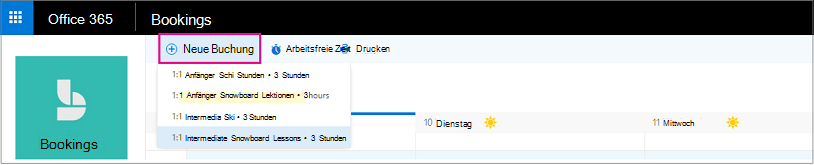
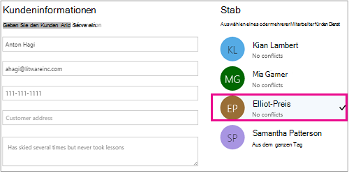

# Manuelle Buchung erstellenCreate a manual booking

Buchungen können auf zwei verschiedene Arten geplant und die Mitarbeiter dafür festgelegt werden.Bookings can be scheduled and staffed in two different ways. Die erste Möglichkeit besteht darin, dass der Kunde eine eigenständige Buchungsseite oder eine eingebettete Buchungsseite verwendet, die Sie zu Ihrer Website hinzufügen.The first way is by the customer using a standalone booking page or an embedded booking page that you add to your website. Die andere Möglichkeit besteht darin, dass Sie oder einer ihrer Mitarbeiter die Buchungen manuell eingeben, beispielsweise wenn ein Kunde einen Termin anruft.The other way is for you or one of your employees to enter the bookings manually, such as when a customer calls for an appointment. Der vorliegende Artikel befasst sich mit dem Szenario "manuelle Eingabe".This article covers the manual scenario.

> [!NOTE]
> Reservierungen sind standardmäßig für Kunden mit den Abonnements Microsoft 365 Business Standard, Microsoft 365 a3 oder Microsoft 365 a5 aktiviert.Bookings is turned on by default for customers who have the Microsoft 365 Business Standard, Microsoft 365 A3, or Microsoft 365 A5 subscriptions. Reservierungen stehen auch Kunden mit Office 365 Enterprise E3 und Office 365 Enterprise E5 zur Verfügung, Sie sind jedoch standardmäßig deaktiviert.Bookings is also available to customers who have Office 365 Enterprise E3 and Office 365 Enterprise E5, but it is turned off by default. Die ersten Schritte finden Sie unter [Get Access to Microsoft Booking](get-access.md).To get started, see [Get access to Microsoft Bookings](get-access.md). Informationen zum Aktivieren oder Deaktivieren von Buchungen finden Sie unter [Aktivieren oder Deaktivieren von Buchungen für Ihre Organisation](turn-bookings-on-or-off.md).To turn Bookings on or off, see [Turn Bookings on or off for your organization](turn-bookings-on-or-off.md).

1. Wählen Sie in Microsoft 365 das App-Startfeld aus, und wählen Sie dann **Buchungen**aus.In Microsoft 365, select the App launcher, and then select **Bookings**.

   

1. Wählen Sie im Navigationsbereich **Kalender** \> **Neue Buchung** aus.In the navigation pane, select **Calendar** \> **New booking**.

   

1. Wählen Sie den Dienst aus, der geleistet werden soll.Select the service to be provided. Weitere Informationen finden Sie unter [define your Service offers in Microsoft Reservations](define-service-offerings.md) for Service Setup Instructions.See [Define your service offerings in Microsoft Bookings](define-service-offerings.md) for service setup instructions.

1. Geben Sie die Kundendaten ein, einschließlich Name, E-Mail-Adresse, Telefonnummer und sonstiger relevanter Details.Enter the customer information, including name, email address, phone number, and other relevant details.

1. Wählen Sie den Mitarbeiter aus, der den Dienst leisten soll.Select the staff member to provide the service. Die angezeigte Liste von Mitarbeitern basiert darauf, was Sie auf der Seite "Dienste" eingerichtet haben.The list of staff members shown is based on what you set up on the services page.

   

1. Geben Sie die Dienstdetails ein, einschließlich Datum, Uhrzeit, Ort und sonstiger relevanter Informationen. Sobald Sie eine gültige E-Mail-Adresse für den Kunden eingegeben haben, ändert sich die Schaltfläche **Speichern** in **Senden**, und ein Hinweis informiert Sie, dass dem Kunden eine Bestätigung gesendet wird. Die Bestätigung für den Kunden enthält eine Anlage, die er seinem Kalender hinzufügen soll. Ausgewählte Mitarbeiter erhalten ebenfalls Besprechungseinladungen mit den Informationen zum Termin, damit sie sie ihren persönlichen Kalendern hinzufügen können.Enter the service details, including date, time, location, and other relevant information. Once you enter a valid email address for the customer, the **Save** button will change to **Send**, and you'll see a note telling you that a confirmation will be sent to the customer. The customer confirmation includes an attachment for them to add to their calendar. Selected staff members will also receive meeting invitations with the appointment information so they can add it to their personal calendars.

1. Wählen Sie **E-Mail-Erinnerung hinzufügen** aus.Select **Add an email reminder**.

1. Geben Sie an, wann die Erinnerung gesendet werden soll, wo Sie gesendet werden soll (**Kunde**, **Mitarbeiter**, **alle Teilnehmer**) und was die Erinnerungsnachricht sein soll.Specify when the reminder should be sent, where it should be sent (**Customer**, **Staff**, **All attendees**), and what the reminder message should be.

1. Wählen Sie **Speichern** \> **Senden** aus.Select **Save** \> **Send**.

   Im folgenden finden Sie eine Beispiel-e-Mail der Erinnerung, die Ihr Kunde erhält:Here's an example email of the reminder your customer will receive:

:::image type="content" source="../media/bookings-confirmed-email.png" alt-text="Screenshot: Beispiel Bestätigungs-e-Mail aus einer manuellen Buchung":::