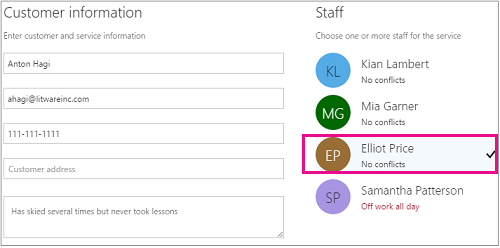

# Erstellen einer manuellen BuchungCreate a manual booking

Microsoft Bookings kann auf zwei verschiedene Arten geplant und besetzt werden.Bookings can be scheduled and staffed in two different ways. Die erste Möglichkeit besteht darin, dass der Kunde eine eigenständige Buchungsseite oder eine eingebettete Buchungsseite verwendet, die Sie Ihrer Website hinzufügen.The first way is by the customer using a standalone booking page or an embedded booking page that you add to your website. Eine andere Möglichkeit ist, dass Sie oder einer Ihrer Mitarbeiter die Buchungen manuell eingeben, z. B. wenn ein Kunde für einen Termin anruft.The other way is for you or one of your employees to enter the bookings manually, such as when a customer calls for an appointment. Der vorliegende Artikel befasst sich mit dem Szenario "manuelle Eingabe".This article covers the manual scenario.

1. Wählen Microsoft 365 App-Startfeld aus, und wählen Sie dann **Bookings aus.**In Microsoft 365, select the App launcher, and then select **Bookings**.

   

1. Wählen Sie im Navigationsbereich **Kalender** \> **Neue Buchung** aus.In the navigation pane, select **Calendar** \> **New booking**.

   

1. Wählen Sie den Dienst aus, der geleistet werden soll.Select the service to be provided. Unter [Define your service offerings in Microsoft Bookings finden](define-service-offerings.md) Sie Anweisungen zum Einrichten des Diensts.See [Define your service offerings in Microsoft Bookings](define-service-offerings.md) for service setup instructions.

1. Geben Sie die Kundendaten ein, einschließlich Name, E-Mail-Adresse, Telefonnummer und sonstiger relevanter Details.Enter the customer information, including name, email address, phone number, and other relevant details.

1. Wählen Sie den Mitarbeiter aus, der den Dienst leisten soll. Die angezeigte Liste von Mitarbeitern basiert darauf, was Sie auf der Seite "Dienste" eingerichtet haben.Select the staff member to provide the service. The list of staff members shown is based on what you set up on the services page.

   

1. Geben Sie die Dienstdetails ein, einschließlich Datum, Uhrzeit, Ort und sonstiger relevanter Informationen. Sobald Sie eine gültige E-Mail-Adresse für den Kunden eingegeben haben, ändert sich die Schaltfläche **Speichern** in **Senden**, und ein Hinweis informiert Sie, dass dem Kunden eine Bestätigung gesendet wird. Die Bestätigung für den Kunden enthält eine Anlage, die er seinem Kalender hinzufügen soll. Ausgewählte Mitarbeiter erhalten ebenfalls Besprechungseinladungen mit den Informationen zum Termin, damit sie sie ihren persönlichen Kalendern hinzufügen können.Enter the service details, including date, time, location, and other relevant information. Once you enter a valid email address for the customer, the **Save** button will change to **Send**, and you'll see a note telling you that a confirmation will be sent to the customer. The customer confirmation includes an attachment for them to add to their calendar. Selected staff members will also receive meeting invitations with the appointment information so they can add it to their personal calendars.

1. Wählen Sie **E-Mail-Erinnerung hinzufügen** aus.Select **Add an email reminder**.

1. Geben Sie an, wann die Erinnerung gesendet werden soll, wo sie gesendet werden soll (**Kunde,** **Mitarbeiter,** Alle Teilnehmer ) und wie die **Erinnerungsnachricht** sein soll.Specify when the reminder should be sent, where it should be sent (**Customer**, **Staff**, **All attendees**), and what the reminder message should be.

1. Wählen Sie **Speichern** \> **Senden** aus.Select **Save** \> **Send**.

   Hier ist eine Beispiel-E-Mail der Erinnerung, die Ihr Kunde erhält:Here's an example email of the reminder your customer will receive:

:::image type="content" source="../media/bookings-confirmed-email.png" alt-text="Screenshot: Beispiel einer Bestätigungs-E-Mail von einer manuellen Buchung":::