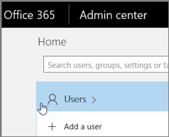

# <a name="delete-a-booking-calendar-in-bookings"></a>Löschen eines Buchungs Kalenders in Buchungen

In diesem Artikel wird erklärt, wie Sie einen unerwünschten Buchungskalender löschen können. Sie können den Buchungskalender im Microsoft 365 Admin Center löschen oder PowerShell verwenden. Der Kalender "Buchungen" ist ein Postfach in Exchange Online, sodass Sie das entsprechende Benutzerkonto löschen, um den Buchungskalender zu löschen.

> [!IMPORTANT]
> Alle Buchungskalender, die Sie in 2017 oder früher erstellt haben, müssen mit den PowerShell-Anweisungen in diesem Thema gelöscht werden. Alle Buchungskalender, die in 2018 oder danach erstellt wurden, können im Microsoft 365 Admin Center gelöscht werden.

Im Buchungskalender werden alle relevanten Informationen über diesen Buchungskalender und die Daten gespeichert, einschließlich:

- Unternehmensinformationen, Logo und Arbeitszeiten, die beim Erstellen des Buchungs Kalenders hinzugefügt wurden
- Relevante Mitarbeiter und Dienste, die beim Erstellen des Buchungs Kalenders hinzugefügt wurden
- Alle Buchungen und Zeit Termine, die dem Buchungskalender nach der Erstellung hinzugefügt wurden.

> [!WARNING]
> Sobald ein Buchungskalender gelöscht wurde, werden diese zusätzlichen Informationen ebenfalls endgültig gelöscht und können nicht wiederhergestellt werden.

## <a name="delete-a-booking-calendar-in-the-microsoft-365-admin-center"></a>Löschen eines Buchungs Kalenders im Microsoft 365 Admin Center

1. Gehen Sie zum Microsoft 365 Admin Center.

1. Wählen Sie im Admin Center **Benutzer** aus.

   

1. Wählen Sie auf der Seite **Aktive Benutzer** die Namen der Benutzer aus, die Sie löschen möchten, und wählen Sie dann **Benutzer löschen** aus.

   

## <a name="delete-a-booking-calendar-using-exchange-online-powershell"></a>Löschen eines Buchungs Kalenders mit Exchange Online PowerShell

Voraussetzungen und Anleitungen für das Herstellen einer Verbindung mit Exchange Online PowerShell finden Sie unter [Connect to Exchange Online PowerShell](https://docs.microsoft.com/powershell/exchange/exchange-online-powershell-v2?view=exchange-ps) .

Um diese Schritte ausführen zu können, müssen Sie ein aktives Microsoft PowerShell-Befehlsfenster verwenden, das Sie ausgeführt haben, indem Sie die Option "als Administrator ausführen" auswählen.

1. Geben Sie den folgenden Befehl ein:

   ```PowerShell
    $user = get-credential
   ```

1. Wenn Sie dazu aufgefordert werden, melden Sie sich mit den Anmeldeinformationen des Mandanten Administrators für den Microsoft 365-Mandanten an, der den Buchungskalender hostet, den Sie dauerhaft löschen möchten.

1. Geben Sie an der PowerShell-Eingabeaufforderung den folgenden Befehl ein:

   ```PowerShell
    $s = New-Pssession -ConnectionUri https://outlook.office365.com/powershell-liveid -Credential $user -Authentication basic -AllowRedirection -ConfigurationName Microsoft.Exchange
   ```

1. Geben Sie den folgenden Befehl ein:

   ```PowerShell
    Import-PSSession $s
   ```

1. Sobald dieser Befehl verarbeitet wurde, geben Sie den folgenden Befehl ein, um eine Liste der Buchungspostfächer in Ihrem Mandanten abzurufen:

   ```PowerShell
    get-mailbox -RecipientTypeDetails Scheduling
   ```

1. Geben Sie den folgenden Befehl ein:

   ```PowerShell
   remove-mailbox [BookingCalendarToDelete]
   ```

   > [!IMPORTANT]
   > Achten Sie darauf, den genauen Namen des Buchungs Post Fach Alias einzugeben, den Sie dauerhaft löschen möchten.

1. Um zu überprüfen, ob der Kalender gelöscht wurde, geben Sie den folgenden Befehl ein:

   ```PowerShell
    get-mailbox -RecipientTypeDetails Scheduling
   ```

   Der gelöschte Kalender wird in der Ausgabe nicht angezeigt.
