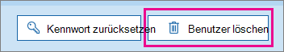

# <a name="delete-a-booking-calendar-in-bookings"></a><span data-ttu-id="02bac-103">Löschen eines Buchungskalenders in Bookings</span><span class="sxs-lookup"><span data-stu-id="02bac-103">Delete a booking calendar in Bookings</span></span>

<span data-ttu-id="02bac-104">In diesem Artikel wird erläutert, wie Sie einen unerwünschten Buchungskalender löschen können.</span><span class="sxs-lookup"><span data-stu-id="02bac-104">This article explains how you can delete an unwanted booking calendar.</span></span> <span data-ttu-id="02bac-105">Sie können den Buchungskalender im Microsoft 365 oder PowerShell löschen.</span><span class="sxs-lookup"><span data-stu-id="02bac-105">You can delete the booking calendar in the Microsoft 365 admin center or you can use PowerShell.</span></span> <span data-ttu-id="02bac-106">Der Bookings-Kalender ist ein Postfach in Exchange Online löschen Sie daher das entsprechende Benutzerkonto, um den Buchungskalender zu löschen.</span><span class="sxs-lookup"><span data-stu-id="02bac-106">The Bookings calendar is a mailbox in Exchange Online so you delete the corresponding user account to delete the booking calendar.</span></span>

> [!IMPORTANT]
> <span data-ttu-id="02bac-107">Alle Buchungskalender, die Sie 2017 oder früher erstellt haben, müssen mithilfe der PowerShell-Anweisungen zu diesem Thema gelöscht werden.</span><span class="sxs-lookup"><span data-stu-id="02bac-107">All booking calendars that you created in 2017 or before must be deleted using the PowerShell instructions on this topic.</span></span> <span data-ttu-id="02bac-108">Alle Buchungskalender, die 2018 oder danach erstellt wurden, können im Microsoft 365 gelöscht werden.</span><span class="sxs-lookup"><span data-stu-id="02bac-108">All booking calendars created in 2018 or after can be deleted in the Microsoft 365 admin center.</span></span>

<span data-ttu-id="02bac-109">Im Buchungskalender werden alle relevanten Informationen zu diesem Buchungskalender und zu den Daten gespeichert, einschließlich:</span><span class="sxs-lookup"><span data-stu-id="02bac-109">The booking calendar is where all relevant information about that booking calendar and data are stored, including:</span></span>

- <span data-ttu-id="02bac-110">Geschäftsinformationen, Logo und Arbeitszeiten, die beim Erstellen des Buchungskalenders hinzugefügt wurden</span><span class="sxs-lookup"><span data-stu-id="02bac-110">Business information, logo, and working hours added when the booking calendar was created</span></span>
- <span data-ttu-id="02bac-111">Relevante Mitarbeiter und Dienste, die beim Erstellen des Buchungskalenders hinzugefügt wurden</span><span class="sxs-lookup"><span data-stu-id="02bac-111">Relevant staff and services added when the booking calendar was created</span></span>
- <span data-ttu-id="02bac-112">Alle Buchungen und Termine mit Auszeit, die dem Buchungskalender hinzugefügt wurden, nachdem er erstellt wurde.</span><span class="sxs-lookup"><span data-stu-id="02bac-112">All bookings and time off appointments added to the booking calendar once it was created.</span></span>

> [!WARNING]
> <span data-ttu-id="02bac-113">Nachdem ein Buchungskalender gelöscht wurde, werden diese zusätzlichen Informationen auch dauerhaft gelöscht und können nicht wiederhergestellt werden.</span><span class="sxs-lookup"><span data-stu-id="02bac-113">Once a booking calendar is deleted, this additional information is also permanently deleted and can't be recovered.</span></span>

## <a name="delete-a-booking-calendar-in-the-microsoft-365-admin-center"></a><span data-ttu-id="02bac-114">Löschen eines Buchungskalenders im Microsoft 365 Admin Center</span><span class="sxs-lookup"><span data-stu-id="02bac-114">Delete a booking calendar in the Microsoft 365 admin center</span></span>

1. <span data-ttu-id="02bac-115">Gehen Sie zum Microsoft 365 Admin Center.</span><span class="sxs-lookup"><span data-stu-id="02bac-115">Go to the Microsoft 365 admin center.</span></span>

1. <span data-ttu-id="02bac-116">Wählen Sie im Admin Center **Benutzer** aus.</span><span class="sxs-lookup"><span data-stu-id="02bac-116">In the Admin center, select **Users**.</span></span>

   

1. <span data-ttu-id="02bac-118">Wählen Sie auf der Seite **Aktive Benutzer** die Namen der Benutzer aus, die Sie löschen möchten, und wählen Sie dann **Benutzer löschen** aus.</span><span class="sxs-lookup"><span data-stu-id="02bac-118">On the **Active Users** page, choose the names of the users that you want to delete, and then select **Delete user**.</span></span>

   

## <a name="delete-a-booking-calendar-using-exchange-online-powershell"></a><span data-ttu-id="02bac-120">Löschen eines Buchungskalenders mithilfe Exchange Online PowerShell</span><span class="sxs-lookup"><span data-stu-id="02bac-120">Delete a booking calendar using Exchange Online PowerShell</span></span>

<span data-ttu-id="02bac-121">Unter [Verbinden, Exchange Online PowerShell](/powershell/exchange/exchange-online-powershell-v2?view=exchange-ps) zu finden, finden Sie Informationen zu Voraussetzungen und Anleitungen für die Verbindung mit Exchange Online PowerShell.</span><span class="sxs-lookup"><span data-stu-id="02bac-121">See [Connect to Exchange Online PowerShell](/powershell/exchange/exchange-online-powershell-v2?view=exchange-ps) for prerequisites and guidance for connecting to Exchange Online PowerShell.</span></span>

<span data-ttu-id="02bac-122">Zum Ausführen dieser Schritte müssen Sie ein aktives Microsoft PowerShell-Befehlsfenster verwenden, das Sie ausgeführt haben, indem Sie die Option "Als Administrator ausführen" auswählen.</span><span class="sxs-lookup"><span data-stu-id="02bac-122">To perform these steps, you must be using an active Microsoft PowerShell command window that you ran by choosing the “Run as administrator” option.</span></span>

1. <span data-ttu-id="02bac-123">Laden Sie in einem PowerShell-Fenster das EXO V2-Modul, indem Sie den folgenden Befehl ausführen:</span><span class="sxs-lookup"><span data-stu-id="02bac-123">In a PowerShell window, load the EXO V2 module by running the following command:</span></span>

   ```powershell
   Import-Module ExchangeOnlineManagement
   ```

   > [!NOTE]
   > <span data-ttu-id="02bac-124">Wenn Sie [das EXO V2-Modul bereits installiert](/powershell/exchange/exchange-online-powershell-v2?view=exchange-ps#install-and-maintain-the-exo-v2-module) haben, funktioniert der vorherige Befehl wie beschrieben.</span><span class="sxs-lookup"><span data-stu-id="02bac-124">If you've already [installed the EXO V2 module](/powershell/exchange/exchange-online-powershell-v2?view=exchange-ps#install-and-maintain-the-exo-v2-module), the previous command will work as written.</span></span>
   
2. <span data-ttu-id="02bac-125">Die Syntax des Befehls, den Sie ausführen müssen, sieht so aus:</span><span class="sxs-lookup"><span data-stu-id="02bac-125">The command that you need to run uses the following syntax:</span></span>

   ```powershell
   Connect-ExchangeOnline -UserPrincipalName <UPN> 
   ```

   - <span data-ttu-id="02bac-126">_\<UPN\>_ ist Ihr Konto im Benutzerprinzipalnamen-Format (z. B. `john@contoso.com`).</span><span class="sxs-lookup"><span data-stu-id="02bac-126">_\<UPN\>_ is your account in user principal name format (for example, `john@contoso.com`).</span></span>

3. <span data-ttu-id="02bac-127">Wenn Sie dazu aufgefordert werden, melden Sie sich mit den Anmeldeinformationen des Mandantenadministrators beim Microsoft 365 an, der den Buchungskalender hostet, den Sie dauerhaft löschen möchten.</span><span class="sxs-lookup"><span data-stu-id="02bac-127">When you are prompted, log on with tenant administrator credentials to the Microsoft 365 tenant that hosts the booking calendar you want to permanently delete.</span></span>

4. <span data-ttu-id="02bac-128">Sobald dieser Befehl verarbeitet wurde, geben Sie den folgenden Befehl ein, um eine Liste der Buchungspostfächer in Ihrem Mandanten abzurufen:</span><span class="sxs-lookup"><span data-stu-id="02bac-128">Once this command is done processing, enter the following command to get a list of the booking mailboxes in your tenant:</span></span>

   ```powershell
   Get-EXOMailbox -RecipientTypeDetails SchedulingMailbox
   ```

5. <span data-ttu-id="02bac-129">Geben Sie den folgenden Befehl ein:</span><span class="sxs-lookup"><span data-stu-id="02bac-129">Type the following command:</span></span>

   ```powershell
   remove-mailbox [BookingCalendarToDelete]
   ```

   > [!IMPORTANT]
   > <span data-ttu-id="02bac-130">Achten Sie darauf, den genauen Namen des Buchungspostfachalias ein, den Sie dauerhaft löschen möchten.</span><span class="sxs-lookup"><span data-stu-id="02bac-130">Be careful to type the exact name of the booking mailbox alias that you want to permanently delete.</span></span>

6. <span data-ttu-id="02bac-131">Geben Sie den folgenden Befehl ein, um zu überprüfen, ob der Kalender gelöscht wurde:</span><span class="sxs-lookup"><span data-stu-id="02bac-131">To verify that the calendar has been deleted, enter the following command:</span></span>

   ```powershell
    Get-EXOMailbox -RecipientTypeDetails SchedulingMailbox
   ```

   <span data-ttu-id="02bac-132">Der gelöschte Kalender wird nicht in der Ausgabe angezeigt.</span><span class="sxs-lookup"><span data-stu-id="02bac-132">The deleted calendar will not appear in the output.</span></span>
