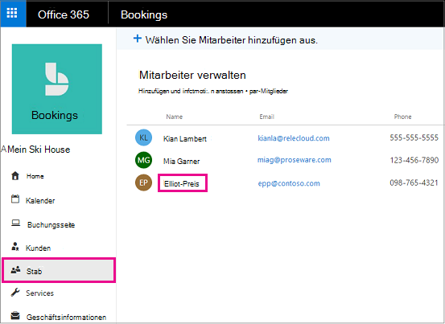
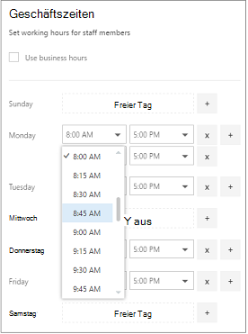
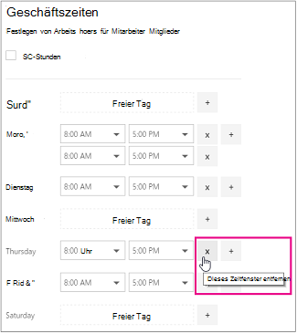

# Arbeitszeiten von Mitarbeitern in Microsoft-BuchungenEmployee working hours in Microsoft Bookings

Durch Festlegen der Arbeitszeiten für Mitarbeiter wird sichergestellt, dass die Verfügbarkeit genau angezeigt wird, wenn Ihre Kunden versuchen, diese zu buchen.Setting employee working hours ensures that their availability is accurately shown when your customers try to book them. Die Arbeitszeiten für jeden Ihrer Mitarbeiter entsprechen standardmäßig den Geschäftszeiten, die Sie in der Microsoft Bookings-App festgelegt haben.By default, the working hours for each of your employees match the business hours you've established in the Microsoft Bookings app. Weitere Informationen finden Sie im Abschnitt "Festlegen ihrer Geschäftszeiten" unter [Enter Business Information](enter-business-information.md#set-your-business-hours).See the "Set your business hours" section of [Enter business information](enter-business-information.md#set-your-business-hours).

Auf der Seite **Mitarbeiter** können Sie die Arbeitszeiten von Mitarbeitern an die Anforderungen Ihres Unternehmens und ihrer Mitarbeiter anpassen.On the **Staff** page, you can customize employee working hours to match the needs of your business and employees.

Wenn Sie für Mitarbeiter arbeitsfreie Zeiten buchen möchten, damit die Kunden diese Personen während ihrer Abwesenheit nicht buchen können, finden Sie entsprechende Anweisungen unter [Planen von Betriebsferien, arbeitsfreier Zeit und Urlaubszeit](schedule-closures-time-off-vacation.md).If you want to book time off for staff members so customers can't book them while they're out of the office, see [Schedule business closures, time off, and vacation time](schedule-closures-time-off-vacation.md) for instructions.

## Anpassen der Arbeitszeiten für MitarbeiterCustomize employee working hours

Sehen Sie sich dieses Video an, oder führen Sie die folgenden Schritte aus, um die Arbeitszeiten eines Mitarbeiters festzulegen.Watch this video or follow the steps below to set an employee's working hours.

> [!VIDEO https://www.microsoft.com/videoplayer/embed/RWuXUq]

1. Wählen Sie in Microsoft 365 das App-Startfeld aus, und wählen Sie dann **Buchungen**aus.In Microsoft 365, select the app launcher, and then select **Bookings**.

1. Wählen Sie im Navigationsbereich **Mitarbeiter** und dann den Mitarbeiter aus, dessen Arbeitszeiten Sie festlegen möchten.In the navigation pane, select **Staff**, and then select the staff member whose hours you want to set.

   

1. Deaktivieren Sie unter "Arbeitszeiten" das Kontrollkästchen **Geschäftszeiten nutzen**.Under Working hours, clear the **Use business hours** checkbox.

1. Wählen Sie in den Dropdownmenüs die Anfangs- und Endzeit für jeden Tag aus. Die Uhrzeiten sind in 15-Minuten-Schritten verfügbar.Use the dropdowns to select start and end times for each day. Times are available in 15-minute increments.

   

1. Klicken Sie **+** , um Start-und End-Time-Selektoren hinzuzufügen.Click **+** to add start- and end-time selectors.

1. Wählen Sie Speichern aus.Select Save.

## Festlegen von freien Tagen für einen MitarbeiterSet an employee's days off

Wenn Sie einen freien Tag für einen Mitarbeiter planen, wird diese Person auf der Buchungsseite als nicht verfügbar angezeigt. Kunden, die die Buchungsseite nutzen, können die betreffende Person an diesem Tag nicht für einen Dienst planen.When you schedule a day off for an employee, that employee will appear unavailable on the booking page. Customers using the booking page will be unable to schedule him or her for service on that day.

1. Wählen Sie auf dem Bildschirm Arbeitszeit das **x** neben dem Tag aus, an dem der Mitarbeiter ausgeschaltet ist.On the working hours screen, select the **x** next to the day that the employee will have off.

   

1. Wenn Sie einen Tag planen möchten, der zuvor als Ruhetag markiert war, wählen Sie das **+** Zeichen neben dem Tag aus, den Sie planen möchten.If you want to schedule a day that was previously marked as a day off, select the **+** sign next to the day you want to schedule.

> [!TIP]
> Wenn Sie die Zeit für die Mitarbeiter Ferien oder andere große Zeiträume planen, lesen Sie den Abschnitt "Schedule Employee Time Off" unter [Schedule Business Closures, Time Off und Vacation Time](schedule-closures-time-off-vacation.md#schedule-employee-time-off).If scheduling employee vacation time or other large blocks of time off, see the "Schedule employee time off" section of [Schedule business closures, time off, and vacation time](schedule-closures-time-off-vacation.md#schedule-employee-time-off).
