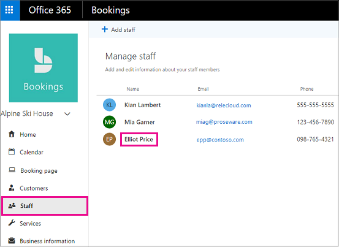

# Arbeitszeiten von Mitarbeitern in Microsoft-Buchungen

Durch Festlegen der Arbeitszeiten für Mitarbeiter wird sichergestellt, dass die Verfügbarkeit genau angezeigt wird, wenn Ihre Kunden versuchen, diese zu buchen. Die Arbeitszeiten für jeden Ihrer Mitarbeiter entsprechen standardmäßig den Geschäftszeiten, die Sie in der Microsoft Bookings-App festgelegt haben. Weitere Informationen finden Sie im Abschnitt "Festlegen ihrer Geschäftszeiten" unter [Enter Business Information](enter-business-information.md#set-your-business-hours).

Auf der Seite **Mitarbeiter** können Sie die Arbeitszeiten von Mitarbeitern an die Anforderungen Ihres Unternehmens und ihrer Mitarbeiter anpassen.

Wenn Sie für Mitarbeiter arbeitsfreie Zeiten buchen möchten, damit die Kunden diese Personen während ihrer Abwesenheit nicht buchen können, finden Sie entsprechende Anweisungen unter [Planen von Betriebsferien, arbeitsfreier Zeit und Urlaubszeit](schedule-closures-time-off-vacation.md).

> [!NOTE]
> Reservierungen sind standardmäßig für Kunden mit den Abonnements Microsoft 365 Business Standard, Microsoft 365 a3 oder Microsoft 365 a5 aktiviert. Reservierungen stehen auch Kunden mit Office 365 Enterprise E3 und Office 365 Enterprise E5 zur Verfügung, Sie sind jedoch standardmäßig deaktiviert. Die ersten Schritte finden Sie unter [Get Access to Microsoft Booking](get-access.md). Informationen zum Aktivieren oder Deaktivieren von Buchungen finden Sie unter [Aktivieren oder Deaktivieren von Buchungen für Ihre Organisation](turn-bookings-on-or-off.md).

## Anpassen der Arbeitszeiten für Mitarbeiter

Sehen Sie sich dieses Video an, oder führen Sie die folgenden Schritte aus, um die Arbeitszeiten eines Mitarbeiters festzulegen.

> [!VIDEO https://www.microsoft.com/videoplayer/embed/RWuXUq]

1. Wählen Sie in Microsoft 365 das App-Startfeld aus, und wählen Sie dann **Buchungen**aus.

1. Wählen Sie im Navigationsbereich **Mitarbeiter** und dann den Mitarbeiter aus, dessen Arbeitszeiten Sie festlegen möchten.

   

1. Deaktivieren Sie unter "Arbeitszeiten" das Kontrollkästchen **Geschäftszeiten nutzen**.

1. Wählen Sie in den Dropdownmenüs die Anfangs- und Endzeit für jeden Tag aus. Die Uhrzeiten sind in 15-Minuten-Schritten verfügbar.

   

1. Klicken Sie **+** , um Start-und End-Time-Selektoren hinzuzufügen.

1. Klicken Sie auf Speichern.

## Festlegen von freien Tagen für einen Mitarbeiter

Wenn Sie einen freien Tag für einen Mitarbeiter planen, wird diese Person auf der Buchungsseite als nicht verfügbar angezeigt. Kunden, die die Buchungsseite nutzen, können die betreffende Person an diesem Tag nicht für einen Dienst planen.

1. Wählen Sie auf dem Bildschirm Arbeitszeit das **x** neben dem Tag aus, an dem der Mitarbeiter ausgeschaltet ist.

   

1. Wenn Sie einen Tag planen möchten, der zuvor als Ruhetag markiert war, wählen Sie das **+** Zeichen neben dem Tag aus, den Sie planen möchten.

> [!TIP]
> Wenn Sie die Zeit für die Mitarbeiter Ferien oder andere große Zeiträume planen, lesen Sie den Abschnitt "Schedule Employee Time Off" unter [Schedule Business Closures, Time Off und Vacation Time](schedule-closures-time-off-vacation.md#schedule-employee-time-off).
