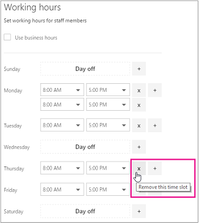

# Mitarbeiterarbeitszeiten in Microsoft Bookings

Das Festlegen der Arbeitszeiten der Mitarbeiter stellt sicher, dass ihre Verfügbarkeit korrekt angezeigt wird, wenn Ihre Kunden versuchen, sie zu reservieren. Die Arbeitszeiten für jeden Ihrer Mitarbeiter entsprechen standardmäßig den Geschäftszeiten, die Sie in der Microsoft Bookings-App festgelegt haben. Weitere Informationen finden Sie im Abschnitt "Festlegen ihrer Geschäftszeiten" unter [Geschäftsinformationen eingeben.](enter-business-information.md#set-your-business-hours)

Auf der **Seite Mitarbeiter** können Sie die Arbeitszeiten der Mitarbeiter an die Anforderungen Ihres Unternehmens und Ihrer Mitarbeiter anpassen.

Wenn Sie für Mitarbeiter arbeitsfreie Zeiten buchen möchten, damit die Kunden diese Personen während ihrer Abwesenheit nicht buchen können, finden Sie entsprechende Anweisungen unter [Planen von Betriebsferien, arbeitsfreier Zeit und Urlaubszeit](schedule-closures-time-off-vacation.md).

## Anpassen der Arbeitszeiten von Mitarbeitern

Sehen Sie sich dieses Video an, oder führen Sie die folgenden Schritte aus, um die Arbeitszeiten eines Mitarbeiters zu festlegen.

> [!VIDEO https://www.microsoft.com/videoplayer/embed/RWuXUq]

1. Wählen Microsoft 365 app launcher aus, und wählen Sie dann **Bookings aus.**

1. Wählen Sie im Navigationsbereich **Mitarbeiter** und dann den Mitarbeiter aus, dessen Arbeitszeiten Sie festlegen möchten.

   

1. Deaktivieren Sie unter "Arbeitszeiten" das Kontrollkästchen **Geschäftszeiten nutzen**.

1. Wählen Sie in den Dropdownmenüs die Anfangs- und Endzeit für jeden Tag aus. Die Uhrzeiten sind in 15-Minuten-Schritten verfügbar.

   

1. Klicken **+** Sie, um Start- und Endzeitwähler hinzuzufügen.

1. Klicken Sie auf Speichern.

## Festlegen von freien Tagen für einen Mitarbeiter

Wenn Sie einen freien Tag für einen Mitarbeiter planen, wird diese Person auf der Buchungsseite als nicht verfügbar angezeigt. Kunden, die die Buchungsseite nutzen, können die betreffende Person an diesem Tag nicht für einen Dienst planen.

1. Wählen Sie auf dem Bildschirm Arbeitszeiten das **x** neben dem Tag aus, an dem der Mitarbeiter aus ist.

   

1. Wenn Sie einen Tag planen möchten, der zuvor als "Tag" markiert wurde, wählen Sie das Zeichen neben dem Tag aus, den **+** Sie planen möchten.

> [!TIP]
> Wenn Sie Urlaubszeit für Mitarbeiter planen oder andere große Blöcke der Auszeit planen, lesen Sie den Abschnitt "Zeit für Die Zeit für Mitarbeiter planen" unter Planen von Geschäftsschließungen, Auszeiten und [Urlaubszeit](schedule-closures-time-off-vacation.md#schedule-employee-time-off).
