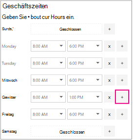
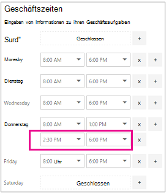
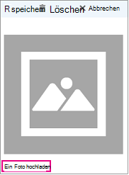

# Eingeben Ihrer Unternehmensinformationen

In Microsoft Bookings enthält die Seite Geschäftsinformationen in der Web-App alle Details, die Sie normalerweise auf der Seite "Über uns" eines Unternehmens finden würden. Zu diesen Details gehören ein relevanter Name, eine Adresse, eine Telefonnummer, eine Website-URL, eine Datenschutzrichtlinien-URL, ein Logo und Geschäftszeiten.

Die hier angegebenen Informationen werden auf der Seite angezeigt, die Kunden und Kunden zum Buchen von Terminen (als Buchungsseite bezeichnet) sowie in Nachrichten und Erinnerungen anzeigen, die ihnen von Bookings gesendet werden. Ein Beispiel für diese Informationen auf der Buchungsseite ist unten hervorgehoben.

   

> [!NOTE]
> Informationen zu den ersten Schritte finden Sie [unter Zugriff auf Microsoft Bookings](get-access.md). Informationen zum Aktivieren oder Deaktivieren von Bookings finden Sie unter Aktivieren oder Deaktivieren von [Bookings für Ihre Organisation.](turn-bookings-on-or-off.md)

## Angeben von Unternehmensname und Kontaktinformationen

1. Wählen Microsoft 365 App-Startfeld aus, und wählen Sie dann **Bookings aus.**

1. Wählen Sie im Navigationsbereich **Unternehmensinformationen** aus.

1. Geben Sie den relevanten Namen, die Adresse und die Telefonnummer ein, die Sie für Ihren Bookings-Kalender verwenden möchten.

1. Geben **Sie unter Senden von Kundenantworten an** die bevorzugte E-Mail-Adresse ein, an die E-Mail-Antworten auf Buchungsbestätigungen und Erinnerungen weitergeleitet werden sollen.

1. Geben Sie **im Feld Website-URL** die URL der Startseite für Ihr Unternehmen ein.

1. Geben Sie **die URLs für** **Datenschutzrichtlinien und & Bedingungen** ein.

1. Klicken Sie auf **Speichern**.

## Festlegen Ihrer Geschäftszeiten

Die Geschäftszeiten werden in der Bookings-App standardmäßig auf 8:00 bis 17:00 Uhr von Montag bis Freitag festgelegt. Die Uhrzeiten werden in 15-Minuten-Schritten angegeben. Die Bookings-App verwendet das 12-Stunden-Format.

Legen **Sie die Geschäftszeiten** auf Ihre Betriebszeiten an. Dies sind die Stunden, auf die alle Buchungen beschränkt sind. Zusätzliche Zeiteinschränkungen, wann Termine gebucht werden können, können für jeden Dienst bzw. für jeden Mitarbeiter auf den Seiten Dienste und Mitarbeiter festgelegt werden.

1. Verwenden Sie auf der Seite "Unternehmensinformationen" unter "Geschäftszeiten" die Dropdownmenüs zum Auswählen von Anfangs- und Endzeit für jeden Tag.

1. Klicken **+** Sie, um Start- und Endzeitwähler hinzuzufügen.

## Festlegen von Zeiten für eine geteilte Schicht

Möglicherweise müssen Sie einen Teil jedes Tages oder jeder Woche blockieren, um Mitarbeiterbesprechungen zu haben, das Inventar zu aktualisieren oder andere Geschäftsrhythmusdetails zu übernehmen. Mit der Bookings-App können Sie Kundentermine auf Ihre angegebenen Zeitfenster beschränken.

Sie haben beispielsweise jeden Donnerstag von 1 Uhr bis 2:30 Uhr Mitarbeiterbesprechungen und möchten diese Zeit blockieren, damit alle Mitarbeiter teilnehmen können. Gehen Sie hierfür folgendermaßen vor:

1. Wählen Sie auf der Seite "Unternehmensinformationen" unter "Geschäftszeiten" eine Anfangs- und Endzeit für Donnerstage aus. In diesem Beispiel legen wir "8:00" bis "13:00" fest.

1. Wählen Sie **+** aus, um eine neue Zeile für Donnerstag zu erstellen.

   

1. Wählen Sie in der neuen Zeile "14:30" für die Anfangszeit und "18:00" für die Endzeit aus.

   

1. Klicken Sie auf Speichern.

    Wenn ein Kunde Ihre Buchungsseite besucht, sieht er, dass Ihr Unternehmen an Donnerstagen zwischen 13:00 und 14:30 Uhr geschlossen ist.

## Hochladen Ihres Logos

Wenn Sie Ihr Firmenlogo nicht bereits in die Bookings-App hochgeladen haben, können Sie dies über die Seite "Unternehmensinformationen" erledigen.

1. Wählen Sie auf der Seite Geschäftsinformationen unter Hochladen Logo **Ändern aus.**

1. Wählen Sie **Foto hochladen** aus.

   

1. Wählen Sie **Speichern**.
