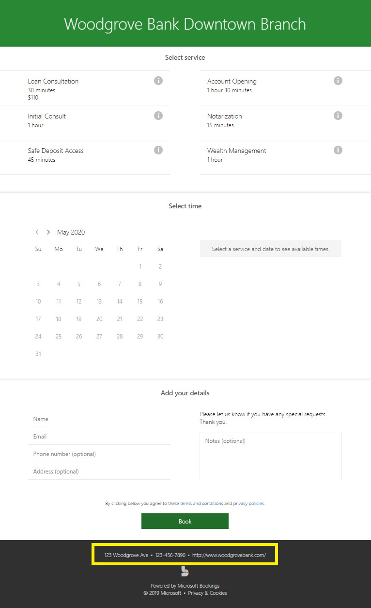

# Eingeben Ihrer UnternehmensinformationenEnter your business information

In Microsoft-Buchungen enthält die Unternehmens Informationsseite innerhalb der Webanwendung alle Details, die Sie normalerweise auf der Seite "über uns" des Unternehmens finden.In Microsoft Bookings, the Business Information page within the web app contains all the details that you'd typically find on a business' "About us" page. Diese Details umfassen einen relevanten Namen, eine Adresse, eine Telefonnummer, eine Website-URL, eine URL für die Datenschutzrichtlinie, das Logo und die Geschäftszeiten.These details include your a relevant name, address, phone number, web site URL, privacy policy URL, logo, and business hours.

Die Informationen, die Sie hier angeben, werden auf der Seite "Kunden und Clients" angezeigt, die zum Buchen von Terminen verwendet wird (die so genannte Buchungsseite) und in Nachrichten und Erinnerungen, die Ihnen durch Buchungen gesendet werden.The information you provide here will be displayed on the page customers and clients use to book appointments (known as the booking page) and in messages and reminders sent to them by Bookings. Ein Beispiel für diese Informationen auf der Buchungsseite wird unten hervorgehoben.An example of this information on the booking page is highlighted below.

   

> [!NOTE]
> Die ersten Schritte finden Sie unter [Get Access to Microsoft Booking](get-access.md).To get started, see [Get access to Microsoft Bookings](get-access.md). Informationen zum Aktivieren oder Deaktivieren von Buchungen finden Sie unter [Aktivieren oder Deaktivieren von Buchungen für Ihre Organisation](turn-bookings-on-or-off.md).To turn Bookings on or off, see [Turn Bookings on or off for your organization](turn-bookings-on-or-off.md).

## Angeben von Unternehmensname und KontaktinformationenProvide business name and contact information

1. Wählen Sie in Microsoft 365 das App-Startfeld aus, und wählen Sie dann **Buchungen**aus.In Microsoft 365, select the App launcher, and then select **Bookings**.

1. Wählen Sie im Navigationsbereich **Unternehmensinformationen** aus.In the navigation pane, select **Business information**.

1. Geben Sie den entsprechenden Namen, die Adresse und die Telefonnummer ein, die Sie für Ihren Buchungskalender verwenden möchten.Enter the relevant name, address, and phone number you would like to use for your Bookings calendar.

1. Geben **Sie unter Kunden Antworten senden an**die bevorzugte e-Mail-Adresse ein, an die e-Mail-Antworten an Buchungsbestätigungen und Erinnerungen weitergeleitet werden sollen.In **Send customer replies to**, type the preferred email address where email replies to booking confirmations and reminders should be forwarded.

1. Geben Sie im Feld **Website-URL** die URL der Startseite Ihres Unternehmens ein.In the **Website URL** field, enter the URL of the home page for your business.

1. Geben Sie die **Datenschutzrichtlinie** und die **Begriffe & Bedingungen** -URLs ein.Enter the **privacy policy** and **terms & conditions** URLs.

1. Wählen Sie **Speichern** aus.Select **Save**.

## Festlegen Ihrer GeschäftszeitenSet your business hours

Die Geschäftszeiten werden in der Bookings-App standardmäßig auf 8:00 bis 17:00 Uhr von Montag bis Freitag festgelegt. Die Uhrzeiten werden in 15-Minuten-Schritten angegeben. Die Bookings-App verwendet das 12-Stunden-Format.By default, the business hours in the Bookings app are set to 8 a.m. to 5 p.m., Monday through Friday. Times are provided in 15-minute increments. The Bookings app uses the 12-hour clock.

Legen Sie die **Geschäftszeiten** auf Ihre Betriebsstunden fest.Set **business hours** to your operational hours. Dies sind die Stunden, für die alle Buchungen eingeschränkt sind.These are the hours to which all bookings are restricted. Für jeden Dienst und jeden Mitarbeiter auf der Seite "Dienste" und "Mitarbeiter" können zusätzliche Zeitbeschränkungen für den Zeitpunkt festgelegt werden, zu dem Termine gebucht werden können.Additional time restrictions of when appointments can be booked can be set for each service and for each staff member in the Services and Staff pages, respectively.

1. Verwenden Sie auf der Seite "Unternehmensinformationen" unter "Geschäftszeiten" die Dropdownmenüs zum Auswählen von Anfangs- und Endzeit für jeden Tag.On the Business information page, under Business hours, use the dropdowns to select start and end times for each day.

1. Klicken Sie **+** , um Start-und End-Time-Selektoren hinzuzufügen.Click **+** to add start- and end-time selectors.

## Festlegen von Zeiten für eine geteilte SchichtHow to set hours for a split shift

Möglicherweise müssen Sie einen Teil eines jeden Tages oder einer Woche blockieren, um Mitarbeiterbesprechungen durchführen zu können, den Bestand zu aktualisieren oder andere Business Rhythm-Details zu erledigen.You might need to block out a portion of each day or week to have staff meetings, update inventory, or take care of other rhythm-of-business details. Mit der App "Reservierungen" können Sie Kundentermine auf Ihre angegebenen Zeiträume beschränken.The Bookings app allows you to limit customer appointments to your specified time slots.

Beispielsweise haben Sie Mitarbeiterbesprechungen jeden Donnerstag von 1 Uhr bis 2:30 und möchten diese Zeit blockieren, damit alle Mitarbeiter teilnehmen können.For example, you have staff meetings every Thursday from 1 o'clock to 2:30 and want to block out that time so all of your staff members can attend. Gehen Sie hierfür folgendermaßen vor:To do this:

1. Wählen Sie auf der Seite "Unternehmensinformationen" unter "Geschäftszeiten" eine Anfangs- und Endzeit für Donnerstage aus. In diesem Beispiel legen wir "8:00" bis "13:00" fest.On the Business information page, under Business hours, select a start and end time for Thursdays. In this example we'll set 8:00 a.m. to 1:00 p.m.

1. Wählen Sie **+** aus, um eine neue Zeile für Donnerstag zu erstellen.Select **+** to create a new row for Thursday.

   

1. Wählen Sie in der neuen Zeile 2:30 Uhr aus.In the new row, select 2:30 p.m. für die Startzeit und 6:00 Uhrfor the start time and 6:00 p.m. Endzeit.for the end time.

   

1. Wählen Sie Speichern aus.Select Save.

    Wenn ein Kunde Ihre Buchungsseite besucht, sieht er, dass Ihr Unternehmen an Donnerstagen zwischen 13:00 und 14:30 Uhr geschlossen ist.When a customer goes to your booking page, he or she will see that your business is closed from 1 to 2:30 on Thursdays.

## Hochladen Ihres LogosUpload your logo

Wenn Sie Ihr Firmenlogo nicht bereits in die Bookings-App hochgeladen haben, können Sie dies über die Seite "Unternehmensinformationen" erledigen.If you haven't already uploaded your business logo to the Bookings app, you can do it from the Business information page.

1. Wählen Sie auf der Seite Unternehmensinformationen unter Logo hochladen die Option **ändern**aus.On the Business information page, under Upload logo, select **Change**.

1. Wählen Sie **Foto hochladen** aus.Select **Upload photo**.

   

1. Wählen Sie **Speichern**.Select **Save**.
