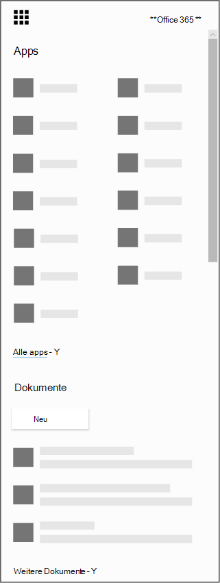

# Herunterladen der Microsoft Bookings-App für iOS und Android

Vielen Dank für das Herunterladen der Microsoft Bookings-App! Microsoft Bookings ist als mobile App für iOS und Android verfügbar. Die Bookings-App für iOS steht in allen Ländern und Regionen zur Verfügung, die von Apple unterstützt werden. Sie können die App aus dem [iTunes-App Store](https://apps.apple.com/app/microsoft-bookings/id1065657468) herunterladen. Die Bookings-App für Android steht im [Google Play-Store](https://play.google.com/store/apps/details?id=com.microsoft.exchange.bookings) in den USA und Kanada zum Download bereit.

Bevor Sie beginnen, müssen Sie Bookings im Web einrichten.

1. Sie können die gesuchte App nicht finden? Wählen Sie im App-Startfeld Alle Apps aus, um eine alphabetische Liste der verfügbaren Microsoft 365 zu sehen. Von dort aus können Sie nach einer bestimmten App suchen.

   

2. Gelangen Sie [zur Office Startseite und](https://office.com) wählen Sie im App-Startfeld Bookings **aus.**

3. Wählen Sie **Jetzt abrufen** aus.

4. Geben Sie Ihren Namen und die Art des von Ihnen betriebenen Unternehmens ein, wie "Frisörsalon" oder "Zahnarztpraxis", und wählen Sie dann **Zu Bookings** aus.

5. Sie können jetzt Bookings für Ihre Organisation einrichten. Führen Sie die Schritte im [Thema Microsoft Bookings aus,](bookings-overview.md) um die Einrichtung von Bookings zu beenden. Wechseln Sie wieder zu Ihrem Mobilgerät, und melden Sie sich bei der mobilen App ab. Melden Sie sich wieder an, um zu Ihrem neuen Booking-Kalender zu wechseln.

## Nur-Ansichtsmodus

Jeder Benutzer, dem in Bookings kein Lese-/Schreibzugriff gewährt wurde, kann die mobile App weiterhin im Nur-Ansicht-Modus verwenden. Jeder Benutzer mit einer Bookings-Lizenz, der einem Buchungskalender hinzugefügt wird, kann seine eigenen Termine, Termindetails und Geschäftsinformationen seiner Kollegen sehen. Ein Benutzer mit Nur-Ansicht-Zugriff kann keine Änderungen oder Bearbeitungen vornehmen und nicht auf die Kundenliste zugreifen.
