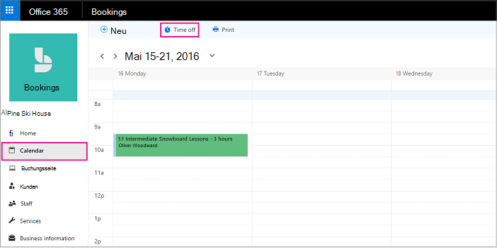

# Planen von Betriebsferien, arbeitsfreier Zeit und Urlaubszeit

Gelegentlich möchten Sie Ihr Unternehmen für Feiertage oder Teamereignisse schließen, oder Ihre Mitarbeiter benötigen Auszeit, wenn sie krank sind, im Urlaub sind oder aus anderen Gründen nicht verfügbar sind. Sie können eine Auszeit im Microsoft Bookings-Kalender planen, und der Mitarbeiter ist während der angegebenen Zeit nicht für Buchungen verfügbar. Sobald das Unternehmen wieder geöffnet wird oder mitarbeiter wieder zur Arbeit zurückkehren, werden alle Auf der Buchungsseite entsprechend ihren festgelegten Arbeitszeiten aufgeführt.

Sehen Sie sich dieses Video an, oder führen Sie die folgenden Schritte aus, um Betriebsschließungen oder Mitarbeiter weg zu planen.

> [!VIDEO https://www.microsoft.com/videoplayer/embed/RE2TxDC]

## Planen von Ad-hoc-Betriebsferien

1. Wählen Microsoft 365 app launcher aus, und wählen Sie dann Bookings aus.

1. Wählen Sie im Navigationsbereich **Kalender** \> **Arbeitsfreie Zeit** aus.

   

1. Füllen Sie die Details aus, darunter einen Titel, Datum und Uhrzeit für Anfang und Ende, Ort und zusätzliche Notizen.

1. Wählen Sie **Ganztägiges Ereignis** aus.

1. Wählen Sie alle Mitarbeiter aus.

1. Wählen Sie **Speichern** aus.

Wenn ein Kunde einen Dienst an einem Tag zu planen versucht, an dem das Büro geschlossen ist, wird auf der Buchungsseite eine entsprechende Meldung angezeigt.

   

## Planen der arbeitsfreien Zeiten für Mitarbeiter

1. Wählen Microsoft 365 app launcher aus, und wählen Sie dann **Bookings aus.**

   

1. Wählen Sie im Navigationsbereich **Kalender** \> **Arbeitsfreie Zeit** aus.

   

1. Füllen Sie die Details aus, darunter einen Titel, Datum und Uhrzeit für Anfang und Ende, Ort und zusätzliche Notizen. Wenn der Mitarbeiter einen ganzen Tag oder mehrere Tage abwesend ist, wählen Sie **Ganztägiges Ereignis** aus.

1. Wählen Sie den oder die Mitarbeiter aus, der bzw. die arbeitsfreie Zeiten nimmt/nehmen.

1. Wählen Sie **Speichern**.
