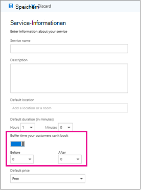
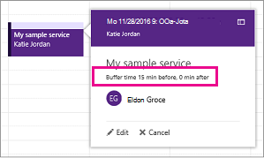

# Festlegen von Pufferzeit in Microsoft Bookings

Einige Ihrer Termine erfordern möglicherweise Zeit vor oder nach dem Treffen mit Ihrem Kunden zum Einrichten, Bereinigen oder Zurücksetzen Ihres Raumes und Ihrer Ausrüstung. Oder wenn Sie zwischen Kundenterminen unterwegs sind, benötigen Sie möglicherweise Zeit, um sicherzustellen, dass Sie und Ihr Team zwischen Terminen reisen können, ohne den Kunden warten zu lassen.

Sie können die Pufferzeit vor dem Beginn von Terminen, nach dem Ende von Terminen oder beides festlegen, um den Mitarbeitern mehr Zeit für die Vorbereitung auf den nächsten Termin zu geben.

## Festlegen von Standardeinstellungen für die Pufferzeit

Pufferzeiteinstellungen werden auf der Seite **Servicedetails** in Bookings festgelegt. Wie alle auf dieser Seite festgelegten Diensteinstellungen können diese Standardwerte von Ihnen für eine bestimmte Buchung bearbeitet werden, um bestimmte Kundenanforderungen zu erfüllen.

Die Pufferzeiteinstellung finden Sie direkt unterhalb der **Standarddauerauswahl** auf der **Seite Dienstdetails.** Bevor sie für einen bestimmten Dienst festgelegt werden kann, müssen Sie die Pufferzeiteinstellung aktivieren, indem Sie die Pufferzeit umschalten. Dies bewirkt, dass die **Dropdowns Before** und **After** angezeigt werden, die verwendet werden, um die Standardzeit vor und nach jeder Buchung zu wählen, wie hier gezeigt:

   

## Zeitplanung für Pufferzeit und Termin

Um Verwirrung bei Kundenterminen zu vermeiden, werden in Bookings in Ihrem Kalender sowie in E-Mail-Bestätigungen und Erinnerungen an die entsprechenden Mitarbeiter die Pufferzeit und der tatsächliche Zeitpunkt für den Termin (an dem Ihr Kunde Sie erwartet) angezeigt. Nachfolgend finden Sie beispielsweise die Informationen unter Bookings for an appointment with a customer that includes 15 minutes of pre-appointment buffer time.

Beachten Sie, dass bei dem eigentlichen Ereignis (links im Bild) die Pufferzeit heller und der eigentliche Kundentermin dunkler schattiert ist. Der Terminaufruf (der geöffnet wird, wenn Sie das Ereignis auswählen) gibt ausdrücklich an, dass der Termin zwischen 9:00 Uhr und 10:00 Uhr mit Katie Jordan liegt und 15 Minuten Pufferzeit vor dem Termin und 0 Minuten nach dem Termin umfasst. Bestätigungen und Erinnerungen an Mitarbeiter verweisen ähnlich auf bestimmte Puffer- und Terminzeit, während der Kunde nur Bestätigungen und Erinnerungen erhalten würde, die auf eine Terminzeit von 9:00 Uhr bis 10:00 Uhr verweisen.

   

## Pufferzeit und Verfügbarkeit

Ihre Kunden sehen die festgelegten Pufferzeiten nicht direkt und können sie nicht ändern. Da jedoch pufferzeit verwendet wird, um die Gesamtdienstdauer zu berechnen, sehen Kunden, dass Sie und Ihre relevanten Mitarbeiter sowohl zu Puffer- als auch zu regulären Terminzeiten gebucht werden. Kunden sehen die Verfügbarkeit für Sie und Ihre Mitarbeiter nur, wenn genügend Zeit für den Termin und die Pufferzeit zur Verfügung steht.

Ein einstündiger Termin mit einer Pufferzeit von 15 Minuten vor dem Termin erfordert beispielsweise einen verfügbaren Zeitblock von mindestens 1 Stunde und 15 Minuten. Ein Termin für diesen Dienst würde daher einen 75-minütigen Zeitblock in Ihrem Kalender füllen und benötigt 75 Minuten Verfügbarkeit, um konfliktfrei zu buchen.
