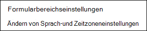
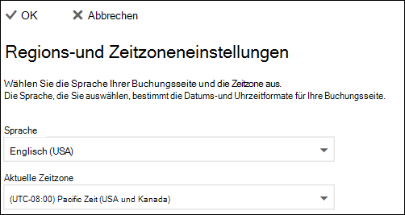

# Festlegen von Sprache und Zeitzonen in Microsoft BookingsSet language and time zones in Microsoft Bookings

Wenn Sie Microsoft-Buchungen verwenden und Buchungen zur falschen Zeit erstellt werden, müssen Ihre Zeitzoneneinstellungen möglicherweise geändert werden.If you are using Microsoft Bookings and bookings are created at the wrong time, then your time zone settings might need to be changed. Wenn sich einige Buchungen in der falschen Sprache befinden, müssen Sie möglicherweise die Spracheinstellungen ändern.Likewise, if some bookings are in the wrong language, you might need to change your language settings.

Es gibt zwei separate sprach-und Zeitzoneneinstellungen für Buchungen.There are two separate language and time zone settings for Bookings. Die erste Einstellung steuert die Sprache und Zeitzone des Buchungs Kalenders und wird mithilfe der Einstellungen für Outlook im Internet für den persönlichen Kalender des angemeldeten Benutzers festgelegt.The first setting controls the language and time zone of the booking calendar and is set using the Outlook on the web settings for the personal calendar of the logged-in user. Die zweite Einstellung wirkt sich auf die Self-Service-Buchungsseite aus, die Ihre Kunden verwenden und wird mithilfe einer Seite "regionale Einstellungen" festgelegt, die Sprache und Zeitzone nur für diese Seite steuert.The second setting affects the self-service booking page that your customers use and is set using a "regional settings" page that controls language and time zone only for that page.

> [!NOTE]
> Reservierungen sind standardmäßig für Kunden mit den Abonnements Microsoft 365 Business Standard, Microsoft 365 a3 oder Microsoft 365 a5 aktiviert.Bookings is turned on by default for customers who have the Microsoft 365 Business Standard, Microsoft 365 A3, or Microsoft 365 A5 subscriptions. Reservierungen stehen auch Kunden mit Office 365 Enterprise E3 und Office 365 Enterprise E5 zur Verfügung, Sie sind jedoch standardmäßig deaktiviert.Bookings is also available to customers who have Office 365 Enterprise E3 and Office 365 Enterprise E5, but it is turned off by default. Die ersten Schritte finden Sie unter [Get Access to Microsoft Booking](get-access.md).To get started, see [Get access to Microsoft Bookings](get-access.md). Informationen zum Aktivieren oder Deaktivieren von Buchungen finden Sie unter [Aktivieren oder Deaktivieren von Buchungen für Ihre Organisation](turn-bookings-on-or-off.md).To turn Bookings on or off, see [Turn Bookings on or off for your organization](turn-bookings-on-or-off.md).

## Festlegen der Sprache und Zeitzone für einen BuchungskalenderSetting language and time zone for a booking calendar

Im Buchungskalender werden die Sprach-und Zeitzoneneinstellungen des angemeldeten Benutzers verwendet.The booking calendar uses the logged-in user’s language and time zone settings. Wenn beispielsweise die Zeitzone des angemeldeten Benutzers auf Eastern Standard Time (EST) festgelegt ist, werden im Buchungskalender die Start-und Endzeit des Termins in EST angezeigt.For example, If the logged-in user’s time zone is set to Eastern Standard Time (EST), then the booking calendar will show existing appointment start and end times in EST. Diese Zeitzone wurde ursprünglich festgelegt, wenn die Microsoft 365-und Outlook on the-Webkonten des Benutzers erstellt wurden.This time zone was originally set when the user’s Microsoft 365 and Outlook on the web accounts were created.

So legen Sie die Sprache und Zeitzone für den Buchungskalender fest:To set the language and time zone for the booking calendar:

1. Melden Sie sich bei Microsoft 365 an, und wählen Sie die Outlook-Kachel auf der Zielseite (siehe Screenshot unten) oder im Microsoft 365-App-Startfeld aus.Log into Microsoft 365 and select the Outlook tile on the landing page (as shown in the screenshot below) or in the Microsoft 365 App Launcher.

   

1. Nachdem Outlook geöffnet wurde, wählen Sie das **Zahnradsymbol** in der oberen rechten Ecke des Bildschirms aus, um Ihre persönlichen Einstellungen und Kontoeinstellungen zu öffnen, und suchen Sie dann im Suchfeld der **Einstellungs** Gruppe nach "Zeitzone".After Outlook opens, select the **gear icon** in the upper, right-hand corner of the screen to open your personal and account settings, then search for “time zone” in the **Settings** panel search box. Der Bereich wird aktualisiert und zeigt Ihre aktuellen persönlichen Sprach- und Zeitzoneneinstellungen für dieses Konto an.The panel will update to show your current personal language and time zone settings for this account. Wie vorstehend erwähnt, steuert diese Einstellung auch die Sprache und Zeitzone des Buchungskalenders.As noted above, this setting also controls the language and time zone of the booking calendar.

1. Ändern Sie die Sprache oder Zeitzone, indem Sie im Feld **Sprache oder aktuelle** Zeitzone den Dropdownpfeil auswählen und die gewünschte Einstellung auswählen.Change the language or time zone by selecting the drop-down arrow in the **Language or Current time zone** box and choosing the desired setting.

1. Klicken Sie auf **Speichern**.Click **Save**. Der Bereich "Einstellungen" wird geschlossen, Outlook im Internet neu gestartet, und die neuen Einstellungen für Sprache und Zeitzone werden angewendet.The Settings panel closes, Outlook on the web restarts, and the new language and time zone settings are applied.

## Festlegen der Sprache und Zeitzone für die BuchungsseiteSetting the language and time zone for the booking page

1. Wählen Sie in Microsoft 365 das App-Startfeld aus, und wählen Sie dann **Buchungen**aus.In Microsoft 365, select the app launcher, and then select **Bookings**.

1. Wählen Sie im Navigationsbereich **Buchungsseite** aus, und wählen Sie **Einstellungen für Sprache und Zeitzone ändern**aus.In the navigation pane, select **Booking page** and select **Change language and time zone settings**.

   

1. Wählen Sie Ihre Sprache und die aktuelle Zeitzone aus, und klicken Sie auf OK.Select your language and current time zone and choose OK.

   
