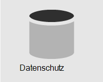
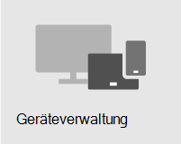

# Übersicht über die SicherheitOverview of security

> [!VIDEO https://www.microsoft.com/videoplayer/embed/RE4mzxI?autoplay=false]

Microsoft 365 Business Premium bietet Bedrohungsschutz, Datenschutz und Geräteverwaltungsfeatures, mit denen Sie Ihr Unternehmen vor Onlinebedrohungen und unbefugtem Zugriff schützen sowie Unternehmensdaten auf Ihren Smartphones, Tablets und Computern schützen und verwalten können.Microsoft 365 Business Premium provides threat protection, data protection, and device management features to help you protect your company from online threats and unauthorized access, as well as protect and manage company data on your phones, tablets, and computers.

| [BedrohungsschutzThreat protection](#threat-protection)|  [DatenschutzData protection](#data-protection) |   [deviceManagementDevice management](#device-management) |
|--|--|--|

## BedrohungsschutzThreat protection

Microsoft 365 Business Premium umfasst Office 365 Advanced Threat Protection (ATP), einen cloudbasierten E-Mail-Filterdienst, der Sie vor Schadsoftware, Ransomware, schädlichen Links und mehr schützt.Microsoft 365 Business Premium includes Office 365 Advanced Threat Protection (ATP), a cloud-based email filtering service that protects you from malware, ransomware, harmful links, and more. AtP Safe Links schützt Sie vor bösartigen URLs in E-Mails oder Office-Dokumenten.ATP Safe Links protects you from malicious URLs in email or Office documents. AtP Safe Attachments schützt Sie vor Schadsoftware und Viren, die an Nachrichten oder Dokumente angefügt sind.ATP Safe Attachments protects you from malware and viruses attached to messages or documents.

Die mehrstufige Authentifizierung (Multi-Factor Authentication, MFA) oder die Zwei-Schritt-Überprüfung erfordert, dass Sie eine zweite Authentifizierungsform, z. B. einen Überprüfungscode, präsentieren, um Ihre Identität zu bestätigen, bevor Sie auf Ressourcen zugreifen können.Multi-factor authentication (MFA), or two-step verification, requires you to present a second form of authentication, such as a verification code, to confirm your identity before you can access resources.  

Windows Defender bietet umfassenden Schutz für Ihr System, Dateien und Onlineaktivitäten vor Viren, Schadsoftware, Spyware und anderen Bedrohungen.Windows Defender provides comprehensive protection for your system, files, and online activities from viruses, malware, spyware, and other threats.

## DatenschutzData protection

Datenschutzfeatures in Microsoft 365 Business Premium tragen dazu bei, dass wichtige Daten sicher bleiben und nur autorisierte Personen Darauf zugreifen können.Data protection features in Microsoft 365 Business Premium help ensure that important data stays secure and only authorized people have access to it.

Sie können Richtlinien zur Verhinderung von Datenverlust (Data Loss Prevention, DLP) verwenden, um vertrauliche Informationen wie Sozialversicherungs- oder Kreditkartennummern zu identifizieren und zu verwalten, damit sie nicht fälschlicherweise freigegeben werden.You can use data loss prevention (DLP) policies to identify and manage sensitive information, such as Social Security or credit card numbers, so that it isn't mistakenly shared. 

Die Office 365-Nachrichtenverschlüsselung kombiniert Verschlüsselungs- und Zugriffsrechtefunktionen, um sicherzustellen, dass nur beabsichtigte Empfänger Nachrichteninhalte anzeigen können.Office 365 Message Encryption combines encryption and access rights capabilities to help ensure that only intended recipients can view message content. Die Office 365-Nachrichtenverschlüsselung funktioniert mit Outlook.com, Yahoo!, Gmail und anderen E-Mail-Diensten.Office 365 Message Encryption works with Outlook.com, Yahoo!, and Gmail, and other email services.

Exchange Online-Archivierung ist eine cloudbasierte Archivierungslösung, die mit Microsoft Exchange oder Exchange Online zusammenarbeiten kann, um erweiterte Archivierungsfunktionen, einschließlich Archiven und Datenredundanz, zu bieten.Exchange Online Archiving is a cloud-based archiving solution that works with Microsoft Exchange or Exchange Online to provide advanced archiving capabilities, including holds and data redundancy. Mithilfe von Aufbewahrungsrichtlinien können Sie Ihrer Organisation helfen, die Verpflichtungen im Zusammenhang mit E-Mails und anderen Kommunikationen zu verringern.You can use retention policies to help your organization reduce the liabilities associated with email and other communications. Wenn Ihr Unternehmen kommunikationsbezogene Benachrichtigungen im Zusammenhang mit Rechtsstreitigkeiten beibehalten muss, können Sie In-Place Und -Aufbewahrungsverfahren verwenden, um zugehörige E-Mails zu erhalten.If your company is required to retain communications related to litigation, you can use In-Place Holds and Litigation Holds to preserve related email.

## GeräteverwaltungDevice management

Mit den erweiterten Geräteverwaltungsfeatures von Microsoft 365 Business Premium können Sie überwachen und steuern, was Benutzer mit registrierten Geräten tun können.Microsoft 365 Business Premium advanced device management features let you monitor and control what users can do with enrolled devices. Zu diesen Features gehören bedingter Zugriff, MdM (Mobile Device Management), BitLocker und automatische Updates.These features include conditional access, Mobile Device Management (MDM), BitLocker, and automatic updates.

Mithilfe von Richtlinien für bedingten Zugriff können Sie zusätzliche Sicherheitsmaßnahmen für bestimmte Benutzer und Aufgaben erfordern.You can use conditional access policies to require additional security measures for certain users and tasks. Sie können z. B. eine mehrstufige Authentifizierung (Multi-Factor Authentication, MFA) erfordern oder Clients blockieren, die keinen bedingten Zugriff unterstützen.For example, you can require multi-factor authentication (MFA) or block clients that don't support conditional access.

Mit MDM können Sie die mobilen Geräte Ihrer Benutzer wie iPhones, iPads, Androids und Windows Phones schützen und verwalten.With MDM, you can help secure and manage your users' mobile devices like iPhones, iPads, Androids, and Windows phones. Sie können Gerätesicherheitsrichtlinien erstellen und verwalten, ein Gerät remote zurücksetzen, um alle Unternehmensdaten zu entfernen, ein Gerät auf die Werkseinstellungen zurücksetzen und detaillierte Geräteberichte anzeigen.You can create and manage device security policies, remotely wipe a device to remove all company data, reset a device to factory settings, and view detailed device reports. 

Sie können die BitLocker-Verschlüsselung aktivieren, um Daten zu schützen, falls ein Gerät verloren geht oder gestohlen wird, und Windows Exploit Guard für den erweiterten Schutz vor Ransomware aktivieren.You can enable BitLocker encryption to help protect data in case a device is lost or stolen, and enable Windows Exploit Guard to provide advanced protection against ransomware.

Sie können automatische Updates so konfigurieren, dass die neuesten Sicherheitsfeatures und -updates auf alle Benutzergeräte angewendet werden.You can configure automatic updates so that the latest security features and updates are applied to all user devices. 