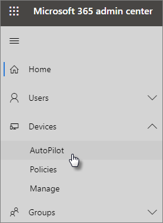

# Verwenden der schrittweisen Anleitung zum Hinzufügen von AutoPilot-Geräten und -Profilen

Sie können Windows Autopilot verwenden, um **neue** Windows 10-Geräte für Ihr Unternehmen einzurichten, damit Sie für den produktiven einsatzbereit sind, sobald Sie Sie an Ihre Mitarbeiter weitergeben.
  
## Geräteanforderungen

Geräte müssen diese Anforderungen erfüllen:
  
- Windows 10, Version 1703 oder höher.
    
- Neue Geräte, die nicht auf der Windows-Willkommensseite angezeigt werden.
    
## Befolgen der Setupanleitung zum Erstellen von Geräten und Profilen

Wenn Sie noch keine Gerätegruppen oder Profile erstellt haben, beginnen Sie am besten mit der schrittweisen Anleitung. Doch Sie können auch ohne die Anleitung [Geräte hinzufügen](create-and-edit-autopilot-devices.md) und ihnen [Profile zuweisen](create-and-edit-autopilot-profiles.md). 
  
1. Wechseln Sie zum Admin Center unter <a href="https://go.microsoft.com/fwlink/p/?linkid=837890" target="_blank">https://admin.microsoft.com</a>.

2. Wählen Sie im linken Navigationsbereich **Geräte** \> **Autopilot**aus.

    
  
2. Klicken oder tippen Sie auf der Seite **Autopilot** auf **Start Guide**.
    
    
  
3. Navigieren Sie auf der Seite **CSV-Datei mit Liste der Geräte hochladen** zu den Speicherorten, an denen Sie die vorbereitete CSV-Datei gespeichert haben, und wählen Sie **Öffnen** \> **Weiter**. Die Datei sollte drei Überschriften aufweisen:
    
  - Spalte A: Seriennummer des Geräts
    
  - Spalte B: Windows-Produkt-ID
    
  - Spalte C: Hardwarehash
    
    Diese Informationen erhalten Sie von Ihrem Hardwareanbieter oder durch Verwendung des [PowerShell-Skripts Get-WindowsAutoPilotInfo](https://www.powershellgallery.com/packages/Get-WindowsAutoPilotInfo), das eine CSV-Datei generiert. 
    
    Weitere Informationen finden Sie unter [CSV-Datei mit Geräteliste](https://support.office.com/article/932e3676-2491-49f0-9177-d893d2f5276e). Sie können auf der Seite **CSV-Datei mit Liste der Geräte hochladen** auch eine Beispieldatei herunterladen. 
    
4. Auf der Seite **Profil zuweisen** können Sie entweder ein vorhandenes Profil auswählen oder ein neues Profil erstellen. Wenn Sie noch keines haben, werden Sie aufgefordert, ein neues zu erstellen. 
    
    Ein Profil ist eine Sammlung von Einstellungen, die für ein einzelnes Gerät oder eine Gruppe von Geräten gelten können.
    
    Die Standardfunktionen sind erforderlich und werden automatisch festgelegt. Es folgen die Standardfunktionen:
    
  - Cortana, OneDrive und OEM-Registrierung werden übersprungen.
    
  - Erstellen Sie eine Anmeldeumgebung mit Ihrem Unternehmensbranding.
    
  - Ihre Geräte werden mit Azure Active Directory-Konten verbunden und automatisch für die Verwaltung mit Microsoft 365 Business registriert.
    
    Weitere Informationen finden Sie unter
    
    [Informationen zu AutoPilot-Profileinstellungen](autopilot-profile-settings.md) . 
    
5. Die anderen Einstellungen sind **Datenschutzeinstellungen überspringen** und **Nicht zulassen, dass der Benutzer der lokale Administrator wird**. Beide sind standardmäßig auf **Aus** festgelegt. 
    
    Wählen Sie **Weiter** aus.
    
6. Die Seite **Fertig** zeigt an, dass das von Ihnen erstellte (oder ausgewählte) Profil auf die Gerätegruppe angewendet wird, die Sie durch das Hochladen der Liste der Geräte erstellt haben. Diese Einstellungen werden wirksam, wenn sich die Benutzer des Geräts als Nächstes wieder anmelden. Wählen Sie **Schließen** aus.
    