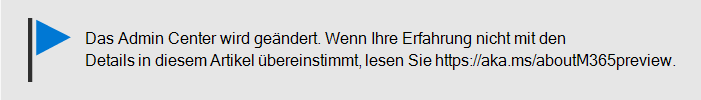

# Verwenden der schrittweisen Anleitung zum Hinzufügen von AutoPilot-Geräten und -Profilen

Sie können Windows Autopilot verwenden, um **neue** Windows 10-Geräte für Ihr Unternehmen einzurichten, damit diese bereitgestellt werden, wenn Sie Sie an Ihre Mitarbeiter weitergeben.
  
## Geräteanforderungen

Geräte müssen diese Anforderungen erfüllen:
  
- Windows 10, Version 1703 oder höher
    
- Neue Geräte, die die Out-of-Box-Erfahrung von Windows noch nicht durchlaufen haben
    
## Befolgen der Setupanleitung zum Erstellen von Geräten und Profilen

Wenn Sie noch keine Gerätegruppen oder Profile erstellt haben, ist die beste Möglichkeit, mit der ersten Schritte zu beginnen, die schrittweise Anleitung. Sie können auch [Geräte hinzufügen](create-and-edit-autopilot-devices.md) und Ihnen [profile zuweisen](create-and-edit-autopilot-profiles.md) , ohne die Anleitung zu verwenden. 
  
1. Wechseln Sie zum Admin Center auf <a href="https://go.microsoft.com/fwlink/p/?linkid=837890" target="_blank">https://admin.microsoft.com</a>.

2. Wählen Sie im linken Navigationsbereich **Geräte** \> **Autopilot**aus.

    
  
2. Klicken oder tippen Sie auf der Seite **Autopilot** auf **Start Guide**.
    
    
  
3. Navigieren Sie auf der Seite **Upload. CSV-Datei mit Geräteliste** zu einem Speicherort, an dem Sie die vorbereitete bereit haben. CSV-Datei, und **Öffnen** \> Sie dann **Next**. Die Datei muss drei Kopfzeilen aufweisen:
    
    - Spalte A: Seriennummer des Geräts
    
    - Spalte B: Windows-Produkt-ID
    
    - Spalte C: Hardwarehash
    
    Sie können diese Informationen von Ihrem Hardwareanbieter abrufen, oder Sie können das [PowerShell-Skript Get-WindowsAutoPilotInfo](https://www.powershellgallery.com/packages/Get-WindowsAutoPilotInfo) verwenden, um eine CSV-Datei zu generieren. 
    
    Weitere Informationen finden Sie unter [CSV-Datei mit Geräteliste](https://support.office.com/article/932e3676-2491-49f0-9177-d893d2f5276e). Sie können auf der Seite **CSV-Datei mit Liste der Geräte hochladen** auch eine Beispieldatei herunterladen. 
    
4. Auf der Seite **Profil zuweisen** können Sie entweder ein vorhandenes Profil auswählen oder einen neuen erstellen. Wenn Sie noch nicht über eine verfügen, werden Sie aufgefordert, eine zu erstellen. 
    
    Ein Profil ist eine Sammlung von Einstellungen, die für ein einzelnes Gerät oder eine Gruppe von Geräten gelten können.
    
    Die Standardfeatures sind erforderlich und werden automatisch festgelegt. Es folgen die Standardfunktionen:
    
    - Überspringen Sie Cortana, OneDrive und OEM-Registrierung.
    
    - Erstellen Sie eine Anmeldeumgebung mit Ihrem Unternehmensbranding.
    
    - Verbinden Sie Ihre Geräte mit Azure Active Directory-Konten, und registrieren Sie Sie automatisch für die Verwaltung durch Microsoft 365 Business.
    
    Weitere Informationen finden Sie unter [Informationen zu Autopilot-Profileinstellungen](autopilot-profile-settings.md). 
    
5. Die anderen Einstellungen sind **Datenschutzeinstellungen überspringen** und **Nicht zulassen, dass der Benutzer der lokale Administrator wird**. Beide sind standardmäßig auf **Aus** festgelegt. 
    
    Wählen Sie **Weiter** aus.
    
6. **Sie haben** angegeben, dass das Profil, das Sie erstellt (oder ausgewählt haben), auf die Gerätegruppe angewendet wird, die Sie durch Hochladen der Geräteliste erstellt haben. Die Einstellungen werden wirksam, wenn sich die Geräte Benutzer als nächstes anmelden. Wählen Sie **Schließen** aus.
    
