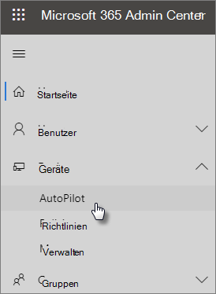

# Verwenden der schrittweisen Anleitung zum Hinzufügen von AutoPilot-Geräten und -Profilen

Sie können Windows AutoPilot verwenden, um **neue** Windows 10-Geräte für Ihr Unternehmen einzurichten, damit diese einsatzbereit sind, wenn Sie sie Ihren Mitarbeitern übergeben.
  
## Geräteanforderungen

Geräte müssen die folgenden Anforderungen erfüllen:
  
- Windows 10, Version 1703 oder höher
    
- Neue Geräte, die noch nicht über Windows Out-of-Box-Erfahrung verfügen
    
## Befolgen der Setupanleitung zum Erstellen von Geräten und Profilen

Wenn Sie noch keine Gerätegruppen oder Profile erstellt haben, können Sie am besten mit der schrittweisen Anleitung beginnen. Sie können auch [Geräte hinzufügen](create-and-edit-autopilot-devices.md) und ihnen [Profile zuweisen,](create-and-edit-autopilot-profiles.md) ohne die Anleitung zu verwenden. 
  
1. Wechseln Sie zum Admin Center unter <a href="https://go.microsoft.com/fwlink/p/?linkid=837890" target="_blank">https://admin.microsoft.com</a>.

2. Wählen Sie im linken  Navigationsbereich \> **"Geräte-AutoPilot"** aus.

    
  
2. Klicken oder tippen Sie auf der **AutoPilot-Seite** auf **die Startanleitung.**
    
    
  
3. Navigieren Sie auf der **Seite Hochladen .csv Datei mit der Liste der Geräte** zu einem Speicherort, an dem Sie die vorbereitete .CSV Datei haben, und öffnen Sie dann  \> **"Weiter".** Die Datei muss drei Kopfzeilen aufweisen:
    
    - Spalte A: Seriennummer des Geräts
    
    - Spalte B: Windows-Produkt-ID
    
    - Spalte C: Hardwarehash
    
    Sie können diese Informationen von Ihrem Hardwareanbieter abrufen oder das [PowerShell-Skript "Get-WindowsAutoPilotInfo"](https://www.powershellgallery.com/packages/Get-WindowsAutoPilotInfo) verwenden, um eine CSV-Datei zu generieren. 
    
    Weitere Informationen finden Sie unter [CSV-Datei mit Geräteliste](../admin/misc/device-list.md). Sie können auf der Seite **CSV-Datei mit Liste der Geräte hochladen** auch eine Beispieldatei herunterladen. 
    
> [!NOTE]
> Dieses Skript verwendet WMI, um Eigenschaften abzurufen, die ein Kunde benötigt, um ein Gerät bei Windows Autopilot zu registrieren. Beachten Sie, dass es normal ist, dass die resultierende CSV-Datei keinen PKID-Wert (Windows Product ID) erfasst, da dies nicht erforderlich ist, um ein Gerät zu registrieren, und PKID null in der CSV-Ausgabe ist völlig in Ordnung. Es werden nur die Seriennummer und der Hardwarehash aufgefüllt.
    
4. Auf der Seite **"Profil zuweisen"** können Sie entweder ein vorhandenes Profil auswählen oder ein neues erstellen. Wenn Sie noch keine haben, werden Sie aufgefordert, eine zu erstellen. 
    
    Ein Profil ist eine Sammlung von Einstellungen, die für ein einzelnes Gerät oder eine Gruppe von Geräten gelten können.
    
    Die Standardfeatures sind erforderlich und werden automatisch festgelegt. Es folgen die Standardfunktionen:
    
    - Überspringen Sie Cortana-, OneDrive- und OEM-Registrierung.
    
    - Erstellen Sie eine Anmeldeumgebung mit Ihrem Unternehmensbranding.
    
    - Verbinden Sie Ihre Geräte auf Azure Active Directory Konten, und registrieren Sie diese automatisch, um von Microsoft 365 Business Premium verwaltet zu werden.
    
    Weitere Informationen finden Sie unter [Informationen zu AutoPilot-Profileinstellungen.](autopilot-profile-settings.md) 
    
5. Die anderen Einstellungen sind **Datenschutzeinstellungen überspringen** und **Nicht zulassen, dass der Benutzer der lokale Administrator wird**. Beide sind standardmäßig auf **Aus** festgelegt. 
    
    Wählen Sie **Weiter** aus.
    
6. **Wenn Sie fertig sind,** wird angegeben, dass das von Ihnen erstellte (oder gewählte) Profil auf die Gerätegruppe angewendet wird, die Sie erstellt haben, indem Sie die Liste der Geräte hochladen. Die Einstellungen sind wirksam, wenn sich die Gerätebenutzer als Nächstes anmelden. Wählen Sie **Schließen** aus.

## Verwandte Inhalte

[Informationen zu AutoPilot-Profileinstellungen](autopilot-profile-settings.md) (Artikel)\
[Optionen zum Schutz Ihrer Geräte und App-Daten](../admin/devices/choose-device-security.md) (Artikel)
