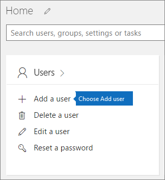

# Hinzufügen weiterer Benutzer zu Microsoft 365 BusinessAdd additional users to Microsoft 365 Business

## Hinzufügen neuer BenutzerAdd new users

Wechseln Sie im Admin Center zur Karte **Benutzer** \> **Benutzer hinzufügen**.In the admin center go to the **Users** card \> **Add a user**.
  

  
Geben Sie im Bereich **Neuer Benutzer** die erforderlichen Informationen ein.In the **New user** panel, type in the required information. 
  
Sie können auch unter **Kontaktinformationen** zusätzliche Informationen eingeben, unter der Einstellung **Kennwort** auswählen, wie Sie das Kennwort festlegen möchten, und unter **Rollen** die jeweilige Rolle zuweisen.You can also enter additional information under **Contact information**, choose how you set the password under **Password** setting, and assign roles under the **Roles**.
  

  
Setzen Sie im Abschnitt "Produktlizenzen" die Einstellung für die **Microsoft 365 Business**-Produktlizenz auf **Ein**.In the Product licenses section, set **Microsoft 365 Business** product license setting to **On**.
  

  

  

