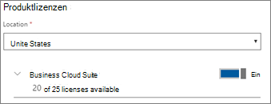

# Hinzufügen weiterer Benutzer zu Microsoft 365 BusinessAdd more users to Microsoft 365 Business

## Neue Benutzer hinzufügenAdd new users

Sehen Sie sich ein kurzes Video zum Hinzufügen eines Benutzers an.Watch a short video about adding a user.   

> [!VIDEO https://www.microsoft.com/videoplayer/embed/RE1FOfN] 

Wenn Sie dieses Video hilfreich fanden, sehen Sie sich bitte die [komplette Schulungsserie für kleine Unternehmen und jene, die neu bei Microsoft 365 sind](https://support.office.com/article/6ab4bbcd-79cf-4000-a0bd-d42ce4d12816), an.If you found this video helpful, check out the [complete training series for small businesses and those new to Microsoft 365](https://support.office.com/article/6ab4bbcd-79cf-4000-a0bd-d42ce4d12816).

So fügen Sie einen Benutzer hinzu:To add a user:

1. Wechseln Sie zum Admin Center unter <a href="https://go.microsoft.com/fwlink/p/?linkid=837890" target="_blank">https://admin.microsoft.com</a>.Go to the admin center at <a href="https://go.microsoft.com/fwlink/p/?linkid=837890" target="_blank">https://admin.microsoft.com</a>. 
2. Wählen Sie im linken Navigationsbereich **Benutzer** \> **aktive Benutzer**aus.In the left navigation pane, choose **Users** \> **Active users**.
3. Wählen Sie auf der Seite **aktive Benutzer** die Option **Benutzer hinzufügen**aus.On the **Active users** page, choose **Add a user**.
4. Geben Sie im **neuen Benutzer** Panel die erforderlichen Informationen ein.In the **New user** panel, type the required information. 
  
    Sie können weitere Informationen unter **Kontaktinformationen**eingeben, auswählen, wie Sie das Kennwort unter **Kenn Wort** Einstellung festlegen, und Rollen unter **Rollen**zuweisen.You can enter more information under **Contact information**, choose how you set the password under **Password** setting, and assign roles under **Roles**.
      
    
      
    Legen Sie im Abschnitt Produktlizenzen die Einstellung **Microsoft 365 Business** Product License auf **ein**fest.In the Product licenses section, set the **Microsoft 365 Business** product license setting to **On**.
      
    
  
Weitere Informationen zum Hinzufügen von Benutzern finden Sie unter [Hinzufügen von Benutzern einzeln oder in einem Massen](https://docs.microsoft.com/office365/admin/add-users/add-users)Vorgang.For  more information about adding users, see [Add users individually or in bulk](https://docs.microsoft.com/office365/admin/add-users/add-users).
  
