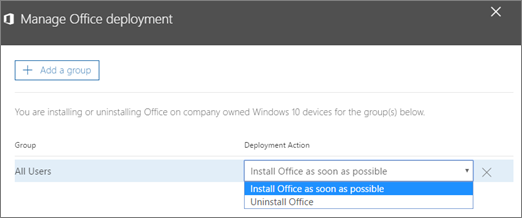

# Automatisches Installieren oder Deinstallieren von Office auf Windows 10-GerätenAutomatically install or uninstall Office on Windows 10 devices

[] Sie können Office über das Microsoft 365 Business Admin Center auf Windows 10-PCs schnell und einfach installieren.You can quickly and easily install Office to Windows 10 PCs from the Microsoft 365 Business admin center.
  
Um zu verstehen, wie dies bei zuvor installierten Office-Apps funktioniert, lesen Sie [Vorbereiten der Office-Clientinstallation](prepare-for-office-client-deployment.md), bevor Sie mit diesem Vorgang beginnen.To understand how this works with previously installed Office apps, read [Prepare for Office client installation](prepare-for-office-client-deployment.md) before you get started. 
  
## Verwalten von Office-BereitstellungenManage Office deployments

1. Melden Sie sich beim [Admin Center](https://aka.ms/bcsportal) mit globalen Administratoranmeldeinformationen an.Sign in to the [admin center](https://aka.ms/bcsportal) with global admin credentials. 
    
2. Wählen Sie auf der Karte **Geräte** die Option **Office-Bereitstellung verwalten** aus.On the **Devices** card, choose **Manage Office Deployment**.
      Wenn die Karte **Geräteaktionen** nicht angezeigt wird, klicken Sie auf der Admin Center- **Start** Seite auf **Hinzufügen** (+), um Sie Ihrer Administrator-Homepage hinzuzufügen.If you do not see the **Device actions** card, in the admin center **Home** page, click **Add** (+) to add it to your admin home.
    
    
  
3. Wählen Sie in dem daraufhin geöffneten Bereich **Office-Bereitstellung verwalten** die Option **Gruppe hinzufügen** und dann die gewünschte(n) Gruppe(n) aus.On the **Manage Office deployment** pane that opens, choose **Add a group**, then select the groups you want use.
    
4. Nachdem Sie diese Gruppe(n) hinzugefügt haben, wählen Sie aus der Dropdownliste **Bereitstellungsaktion** einen der beiden Einträge **Office schnellstmöglich installieren** oder **Office deinstallieren** aus.After you have added the group or groups you want to use, from the **Deployment Action** drop-down, select either **Install Office as soon as possible** or **Uninstall Office**.
    
    
  
5. Wählen Sie **Weiter**\> aus, um die Einstellungen zu überprüfen. Wählen Sie dann **Bestätigen** aus.Choose **Next** \> review the settings and then choose **Confirm**.
    
Eine 32-Bit-Instanz von Office wird auf den Geräten automatisch installiert oder deinstalliert, deren Besitzer die Benutzer sind, die Sie durch die von Ihnen verwendete(n) Gruppe(n) festgelegt haben.A 32-bit Office will be automatically installed, or uninstalled in the devices owned by users specified by the group or groups you used.
  
Um dies zu überprüfen, können Sie den Task-Manager auf einem Computer öffnen, der für eine Office-Installation ausgewählt wurde, und nach dem Prozess "Microsoft Office Klick-und-Los" suchen.To verify you can open the Task Manager on a computer that was selected for an Office install and look for Microsoft Office Click-to-Run process.
  

